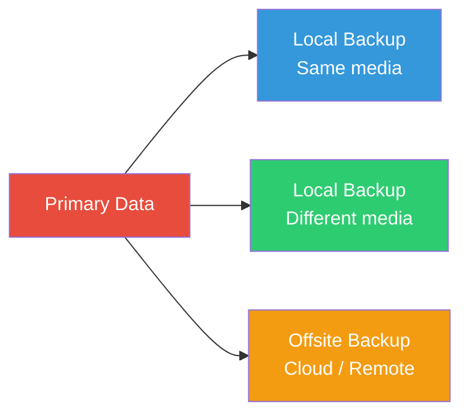
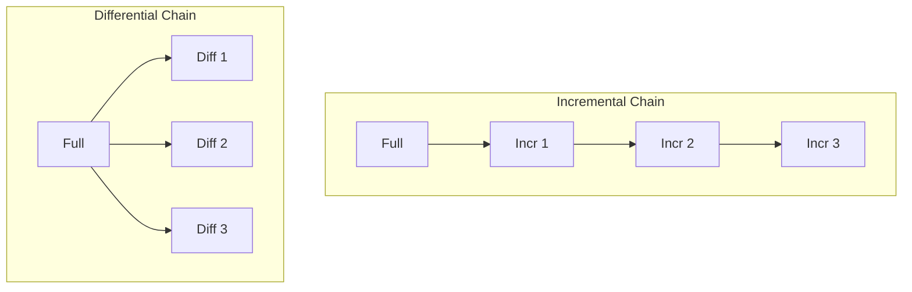
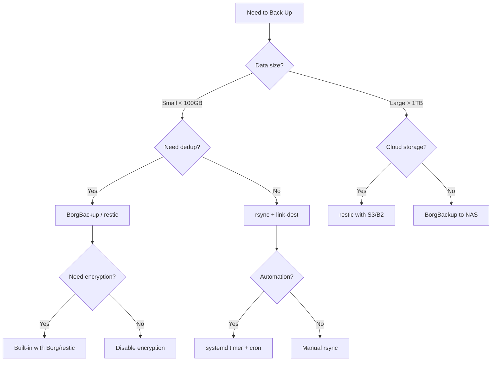

# Backup Strategies

## Introduction

Backup is one of the most critical responsibilities of a Linux system administrator. A well-designed backup strategy protects against data loss from hardware failure, human error, ransomware, and natural disasters. This chapter covers the essential tools and methodologies for backing up Linux systems, from simple file-level copies to deduplicated, encrypted, and versioned backup archives.

No single backup tool fits every scenario. The choice depends on recovery time objectives (RTO), recovery point objectives (RPO), data volume, network bandwidth, and whether you need bare-metal recovery or just file-level restores. Understanding the trade-offs between full, incremental, and differential backups — and how tools like `rsync`, `tar`, `borgbackup`, and `restic` implement them — is fundamental to building a resilient infrastructure.

## The 3-2-1 Backup Rule

The 3-2-1 rule is the gold standard for backup strategy:

- **3** copies of your data (1 primary + 2 backups)
- **2** different storage media (e.g., local disk + cloud)
- **1** offsite copy (geographically separate)



### Variations

- **3-2-1-1-0**: Add 1 air-gapped copy, 0 errors (verified restores)
- **4-3-2**: For highly critical data — 4 copies, 3 media types, 2 offsite

## Full, Incremental, and Differential Backups

### Full Backup

A complete copy of all data. Simplest to restore but most expensive in storage and time.

```
Day 1: [Full backup - 100 GB]
Day 2: [Full backup - 100 GB]  ← 200 GB total
Day 3: [Full backup - 100 GB]  ← 300 GB total
```

### Incremental Backup

Backs up only data changed since the last backup of *any* type. Requires the full backup plus every subsequent incremental to restore.

```
Day 1: [Full - 100 GB]
Day 2: [Incr - 5 GB]   ← only changes since Day 1
Day 3: [Incr - 3 GB]   ← only changes since Day 2
Day 4: [Incr - 8 GB]   ← only changes since Day 3
Restore Day 3 = Full + Incr2 + Incr3
```

### Differential Backup

Backs up all data changed since the last *full* backup. Faster restore than incremental (only full + latest differential), but the differential grows over time.

```
Day 1: [Full - 100 GB]
Day 2: [Diff - 5 GB]    ← changes since Day 1
Day 3: [Diff - 8 GB]    ← changes since Day 1 (includes Day 2 changes too)
Day 4: [Diff - 16 GB]   ← changes since Day 1 (growing)
Restore Day 3 = Full + Diff3
```



## rsync

`rsync` is the Swiss Army knife of file synchronization on Linux. It uses a delta-transfer algorithm to send only changed portions of files, making it extremely efficient for incremental file-level backups.

### How rsync Works

1. Sender and receiver exchange file lists and metadata
2. For each file, rsync computes rolling checksums (Adler-32) on blocks
3. Only mismatched blocks are transferred
4. Files are reconstructed on the receiver side

### Basic Usage

```bash
# Local backup
rsync -avh --progress /home/user/ /backup/home-user/

# Remote backup over SSH
rsync -avh --progress -e ssh /home/user/ user@backup-server:/backup/home-user/

# Dry run (see what would happen)
rsync -avh --dry-run /home/user/ /backup/home-user/
```

**Output:**
```
sending incremental file list
user/documents/report.pdf
        2.45M  100%   12.50MB/s    0:00:00 (xfr#1, to-chk=14532/14535)

sent 2.50M bytes  received 42.1K bytes  5.08M bytes/sec
total size is 12.89G  speedup is 5,071.23
```

### Key Flags

| Flag | Purpose |
|------|---------|
| `-a` | Archive mode (recursive, preserves symlinks, permissions, timestamps, etc.) |
| `-v` | Verbose output |
| `-h` | Human-readable numbers |
| `-z` | Compress during transfer |
| `--delete` | Delete files on receiver that don't exist on sender |
| `--exclude` | Exclude patterns |
| `--link-dest` | Hard-link unchanged files to a reference directory (space-efficient incremental) |
| `--backup` | Make backups of files that will be overwritten |
| `--bwlimit=LIMIT` | Bandwidth limit in KB/s |

### Incremental Backup with rsync (Link-Dest)

The `--link-dest` approach creates incremental backups using hard links — unchanged files share inodes, consuming almost no extra space.

```bash
#!/bin/bash
# incremental-backup.sh
BACKUP_DIR="/backup/host"
DATE=$(date +%Y-%m-%d_%H%M%S)
LATEST="$BACKUP_DIR/latest"
DEST="$BACKUP_DIR/$DATE"

rsync -avh --delete \
    --link-dest="$LATEST" \
    /home/ "$DEST/"

# Update the 'latest' symlink
rm -f "$LATEST"
ln -s "$DEST" "$LATEST"
```

```bash
# After three backups, check disk usage
du -sh /backup/host/2026-07-*
# 2026-07-19_020001    12G    ← full
# 2026-07-20_020001   1.2G    ← incremental (only changed files)
# 2026-07-21_020001   800M    ← incremental
```

### Exclude Patterns

```bash
rsync -avh \
    --exclude='.cache' \
    --exclude='*.tmp' \
    --exclude='/proc' \
    --exclude='/sys' \
    --exclude='/dev' \
    --exclude='/mnt' \
    / /backup/full-system/
```

## tar

`tar` (tape archive) is the classic Unix archiving tool. While it doesn't do delta transfers like rsync, it's excellent for creating portable, compressed archives.

### Basic tar Backup

```bash
# Full backup
tar -czf /backup/full-$(date +%Y%m%d).tar.gz /home/ /etc/

# With verbose output
tar -czvf /backup/full-20260721.tar.gz /home/ /etc/

# Exclude patterns
tar -czf /backup/home.tar.gz --exclude='*.cache' /home/
```

### Incremental tar Backups

`tar` supports incremental backups using snapshot files that track filesystem changes.

```bash
# Level 0 (full) backup
tar --listed-incremental=/backup/snapshot.snar \
    -czf /backup/level0.tar.gz /home/

# Level 1 (incremental) backup — uses the same snapshot file
tar --listed-incremental=/backup/snapshot.snar \
    -czf /backup/level1.tar.gz /home/

# Level 2 (another incremental)
tar --listed-incremental=/backup/snapshot.snar \
    -czf /backup/level2.tar.gz /home/
```

### Restoring Incremental tar Backups

```bash
# Restore full backup first
tar --listed-incremental=/dev/null -xzf /backup/level0.tar.gz

# Then apply incrementals in order
tar --listed-incremental=/dev/null -xzf /backup/level1.tar.gz
tar --listed-incremental=/dev/null -xzf /backup/level2.tar.gz
```

### Backup to Tape

`tar` was originally designed for tape drives:

```bash
# Write to tape device
tar -czf /dev/st0 /home/ /etc/

# Append to tape
tar -czf /dev/st0 --append /home/newdata/

# List tape contents
tar -tzf /dev/st0

# Rewind tape
mt -f /dev/st0 rewind
```

## BorgBackup

[BorgBackup](https://www.borgbackup.org/) (borg) is a deduplicating, compressing, and encrypting backup program. It's one of the most sophisticated open-source backup tools available.

### Key Features

- **Deduplication**: Content-defined chunking — identical data blocks are stored only once, even across different backups
- **Compression**: lz4, zstd, zlib, lzma
- **Encryption**: AES-256-CTR with HMAC-SHA256 or Blake2b
- **Mountable archives**: FUSE mount for easy browsing
- **Pruning**: Automatic retention policies

### Initialization

```bash
# Initialize a local repository
borg init --encryption=repokey /backup/borg-repo

# Initialize a remote repository
borg init --encryption=repokey ssh://user@backup-server/backup/borg-repo

# Initialize with a specific encryption mode
borg init --encryption=repokey-blake2 /backup/borg-repo
```

### Creating Backups

```bash
# Basic backup
borg create /backup/borg-repo::daily-{now:%Y-%m-%d} /home/ /etc/

# With compression and exclusions
borg create \
    --compression zstd,3 \
    --exclude '*.cache' \
    --exclude '/home/*/.local/share/Trash' \
    /backup/borg-repo::daily-{now:%Y-%m-%d_%H:%M} \
    /home/ /etc/ /var/log/

# Verbose output showing progress
borg create --progress --stats \
    /backup/borg-repo::daily-2026-07-21 \
    /home/
```

**Output:**
```
------------------------------------------------------------------------------
Archive name: daily-2026-07-21
Archive fingerprint: a1b2c3d4e5f6...
Time (start): Tue, 2026-07-21 02:00:01
Time (end):   Tue, 2026-07-21 02:15:34
Duration: 15 min 33.12 sec
Number of files: 148,392
Utilization of max. archive size: 0%
------------------------------------------------------------------------------
                       Original size    Compressed size    Deduplicated size
This archive:               12.89 GB            8.23 GB            1.45 GB
All archives:              156.78 GB           98.45 GB           12.34 GB
------------------------------------------------------------------------------
```

### Listing and Restoring

```bash
# List archives
borg list /backup/borg-repo

# List files in an archive
borg list /backup/borg-repo::daily-2026-07-21

# Extract (restore)
cd /restore
borg extract /backup/borg-repo::daily-2026-07-21

# Extract specific paths
borg extract /backup/borg-repo::daily-2026-07-21 home/user/documents/

# Mount archive as filesystem
mkdir /mnt/borg
borg mount /backup/borg-repo::daily-2026-07-21 /mnt/borg
ls /mnt/borg/home/user/
borg umount /mnt/borg
```

### Pruning (Retention Policies)

```bash
# Keep 7 daily, 4 weekly, 6 monthly, 1 yearly backups
borg prune \
    --keep-daily=7 \
    --keep-weekly=4 \
    --keep-monthly=6 \
    --keep-yearly=1 \
    /backup/borg-repo

# Dry run to see what would be deleted
borg prune --dry-run --keep-daily=7 /backup/borg-repo
```

### Automating with a Script

```bash
#!/bin/bash
# /usr/local/bin/borg-backup.sh
export BORG_REPO="/backup/borg-repo"
export BORG_PASSPHRASE="your-passphrase-here"  # or use BORG_PASSCOMMAND

# Create backup
borg create \
    --compression zstd,3 \
    --exclude '*.cache' \
    --exclude '/home/*/.local/share/Trash' \
    "::{hostname}-{now:%Y-%m-%d_%H:%M}" \
    /home/ /etc/ /var/log/

# Prune old backups
borg prune --keep-daily=7 --keep-weekly=4 --keep-monthly=6

# Check repository integrity (weekly)
if [ "$(date +%u)" = "7" ]; then
    borg check
fi
```

## restic

[restic](https://restic.net/) is another modern deduplicating backup program with a focus on simplicity, speed, and security. It supports numerous storage backends.

### Key Features

- **Deduplication**: Content-defined chunking (similar to borg)
- **Encryption**: AES-256-Poly1305
- **Multiple backends**: Local, SFTP, S3, Azure, GCS, Backblaze B2, REST server
- **No server-side component**: Works with any standard storage
- **Snapshots**: Each backup is a snapshot with a unique ID

### Initialization

```bash
# Local repository
restic init --repo /backup/restic-repo

# S3 backend
export AWS_ACCESS_KEY_ID="..."
export AWS_SECRET_ACCESS_KEY="..."
restic init --repo s3:s3.amazonaws.com/my-backup-bucket

# SFTP backend
restic init --repo sftp:user@backup-server:/backup/restic-repo
```

### Creating Backups

```bash
# Basic backup
restic -r /backup/restic-repo backup /home/ /etc/

# With tags and exclusions
restic -r /backup/restic-repo backup \
    --tag daily \
    --tag "system-backup" \
    --exclude '*.cache' \
    --exclude '/home/*/.local/share/Trash' \
    /home/ /etc/

# Backup with stdin (for database dumps)
pg_dump mydb | restic -r /backup/restic-repo backup --stdin --stdin-filename db.sql
```

**Output:**
```
repository 1a2b3c4d opened (repository version 2)
no parent snapshot found, will read all files
[0:01] 100.00%  148392 / 148392 items
duration: 0:15:33
snapshot abc123def saved
```

### Listing and Restoring

```bash
# List snapshots
restic -r /backup/restic-repo snapshots

# List files in a snapshot
restic -r /backup/restic-repo ls abc123def

# Restore latest snapshot
restic -r /backup/restic-repo restore latest --target /restore/

# Restore specific paths
restic -r /backup/restic-repo restore abc123def \
    --target /restore/ \
    --include "/home/user/documents/"

# Mount snapshot
restic -r /backup/restic-repo mount /mnt/restic &
ls /mnt/restic/snapshots/latest/home/
```

### Pruning

```bash
# Keep policy
restic -r /backup/restic-repo forget \
    --keep-daily 7 \
    --keep-weekly 4 \
    --keep-monthly 6 \
    --keep-yearly 1 \
    --prune
```

### Verification

```bash
# Check repository integrity
restic -r /backup/restic-repo check

# Check and read all data (slower but thorough)
restic -r /backup/restic-repo check --read-data
```

## Borg vs Restic Comparison

| Feature | BorgBackup | restic |
|---------|-----------|--------|
| Deduplication | Yes (content-defined) | Yes (content-defined) |
| Encryption | AES-256-CTR + HMAC | AES-256-Poly1305 |
| Compression | Yes (lz4, zstd, zlib, lzma) | Yes (zstd, since v0.16) |
| Backends | Local, SSH | Local, SFTP, S3, Azure, GCS, B2 |
| Server component | borg serve | None needed |
| Mount support | FUSE | FUSE |
| Parallelism | Limited | Multi-core |
| Maturity | Very mature | Mature |
| Language | Python/C | Go |

## Backup Verification

A backup that hasn't been tested is not a backup. Regular verification is essential:

```bash
# Verify borg backup integrity
borg check --verify-data /backup/borg-repo

# Verify restic backup
restic -r /backup/restic-repo check --read-data

# Test restore to temporary location
borg extract /backup/borg-repo::daily-2026-07-21 --target /tmp/restore-test/
diff -rq /home/user/documents/ /tmp/restore-test/home/user/documents/
```

## Encryption and Security

### GPG Encryption for tar Backups

```bash
# Create encrypted tar backup
tar -czf - /home/ | gpg --encrypt --recipient user@example.com \
    > /backup/home-encrypted.tar.gz.gpg

# Decrypt and restore
gpg --decrypt /backup/home-encrypted.tar.gz.gpg | tar -xzf - -C /restore/
```

### SSH Key-Based Remote Backups

```bash
# Generate dedicated backup key
ssh-keygen -t ed25519 -f ~/.ssh/backup-key -N ""

# Copy public key to backup server
ssh-copy-id -i ~/.ssh/backup-key.pub user@backup-server

# Use in scripts
rsync -avh -e "ssh -i ~/.ssh/backup-key" /home/ user@backup-server:/backup/
```

## Automation with systemd Timers

```ini
# /etc/systemd/system/backup.service
[Unit]
Description=Daily backup
Requires=network-online.target

[Service]
Type=oneshot
ExecStart=/usr/local/bin/borg-backup.sh
Nice=19
IOSchedulingClass=idle
```

```ini
# /etc/systemd/system/backup.timer
[Unit]
Description=Daily backup timer

[Timer]
OnCalendar=*-*-* 02:00:00
Persistent=true
RandomizedDelaySec=900

[Install]
WantedBy=timers.target
```

```bash
# Enable and start
systemctl enable --now backup.timer

# Check status
systemctl list-timers
```

## Mermaid: Backup Decision Flowchart



## References and Further Reading

- [rsync man page](https://man7.org/linux/man-pages/man1/rsync.1.html)
- [tar man page](https://man7.org/linux/man-pages/man1/tar.1.html)
- [BorgBackup Documentation](https://borgbackup.readthedocs.io/)
- [restic Documentation](https://restic.readthedocs.io/)
- [Backup Best Practices (LWN.net)](https://lwn.net/Articles/706729/)
- [3-2-1 Backup Rule Explained](https://www.backblaze.com/blog/the-3-2-1-backup-strategy/)

## Related Topics

- [File Systems](../kernel/filesystems/) — Understanding filesystems helps with backup strategy
- [RAID](./) — RAID is not a backup, but complements backup strategies
- [Security: Encryption](../security/) — Encrypting backups at rest and in transit
- [System Monitoring](./performance.md) — Monitoring backup job completion and performance
