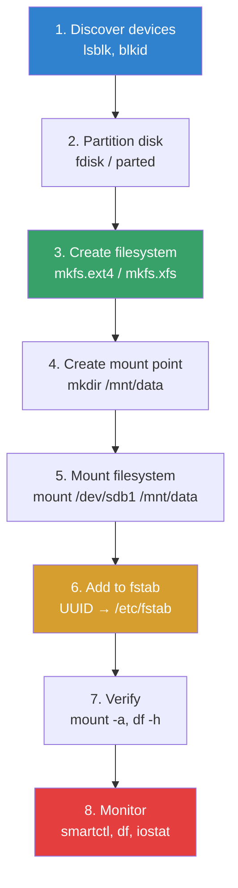

# Disk Management

## Introduction

Disk management is one of the most critical responsibilities of a Linux system administrator. It encompasses everything from partitioning raw disks and creating filesystems to mounting storage, monitoring disk health, and troubleshooting I/O issues. Mismanagement of storage can lead to data loss, system downtime, and cascading failures across dependent services.

This page covers the essential disk management tools and workflows: discovering block devices, partitioning disks, creating filesystems, mounting storage, and verifying filesystem integrity.

## Discovering Block Devices

### `lsblk` — List Block Devices

`lsblk` is the primary tool for viewing the block device tree, showing disks, partitions, and their relationships:

```bash
# Basic listing
lsblk
# NAME   MAJ:MIN RM   SIZE RO TYPE MOUNTPOINTS
# sda      8:0    0   500G  0 disk
# ├─sda1   8:1    0   512M  0 part /boot/efi
# ├─sda2   8:2    0     1G  0 part /boot
# └─sda3   8:3    0   498G  0 part
#   ├─vg0-root  253:0    0    50G  0 lvm  /
#   ├─vg0-home  253:1    0   200G  0 lvm  /home
#   └─vg0-swap  253:2    0     8G  0 lvm  [SWAP]
# sdb      8:16   0     2T  0 disk
# └─sdb1   8:17   0     2T  0 part /data
# nvme0n1  259:0  0   1TB  0 disk
# ├─nvme0n1p1 259:1 0   512M  0 part
# └─nvme0n1p2 259:2 0   999G  0 part

# Detailed output with filesystem info
lsblk -f
# NAME   FSTYPE FSVER LABEL UUID                                 FSAVAIL FSUSE% MOUNTPOINTS
# sda
# ├─sda1 vfat   FAT32      ABCD-1234                             450M    12% /boot/efi
# ├─sda2 ext4   1.0         12345678-abcd-efgh-ijkl-123456789abc 700M    25% /boot
# └─sda3 LVM2_member        87654321-dcba-hgfe-lkjih-987654321abc

# Show device permissions and owners
lsblk -m
# NAME         SIZE OWNER GROUP MODE
# sda         500G root  disk  brw-rw----
# ├─sda1      512M root  disk  brw-rw----

# JSON output (useful for scripting)
lsblk -J

# Show SCSI devices
lsblk -S
# NAME HCTL       TYPE VENDOR   MODEL             REV TRAN
# sda  0:0:0:0    disk ATA      Samsung SSD 870   0A  sata
```

### `blkid` — Block Device Identification

`blkid` shows filesystem types, labels, and UUIDs:

```bash
# List all block devices with UUIDs
blkid
# /dev/sda1: LABEL="EFI" UUID="ABCD-1234" TYPE="vfat" PARTUUID="1234abcd-..."
# /dev/sda2: LABEL="boot" UUID="12345678-abcd-..." TYPE="ext4" PARTUUID="..."
# /dev/sda3: UUID="87654321-dcba-..." TYPE="LVM2_member" PARTUUID="..."

# Specific device
blkid /dev/sda1
# /dev/sda1: LABEL="EFI" UUID="ABCD-1234" TYPE="vfat" PARTUUID="1234abcd-01"

# Output for /etc/fstab
blkid -o list
# Device           LABEL   UUID                                 TYPE  MOUNT
# /dev/sda1        EFI     ABCD-1234                            vfat  /boot/efi
# /dev/sda2        boot    12345678-abcd-...                    ext4  /boot

# Export format
blkid -o export /dev/sda1
# DEVNAME=/dev/sda1
# LABEL=EFI
# UUID=ABCD-1234
# TYPE=vfat
# PARTUUID=1234abcd-01
```

## Partitioning Disks

### `fdisk` — MBR and GPT Partitioning

`fdisk` is the classic partitioning tool. Modern `fdisk` supports both MBR and GPT:

```bash
# Interactive mode
fdisk /dev/sdb

# Common fdisk commands:
# m    - help
# p    - print partition table
# n    - new partition
# d    - delete partition
# t    - change partition type
# w    - write changes and exit
# q    - quit without saving

# Create a new GPT partition table
# (in fdisk interactive mode)
# g    - create new GPT disk label
# n    - new partition (accept defaults for full disk)
# t    - change type (83 = Linux, 8e = LVM, fd = RAID)
# w    - write

# Non-interactive: create GPT with one partition
echo -e "g\nn\n\n\n\nw" | fdisk /dev/sdb

# List partitions without entering interactive mode
fdisk -l /dev/sdb
# Disk /dev/sdb: 2 TiB, 2199023255552 bytes, 4294967296 sectors
# Disk model: ST2000DM008-2FR1
# Units: sectors of 1 * 512 = 512 bytes
# Sector size (logical/physical): 512 bytes / 4096 bytes
# I/O size (minimum/optimal): 4096 bytes / 4096 bytes
# Disklabel type: gpt
# Disk identifier: 12345678-ABCD-...
#
# Device     Start        End    Sectors  Size Type
# /dev/sdb1  2048 4294967262 4294965215    2T Linux filesystem
```

### `parted` — Advanced Partitioning

`parted` is more powerful than `fdisk`, supporting scripting and advanced features:

```bash
# Interactive mode
parted /dev/sdb

# Non-interactive: create GPT with partitions
parted -s /dev/sdb mklabel gpt
parted -s /dev/sdb mkpart primary ext4 1MiB 100GiB
parted -s /dev/sdb mkpart primary xfs 100GiB 100%

# Show partition info
parted /dev/sdb print
# Model: ATA ST2000DM008-2FR1 (scsi)
# Disk /dev/sdb: 2199GB
# Sector size (logical/physical): 512B/4096B
# Partition Table: gpt
# Disk Flags:
#
# Number  Start   End     Size    File system  Name     Flags
#  1      1049kB  100GB   100GB   ext4         primary
#  2      100GB   2199GB  2099GB  xfs          primary

# Resize a partition
parted /dev/sdb resizepart 1 200GiB

# Align partitions for SSD performance
parted -s /dev/nvme0n1 mklabel gpt
parted -s /dev/nvme0n1 --align optimal mkpart primary 1MiB 100%
```

### GPT vs MBR

| Feature | MBR | GPT |
|---------|-----|-----|
| Max disk size | 2 TiB | 8 ZiB |
| Max partitions | 4 primary (or 3 + 1 extended) | 128 (default) |
| Boot | BIOS only | UEFI (with BIOS compat) |
| Redundancy | None | Backup header at disk end |
| Partition names | No | Yes |
| GUID identifiers | No | Yes |

## Creating Filesystems

### `mkfs` — Make Filesystem

```bash
# ext4 (most common for Linux)
mkfs.ext4 /dev/sdb1
# mke2fs 1.47.0 (5-Feb-2023)
# Creating filesystem with 244190592 4k blocks and 61054976 inodes
# Filesystem UUID: 12345678-abcd-...
# Superblock backups stored on blocks:
#     32768, 98304, 163840, 229376, 294912, 819200, 884736, ...
#
# Allocating group tables: done
# Writing inode tables: done
# Creating journal (262144 blocks): done
# Writing superblocks and filesystem accounting information: done

# With label
mkfs.ext4 -L "data" /dev/sdb1

# With specific block size and inode ratio
mkfs.ext4 -b 4096 -i 8192 /dev/sdb1

# XFS (better for large files, databases)
mkfs.xfs /dev/sdb2
# meta-data=/dev/sdb2              isize=512    agcount=4, agsize=128000000 blks
#          =                       sectsz=4096  attr=2, projid32bit=1
#          =                       crc=1        finobt=1, sparse=1, rmapbt=0
#          =                       reflink=1    bigtime=1 inobtcount=1
# data     =                       bsize=4096   blocks=512000000, imaxpct=5
#          =                       sunit=0      swidth=0 blks
# naming   =version 2              bsize=4096   ascii-ci=0, ftype=1
# log      =internal log           bsize=4096   blocks=2560000, version=2
#          =                       sectsz=4096  sunit=1 blks, lazy-count=1
# realtime =none                   extsz=4096   blocks=0, rtextents=0

# Btrfs (copy-on-write, snapshots, compression)
mkfs.btrfs -L "pool" /dev/sdb1

# With RAID1 profile for metadata
mkfs.btrfs -d raid1 -m raid1 -L "mirror" /dev/sdb1 /dev/sdc1

# Swap
mkswap /dev/sdb3
# Setting up swapspace version 1, size = 8 GiB
# UUID: abcd1234-...
```

### Filesystem Comparison

| Feature | ext4 | XFS | Btrfs | ZFS |
|---------|------|-----|-------|-----|
| Max file size | 16 TiB | 8 EiB | 16 EiB | 16 EiB |
| Max volume | 1 EiB | 8 EiB | 16 EiB | 256 ZiB |
| Snapshots | No (LVM needed) | No | Yes (native) | Yes (native) |
| Compression | No | No | Yes (zstd, lzo) | Yes (lz4, zstd) |
| Checksums | Metadata only | Metadata only | Full | Full |
| RAID | No (mdadm) | No (mdadm) | RAID 0/1/10/5/6 | RAID-Z1/2/3 |
| Online resize | Grow only | Grow only | Grow + shrink | N/A |
| Best for | General purpose | Large files, DB | Flexible storage | Enterprise |

## Mounting Filesystems

### `mount` and `umount`

```bash
# Mount a filesystem
mount /dev/sdb1 /mnt/data

# Mount with specific filesystem type
mount -t ext4 /dev/sdb1 /mnt/data

# Mount with options
mount -o rw,noatime,nodiratime /dev/sdb1 /mnt/data

# Common mount options
# rw/noatime        - Read-write, no access time updates
# noexec            - Don't allow execution
# nosuid            - Ignore SUID/SGID bits
# nodev             - Don't interpret device files
# discard           - SSD TRIM support
# compress=zstd     - Btrfs compression

# Bind mount
mount --bind /source/dir /mnt/point

# Mount all filesystems in /etc/fstab
mount -a

# Show mounted filesystems
mount | grep sdb
# /dev/sdb1 on /mnt/data type ext4 (rw,noatime,nodiratime)

# Or with findmnt (preferred)
findmnt
# TARGET        SOURCE     FSTYPE  OPTIONS
# /             /dev/sda3  ext4    rw,relatime
# ├─/boot       /dev/sda2  ext4    rw,relatime
# └─/home       /dev/sda3[/home] ext4 rw,relatime

# Unmount
umount /mnt/data
# Or: umount /dev/sdb1

# Force unmount busy filesystem
umount -l /mnt/data  # Lazy unmount (detach now, cleanup later)
umount -f /mnt/data  # Force (for NFS)
```

### `/etc/fstab` — Persistent Mounts

```bash
# /etc/fstab format:
# <device>  <mount>  <type>  <options>  <dump>  <fsck>

# Example /etc/fstab:
# <UUID>                              <mount>     <type>  <options>              <dump> <fsck>
UUID=12345678-abcd-efgh-ijkl-...     /           ext4    errors=remount-ro      0      1
UUID=ABCD-1234                        /boot/efi   vfat    umask=0077             0      1
UUID=87654321-dcba-hgfe-...           /data       ext4    defaults,noatime       0      2
UUID=abcd1234-...                     none        swap    sw                     0      0
tmpfs                                 /tmp        tmpfs   defaults,size=2G       0      0

# Find UUID for fstab
blkid /dev/sdb1
# /dev/sdb1: UUID="87654321-dcba-..." TYPE="ext4"

# Test fstab without rebooting
mount -a
# If no errors, fstab is correct

# Validate fstab syntax
findmnt --verify
```

## Checking and Repairing Filesystems

### `fsck` — Filesystem Check

```bash
# IMPORTANT: Never run fsck on a mounted filesystem!
# Always unmount first, or boot to rescue mode

# Check ext4 filesystem
fsck /dev/sdb1
# fsck from util-linux 2.39.3
# e2fsck 1.47.0 (5-Feb-2023)
# /dev/sdb1: clean, 123456/61054976 files, 98765432/244190592 blocks

# Force check even if clean
fsck -f /dev/sdb1

# Auto-repair (answer yes to all questions)
fsck -y /dev/sdb1

# Check only (no repair)
fsck -n /dev/sdb1

# Check specific filesystem type
fsck.ext4 -f /dev/sdb1
fsck.xfs /dev/sdb1     # XFS uses xfs_repair instead

# XFS repair
xfs_repair /dev/sdb2

# Btrfs check
btrfs check /dev/sdb1
btrfs check --repair /dev/sdb1  # DANGEROUS — use with caution
```

### When to Run fsck

```bash
# After unclean shutdown (power failure, kernel panic)
# The kernel checks /etc/fstab's last field (fsck order)
# 0 = skip, 1 = check first (root), 2 = check after root

# Force fsck on next boot (ext4)
touch /forcefsck
# Or tune2fs
tune2fs -C 20 /dev/sda2  # Set mount count high to trigger check

# Check filesystem stats
tune2fs -l /dev/sdb1 | grep -E "Mount count|Last checked|Check interval"
# Mount count:              5
# Maximum mount count:      30
# Last checked:             Mon Jul 15 02:00:00 2025
# Check interval:           15552000 (6 months)

# Set automatic check interval
tune2fs -c 25 /dev/sdb1           # Check every 25 mounts
tune2fs -i 6m /dev/sdb1           # Check every 6 months
tune2fs -c 0 -i 0 /dev/sdb1      # Disable automatic checks
```

## Disk Usage Analysis

```bash
# Overall disk usage
df -h
# Filesystem      Size  Used Avail Use% Mounted on
# /dev/sda3        498G   50G  423G  11% /
# /dev/sda2        974M  256M  651M  29% /boot
# /dev/sdb1        2.0T  1.5T  500G  75% /data

# Inode usage (can fill up even with free space!)
df -i
# Filesystem      Inodes  IUsed   IFree IUse% Mounted on
# /dev/sda3      32768000 123456 32644544    1% /

# Directory usage
du -sh /var/*
# 2.1G    /var/log
# 800M    /var/cache
# 150M    /var/lib

# Find largest directories
du -h --max-depth=2 / | sort -rh | head -20

# Find largest files
find / -type f -exec du -h {} + 2>/dev/null | sort -rh | head -20

# Disk I/O monitoring
iotop -aoP        # Show accumulated I/O by process
iostat -xz 1      # Extended I/O statistics
```

## Disk Health Monitoring

```bash
# SMART disk health (requires smartmontools)
smartctl -a /dev/sda
# Key attributes to watch:
# ID# ATTRIBUTE_NAME          FLAG     VALUE WORST THRESH TYPE
#   5 Reallocated_Sector_Ct   0x0033   100   100   010    Pre-fail
#   9 Power_On_Hours          0x0032   097   097   000    Old_age
# 197 Current_Pending_Sector  0x0012   100   100   000    Old_age
# 198 Offline_Uncorrectable   0x0030   100   100   000    Old_age

# Quick health check
smartctl -H /dev/sda
# SMART overall-health self-assessment test result: PASSED

# Run self-test
smartctl -t short /dev/sda  # Short test (~2 min)
smartctl -t long /dev/sda   # Long test (~hours)

# Monitor with smartd
systemctl enable --now smartd
```

## Disk Management Workflow



## References

- [mount(8) man page](https://man7.org/linux/man-pages/man8/mount.8.html)
- [fstab(5) man page](https://man7.org/linux/man-pages/man5/fstab.5.html)
- [fdisk(8) man page](https://man7.org/linux/man-pages/man8/fdisk.8.html)
- [mkfs(8) man page](https://man7.org/linux/man-pages/man8/mkfs.8.html)
- [fsck(8) man page](https://man7.org/linux/man-pages/man8/fsck.8.html)
- [ArchWiki: Partitioning](https://wiki.archlinux.org/title/Partitioning)
- [ArchWiki: File systems](https://wiki.archlinux.org/title/File_systems)

## Related Topics

- [RAID](./raid.md) — Disk redundancy with mdadm
- [System Rescue](./rescue.md) — Filesystem repair and recovery
- [Disk I/O Scheduling](../kernel/processes/deadline-scheduling.md) — I/O scheduler design
