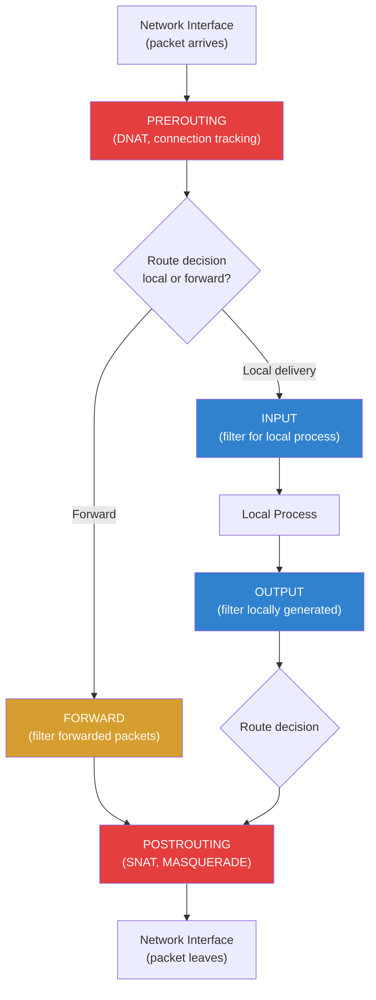

# Firewall Configuration

## Introduction

A firewall is the first line of network defense for any Linux system. It controls incoming and outgoing network traffic based on rules that define what connections are allowed or denied. Linux provides multiple firewall frameworks, from the low-level `iptables`/`nftables` kernel packet filtering to high-level management tools like `firewalld` and `ufw`.

Understanding Linux firewalls is essential because:
- Every internet-facing server needs packet filtering
- Container networking relies heavily on iptables/nftables rules
- Cloud security groups complement but don't replace host firewalls
- Debugging network issues often requires understanding firewall rules

## Netfilter: The Kernel Foundation

All Linux firewalls are built on **Netfilter**, a kernel framework that provides hooks at various points in the network stack. Packet filtering tools (iptables, nftables) insert rules at these hooks.

### Netfilter Hooks



## iptables

`iptables` is the traditional Linux firewall tool. It organizes rules into **tables** and **chains**.

### Tables and Chains

| Table | Purpose | Chains |
|-------|---------|--------|
| `filter` | Packet filtering (default) | INPUT, FORWARD, OUTPUT |
| `nat` | Network address translation | PREROUTING, INPUT, OUTPUT, POSTROUTING |
| `mangle` | Packet modification | All five chains |
| `raw` | Connection tracking bypass | PREROUTING, OUTPUT |
| `security` | Mandatory access control (SELinux) | INPUT, FORWARD, OUTPUT |

### Basic iptables Commands

```bash
# List all rules with line numbers
iptables -L -n -v --line-numbers
# Chain INPUT (policy ACCEPT 0 packets, 0 bytes)
# num   pkts bytes target     prot opt in     out     source               destination
# 1     1234  567K ACCEPT     all  --  lo     *       0.0.0.0/0            0.0.0.0/0
# 2     5678  234K ACCEPT     tcp  --  *      *       0.0.0.0/0            0.0.0.0/0            tcp dpt:22
# 3     9012  456K ACCEPT     tcp  --  *      *       0.0.0.0/0            0.0.0.0/0            tcp dpt:80
# 4     3456  178K ACCEPT     tcp  --  *      *       0.0.0.0/0            0.0.0.0/0            tcp dpt:443
# 5     7890  890K DROP       all  --  *      *       0.0.0.0/0            0.0.0.0/0

# Show rules in iptables-save format
iptables-save

# Show specific table
iptables -t nat -L -n -v
```

### Common iptables Rules

```bash
# === INPUT chain (incoming traffic) ===

# Allow loopback
iptables -A INPUT -i lo -j ACCEPT

# Allow established/related connections (stateful)
iptables -A INPUT -m conntrack --ctstate ESTABLISHED,RELATED -j ACCEPT

# Allow SSH (port 22)
iptables -A INPUT -p tcp --dport 22 -j ACCEPT

# Allow HTTP and HTTPS
iptables -A INPUT -p tcp -m multiport --dports 80,443 -j ACCEPT

# Allow ICMP (ping)
iptables -A INPUT -p icmp --icmp-type echo-request -j ACCEPT

# Rate-limit SSH (prevent brute force)
iptables -A INPUT -p tcp --dport 22 -m conntrack --ctstate NEW \
    -m recent --set --name SSH
iptables -A INPUT -p tcp --dport 22 -m conntrack --ctstate NEW \
    -m recent --update --seconds 60 --hitcount 4 --name SSH -j DROP

# Allow from specific IP/subnet
iptables -A INPUT -s 192.168.1.0/24 -j ACCEPT
iptables -A INPUT -s 10.0.0.5 -p tcp --dport 3306 -j ACCEPT  # DB access

# Log and drop everything else
iptables -A INPUT -j LOG --log-prefix "IPT-DROP: " --log-level 4
iptables -A INPUT -j DROP

# === FORWARD chain (routing) ===

# Allow forwarding from internal to external
iptables -A FORWARD -i eth0 -o eth1 -j ACCEPT
iptables -A FORWARD -i eth1 -o eth0 -m conntrack --ctstate ESTABLISHED,RELATED -j ACCEPT

# === OUTPUT chain (outgoing traffic) ===

# Allow all outgoing by default (restrictive policy)
iptables -A OUTPUT -m conntrack --ctstate ESTABLISHED,RELATED -j ACCEPT
iptables -A OUTPUT -o lo -j ACCEPT
iptables -A OUTPUT -p tcp -m multiport --dports 80,443 -j ACCEPT  # HTTP(S)
iptables -A OUTPUT -p udp --dport 53 -j ACCEPT                    # DNS
iptables -A OUTPUT -p tcp --dport 53 -j ACCEPT                    # DNS over TCP
iptables -A OUTPUT -j DROP
```

### NAT (Network Address Translation)

```bash
# Enable IP forwarding
echo 1 > /proc/sys/net/ipv4/ip_forward
# Persistent: net.ipv4.ip_forward = 1 in /etc/sysctl.conf

# Source NAT (masquerade) — for internet sharing
iptables -t nat -A POSTROUTING -o eth0 -j MASQUERADE

# Destination NAT (port forwarding)
# Forward external port 8080 to internal server 192.168.1.100:80
iptables -t nat -A PREROUTING -i eth0 -p tcp --dport 8080 \
    -j DNAT --to-destination 192.168.1.100:80
iptables -A FORWARD -p tcp -d 192.168.1.100 --dport 80 -j ACCEPT
```

### Saving and Restoring Rules

```bash
# Save rules (Debian/Ubuntu)
iptables-save > /etc/iptables/rules.v4
ip6tables-save > /etc/iptables/rules.v6

# Restore rules
iptables-restore < /etc/iptables/rules.v4

# RHEL/CentOS
service iptables save
# Or:
iptables-save > /etc/sysconfig/iptables

# Automatic restore on boot
apt install iptables-persistent    # Debian/Ubuntu
systemctl enable netfilter-persistent
```

### Deleting and Managing Rules

```bash
# Delete rule by number
iptables -D INPUT 3              # Delete rule 3 from INPUT chain

# Delete specific rule
iptables -D INPUT -p tcp --dport 80 -j ACCEPT

# Flush all rules
iptables -F                      # Flush filter table
iptables -t nat -F               # Flush nat table
iptables -F                      # Flush all tables

# Set default policy
iptables -P INPUT DROP           # Drop all input by default
iptables -P FORWARD DROP         # Drop all forwarding
iptables -P OUTPUT ACCEPT        # Allow all output

# Insert rule at position
iptables -I INPUT 1 -p tcp --dport 443 -j ACCEPT  # Insert at top

# Replace rule
iptables -R INPUT 3 -p tcp --dport 8080 -j ACCEPT  # Replace rule 3
```

## nftables

`nftables` is the successor to iptables, providing a unified framework with a simpler syntax, better performance, and atomic rule replacement.

### nftables Concepts

```bash
# nftables organizes rules into:
# Tables → Chains → Rules
# Tables have an address family (ip, ip6, inet, arp, bridge, netdev)
# Chains have a type (filter, nat, route) and hook (input, forward, etc.)
# Rules contain expressions and statements

# Check if nftables is active
nft list ruleset
```

### Basic nftables Configuration

```bash
# Create a complete firewall ruleset
nft flush ruleset

nft add table inet filter

# Create chains with policies
nft add chain inet filter input { type filter hook input priority 0 \; policy drop \; }
nft add chain inet filter forward { type filter hook forward priority 0 \; policy drop \; }
nft add chain inet filter output { type filter hook output priority 0 \; policy accept \; }

# Add rules
nft add rule inet filter input iif lo accept
nft add rule inet filter input ct state established,related accept
nft add rule inet filter input tcp dport { 22, 80, 443 } accept
nft add rule inet filter input icmp type echo-request accept

# View ruleset
nft list ruleset
# table inet filter {
#     chain input {
#         type filter hook input priority 0; policy drop;
#         iif "lo" accept
#         ct state established,related accept
#         tcp dport { 22, 80, 443 } accept
#         icmp type echo-request accept
#     }
#     chain forward {
#         type filter hook forward priority 0; policy drop;
#     }
#     chain output {
#         type filter hook output priority 0; policy accept;
#     }
# }
```

### nftables Configuration File

```bash
# /etc/nftables.conf
#!/usr/sbin/nft -f

flush ruleset

table inet filter {
    chain input {
        type filter hook input priority 0; policy drop;
        
        # Allow loopback
        iif "lo" accept
        
        # Allow established connections
        ct state established,related accept
        
        # Allow SSH (rate-limited)
        tcp dport 22 ct state new limit rate 4/minute accept
        
        # Allow HTTP/HTTPS
        tcp dport { 80, 443 } accept
        
        # Allow ICMP
        icmp type echo-request limit rate 5/second accept
        icmpv6 type { nd-neighbor-solicit, nd-router-advert, nd-neighbor-advert } accept
        
        # Log and drop
        log prefix "nft-drop: " drop
    }
    
    chain forward {
        type filter hook forward priority 0; policy drop;
    }
    
    chain output {
        type filter hook output priority 0; policy accept;
    }
}

# Apply
nft -f /etc/nftables.conf
systemctl enable nftables
```

### NAT with nftables

```bash
table ip nat {
    chain prerouting {
        type nat hook prerouting priority -100;
        tcp dport 8080 dnat to 192.168.1.100:80
    }
    
    chain postrouting {
        type nat hook postrouting priority 100;
        oif "eth0" masquerade
    }
}
```

## firewalld

`firewalld` is a dynamic firewall manager with zone-based configuration, default on RHEL/CentOS/Fedora.

### Zone Concepts

```bash
# List zones
firewall-cmd --get-zones
# block dmz drop external home internal nm-shared public trusted work

# Active zones
firewall-cmd --get-active-zones
# public
#   interfaces: eth0

# Zone details
firewall-cmd --zone=public --list-all
# public (active)
#   target: default
#   icmp-block-inversion: no
#   interfaces: eth0
#   sources:
#   services: dhcpv6-client ssh
#   ports:
#   protocols:
#   masquerade: no
#   forward-ports:
#   source-ports:
#   rich rules:
```

### firewalld Commands

```bash
# Add service permanently
firewall-cmd --permanent --add-service=http
firewall-cmd --permanent --add-service=https
firewall-cmd --reload

# Add port
firewall-cmd --permanent --add-port=8080/tcp
firewall-cmd --reload

# Remove service
firewall-cmd --permanent --remove-service=dhcpv6-client

# Add rich rule (rate limiting SSH)
firewall-cmd --permanent --add-rich-rule='
    rule family="ipv4"
    service name="ssh"
    accept
    limit value="4/m"'

# Allow from specific source
firewall-cmd --permanent --zone=trusted --add-source=192.168.1.0/24

# Port forwarding
firewall-cmd --permanent --add-forward-port=port=8080:proto=tcp:toport=80:toaddr=192.168.1.100

# Enable masquerade (NAT)
firewall-cmd --permanent --add-masquerade

# Runtime changes (not persistent)
firewall-cmd --add-service=https
# No --permanent = runtime only, lost on reload/restart
```

## ufw (Uncomplicated Firewall)

`ufw` is the default firewall tool on Ubuntu/Debian, providing a user-friendly interface to iptables.

```bash
# Enable/disable
ufw enable
ufw disable
ufw status verbose

# Default policies
ufw default deny incoming
ufw default allow outgoing

# Allow services
ufw allow ssh               # Port 22
ufw allow http              # Port 80
ufw allow https             # Port 443
ufw allow 8080/tcp          # Custom port

# Allow from specific IP
ufw allow from 192.168.1.0/24
ufw allow from 10.0.0.5 to any port 3306  # MySQL from specific IP

# Allow specific interface
ufw allow in on eth0 to any port 80

# Deny rules
ufw deny from 203.0.113.0/24  # Block subnet

# Rate limiting (SSH)
ufw limit ssh

# Delete rules
ufw delete allow 80/tcp
ufw delete 3                  # Delete by number

# Application profiles
ufw app list
ufw allow 'Apache Full'

# Logging
ufw logging on               # Enable logging
ufw logging medium           # Log level

# Status
ufw status numbered
# Status: active
#
# To                         Action      From
# --                         ------      ----
# [ 1] 22/tcp                   LIMIT IN    Anywhere
# [ 2] 80/tcp                   ALLOW IN    Anywhere
# [ 3] 443/tcp                  ALLOW IN    Anywhere
# [ 4] 22/tcp (v6)              LIMIT IN    Anywhere (v6)
# [ 5] 80/tcp (v6)              ALLOW IN    Anywhere (v6)
# [ 6] 443/tcp (v6)             ALLOW IN    Anywhere (v6)
```

## Common Firewall Scenarios

### Web Server

```bash
# Using ufw
ufw default deny incoming
ufw default allow outgoing
ufw allow ssh
ufw allow http
ufw allow https
ufw enable

# Using iptables
iptables -A INPUT -i lo -j ACCEPT
iptables -A INPUT -m conntrack --ctstate ESTABLISHED,RELATED -j ACCEPT
iptables -A INPUT -p tcp --dport 22 -j ACCEPT
iptables -A INPUT -p tcp -m multiport --dports 80,443 -j ACCEPT
iptables -A INPUT -j DROP
iptables -P INPUT DROP
```

### Database Server (Internal Only)

```bash
# Using firewalld
firewall-cmd --permanent --zone=trusted --add-source=192.168.1.0/24
firewall-cmd --permanent --zone=trusted --add-port=5432/tcp
firewall-cmd --permanent --zone=public --set-target=DROP
firewall-cmd --reload
```

### NAT Gateway

```bash
# Enable forwarding
echo 1 > /proc/sys/net/ipv4/ip_forward

# Using nftables
nft add table ip nat
nft add chain ip nat postrouting { type nat hook postrouting priority 100 \; }
nft add rule ip nat postrouting oif "eth0" masquerade

# Using iptables
iptables -t nat -A POSTROUTING -o eth0 -j MASQUERADE
iptables -A FORWARD -i eth1 -o eth0 -j ACCEPT
iptables -A FORWARD -i eth0 -o eth1 -m conntrack --ctstate ESTABLISHED,RELATED -j ACCEPT
```

## Firewall Tool Comparison

| Feature | iptables | nftables | firewalld | ufw |
|---------|----------|----------|-----------|-----|
| Kernel backend | xtables | nf_tables | nftables/iptables | iptables |
| Syntax | Verbose | Concise | Zone-based | Simple |
| Atomic replacement | No | Yes | Yes | No |
| IPv4+IPv6 unified | No (separate) | Yes (inet) | Yes | Yes |
| Default on | Legacy distros | Modern kernels | RHEL/Fedora | Ubuntu/Debian |
| Performance | Good | Better | Good | Good |
| Learning curve | Medium | Medium | Low | Low |

## Troubleshooting

```bash
# Check if firewall is blocking
iptables -L INPUT -n -v --line-numbers
nft list ruleset
ufw status

# Watch dropped packets in real-time
dmesg | grep -i "drop\|reject\|iptables\|nf_"
journalctl -f | grep -i firewall

# Test connectivity
nc -zv host port          # Test TCP connection
nmap -p 22,80,443 host   # Scan ports

# Debug iptables rules
iptables -L INPUT -n -v   # Show packet counters
# Rule with 0 packets = never matched (not the blocking rule)

# Check conntrack (connection tracking)
conntrack -L              # List all tracked connections
conntrack -S              # Connection tracking statistics
cat /proc/sys/net/netfilter/nf_conntrack_max  # Max tracked connections
```

## References

- [iptables(8) man page](https://man7.org/linux/man-pages/man8/iptables.8.html)
- [nft(8) man page](https://man7.org/linux/man-pages/man8/nft.8.html)
- [firewalld documentation](https://firewalld.org/documentation)
- [ufw wiki](https://wiki.ubuntu.com/UncomplicatedFirewall)
- [Netfilter documentation](https://www.netfilter.org/documentation.html)
- [nftables wiki](https://wiki.nftables.org/wiki-nftables/index.php/Main_Page)
- [ArchWiki: iptables](https://wiki.archlinux.org/title/Iptables)

## Related Topics

- [Networking Configuration](./networking-config.md) — IP and routing setup
- [Logging](./logging.md) — Firewall log analysis
- [System Administration Overview](./overview.md) — Security hardening practices
