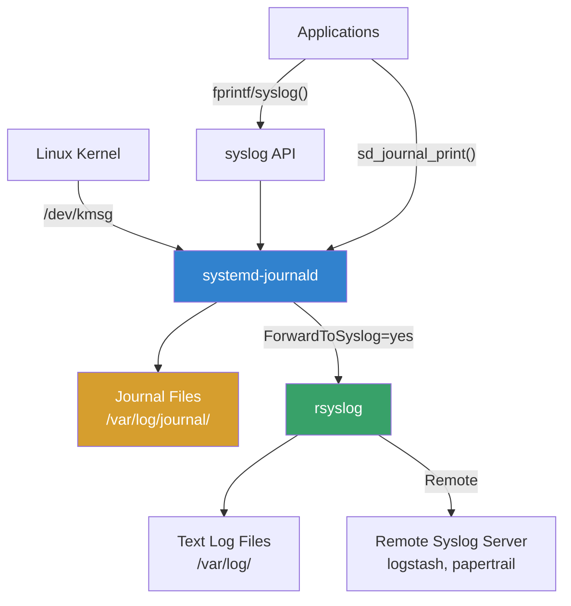
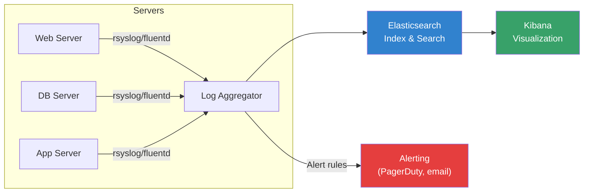

# System Logging

## Introduction

Logging is the backbone of system observability. Every significant event on a Linux system—authentication attempts, service starts/stops, kernel messages, application errors—generates a log entry. Proper logging configuration enables troubleshooting, security auditing, compliance, and performance monitoring.

Linux has evolved from simple text-file-based syslog to the structured, indexed logging of systemd's journald. Modern systems typically run both: journald for structured query and syslog for compatibility and remote forwarding.

## The Linux Logging Ecosystem



## syslog — The Traditional Logging Framework

### syslog Facility and Severity

Every syslog message has a **facility** (source category) and **severity** (importance level):

| Facility | Code | Description |
|----------|------|-------------|
| `kern` | 0 | Kernel messages |
| `user` | 1 | User-level messages |
| `mail` | 2 | Mail system |
| `daemon` | 3 | System daemons |
| `auth` | 4 | Authentication |
| `syslog` | 5 | syslogd internal |
| `lpr` | 6 | Printer |
| `news` | 7 | Usenet |
| `cron` | 8 | Cron daemon |
| `authpriv` | 9 | Private auth |
| `ftp` | 10 | FTP daemon |
| `local0-7` | 16-23 | Local use |

| Severity | Code | Name | Description |
|----------|------|------|-------------|
| 0 | `emerg` | Emergency | System is unusable |
| 1 | `alert` | Alert | Immediate action required |
| 2 | `crit` | Critical | Critical conditions |
| 3 | `err` | Error | Error conditions |
| 4 | `warning` | Warning | Warning conditions |
| 5 | `notice` | Notice | Normal but significant |
| 6 | `info` | Info | Informational |
| 7 | `debug` | Debug | Debug messages |

### Using `logger`

```bash
# Send a message to syslog
logger "Hello from the command line"

# Specify facility and severity
logger -p auth.info "User admin logged in"
logger -p local0.err "Application error occurred"

# Send to specific syslog socket
logger -u /dev/log "Custom message"

# Tag (identifies the source)
logger -t myapp "Processing complete"

# Multi-line message
echo -e "Line 1\nLine 2\nLine 3" | logger -t multiline

# Read from stdin (piping)
tail -f /var/log/app.log | logger -t myapp -p local0.info
```

### Writing to syslog from Code

```c
#include <syslog.h>

int main() {
    /* Open syslog connection */
    openlog("myapp", LOG_PID | LOG_CONS, LOG_LOCAL0);
    
    /* Log at different levels */
    syslog(LOG_INFO, "Application started, version %s", VERSION);
    syslog(LOG_WARNING, "Disk usage at %d%%", disk_pct);
    syslog(LOG_ERR, "Failed to open config: %s", strerror(errno));
    syslog(LOG_DEBUG, "Processing item %d", item_id);
    
    /* Close when done */
    closelog();
    return 0;
}
```

```python
# Python
import syslog
syslog.openlog("myapp", syslog.LOG_PID, syslog.LOG_LOCAL0)
syslog.syslog(syslog.LOG_INFO, "Application started")
syslog.syslog(syslog.LOG_ERR, "Something went wrong")
```

## journald — systemd's Journal

systemd-journald is the modern logging daemon that collects and manages structured log data. It stores logs in a binary format with rich metadata.

### Querying the Journal

```bash
# View all journal entries
journalctl

# Follow live (like tail -f)
journalctl -f

# Show recent entries
journalctl -n 50               # Last 50 entries

# Show since specific time
journalctl --since "2025-07-21 10:00:00"
journalctl --since "1 hour ago"
journalctl --since today
journalctl --since yesterday --until today

# Filter by service/unit
journalctl -u nginx
journalctl -u nginx -u php-fpm   # Multiple units
journalctl -u sshd --since "1 hour ago"

# Filter by priority
journalctl -p err               # Errors and above
journalctl -p warning           # Warnings and above
journalctl -p err..emerg        # Range

# Filter by PID
journalctl _PID=1234

# Filter by boot
journalctl -b                   # Current boot
journalctl -b -1                # Previous boot
journalctl --list-boots          # List all boots

# Filter by user
journalctl _UID=1000
journalctl _COMM=sshd           # By command name

# Kernel messages
journalctl -k                   # Like dmesg
journalctl -k -p err            # Kernel errors

# Disk usage
journalctl --disk-usage
# Archived and active journals take up 2.3G in the file system.

# Vacuum old logs
journalctl --vacuum-time=30d    # Keep last 30 days
journalctl --vacuum-size=500M   # Keep max 500MB
journalctl --vacuum-files=5     # Keep max 5 files

# Output formats
journalctl -o json-pretty       # JSON format
journalctl -o short-iso         # ISO timestamp
journalctl -o verbose           # All fields
journalctl -o cat               # Message only (no metadata)
```

### journald Configuration

```bash
# /etc/systemd/journald.conf
[Journal]
Storage=persistent          # persistent|volatile|auto|none
SystemMaxUse=2G             # Max disk usage for journal
SystemKeepFree=1G           # Keep this much free space
SystemMaxFileSize=50M       # Max size per journal file
MaxRetentionSec=3month      # Auto-delete after 3 months
MaxFileSec=1week            # Rotate files weekly
ForwardToSyslog=yes         # Forward to rsyslog
RateLimitIntervalSec=30s    # Rate limiting
RateLimitBurst=10000        # Max messages per interval
Compress=yes                # Compress journal files

# Apply changes
systemctl restart systemd-journald
```

### Persistent Journal Storage

```bash
# By default, journald stores logs in /run/log/journal (volatile)
# To make persistent:
mkdir -p /var/log/journal
systemctl restart systemd-journald

# Verify
ls -la /var/log/journal/$(cat /etc/machine-id)/
# -rw-r----- 1 root systemd-journal 8388608 Jul 21 00:00 system.journal
# -rw-r----- 1 root systemd-journal 8388608 Jul 21 12:00 user-1000.journal
```

## rsyslog — Advanced Syslog

`rsyslog` is the most widely used syslog implementation, providing powerful filtering, formatting, and forwarding capabilities.

### Basic Configuration

```bash
# /etc/rsyslog.conf

# Module loading
module(load="imuxsock")    # Local syslog socket
module(load="imklog")      # Kernel logging
module(load="imfile")       # File input module

# Default file creation
$FileCreateMode 0640
$DirCreateMode 0750
$Umask 0022

# Include config directory
include(file="/etc/rsyslog.d/*.conf" mode="optional")
```

### Log File Mapping

```bash
# /etc/rsyslog.d/50-default.conf

# Traditional log files
auth,authpriv.*        /var/log/auth.log
*.*;auth,authpriv.none /var/log/syslog
kern.*                 /var/log/kern.log
mail.*                 /var/log/mail.log
mail.err               /var/log/mail.err
cron.*                 /var/log/cron.log

# All messages to console (for emergencies)
*.emerg                :omusrmsg:*

# Specific application logging
local0.*               /var/log/myapp.log
local1.*               /var/log/myotherapp.log
```

### Application-Specific Logging

```bash
# /etc/rsyslog.d/myapp.conf

# Template for structured app logging
template(name="MyAppFormat" type="string"
    string="%TIMESTAMP:::date-rfc3339% %HOSTNAME% %syslogtag% %msg%\n")

# Log to file with template
local0.*    action(
    type="omfile"
    dynaFile="MyAppLog"
    template="MyAppFormat"
)

# Dynamic file names based on program name
template(name="MyAppLog" type="string"
    string="/var/log/apps/%programname%.log")
```

### Remote Logging

```bash
# === CLIENT: Send logs to remote server ===

# /etc/rsyslog.d/remote.conf
# TCP (reliable)
*.* @@logserver.example.com:514

# UDP (fast, unreliable)
*.* @logserver.example.com:514

# TLS encrypted
module(load="imtcp")
module(load="gtls")
global(DefaultNetstreamDriver="gtls")
global(DefaultNetstreamDriverCAFile="/etc/ssl/ca.pem")
global(DefaultNetstreamDriverCertFile="/etc/ssl/cert.pem")
global(DefaultNetstreamDriverKeyFile="/etc/ssl/key.pem")
*.* @@(o)logserver.example.com:6514

# === SERVER: Receive remote logs ===

# /etc/rsyslog.d/server.conf
module(load="imtcp")
input(type="imtcp" port="514")

# Template for remote logs
template(name="RemoteHost" type="string"
    string="/var/log/remote/%HOSTNAME%/%PROGRAMNAME%.log")

# Store remote logs by host
if $fromhost-ip != '127.0.0.1' then {
    action(type="omfile" dynaFile="RemoteHost")
    stop
}
```

## Log Rotation

### logrotate

`logrotate` manages automatic rotation, compression, and deletion of log files:

```bash
# /etc/logrotate.conf — Global settings
weekly
rotate 4
create
dateext
compress
delaycompress
include /etc/logrotate.d

# /etc/logrotate.d/syslog — System log rotation
/var/log/syslog
/var/log/mail.log
/var/log/kern.log
/var/log/auth.log
{
    rotate 7
    daily
    missingok
    notifempty
    compress
    delaycompress
    postrotate
        /usr/lib/rsyslog/rsyslog-rotate
    endscript
}

# /etc/logrotate.d/myapp — Application log rotation
/var/log/myapp/*.log {
    daily
    rotate 30
    missingok
    notifempty
    compress
    delaycompress
    dateext
    dateformat -%Y%m%d
    size 100M
    maxsize 200M
    create 0640 myapp myapp
    sharedscripts
    postrotate
        systemctl reload myapp
    endscript
}
```

### logrotate Options

| Option | Description |
|--------|-------------|
| `daily` | Rotate daily |
| `weekly` | Rotate weekly |
| `monthly` | Rotate monthly |
| `rotate N` | Keep N rotated files |
| `size X` | Rotate when file exceeds X |
| `maxsize X` | Rotate when file exceeds X (time-based check too) |
| `compress` | Compress rotated files |
| `delaycompress` | Delay compression by one cycle |
| `missingok` | Don't error if log file missing |
| `notifempty` | Don't rotate empty files |
| `create mode owner group` | Create new file with permissions |
| `postrotate` ... `endscript` | Run command after rotation |
| `prerotate` ... `endscript` | Run command before rotation |
| `sharedscripts` | Run scripts once for all matched files |

### Testing and Debugging

```bash
# Test logrotate configuration (dry run)
logrotate -d /etc/logrotate.conf

# Force rotation
logrotate -f /etc/logrotate.d/myapp

# Verbose output
logrotate -v /etc/logrotate.conf

# Check logrotate status
cat /var/lib/logrotate/status
```

## Centralized Logging

### Architecture



### ELK Stack (Elasticsearch, Logstash, Kibana)

```yaml
# Logstash config: /etc/logstash/conf.d/syslog.conf
input {
  tcp {
    port => 514
    type => "syslog"
  }
  udp {
    port => 514
    type => "syslog"
  }
}

filter {
  if [type] == "syslog" {
    grok {
      match => { "message" => "%{SYSLOGTIMESTAMP:syslog_timestamp} %{SYSLOGHOST:syslog_hostname} %{DATA:syslog_program}(?:\[%{POSINT:syslog_pid}\])?: %{GREEDYDATA:syslog_message}" }
    }
    date {
      match => [ "syslog_timestamp", "MMM  d HH:mm:ss", "MMM dd HH:mm:ss" ]
    }
  }
}

output {
  elasticsearch {
    hosts => ["localhost:9200"]
    index => "syslog-%{+YYYY.MM.dd}"
  }
}
```

### Lightweight Alternatives

```bash
# Loki + Promtail (Grafana ecosystem)
# Lower resource usage than ELK, uses labels instead of full-text indexing

# Fluentd / Fluent Bit
# Lightweight log collector, CNCF project
# Fluent Bit is the ultra-light version for containers

# Vector (by Datadog)
# High-performance log router
# Written in Rust, very efficient
```

## Log Analysis

```bash
# Common log analysis commands

# Count errors per hour
awk '/ERROR/{split($3,a,":"); print a[1]":00"}' /var/log/app.log | sort | uniq -c

# Find most frequent errors
grep "ERROR" /var/log/app.log | awk -F'ERROR: ' '{print $2}' | sort | uniq -c | sort -rn | head

# Authentication failures
grep "Failed password" /var/log/auth.log | awk '{print $11}' | sort | uniq -c | sort -rn | head -10

# Top IPs accessing web server
awk '{print $1}' /var/log/nginx/access.log | sort | uniq -c | sort -rn | head -20

# Response time analysis
awk '{print $NF}' /var/log/nginx/access.log | sort -n | tail -10

# Real-time error monitoring
tail -f /var/log/app.log | grep --line-buffered "ERROR\|WARN"

# Search journal for patterns
journalctl -u nginx --since today | grep -i "error\|500\|timeout"

# JSON log parsing (jq)
journalctl -o json -u myapp | jq 'select(.PRIORITY <= 3)' | jq -s 'length'
```

## References

- [journald.conf(5) man page](https://www.freedesktop.org/software/systemd/man/latest/journald.conf.html)
- [rsyslog.conf(5) man page](https://man7.org/linux/man-pages/man5/rsyslog.conf.5.html)
- [logrotate(8) man page](https://man7.org/linux/man-pages/man8/logrotate.8.html)
- [journalctl(1) man page](https://www.freedesktop.org/software/systemd/man/latest/journalctl.html)
- [rsyslog documentation](https://www.rsyslog.com/doc/v8-stable/)
- [Loki documentation](https://grafana.com/docs/loki/latest/)

## Related Topics

- [System Administration Overview](./overview.md) — Monitoring and alerting practices
- [Process Management](./process-management.md) — Service and process monitoring
- [Firewall](./firewall.md) — Firewall log analysis
