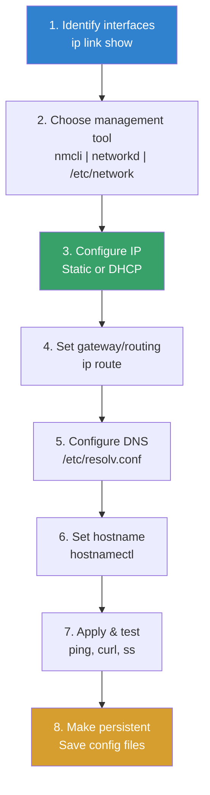

# Networking Configuration

## Introduction

Network configuration is a fundamental system administration task. Whether setting up a simple server with a static IP or managing complex multi-interface routing, understanding Linux networking tools is essential. The Linux networking stack is one of the most powerful and flexible in the world, powering everything from embedded devices to the largest supercomputers and cloud infrastructure.

This page covers the modern `ip` command suite (replacing legacy `ifconfig`/`route`), the two major network management daemons (NetworkManager and systemd-networkd), and the traditional `/etc/network/interfaces` configuration format.

## The `ip` Command Suite

The `ip` command from the `iproute2` package is the modern, unified tool for network configuration. It replaces the legacy `ifconfig`, `route`, `arp`, and `netstat` commands.

### `ip link` — Link Layer (Interfaces)

```bash
# Show all interfaces
ip link show
# 1: lo: <LOOPBACK,UP,LOWER_UP> mtu 65536 qdisc noqueue state UNKNOWN mode DEFAULT group default qlen 1000
#     link/loopback 00:00:00:00:00:00 brd 00:00:00:00:00:00
# 2: eth0: <BROADCAST,MULTICAST,UP,LOWER_UP> mtu 1500 qdisc fq_codel state UP mode DEFAULT group default qlen 1000
#     link/ether 52:54:00:12:34:56 brd ff:ff:ff:ff:ff:ff
#     altname enp0s3
# 3: eth1: <BROADCAST,MULTICAST> mtu 1500 qdisc noop state DOWN mode DEFAULT group default qlen 1000
#     link/ether 52:54:00:78:9a:bc brd ff:ff:ff:ff:ff:ff

# Show specific interface
ip link show eth0

# Bring interface up/down
ip link set eth0 up
ip link set eth0 down

# Set MTU
ip link set eth0 mtu 9000  # Jumbo frames

# Set MAC address
ip link set eth0 address 52:54:00:aa:bb:cc

# Enable/disable promiscuous mode
ip link set eth0 promisc on

# Show statistics
ip -s link show eth0
#     RX:  bytes  packets  errors  dropped missed  mcast
#          123456    1234      0        0      0      0
#     TX:  bytes  packets  errors  dropped carrier collsns
#          654321    5678      0        0      0      0

# Show interface type details
ip -d link show eth0
```

### `ip addr` — IP Addresses

```bash
# Show all addresses
ip addr show
# 1: lo: <LOOPBACK,UP,LOWER_UP> mtu 65536
#     inet 127.0.0.1/8 scope host lo
#        valid_lft forever preferred_lft forever
#     inet6 ::1/128 scope host
#        valid_lft forever preferred_lft forever
# 2: eth0: <BROADCAST,MULTICAST,UP,LOWER_UP> mtu 1500
#     inet 192.168.1.10/24 brd 192.168.1.255 scope global eth0
#        valid_lft forever preferred_lft forever
#     inet6 fe80::5054:ff:fe12:3456/64 scope link
#        valid_lft forever preferred_lft forever

# Show addresses on specific interface
ip addr show dev eth0

# Add IP address
ip addr add 192.168.1.10/24 dev eth0
ip addr add 10.0.0.1/24 dev eth0 label eth0:0  # Secondary address

# Add IPv6 address
ip addr add 2001:db8::1/64 dev eth0

# Delete IP address
ip addr del 192.168.1.10/24 dev eth0

# Flush all addresses on interface
ip addr flush dev eth1

# Show only IPv4
ip -4 addr show
# Show only IPv6
ip -6 addr show

# Show addresses in brief format
ip -br addr show
# lo               UNKNOWN        127.0.0.1/8 ::1/128
# eth0             UP             192.168.1.10/24 fe80::5054:ff:fe12:3456/64
```

### `ip route` — Routing

```bash
# Show routing table
ip route show
# default via 192.168.1.1 dev eth0 proto dhcp metric 100
# 192.168.1.0/24 dev eth0 proto kernel scope link src 192.168.1.10 metric 100
# 10.0.0.0/8 via 192.168.1.254 dev eth0

# Show main routing table
ip route show table main

# Show all routing tables
ip route show table all

# Add default gateway
ip route add default via 192.168.1.1

# Add static route
ip route add 10.0.0.0/8 via 192.168.1.254
ip route add 172.16.0.0/16 via 192.168.1.254 dev eth0

# Add route with specific metric
ip route add 10.0.0.0/8 via 192.168.1.254 metric 200

# Delete route
ip route del 10.0.0.0/8

# Replace (add or update)
ip route replace 10.0.0.0/8 via 192.168.1.253

# Show route to specific destination
ip route get 8.8.8.8
# 8.8.8.8 via 192.168.1.1 dev eth0 src 192.168.1.10 uid 0

# Multi-path routing
ip route add default \
    nexthop via 192.168.1.1 weight 1 \
    nexthop via 192.168.2.1 weight 1

# Policy routing (multiple routing tables)
ip rule add from 192.168.1.0/24 table 100
ip route add default via 192.168.1.1 table 100
ip rule show
# 0:     from all lookup local
# 32764: from 192.168.1.0/24 lookup 100
# 32766: from all lookup main
# 32767: from all lookup default
```

### `ip neigh` — ARP/Neighbor Table

```bash
# Show neighbor (ARP) table
ip neigh show
# 192.168.1.1 dev eth0 lladdr 52:54:00:ff:ff:ff REACHABLE
# 192.168.1.100 dev eth0 lladdr 52:54:00:aa:bb:cc STALE

# Add static ARP entry
ip neigh add 192.168.1.200 lladdr 52:54:00:dd:ee:ff dev eth0

# Delete ARP entry
ip neigh del 192.168.1.200 dev eth0

# Flush ARP cache
ip neigh flush dev eth0

# Neighbor states: PERMANENT, NOARP, REACHABLE, STALE, DELAY, INCOMPLETE, FAILED
```

### Network Namespaces with `ip`

```bash
# Create network namespace
ip netns add testns

# List namespaces
ip netns list

# Run command in namespace
ip netns exec testns ip addr show

# Create veth pair and connect namespaces
ip link add veth0 type veth peer name veth1
ip link set veth1 netns testns

# Configure
ip addr add 10.0.0.1/24 dev veth0
ip link set veth0 up

ip netns exec testns ip addr add 10.0.0.2/24 dev veth1
ip netns exec testns ip link set veth1 up
ip netns exec testns ip link set lo up

# Test
ip netns exec testns ping 10.0.0.1
```

## NetworkManager

NetworkManager is the default network management daemon on most desktop and server distributions (RHEL, Fedora, Ubuntu desktop, etc.).

### `nmcli` — NetworkManager CLI

```bash
# Show connections
nmcli con show
# NAME                UUID                                  TYPE      DEVICE
# Wired connection 1  12345678-abcd-...                     ethernet  eth0
# Wired connection 2  87654321-dcba-...                     ethernet  eth1

# Show active connections
nmcli con show --active

# Show device status
nmcli dev status
# DEVICE  TYPE      STATE      CONNECTION
# eth0    ethernet  connected  Wired connection 1
# eth1    ethernet  disconnected  --
# lo      loopback  unmanaged  --

# Connection details
nmcli con show "Wired connection 1"
```

### Configuring with nmcli

```bash
# === Static IP ===
nmcli con mod "Wired connection 1" \
    ipv4.method manual \
    ipv4.addresses 192.168.1.10/24 \
    ipv4.gateway 192.168.1.1 \
    ipv4.dns "8.8.8.8,8.8.4.4"

# Apply changes
nmcli con up "Wired connection 1"

# === DHCP ===
nmcli con mod "Wired connection 1" \
    ipv4.method auto

# === Create new connection ===
nmcli con add type ethernet \
    con-name "server-net" \
    ifname eth1 \
    ipv4.method manual \
    ipv4.addresses 10.0.0.1/24

# === Modify DNS ===
nmcli con mod "server-net" ipv4.dns "10.0.0.53"
nmcli con mod "server-net" +ipv4.dns "8.8.8.8"  # Add additional

# === Bonding ===
nmcli con add type bond con-name bond0 ifname bond0 \
    bond.options "mode=active-backup,miimon=100"
nmcli con add type ethernet slave-type bond \
    con-name bond0-eth0 ifname eth0 master bond0
nmcli con add type ethernet slave-type bond \
    con-name bond0-eth1 ifname eth1 master bond0
nmcli con mod bond0 ipv4.method manual ipv4.addresses 192.168.1.10/24

# === VLAN ===
nmcli con add type vlan con-name vlan100 ifname eth0.100 \
    dev eth0 id 100 ipv4.method manual ipv4.addresses 10.100.0.1/24

# === WiFi ===
nmcli dev wifi list
nmcli dev wifi connect "SSID" password "password"
nmcli con mod "SSID" wifi-sec.key-mgmt wpa-psk
```

### NetworkManager Connection Files

```bash
# Connection files are stored in:
ls /etc/NetworkManager/system-connections/
# Wired connection 1.nmconnection

# View file
cat /etc/NetworkManager/system-connections/Wired\ connection\ 1.nmconnection
# [connection]
# id=Wired connection 1
# type=ethernet
# interface-name=eth0
#
# [ipv4]
# method=manual
# address1=192.168.1.10/24,192.168.1.1
# dns=8.8.8.8;8.8.4.4;
#
# [ipv6]
# method=auto
```

## systemd-networkd

`systemd-networkd` is a lightweight network management daemon, ideal for servers and containers.

### Configuration Files

```bash
# Network files are in /etc/systemd/network/

# /etc/systemd/network/10-eth0.network
[Match]
Name=eth0

[Network]
DHCP=no
Address=192.168.1.10/24
Gateway=192.168.1.1
DNS=8.8.8.8
DNS=8.8.4.4
Domains=example.com

[Route]
# Additional routes
Destination=10.0.0.0/8
Gateway=192.168.1.254
Metric=200
```

```bash
# /etc/systemd.network/20-eth1.network (DHCP)
[Match]
Name=eth1

[Network]
DHCP=yes

[DHCPv4]
UseDNS=yes
UseNTP=yes
RouteMetric=100
```

```bash
# /etc/systemd.network/30-bridge.netdev (Bridge)
[NetDev]
Name=br0
Kind=bridge

[Bridge]
STP=yes
```

```bash
# /etc/systemd.network/31-bridge.network
[Match]
Name=br0

[Network]
Address=192.168.1.10/24
Gateway=192.168.1.1
DNS=8.8.8.8
```

```bash
# /etc/systemd.network/32-bridge-slave.network
[Match]
Name=eth0

[Network]
Bridge=br0
```

### Managing systemd-networkd

```bash
# Enable and start
systemctl enable --now systemd-networkd

# Check status
systemctl status systemd-networkd
networkctl status
networkctl status eth0

# List links
networkctl list
# IDX LINK  TYPE     OPERATIONAL SETUP
#   1 lo    loopback carrier     unmanaged
#   2 eth0  ether    routable    configured
#   3 eth1  ether    off         unmanaged

# Reload configuration
networkctl reload

# Bring interface up/down
networkctl up eth0
networkctl down eth1
```

## Traditional `/etc/network/interfaces`

The Debian/Ubuntu traditional configuration format:

```bash
# /etc/network/interfaces

# Loopback
auto lo
iface lo inet loopback

# Primary interface (DHCP)
auto eth0
iface eth0 inet dhcp

# Static IP
auto eth1
iface eth1 inet static
    address 192.168.1.10/24
    gateway 192.168.1.1
    dns-nameservers 8.8.8.8 8.8.4.4
    dns-search example.com

# Secondary IP
auto eth1:0
iface eth1:0 inet static
    address 10.0.0.1/24

# Bonding
auto bond0
iface bond0 inet static
    address 192.168.1.10/24
    gateway 192.168.1.1
    bond-slaves eth0 eth1
    bond-mode active-backup
    bond-miimon 100

# Bridge
auto br0
iface br0 inet static
    address 192.168.1.10/24
    gateway 192.168.1.1
    bridge_ports eth0
    bridge_stp on

# VLAN
auto eth0.100
iface eth0.100 inet static
    address 10.100.0.1/24
    vlan-raw-device eth0

# Apply
systemctl restart networking
# Or:
ifup eth1
ifdown eth1
```

## DNS Configuration

```bash
# /etc/resolv.conf (managed by systemd-resolved or NetworkManager)
nameserver 8.8.8.8
nameserver 8.8.4.4
search example.com
options timeout:2 attempts:3

# systemd-resolved
systemctl status systemd-resolved
resolvectl status
resolvectl query example.com
resolvectl statistics

# /etc/hosts (static host entries)
127.0.0.1       localhost
192.168.1.10    myserver.example.com myserver
10.0.0.50       dbserver.example.com dbserver

# /etc/nsswitch.conf (name resolution order)
# hosts: files dns myhostname
```

## Network Configuration Workflow



## IPv6 Configuration

### Dual-Stack Setup

```bash
# NetworkManager
nmcli con mod "Wired connection 1" ipv6.method auto
nmcli con mod "Wired connection 1" ipv6.addresses 2001:db8::1/64
nmcli con mod "Wired connection 1" ipv6.gateway 2001:db8::1

# systemd-networkd
# /etc/systemd/network/10-eth0.network
[Network]
DHCP=yes
Address=2001:db8::1/64
Gateway=2001:db8::1
IPv6AcceptRA=yes

# /etc/network/interfaces
iface eth0 inet6 static
    address 2001:db8::1/64
    gateway 2001:db8::1
```

### IPv6 Privacy Extensions

```bash
# Enable temporary addresses (privacy)
sysctl -w net.ipv6.conf.all.use_tempaddr=2
sysctl -w net.ipv6.conf.default.use_tempaddr=2

# Make persistent
# /etc/sysctl.d/99-ipv6-privacy.conf
net.ipv6.conf.all.use_tempaddr = 2
net.ipv6.conf.default.use_tempaddr = 2

# Check current addresses
ip -6 addr show dev eth0
# inet6 2001:db8::5054:ff:fe12:3456/64 scope global dynamic mngtmpaddr
# inet6 2001:db8::abcd:1234:5678:9abc/64 scope global temporary dynamic
# inet6 fe80::5054:ff:fe12:3456/64 scope link
```

### IPv6 Router Advertisement

```bash
# Accept router advertisements
sysctl -w net.ipv6.conf.all.accept_ra=1
# 0 = disabled
# 1 = enabled when forwarding is disabled
# 2 = enabled even when forwarding is enabled (for routers)

# Configure radvd (Router Advertisement Daemon)
# /etc/radvd.conf
interface eth0 {
    AdvSendAdvert on;
    MinRtrAdvInterval 30;
    MaxRtrAdvInterval 100;
    prefix 2001:db8:1::/64 {
        AdvOnLink on;
        AdvAutonomous on;
    };
};
```

## WireGuard VPN Configuration

### Quick WireGuard Setup

```bash
# Install
apt install wireguard

# Generate keys
wg genkey | tee /etc/wireguard/private.key | wg pubkey > /etc/wireguard/public.key
chmod 600 /etc/wireguard/private.key

# Server config
# /etc/wireguard/wg0.conf
[Interface]
PrivateKey = <server-private-key>
Address = 10.0.0.1/24
ListenPort = 51820
PostUp = iptables -A FORWARD -i wg0 -j ACCEPT; iptables -t nat -A POSTROUTING -o eth0 -j MASQUERADE
PostDown = iptables -D FORWARD -i wg0 -j ACCEPT; iptables -t nat -D POSTROUTING -o eth0 -j MASQUERADE

[Peer]
PublicKey = <client-public-key>
AllowedIPs = 10.0.0.2/32

# Client config
# /etc/wireguard/wg0.conf
[Interface]
PrivateKey = <client-private-key>
Address = 10.0.0.2/24
DNS = 8.8.8.8

[Peer]
PublicKey = <server-public-key>
Endpoint = server.example.com:51820
AllowedIPs = 0.0.0.0/0  # Route all traffic through VPN
PersistentKeepalive = 25

# Start
wg-quick up wg0
systemctl enable wg-quick@wg0

# Show status
wg show
```

## Network Troubleshooting

### Connectivity Testing

```bash
# Basic connectivity
ping -c 4 8.8.8.8
ping -c 4 gateway.example.com

# DNS resolution
dig example.com
nslookup example.com
host example.com

# Trace route
traceroute 8.8.8.8
mtr 8.8.8.8  # Continuous traceroute

# Check routing
ip route get 8.8.8.8
ip route show

# Check if port is open
curl -v http://example.com:80
nc -zv example.com 80
ss -tlnp | grep :80
```

### Socket Statistics with `ss`

```bash
# Show all TCP connections
ss -tnp
# State  Recv-Q  Send-Q  Local Address:Port  Peer Address:Port  Process
# ESTAB  0       0       192.168.1.10:22     192.168.1.100:5432  users:((sshd,pid=1234))

# Show listening sockets
ss -tlnp
# LISTEN  0  128  0.0.0.0:22   0.0.0.0:*  users:(("sshd",pid=1234,fd=3))
# LISTEN  0  128  0.0.0.0:80   0.0.0.0:*  users:(("nginx",pid=5678,fd=6))

# Show UDP sockets
ss -ulnp

# Show sockets in specific state
ss -tnp state established
ss -tnp state time-wait

# Show sockets by destination
ss -tn dst 192.168.1.0/24

# Show socket memory usage
ss -tm

# Filter by process
ss -tnp | grep nginx

# Show connection counts by state
ss -tan | awk '{print $1}' | sort | uniq -c | sort -rn
#   150 ESTAB
#    20 TIME-WAIT
#     5 LISTEN
#     2 CLOSE-WAIT
```

### Interface Statistics

```bash
# Detailed interface stats
ip -s -s link show eth0
# eth0: <BROADCAST,MULTICAST,UP,LOWER_UP> mtu 1500
#     RX:  bytes  packets  errors  dropped missed  mcast
#     123456789  123456      0       5      0     100
#     TX:  bytes  packets  errors  dropped carrier collsns
#      98765432   98765      0       0      0       0

# Watch stats in real time
watch -n 1 'ip -s link show eth0 | grep -A 5 RX'

# Check for errors
ethtool -S eth0 | grep -i error
# rx_errors: 0
# tx_errors: 0
# rx_crc_errors: 0

# Check link status
ethtool eth0
# Speed: 1000Mb/s
# Duplex: Full
# Auto-negotiation: on
# Link detected: yes

# Check ARP table
ip neigh show
arp -a

# Check for duplicate IPs
arping -I eth0 192.168.1.10
# ARPING 192.168.1.10 from 192.168.1.10 eth0
# Unicast reply from 192.168.1.10 [52:54:00:12:34:56]
# If you see a different MAC, there's an IP conflict
```

### Network Debugging Checklist

```bash
# 1. Is the interface up?
ip link show eth0 | grep -q 'state UP' && echo 'UP' || echo 'DOWN'

# 2. Do we have an IP?
ip addr show dev eth0 | grep 'inet '

# 3. Can we reach the gateway?
ping -c 1 -W 2 $(ip route | awk '/default/ {print $3}')

# 4. Can we reach an external IP?
ping -c 1 -W 2 8.8.8.8

# 5. Can we resolve DNS?
dig +short example.com

# 6. Can we reach the service?
curl -s -o /dev/null -w '%{http_code}' http://example.com

# 7. Check firewall rules
iptables -L -n
nft list ruleset

# 8. Check for port conflicts
ss -tlnp | grep ':80\|:443'

# 9. Check system logs
journalctl -u NetworkManager --since '1 hour ago'
journalctl -u systemd-networkd --since '1 hour ago'
dmesg | grep -i 'eth0\|link\|network'
```

### tcpdump Examples

```bash
# Capture all traffic on interface
tcpdump -i eth0

# Capture only TCP port 80
tcpdump -i eth0 tcp port 80

# Capture DNS queries
tcpdump -i eth0 port 53

# Capture with verbose output
tcpdump -i eth0 -vv

# Capture and save to file
tcpdump -i eth0 -w capture.pcap

# Read from file
tcpdump -r capture.pcap

# Capture specific host
tcpdump -i eth0 host 192.168.1.100

# Capture SYN packets only (connection attempts)
tcpdump -i eth0 'tcp[tcpflags] & tcp-syn != 0'

# Capture with timestamps
tcpdump -i eth0 -tttt

# Limit packet count
tcpdump -i eth0 -c 100
```

## Legacy Tools (Deprecated)

```bash
# These still work but ip/nmcli are preferred:

# ifconfig (replaced by ip addr/link)
ifconfig eth0 192.168.1.10 netmask 255.255.255.0 up
ifconfig eth0

# route (replaced by ip route)
route add default gw 192.168.1.1
route -n

# arp (replaced by ip neigh)
arp -a

# netstat (replaced by ss)
netstat -tunlp
# Modern replacement:
ss -tunlp
```

## References

- [ip(8) man page](https://man7.org/linux/man-pages/man8/ip.8.html) — iproute2 reference
- [nmcli(1) man page](https://man7.org/linux/man-pages/man1/nmcli.1.html) — NetworkManager CLI
- [systemd-networkd(8)](https://www.freedesktop.org/software/systemd/man/latest/systemd-networkd.service.html)
- [interfaces(5) man page](https://man7.org/linux/man-pages/man5/interfaces.5.html) — Debian network config
- [ArchWiki: Network configuration](https://wiki.archlinux.org/title/Network_configuration)
- [iproute2 documentation](https://wiki.linuxfoundation.org/networking/iproute2)
- [NetworkManager documentation](https://networkmanager.dev/docs/)
- [systemd-networkd examples](https://systemd.io/NETWORK/)

## Related Topics

- [Firewall](./firewall.md) — Network traffic filtering
- [System Administration Overview](./overview.md) — Initial network setup
- [Namespaces](../kernel/processes/namespaces.md) — Network namespace isolation
- [Logging](./logging.md) — Network event logging

## Network Bonding and Link Aggregation

Bonding combines multiple physical interfaces into a single logical interface for redundancy or increased throughput.

### Bonding Modes

| Mode | Name | Description |
|---|---|---|
| 0 | balance-rr | Round-robin, load balanced |
| 1 | active-backup | One active, one standby (failover) |
| 2 | balance-xor | XOR of source/dest MAC |
| 3 | broadcast | Broadcast on all slaves |
| 4 | 802.3ad | LACP (IEEE 802.3ad link aggregation) |
| 5 | balance-tlb | Transmit load balancing |
| 6 | balance-alb | Adaptive load balancing |

### Configuring Bonds

```bash
# NetworkManager
nmcli con add type bond con-name bond0 ifname bond0 \
    bond.options "mode=802.3ad,miimon=100,lacp_rate=fast"
nmcli con add type ethernet slave-type bond con-name bond0-eth0 ifname eth0 master bond0
nmcli con add type ethernet slave-type bond con-name bond0-eth1 ifname eth1 master bond0
nmcli con mod bond0 ipv4.method manual ipv4.addresses 192.168.1.10/24
nmcli con up bond0

# systemd-networkd
# /etc/systemd/network/20-bond0.netdev
[NetDev]
Name=bond0
Kind=bond

[Bond]
Mode=802.3ad
MIIMonitorInterval=100

# /etc/systemd/network/20-bond0.network
[Match]
Name=bond0

[Network]
Address=192.168.1.10/24
Gateway=192.168.1.1

# /etc/network/interfaces
auto bond0
iface bond0 inet static
    address 192.168.1.10/24
    gateway 192.168.1.1
    bond-slaves eth0 eth1
    bond-mode 802.3ad
    bond-miimon 100
```

### Verifying Bond Status

```bash
cat /proc/net/bonding/bond0
# Bonding Mode: IEEE 802.3ad Dynamic link aggregation
# Transmit Hash Policy: layer2 (0)
# MII Status: up
# MII Polling Interval (ms): 100
```

## VLAN Configuration

```bash
# NetworkManager
nmcli con add type vlan con-name vlan100 ifname eth0.100 \
    dev eth0 id 100 ipv4.method manual ipv4.addresses 10.100.0.1/24

# systemd-networkd
# /etc/systemd/network/30-vlan100.netdev
[NetDev]
Name=eth0.100
Kind=vlan

[VLAN]
Id=100

# /etc/network/interfaces
auto eth0.100
iface eth0.100 inet static
    address 10.100.0.1/24
    vlan-raw-device eth0
```

## Network Bridge Configuration

Bridges connect multiple interfaces at Layer 2, commonly used for VMs and containers.

```bash
# NetworkManager
nmcli con add type bridge con-name br0 ifname br0 \
    ipv4.method manual ipv4.addresses 192.168.1.10/24
nmcli con add type ethernet slave-type bridge con-name br0-eth0 \
    ifname eth0 master br0

# systemd-networkd
# /etc/systemd/network/25-bridge.netdev
[NetDev]
Name=br0
Kind=bridge

[Bridge]
STP=yes

# /etc/network/interfaces
auto br0
iface br0 inet static
    address 192.168.1.10/24
    gateway 192.168.1.1
    bridge_ports eth0
    bridge_stp on
    bridge_fd 0
```

## Sysctl Network Tuning

```bash
# /etc/sysctl.d/99-network-tuning.conf

# TCP buffer sizes (min, default, max)
net.core.rmem_max = 16777216
net.core.wmem_max = 16777216
net.ipv4.tcp_rmem = 4096 87380 16777216
net.ipv4.tcp_wmem = 4096 65536 16777216

# Connection backlog
net.core.somaxconn = 4096
net.core.netdev_max_backlog = 5000
net.ipv4.tcp_max_syn_backlog = 4096

# TCP keepalive
net.ipv4.tcp_keepalive_time = 600
net.ipv4.tcp_keepalive_intvl = 30
net.ipv4.tcp_keepalive_probes = 5

# TIME_WAIT tuning
net.ipv4.tcp_tw_reuse = 1
net.ipv4.tcp_fin_timeout = 30

# Enable BBR congestion control
net.core.default_qdisc = fq
net.ipv4.tcp_congestion_control = bbr

# IP forwarding (for routers/gateways)
net.ipv4.ip_forward = 1
net.ipv6.conf.all.forwarding = 1

# Apply
sysctl -p /etc/sysctl.d/99-network-tuning.conf
```
