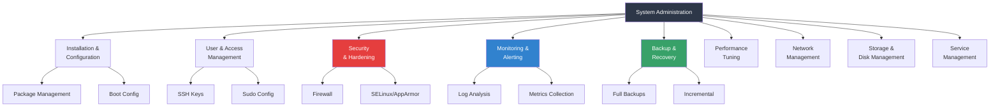
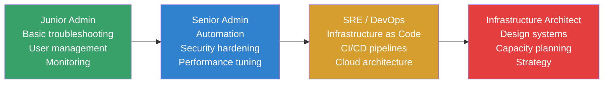

# System Administration Overview

## Introduction

System administration is the practice of maintaining, configuring, and ensuring the reliable operation of computer systems. A Linux system administrator (sysadmin) is responsible for the health, security, and performance of servers, workstations, and infrastructure that runs on Linux. This page provides a comprehensive overview of the role, core responsibilities, essential tools, and best practices that define modern Linux system administration.

The field has evolved significantly—from hand-crafted shell scripts and manual configuration to infrastructure as code, container orchestration, and automated compliance. Yet the fundamentals remain: keep systems running, keep data safe, and keep users productive.

## Core Responsibilities

### 1. System Installation and Configuration

The foundation of administration begins with proper system setup:

- **OS installation**: Partitioning, filesystem selection, bootloader configuration
- **Network configuration**: IP addressing, DNS, routing, firewall rules
- **User management**: Accounts, groups, permissions, sudo access
- **Package management**: Installing, updating, and removing software
- **Boot configuration**: GRUB, initramfs, systemd targets

```bash
# Example: Initial server setup checklist
# 1. Set hostname
hostnamectl set-hostname webserver01.example.com

# 2. Configure networking
nmcli con mod "Wired connection 1" ipv4.addresses 192.168.1.10/24
nmcli con mod "Wired connection 1" ipv4.gateway 192.168.1.1
nmcli con mod "Wired connection 1" ipv4.dns "8.8.8.8,8.8.4.4"
nmcli con mod "Wired connection 1" ipv4.method manual

# 3. Create admin user
useradd -m -s /bin/bash -G sudo admin
passwd admin

# 4. Update system
apt update && apt upgrade -y    # Debian/Ubuntu
dnf update -y                    # RHEL/Fedora

# 5. Configure firewall
ufw enable
ufw allow ssh
ufw allow http
```

### 2. User and Access Management

```bash
# User lifecycle management
useradd -m -s /bin/bash -G developers newuser    # Create
passwd newuser                                      # Set password
usermod -aG docker newuser                         # Add to group
chage -M 90 -W 14 newuser                         # Password expiry
userdel -r departed_user                           # Remove

# Sudo configuration
visudo
# newuser ALL=(ALL:ALL) ALL
# %developers ALL=(ALL) NOPASSWD: /usr/bin/docker

# SSH key management
mkdir -p /home/newuser/.ssh
cp authorized_keys /home/newuser/.ssh/
chmod 700 /home/newuser/.ssh
chmod 600 /home/newuser/.ssh/authorized_keys
chown -R newuser:newuser /home/newuser/.ssh
```

### 3. Security Hardening

```bash
# SSH hardening (/etc/ssh/sshd_config)
PermitRootLogin no
PasswordAuthentication no
MaxAuthTries 3
AllowUsers admin deploy
Protocol 2

# System hardening
apt install fail2ban unattended-upgrades
systemctl enable --now fail2ban

# Automatic security updates
dpkg-reconfigure -plow unattended-upgrades

# Firewall baseline
ufw default deny incoming
ufw default allow outgoing
ufw allow ssh
ufw enable

# File integrity monitoring
apt install aide
aide --init
mv /var/lib/aide/aide.db.new /var/lib/aide/aide.db
```

### 4. Monitoring and Alerting

```bash
# System health checks
uptime                    # Load average
free -h                   # Memory usage
df -h                     # Disk usage
iostat -xz 1              # Disk I/O
vmstat 1                  # Virtual memory stats
ss -tunlp                 # Network connections

# Process monitoring
ps auxf                   # Process tree
top -bn1                  # Snapshot of top
systemd-cgtop             # cgroup resource usage

# Log monitoring
journalctl -f             # Live log stream
journalctl -p err --since "1 hour ago"  # Recent errors
tail -f /var/log/syslog   # Traditional logs

# Automated monitoring
# Prometheus + Grafana for metrics
# Zabbix or Nagios for alerting
# ELK stack for log aggregation
```

### 5. Backup and Recovery

```bash
# Backup strategies
# 1. Full + incremental with rsync
rsync -avz --delete /data/ backup@nas:/backups/$(hostname)/

# 2. Snapshot-based with btrfs
btrfs subvolume snapshot -r /data /data/.snapshots/$(date +%Y%m%d)

# 3. Encrypted offsite with restic
restic -r s3:s3.amazonaws.com/mybucket init
restic -r s3:s3.amazonaws.com/mybucket backup /data

# 4. Database backups
pg_dump -Fc mydb > /backups/mydb_$(date +%Y%m%d).dump

# Testing restores (CRITICAL!)
restic -r s3:... restore latest --target /restore
pg_restore -d mydb_test /backups/mydb_20250721.dump
```

### 6. Performance Tuning

```bash
# CPU tuning
# Check governor
cat /sys/devices/system/cpu/cpu0/cpufreq/scaling_governor
# Set performance mode for servers
echo performance | tee /sys/devices/system/cpu/cpu*/cpufreq/scaling_governor

# Memory tuning
# Swap behavior
cat /proc/sys/vm/swappiness
echo 10 > /proc/sys/vm/swappiness  # Reduce swap aggressiveness

# Disk I/O tuning
# Scheduler selection
cat /sys/block/sda/queue/scheduler
echo mq-deadline > /sys/block/sda/queue/scheduler

# Network tuning
sysctl -w net.core.somaxconn=65535
sysctl -w net.ipv4.tcp_max_syn_backlog=65535
sysctl -w net.core.netdev_max_backlog=5000
```

## Essential Tools

### Command-Line Tools

| Category | Tools | Purpose |
|----------|-------|---------|
| **Text processing** | `grep`, `sed`, `awk`, `sort`, `uniq` | Log analysis, config parsing |
| **File management** | `find`, `rsync`, `tar`, `dd` | File operations, backups |
| **Network** | `ss`, `ip`, `ping`, `traceroute`, `dig`, `curl` | Network diagnostics |
| **Process** | `ps`, `top`, `htop`, `strace`, `ltrace` | Process debugging |
| **Disk** | `lsblk`, `blkid`, `fdisk`, `df`, `du`, `iotop` | Storage management |
| **Security** | `fail2ban-client`, `auditd`, `aide`, `openssl` | Security tools |
| **Package** | `apt`, `dnf`, `yum`, `pacman`, `snap` | Software management |

### Configuration Management

```bash
# Ansible (agentless, SSH-based)
ansible-playbook -i inventory site.yml

# Puppet (agent-based, declarative)
puppet agent --test

# Chef (agent-based, Ruby DSL)
chef-client

# SaltStack (agent or agentless)
salt '*' state.apply
```

### Container and Orchestration

```bash
# Docker
docker build -t myapp .
docker run -d --name web -p 80:80 myapp
docker compose up -d

# Kubernetes
kubectl apply -f deployment.yaml
kubectl get pods -A
kubectl logs -f pod-name

# Podman (rootless alternative)
podman run -d --name web -p 80:80 myapp
```

## Best Practices

### 1. Document Everything

```bash
# Keep a runbook
# /root/docs/RUNBOOK.md
## Emergency Contacts
- On-call: +1-555-0123
- Escalation: team-lead@example.com

## Common Issues
### Web server down
1. Check nginx: systemctl status nginx
2. Check logs: journalctl -u nginx --since "5 min ago"
3. Check disk: df -h
4. Restart: systemctl restart nginx
```

### 2. Automate Repetitive Tasks

```bash
# Cron for scheduled maintenance
# /etc/cron.d/maintenance
0 2 * * * root /usr/local/bin/backup.sh
0 3 * * 0 root /usr/local/bin/logrotate.sh
0 4 * * * root apt-get update && apt-get -y upgrade

# systemd timers (preferred over cron)
# /etc/systemd/system/backup.timer
[Unit]
Description=Daily backup

[Timer]
OnCalendar=*-*-* 02:00:00
Persistent=true

[Install]
WantedBy=timers.target
```

### 3. Principle of Least Privilege

```bash
# Don't run services as root
# Use dedicated service accounts
useradd -r -s /usr/sbin/nologin myservice

# Use capabilities instead of full root
setcap 'cap_net_bind_service=+ep' /usr/bin/myapp

# Restrict sudo access
# /etc/sudoers.d/deploy
deploy ALL=(ALL) NOPASSWD: /usr/bin/systemctl restart webapp

# Use systemd security features
# [Service]
# ProtectSystem=strict
# ProtectHome=yes
# NoNewPrivileges=yes
# PrivateTmp=yes
```

### 4. Monitor, Alert, Respond

```bash
# Key metrics to monitor
# - CPU usage > 80% sustained
# - Memory usage > 90%
# - Disk usage > 85%
# - Load average > 2× CPU count
# - Network errors/drops
# - Service availability

# Alert escalation
# P1 (5 min response): Service down, data loss
# P2 (30 min response): Degraded performance
# P3 (4 hour response): Non-critical issue
# P4 (next business day): Enhancement request
```

### 5. Change Management

```bash
# Before making changes:
# 1. Document what you're changing and why
# 2. Test in staging environment
# 3. Have a rollback plan
# 4. Schedule during maintenance window
# 5. Notify stakeholders

# Example change procedure
# Step 1: Snapshot/backup
btrfs subvolume snapshot -r / /pre-change-snapshot

# Step 2: Make change
vim /etc/nginx/nginx.conf
nginx -t && systemctl reload nginx

# Step 3: Verify
curl -I https://example.com
watch -n1 'ss -tunlp | grep nginx'

# Step 4: If issues, rollback
cp /etc/nginx/nginx.conf.bak /etc/nginx/nginx.conf
systemctl reload nginx
```

### 6. Security Mindset

```bash
# Regular security tasks
# Weekly: Review logs for anomalies
journalctl --since "1 week ago" | grep -i "fail\|error\|denied"

# Monthly: Review user accounts
awk -F: '$3 >= 1000 && $3 < 65534 {print $1}' /etc/passwd
# Check for unused accounts

# Quarterly: Update and patch
apt update && apt list --upgradable
# Apply security patches, reboot if needed

# Annually: Review access controls
cat /etc/sudoers
grep -r "PermitRootLogin\|PasswordAuthentication" /etc/ssh/
```

## Administration Tasks Summary



## Linux Distribution Families

Understanding the distribution landscape helps with cross-platform administration:

| Family | Distros | Package Manager | Init System |
|--------|---------|----------------|-------------|
| **Debian** | Ubuntu, Debian, Mint | `apt`, `dpkg` | systemd |
| **RHEL** | CentOS, Fedora, Rocky, Alma | `dnf`, `yum`, `rpm` | systemd |
| **SUSE** | openSUSE, SLES | `zypper`, `rpm` | systemd |
| **Arch** | Arch, Manjaro | `pacman` | systemd |
| **Alpine** | Alpine | `apk` | OpenRC |
| **Gentoo** | Gentoo | `emerge`, `portage` | OpenRC/systemd |

## Career Path



## References

- [The Linux Kernel Documentation](https://docs.kernel.org/)
- [LWN.net - Linux and free software news](https://lwn.net/)
- [GNU Project Documentation](https://www.gnu.org/doc/doc.html)
- [GNU Manuals](https://www.gnu.org/manual/manual.html)
- [Free Software Directory](https://directory.fsf.org/wiki/Main_Page)
- [Planet GNU](https://planet.gnu.org/)
- [Free Software Books](https://www.gnu.org/doc/other-free-books.html)

- [The Linux System Administrator's Guide](https://tldp.org/LDP/sag/html/) — Classic LDP guide
- [UNIX and Linux System Administration Handbook (5th Ed)](https://www.admin.com/) — The "bible" of sysadmin
- [Linux Foundation SysAdmin Course](https://training.linuxfoundation.org/training/linux-system-administration-essentials/) — Free training
- [Red Hat System Administration](https://www.redhat.com/en/services/training/rh124-red-hat-system-administration-i) — RHCSA preparation
- [ArchWiki](https://wiki.archlinux.org/) — Excellent Linux documentation
- [DigitalOcean Tutorials](https://www.digitalocean.com/community/tutorials) — Practical guides

## Related Topics

- [Disk Management](./disk-management.md) — Storage administration
- [Firewall Configuration](./firewall.md) — Network security
- [Logging](./logging.md) — System logging
- [Process Management](./process-management.md) — Process control
- [Networking Configuration](./networking-config.md) — Network setup
- [RAID](./raid.md) — Storage redundancy
- [System Rescue](./rescue.md) — Recovery procedures
- [SysV Init](./sysvinit.md) — Legacy init system
