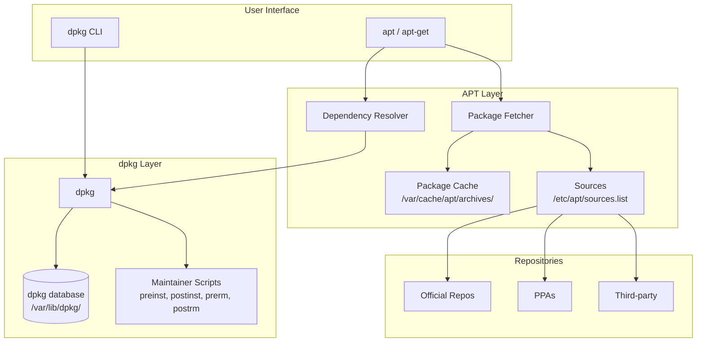

# dpkg and APT

## Introduction

On Debian-based Linux distributions (Debian, Ubuntu, Linux Mint, Pop!_OS, and many others), package management revolves around two complementary layers: **dpkg**, the low-level package manager that handles individual `.deb` files, and **APT** (Advanced Package Tool), the high-level manager that resolves dependencies, manages repositories, and automates upgrades. Understanding both layers is essential for system administration on the largest family of Linux distributions.

## The .deb Package Format

A `.deb` file is an `ar` archive containing three members:

```
$ ar t google-chrome-stable_126.0.6478.126-1_amd64.deb
debian-binary
control.tar.xz
data.tar.xz
```

| Member | Contents |
|--------|----------|
| `debian-binary` | Format version (typically `2.0`) |
| `control.tar.xz` | Package metadata: control file, pre/post install scripts, conffiles, triggers |
| `data.tar.xz` | Actual files to be installed on the filesystem |

### The Control File

The control file contains all metadata about the package:

```
Package: nginx
Version: 1.24.0-2ubuntu7
Architecture: amd64
Maintainer: Ubuntu Developers <ubuntu-devel-discuss@lists.ubuntu.com>
Installed-Size: 1234
Depends: libc6 (>= 2.34), libpcre3, libssl3 (>= 3.0.0), zlib1g (>= 1:1.1.4)
Suggests: nginx-doc
Conflicts: nginx-extras, nginx-full, nginx-light
Provides: httpd, httpd-cgi
Section: httpd
Priority: optional
Description: Small, powerful, scalable web/proxy server
 Nginx is a web server that can also be used as a reverse proxy, load
 balancer, and HTTP cache.
```

### Inspecting .deb Files Without Installing

```bash
# Show package info
dpkg-deb --info nginx_1.24.0-2ubuntu7_amd64.deb

# List files in the package
dpkg-deb --contents nginx_1.24.0-2ubuntu7_amd64.deb

# Extract without installing
dpkg-deb --extract nginx_1.24.0-2ubuntu7_amd64.deb /tmp/nginx-extracted/

# Show control file
dpkg-deb --show --showformat '${Package} ${Version} ${Architecture}\n' *.deb
```

## dpkg: The Low-Level Package Manager

`dpkg` operates on individual `.deb` files and the installed package database (`/var/lib/dpkg/`). It does *not* resolve dependencies — that's APT's job.

### Installing and Removing Packages

```bash
# Install a .deb file
sudo dpkg -i package.deb

# Install will fail if dependencies are missing:
# dpkg: dependency problems prevent configuration of nginx:
#  nginx depends on libpcre3; however:
#   Package libpcre3 is not installed.

# Fix broken dependencies after dpkg -i
sudo apt-get install -f    # "fix" broken installs

# Remove a package (keep config files)
sudo dpkg -r nginx

# Remove a package including config files
sudo dpkg -P nginx        # "purge"

# Reconfigure a package
sudo dpkg-reconfigure tzdata
```

### Querying the Package Database

```bash
# Is this package installed?
dpkg -l nginx
# Expected output:
# Desired=Unknown/Install/Remove/Purge/Hold
# | Status=Not/Inst/Conf-files/Unpacked/halF-conf/Half-inst/trig-aWait/Trig-pend
# |/ Err?=(none)/Reinst-required (Status,Err: uppercase=bad)
# ||/ Name           Version         Architecture Description
# +++-==============-===============-============-=================================
# ii  nginx          1.24.0-2ubuntu7 amd64        Small, powerful, scalable web/proxy server

# List all installed packages
dpkg -l

# Search for a package by name pattern
dpkg -l 'nginx*'

# Which package owns a file?
dpkg -S /etc/nginx/nginx.conf
# nginx: /etc/nginx/nginx.conf

# List files installed by a package
dpkg -L nginx

# Show package status and details
dpkg -s nginx

# Show packages in "broken" state
dpkg --audit

# List conffiles (config files managed by dpkg)
dpkg -c nginx_1.24.0-2ubuntu7_amd64.deb | grep conffiles
```

### dpkg Internals

The dpkg database lives in `/var/lib/dpkg/`:

```
/var/lib/dpkg/
├── available          # Available packages info
├── status             # Status of all installed packages
├── status-old         # Previous status file (backup)
├── info/              # .list, .md5sums, .conffiles, .preinst, .postinst, .prerm, .postrm
├── updates/           # Pending update operations
├── lock               # Lock file
├── lock-frontend      # Frontend lock file
└── tmp.ci/            # Temporary during installs
```

Each installed package has files in `/var/lib/dpkg/info/`:

```bash
ls /var/lib/dpkg/info/nginx.*
# nginx.conffiles
# nginx.list
# nginx.md5sums
# nginx.postinst
# nginx.postrm
# nginx.prerm
```

## APT: The High-Level Package Manager

APT operates on top of dpkg, adding dependency resolution, repository management, and automatic downloading. Two primary interfaces exist: `apt-get` (scriptable, stable CLI) and `apt` (user-friendly, with progress bars).

### apt-get vs apt

| Feature | apt-get | apt |
|---------|---------|-----|
| Target audience | Scripts, sysadmins | Interactive users |
| Output | Minimal, machine-friendly | Colored, progress bars |
| Stability | Stable CLI interface | May change between versions |
| Common commands | `install`, `remove`, `update`, `upgrade`, `dist-upgrade` | Same + `list`, `search`, `show`, `edit-sources` |

### Updating and Upgrading

```bash
# Update package index (fetches package lists from repositories)
sudo apt update

# Output:
# Hit:1 http://archive.ubuntu.com/ubuntu noble InRelease
# Get:2 http://archive.ubuntu.com/ubuntu noble-updates InRelease [126 kB]
# Get:3 http://archive.ubuntu.com/ubuntu noble-security InRelease [126 kB]
# Get:4 http://archive.ubuntu.com/ubuntu noble-updates/main amd64 Packages [423 kB]
# Fetched 675 kB in 1s (675 kB/s)
# Reading package lists... Done
# 15 packages can be upgraded. Run 'apt list --upgradable' to see them.

# Upgrade installed packages (conservative — no removals)
sudo apt upgrade

# Full upgrade (may remove packages to resolve conflicts)
sudo apt full-upgrade

# Dist-upgrade (same as full-upgrade, for historical reasons)
sudo apt-get dist-upgrade
```

### Installing and Removing

```bash
# Install a package
sudo apt install nginx

# Install specific version
sudo apt install nginx=1.24.0-2ubuntu7

# Install multiple packages
sudo apt install nginx postgresql redis-server

# Install a local .deb file with dependency resolution
sudo apt install ./google-chrome-stable_126.0_amd64.deb

# Remove a package
sudo apt remove nginx

# Remove package and config files
sudo apt purge nginx

# Remove automatically installed dependencies no longer needed
sudo apt autoremove

# Reinstall a package
sudo apt reinstall nginx
```

### Searching and Information

```bash
# Search for packages
apt search nginx

# Show package details
apt show nginx

# List all installed packages
apt list --installed

# List upgradable packages
apt list --upgradable

# List all available versions
apt list -a nginx

# Show package changelog (requires apt-listchanges)
apt changelog nginx
```

### apt-cache: Package Cache Operations

```bash
# Search package names and descriptions
apt-cache search nginx

# Show package details (more verbose than apt show)
apt-cache show nginx

# Show package dependencies
apt-cache depends nginx

# Show reverse dependencies (what depends on this)
apt-cache rdepends nginx

# Show policy (installed version, candidate version, pin priorities)
apt-cache policy nginx

# Output:
# nginx:
#   Installed: 1.24.0-2ubuntu7
#   Candidate: 1.24.0-2ubuntu7.1
#   Version table:
#      1.24.0-2ubuntu7.1 500
#         500 http://archive.ubuntu.com/ubuntu noble-updates/main amd64 Packages
#  *** 1.24.0-2ubuntu7 500
#         500 http://archive.ubuntu.com/ubuntu noble/main amd64 Packages
#         100 /var/lib/dpkg/status

# Show package stats
apt-cache stats
```

## sources.list and Repository Configuration

### The sources.list File

The traditional `/etc/apt/sources.list` file lists package repositories:

```
# /etc/apt/sources.list
deb http://archive.ubuntu.com/ubuntu/ noble main restricted universe multiverse
deb http://archive.ubuntu.com/ubuntu/ noble-updates main restricted universe multiverse
deb http://archive.ubuntu.com/ubuntu/ noble-security main restricted universe multiverse
deb http://archive.ubuntu.com/ubuntu/ noble-backports main restricted universe multiverse
```

**Format:** `deb URI distribution component [component ...]`

| Field | Description |
|-------|-------------|
| `deb` | Binary packages (use `deb-src` for source packages) |
| URI | Repository URL (http, https, ftp, file, cdrom) |
| Distribution | Release codename (`noble`, `jammy`, `bookworm`) |
| Component | `main` (officially supported), `restricted`, `universe`, `multiverse` (Ubuntu) |

### Modern DEB822 Format (sources.list.d/)

Ubuntu 24.04+ and newer Debian versions use `.sources` files in DEB822 format:

```bash
# /etc/apt/sources.list.d/ubuntu.sources
Types: deb
URIs: http://archive.ubuntu.com/ubuntu/
Suites: noble noble-updates noble-backports
Components: main restricted universe multiverse
Signed-By: /usr/share/keyrings/ubuntu-archive-keyring.gpg

Types: deb
URIs: http://security.ubuntu.com/ubuntu/
Suites: noble-security
Components: main restricted universe multiverse
Signed-By: /usr/share/keyrings/ubuntu-archive-keyring.gpg
```

### Adding a Third-Party Repository

Modern approach (signed with a keyring):

```bash
# 1. Download the GPG key
curl -fsSL https://packages.example.com/gpg.key | \
    sudo gpg --dearmor -o /usr/share/keyrings/example-keyring.gpg

# 2. Add the repository
echo "deb [signed-by=/usr/share/keyrings/example-keyring.gpg] https://packages.example.com/apt stable main" | \
    sudo tee /etc/apt/sources.list.d/example.list

# 3. Update and install
sudo apt update
sudo apt install example-package
```

## PPAs (Personal Package Archives)

PPAs are Ubuntu-specific repositories hosted on Launchpad, allowing developers to distribute software not in the official repositories.

```bash
# Add a PPA (old-style, still works)
sudo add-apt-repository ppa:graphics-drivers/ppa

# This automatically:
# 1. Adds the PPA to sources.list.d/
# 2. Imports the signing key
# 3. Runs apt update

# Remove a PPA
sudo add-apt-repository --remove ppa:graphics-drivers/ppa

# List all PPAs
ls /etc/apt/sources.list.d/*ubuntu*

# Using ppa-purge (removes PPA and downgrades packages)
sudo ppa-purge ppa:graphics-drivers/ppa
```

## Pinning and Priorities

APT pinning controls which repository provides a package when multiple sources are available.

```bash
# /etc/apt/preferences.d/99-pin-testing
Package: *
Pin: release a=testing
Pin-Priority: 100

# /etc/apt/preferences.d/50-nginx-stable
Package: nginx
Pin: version 1.24.*
Pin-Priority: 900
```

Pin priorities:
- **>1000**: Force this version, even if it's a downgrade
- **990**: Default candidate for install
- **500**: Default priority for installed repositories
- **100**: Installed packages; won't auto-upgrade
- **<100**: Only installed if no other version exists

```bash
# Check pinning status
apt-cache policy nginx
```

## Holding Packages

Prevent specific packages from being upgraded:

```bash
# Hold a package
sudo apt-mark hold nginx

# Show held packages
apt-mark showhold

# Unhold
sudo apt-mark unhold nginx

# Alternative: dpkg method
echo "nginx hold" | sudo dpkg --set-selections
```

## Essential APT Operations

```bash
# Clean local repository of retrieved package files
sudo apt clean           # Remove all cached packages
sudo apt autoclean       # Remove only outdated cached packages

# Download a package without installing
apt download nginx

# Show automatic vs manual installs
apt-mark showmanual
apt-mark showauto

# Check for broken dependencies
sudo apt check
sudo dpkg --configure -a

# Fix interrupted installations
sudo dpkg --configure -a
sudo apt-get install -f

# View APT history
cat /var/log/apt/history.log
cat /var/log/apt/term.log    # Full terminal output
```

## APT Configuration

APT's behavior is configured in `/etc/apt/apt.conf` and `/etc/apt/apt.conf.d/`:

```
// /etc/apt/apt.conf.d/99custom
// Set default "yes" for prompts
APT::Get::Assume-Yes "true";

// Keep downloaded packages after install
APT::Keep-Downloaded-Packages "true";

// Set download speed limit (0 = unlimited)
Acquire::http::Dl-Limit "1000";  // 1000 KB/s

// Number of download threads
Acquire::Queue-Host "4";

// HTTP proxy
Acquire::http::Proxy "http://proxy.example.com:3128";

// Disable recommended packages
APT::Install-Recommends "false";

// Enable suggested packages
APT::Install-Suggests "true";
```

## Automated Security Updates

```bash
# Install unattended-upgrades
sudo apt install unattended-upgrades

# Configure: /etc/apt/apt.conf.d/50unattended-upgrades
Unattended-Upgrade::Allowed-Origins {
    "${distro_id}:${distro_codename}-security";
};

Unattended-Upgrade::AutoFixInterruptedDpkg "true";
Unattended-Upgrade::Remove-Unused-Dependencies "true";
Unattended-Upgrade::Automatic-Reboot "false";

# Enable automatic updates
sudo dpkg-reconfigure -plow unattended-upgrades

# Test configuration
sudo unattended-upgrades --dry-run --debug
```

## Architecture Diagram



## References and Further Reading

- [dpkg man page](https://man7.org/linux/man-pages/man1/dpkg.1.html)
- [apt-get man page](https://man7.org/linux/man-pages/man8/apt-get.8.html)
- [Debian APT Wiki](https://wiki.debian.org/Apt)
- [Ubuntu Package Management](https://help.ubuntu.com/community/AptGet/Howto)
- [Debian Policy Manual — Binary packages](https://www.debian.org/doc/debian-policy/ch-binary.html)
- [APT Pinning (Debian Wiki)](https://wiki.debian.org/AptPreferences)
- [Debian Developer's Reference](https://www.debian.org/doc/manuals/developers-reference/)
- [APT Internals (Debian Wiki)](https://wiki.debian.org/Teams/Apt)

## Related Topics

- [RPM and DNF](./rpm-dnf.md) — The Red Hat family equivalent
- [Pacman](./pacman.md) — Arch Linux package management
- [Portage](./portage.md) — Gentoo's source-based package manager
- [Backup Strategies](../backup.md) — Backing up package configurations

## dpkg Advanced Operations

### Forcing Package States

When packages are in a broken state, dpkg provides options to force resolution:

```bash
# Force-remove a package with broken scripts
sudo dpkg --force-remove-reinstreq -r broken-package

# Force-overwrite files conflicting with another package
sudo dpkg --force-overwrite -i new-package.deb

# Force depends (ignore dependency issues)
sudo dpkg --force-depends -i package.deb

# Force all (use as last resort)
sudo dpkg --force-all -i package.deb

# Reconfigure a partially installed package
sudo dpkg --configure -a

# Set package status manually
sudo dpkg --set-selections <<< "nginx hold"  # Hold version
sudo dpkg --set-selections <<< "nginx install"  # Allow install

dpkg --get-selections | grep hold  # Show held packages
```

### Trigger Mechanism

Triggers are a dpkg feature that defers actions until after a batch of package operations:

```bash
# Common triggers:
# - update-initramfs: rebuilds initramfs after kernel changes
# - ldconfig: updates shared library cache
# - update-desktop-database: updates desktop file cache
# - texinfo: updates info directory

# View pending triggers
dpkg -s libc6 | grep Triggers
# Triggers-Pending: ldconfig

# Process pending triggers
sudo dpkg --configure --pending
```

### Diverting Files

Diversions allow a package to "steal" a file from another package:

```bash
# Divert a file (prevent package from overwriting it)
sudo dpkg-divert --divert /etc/custom/nginx.conf --rename /etc/nginx/nginx.conf

# List diversions
dpkg-divert --list

# Remove diversion
sudo dpkg-divert --rename --remove /etc/nginx/nginx.conf
```

## APT Hooks and Automation

### Pre-Install and Post-Install Hooks

```bash
# /etc/apt/apt.conf.d/99-hooks

# Run a script before any package operation
DPkg::Pre-Install-Pkgs {
    "/usr/local/bin/pre-apt-hook";
};

# Run after each package is unpacked
DPkg::Post-Invoke {
    "echo 'Package operation completed' | logger -t apt";
};

# Log all package operations
DPkg::Pre-Install-Pkgs {
    "dpkg --set-selections 2>&1 | logger -t apt-selections";
};
```

### APT List Changes

```bash
# Install apt-listchanges to see changelogs before upgrades
sudo apt install apt-listchanges

# Configure: /etc/apt/listchanges.conf
# [apt-listchanges]
# email_address=admin@example.com
# confirm=1
# headers=1
# which=both
```

## Building Custom Packages

### Creating a .deb Package

```bash
# Install build tools
sudo apt install build-essential devscripts debhelper

# Create package directory structure
mkdir -p mypackage-1.0/DEBIAN
mkdir -p mypackage-1.0/usr/local/bin

# Create the binary
cat > mypackage-1.0/usr/local/bin/myapp << 'EOF'
#!/bin/bash
echo "Hello from myapp v1.0"
EOF
chmod +x mypackage-1.0/usr/local/bin/myapp

# Create control file
cat > mypackage-1.0/DEBIAN/control << 'EOF'
Package: mypackage
Version: 1.0
Section: utils
Priority: optional
Architecture: amd64
Maintainer: Admin <admin@example.com>
Description: My custom application
 A simple custom package example.
EOF

# Build the package
dpkg-deb --build mypackage-1.0
# Produces: mypackage-1.0.deb

# Verify the package
dpkg-deb --info mypackage-1.0.deb
dpkg-deb --contents mypackage-1.0.deb

# Install
sudo dpkg -i mypackage-1.0.deb
```

### Maintainer Scripts Lifecycle

```bash
# preinst: Runs before package files are unpacked
# postinst: Runs after package files are unpacked
# prerm: Runs before package files are removed
# postrm: Runs after package files are removed

# Example postinst:
cat > mypackage-1.0/DEBIAN/postinst << 'EOF'
#!/bin/bash
set -e
if [ "$1" = "configure" ]; then
    # Create user
    useradd -r -s /usr/sbin/nologin myapp 2>/dev/null || true
    # Enable service
    systemctl enable myapp.service
fi
EOF
chmod 755 mypackage-1.0/DEBIAN/postinst
```

### Using `debuild` for Proper Packages

```bash
# Create a proper Debian source package
mkdir -p myapp-1.0/debian

# Required files:
# debian/control — package metadata
# debian/rules — build instructions (Makefile)
# debian/changelog — version history
# debian/compat — debhelper compatibility level

# Build
cd myapp-1.0
debuild -us -uc  # Build without signing

# Build and sign
debuild -k<key-id>
```

## APT Proxy and Caching

### APT Proxy Configuration

```bash
# /etc/apt/apt.conf.d/01proxy
Acquire::http::Proxy "http://proxy.example.com:3128";
Acquire::https::Proxy "http://proxy.example.com:3128";

# Per-host proxy
Acquire::http::Proxy::apt.example.com "DIRECT";
Acquire::http::Proxy::ppa.launchpad.net "http://proxy:3128";

# SOCKS proxy
Acquire::http::Proxy "socks5h://127.0.0.1:1080";
```

### Apt-Cacher-NG (Local Cache)

```bash
# Install on cache server
sudo apt install apt-cacher-ng

# Clients use: /etc/apt/apt.conf.d/01proxy
Acquire::http::Proxy "http://cache-server:3182";

# Access web interface: http://cache-server:3142/acng-report.html
```

## Snapshot and Rollback

### APT Snapshots with Snapper

```bash
# On Btrfs filesystem with snapper
sudo apt install snapper
sudo snapper create -d "before-upgrade" -t pre
sudo apt upgrade
sudo snapper create -d "after-upgrade" -t post

# Rollback
sudo snapper undochange 1..2  # Undo changes between snapshot 1 and 2
```

### Manual Snapshot with dpkg

```bash
# Record current state
dpkg --get-selections > /backup/selections-$(date +%Y%m%d).txt
dpkg -l > /backup/packages-$(date +%Y%m%d).txt

# Restore selections on another system
sudo dpkg --set-selections < /backup/selections-20240115.txt
sudo apt-get dselect-upgrade
```

## Debugging Package Issues

```bash
# Check what a package depends on
apt-cache depends nginx
apt-cache depends --installed nginx  # Installed deps only

# Check reverse dependencies (what breaks if removed)
apt-cache rdepends nginx
apt-cache rdepends --installed nginx

# Show package file list
dpkg -L nginx

# Find which package owns a file
dpkg -S /usr/bin/curl
dpkg -S '*/nginx.conf'  # Glob pattern

# Check for conffile changes (local modifications)
dpkg-query -W -f='${Conffiles}\n' nginx
# /etc/nginx/nginx.conf abc123def456  # Original hash
# Compare: md5sum /etc/nginx/nginx.conf

# View package install history
zcat /var/log/apt/history.log.*.gz | grep -A5 'Install\|Upgrade\|Remove'

# Find broken packages
dpkg --audit
apt list --installed 2>/dev/null | grep -i broken

# Fix broken state
sudo dpkg --configure -a
sudo apt-get install -f
sudo apt-get -f install
sudo apt --fix-broken install
```
