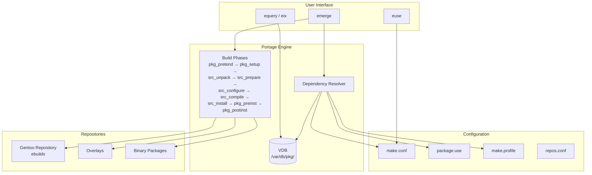

# Portage

## Introduction

Portage is the package management and distribution system for Gentoo Linux and its derivatives (Calculate Linux, Funtoo). Unlike binary package managers (dpkg, RPM, pacman), Portage compiles everything from source by default, giving users unparalleled control over how software is built and configured. This source-based approach, combined with the powerful USE flag system, allows Gentoo users to create highly customized systems optimized for specific hardware and use cases.

Portage was created by Daniel Robbins, Gentoo's founder, and is written primarily in Python with some bash components. Its design philosophy mirrors the BSD ports system — each package is defined by a "recipe" (ebuild) that describes how to fetch, configure, compile, and install the software.

## Core Concepts

### USE Flags

USE flags are the defining feature of Portage. They are boolean options that control which features are compiled into packages. For example, enabling the `ssl` USE flag causes packages to be built with SSL/TLS support; disabling `X` removes X11/graphical support.

```bash
# View current USE flags for the system
emerge --info | grep USE

# Example output:
# USE="X acl alsa amd64 bindist bzip2 cairo dbus elogind fontconfig
#      gdbm gif gpm gtk iconv icu jpeg libnotify libtirpc ncurses
#      nls nptl opengl pam pcre png pulseaudio readline seccomp spell
#      ssl systemd tcpd threads truetype udev unicode usb vorbis
#      wayland webp x264 xft zlib"
```

#### Types of USE Flags

| Type | Scope | Location |
|------|-------|----------|
| Global | Affects all packages | `/etc/portage/make.conf` |
| Per-package | Affects specific package | `/etc/portage/package.use/` |
| Per-package env | Per-package environment | `/etc/portage/package.env/` |
| Profile | System-wide defaults | `/etc/portage/make.profile/` |

#### Managing USE Flags

```bash
# /etc/portage/make.conf
USE="X gtk3 wayland -systemd pulseaudio alsa"

# Per-package USE flags
# /etc/portage/package.use/myflags
app-editors/vim python vim-interpreters
media-video/mpv lua youtube
www-client/firefox wayland hwaccel

# Temporarily set USE flags for a single emerge
USE="ldap" emerge --ask net-nds/openldap

# Query USE flags for a package
equery uses firefox
# Output:
# U I
# + + X          : Add support for X11
# + + dbus       : Enable D-Bus support
# - - debug      : Enable debug assertions
# + + ffmpeg     : Enable ffmpeg/libav-based audio/video codec support
# + + geckodriver: Install geckodriver for use with Selenium
# + + gmp-autoupdate : Allow gmp-eme to auto-update
# + + hardened   : Activate default security enhancements
# + + hwaccel    : Use hardware-accelerated video codecs
# + + lto        : Enable Link-Time-Optimization
# - - pgo        : Build with Profile-Guided Optimization
# + + wayland    : Enable Wayland display server support

# Show all available USE flags globally
euse -l
```

### Keywords

Keywords control which architectures and stability levels a package is available for:

```bash
# /etc/portage/package.accept_keywords
# Accept unstable (~arch) version for specific package
=www-client/firefox-128.0 ~amd64

# Accept any version from a specific repository
app-misc/example **   # Accept from any architecture

# Keyword meanings:
# stable:       Available and tested on this architecture
# ~arch:        Available but untested (masked by default)
# **:           Available on any architecture (use with caution)
# -arch:        Not available on this architecture
```

### Masking

Masking prevents installation of certain packages or versions:

```bash
# Package.mask: Prevent installation of specific versions
# /etc/portage/package.mask
>=dev-lang/python-3.13   # Mask Python 3.13 and above

# package.unmask: Override masks from the tree
# /etc/portage/package.unmask
=sys-apps/portage-3.0.60  # Unmask a specific version
```

Mask levels (from highest to lowest priority):
1. **User mask** (`/etc/portage/package.mask/`)
2. **Profile mask** (`/etc/portage/make.profile/package.mask`)
3. **Repository mask** (`profiles/package.mask` in ebuild repo)
4. **Keyword mask** (package not keyworded for this arch)

## emerge: The Command-Line Interface

`emerge` is Portage's primary command-line tool.

### Installing Packages

```bash
# Install a package
sudo emerge --ask app-editors/vim
# or shorthand:
sudo emerge -a app-editors/vim

# Install without asking (in scripts)
sudo emerge app-editors/vim

# Install with specific USE flags
sudo emerge -a app-editors/vim USE="python"

# Install a specific version
sudo emerge -a "=app-editors/vim-9.1.0120"

# Install from a specific repository
sudo emerge -a "guru/app-misc/example"

# Pretend (dry run)
sudo emerge --pretend app-editors/vim

# Fetch source only (don't compile)
sudo emerge --fetchonly app-editors/vim

# Resume after failure
sudo emerge --resume

# Install with build log
sudo emerge --verbose app-editors/vim 2>&1 | tee /var/log/emerge-vim.log
```

### Removing Packages

```bash
# Remove a package
sudo emerge --ask --depclean app-editors/nano

# Deep clean: remove the package and unneeded dependencies
sudo emerge --ask --depclean

# Remove configuration files too
sudo emerge --ask --unmerge app-editors/nano

# Prune unused orphans
sudo emerge --ask --prune sys-libs/oldlib
```

### Updating the System

```bash
# Update the Portage tree (package repository)
sudo emerge --sync
# or:
sudo emaint sync -a

# Update all packages
sudo emerge --ask --update --deep --newuse @world
# Shorthand: sudo emerge -aDuN @world

# Arguments explained:
# -a (--ask):        Confirm before proceeding
# -D (--deep):       Check deep dependencies
# -u (--update):     Update to latest version
# -N (--newuse):     Rebuild if USE flags changed

# Rebuild entire system
sudo emerge --ask --emptytree @system
sudo emerge --ask --emptytree @world

# Preserved rebuild (after library updates)
sudo emerge --ask @preserved-rebuild

# Rebuild packages affected by a library update
sudo revdep-rebuild
```

### Searching and Information

```bash
# Search for packages
emerge --search nginx
emerge -s nginx

# Search descriptions
emerge --searchdesc "web server"

# Show package info
emerge --info www-servers/nginx

# Show dependency tree
emerge --ep www-servers/nginx
# or using equery:
equery depgraph www-servers/nginx

# Show what would be installed (including deps)
emerge --pretend --verbose www-servers/nginx

# Show package metadata
emerge --metadata www-servers/nginx

# Show USE flags
emerge --info www-servers/nginx | grep USE
```

## /etc/portage Configuration

The Portage configuration directory structure:

```
/etc/portage/
├── make.conf              # Main configuration
├── make.profile -> /var/db/repos/gentoo/profiles/...
├── package.use/           # Per-package USE flags
│   ├── myflags
│   └── vim
├── package.accept_keywords/  # Accept unstable keywords
│   └── firefox
├── package.mask/          # Mask packages
├── package.unmask/        # Unmask packages
├── package.env/           # Per-package environment
├── repos.conf/            # Repository configuration
│   └── gentoo.conf
├── env/                   # Custom environment files
├── bashrc                 # Custom bash functions
└── sets/                  # Package sets
```

### make.conf

```bash
# /etc/portage/make.conf

# Compiler flags
COMMON_FLAGS="-march=native -O2 -pipe"
CFLAGS="${COMMON_FLAGS}"
CXXFLAGS="${COMMON_FLAGS}"
FCFLAGS="${COMMON_FLAGS}"
FFLAGS="${COMMON_FLAGS}"

# Rust flags
RUSTFLAGS="-C opt-level=2 -C target-cpu=native"

# MAKEOPTS: parallel compilation
MAKEOPTS="-j$(nproc)"

# Languages
L10N="en zh-CN"
LINGUAS="en zh_CN"

# USE flags
USE="X gtk3 wayland pulseaudio alsa -systemd elogind"

# Portage features
FEATURES="ccache parallel-fetch"

# Accept licenses
ACCEPT_LICENSE="*"

# Video cards
VIDEO_CARDS="amdgpu radeonsi"

# Input devices
INPUT_DEVICES="libinput"

# Locale
ACCEPT_KEYWORDS="~amd64"
```

### Repositories

```bash
# /etc/portage/repos.conf/gentoo.conf
[DEFAULT]
main-repo = gentoo

[gentoo]
location = /var/db/repos/gentoo
sync-type = git
sync-uri = https://github.com/gentoo-mirror/gentoo.git
auto-sync = yes

# Adding an overlay (repository)
# /etc/portage/repos.conf/guru.conf
[guru]
location = /var/db/repos/guru
sync-type = git
sync-uri = https://github.com/gentoo-mirror/guru.git
auto-sync = yes
```

## equery and Other Tools

### equery

```bash
# List files owned by a package
equery files vim

# Which package owns a file?
equery belongs /usr/bin/vim

# Show package dependencies
equery depends vim    # What depends on vim
equery depgraph vim   # Dependency graph

# Show USE flags for a package
equery uses vim

# Check for packages with missing dependencies
equery check vim

# List installed packages
equery list '*'

# List packages matching a pattern
equery list 'app-*'
```

### eix: Fast Package Search

```bash
# Install
sudo emerge app-portage/eix

# Update database
eix-update

# Search
eix nginx

# Search by category
eix -C www-servers

# Search installed
eix -I nginx

# Show versions
eix -v nginx
```

### gentoolkit

```bash
# Install
sudo emerge app-portage/gentoolkit

# equery: Query packages (see above)
# erecord: Record build information
# euse: Manage USE flags
euse -l                     # List all USE flags
euse -i ssl                 # Info about ssl USE flag
euse -E ssl                 # Enable globally
euse -D ssl                 # Disable globally
# revdep-rebuild: Rebuild packages with broken dependencies
revdep-rebuild
```

## Custom Ebuilds and Overlays

### Ebuild Structure

An ebuild is a bash script that defines how to build a package:

```bash
# Copyright 1999-2026 Gentoo Authors
# Distributed under the terms of the GNU General Public License v2

EAPI=8

DESCRIPTION="Example application"
HOMEPAGE="https://example.com"
SRC_URI="https://example.com/${P}.tar.gz"

LICENSE="MIT"
SLOT="0"
KEYWORDS="~amd64 ~x86"

IUSE="debug ssl"
REQUIRED_USE="ssl? ( !debug )"

RDEPEND="
    dev-libs/openssl:=
    sys-libs/zlib:=
"
DEPEND="${RDEPEND}"
BDEPEND="
    dev-build/cmake
    virtual/pkgconfig
"

src_configure() {
    local mycmakeargs=(
        -DENABLE_DEBUG=$(usex debug)
        -DENABLE_SSL=$(usex ssl)
    )
    cmake_src_configure
}

src_install() {
    cmake_src_install
    einstalldocs
}
```

### Creating an Overlay

```bash
# Create overlay structure
mkdir -p /var/db/repos/myoverlay/{metadata,profiles,eclass,app-misc/example}

# /var/db/repos/myoverlay/metadata/layout.conf
masters = gentoo

# /var/db/repos/myoverlay/profiles/repo_name
myoverlay

# Add ebuild
mkdir -p /var/db/repos/myoverlay/app-misc/example
cp example-1.0.ebuild /var/db/repos/myoverlay/app-misc/example/
cd /var/db/repos/myoverlay/app-misc/example
ebuild example-1.0.ebuild manifest

# Register the overlay
# /etc/portage/repos.conf/myoverlay.conf
[myoverlay]
location = /var/db/repos/myoverlay
auto-sync = no
```

### Using layman (Alternative to Manual Overlay Management)

```bash
sudo emerge app-portage/layman
sudo layman -a guru          # Add the guru overlay
sudo layman -l               # List available overlays
sudo layman -S               # Sync all overlays
```

## Binary Packages

While Portage builds from source by default, it can create and use binary packages:

```bash
# Build a binary package while installing
sudo emerge --buildpkg www-servers/nginx

# Install from binary only (no source compilation)
sudo emerge --usepkgonly www-servers/nginx

# Build binary packages for all updates
sudo emerge --buildpkg --update --deep @world

# Binary package location
ls /var/cache/binpkgs/
```

## ccache Integration

```bash
# Install ccache
sudo emerge dev-util/ccache

# Enable in make.conf
# /etc/portage/make.conf
FEATURES="ccache"
CCACHE_DIR="/var/cache/ccache"
CCACHE_SIZE="5G"

# Check ccache stats
ccache -s
```

## Architecture Diagram



## References and Further Reading

- [Gentoo Handbook](https://wiki.gentoo.org/wiki/Handbook:Main_Page)
- [Portage Man Page](https://wiki.gentoo.org/wiki/Man:emerge)
- [USE Flags](https://wiki.gentoo.org/wiki/USE_flag)
- [Ebuild Writing Guide](https://devmanual.gentoo.org/)
- [Gentoo Wiki: Portage](https://wiki.gentoo.org/wiki/Portage)
- [Gentoo Wiki: Ebuild](https://wiki.gentoo.org/wiki/Ebuild)
- [Gentoo Overlays Guide](https://wiki.gentoo.org/wiki/Overlay)

## dispatch-conf: Configuration File Management

When Portage upgrades a package that includes configuration files, it needs to handle merging changes with user modifications. `dispatch-conf` is the recommended tool:

```bash
# Run dispatch-conf after an emerge that changed config files
sudo dispatch-conf

# For each config file conflict, you see:
# --- /etc/nginx/nginx.conf.current  (your current file)
# +++ /etc/nginx/nginx.conf.new      (package's new file)
# 
# Options:
#   z: Replace current with new (discard your changes)
#   n: Keep current (discard package changes)
#   m: Merge manually (opens merge editor)
#   u: Use new file and apply your changes
#   t: Toggle between showing the diff and the merged result
#   p: Show the proposed merge
#   l: View the current file
#   r: View the new file
#   h: Help

# Configure dispatch-conf
# /etc/portage/dispatch-conf.conf
# merge-etc-file-dispatchers:
#   /etc/portage/ make.conf  = diff3
#   /etc/ make.conf  = diff3
# Always use diff3 for three-way merge
use_diff3 = yes
```

### etc-update (Alternative)

```bash
# etc-update is the older tool (less recommended)
sudo etc_merge

# Interactively merge changes
# -3: Merge using diff3
# -5: Merge using diff + your changes
# -7: Discard all changes
```

## Package Sets

Portage supports named sets of packages for bulk operations:

```bash
# Built-in sets:
# @system    — Core system packages
# @world     — All installed packages (user-selected)
# @installed — Everything installed
# @module-rebuild — Kernel module packages
# @preserved-rebuild — Packages with preserved libraries

# Custom sets
# /etc/portage/sets/custom.sets
[my-dev-tools]
dev-lang/python
dev-lang/go
dev-util/cmake
dev-vcs/git

[my-server]
www-servers/nginx
dev-db/postgresql
app-admin/syslog-ng

# Use sets with emerge
sudo emerge --ask @my-dev-tools
sudo emerge --ask --update --deep @my-server

# Query set contents
emerge --pretend @my-dev-tools
```

## Binary Package Hosting (binhost)

For managing multiple Gentoo machines, you can set up a binary package host:

```bash
# On the build machine:
# Build binary packages for everything
sudo emerge --buildpkg --update --deep @world

# Serve binaries via HTTP
# /etc/portage/repos.conf/binhost.conf
[binhost]
location = /var/cache/binpkgs
# Use nginx or lighttpd to serve /var/cache/binpkgs/

# On client machines:
# /etc/portage/repos.conf/binhost.conf
[binhost]
# Fetch pre-built packages
GETBINPKG="yes"
BINPKG_FORMAT="gpkg"

# Or set in make.conf
# /etc/portage/make.conf
FEATURES="getbinpkg"
PORTAGE_BINHOST="http://buildserver/packages"
```

## Ebuild Development and Testing

### Repoman (Quality Checker)

```bash
# Install repoman (part of Portage)
sudo emerge app-portage/repoman

# Check an ebuild for QA issues
cd /var/db/repos/myoverlay/app-misc/example
repoman full

# Common checks:
# - Manifest integrity
# - Dependency correctness
# - EAPI compatibility
# - KEYWORDS validity
# - HOMEPAGE accessibility
# - License correctness
```

### Ebuild Testing in Sandbox

```bash
# Test individual phases
ebuild example-1.0.ebuild clean
ebuild example-1.0.ebuild fetch      # Download sources
ebuild example-1.0.ebuild unpack     # Unpack sources
ebuild example-1.0.ebuild prepare    # Apply patches
ebuild example-1.0.ebuild configure  # Run configure
ebuild example-1.0.ebuild compile    # Build
ebuild example-1.0.ebuild install    # Install to temp root
ebuild example-1.0.ebuild qmerge     # Merge to live filesystem

# Full test cycle
ebuild example-1.0.ebuild clean install

# Test with specific USE flags
USE="debug ssl" ebuild example-1.0.ebuild install
```

### EAPI (Ebuild API Version)

```bash
# EAPI defines the version of the ebuild specification
# Each EAPI adds or changes features

# Current EAPI versions (as of 2024):
# EAPI 7: Stable, widely used
# EAPI 8: Current recommended, adds:
#   - BDEPEND (build-only deps)
#   - Improved bash compatibility
#   - Better SLOT handling
#   - ED/EDESTDIR for install paths

# Example EAPI 8 ebuild:
EAPI=8

inherit cmake

# BDEPEND: build dependencies (only needed at build time)
BDEPEND="dev-build/cmake"
# DEPEND: compile-time dependencies
DEPEND="dev-libs/openssl:="
# RDEPEND: runtime dependencies
RDEPEND="dev-libs/openssl:="
```

## Portage Hooks and Environment

### bashrc Hooks

```bash
# /etc/portage/bashrc — runs during every emerge operation

# Available phases:
# pre_pkg_pretend, post_pkg_pretend
# pre_pkg_setup, post_pkg_setup
# pre_src_unpack, post_src_unpack
# pre_src_prepare, post_src_prepare
# pre_src_configure, post_src_configure
# pre_src_compile, post_src_compile
# pre_src_install, post_src_install
# pre_pkg_preinst, post_pkg_preinst
# pre_pkg_postinst, post_pkg_postinst

# Example: log all emerge operations
post_pkg_postinst() {
    echo "$(date): ${CATEGORY}/${PF} installed" >> /var/log/emerge.log
}

# Example: set ccache per-package
pre_src_compile() {
    if [[ ${CATEGORY} == "sys-devel" ]]; then
        export FEATURES="ccache"
    fi
}
```

### package.env: Per-Package Environment

```bash
# /etc/portage/env/debug-build.conf
CFLAGS="${CFLAGS} -g -O0"
CXXFLAGS="${CXXFLAGS} -g -O0"
FEATURES="${FEATURES} splitdebug"

# /etc/portage/package.env
app-editors/vim debug-build.conf
dev-lang/python debug-build.conf

# /etc/portage/env/noccache.conf
FEATURES="${FEATURES} -ccache"

# Apply to packages that break with ccache
www-client/firefox noccache.conf
```

## Maintenance Commands

```bash
# Check for dependency cycles
emerge --pretend --emptytree @world

# Find broken packages
revdep-rebuild

# Clean download cache
eclean-dist

# Clean binary packages
eclean packages

# Deep clean old distfiles
eclean-dist --deep

# Show world file (user-selected packages)
cat /var/lib/portage/world

# Check for security vulnerabilities
sudo emerge --ask app-portage/glsa-check
glsa-check -t all      # List all GLSAs
glsa-check -f all      # Fix all affected packages

# Sync repositories and update
sudo emaint sync -a
sudo emerge --ask --update --deep --newuse @world
```

## Related Topics

- [dpkg and APT](./dpkg-apt.md) — Binary package management
- [RPM and DNF](./rpm-dnf.md) — Red Hat family package management
- [Pacman](./pacman.md) — Arch Linux package management
- [Cross-compilation](../../embedded/buildroot.md) — Cross-compiling for embedded targets

