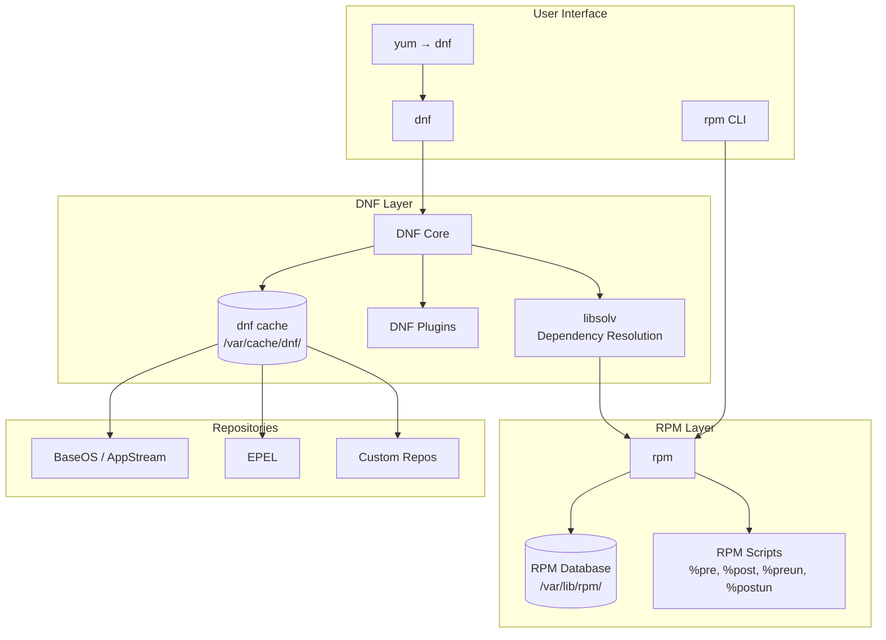

# RPM and DNF

## Introduction

The Red Hat family of Linux distributions — including RHEL, CentOS Stream, Fedora, AlmaLinux, Rocky Linux, and Oracle Linux — uses RPM (RPM Package Manager) as its low-level package format and DNF (Dandified YUM) as the high-level package manager. This ecosystem serves a significant portion of enterprise Linux deployments worldwide, making proficiency with RPM and DNF essential for system administrators.

RPM was originally developed in 1997 by Erik Troan and Marc Ewing at Red Hat, evolving from the earlier Red Hat Package Manager into the recursive acronym "RPM Package Manager." DNF replaced the older YUM (Yellowdog Updater, Modified) starting with Fedora 22 in 2015, bringing improved dependency resolution via libsolv and better performance.

## The .rpm Package Format

An RPM package is a compressed cpio archive with embedded metadata, stored in a format based on the RPM header structure.

```bash
# File naming convention
# <name>-<version>-<release>.<arch>.rpm
# Example: nginx-1.24.0-1.el9.x86_64.rpm
```

### Inspecting RPM Files

```bash
# Query information from an RPM file (without installing)
rpm -qip nginx-1.24.0-1.el9.x86_64.rpm

# Output:
# Name        : nginx
# Version     : 1.24.0
# Release     : 1.el9
# Architecture: x86_64
# Install Date: (not installed)
# Group       : System Environment/Daemons
# Size        : 1893456
# License     : BSD
# Signature   : RSA/SHA256, Mon 15 Jan 2024 10:30:00 AM UTC, Key ID ...
# Source RPM  : nginx-1.24.0-1.el9.src.rpm
# Build Date  : Mon 15 Jan 2024 09:15:00 AM UTC
# Build Host  : buildhost.example.com
# Relocations : (not relocatable)
# Packager    : Nginx <packages@nginx.com>
# Vendor      : Nginx
# URL         : https://nginx.org
# Summary     : A high performance web server and reverse proxy
# Description :
# NGINX is a free, open-source, high-performance HTTP server...

# List files in the RPM
rpm -qlp nginx-1.24.0-1.el9.x86_64.rpm

# List dependencies required
rpm -qRp nginx-1.24.0-1.el9.x86_64.rpm

# List configuration files
rpm -qcp nginx-1.24.0-1.el9.x86_64.rpm

# Check scripts (pre/post install/remove)
rpm -qp --scripts nginx-1.24.0-1.el9.x86_64.rpm

# Check changelog
rpm -qcp --changelog nginx-1.24.0-1.el9.x86_64.rpm
```

### RPM Package Internals

RPM packages contain four sections:

1. **Lead** (deprecated): 96-byte header identifying the file as RPM
2. **Signature**: GPG signature and checksums (MD5, SHA1, SHA256)
3. **Header**: Structured metadata (name, version, dependencies, file lists, scripts)
4. **Payload**: Compressed cpio archive (gzip, xz, zstd, or bzip2)

```bash
# Extract RPM payload without installing
rpm2cpio nginx-1.24.0-1.el9.x86_64.rpm | cpio -idmv

# This creates the directory tree ./usr/sbin/nginx, ./etc/nginx/, etc.
```

## rpm: The Low-Level Package Manager

### Installing and Removing

```bash
# Install an RPM file
sudo rpm -ivh package.rpm
# -i: install
# -v: verbose
# -h: show hash progress bar

# Upgrade (install or update)
sudo rpm -Uvh package.rpm

# Fresh install only (fail if not already installed)
sudo rpm -Fvh package.rpm

# Remove a package
sudo rpm -e nginx

# Remove ignoring dependencies (dangerous)
sudo rpm -e --nodeps nginx

# Reinstall a package
sudo rpm -ivh --replacepkgs nginx-1.24.0-1.el9.x86_64.rpm
```

### Querying Installed Packages

```bash
# Is a package installed?
rpm -q nginx
# nginx-1.24.0-1.el9.x86_64

# Detailed info about installed package
rpm -qi nginx

# List files installed by a package
rpm -ql nginx

# Which package owns a file?
rpm -qf /etc/nginx/nginx.conf
# nginx-1.24.0-1.el9.x86_64

# List configuration files (won't be overwritten on upgrade unless --force)
rpm -qc nginx

# List documentation files
rpm -qd nginx

# Show all installed packages
rpm -qa

# Show recently installed packages
rpm -qa --last | head -20

# Verify a package (check file integrity)
rpm -V nginx
# S.5....T.    /etc/nginx/nginx.conf
# S = Size differs
# 5 = MD5 differs
# T = Timestamp differs
# . = Test passed
```

### RPM Database

The RPM database lives in `/var/lib/rpm/`:

```bash
ls /var/lib/rpm/
# Basenames  Conflictname  Dirnames  Enhancename  Group  Installtid
# Name  Obsoletename  Packages  Providename  Recommend  Require
# Sha1header  Sigmd5  Slot  Suggest  Transfiletriggername
# Triggername  __db.001  __db.002  __db.003

# Rebuild the RPM database (if corrupted)
sudo rpm --rebuilddb

# Verify database integrity
sudo rpm -qa | wc -l
```

## DNF: The High-Level Package Manager

DNF (Dandified YUM) is the modern replacement for YUM, using libsolv for faster and more reliable dependency resolution.

### Basic Operations

```bash
# Install a package
sudo dnf install nginx

# Install a specific version
sudo dnf install nginx-1.24.0-1.el9

# Install a local RPM with dependency resolution
sudo dnf install ./package.rpm

# Remove a package
sudo dnf remove nginx

# Update all packages
sudo dnf update

# Update a specific package
sudo dnf update nginx

# Check for available updates
sudo dnf check-update

# Downgrade a package
sudo dnf downgrade nginx

# Reinstall a package
sudo dnf reinstall nginx

# Autoremove unneeded dependencies
sudo dnf autoremove
```

### Searching and Information

```bash
# Search for packages
dnf search nginx

# Show package details
dnf info nginx

# List available packages
dnf list available

# List installed packages
dnf list installed

# List installed packages matching a pattern
dnf list installed 'nginx*'

# List available versions
dnf list --showduplicates nginx

# Show package dependencies
dnf deplist nginx

# Show what provides a file or capability
dnf provides /etc/nginx/nginx.conf
dnf provides "nginx"

# Show package history
dnf history list

# Show details of a specific transaction
dnf history info 42

# Undo a transaction
dnf history undo 42

# Redo a transaction
dnf history redo 42
```

### Package Groups and Modules

```bash
# List available groups
dnf group list

# Show group details
dnf group info "Web Server"

# Install a group
sudo dnf group install "Web Server"

# Remove a group
sudo dnf group remove "Web Server"

# List module streams
dnf module list

# Enable a module stream
sudo dnf module enable nginx:1.24

# Install a module
sudo dnf module install nginx:1.24/default

# Switch module stream
sudo dnf module switch-to nginx:1.26

# Reset a module
sudo dnf module reset nginx
```

### Module Streams Explained

Module streams allow multiple versions of the same software to coexist. For example, you might have Node.js 18 and 20 available simultaneously:

```bash
# View available Node.js streams
dnf module list nodejs
# Name    Stream   Profiles     Summary
# nodejs  18       common [d]   Javascript runtime
# nodejs  20       common [d]   Javascript runtime

# Enable and install Node.js 20
sudo dnf module enable nodejs:20
sudo dnf module install nodejs:20/common

# Check active streams
dnf module list --enabled
```

## Repository Configuration

Repository configurations live in `/etc/yum.repos.d/` as `.repo` files:

```ini
# /etc/yum.repos.d/epel.repo
[epel]
name=Extra Packages for Enterprise Linux $releasever - $basearch
metalink=https://mirrors.fedoraproject.org/metalink?repo=epel-$releasever&arch=$basearch
enabled=1
gpgcheck=1
countme=1
gpgkey=file:///etc/pki/rpm-gpg/RPM-GPG-KEY-EPEL-$releasever

[epel-debuginfo]
name=Extra Packages for Enterprise Linux $releasever - $basearch - Debug
metalink=https://mirrors.fedoraproject.org/metalink?repo=epel-debug-$releasever&arch=$basearch
enabled=0
gpgcheck=1
gpgkey=file:///etc/pki/rpm-gpg/RPM-GPG-KEY-EPEL-$releasever
```

### Repository Options

| Option | Description |
|--------|-------------|
| `name` | Human-readable name |
| `baseurl` | URL to the repository |
| `metalink` | URL to a metalink file (contains mirror list + checksums) |
| `mirrorlist` | URL to a file listing mirrors |
| `enabled` | Enable (1) or disable (0) the repo |
| `gpgcheck` | Verify package signatures |
| `gpgkey` | URL to the GPG key |
| `priority` | Repository priority (lower = higher priority, 1-99) |
| `cost` | Relative cost of accessing this repo (default 1000) |
| `exclude` | Packages to exclude |
| `includepkgs` | Only include these packages |

### Adding Repositories

```bash
# Install EPEL (Extra Packages for Enterprise Linux)
sudo dnf install epel-release

# Add a custom repository
sudo dnf config-manager --add-repo https://example.com/repo/example.repo

# Enable a repository
sudo dnf config-manager --set-enabled crb

# Disable a repository
sudo dnf config-manager --set-disabled epel-testing

# List all repositories
dnf repolist all

# Show enabled repositories
dnf repolist
```

### EPEL (Extra Packages for Enterprise Linux)

EPEL provides packages not included in the base RHEL/CentOS repositories:

```bash
# Install EPEL
sudo dnf install epel-release

# Search EPEL packages
dnf --enablerepo=epel search htop

# Install from EPEL
sudo dnf install htop
```

## DNF Configuration

DNF's configuration is in `/etc/dnf/dnf.conf`:

```ini
[main]
gpgcheck=1
installonly_limit=3
clean_requirements_on_remove=True
best=True
installonly_limit=3
countme=True
max_parallel_downloads=10
fastestmirror=True
deltarpm=True
metadata_expire=6h
```

### Important DNF Config Options

| Option | Default | Description |
|--------|---------|-------------|
| `gpgcheck` | True | Verify GPG signatures |
| `best` | True | Install best version or fail |
| `installonly_limit` | 3 | Max kernel versions to keep |
| `clean_requirements_on_remove` | True | Remove deps when removing a package |
| `max_parallel_downloads` | 3 | Number of parallel downloads |
| `fastestmirror` | False | Auto-select fastest mirror |
| `deltarpm` | True | Use delta RPMs to reduce downloads |
| `metadata_expire` | 48h | How often to refresh metadata |

## DNF Plugins

```bash
# List installed plugins
dnf list installed 'dnf-plugin*'

# Useful plugins
sudo dnf install dnf-plugin-system-upgrade   # System upgrades
sudo dnf install dnf-automatic               # Automatic updates
sudo dnf install dnf-plugin-versionlock       # Lock package versions

# Lock a package version
sudo dnf versionlock add nginx
sudo dnf versionlock list

# Automatic security updates
sudo dnf install dnf-automatic
sudo systemctl enable --now dnf-automatic-install.timer
```

## Building RPM Packages

### Setting Up the Build Environment

```bash
# Install build tools
sudo dnf install rpm-build rpmdevtools

# Create build directory structure
rpmdev-setuptree
ls ~/rpmbuild/
# BUILD  BUILDROOT  RPMS  SOURCES  SPECS  SRPMS

# Create a spec file skeleton
rpmdev-newspec nginx-custom
```

### A Minimal SPEC File

```spec
Name:           nginx-custom
Version:        1.0.0
Release:        1%{?dist}
Summary:        Custom nginx configuration

License:        MIT
URL:            https://example.com
Source0:        %{name}-%{version}.tar.gz

Requires:       nginx

%description
Custom nginx configuration for example.com.

%prep
%autosetup

%build
# Nothing to build

%install
mkdir -p %{buildroot}/etc/nginx/conf.d
install -m 644 example.conf %{buildroot}/etc/nginx/conf.d/example.conf

%files
%config(noreplace) /etc/nginx/conf.d/example.conf

%changelog
* Mon Jul 21 2026 Admin <admin@example.com> - 1.0.0-1
- Initial package
```

### Building the Package

```bash
# Build from spec file
rpmbuild -ba ~/rpmbuild/SPECS/nginx-custom.spec

# Build binary only
rpmbuild -bb ~/rpmbuild/SPECS/nginx-custom.spec

# Build from source RPM
rpmbuild --rebuild nginx-custom-1.0.0-1.el9.src.rpm
```

## Comparison with apt/dpkg

| Feature | DNF/RPM | APT/dpkg |
|---------|---------|----------|
| Distribution | RHEL, Fedora, CentOS | Debian, Ubuntu |
| Package format | .rpm | .deb |
| Low-level tool | rpm | dpkg |
| High-level tool | dnf | apt/apt-get |
| Config | /etc/yum.repos.d/ | /etc/apt/sources.list.d/ |
| Local DB | /var/lib/rpm/ | /var/lib/dpkg/ |
| Build tool | rpmbuild | dpkg-buildpackage |
| Modules | Yes (DNF modules) | No |
| Delta packages | deltarpm | apt-dpkg-ref |

## Architecture Diagram



## References and Further Reading

- [RPM documentation](https://rpm.org/documentation/)
- [DNF documentation](https://dnf.readthedocs.io/)
- [Fedora Packaging Guidelines](https://docs.fedoraproject.org/en-US/packaging-guidelines/)
- [RPM Packaging Guide](https://rpm-packaging-guide.github.io/)
- [EPEL Wiki](https://fedoraproject.org/wiki/EPEL)
- [man rpm(8)](https://man7.org/linux/man-pages/man8/rpm.8.html)
- [man dnf(8)](https://man7.org/linux/man-pages/man8/dnf.8.html)

## Related Topics

- [dpkg and APT](./dpkg-apt.md) — The Debian/Ubuntu package ecosystem
- [Pacman](./pacman.md) — Arch Linux package management
- [Portage](./portage.md) — Gentoo's source-based approach
- [Backup Strategies](../backup.md) — Backing up package configurations and data
