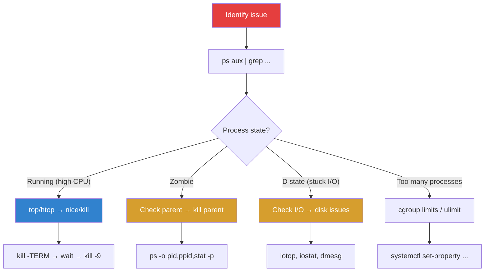

# Process Management

## Introduction

Process management is one of the most frequent tasks in Linux system administration. Understanding how to list, monitor, prioritize, and control processes is essential for maintaining system health, debugging issues, and managing resources effectively. Every running program on Linux is a process, and the kernel provides a rich set of tools for inspecting and controlling them.

## Listing Processes

### `ps` — Process Snapshot

The `ps` command shows a snapshot of current processes. Its syntax varies between BSD and System V styles:

```bash
# BSD style (no dash)
ps aux
# USER       PID %CPU %MEM    VSZ   RSS TTY      STAT START   TIME COMMAND
# root         1  0.0  0.0 169436 13264 ?        Ss   Jul15   0:45 /sbin/init
# root         2  0.0  0.0      0     0 ?        S    Jul15   0:00 [kthreadd]
# root       456  0.0  0.0  72308  5684 ?        Ss   Jul15   1:23 /usr/sbin/sshd
# www-data   789  0.5  1.2 234567 45678 ?        Sl   Jul20  12:34 /usr/sbin/nginx
# postgres  1024  2.3  4.5 987654 123456 ?       Ssl  Jul15  45:67 /usr/lib/postgres

# System V style (with dash)
ps -ef
# UID        PID  PPID  C STIME TTY          TIME CMD
# root         1     0  0 Jul15 ?        00:00:45 /sbin/init
# root         2     0  0 Jul15 ?        00:00:00 [kthreadd]

# Process tree (BSD style)
ps auxf
# Shows parent-child relationships with tree formatting

# Process tree (System V style)
ps -ejH
# Or with forest format
ps -eo pid,ppid,stat,comm --forest
#   PID  PPID STAT COMMAND
#     1     0 Ss   systemd
#   456     1 Ss   └─ sshd
#   789   456 Ss       └─ sshd
#  1024   789 S            └─ bash
#  2048  1024 R                └─ ps

# Custom output format
ps -eo pid,ppid,user,%cpu,%mem,vsz,rss,tty,stat,start,time,comm
# PID  PPID USER     %CPU %MEM    VSZ   RSS TT       STAT  STARTED     TIME COMMAND

# Threads
ps -eLf
# Shows LWP (lightweight process = thread) column

# Show environment of a process
ps eww -p 1234

# Show command line arguments
ps -p 1234 -o args=
# /usr/sbin/nginx -g daemon off;

# Find processes by name
ps -C nginx
ps aux | grep nginx

# Top CPU consumers
ps aux --sort=-%cpu | head -10

# Top memory consumers
ps aux --sort=-%mem | head -10

# Show elapsed time
ps -eo pid,etime,comm | sort -k2 -r | head -10
#   PID     ELAPSED COMMAND
#     1    7-02:15:30 systemd
#   456    7-02:15:30 sshd
```

### `ps` Output Columns Explained

| Column | Description |
|--------|-------------|
| `PID` | Process ID |
| `PPID` | Parent process ID |
| `USER` | Process owner |
| `%CPU` | CPU usage percentage |
| `%MEM` | Memory usage percentage |
| `VSZ` | Virtual memory size (KB) |
| `RSS` | Resident set size (physical memory, KB) |
| `TTY` | Controlling terminal (? = none) |
| `STAT` | Process state |
| `START` | Start time |
| `TIME` | Cumulative CPU time |

### Process States (STAT)

| State | Code | Description |
|-------|------|-------------|
| Running | `R` | Running or runnable |
| Sleeping | `S` | Interruptible sleep |
| Disk sleep | `D` | Uninterruptible sleep (usually I/O) |
| Stopped | `T` | Stopped by signal |
| Zombie | `Z` | Terminated, waiting for parent to reap |
| Traced | `t` | Stopped by debugger |
| Dead | `X` | Dead (should never be seen) |

**Modifier flags:**
- `s` — Session leader
- `+` — Foreground process group
- `l` — Multi-threaded
- `<` — High priority (nice < 0)
- `N` — Low priority (nice > 0)

## Real-Time Monitoring

### `top`

```bash
top
# top - 14:32:01 up 7 days,  2:15,  1 user,  load average: 0.50, 0.75, 0.80
# Tasks: 234 total,   2 running, 232 sleeping,   0 stopped,   0 zombie
# %Cpu(s):  5.2 us,  1.3 sy,  0.0 ni, 92.8 id,  0.5 wa,  0.0 hi,  0.2 si,  0.0 st
# MiB Mem :  16384.0 total,   8192.0 free,   4096.0 used,   4096.0 buff/cache
# MiB Swap:   4096.0 total,   4096.0 free,      0.0 used.  11264.0 avail Mem
#
#   PID USER      PR  NI    VIRT    RES    SHR S  %CPU  %MEM     TIME+ COMMAND
#  1234 postgres  20   0  987654 123456  12345 S   5.2   0.7  45:67.89 postgres
#  5678 www-data  20   0  234567  45678   5678 R   2.1   0.3  12:34.56 nginx

# Interactive commands in top:
# 1      — Toggle individual CPU cores
# M      — Sort by memory
# P      — Sort by CPU (default)
# T      — Sort by time
# k      — Kill a process (enter PID)
# r      — Renice a process
# f      — Select display fields
# c      — Show full command line
# H      — Show threads
# V      — Forest view (tree)
# W      — Save configuration
```

### `htop`

`htop` is an enhanced interactive process viewer:

```bash
htop
# Features:
# - Color-coded display
# - Mouse support
# - Tree view (F5)
# - Search (F3) and filter (F4)
# - Sort by various columns (F6)
# - Kill processes with signals (F9)
# - Nice adjustment (F7/F8)

# Configuration stored in ~/.config/htop/htoprc
```

### `btop` / `glances` — Modern Alternatives

```bash
# btop — Beautiful system monitor
btop

# glances — Comprehensive system monitoring
glances
glances -w  # Web interface on port 61208
```

## Process Signals

### Signal Types

```bash
# List all signals
kill -l
#  1) SIGHUP       2) SIGINT       3) SIGQUIT      4) SIGILL
#  5) SIGTRAP      6) SIGABRT      7) SIGBUS       8) SIGFPE
#  9) SIGKILL     10) SIGUSR1     11) SIGSEGV     12) SIGUSR2
# 13) SIGPIPE     14) SIGALRM     15) SIGTERM     16) SIGSTKFLT
# 17) SIGCHLD     18) SIGCONT     19) SIGSTOP     20) SIGTSTP
# 21) SIGTTIN     22) SIGTTOU     23) SIGURG      24) SIGXCPU
# 25) SIGXFSZ     26) SIGVTALRM   27) SIGPROF     28) SIGWINCH
# 29) SIGIO       30) SIGPWR      31) SIGSYS      34) SIGRTMIN
```

### Common Signals

| Signal | Number | Default Action | Description |
|--------|--------|---------------|-------------|
| `SIGHUP` | 1 | Terminate | Hangup (reload config for daemons) |
| `SIGINT` | 2 | Terminate | Interrupt (Ctrl+C) |
| `SIGQUIT` | 3 | Core dump | Quit (Ctrl+\\) |
| `SIGKILL` | 9 | Terminate | Force kill (uncatchable) |
| `SIGTERM` | 15 | Terminate | Graceful termination (default for `kill`) |
| `SIGSTOP` | 19 | Stop | Pause process (uncatchable) |
| `SIGCONT` | 18 | Continue | Resume stopped process |
| `SIGUSR1` | 10 | Terminate | User-defined (often reopen logs) |
| `SIGUSR2` | 12 | Terminate | User-defined |

### Sending Signals

```bash
# Send SIGTERM (default, graceful)
kill 1234
kill -15 1234
kill -TERM 1234

# Send SIGKILL (force kill)
kill -9 1234
kill -KILL 1234

# Send SIGHUP (reload config)
kill -HUP 1234
# Most daemons: nginx, sshd, etc. reload config on HUP

# Send to process group
kill -TERM -1234    # Negative PID = process group

# Send to all processes (DANGEROUS)
kill -TERM -1       # All processes you can signal
killall -TERM nginx # All processes named nginx

# pkill — kill by pattern
pkill -f "python.*myapp"  # Match full command line
pkill -u myuser            # All processes of user

# killall — kill by name
killall nginx              # Kill all nginx processes
killall -s HUP nginx       # Send HUP to all nginx

# Signal handling in scripts
trap 'echo "Caught SIGTERM, cleaning up..."; exit' TERM
trap 'echo "Caught SIGINT"; exit' INT
```

## Process Priority with `nice` and `renice`

```bash
# Start with lower priority (higher nice value)
nice -n 10 ./cpu_intensive_job

# Start with higher priority (needs root)
nice -n -5 ./critical_service

# Change priority of running process
renice 15 -p 1234              # Set PID 1234 to nice 15
renice -5 -p 1234              # Needs root for negative nice
renice 10 -u myuser            # All processes of myuser
renice 10 -g mygroup           # All processes in group

# View nice values
ps -eo pid,ni,comm | head -10
#   PID  NI COMMAND
#     1   0 systemd
#   456  10 batch_job
#   789 -10 critical_svc

# I/O priority
ionice -c 3 ./backup.sh        # Idle I/O class
ionice -c 2 -n 7 ./batch_job   # Best-effort, lowest priority
ionice -p 1234                  # Check I/O priority of PID

# Real-time priority (needs root/capability)
chrt -f 50 ./realtime_app      # SCHED_FIFO priority 50
chrt -r 30 ./realtime_app      # SCHED_RR priority 30
chrt -p 1234                    # Check scheduling policy

# See Process Priorities page for full details
```

## systemd Process Management

### systemd-cgtop

```bash
# Real-time cgroup resource monitoring
systemd-cgtop
# Control Group                        Tasks   %CPU   Memory  Input/s Output/s
# /                                      678    5.2     4.0G   100K    200K
# /system.slice                           45    2.1     1.2G    50K    100K
# /system.slice/postgresql.service        12    1.5     800M    30K     80K
# /system.slice/nginx.service              8    0.5     200M    10K     50K
# /user.slice                             23    0.3     500M     5K     20K
```

### systemd Resource Controls

```bash
# View service cgroup
systemctl show nginx.service | grep -E "^(CPU|Memory|Tasks|IO)"
# CPUShares=18446744073709551615
# MemoryMax=18446744073709551615
# TasksMax=4915

# Set runtime limits
systemctl set-property nginx.service CPUQuota=50%
systemctl set-property nginx.service MemoryMax=512M
systemctl set-property nginx.service TasksMax=100

# Persistent limits (in unit file)
# [Service]
# CPUQuota=50%
# MemoryMax=512M
# MemoryHigh=384M
# IOWeight=100
# TasksMax=100
```

### Service Management

```bash
# Start/stop/restart
systemctl start nginx
systemctl stop nginx
systemctl restart nginx
systemctl reload nginx       # Reload config without restart

# Status
systemctl status nginx
# ● nginx.service - A high performance web server
#      Loaded: loaded (/lib/systemd/system/nginx.service; enabled)
#      Active: active (running) since Mon 2025-07-21 10:00:00 UTC; 4h ago
#    Main PID: 789 (nginx)
#       Tasks: 3 (limit: 4915)
#      Memory: 12.5M
#         CPU: 1.234s
#      CGroup: /system.slice/nginx.service
#              ├─789 "nginx: master process /usr/sbin/nginx"
#              ├─790 "nginx: worker process"
#              └─791 "nginx: worker process"

# Enable/disable (start on boot)
systemctl enable nginx
systemctl disable nginx

# List failed services
systemctl --failed

# List all services
systemctl list-units --type=service

# View logs
journalctl -u nginx --since "1 hour ago"
journalctl -u nginx -f  # Follow
```

## Advanced Process Inspection

### `strace` — System Call Tracing

```bash
# Trace system calls of a running process
strace -p 1234

# Trace a new command
strace ls /tmp

# Show only specific syscalls
strace -e trace=open,read,write -p 1234

# Count syscalls
strace -c ls /tmp
# % time     seconds  usecs/call     calls    errors syscall
# ------ ----------- ----------- --------- --------- ----------------
#  50.00    0.001000         100        10           read
#  30.00    0.000600          60        10           write
#  20.00    0.000400          40        10           open

# Show timestamps
strace -T -p 1234  # Time spent in each syscall

# Trace child processes
strace -f -p 1234

# Output to file
strace -o trace.log -p 1234
```

### `lsof` — Open Files

```bash
# All open files
lsof

# Files opened by process
lsof -p 1234

# Processes using a file
lsof /var/log/syslog

# Network connections
lsof -i :80
lsof -i tcp:443
lsof -i -P -n  # All network, numeric

# Files opened by user
lsof -u myuser

# Count open files per process
lsof | awk '{print $2}' | sort | uniq -c | sort -rn | head

# Check file descriptor limits
lsof -p 1234 | wc -l
cat /proc/1234/limits | grep "open files"
# Max open files            1024                 1048576              files
```

### `/proc` Filesystem

```bash
# Process details
cat /proc/1234/status     # Process status summary
cat /proc/1234/cmdline    # Command line (null-separated)
cat /proc/1234/environ    # Environment variables
cat /proc/1234/limits     # Resource limits
cat /proc/1234/maps       # Memory mappings
cat /proc/1234/fd/        # Open file descriptors
ls -la /proc/1234/fd/     # Show what FDs point to
cat /proc/1234/io         # I/O statistics
cat /proc/1234/stat       # Detailed process stats
cat /proc/1234/sched      # Scheduler statistics

# System-wide
cat /proc/cpuinfo         # CPU information
cat /proc/meminfo         # Memory information
cat /proc/loadavg         # Load average
cat /proc/uptime          # Uptime
cat /proc/stat            # CPU statistics
```

## Process Management Workflow



## References

- [ps(1) man page](https://man7.org/linux/man-pages/man1/ps.1.html)
- [top(1) man page](https://man7.org/linux/man-pages/man1/top.1.html)
- [kill(1) man page](https://man7.org/linux/man-pages/man1/kill.1.html)
- [strace(1) man page](https://man7.org/linux/man-pages/man1/strace.1.html)
- [lsof(8) man page](https://man7.org/linux/man-pages/man8/lsof.8.html)
- [proc(5) man page](https://man7.org/linux/man-pages/man5/proc.5.html)

## Related Topics

- [Process Priorities](../kernel/processes/priorities.md) — Nice values, RT scheduling
- [Cgroups](../kernel/processes/cgroups.md) — Resource control
- [Process Groups](../kernel/processes/process-groups.md) — Sessions and job control
- [System Administration Overview](./overview.md) — Monitoring practices
