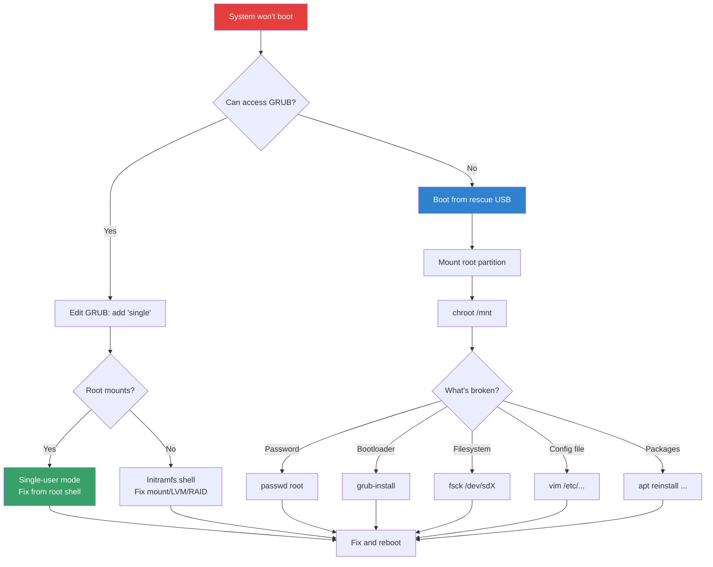

# System Rescue

## Introduction

When a Linux system fails to boot, has corrupted filesystems, or becomes unresponsive, system rescue techniques are your last line of defense. These methods allow you to access a broken system, repair damage, recover data, and restore normal operation. Knowing how to rescue a system is a critical skill—when things go wrong, you often can't just Google the answer because the machine with the problem is the one you'd normally search from.

This page covers the primary rescue approaches: single-user mode, initramfs shell, filesystem repair, chroot environments, and live CD/USB rescue.

## Single-User Mode (Runlevel 1 / Rescue Target)

Single-user mode boots the system with minimal services, a root shell, and no networking—ideal for password resets, filesystem repairs, and configuration fixes.

### Booting into Single-User Mode via GRUB

```bash
# Method 1: Edit GRUB boot entry (temporary)

# 1. Reboot the system
# 2. When GRUB appears, press 'e' to edit
# 3. Find the line starting with "linux" or "linux16"
# 4. Change:
#    ro quiet splash
#    To:
#    ro single init=/bin/bash
#    Or add: single (or: systemd.unit=rescue.target)
# 5. Press Ctrl+X or F10 to boot

# This boots directly to a root shell without any password
```

### systemd Rescue Targets

```bash
# Rescue target (minimal system with root shell)
systemctl isolate rescue.target
# Or from boot: systemd.unit=rescue.target

# Emergency target (even more minimal, no initramfs services)
systemctl isolate emergency.target
# Or from boot: systemd.unit=emergency.target

# Multi-user (normal server mode)
systemctl isolate multi-user.target

# Graphical mode
systemctl isolate graphical.target
```

### Using `systemctl` to Switch Targets

```bash
# From GRUB, add to linux line:
systemd.unit=emergency.target

# Or simply:
single            # Old-style, equivalent to rescue.target
systemd.unit=1    # Numeric target
```

### What You Can Do in Single-User Mode

```bash
# 1. Reset root password
passwd root
# Enter new password twice

# 2. Fix /etc/fstab errors
mount -o remount,rw /
vim /etc/fstab
# Comment out or fix broken entries

# 3. Disable problematic services
systemctl disable broken-service

# 4. Fix bootloader
grub-install /dev/sda
update-grub

# 5. Read-only root? Remount it
mount -o remount,rw /

# 6. Filesystem check
fsck /dev/sda2         # Must be unmounted
# If root is mounted read-only, that's usually OK for fsck
```

## Initramfs Shell

The initramfs (initial RAM filesystem) is a minimal filesystem loaded into memory during boot, before the real root filesystem is mounted. If the boot process fails in the initramfs stage, you can drop to a shell within it.

### When to Use Initramfs Shell

- Root filesystem cannot be mounted (corruption, wrong UUID)
- LVM/VG not found
- RAID array degraded and won't assemble
- Missing kernel modules for storage
- Encrypted disk (LUKS) passphrase issues

### Dropping to Initramfs Shell

```bash
# Method 1: Add 'break' to kernel command line (GRUB)
# Edit GRUB entry, add 'break' to linux line:
# linux /vmlinuz root=UUID=... break
# This drops to shell at various initramfs stages

# Method 2: Specific break points
# break=premount   — Before mounting root
# break=mount      — During mount
# break=bottom     — After all initramfs scripts

# Method 3: 'panic=N' — Reboot after N seconds if boot fails
# Useful for headless servers
```

### Common Initramfs Shell Tasks

```bash
# In the initramfs shell, you have busybox utilities

# Check available block devices
cat /proc/partitions
ls /dev/sd* /dev/nvme* /dev/mapper/*

# Scan for LVM
lvm vgscan
lvm vgchange -ay
lvm lvs

# Assemble RAID
mdadm --assemble --scan

# Check what went wrong
dmesg | tail -50

# Mount root manually
mount /dev/mapper/vg0-root /root
# Then exit to continue boot

# Or mount and fix
mount /dev/sda2 /root
chroot /root
# Fix issues, then exit and reboot
```

## Filesystem Repair

### `fsck` — File System Check

```bash
# CRITICAL: NEVER run fsck on a mounted filesystem!
# Always unmount first, or use rescue mode where root is read-only

# Check and repair ext4
fsck /dev/sda2
# fsck from util-linux 2.39.3
# e2fsck 1.47.0 (5-Feb-2023)
# /dev/sda2 contains a file system with errors, check forced.
# Pass 1: Checking inodes, blocks, and sizes
# Pass 2: Checking directory structure
# Pass 3: Checking directory connectivity
# Pass 4: Checking reference counts
# Pass 5: Checking group summary summary
# /dev/sda2: 123456/61054976 files (0.2% non-contiguous), 98765432/244190592 blocks

# Auto-repair (answer yes to all)
fsck -y /dev/sda2

# Force check even if clean
fsck -f /dev/sda2

# Check only (no repair)
fsck -n /dev/sda2

# ext4-specific tools
e2fsck -f /dev/sda2
e2fsck -y /dev/sda2

# XFS repair
xfs_repair /dev/sdb1
# If log is dirty:
xfs_repair -L /dev/sdb1  # Zero log (may lose recent data)

# Btrfs check and repair
btrfs check /dev/sdb1
btrfs check --repair /dev/sdb1  # DANGEROUS

# Force fsck on next boot
touch /forcefsck
# Or:
tune2fs -c 1 /dev/sda2  # Check on next mount
```

### Filesystem Recovery Scenarios

```bash
# Scenario 1: Superblock backup (ext4)
# "Bad superblock" error
# Find backup superblocks:
mke2fs -n /dev/sda2  # Shows superblock locations without formatting
# Backup superblocks stored at: 32768, 98304, 163840, 229376, ...

# Use backup superblock
e2fsck -b 32768 /dev/sda2

# Or:
mount -o sb=131072 /dev/sda2 /mnt  # Use alternate superblock

# Scenario 2: Resize after crash
resize2fs /dev/sda2  # Auto-detect and fix size

# Scenario 3: Lost+found directory missing
e2fsck -y /dev/sda2  # Recreates lost+found

# Scenario 4: Filesystem full but df shows space
# Out of inodes!
df -i
# Filesystem      Inodes  IUsed   IFree IUse% Mounted on
# /dev/sda2      32768000 32768000      0  100% /

# Find files consuming inodes:
find / -xdev -type f | wc -l
# Usually caused by many small files (e.g., mail queue, session files)
find /var -xdev -type f | wc -l
```

## chroot Environment

A `chroot` (change root) environment lets you run commands as if a different directory were the root filesystem. This is the primary method for repairing a system from a live CD or rescue environment.

### Setting Up chroot

```bash
# From a live CD/rescue environment:

# 1. Identify and mount the root filesystem
lsblk
mount /dev/sda2 /mnt

# 2. Mount critical virtual filesystems
mount --bind /dev /mnt/dev
mount --bind /dev/pts /mnt/dev/pts
mount --bind /proc /mnt/proc
mount --bind /sys /mnt/sys
mount --bind /run /mnt/run

# 3. For EFI systems
mount /dev/sda1 /mnt/boot/efi

# 4. For LVM
vgchange -ay
mount /dev/mapper/vg0-root /mnt

# 5. Enter chroot
chroot /mnt /bin/bash

# Now you're "inside" the installed system
# All commands use the installed system's binaries and configs
```

### Common chroot Operations

```bash
# Inside chroot:

# 1. Reset root password
passwd root

# 2. Fix GRUB bootloader
grub-install /dev/sda
update-grub
# Or for UEFI:
grub-install --target=x86_64-efi --efi-directory=/boot/efi

# 3. Fix /etc/fstab
blkid  # Get correct UUIDs
vim /etc/fstab

# 4. Reinstall/update packages
apt update && apt install --reinstall grub-efi-amd64
# Or:
dnf reinstall grub2-efi-x64

# 5. Fix initramfs
update-initramfs -u -k all
# Or:
dracut --force

# 6. Check/fix network config
vim /etc/network/interfaces
# Or:
nmcli con show
```

### systemd-nspawn (Enhanced chroot)

```bash
# systemd-nspawn provides a more complete chroot with namespace isolation
systemd-nspawn -D /mnt

# With networking
systemd-nspawn -D /mnt --network-veth

# Run a specific command
systemd-nspawn -D /mnt /usr/sbin/grub-install /dev/sda
```

## Live CD/USB Rescue

### Creating a Rescue USB

```bash
# Download a rescue ISO
# Ubuntu Server: https://ubuntu.com/download/server
# SystemRescue: https://www.system-rescue.org/
# GParted Live: https://gparted.org/livecd.php

# Write to USB (from another machine)
dd if=rescue.iso of=/dev/sdX bs=4M status=progress
sync

# Or with Ventoy (multi-ISO USB)
# https://www.ventoy.net/
```

### Rescue Workflow

```bash
# Boot from rescue USB

# 1. Identify disks and partitions
lsblk -f
blkid

# 2. Check RAID status
cat /proc/mdstat
mdadm --detail /dev/md0

# 3. Activate LVM
vgchange -ay

# 4. Mount root filesystem
mount /dev/mapper/vg0-root /mnt

# 5. Mount other filesystems
mount /dev/sda1 /mnt/boot/efi
mount --bind /dev /mnt/dev
mount --bind /proc /mnt/proc
mount --bind /sys /mnt/sys

# 6. chroot into the system
chroot /mnt /bin/bash

# 7. Repair, then exit and reboot
exit
umount -R /mnt
reboot
```

### Network Rescue (SSH)

```bash
# If you can't physically access the server

# 1. Boot into rescue mode via IPMI/iLO/iDRAC/BMC
# Most servers have remote management

# 2. Or use PXE boot with rescue image

# 3. Once in rescue mode, start SSH
passwd root  # Set temporary password
systemctl start ssh
# Or:
/usr/sbin/sshd

# 4. SSH in and fix
ssh root@server-ip
```

## Data Recovery

### Recovering Deleted Files

```bash
# ext4: extundelete
apt install extundelete
# IMPORTANT: Unmount the partition first!
umount /dev/sda2
extundelete /dev/sda2 --restore-all
# Recovered files in RECOVERED_FILES/

# ext4: ext4magic
ext4magic /dev/sda2 -a $(date -d "2 hours ago" +%s) -d /recovery

# General: testdisk/photorec
apt install testdisk
photorec /dev/sda2
# Recovers files by signature (doesn't need filesystem metadata)

# XFS: xfs_undelete (limited)
xfs_undelete /dev/sdb1
```

### Recovering from Accidental `rm -rf`

```bash
# 1. STOP using the filesystem immediately!
#    Every write may overwrite recoverable data.

# 2. Unmount if possible
umount /affected/partition

# 3. If can't unmount (root filesystem), boot from rescue USB

# 4. Use recovery tools
extundelete /dev/sda2 --restore-directory /home/user/important

# 5. Check backups (obvious but often forgotten)
restic snapshots
restic restore latest --target /recovery
```

### LVM Snapshot for Safe Recovery

```bash
# Create snapshot before attempting risky repairs
lvcreate -L 5G -n root-snap -s /dev/vg0/root

# Mount snapshot read-only
mount -o ro /dev/vg0/root-snap /mnt/snapshot

# Attempt recovery on original
# If things go wrong, restore from snapshot
lvconvert --merge /dev/vg0/root-snap
```

## Bootloader Repair

### GRUB2 Recovery

```bash
# From rescue environment with chroot:

# BIOS systems
chroot /mnt
grub-install /dev/sda
update-grub
exit

# UEFI systems
chroot /mnt
mount /dev/sda1 /boot/efi
grub-install --target=x86_64-efi --efi-directory=/boot/efi --bootloader-id=ubuntu
update-grub
exit

# If GRUB config is corrupted
grub-mkconfig -o /boot/grub/grub.cfg
# Or:
update-grub

# If boot partition is missing/damaged
# Recreate:
mkfs.ext4 /dev/sda1
mount /dev/sda1 /mnt/boot
apt install --reinstall linux-image-$(uname -r)
update-grub
```

## Rescue Workflow Diagram



## References

- [systemd.special(7) man page](https://man7.org/linux/man-pages/man7/systemd.special.7.html) — Rescue/emergency targets
- [fsck(8) man page](https://man7.org/linux/man-pages/man8/fsck.8.html)
- [chroot(8) man page](https://man7.org/linux/man-pages/man8/chroot.8.html)
- [GRUB2 manual](https://www.gnu.org/software/grub/manual/grub/)
- [SystemRescue documentation](https://www.system-rescue.org/)
- [ArchWiki: Recovery](https://wiki.archlinux.org/title/Recovery)

## Related Topics

- [Disk Management](./disk-management.md) — Filesystem creation and fsck
- [RAID](./raid.md) — RAID failure and rebuild
- [SysV Init](./sysvinit.md) — Legacy boot and runlevel concepts
