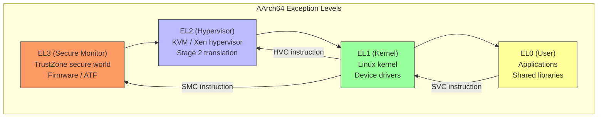
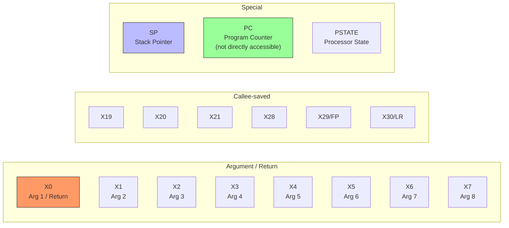
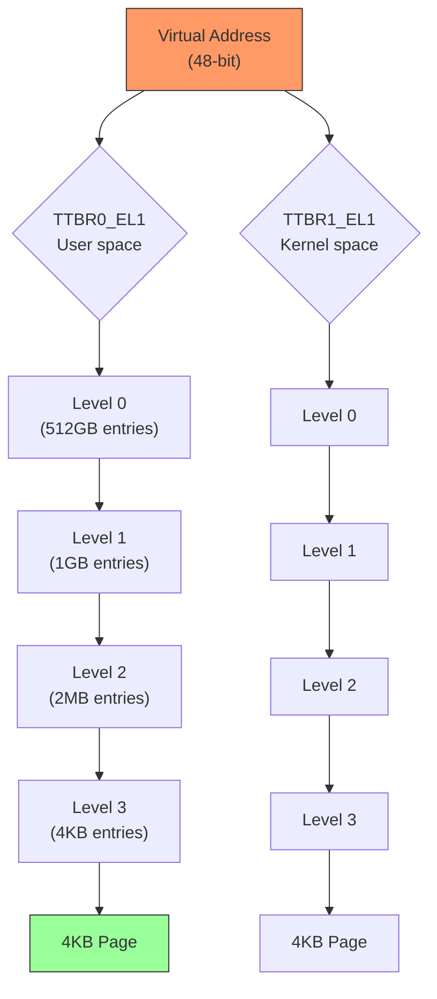
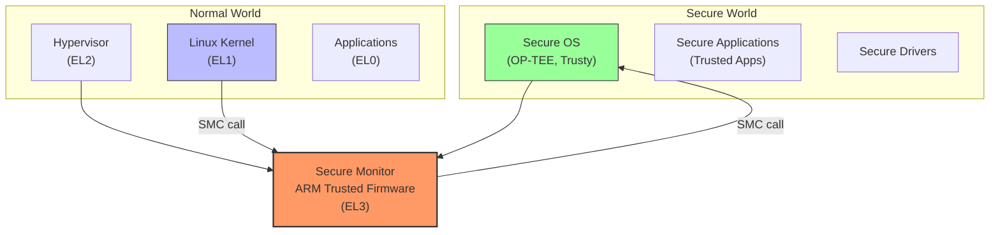
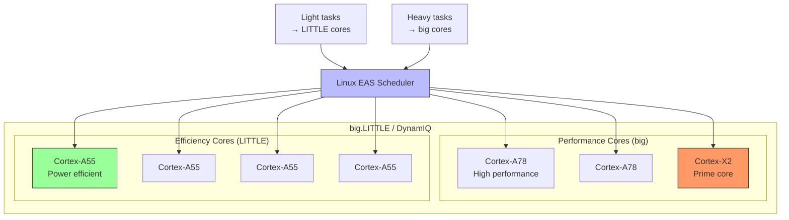

# ARM and AArch64 Architecture

## Introduction

ARM (Advanced RISC Machine) is the most widely deployed processor architecture in the world. ARM-based chips power virtually all smartphones, most tablets, a growing number of laptops (Apple Silicon, Qualcomm Snapdragon), embedded systems, network equipment, and increasingly, servers (AWS Graviton, Ampere Altra). The 64-bit version, **AArch64**, is the architecture behind modern ARM Linux systems.

Understanding ARM/AArch64 is essential for modern Linux development, as the architecture's influence extends from tiny microcontrollers to hyperscale data centers.

## ARM Architecture Overview

### ARM vs. AArch64

```
ARM Architecture Versions
─────────────────────────
ARMv4    — ARM7TDMI (Game Boy Advance)
ARMv5    — ARM926EJ-S (embedded Linux classic)
ARMv6    — ARM11 (Raspberry Pi 1)
ARMv7    — Cortex-A8/A9/A15 (most 32-bit Linux)
ARMv8-A  — AArch64 (64-bit) + AArch32 (32-bit compat)
ARMv9-A  — SVE2, MTE, RME (latest)

Key differences ARM (32-bit) vs AArch64:
─────────────────────────────────────────
Feature          ARM (32-bit)      AArch64
──────────────   ────────────      ────────
Registers        16 (R0-R15)       31 (X0-X30)
PC accessible?   Yes (R15)         No
Address space    4 GB              256 TB (48-bit)
Privilege modes  User, FIQ, IRQ,   EL0-EL3
                 Supervisor, Abort,
                 Undefined, System
Floating point   VFP (optional)    NEON (mandatory)
SIMD             NEON (optional)   NEON (mandatory)
Thumb mode       Yes (16-bit ISA)  No (fixed 32-bit)
```

### Exception Levels

AArch64 uses **Exception Levels (EL)** instead of x86 rings:



```
Exception Level Usage
─────────────────────
EL0: User space
     Applications, libraries
     No privileged access
     Accesses EL1 via SVC (supervisor call)

EL1: Kernel space
     Linux kernel
     Device drivers
     Memory management (stage 1)
     Interrupt handling

EL2: Hypervisor
     KVM, Xen
     Stage 2 address translation
     Virtual interrupt injection
     Accessed from EL1 via HVC

EL3: Secure Monitor
     ARM Trusted Firmware (ATF/TF-A)
     TrustZone secure world switching
     Power management
     Accessed from EL1 via SMC
```

## Registers

### General-Purpose Registers

```
AArch64 General-Purpose Registers
──────────────────────────────────
X0-X7    — Arguments and return value (caller-saved)
X8       — Indirect result location (caller-saved)
X9-X15   — Temporary registers (caller-saved)
X16-X17  — IP0/IP1 (intra-procedure-call, linker veneers)
X18      — Platform register (reserved by OS on some platforms)
X19-X28  — Callee-saved registers
X29      — Frame pointer (FP)
X30      — Link register (LR, return address)
XZR      — Zero register (reads as 0, discards writes)
SP       — Stack pointer (not directly accessible as GPR)

32-bit views:
W0-W30   — Lower 32 bits of X0-X30
WZR      — 32-bit zero register
```



### System Registers

```
Key System Registers (AArch64)
───────────────────────────────
SCTLR_EL1    — System Control Register (EL1)
               Cache enable, MMU enable, alignment checks
TCR_EL1      — Translation Control Register
               Page table configuration, VA size
TTBR0_EL1    — Translation Table Base Register 0
               User-space page table base
TTBR1_EL1    — Translation Table Base Register 1
               Kernel-space page table base
VBAR_EL1     — Vector Base Address Register
               Exception vector table base
DAIF         — Debug, SError, IRQ, FIQ mask bits
SPSR_EL1     — Saved Program Status Register
               Saved state on exception entry
ELR_EL1      — Exception Link Register
               Return address from exception
CPACR_EL1    — Architectural Feature Access Control
               FP/NEON/SVE access permissions
MAIR_EL1     — Memory Attribute Indirection Register
               Memory type attributes (cacheable, device, etc.)
```

### NEON / SIMD Registers

```
NEON/SIMD Registers
────────────────────
Q0-Q31    — 128-bit SIMD registers
D0-D31    — 64-bit view (lower half of Q)
S0-S31    — 32-bit view
H0-H31    — 16-bit view
B0-B31    — 8-bit view

Vector types:
  Vn.16B  — 16 × 8-bit integers
  Vn.8H   — 8 × 16-bit integers
  Vn.4S   — 4 × 32-bit integers
  Vn.2D   — 2 × 64-bit integers
  Vn.4S   — 4 × 32-bit floats
  Vn.2D   — 2 × 64-bit doubles
```

```asm
; NEON example: add two vectors of 4 floats
; AArch64 assembly

; Load vectors
LDR     Q0, [X0]        ; Load 4 floats from address in X0
LDR     Q1, [X1]        ; Load 4 floats from address in X1

; Add vectors
FADD    V2.4S, V0.4S, V1.4S  ; V2 = V0 + V1 (4×float)

; Store result
STR     Q2, [X2]        ; Store result to address in X2
```

## Paging and Memory Management

### AArch64 Translation



### Page Table Entry

```c
/* AArch64 page table entry format */
struct aarch64_pte {
    uint64_t valid:1;           /* Valid entry */
    uint64_t table:1;           /* 1=table, 0=block */
    uint64_t attr_index:3;      /* Memory attribute index (MAIR) */
    uint64_t ns:1;              /* Non-secure */
    uint64_t ap:2;              /* Access permissions */
    uint64_t sh:2;              /* Shareability */
    uint64_t af:1;              /* Access flag */
    uint64_t ng:1;              /* Not-global (ASID) */
    uint64_t addr:36;           /* Output address [47:12] */
    uint64_t dbm:1;             /* Dirty Bit Modifier */
    uint64_t contiguous:1;      /* Contiguous hint */
    uint64_t pxn:1;             /* Privileged Execute Never */
    uint64_t uxn:1;             /* User Execute Never */
    uint64_t reserved:4;        /* Software-reserved */
    uint64_t pbha:4;            /* Page-Based Hardware Attributes */
};
```

### Memory Types (MAIR)

```c
/* Memory Attribute Indirection Register (MAIR_EL1) encodings */
#define MT_DEVICE_nGnRnE   0   /* Device memory: non-Gathering,
                                   non-Reordering, non-Early write ack */
#define MT_DEVICE_nGnRE    1   /* Device memory: non-Gathering,
                                   non-Reordering, Early write ack */
#define MT_NORMAL_NC       2   /* Normal memory, non-cacheable */
#define MT_NORMAL           4   /* Normal memory, cacheable */

/* Linux sets up MAIR_EL1 at boot */
#define MAIR_EL1_SET \
    (MAIR_ATTR(MT_DEVICE_nGnRnE, 0) | \
     MAIR_ATTR(MT_DEVICE_nGnRE, 1) | \
     MAIR_ATTR(MT_NORMAL_NC, 2) | \
     MAIR_ATTR(MT_NORMAL, 4))
```

## Calling Convention (AAPCS64)

### Function Call Convention

```
AAPCS64 Calling Convention
───────────────────────────
Arguments:     X0-X7 (first 8 integer/pointer args)
               Q0-Q7 (first 8 floating-point/SIMD args)
Return value:  X0 (integer/pointer), Q0 (floating-point)
               X1 for large return types (second part)
Callee-saved:  X19-X28, X29 (FP), X30 (LR), D8-D15
Caller-saved:  X0-X18, Q0-Q7, Q16-Q31
Stack align:   16-byte aligned
Frame pointer: X29 (FP), linked to X30 (LR) on stack
```

```asm
; AArch64 function prologue/epilogue
my_function:
    ; Prologue
    STP     X29, X30, [SP, #-16]!  ; Save FP and LR
    MOV     X29, SP                 ; Set frame pointer
    STP     X19, X20, [SP, #-16]!  ; Save callee-saved registers
    
    ; Function body
    MOV     X19, X0                 ; Save argument
    BL      other_function          ; Call another function
    ADD     X0, X19, X0             ; Compute result
    
    ; Epilogue
    LDP     X19, X20, [SP], #16    ; Restore callee-saved
    LDP     X29, X30, [SP], #16    ; Restore FP and LR
    RET                              ; Return (branch to LR)
```

## TrustZone

### TrustZone Architecture



```
TrustZone Components
─────────────────────
Secure Monitor (EL3):
  ARM Trusted Firmware (TF-A / ATF)
  Switches between Secure and Normal worlds
  Handles SMC (Secure Monitor Call)

Secure World (EL1):
  OP-TEE: Open Portable Trusted Execution Environment
  Trusty: Google's TEE for Android
  Trusted Applications: DRM, biometrics, key storage

Normal World (EL1):
  Linux kernel, Android, etc.
  Cannot access Secure World memory
  Requests Secure services via SMC
```

### Linux and TrustZone

```bash
# TrustZone-aware drivers in Linux
$ ls drivers/tee/
optee/    # OP-TEE driver
tee.c     # TEE subsystem

# OP-TEE driver enables communication with secure world
# Used for: key storage, DRM, secure boot verification

# Check if OP-TEE is available
$ dmesg | grep -i op-tee
[    0.123456] optee: probing for conduit method.
[    0.123457] optee: revision 3.20
```

## big.LITTLE and DynamIQ

### Heterogeneous Multi-Processing



### Energy-Aware Scheduling (EAS)

```c
/* Linux EAS uses Energy Models to schedule tasks efficiently */

/* Energy Model table (performance domain) */
struct em_perf_state {
    unsigned long frequency;    /* KHz */
    unsigned long power;        /* Milliwatts */
    unsigned long cost;         /* Per-task cost */
    unsigned long performance;  /* Compute capacity */
};

/* Example: Cortex-A78 performance domain */
/* freq(KHz)  power(mW)  capacity */
/* 300000     100        200 */
/* 600000     200        400 */
/* 1200000    500        800 */
/* 1800000   1000       1200 */
/* 2400000   2000       1600 */
/* 3000000   4000       2048 */
```

## Raspberry Pi (Practical ARM Linux)

### Cross-Compiling for Raspberry Pi

```bash
# Raspberry Pi 4 (ARMv8/Cortex-A72, can run 32-bit or 64-bit)

# 64-bit build
$ sudo apt-get install gcc-aarch64-linux-gnu
$ make ARCH=arm64 CROSS_COMPILE=aarch64-linux-gnu- bcm2711_defconfig
$ make ARCH=arm64 CROSS_COMPILE=aarch64-linux-gnu- -j$(nproc)

# 32-bit build
$ sudo apt-get install gcc-arm-linux-gnueabihf
$ make ARCH=arm CROSS_COMPILE=arm-linux-gnueabihf- bcm2711_defconfig
$ make ARCH=arm CROSS_COMPILE=arm-linux-gnueabihf- -j$(nproc) zImage dtbs modules

# Output
$ ls arch/arm64/boot/Image
$ ls arch/arm/boot/dts/broadcom/bcm2711-rpi-4-b.dtb
```

### Device Tree for Raspberry Pi 4

```dts
/* Simplified device tree for RPi4 (from kernel source) */
/dts-v1/;
#include "bcm2711.dtsi"
#include "bcm2835-rpi.dtsi"

/ {
    compatible = "raspberrypi,4-model-b", "brcm,bcm2711";
    model = "Raspberry Pi 4 Model B";
    
    memory@0 {
        device_type = "memory";
        reg = <0x0 0x40000000>;  /* 1GB */
    };
    
    /* USB */
    usb@7e980000 {
        compatible = "brcm,bcm2711-usb";
        reg = <0x7e980000 0x10000>;
    };
    
    /* Ethernet */
    genet: ethernet@7d580000 {
        compatible = "brcm,bcm2711-genet-v5";
        reg = <0x7d580000 0x10000>;
    };
};
```

## ARM Kernel Code Organization

```
arch/arm/
├── boot/               — Compressed kernel (zImage)
├── common/             — Shared ARM code
├── configs/            — Defconfigs (bcm2711_defconfig, etc.)
├── crypto/             — ARM crypto acceleration
├── include/            — ARM headers
├── kernel/             — Core ARM kernel
├── kvm/                — KVM for ARM
├── lib/                — ARM-optimized library routines
├── mach-*              — Machine-specific code
├── mm/                 — ARM memory management
├── net/                — ARM networking (BPF JIT)
├── nwfpe/              — Floating-point emulation
├── tools/              — ARM userspace tools
├── vdso/               — vDSO
├── Kconfig             — ARM configuration
└── Makefile            — Build rules

arch/arm64/
├── boot/               — Kernel image
├── configs/            — Defconfigs
├── crypto/             — ARM64 crypto (CE)
├── include/            — ARM64 headers
├── kernel/             — Core ARM64 kernel
├── kvm/                — KVM for ARM64
├── lib/                — ARM64-optimized routines
├── mm/                 — ARM64 memory management
├── net/                — ARM64 networking (BPF JIT)
├── tools/              — ARM64 userspace tools
├── vdso/               — vDSO
├── Kconfig             — ARM64 configuration
└── Makefile            — Build rules
```

## ARM Server Ecosystem

```
ARM Server Processors (2024)
────────────────────────────
AWS Graviton3/4
  • Custom ARM Neoverse cores
  • 64-96 cores per chip
  • Powers EC2 instances
  • Excellent price/performance

Ampere Altra
  • ARM Neoverse N1 cores
  • Up to 128 cores per socket
  • Cloud-native server processor
  • Used by Oracle Cloud, Azure

Marvell ThunderX2/X3
  • ARM server processor
  • Up to 32 cores
  • Used in HPC and cloud

NVIDIA Grace
  • ARM Neoverse V2 cores
  • Paired with Hopper GPU
  • AI/ML focused server
```

## References and Further Reading

- [The Linux Kernel Documentation](https://docs.kernel.org/)
- [LWN.net - Linux and free software news](https://lwn.net/)
- [GNU Project Documentation](https://www.gnu.org/doc/doc.html)
- [GNU Manuals](https://www.gnu.org/manual/manual.html)
- [Free Software Directory](https://directory.fsf.org/wiki/Main_Page)
- [Planet GNU](https://planet.gnu.org/)
- [Free Software Books](https://www.gnu.org/doc/other-free-books.html)

- ARM Architecture Reference Manual (ARM ARM): https://developer.arm.com/documentation/ddi0487/latest
- ARM Cortex-A Series Programmer's Guide: https://developer.arm.com/documentation/
- AArch64 Exception Model: https://developer.arm.com/documentation/den0024/latest
- AAPCS64 (Procedure Call Standard): https://github.com/ARM-software/abi-aa/blob/main/aapcs64/aapcs64.rst
- Raspberry Pi kernel documentation: https://www.raspberrypi.com/documentation/
- Linux ARM kernel documentation: https://www.kernel.org/doc/html/latest/arch/arm/
- OP-TEE: https://optee.readthedocs.io/
- ARM Trusted Firmware: https://trustedfirmware-a.readthedocs.io/
- "ARM System Developer's Guide" by Andrew Sloss
- Linux ARM mailing list: linux-arm-kernel@lists.infradead.org

## Related Topics

- [Calling Conventions](./calling-conventions.md) — AAPCS64 details
- [Memory Models](./memory-models.md) — ARM memory ordering
- [Cross-Compilation](../build/cross-compilation.md) — building for ARM
- [RISC-V Architecture](./riscv.md) — another RISC architecture
- [x86 Architecture](./x86.md) — compare with CISC design
