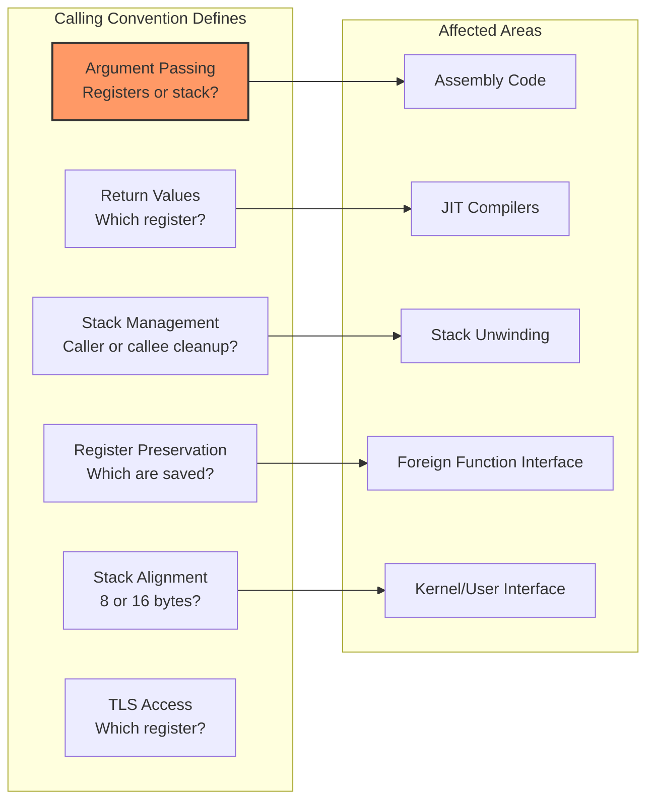

# Calling Conventions

## Introduction

A **calling convention** defines how functions pass arguments, return values, and manage the stack at the binary level. Understanding calling conventions is essential for kernel developers working with assembly code, debugging with stack traces, writing JIT compilers (like BPF), and understanding how the kernel interfaces with userspace.

Each architecture defines its own calling convention, documented in the **Application Binary Interface (ABI)**. This chapter covers the calling conventions for x86_64, ARM (AAPCS64), RISC-V, and how they're used in the Linux kernel.

## Why Calling Conventions Matter



## x86_64 System V ABI

### Register Usage

```
x86_64 System V Calling Convention
───────────────────────────────────
Register  Purpose                          Preserved?
────────  ───────                          ──────────
RAX       Return value (integer)           No (caller-saved)
RDX       Return value (second)            No
RCX       4th integer argument             No
RDI       1st integer argument             No
RSI       2nd integer argument             No
R8        5th integer argument             No
R9        6th integer argument             No
R10       7th integer argument (varargs)   No
R11       Scratch                          No

RBX       Callee-saved                     Yes
RBP       Frame pointer (callee-saved)     Yes
R12-R15   Callee-saved                     Yes
RSP       Stack pointer                    Yes (always)

XMM0-XMM7  FP/SSE arguments (first 8)     No
XMM8-XMM15 FP/SSE callee-saved            Yes (lower 64 bits)

RIP       Instruction pointer              N/A
RFLAGS    Flags                            No (caller-saved)
```

### Argument Passing

```nasm
; x86_64 integer argument passing: RDI, RSI, RDX, RCX, R8, R9
; Additional arguments on the stack

; Example: foo(1, 2, 3, 4, 5, 6, 7, 8)
;   RDI = 1, RSI = 2, RDX = 3, RCX = 4, R8 = 5, R9 = 6
;   Stack: [RSP+0] = 7, [RSP+8] = 8

; Floating-point: XMM0-XMM7
; Example: bar(1.0, 2.0, 3)
;   XMM0 = 1.0, XMM1 = 2.0, RDI = 3

; System V ABI: stack must be 16-byte aligned before CALL
; The CALL instruction pushes 8 bytes (return address)
; So at function entry, RSP is 8 mod 16
; Functions typically push RBP (another 8 bytes) → RSP is 16-byte aligned
```

```c
/* x86_64 function call example (C → assembly) */

/* C code */
long add(long a, long b, long c, long d, long e, long f, long g, long h)
{
    return a + b + c + d + e + f + g + h;
}

/* Corresponding assembly */
/*
add:
    ; Arguments: RDI=a, RSI=b, RDX=c, RCX=d, R8=e, R9=f, [RSP+8]=g, [RSP+16]=h
    lea    rax, [rdi + rsi]       ; rax = a + b
    add    rax, rdx               ; rax += c
    add    rax, rcx               ; rax += d
    add    rax, r8                ; rax += e
    add    rax, r9                ; rax += f
    add    rax, [rsp + 8]         ; rax += g (from stack)
    add    rax, [rsp + 16]        ; rax += h (from stack)
    ret                            ; return rax
*/
```

### Stack Frame Layout

```
x86_64 Stack Frame (System V ABI)
──────────────────────────────────
High addresses
┌─────────────────────────┐
│ 8th argument (if any)   │ [RBP + 32] or [RSP + N]
├─────────────────────────┤
│ 7th argument (if any)   │ [RBP + 24] or [RSP + N-8]
├─────────────────────────┤ ← RSP before CALL (16-byte aligned)
│ Return address          │ [RSP + 0] (pushed by CALL)
├─────────────────────────┤
│ Saved RBP               │ [RSP + 8] (pushed by function)
├─────────────────────────┤ ← RBP = RSP after prologue
│ Local variables         │ [RBP - 8], [RBP - 16], ...
│ ...                     │
├─────────────────────────┤ ← RSP (16-byte aligned)
│ Outgoing arguments      │ (if > 6 integer or > 8 FP args)
│ (7th+ integer, 9th+ FP) │
└─────────────────────────┘
Low addresses

Prologue:
    push   rbp           ; Save frame pointer
    mov    rbp, rsp      ; Set up frame pointer
    sub    rsp, N        ; Allocate local variables (16-byte aligned)

Epilogue:
    mov    rsp, rbp      ; Restore stack pointer (or: leave)
    pop    rbp           ; Restore frame pointer
    ret                   ; Return
```

### The Red Zone

```
x86_64 Red Zone
───────────────
The 128 bytes below RSP are "reserved" (red zone):
  • Leaf functions can use this space without adjusting RSP
  • Interrupts will not clobber this area
  • Only available in user space (kernel does NOT use red zone)

User-space leaf function example:
    ; No prologue/epilogue needed!
    ; Can use [RSP-8], [RSP-16], ..., [RSP-128] directly
    mov    [rsp-8], rbx    ; Save RBX in red zone
    ; ... function body ...
    mov    rbx, [rsp-8]    ; Restore RBX
    ret

Kernel code: Red zone is DISABLED
    • Interrupts can occur at any time
    • Interrupt handlers use the current RSP
    • Using red zone would corrupt data
    • Kernel is compiled with -mno-red-zone
```

## ARM/AArch64 (AAPCS64)

### Register Usage

```
AArch64 AAPCS64 Calling Convention
───────────────────────────────────
Register  Purpose                          Preserved?
────────  ───────                          ──────────
X0        1st argument / return value      No (caller-saved)
X1        2nd argument / return value (2)  No
X2-X7     3rd-8th arguments                No
X8        Indirect result location         No
X9-X15    Temporary registers              No
X16-X17   Intra-procedure-call (IP0/IP1)   No (linker veneers)
X18       Platform register (reserved)     Platform-defined
X19-X28   Callee-saved registers           Yes
X29       Frame pointer (FP)               Yes
X30       Link register (LR)               Yes (return address)
SP        Stack pointer                    Yes (16-byte aligned)

V0-V7     FP/SIMD arguments               No
V8-V15    FP callee-saved (lower 64 bits)  Yes (lower 64 bits)
V16-V31   FP/SIMD temporary                No
```

### Argument Passing

```asm
; AArch64 argument passing: X0-X7 (integer), V0-V7 (FP/SIMD)
; Additional arguments on the stack (rare on AArch64)

; Example: foo(1, 2, 3, 4, 5, 6, 7, 8)
;   X0=1, X1=2, X2=3, X3=4, X4=5, X5=6, X6=7, X7=8

; Return values: X0 (primary), X1 (secondary for 128-bit)
;                V0 (FP/SIMD return)

; AAPCS64: Stack must be 16-byte aligned at all times
; Functions must preserve X19-X28, X29(FP), X30(LR), D8-D15
```

### Stack Frame

```
AArch64 Stack Frame (AAPCS64)
──────────────────────────────
High addresses
┌─────────────────────────┐
│ Stack arguments (rare)  │ [SP + N]
├─────────────────────────┤ ← SP at entry (16-byte aligned)
│ Local variables         │ [SP + 0], [SP + 16], ...
│ ...                     │
├─────────────────────────┤
│ Saved X29 (FP)          │ [SP + K]
│ Saved X30 (LR)          │ [SP + K + 8]
│ Saved X19-X28           │ [SP + K + 16], ...
│ Saved D8-D15            │ [SP + K + ...]
├─────────────────────────┤ ← SP after prologue
└─────────────────────────┘
Low addresses

Prologue:
    STP    X29, X30, [SP, #-N]!  ; Save FP and LR, decrement SP
    MOV    X29, SP               ; Set frame pointer
    STP    X19, X20, [SP, #16]   ; Save callee-saved regs

Epilogue:
    LDP    X19, X20, [SP, #16]   ; Restore callee-saved regs
    LDP    X29, X30, [SP], #N    ; Restore FP and LR, increment SP
    RET                           ; Return (branch to X30)
```

## RISC-V Calling Convention

### Register Usage

```
RISC-V Calling Convention (RV64)
────────────────────────────────
Register  ABI Name    Purpose                 Preserved?
────────  ────────    ───────                 ──────────
X0        zero        Hardwired zero          N/A
X1        ra          Return address          No
X2        sp          Stack pointer           Yes
X3        gp          Global pointer          N/A (reserved)
X4        tp          Thread pointer          N/A (reserved)
X5-X7     t0-t2       Temporary               No
X8        s0/fp       Saved / frame pointer   Yes
X9        s1          Saved                   Yes
X10-X17   a0-a7       Arguments / return      No
X18-X27   s2-s11      Saved                   Yes
X28-X31   t3-t6       Temporary               No

F0-F7     ft0-ft7     FP temporary            No
F8-F9     fs0-fs1     FP saved                Yes
F10-F17   fa0-fa7     FP arguments / return   No
F18-F27   fs2-fs11    FP saved                Yes
F28-F31   ft8-ft11    FP temporary            No
```

### Argument Passing

```asm
; RISC-V argument passing: A0-A7 (X10-X17)
; Additional arguments on the stack

; Example: foo(1, 2, 3, 4, 5, 6, 7, 8)
;   A0=1, A1=2, A2=3, A3=4, A4=5, A5=6, A6=7, A7=8

; Return values: A0 (primary), A1 (secondary)
; Floating-point: FA0-FA7 (F10-F17), FA0 (return)

; RISC-V: Stack grows downward, 16-byte aligned
; ABI requires stack alignment to 16 bytes (EABI: 8 bytes)
```

### RISC-V Stack Frame

```
RISC-V Stack Frame
──────────────────
High addresses
┌─────────────────────────┐
│ Stack arguments (if >8) │ [SP + N + 16]
├─────────────────────────┤ ← SP at entry (16-byte aligned)
│ Local variables         │
│ ...                     │
├─────────────────────────┤
│ Saved RA (X1)           │ [SP + N - 8]
│ Saved FP (X8/S0)        │ [SP + N - 16]
│ Saved S1-S11            │ [SP + N - 24], ...
│ Saved FS0-FS11          │ [SP + N - ...]
├─────────────────────────┤ ← SP after prologue
└─────────────────────────┘
Low addresses

Prologue:
    addi   sp, sp, -N      # Allocate stack frame
    sd     ra, N-8(sp)     # Save return address
    sd     s0, N-16(sp)    # Save frame pointer
    addi   s0, sp, N       # Set frame pointer

Epilogue:
    ld     ra, N-8(sp)     # Restore return address
    ld     s0, N-16(sp)    # Restore frame pointer
    addi   sp, sp, N       # Deallocate stack frame
    ret                     # Return (jump to ra)
```

## Comparison Table

```
Calling Convention Comparison
─────────────────────────────
Feature         x86_64 SysV     AAPCS64         RISC-V
──────────      ───────────     ───────         ───────
Int args        RDI,RSI,        X0-X7           A0-A7 (X10-X17)
                RDX,RCX,R8,R9
Int return      RAX (RDX 2nd)   X0 (X1 2nd)     A0 (A1 2nd)
FP args         XMM0-XMM7      V0-V7           FA0-FA7
FP return       XMM0 (XMM1)    V0              FA0
Frame pointer   RBP             X29 (FP)        X8 (S0/FP)
Stack pointer   RSP             SP              SP (X2)
Return address  on stack        X30 (LR)        X1 (RA)
Stack align     16-byte         16-byte         16-byte
Red zone        128 bytes       None            None
Syscall args    RDI,RSI,RDX,    X8=syscall#     A7=syscall#
                R10,R8,R9       X0-X5           A0-A5
TLS access      FS.base         TP (X18)        TP (X4)
```

## Linux Kernel Calling Conventions

### System Call Interface

```c
/* System call arguments differ from function call arguments */

/* x86_64 system calls */
/* Syscall number: RAX */
/* Arguments: RDI, RSI, RDX, R10, R8, R9 (note: R10, not RCX!) */
/* Return: RAX */
/* Clobbered: RCX, R11 */

/* ARM64 system calls */
/* Syscall number: X8 */
/* Arguments: X0-X5 */
/* Return: X0 */

/* RISC-V system calls */
/* Syscall number: A7 (X17) */
/* Arguments: A0-A5 (X10-X15) */
/* Return: A0 (X10) */
```

```asm
; System call examples

; x86_64: write(1, "hello", 5)
mov    rax, 1          ; syscall number: sys_write
mov    rdi, 1          ; fd: stdout
lea    rsi, [msg]      ; buf
mov    rdx, 5          ; count
syscall

; AArch64: write(1, "hello", 5)
mov    x8, 64          ; syscall number: sys_write (NR_write)
mov    x0, 1           ; fd: stdout
adr    x1, msg         ; buf
mov    x2, 5           ; count
svc    #0              ; supervisor call

; RISC-V: write(1, "hello", 5)
li    a7, 64           ; syscall number: __NR_write
li    a0, 1            ; fd: stdout
la    a1, msg          ; buf
li    a2, 5            ; count
ecall                   ; environment call
```

### Kernel Function Conventions

```c
/* Linux kernel uses standard ABI conventions for internal functions
 * with some additional rules: */

/* 1. Kernel code uses its own stack (not user stack) */
/*    - Each thread has a kernel stack (typically 8KB or 16KB) */
/*    - On x86_64: IST (Interrupt Stack Table) for critical handlers */

/* 2. Red zone is DISABLED in kernel (x86_64: -mno-red-zone) */
/* 3. Kernel functions must not sleep in atomic context */
/* 4. asmlinkage tag: forces arguments on stack (x86 32-bit) */

/* asmlinkage example (32-bit x86) */
asmlinkage long sys_read(unsigned int fd, char __user *buf, size_t count);

/* On x86_64, asmlinkage is a no-op (args already in registers) */
#define asmlinkage CPP_ASMLINKAGE  /* empty on x86_64 */
```

## Stack Unwinding

### DWARF Unwinding

```bash
# Stack traces use unwinding information (DWARF or ORC on x86)

# x86_64 uses ORC (Oops Rewind Capability) unwinder since kernel 4.14
# Faster and simpler than DWARF for kernel stack traces

# Check kernel stack trace
$ dmesg | grep -A 20 "Call Trace"
[  123.456789] Call Trace:
[  123.456790]  <TASK>
[  123.456791]  dump_stack_lvl+0x5c/0x80
[  123.456792]  panic+0x115/0x2f0
[  123.456793]  oops_end+0x39/0x50
[  123.456794]  no_context+0x190/0x370
[  123.456795]  exc_page_fault+0x6d/0x150
[  123.456796]  asm_exc_page_fault+0x26/0x30

# perf stack profiling
$ perf record -g --call-graph dwarf ./workload
$ perf report
```

## Register Usage in Inline Assembly

```c
/* GCC inline assembly register constraints */

/* x86_64 examples */
int x = 42;
asm volatile("mov %0, %%rax" : : "r"(x) : "rax");

/* Constraint letters:
 * a = RAX, b = RBX, c = RCX, d = RDX
 * S = RSI, D = RDI, r = any GPR
 * 0-9 = matching constraint
 */

/* AArch64 examples */
unsigned long val;
asm volatile("mrs %0, cntvct_el0" : "=r"(val));

/* RISC-V examples */
unsigned long cycles;
asm volatile("rdcycle %0" : "=r"(cycles));

/* PowerPC examples */
unsigned long timebase;
asm volatile("mftb %0" : "=r"(timebase));
```

## Variadic Functions (varargs)

```c
/* How varargs work at the ABI level */

/* x86_64: AL register holds the number of XMM registers used */
/* This is needed because varargs uses the stack for FP args */
void foo(int count, ...) {
    va_list ap;
    va_start(ap, count);
    /* va_start saves: RDI count location, RSI address, etc. */
    /* AL must be set to 0 (no XMM args) or number of XMM args */
}

/* AArch64: X8 holds the address of the stack overflow area */
/* Varargs FP args are also passed in V0-V7 for the first 8 */

/* RISC-V: Standard va_list implementation */
/* Varargs use the same A0-A7/FA0-FA7 registers */
```

## References and Further Reading

- [The Linux Kernel Documentation](https://docs.kernel.org/)
- [LWN.net - Linux and free software news](https://lwn.net/)
- [GNU Project Documentation](https://www.gnu.org/doc/doc.html)
- [GNU Manuals](https://www.gnu.org/manual/manual.html)
- [Free Software Directory](https://directory.fsf.org/wiki/Main_Page)
- [Planet GNU](https://planet.gnu.org/)
- [Free Software Books](https://www.gnu.org/doc/other-free-books.html)

- x86_64 System V ABI: https://gitlab.com/x86-psABIs/x86-64-ABI
- ARM AAPCS64: https://github.com/ARM-software/abi-aa/blob/main/aapcs64/aapcs64.rst
- RISC-V Calling Convention: https://github.com/riscv-non-isa/riscv-elf-psabi-doc
- PowerPC ELF ABI: https://files.openpower.foundation/
- MIPS O32/N32/N64 ABI: https://www.linux-mips.org/
- System V ABI (generic): https://refspecs.linuxfoundation.org/
- Linux kernel system call table: https://chromium.googlesource.com/chromiumos/docs/+/master/constants/syscalls.md
- "Linkers and Loaders" by John Levine
- DWARF specification: https://dwarfstd.org/
- Linux ORC unwinder: https://www.kernel.org/doc/html/latest/arch/x86/orc-unwinder.html

## Related Topics

- [x86 Architecture](./x86.md) — x86_64 register details
- [ARM Architecture](./arm.md) — AArch64 exception levels and registers
- [RISC-V Architecture](./riscv.md) — RISC-V register and privilege details
- [PowerPC Architecture](./powerpc.md) — PowerPC register conventions
- [MIPS Architecture](./mips.md) — MIPS delay slots and registers
- [Memory Models](./memory-models.md) — ordering between function calls
