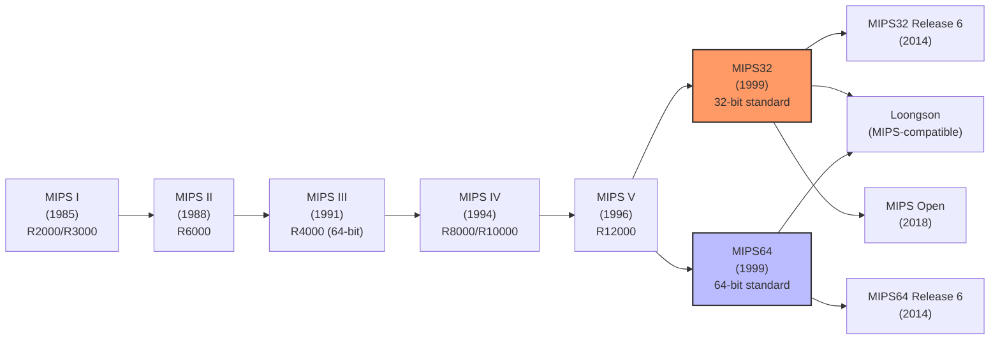
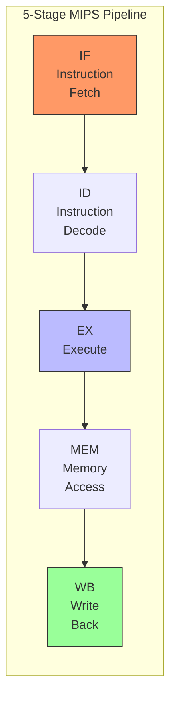
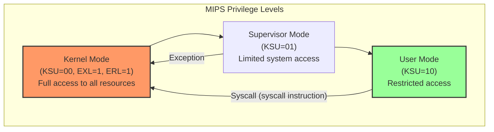

# MIPS Architecture

## Introduction

MIPS (Microprocessor without Interlocked Pipeline Stages) is one of the most influential RISC architectures in computing history. Designed by John Hennessy at Stanford University in 1985, MIPS pioneered many RISC concepts that are now standard across all modern processors. The architecture has been used in workstations (SGI), routers (Cisco), game consoles (PlayStation, Nintendo 64), and embedded systems worldwide.

Linux on MIPS has a long history, with support dating back to the early 1990s. Today, MIPS continues to be relevant in embedded systems and networking equipment, and the architecture has seen renewed interest through China's **Loongson** processors and the **MIPS Open** initiative.

## Architecture Overview

### MIPS Evolution



### Key Features

```
MIPS Architecture Characteristics
─────────────────────────────────
ISA Type:         RISC (Load/Store)
Endianness:       Bi-endian (MIPSEL = little, MIPS = big)
Registers:        32 GPRs, 32 FPRs
Privilege Modes:  User, Supervisor, Kernel (3 levels)
Pipeline:         Classic 5-stage RISC pipeline
Branch:           Branch delay slots (1 slot)
Addressing:       32-bit (MIPS32) / 64-bit (MIPS64)
COProcessors:     CP0 (system control), CP1 (FPU), CP2/CP3
Virtual Memory:   TLB-based (software-managed)
SIMD:             MSA (MIPS SIMD Architecture)
DSP:              DSP ASE (Application Specific Extension)
```

## Registers

### General-Purpose Registers

```
MIPS General-Purpose Registers (32 registers)
──────────────────────────────────────────────
Reg  Name     Usage
───  ────     ─────
$0   $zero    Always zero (hardwired)
$1   $at      Assembler temporary (reserved)
$2   $v0      Return value (first)
$3   $v1      Return value (second)
$4   $a0      Argument 1
$5   $a1      Argument 2
$6   $a2      Argument 3
$7   $a3      Argument 4
$8   $t0      Temporary (caller-saved)
$9   $t1      Temporary
$10  $t2      Temporary
$11  $t3      Temporary
$12  $t4      Temporary
$13  $t5      Temporary
$14  $t6      Temporary
$15  $t7      Temporary
$16  $s0      Saved (callee-saved)
$17  $s1      Saved
$18  $s2      Saved
$19  $s3      Saved
$20  $s4      Saved
$21  $s5      Saved
$22  $s6      Saved
$23  $s7      Saved
$24  $t8      Temporary
$25  $t9      Temporary / function pointer
$26  $k0      Kernel reserved
$27  $k1      Kernel reserved
$28  $gp      Global pointer
$29  $sp      Stack pointer
$30  $fp/$s8  Frame pointer (or callee-saved)
$31  $ra      Return address

Special registers:
  PC      — Program counter (not directly accessible)
  HI      — Multiply/divide result high
  LO      — Multiply/divide result low
```

### Coprocessor 0 (CP0) Registers

```
CP0 (System Control) Registers — Key registers for Linux
─────────────────────────────────────────────────────────
Register    Sel  Function
────────    ───  ────────
Index       0    TLB entry index
Random      0    Random TLB entry (for random replacement)
EntryLo0    0    TLB entry low (even page)
EntryLo1    0    TLB entry low (odd page)
Context     0    Page table pointer for TLB refill
PageMask    0    TLB page size mask
Wired       0    Number of wired TLB entries
BadVAddr    0    Address of last exception
Count       0    Timer counter
EntryHi     0    TLB entry high (VPN, ASID)
Compare     0    Timer compare (interrupt on match)
Status      0    Processor status (SR)
Cause       0    Exception cause
EPC         0    Exception program counter
PRId        0    Processor revision ID
Config      0    Configuration
Config1     1    Configuration 1
Config2     2    Configuration 2
Config3     3    Configuration 3
XContext    0    64-bit context
EBase       1    Exception base address
```

## Pipeline and Delay Slots

### Classic MIPS Pipeline



### Branch Delay Slots

```
MIPS Branch Delay Slots
───────────────────────
A branch delay slot is the instruction immediately after a branch.
It is ALWAYS executed, regardless of whether the branch is taken.

This is a consequence of the pipelined design:
  The branch decision is made in the EX stage (cycle 3).
  By then, the next instruction is already in the ID stage (cycle 2).
  So that instruction executes no matter what.

Example:
```

```mips
# Branch with delay slot
    BEQ   $t0, $t1, target    # Branch if equal
    ADD   $t2, $t3, $t4       # Delay slot — ALWAYS executes!
    SUB   $t5, $t6, $t7       # This executes if branch NOT taken

target:
    OR    $t8, $t9, $zero     # This executes if branch IS taken

# The compiler fills the delay slot with useful instructions
# If nothing useful: NOP (but wastes a cycle)
```

### Coping with Delay Slots in Linux

```c
/* The Linux MIPS kernel uses macros to handle delay slots */

/* Branch likely — delay slot instruction only executes if taken */
/* MIPS32R6 removed branch-likely instructions */

/* Linux uses the following approach:
 * 1. Compiler fills delay slots where possible
 * 2. NOP otherwise
 * 3. kernel uses .set noreorder for critical sections
 */

/* Example: Exception handler with explicit delay slot control */
__asm__ __volatile__(
    ".set noreorder\n"
    "la    $26, 1f\n"        /* Load target address */
    "jr    $26\n"            /* Jump to target */
    " nop\n"                 /* Delay slot (NOP) */
    "1:\n"
    ".set reorder\n"
);
```

## Privilege Modes

### MIPS Privilege Levels



```
MIPS Privilege Details
──────────────────────
Kernel Mode (Status register: KSU=00):
  • Full access to all CP0 registers
  • Full memory access (kseg0, kseg1, kseg2, kseg3)
  • Can execute all privileged instructions
  • Linux kernel runs here
  • Exception handler also runs here (EXL=1)

Supervisor Mode (Status register: KSU=01):
  • Some restricted access
  • Rarely used by Linux
  • Can be used for hypervisor extensions

User Mode (Status register: KSU=10):
  • Cannot access CP0 registers
  • Limited memory segments (kuseg only)
  • Must use syscalls for system services
  • Applications run here
```

### MIPS Memory Segments

```
MIPS32 Virtual Address Space (32-bit)
──────────────────────────────────────
0xFFFFFFFF ┌─────────────────────┐
           │ kseg3 (512MB)       │ Mapped, cached, kernel only
0xE0000000 ├─────────────────────┤
           │ kseg2 (512MB)       │ Mapped, cached, kernel only
0xC0000000 ├─────────────────────┤
           │ kseg1 (512MB)       │ Unmapped, uncached, kernel
           │ (I/O devices, ROM)  │ Physical = Virtual - 0xA0000000
0xA0000000 ├─────────────────────┤
           │ kseg0 (512MB)       │ Unmapped, cached, kernel
           │ (kernel code, data) │ Physical = Virtual - 0x80000000
0x80000000 ├─────────────────────┤
           │ kuseg (2GB)         │ Mapped, cached, user accessible
           │ (user space)        │ TLB-translated
0x00000000 └─────────────────────┘
```

```c
/* Linux kernel address conversion on MIPS */
/* kseg0: physical = virtual - 0x80000000 */
#define KSEG0           0x80000000
#define KSEG1           0xA0000000

#define PHYSADDR(x)     ((x) & 0x1FFFFFFF)  /* For kseg0/kseg1 */
#define KSEG0ADDR(x)    ((x) | KSEG0)
#define KSEG1ADDR(x)    ((x) | KSEG1)

/* Example: Access I/O device at physical address 0x18000000 */
void *iomem = (void *)KSEG1ADDR(0x18000000);  /* Uncached access */

/* Example: Access kernel code/data */
void *kmem = (void *)KSEG0ADDR(0x00100000);   /* Cached access */
```

## TLB Management

### Software-Managed TLB

```c
/* MIPS uses a software-managed TLB (Translation Lookaside Buffer)
 * Unlike x86/ARM which have hardware page table walkers,
 * MIPS requires the OS to handle TLB misses in software */

/* TLB Refill Exception Handler (simplified) */
void tlb_refill_handler(unsigned long badvaddr)
{
    pgd_t *pgd;
    pmd_t *pmd;
    pte_t *pte;
    
    /* Walk the page table in software */
    pgd = pgd_offset(current->mm, badvaddr);
    pmd = pmd_offset(pgd, badvaddr);
    pte = pte_offset(pmd, badvaddr);
    
    if (pte_present(*pte)) {
        /* Found the PTE — write it into the TLB */
        unsigned long entryhi = (badvaddr & PAGE_MASK) | 
                                (current_asid() << 6);
        unsigned long entrylo0 = pte_to_entrylo(pte_val(*pte));
        unsigned long entrylo1 = pte_to_entrylo(pte_val(*(pte + 1)));
        
        /* Write random TLB entry */
        write_c0_entryhi(entryhi);
        write_c0_entrylo0(entrylo0);
        write_c0_entrylo1(entrylo1);
        tlb_write_random();  /* Write to TLB */
    } else {
        /* Page not mapped — page fault */
        do_page_fault(badvaddr);
    }
}
```

## Loongson Processors

### Loongson: China's MIPS-Compatible CPUs

```
Loongson Processor Family
──────────────────────────
Loongson 2F (2007)
  • Single-core, 64-bit MIPS-compatible
  • Used in early Chinese Linux PCs

Loongson 3A (2010)
  • Quad-core MIPS64
  • Used in Chinese government systems

Loongson 3B (2012)
  • 8 cores, MIPS64
  • HPC target

Loongson 3A5000 (2021)
  • 4 cores, LoongArch (not MIPS-compatible)
  • ~2.5 GHz
  • Chinese desktop/server

Loongson 3C5000 (2022)
  • 16 cores, LoongArch
  • Server processor
  • ~2.2 GHz

Note: LoongArch is NOT MIPS — it's a new ISA.
      But earlier Loongson chips were MIPS-compatible.
```

### Linux on Loongson

```bash
# Loongson 3A/3B — MIPS-compatible
$ make ARCH=mips CROSS_COMPILE=mipsel-linux-gnu- \
    loongson3_defconfig

# LoongArch — new architecture (since kernel 5.19)
$ make ARCH=loongarch CROSS_COMPILE=loongarch64-linux-gnu- \
    defconfig

# LoongArch is separate from MIPS in the kernel tree
$ ls arch/loongarch/
```

## Linux on MIPS

### MIPS Linux Kernel Defconfigs

```bash
# Common MIPS defconfigs
$ ls arch/mips/configs/

# Generic MIPS
malta_defconfig          — Malta evaluation board (QEMU compatible)
bcm47xx_defconfig        — Broadcom BCM47xx (Linksys routers)
ath79_defconfig          — Qualcomm Atheros (router SoCs)
rb532_defconfig          — Mikrotik RouterBoard
loongson3_defconfig      — Loongson 3 multi-core
octeon_defconfig         — Cavium Octeon (network processors)
jazz_defconfig           — DEC Jazz (historic)
bmips_defconfig          — Broadcom MIPS
img_malta_defconfig      — Imagination Technologies Malta
```

### Cross-Compiling for MIPS

```bash
# Little-endian MIPS (most common)
$ sudo apt-get install gcc-mipsel-linux-gnu

$ make ARCH=mips CROSS_COMPILE=mipsel-linux-gnu- malta_defconfig
$ make ARCH=mips CROSS_COMPILE=mipsel-linux-gnu- -j$(nproc)

# Big-endian MIPS
$ sudo apt-get install gcc-mips-linux-gnu

$ make ARCH=mips CROSS_COMPILE=mips-linux-gnu- malta_defconfig
$ make ARCH=mips CROSS_COMPILE=mips-linux-gnu- -j$(nproc)

# MIPS64
$ sudo apt-get install gcc-mips64-linux-gnuabi64

$ make ARCH=mips CROSS_COMPILE=mips64-linux-gnuabi64- malta_defconfig
```

### Running MIPS Linux in QEMU

```bash
# Install QEMU for MIPS
$ sudo apt-get install qemu-system-mips

# Boot MIPS Malta in QEMU
$ qemu-system-mipsel \
    -M malta \
    -m 256 \
    -kernel arch/mips/boot/vmlinux \
    -append "console=ttyS0" \
    -nographic

# With a root filesystem
$ qemu-system-mipsel \
    -M malta \
    -m 256 \
    -kernel arch/mips/boot/vmlinux \
    -append "root=/dev/sda console=ttyS0" \
    -drive file=rootfs.ext4,format=raw \
    -nographic
```

## MIPS in Embedded Systems

### Routers and Networking

```
MIPS in Consumer Networking
────────────────────────────
Broadcom BCM47xx/53xx
  • Used in Linksys, Netgear, ASUS routers
  • OpenWrt support
  • MIPS74Kc core (MIPS32)

Qualcomm Atheros (ath79, ipq40xx, ipq806x)
  • Ubiquiti, TP-Link, many others
  • OpenWrt primary target
  • MIPS74Kc / MIPS34Kc cores

MediaTek MT7621
  • Popular router SoC
  • Dual-core MIPS 1004Kc
  • OpenWrt support

Cavium/Marvell Octeon
  • Network processors
  • Up to 48 MIPS64 cores
  • Enterprise networking
```

### OpenWrt (Linux for Routers)

```bash
# OpenWrt builds Linux for MIPS routers
$ git clone https://git.openwrt.org/openwrt/openwrt.git
$ cd openwrt

# Configure for a specific target
$ make menuconfig
# → Target System → Atheros ATH79
# → Subtarget → Generic
# → Target Profile → TP-Link Archer C7

# Build
$ make -j$(nproc)

# Output
$ ls bin/targets/ath79/generic/
openwrt-ath79-generic-tplink_archer-c7-v2-squashfs-sysupgrade.bin
```

## MIPS Architecture Comparison

```
MIPS ISA Versions
──────────────────
Feature         MIPS32r2    MIPS32r6     MIPS64r6
─────────       ─────────   ─────────    ─────────
Registers       32 GPR      32 GPR       32 GPR
FPR             32 (FPU)    32 (FPU)     32 (FPU)
Page sizes      4KB-16MB    4KB-16MB     4KB-16GB
Branch delay    Yes         No*          No*
Branch likely   Yes         No*          No*
Conditional move MOVZ/MOVN  SEL          SEL
SIMD            MSA         MSA          MSA
Compact branches No          Yes          Yes
NaN2008         Optional    Required     Required

* Release 6 removed branch delay slots and branch-likely
  instructions, replacing them with compact branches and
  other improvements.
```

## MIPS Linux Kernel Code Organization

```
arch/mips/
├── boot/               — Boot code
├── configs/            — Defconfigs
├── cavium-octeon/      — Cavium Octeon platform
├── include/            — MIPS headers
├── jazz/               — DEC Jazz platform
├── kernel/             — Core MIPS kernel
├── kvm/                — KVM for MIPS
├── lib/                — MIPS-optimized routines
├── loongson/           — Loongson platform
├── mm/                 — MIPS memory management (TLB)
├── net/                — BPF JIT
├── pci/                — PCI support
├── power/              — Power management
├── ralink/             — MediaTek/Ralink platform
├── tools/              — MIPS userspace tools
├── vdso/               — vDSO
├── Kconfig             — Configuration
└── Makefile            — Build rules
```

## References and Further Reading

- MIPS Architecture documentation: https://www.mips.com/developers/documentation/
- MIPS32/MIPS64 Architecture manuals: https://s3-eu-west-1.amazonaws.com/downloads-mips/documents/
- Loongson: http://www.loongson.cn/en/
- OpenWrt (Linux for routers): https://openwrt.org/
- Linux MIPS kernel documentation: https://www.kernel.org/doc/html/latest/arch/mips/
- MIPS Linux mailing list: linux-mips@linux-mips.org
- "See MIPS Run" by Dominic Sweetman — the definitive MIPS reference
- "MIPS32 Architecture for Programmers" — Imagination Technologies
- QEMU MIPS emulation: https://www.qemu.org/docs/master/system/target-mips.html
- Linux MIPS Wiki: https://www.linux-mips.org/

## Related Topics

- [RISC-V Architecture](./riscv.md) — another RISC architecture
- [x86 Architecture](./x86.md) — compare with CISC design
- [ARM Architecture](./arm.md) — dominant RISC competitor
- [Cross-Compilation](../build/cross-compilation.md) — building for MIPS
- [Memory Models](./memory-models.md) — MIPS memory ordering
