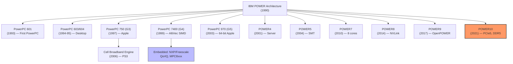
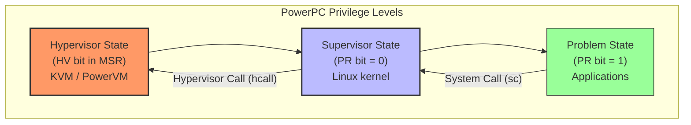
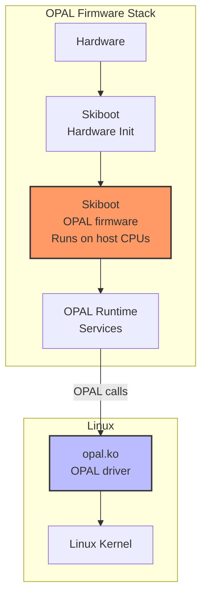
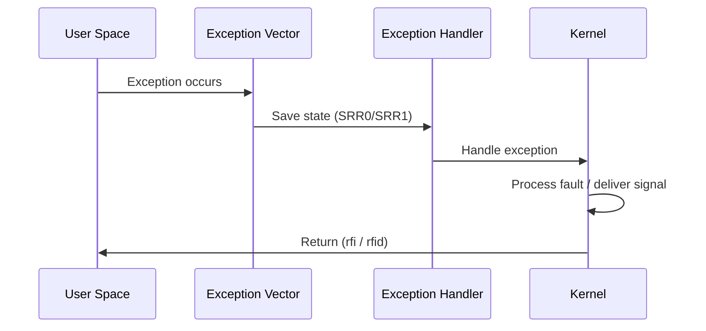
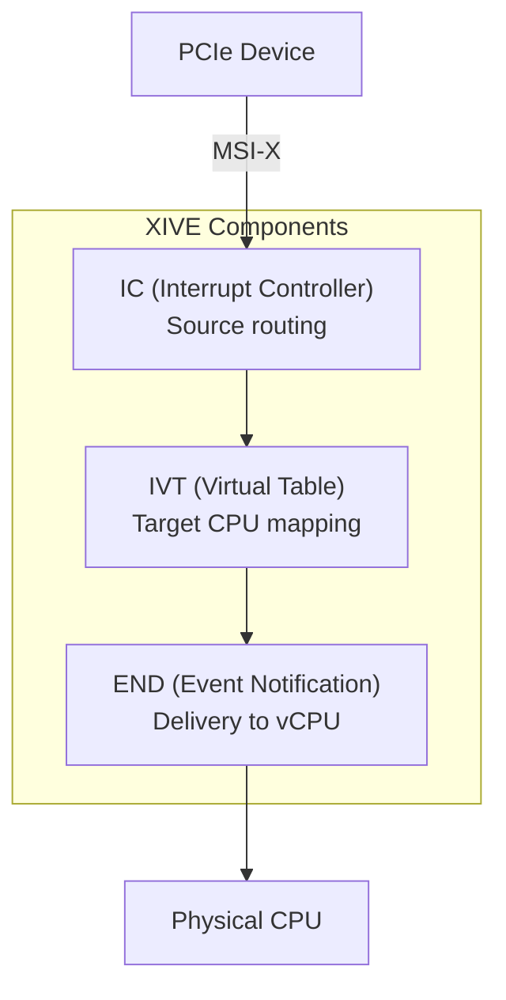
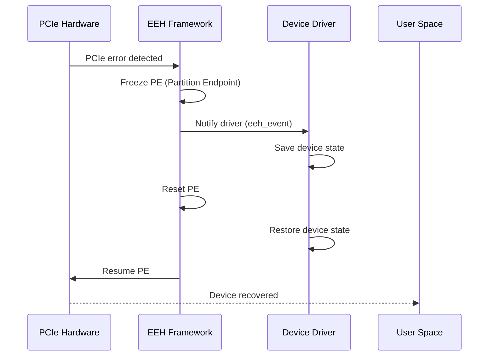

# PowerPC Architecture

## Introduction

PowerPC (Performance Optimization With Enhanced RISC – Performance Computing) is a RISC instruction set architecture developed by the 1991 Apple–IBM–Motorola alliance (AIM). PowerPC has a distinguished history in computing: it powered Apple Macintosh systems from 1994 to 2006, drives IBM's enterprise server line (POWER), and remains a significant architecture in high-performance computing, enterprise servers, and embedded systems.

Linux on PowerPC has a long and robust history. The architecture's open firmware interface (OPAL), strong virtualization support (KVM), and enterprise reliability features make it a unique platform in the Linux ecosystem.

## Architecture Overview

### PowerPC Family



### Key Architecture Features

```
PowerPC Architecture Characteristics
─────────────────────────────────────
ISA Type:        RISC
Endianness:      Bi-endian (big-endian traditional, little-endian modern)
Register File:   32 GPRs, 32 FPRs, 32 VMX/VSX registers
Privilege Modes: Problem state (user) / Supervisor state (kernel)
Page Sizes:      4KB, 64KB, 16MB, 16GB
Addressing:      32-bit (legacy) / 64-bit (modern)
Virtualization:  Hardware virtualization (Hypervisor mode)
SIMD:            AltiVec/VMX (128-bit), VSX (128-bit)
Atomic:          Load-linked/store-conditional (lwarx/stwcx.)
Cache:           L1/L2/L3 coherent caches
```

## Registers

### General-Purpose Registers

```
PowerPC General-Purpose Registers
──────────────────────────────────
GPR0-GPR31 — 32 general-purpose registers (32 or 64-bit)

Special-purpose:
  GPR0    — Volatile, used as scratch by linker
  GPR1    — Stack pointer (by convention)
  GPR2    — TOC pointer (Table of Contents, for globals)
  GPR3-GPR10 — Function arguments and return values
  GPR11-GPR12 — Volatile, used by function prologues
  GPR13    — Thread-local storage pointer (PPC64 ELF ABI)
  GPR14-GPR31 — Callee-saved registers

Special Registers:
  LR       — Link register (return address)
  CTR      — Count register (loop counter, indirect branch)
  CR       — Condition register (8 × 4-bit fields)
  XER      — Integer exception register
  FPSCR    — FP status/control register
  MSR      — Machine state register (privilege, endian, etc.)
  PC       — Program counter (not directly accessible)
```

### Power ISA 3.0+ Register Extensions

```
VSX (Vector-Scalar Extension) Registers
────────────────────────────────────────
VSR0-VSR63 — 128-bit vector-scalar registers
  • Lower 64 bits: FPR0-FPR31 (shared with FP)
  • Full 128 bits: VMX VR0-VR31 (shared with AltiVec)
  • VSR32-VSR63: Additional 32 VSX-only registers

VMX/AltiVec Registers
──────────────────────
VR0-VR31 — 128-bit SIMD registers
  • 4×float32, 8×int16, 16×int8
  • Saturating arithmetic support
```

## Privilege Modes

### PowerPC Privilege Levels



```
Privilege Mode Details
──────────────────────
Problem State (User):
  • PR bit = 1 in MSR
  • Cannot change MSR
  • Cannot access privileged SPRs
  • System calls via 'sc' instruction
  • Applications run here

Supervisor State (Kernel):
  • PR bit = 0, HV bit = 0
  • Full access to SPRs, memory management
  • Can enable/disable interrupts (EE bit in MSR)
  • Linux kernel runs here
  • Page table management

Hypervisor State:
  • HV bit = 1 in MSR
  • LPAR/hypervisor support
  • KVM, PowerVM
  • Virtual interrupt injection
  • Resource allocation to guests
```

## Memory Management

### Page Table Structure

```
PowerPC uses a hashed page table (64-bit) or
radix tree page table (POWER9+)

Radix Tree (POWER9+, preferred for Linux):
──────────────────────────────────────────
• Similar to x86_64 multi-level page tables
• 4 levels: PGD → PUD → PMD → PTE
• Page sizes: 4KB, 64KB, 2MB, 1GB
• Hardware page table walk
• Translation controlled by partition table

Hashed Page Table (legacy):
──────────────────────────
• Software-managed hash table
• Hardware does initial lookup
• Software (OS) handles misses (hash page fault)
• Better for sparse address spaces
```

### Memory Management Unit (MMU)

```c
/* PowerPC radix page table entry (64-bit) */
struct radix_pte {
    uint64_t valid:1;       /* Valid entry */
    uint64_t rpn:51;        /* Real (physical) page number */
    uint64_t reserved:3;    /* Reserved */
    uint64_t na:1;          /* No access */
    uint64_t ro:1;          /* Read only */
    uint64_t atomic:1;      /* Atomic access */
    uint64_t cache_inhibit:1; /* Caching inhibited */
    uint64_t coherent:1;    /* Memory coherence */
    uint64_t no_execute:1;  /* No execute */
    uint64_t referenced:1;  /* Referenced (software) */
    uint64_t changed:1;     /* Changed/dirty (software) */
    uint64_t reserved2:1;
};
```

## OPAL Firmware

### OpenPOWER Abstraction Layer



```
OPAL Components
────────────────
Skiboot:
  • Open-source firmware (Apache 2.0)
  • Runs on the POWER processor itself
  • Initializes hardware
  • Provides runtime services to Linux
  • Replaces proprietary IBM firmware on OpenPOWER

OPAL Runtime Services:
  • Console I/O
  • RTC (real-time clock)
  • Sensor reading
  • Power management
  • PCI management
  • NVRAM access
  • Error handling (EEH)

Petitboot:
  • Bootloader running on top of OPAL
  • Linux-based (uses kexec)
  • Discovers bootable devices
  • Supports network boot (PXE)
```

### OPAL API

```c
/* OPAL call from Linux kernel */
#include <asm/opal-api.h>

/* OPAL call numbers (from opal-api.h) */
#define OPAL_CONSOLE_WRITE           1
#define OPAL_CONSOLE_READ            2
#define OPAL_RTC_READ                3
#define OPAL_RTC_WRITE               4
#define OPAL_CEC_POWER_DOWN          5
#define OPAL_CEC_REBOOT              6
#define OPAL_SENSOR_READ             7
#define OPAL_PCI_SET_POWER_STATE     117

/* Making an OPAL call from Linux */
static int64_t opal_call(int64_t token, int64_t nargs, ...)
{
    /* Assembly wrapper that calls into OPAL firmware */
    /* Uses OPAL entry point set up by skiboot */
}

/* Example: Console output through OPAL */
int64_t opal_console_write(int64_t term_number, __be64 *length,
                           const uint8_t *buffer)
{
    return opal_call(OPAL_CONSOLE_WRITE, 3, term_number,
                     length, buffer);
}
```

## KVM on PowerPC

### Hardware Virtualization Support

```
PowerPC Virtualization Features
───────────────────────────────
POWER7+:
  • Hardware virtualization (Hypervisor mode)
  • Virtual processor dispatch
  • Virtual interrupt delivery
  • Hardware page table for guests

POWER8:
  • Improved virtualization
  • 8 threads per core
  • Large L3 cache
  • CAPI (Coherent Accelerator)

POWER9:
  • Radix page tables for guests
  • Improved I/O virtualization
  • NVLink 2.0 (GPU interconnect)
  • OpenCAPI

POWER10:
  • Matrix Math Assist (MMA)
  • PCIe Gen5
  • Enhanced security (PEF — Protected Execution Facility)
  • Improved virtualization
```

### KVM on POWER

```bash
# Check if KVM is available on POWER
$ dmesg | grep -i kvm
[    0.123456] kvm: KVM for PowerPC Book3S 64 initialized

# KVM modules for PowerPC
$ lsmod | grep kvm
kvm_pr                 # KVM with PR (problem state) emulation
kvm_hv                  # KVM with hardware virtualization (HV)

# Create a VM (using QEMU)
$ qemu-system-ppc64le \
    -machine pseries,accel=kvm \
    -cpu POWER9 \
    -m 4G \
    -smp 4 \
    -drive file=vm-disk.qcow2,format=qcow2,if=virtio \
    -cdrom debian-12-ppc64el-netinst.iso \
    -nographic
```

### Linux PowerPC Code Organization

```
arch/powerpc/
├── boot/               — Boot code
├── configs/            — Defconfigs
│   ├── ppc64le_defconfig
│   ├── pseries_defconfig
│   └── powernv_defconfig
├── crypto/             — PowerPC crypto acceleration
├── include/            — PowerPC headers
├── kernel/             — Core kernel (exceptions, interrupts)
├── kvm/                — KVM virtualization
├── lib/                — PowerPC-optimized routines
├── mm/                 — Memory management (radix, hash)
├── net/                — BPF JIT
├── platforms/
│   ├── powernv/        — OPAL (bare metal)
│   ├── pseries/        — PowerVM (LPAR)
│   ├── cell/           — Cell Broadband Engine
│   ├── maple/          — Maple (Power Mac)
│   ├── ps3/            — PlayStation 3
│   └── chrp/           — Common Hardware Reference Platform
├── sysdev/             — System devices
├── Kconfig             — Configuration
└── Makefile            — Build rules
```

## Exception Handling

### Exception Vectors

PowerPC uses a fixed set of exception vectors at low memory addresses:

| Vector | Offset | Description |
|---|---|---|
| System Reset | 0x100 | Power-on / reset |
| Machine Check | 0x200 | Hardware error (uncorrectable) |
| Data Storage | 0x300 | Data page fault / DSI |
| Instruction Storage | 0x400 | Instruction page fault / ISI |
| External Interrupt | 0x500 | Device interrupt |
| Alignment | 0x600 | Unaligned access |
| Program | 0x700 | Illegal instruction / trap |
| Floating-Point Unavailable | 0x800 | FP disabled |
| Decrementer | 0x900 | Timer interrupt |
| Hypervisor Decrementer | 0x980 | HV timer (POWER7+) |
| Doorbell | 0xA00 | IPI doorbell |
| System Call | 0xC00 | `sc` instruction |
| Trace | 0xD00 | Single-step / breakpoint |
| Altivec Unavailable | 0xF20 | VMX disabled |
| VSX Unavailable | 0xF40 | VSX disabled |

### Exception Entry/Exit Flow



### SRR0 and SRR1

PowerPC uses **Save/Restore Register 0 and 1** for exception handling:

- **SRR0**: Contains the address to return to after exception.
- **SRR1**: Contains the saved MSR (Machine State Register) value.

```c
/* Exception handler pseudo-code */
void handle_exception(struct pt_regs *regs)
{
    unsigned long srr0 = regs->nip;  /* Next instruction pointer */
    unsigned long srr1 = regs->msr;  /* Saved MSR */

    /* Determine exception type from vector */
    /* Handle page fault, interrupt, syscall, etc. */
}
```

## Interrupt Handling

### PowerPC Interrupt Controller

PowerPC uses the **Open PIC** (or XICS for POWER, XIVE for POWER9+):

| Controller | Platform | Description |
|---|---|---|
| Open PIC | Embedded / Classic | Legacy interrupt controller |
| XICS | POWER7/8 | External Interrupt Controller |
| XIVE | POWER9+ | Enhanced Virtual Interrupt Controller |

### XIVE Architecture (POWER9+)



### Interrupt Flow

```c
/* Interrupt handler registration (PowerPC) */
static irqreturn_t my_interrupt(int irq, void *dev_id)
{
    /* Handle interrupt */
    return IRQ_HANDLED;
}

request_irq(irq, my_interrupt, 0, "my-device", dev_id);
```

## EEH (Enhanced Error Handling)

EEH is IBM's proprietary error handling mechanism for PCIe devices
on POWER systems. It provides hardware-level error detection and
recovery:

### EEH Error Flow



### EEH sysfs Interface

```bash
# Check EEH status
$ cat /sys/bus/pci/devices/0000:03:00.0/eeh_mode
# enabled

# View EEH error log
$ dmesg | grep -i eeh
[   12.345678] EEH: BPE#0 on PCI 0003:03:00.0
[   12.345679] EEH: PE#0 frozen
[   12.567890] EEH: PE#0 recovered after 2 attempts

# Manually trigger EEH recovery
$ echo 1 > /sys/bus/pci/devices/0000:03:00.0/eeh_pe_reset
```

### EEH in the Kernel

```c
/* Register EEH driver operations */
static struct eeh_dev_ops my_eeh_ops = {
    .eeh_event     = my_eeh_event,
    .eeh_reset     = my_eeh_reset,
    .eeh_configure = my_eeh_configure,
};

/* Called when EEH detects an error */
static void my_eeh_event(struct eeh_dev *edev)
{
    /* Save device state */
    save_device_state(edev);
}

/* Called to reset the device */
static int my_eeh_reset(struct eeh_dev *edev, int type)
{
    /* Reset device */
    return reset_device(edev);
}
```

## DSCR (Data Stream Control Register)

The DSCR controls hardware prefetching behavior on POWER processors:

```c
/* DSCR values */
#define DSCR_DEFAULT       0   /* Use system default */
#define DSCR_NO_PREFETCH   1   /* Disable hardware prefetch */
#define DSCR_STRIDE_N      2   /* Stride-N prefetch */

/* Set DSCR for current process */
mtspr(SPRN_DSCR, value);

/* Read current DSCR */
value = mfspr(SPRN_DSCR);
```

```bash
# Set DSCR via prctl
$ prctl --set-dscr=1  # Disable prefetch

# Check DSCR
$ cat /proc/self/status | grep DSCR
```

## Transactional Memory (HTM)

POWER8+ supports **Hardware Transactional Memory** (HTM):

### HTM Instructions

```asm
tbegin.         ; Begin transaction
tend.           ; End transaction (commit)
tabort.         ; Abort transaction
trechkpt.       ; Checkpoint (suspend/resume)
```

### HTM in Linux

```c
#include <htmxlintrin.h>

int transactional_update(int *shared_data)
{
    int result;

    if (__builtin_tbegin(0) == 0) {
        /* Transactional path */
        *shared_data += 1;
        result = *shared_data;
        __builtin_tend(0);
    } else {
        /* Fallback (transaction aborted) */
        /* Use locks instead */
        lock();
        *shared_data += 1;
        result = *shared_data;
        unlock();
    }
    return result;
}
```

```bash
# Check HTM support
$ dmesg | grep -i htm
[    0.123456] Registering IBM PowerPC HTM facility

# Enable/disable HTM
$ echo 1 > /proc/sys/kernel/htm_enabled
```

## POWER10 Matrix Math Assist (MMA)

POWER10 introduces **MMA** for accelerated matrix operations:

### MMA Registers

```
MMA Accumulator Registers:
  ACC0-ACC3 — 512-bit accumulators
  Each ACC = 4 × 128-bit vector registers

VSX Pair Registers:
  VSR0-VSR63 — Used as MMA operands
  Pairs: (VSR0,VSR1), (VSR2,VSR3), ...
```

### MMA Instructions

```asm
xvf32ger        ; FP32 outer product (ger = rank-1 update)
xvf64ger        ; FP64 outer product
pfxvbf16ger     ; BF16 outer product
pmxvf32ger      ; Prefixed FP32 outer product
```

### MMA in Linux

```c
/* MMA requires kernel support for the new registers */
/* The kernel saves/restores ACC registers on context switch */

/* Check MMA support */
cpu_has_feature(CPU_FTR_MMA)  /* kernel check */
```

## PowerPC NUMA Support

Power systems have complex NUMA topologies:

```bash
# View NUMA topology
$ numactl --hardware
available: 4 nodes (0-3)
node 0 cpus: 0 1 2 3
node 0 size: 32768 MB
node 1 cpus: 4 5 6 7
node 1 size: 32768 MB

# View NUMA distance
$ cat /sys/devices/system/node/node*/distance
```

### NUMA in the Kernel

```c
/* PowerPC NUMA node mapping */
/* Each chip/socket is a NUMA node */
/* Memory interleaving across nodes */

/* Get node for CPU */
int node = cpu_to_node(cpu);

/* Get node for physical address */
int node = pa_to_node(phys_addr);
```

## Cross-Compiling for PowerPC

```bash
# Install toolchain
$ sudo apt-get install gcc-powerpc64le-linux-gnu

# Configure for PowerPC 64-bit little-endian (modern servers)
$ make ARCH=powerpc CROSS_COMPILE=powerpc64le-linux-gnu- \
    pseries_defconfig

# Or for OPAL (bare metal)
$ make ARCH=powerpc CROSS_COMPILE=powerpc64le-linux-gnu- \
    powernv_defconfig

# Build
$ make ARCH=powerpc CROSS_COMPILE=powerpc64le-linux-gnu- -j$(nproc)

# Output
$ ls arch/powerpc/boot/zImage.pseries
$ ls arch/powerpc/boot/zImage.epapr
```

## PowerPC in the Modern Era

### OpenPOWER Foundation

```
OpenPOWER Ecosystem
────────────────────
Founded: 2013 by IBM, Google, NVIDIA, Mellanox, Tyan
Goal: Open, collaborative POWER architecture development

Key contributions:
  • Open-source firmware (skiboot, petitboot)
  • Open hardware designs
  • Linux-first approach
  • POWER ISA opened (2019 — free to implement)

Members: 300+ companies
Notable: Raptor Computing (Talos II, Blackbird workstations)
```

### POWER10 Highlights

```
POWER10 Processor (2021)
────────────────────────
Cores:        Up to 15 per chip (up to 240 per system)
Threads:      4 SMT per core (SMT8 with 4 active)
Process:      7nm Samsung
Cache:        2MB L2/core, 120MB L3/chip
Memory:       DDR5, up to 4TB per socket
I/O:          PCIe Gen5, OpenCAPI 4.0, NVLink
Security:     PEF (Protected Execution Facility)
AI:           MMA (Matrix Math Assist) for INT8/BF16/FP32
Virtualization: Enhanced KVM, PowerVM improvements
```

## References and Further Reading

- [The Linux Kernel Documentation](https://docs.kernel.org/)
- [LWN.net - Linux and free software news](https://lwn.net/)
- [GNU Project Documentation](https://www.gnu.org/doc/doc.html)
- [GNU Manuals](https://www.gnu.org/manual/manual.html)
- [Free Software Directory](https://directory.fsf.org/wiki/Main_Page)
- [Planet GNU](https://planet.gnu.org/)
- [Free Software Books](https://www.gnu.org/doc/other-free-books.html)

- Power ISA specification: https://openpowerfoundation.org/specifications/isa
- IBM POWER documentation: https://www.ibm.com/support/pages/power-documentation
- OPAL documentation: https://skiboot.readthedocs.io/
- Linux PowerPC kernel documentation: https://www.kernel.org/doc/html/latest/arch/powerpc/
- OpenPOWER Foundation: https://openpowerfoundation.org/
- Raptor Computing (OpenPOWER workstations): https://www.raptorcs.com/
- PowerPC ELF ABI: https://files.openpower.foundation/processed/7022e86f52e111ebb1b30242ac130002/607f84804072c948b2e3145050b7ab0c.pdf
- Linux on POWER: https://developer.ibm.com/linuxonpower/
- KVM on PowerPC: https://www.kernel.org/doc/html/latest/virt/kvm/
- "PowerPC Architecture" — IBM Redbooks

## Related Topics

- [x86 Architecture](./x86.md) — compare with CISC
- [ARM Architecture](./arm.md) — another RISC architecture
- [Memory Models](./memory-models.md) — PowerPC's relaxed memory model
- [Building the Kernel](../build/kernel-build.md) — building for PowerPC
- [Cross-Compilation](../build/cross-compilation.md) — PowerPC cross-compilation
