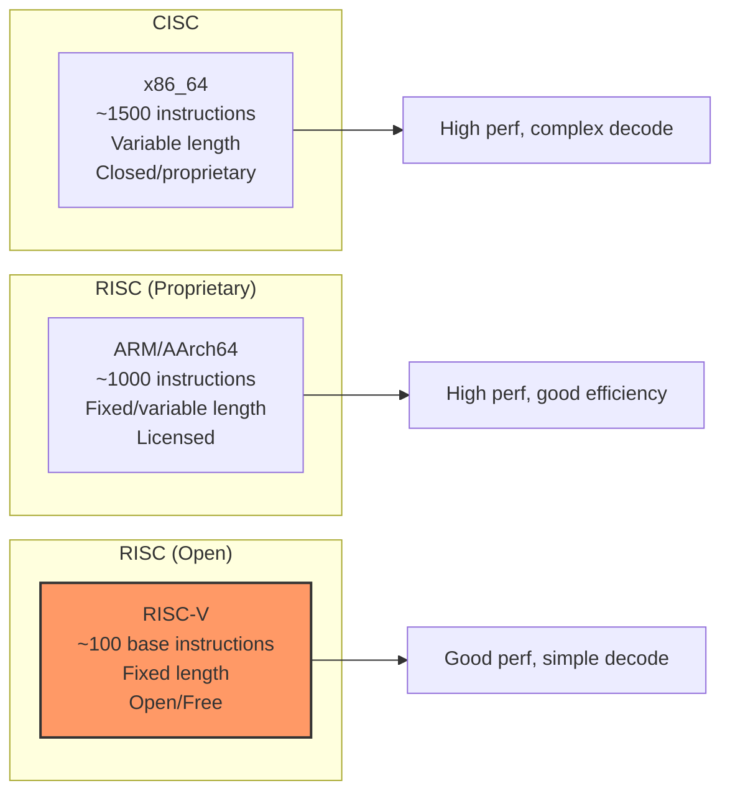
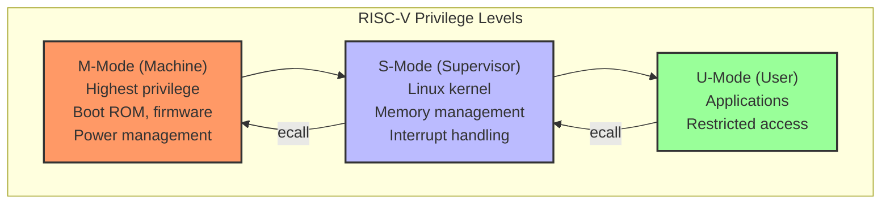
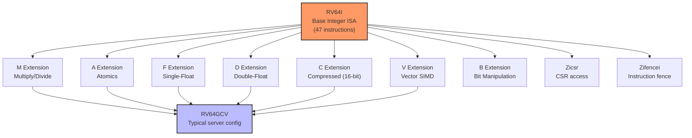
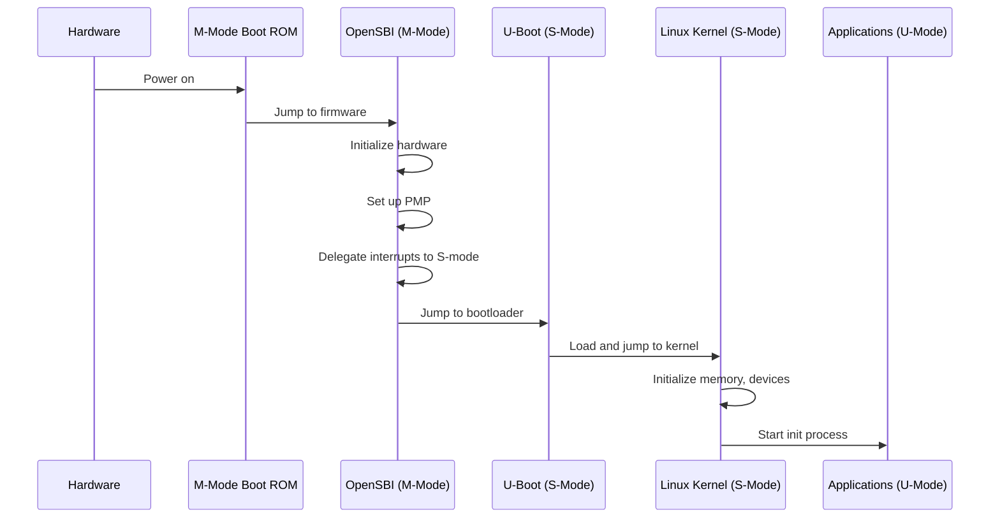

# RISC-V Architecture

## Introduction

RISC-V (pronounced "risk-five") is an open-source instruction set architecture (ISA) based on established reduced-instruction-set computer (RISC) principles. Unlike x86 and ARM, RISC-V is **royalty-free and open**, meaning anyone can design, manufacture, and sell RISC-V chips without licensing fees. This has made RISC-V the most exciting new architecture in decades, attracting investment from startups, universities, and major technology companies.

RISC-V support was merged into the Linux kernel in 2018 (kernel 4.15), and the ecosystem has grown rapidly since then. This chapter covers the RISC-V ISA design, privilege levels, extensions, and Linux support.

## ISA Design Philosophy

### RISC-V Principles

```
RISC-V Design Goals
───────────────────
1. Open and free — No licensing fees, open specification
2. Simple and clean — Regular instruction encoding
3. Modular — Base ISA + optional extensions
4. Small — Minimal base instruction set
5. Academic-friendly — Designed for teaching and research
6. Industrial-grade — Suitable for production use
7. Stable base — Base ISA is frozen (won't change)
```

### Comparison with Other ISAs



## Base Integer ISA (RV32I / RV64I)

### Instruction Formats

RISC-V has a remarkably clean instruction encoding with only 6 formats:

```
RISC-V Instruction Formats (6 types)
─────────────────────────────────────
R-type: Register-register operations
┌─────────┬─────┬─────┬─────┬─────┬─────────┬─────────┐
│ funct7  │ rs2 │ rs1 │funct3│ rd  │ opcode  │         │
│ 7 bits  │5bit │5bit │3 bits│5bit │ 7 bits  │         │
└─────────┴─────┴─────┴─────┴─────┴─────────┴─────────┘

I-type: Immediate operations, loads
┌───────────────┬─────┬─────┬─────┬─────────┐
│ imm[11:0]     │ rs1 │funct3│ rd  │ opcode  │
│ 12 bits       │5bit │3 bits│5bit │ 7 bits  │
└───────────────┴─────┴─────┴─────┴─────────┘

S-type: Stores
┌──────────┬─────┬─────┬─────┬──────────┬─────────┐
│imm[11:5] │ rs2 │ rs1 │funct3│imm[4:0]  │ opcode  │
│ 7 bits   │5bit │5bit │3 bits│ 5 bits   │ 7 bits  │
└──────────┴─────┴─────┴─────┴──────────┴─────────┘

B-type: Branches
┌──────────┬─────┬─────┬─────┬──────────┬─────────┐
│imm[12|10:5]│rs2 │ rs1 │funct3│imm[4:1|11]│opcode │
│ 7 bits   │5bit │5bit │3 bits│ 5 bits   │ 7 bits  │
└──────────┴─────┴─────┴─────┴──────────┴─────────┘

U-type: Upper immediate (LUI, AUIPC)
┌───────────────────────────────┬─────┬─────────┐
│ imm[31:12]                    │ rd  │ opcode  │
│ 20 bits                       │5bit │ 7 bits  │
└───────────────────────────────┴─────┴─────────┘

J-type: Jumps (JAL)
┌──────────────────────────────────────┬─────┬─────────┐
│ imm[20|10:1|11|19:12]               │ rd  │ opcode  │
│ 20 bits                              │5bit │ 7 bits  │
└──────────────────────────────────────┴─────┴─────────┘
```

### Base Integer Instructions

```
RV64I Base Instructions (47 instructions)
──────────────────────────────────────────
Arithmetic:
  ADD, SUB, ADDI                   — Addition, subtraction
  ADDIW, ADDW, SUBW               — 32-bit (Word) operations
  LUI                              — Load upper immediate (20-bit)
  AUIPC                            — Add upper immediate to PC

Logical:
  AND, OR, XOR, ANDI, ORI, XORI   — Bitwise operations

Shift:
  SLL, SRL, SRA, SLLI, SRLI, SRAI — Shifts
  SLLW, SRLW, SRAW               — 32-bit shifts

Comparison:
  SLT, SLTU, SLTI, SLTIU          — Set less than (signed/unsigned)

Memory:
  LB, LH, LW, LD                  — Load (byte/half/word/double)
  LBU, LHU, LWU                   — Load unsigned
  SB, SH, SW, SD                  — Store

Branch:
  BEQ, BNE, BLT, BGE, BLTU, BGEU — Conditional branches

Jump:
  JAL                              — Jump and link
  JALR                             — Jump and link register

System:
  ECALL                            — Environment call (syscall)
  EBREAK                           — Environment breakpoint (debug)
  FENCE                            — Memory fence
  CSR instructions                 — Control/status register access
```

### Example RISC-V Assembly

```asm
# RISC-V assembly example: Fibonacci
# int fib(int n) {
#     if (n <= 1) return n;
#     return fib(n-1) + fib(n-2);
# }

fib:
    addi    sp, sp, -32       # Allocate stack frame
    sd      ra, 24(sp)        # Save return address
    sd      s0, 16(sp)        # Save s0 (callee-saved)
    sd      s1, 8(sp)         # Save s1 (callee-saved)
    mv      s0, a0            # s0 = n

    li      t0, 1
    ble     s0, t0, .base     # if n <= 1, goto base

    # fib(n-1)
    addi    a0, s0, -1        # a0 = n-1
    call    fib               # a0 = fib(n-1)
    mv      s1, a0            # s1 = fib(n-1)

    # fib(n-2)
    addi    a0, s0, -2        # a0 = n-2
    call    fib               # a0 = fib(n-2)

    add     a0, s1, a0        # a0 = fib(n-1) + fib(n-2)
    j       .done

.base:
    mv      a0, s0            # return n

.done:
    ld      ra, 24(sp)        # Restore return address
    ld      s0, 16(sp)        # Restore s0
    ld      s1, 8(sp)         # Restore s1
    addi    sp, sp, 32        # Deallocate stack frame
    ret
```

## Privilege Levels

### RISC-V Privilege Modes



```
Privilege Level Details
───────────────────────
M-Mode (Machine):
  • Boot code (OpenSBI / coreboot)
  • Highest privilege level
  • Direct hardware access
  • Power management, reset
  • Interrupt delegation to S-mode
  • PMP (Physical Memory Protection) configuration

S-Mode (Supervisor):
  • Linux kernel
  • Virtual memory management (page tables)
  • Interrupt handling (delegated from M-mode)
  • Timer interrupts
  • Cannot access M-mode CSRs

U-Mode (User):
  • Applications
  • Lowest privilege
  • System calls via ecall to S-mode
  • No access to privileged CSRs
```

### Control and Status Registers (CSRs)

```
Key RISC-V CSRs
────────────────
Machine-mode CSRs:
  mvendorid    — Vendor ID
  marchid      — Architecture ID
  mimpid       — Implementation ID
  mhartid      — Hardware thread ID
  mstatus      — Machine status register
  mtvec        — Machine trap-handler base address
  mepc         — Machine exception program counter
  mcause       — Machine trap cause
  mtval        — Machine bad address/instruction
  mie          — Machine interrupt enable
  mip          — Machine interrupt pending

Supervisor-mode CSRs:
  sstatus      — Supervisor status
  stvec        — Supervisor trap-handler base
  sscratch     — Supervisor scratch register
  sepc         — Supervisor exception program counter
  scause       — Supervisor trap cause
  stval        — Supervisor bad address
  sie          — Supervisor interrupt enable
  sip          — Supervisor interrupt pending
  satp         — Supervisor address translation and protection
  senvcfg      — Supervisor environment configuration
```

## ISA Extensions

### Modular Extension System



### Standard Extensions

```
RISC-V Standard Extensions
───────────────────────────
M — Integer Multiply/Divide
    MUL, MULH, MULHSU, MULHU, DIV, DIVU, REM, REMU

A — Atomic Instructions
    LR.W, SC.W, AMO*.W (load-reserved, store-conditional, atomics)
    LR.D, SC.D, AMO*.D

F — Single-Precision Floating-Point
    FADD.S, FSUB.S, FMUL.S, FDIV.S, FSQRT.S, ...
    32 × 32-bit floating-point registers (f0-f31)

D — Double-Precision Floating-Point
    FADD.D, FSUB.D, FMUL.D, FDIV.D, FSQRT.D, ...

C — Compressed Instructions
    16-bit encodings for common instructions
    Reduces code size by ~25-30%
    Critical for embedded systems

V — Vector Extension
    Variable-length vector registers (VLEN up to 65536 bits)
    Vector arithmetic, loads, stores, reductions
    Designed for AI/ML, HPC, cryptography

B — Bit Manipulation (Zba, Zbb, Zbc, Zbs)
    Zba: Address generation (shift-and-add)
    Zbb: Basic bit manipulation (count, rotate, sign-extend)
    Zbc: Carry-less multiplication
    Zbs: Single-bit operations

Zicntr — Performance counters
Zihpm — Hardware performance monitors
```

### Vector Extension (RVV)

```asm
# RISC-V Vector example: add two arrays of floats
# Assumes VLEN=128 (4 floats per vector register)

    vsetvli t0, a0, e32, m1    # Set vector length, 32-bit elements
    vle32.v v0, (a1)           # Load vector from array A
    vle32.v v1, (a2)           # Load vector from array B
    vfadd.vv v2, v0, v1        # Vector add: v2 = v0 + v1
    vse32.v v2, (a3)           # Store result to array C
    sub     a0, a0, t0         # Decrement count
    slli    t1, t0, 2          # Byte offset = elements × 4
    add     a1, a1, t1         # Advance pointer A
    add     a2, a2, t1         # Advance pointer B
    add     a3, a3, t1         # Advance pointer C
    bnez    a0, loop           # Repeat if more elements
```

## Linux on RISC-V

### Kernel Support Status

```
Linux RISC-V Support (as of kernel 6.12)
─────────────────────────────────────────
Core features:
  ✓ 64-bit (RV64) — primary target
  ✓ 32-bit (RV32) — supported
  ✓ SMP (multi-core)
  ✓ Vector extension support
  ✓ KVM virtualization
  ✓ eBPF JIT
  ✓ Rust support
  ✓ PREEMPT_RT
  ✓ KASAN, UBSAN
  ✓ perf events
  ✓ ftrace, kprobes

Hardware support:
  ✓ SiFive boards (HiFive Unmatched, etc.)
  ✓ StarFive VisionFive 2
  ✓ QEMU emulation
  ✓ Kendryte K210/K230 (embedded)
  ✓ Microchip PolarFire SoC
  △ Allwinner D1 (basic support)
  △ Sophon SG2042 (server SoC)
  △ SpacemiT K1 (mobile SoC)
```

### Cross-Compiling for RISC-V

```bash
# Install toolchain
$ sudo apt-get install gcc-riscv64-linux-gnu

# Configure for RISC-V
$ make ARCH=riscv CROSS_COMPILE=riscv64-linux-gnu- defconfig

# Or for a specific board
$ make ARCH=riscv CROSS_COMPILE=riscv64-linux-gnu- \
    sifive_unmatched_defconfig

# Build
$ make ARCH=riscv CROSS_COMPILE=riscv64-linux-gnu- -j$(nproc)

# Output
$ ls arch/riscv/boot/Image
```

### Running in QEMU

```bash
# Install QEMU for RISC-V
$ sudo apt-get install qemu-system-misc

# Get a RISC-V rootfs
$ wget https://cdimage.debian.org/cdimage/cloud/sid/daily/latest/debian-sid-nocloud-riscv64-daily.qcow2

# Boot with QEMU
$ qemu-system-riscv64 \
    -M virt \
    -m 4G \
    -smp 4 \
    -kernel arch/riscv/boot/Image \
    -append "root=/dev/vda rw console=ttyS0" \
    -drive file=debian-sid-riscv64.qcow2,format=qcow2,if=virtio \
    -nographic

# Or with OpenSBI firmware
$ qemu-system-riscv64 \
    -M virt \
    -m 4G \
    -bios default \
    -kernel arch/riscv/boot/Image \
    -append "root=/dev/vda rw console=ttyS0" \
    -drive file=debian-sid-riscv64.qcow2,format=qcow2,if=virtio \
    -nographic
```

### Boot Process (RISC-V Linux)



### OpenSBI (Firmware)

```bash
# OpenSBI is the standard firmware for RISC-V Linux
# It runs in M-mode and provides:
# - Boot services
# - Runtime services (SBI calls)
# - Power management
# - Inter-processor interrupts

# Build OpenSBI
$ git clone https://github.com/riscv-software-src/opensbi
$ cd opensbi
$ make CROSS_COMPILE=riscv64-linux-gnu- PLATFORM=generic

# Output
$ ls build/platform/generic/firmware/
fw_dynamic.bin
fw_dynamic.elf
fw_jump.bin
fw_jump.elf
fw_payload.bin    # Contains kernel payload
fw_payload.elf

# SBI (Supervisor Binary Interface) calls from Linux:
# sbi_console_putchar() — Console output
# sbi_set_timer()       — Set timer
# sbi_send_ipi()        — Send IPI
# sbi_hart_start()      — Start another core
```

## RISC-V Hardware Ecosystem

### Development Boards

```
RISC-V Development Boards (2024)
────────────────────────────────
SiFive HiFive Unmatched
  • SiFive FU740 (4× U74 + 1× S7)
  • 16GB RAM
  • PCIe, USB 3.0, Gigabit Ethernet
  • ~$700

StarFive VisionFive 2
  • StarFive JH7110 (4× SiFive U74)
  • 2/4/8GB RAM
  • Gigabit Ethernet, USB 3.0, HDMI
  • ~$55-120
  • Good Linux support

Milk-V Mars
  • StarFive JH7110
  • Credit card size (RPi form factor)
  • 1/2/4GB RAM
  • ~$4-15

Milk-V Megrez
  • SpacemiT K1 (8× X60)
  • 16GB RAM
  • AI-capable
  • ~$120

LicheePi 4A
  • T-Head TH1520 (4× C910)
  • 4/8/16GB RAM
  • NPU for AI
  • ~$40-120
```

### Server-Grade RISC-V

```
Server RISC-V (Emerging)
────────────────────────
Sophon SG2042
  • 64× SiFive P670 cores
  • 128MB L3 cache
  • PCIe Gen 4
  • First "server-class" RISC-V chip
  • Linux support in progress

Ventana Micro Veyron
  • High-performance RISC-V cores
  • Targeting data center
  • Competitive with ARM Neoverse

Tenstorrent Ascalon
  • Jim Keller's company
  • High-performance RISC-V
  • AI-focused design
```

## RISC-V vs. ARM vs. x86

```
Architecture Comparison
───────────────────────
Feature         x86_64          ARM/AArch64      RISC-V
────────────    ──────────      ───────────      ────────
ISA type        CISC            RISC             RISC
License         Proprietary     Licensed         Open/Free
Instructions    ~1500           ~1000            ~100+extensions
Encoding        Variable        Fixed/variable   Fixed (32/16)
Endianness      Little          Bi-endian        Bi-endian
Privilege       4 rings         4 ELs            3 modes
Linux support   Since 0.01      Since 2.6        Since 4.15
Market share    Desktop/server  Mobile/embedded  Growing
Decode complexity High           Medium           Low
Power efficiency Medium          High             High
```

## References and Further Reading

- [The Linux Kernel Documentation](https://docs.kernel.org/)
- [LWN.net - Linux and free software news](https://lwn.net/)
- [GNU Project Documentation](https://www.gnu.org/doc/doc.html)
- [GNU Manuals](https://www.gnu.org/manual/manual.html)
- [Free Software Directory](https://directory.fsf.org/wiki/Main_Page)
- [Planet GNU](https://planet.gnu.org/)
- [Free Software Books](https://www.gnu.org/doc/other-free-books.html)

- RISC-V Specifications: https://riscv.org/technical/specifications/
- RISC-V Reader (Patterson & Waterman): https://www.amazon.com/RISC-V-Reader-Open-Architecture/dp/0999249129
- RISC-V Linux kernel: https://git.kernel.org/pub/scm/linux/kernel/git/torvalds/linux.git/tree/arch/riscv
- OpenSBI: https://github.com/riscv-software-src/opensbi
- RISC-V Foundation: https://riscv.org/
- SiFive: https://www.sifive.com/
- StarFive: https://www.starfivetech.com/
- Milk-V: https://milkv.io/
- "An Introduction to RISC-V" — SiFive: https://www.sifive.com/blog/an-introduction-to-risc-v
- RISC-V ELF specification: https://github.com/riscv-non-isa/riscv-elf-psabi-doc
- Linux RISC-V documentation: https://www.kernel.org/doc/html/latest/arch/riscv/

## Related Topics

- [ARM Architecture](./arm.md) — another RISC architecture with Linux support
- [MIPS Architecture](./mips.md) — RISC architecture with embedded history
- [Memory Models](./memory-models.md) — RISC-V relaxed memory model
- [Calling Conventions](./calling-conventions.md) — RISC-V calling convention
- [Cross-Compilation](../build/cross-compilation.md) — building for RISC-V
