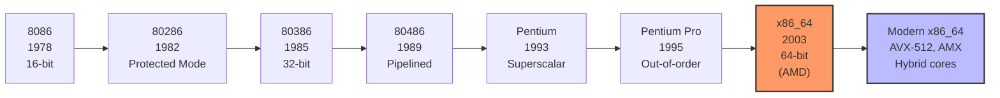
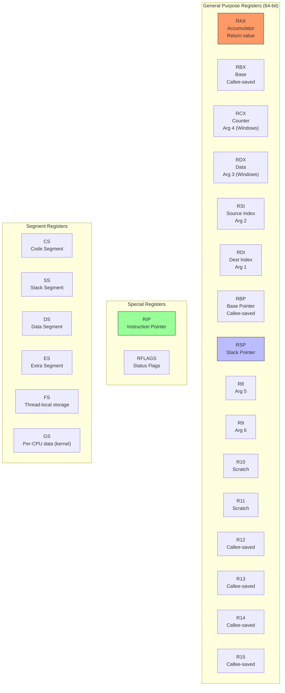
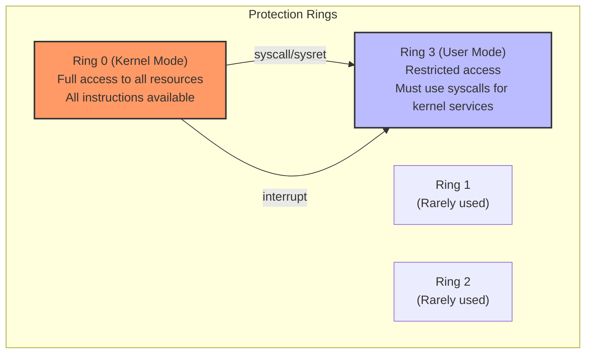

# x86/x86_64 Architecture

## Introduction

The x86 architecture, originally designed by Intel in 1978 for the 8086 processor, has become the most commercially successful instruction set architecture in history. Its 64-bit extension, **x86_64** (also called **AMD64** or **Intel 64**), dominates server, desktop, and laptop computing. Understanding x86/x86_64 is essential for Linux kernel developers, as it's the primary development platform and the most widely deployed architecture.

This chapter covers the architecture's key features: registers, addressing modes, segmentation, paging, privilege rings, and how the Linux kernel uses these facilities.

## Architecture Overview

### Evolution of x86



### x86_64 Key Features

```
x86_64 Architecture Highlights
───────────────────────────────
Registers:        16 general-purpose (64-bit), 16 SSE/AVX (128/256/512-bit)
Address space:    48-bit virtual (256 TB), up to 52-bit physical (4 PB)
Page sizes:       4KB, 2MB (huge), 1GB (gigantic)
Privilege levels: 4 rings (0-3), typically only 0 (kernel) and 3 (user)
Instructions:     CISC (variable-length, 1-15 bytes)
Endianness:       Little-endian
Extensions:       SSE, SSE2, AVX, AVX2, AVX-512, AMX, BMI, etc.
```

## Registers

### General-Purpose Registers

x86_64 has 16 general-purpose registers (extended from 8 in 32-bit):



### Register Naming Conventions

```
Register Size Access
────────────────────
RAX      64-bit   Full register
EAX      32-bit   Lower 32 bits (zero-extends to 64)
AX       16-bit   Lower 16 bits
AL       8-bit    Lower 8 bits
AH       8-bit    Bits 8-15 (only for legacy regs)

Example: RAX = 0x123456789ABCDEF0
         EAX = 0x9ABCDEF0
         AX  = 0xDEF0
         AL  = 0xF0
         AH  = 0xDE

New registers (R8-R15):
  R8      64-bit
  R8D     32-bit (lower 32)
  R8W     16-bit (lower 16)
  R8B     8-bit  (lower 8)
```

### Segment Registers in 64-bit Mode

```c
/*
 * In x86_64 long mode, segmentation is mostly disabled.
 * CS, DS, ES, SS are flat (base=0, limit=max).
 * FS and GS retain base addresses (stored in MSRs).
 *
 * Linux uses:
 *   GS.base (kernel) → per-CPU data area
 *   FS.base (user)   → thread-local storage (TLS)
 */

/* Reading GS.base in kernel code */
static inline unsigned long cpu_read_gs_base(void)
{
    return __rdmsr(MSR_GS_BASE);
}

/* Setting FS.base for user TLS */
static inline void wrfsbase(unsigned long addr)
{
    asm volatile("wrfsbase %0" :: "r"(addr));
}
```

## Addressing Modes

### Address Calculation

```
x86_64 Addressing Modes
───────────────────────
Effective Address = Segment Base + Base + (Index × Scale) + Displacement

Components:
  Base:     Any GPR
  Index:    Any GPR except RSP
  Scale:    1, 2, 4, or 8
  Displacement: 8-bit, 16-bit, or 32-bit immediate

Examples (AT&T syntax):
  movq (%rax), %rbx              # [RAX]
  movq 8(%rax), %rbx             # [RAX + 8]
  movq (%rax,%rcx), %rbx         # [RAX + RCX]
  movq (%rax,%rcx,4), %rbx       # [RAX + RCX*4]
  movq 8(%rax,%rcx,4), %rbx      # [RAX + RCX*4 + 8]
  movq symbol(%rip), %rbx        # RIP-relative (PC-relative)
```

### RIP-Relative Addressing

```nasm
; x86_64 uses RIP-relative addressing by default for position-independent code
; This is essential for shared libraries and KASLR

; Load variable relative to instruction pointer
mov  rax, [rel my_variable]    ; RIP-relative

; In Linux kernel code:
; All kernel code is compiled with -mcmodel=kernel (negative 2GB range)
; KASLR randomizes the kernel base address
```

## Segmentation

### Historical Context

```
Segmentation Evolution
───────────────────────
8086 (Real Mode):
  Physical address = Segment × 16 + Offset
  20-bit address space (1 MB)
  
80286 (Protected Mode):
  Segment descriptors with base, limit, and permissions
  24-bit address space (16 MB)

80386 (32-bit Protected Mode):
  32-bit segments
  Flat memory model possible
  4 GB address space

x86_64 (Long Mode):
  Segmentation essentially disabled (flat model)
  CS, DS, ES, SS: base=0, limit=max
  FS, GS: functional (used for TLS and per-CPU data)
```

### Segment Descriptor

```c
/* Segment descriptor (8 bytes, 32-bit mode) */
struct segment_desc {
    uint16_t limit_0_15;    /* Limit bits 0-15 */
    uint16_t base_0_15;     /* Base bits 0-15 */
    uint8_t  base_16_23;    /* Base bits 16-23 */
    uint8_t  type:4;        /* Segment type */
    uint8_t  s:1;           /* Descriptor type (0=system, 1=code/data) */
    uint8_t  dpl:2;         /* Descriptor privilege level */
    uint8_t  p:1;           /* Present */
    uint8_t  limit_16_19:4; /* Limit bits 16-19 */
    uint8_t  avl:1;         /* Available for use */
    uint8_t  l:1;           /* Long mode (1=64-bit) */
    uint8_t  d:1;           /* Default operand size */
    uint8_t  g:1;           /* Granularity (0=byte, 1=4KB) */
    uint8_t  base_24_31;    /* Base bits 24-31 */
} __attribute__((packed));
```

## Paging

### Paging Modes

```mermaid
graph TD
    subgraph "4-Level Paging (Standard)"
        PML4["PML4 (Page Map Level 4)<br/>512 entries × 512GB = 256TB"]
        PDP["PDPT (Page Directory Pointer Table)<br/>512 entries × 1GB"]
        PD["PD (Page Directory)<br/>512 entries × 2MB"]
        PT["PT (Page Table)<br/>512 entries × 4KB"]
        PAGE["4KB Page"]
        
        PML4 --> PDP --> PD --> PT --> PAGE
    end
    
    subgraph "5-Level Paging (Ice Lake+)"
        PML5["PML5<br/>512 entries"]
        PML4B["PML4"]
        PDPB["PDPT"]
        PDB["PD"]
        PTB["PT"]
        PAGEB["4KB Page"]
        
        PML5 --> PML4B --> PDPB --> PDB --> PTB --> PAGEB
    end
    
    style PML4 fill:#f96,stroke:#333
    style PML5 fill:#bbf,stroke:#333
```



### Page Table Entry

```c
/* x86_64 page table entry (8 bytes) */
struct page_table_entry {
    uint64_t present:1;         /* Page is present in memory */
    uint64_t writable:1;        /* Page is writable */
    uint64_t user_access:1;     /* User-mode access allowed */
    uint64_t page_write_through:1;  /* Write-through caching */
    uint64_t page_cache_disable:1;  /* Disable caching */
    uint64_t accessed:1;        /* Page has been accessed */
    uint64_t dirty:1;           /* Page has been written to */
    uint64_t huge_page:1;       /* 2MB page (in PD) or 1GB (in PDPT) */
    uint64_t global:1;          /* Not flushed on CR3 switch */
    uint64_t available:3;       /* OS-available bits */
    uint64_t page_frame:40;     /* Physical page frame number */
    uint64_t available2:7;      /* More OS-available bits */
    uint64_t protection_key:4;  /* Protection key (PKU) */
    uint64_t execute_disable:1; /* No-execute (NX) bit */
};
```

### Linux Page Table Levels

```c
/* Linux uses these macros for page table manipulation */

/* 4-level page tables */
#define PGDIR_SHIFT     39      /* PML4 level */
#define PUD_SHIFT       30      /* PDPT level */
#define PMD_SHIFT       21      /* PD level */
#define PAGE_SHIFT      12      /* PT level (4KB pages) */

/* Page table sizes */
#define PTRS_PER_PGD    512     /* Entries in PML4 */
#define PTRS_PER_PUD    512     /* Entries in PDPT */
#define PTRS_PER_PMD    512     /* Entries in PD */
#define PTRS_PER_PTE    512     /* Entries in PT */

/* Address masking */
#define PAGE_MASK       (~(PAGE_SIZE-1))
#define PGDIR_MASK      (~(PGDIR_SIZE-1))

/* Converting addresses to page table indices */
static inline pgd_t *pgd_offset(pgd_t *pgd, unsigned long address)
{
    return pgd + pgd_index(address);
}

static inline unsigned long pgd_index(unsigned long address)
{
    return (address >> PGDIR_SHIFT) & (PTRS_PER_PGD - 1);
}
```

## Privilege Rings

### Ring Structure



```
Privilege Ring Usage
────────────────────
Ring 0 (Kernel):
  • Linux kernel code
  • Device drivers
  • Full access to all memory
  • Can execute privileged instructions (CLI, STI, HLT, IN, OUT)
  • Access to all I/O ports
  • Can modify page tables, control registers

Ring 1, 2 (Unused by Linux):
  • Could be used for device drivers (theory)
  • Linux keeps everything in Ring 0 or Ring 3
  • Some hypervisors use Ring 1 for guest kernels

Ring 3 (User):
  • All user applications
  • Cannot execute privileged instructions
  • Cannot directly access I/O ports
  • Cannot modify page tables
  • Must use syscalls to request kernel services
  • Protected memory from other Ring 3 processes
```

### System Calls

```nasm
; x86_64 system call convention (System V ABI)
; Arguments: RDI, RSI, RDX, R10, R8, R9
; System call number: RAX
; Return value: RAX
; Clobbered: RCX, R11

; Example: write(1, "hello\n", 6)
section .data
    msg db "hello", 10

section .text
    global _start
_start:
    mov rax, 1          ; syscall number: sys_write
    mov rdi, 1          ; fd: stdout
    lea rsi, [rel msg]  ; buf: pointer to string
    mov rdx, 6          ; count: 6 bytes
    syscall             ; invoke kernel

    mov rax, 60         ; syscall number: sys_exit
    xor rdi, rdi        ; status: 0
    syscall
```

```c
/* Kernel-side syscall entry (simplified) */
/* arch/x86/entry/entry_64.S */

/*
 * Syscall entry point for 64-bit programs.
 * Entered via SYSCALL instruction.
 */
entry_SYSCALL_64:
    /* Save user context */
    swapgs                  /* Switch to kernel GS base */
    mov [gs:cpu_tss_sp0], rsp  /* Save user RSP */
    mov rsp, [gs:cpu_tss_sp1]  /* Load kernel RSP */
    
    /* Save registers to pt_regs */
    push rdi
    push rsi
    push rdx
    /* ... save all registers ... */
    
    /* Look up syscall handler */
    mov rax, [rsp + ORIG_RAX]
    call [sys_call_table + rax*8]
    
    /* Return to userspace */
    /* ... restore registers ... */
    sysretq
```

## Kernel Memory Layout

### x86_64 Virtual Address Space

```
x86_64 Linux Virtual Address Space (4-level paging)
────────────────────────────────────────────────────

0xFFFFFFFFFFFFFFFF ┌─────────────────────┐
                   │ Kernel space         │ -128 TB (or -16 EB with 5-level)
                   │ (direct mapping)     │
0xFFFF888000000000 ├─────────────────────┤
                   │ Physical memory map  │ 64 TB
                   │ (page_offset_base)   │
0xFFFF800000000000 ├─────────────────────┤
                   │ vmalloc/ioremap      │ 8 TB
0xFFFF000000000000 ├─────────────────────┤
                   │ KASAN shadow         │ 8 TB (if enabled)
                   │ ...                  │
0x00007FFFFFFFFFFF ├─────────────────────┤
                   │ User space           │ 128 TB (47-bit)
                   │ (mmap, heap, stack)  │
0x0000000000000000 └─────────────────────┘
```

### Direct Mapping

```c
/* Linux maps all physical memory directly into kernel virtual space */
/* This is the "direct mapping" or "linear mapping" */

/* Convert between physical and virtual addresses */
#define __pa(x)         ((unsigned long)(x) - PAGE_OFFSET)
#define __va(x)         ((void *)((unsigned long)(x) + PAGE_OFFSET))

/* PAGE_OFFSET on x86_64 is 0xFFFF888000000000 */
/* This means physical address 0 maps to 0xFFFF888000000000 */
/* Physical address 0x1000 maps to 0xFFFF888000001000 */
/* etc. */

/* Example usage in kernel code */
struct page *page = alloc_page(GFP_KERNEL);
void *vaddr = page_address(page);          /* Kernel virtual address */
phys_addr_t paddr = page_to_phys(page);    /* Physical address */

/* Or equivalently */
void *vaddr2 = __va(paddr);
phys_addr_t paddr2 = __pa(vaddr);
```

## KASLR (Kernel Address Space Layout Randomization)

```bash
# KASLR randomizes the kernel load address at boot time
# This makes exploiting kernel vulnerabilities harder

# Check if KASLR is enabled
$ cat /proc/cmdline | grep -o nokaslr
# (no output = enabled)

# Disable KASLR (for debugging)
# Add "nokaslr" to kernel command line in GRUB

# Check randomized addresses
$ sudo cat /proc/kallsyms | head -5
ffffffff81000000 T _text          # Changes every boot with KASLR
ffffffff81001000 T startup_64
ffffffff81001000 T secondary_startup_64
```

## CPU Feature Detection

```c
/* Linux detects CPU features at boot and stores them */

/* Check for CPUID features */
static inline bool cpu_has_sse2(void)
{
    return boot_cpu_has(X86_FEATURE_SSE2);
}

static inline bool cpu_has_avx2(void)
{
    return boot_cpu_has(X86_FEATURE_AVX2);
}

static inline bool cpu_has_avx512f(void)
{
    return boot_cpu_has(X86_FEATURE_AVX512F);
}

/* CPU feature flags in /proc/cpuinfo */
$ grep flags /proc/cpuinfo | head -1
flags : fpu vme de pse tsc msr pae mce cx8 apic sep mtrr pge mca cmov
        pat pse36 clflush dts acpi mmx fxsr sse sse2 ss ht tm pbe
        syscall nx rdtscp lm constant_tsc arch_perfmon pebs bts rep_good
        nopl xtopology nonstop_tsc cpuid aperfmperf pni pclmulqdq dtes64
        monitor ds_cpl vmx est tm2 ssse3 cx16 xtpr pdcm pcid sse4_1
        sse4_2 x2apic popcnt tsc_deadline_timer aes xsave avx f16c rdrand
        lahf_lm cpuid_fault epb invpcid_single ssbd ibrs ibpb stibp
        tpr_shadow vnmi flexpriority ept vpid fsgsbase tsc_adjust bmi1
        avx2 smep bmi2 erms invpcid xsaveopt dtherm ida arat pln pts
        md_clear flush_l1d
```

## x86-Specific Kernel Features

### Spectre/Meltdown Mitigations

```bash
# Check active mitigations
$ cat /sys/devices/system/cpu/vulnerabilities/meltdown
Mitigation: PTI

$ cat /sys/devices/system/cpu/vulnerabilities/spectre_v1
Mitigation: usercopy/swapgs barriers and __user pointer sanitization

$ cat /sys/devices/system/cpu/vulnerabilities/spectre_v2
Mitigation: Retpolines, IBPB: conditional, IBRS_FW, STIBP: conditional, RSB filling

# Full mitigation status
$ grep . /sys/devices/system/cpu/vulnerabilities/*
```

### Performance Counters

```bash
# x86 has hardware performance counters (PMU)
# Access via perf tool

$ perf stat -e cycles,instructions,cache-misses,branch-misses -- ./program

 Performance counter stats for './program':

     1,234,567,890      cycles
       987,654,321      instructions      # 0.80 insn per cycle
         1,234,567      cache-misses
           234,567      branch-misses

# Specific x86 PMU events
$ perf list | grep -i "intel"
  cpu/event=0x3c,umask=0x00/          [Kernel PMU event]
  cpu/event=0xc0,umask=0x00/          [Kernel PMU event]
  ...
```

## Linux Kernel x86 Code Organization

```
arch/x86/
├── boot/               — Boot code (bzImage creation)
├── entry/              — Syscall and interrupt entry points
├── events/             — Performance monitoring (perf)
├── hyperv/             — Hyper-V support
├── include/            — x86-specific headers
├── kernel/             — Core kernel (process, signal, time)
├── kvm/                — KVM virtualization (VMX/SVM)
├── lib/                — x86-optimized library routines
├── math-emu/           — FPU emulation
├── mm/                 — Memory management
├── net/                — x86-specific networking (BPF JIT)
├── pci/                — PCI support
├── platform/           — Platform-specific code
├── power/              — ACPI/power management
├── tools/              — x86 userspace tools
├── um/                 — User-Mode Linux
├── vdso/               — vDSO (virtual dynamic shared object)
├── video/              — Video/framebuffer support
├── xen/                — Xen hypervisor support
├── Kconfig             — x86 configuration options
├── Kconfig.debug       — Debug configuration
└── Makefile            — Build rules
```

## References and Further Reading

- [The Linux Kernel Documentation](https://docs.kernel.org/)
- [LWN.net - Linux and free software news](https://lwn.net/)
- [GNU Project Documentation](https://www.gnu.org/doc/doc.html)
- [GNU Manuals](https://www.gnu.org/manual/manual.html)
- [Free Software Directory](https://directory.fsf.org/wiki/Main_Page)
- [Planet GNU](https://planet.gnu.org/)
- [Free Software Books](https://www.gnu.org/doc/other-free-books.html)

- Intel 64 and IA-32 Architectures Software Developer Manuals: https://www.intel.com/content/www/us/en/developer/articles/technical/intel-sdm.html
- AMD64 Architecture Programmer's Manual: https://www.amd.com/en/support/tech-docs
- x86_64 System V ABI: https://gitlab.com/x86-psABIs/x86-64-ABI
- Linux kernel x86 documentation: https://www.kernel.org/doc/html/latest/arch/x86/
- OSDev Wiki — x86-64: https://wiki.osdev.org/X86-64
- "Intel 64 and IA-32 Architectures Optimization Reference Manual"
- Linux kernel arch/x86 source: https://elixir.bootlin.com/linux/latest/source/arch/x86
- "Understanding the Linux Virtual Memory Manager" by Mel Gorman
- x86 instruction reference: https://www.felixcloutier.com/x86/

## Related Topics

- [Calling Conventions](./calling-conventions.md) — x86_64 System V ABI details
- [Memory Models](./memory-models.md) — x86 TSO memory ordering
- [Building the Kernel](../build/kernel-build.md) — building for x86
- [Key Kernel Subsystems](../history/subsystems.md) — subsystems using x86-specific code
