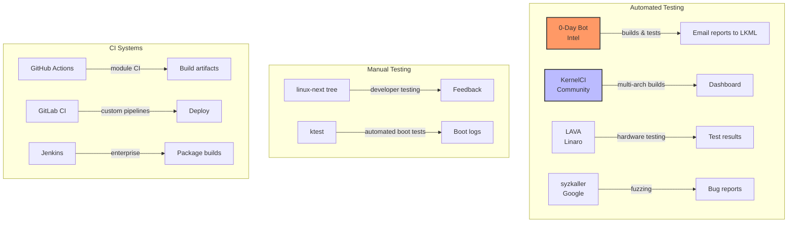
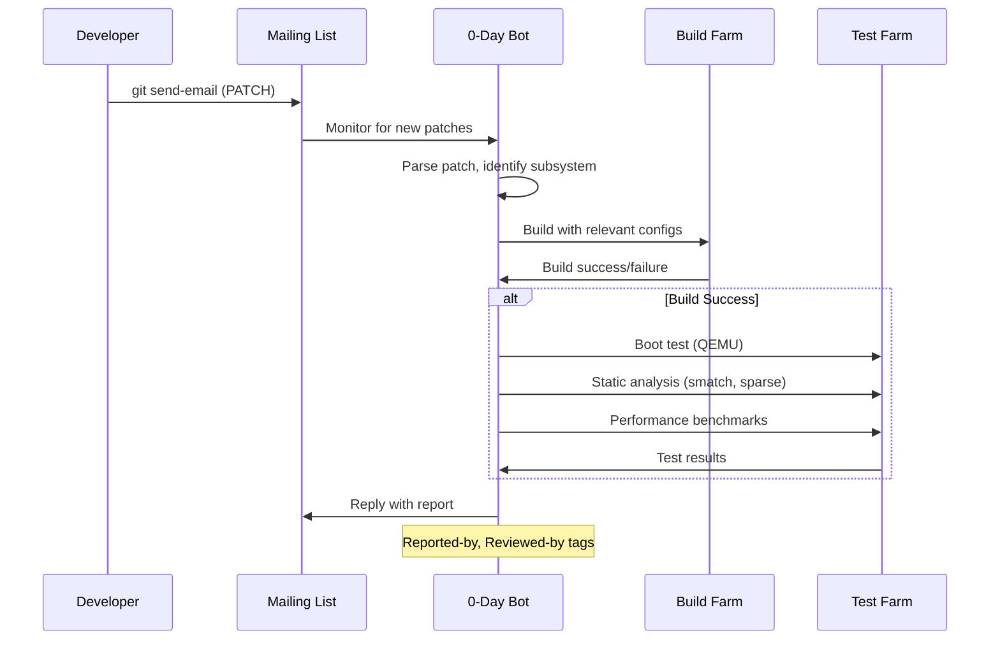
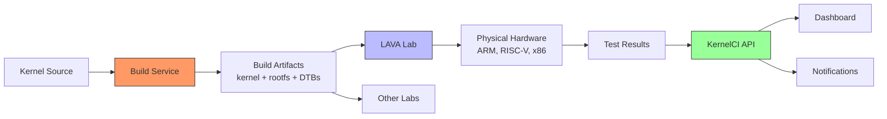
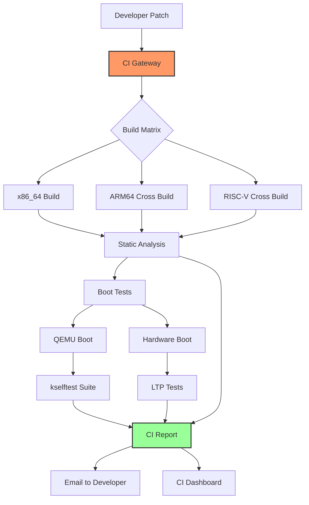

# CI/CD for the Linux Kernel

## Introduction

Continuous Integration and Continuous Delivery (CI/CD) for the Linux kernel is a massive undertaking. The kernel is one of the largest and most complex open-source projects, with over 28 million lines of code, thousands of configuration options, and hundreds of target architectures. Testing it requires specialized infrastructure that can build, boot, and stress-test kernels across diverse hardware.

This chapter covers the major CI/CD systems used by the kernel community, from Intel's 0-Day bot to the community-driven KernelCI, and practical approaches for CI/CD in kernel module development.

## The Kernel CI Landscape



## Intel's 0-Day Bot

### Overview

The **0-Day bot** is Intel's automated kernel testing system. It's one of the most prolific contributors to the kernel—not by writing code, but by finding bugs.

```
0-Day Bot Statistics (2024)
───────────────────────────
Patches tested per day:     ~200-400
Builds per day:             ~1,000+
Configurations tested:      ~200+
Architectures:              x86_64, ARM64, RISC-V
Bug reports per year:       ~5,000+
Performance tests:          Continuous
Maintained by:              Intel OSS Technology Center
```

### How 0-Day Works



### 0-Day Report Example

```
From: kernel test robot <lkp@intel.com>
Subject: [net] e1000e: fix regression - build error

tree:   https://git.kernel.org/pub/scm/linux/kernel/git/torvalds/linux.git master
head:   abc123def456
commit: 7890abcdef12 ("e1000e: add new device support")
date:   3 days ago
config: x86_64-randconfig-001-20250721
compiler: gcc-13 (GCC 13.2.0)

Error (expand):
   drivers/net/ethernet/intel/e1000e/netdev.c: In function 'e1000e_setup_rx_resources':
   drivers/net/ethernet/intel/e1000e/netdev.c:1234:25: error: implicit declaration of function 'new_api_func'

If you fix the issue in a separate patch/commit (i.e. not just a new version of
the same patch/commit), kindly add following tags
| Reported-by: kernel test robot <lkp@intel.com>
| Closes: https://lore.kernel.org/oe-kbuild-all/202507210000.ABCDEF@lkp/
```

### Static Analysis Tools Used by 0-Day

```bash
# Sparse — Semantic parser for C
$ make C=1 CHECK=sparse -j$(nproc)
# Or for specific files:
$ make C=2 drivers/net/ethernet/intel/e1000e/

# Smatch — Static analysis for kernel code
$ ./smatch_scripts/test_kernel.sh

# Coccinelle — Semantic patching
$ make coccicheck
# Or for specific semantic patches:
$ sp --sp-file scripts/coccinelle/free/kfree.cocci fs/ext4/

# GCC static analyzer
$ make KCFLAGS="-fanalyzer" -j$(nproc)

# Clang static analyzer
$ make CC=clang-analyzer -j$(nproc)
```

## KernelCI

### Overview

**KernelCI** is a community-driven project that tests the Linux kernel across multiple architectures and hardware platforms.

```
KernelCI Facts
──────────────
URL: https://kernelci.org/
Goal: Test every kernel commit on real hardware
Architectures: x86_64, ARM, ARM64, RISC-V, MIPS
Hardware: 100+ physical devices in labs
Test types: Boot, kselftest, LTP, benchmarks
Data: kernelci.org API and dashboard
Funding: Linux Foundation, Collabora, Google, ARM
```

### KernelCI Architecture



### Using KernelCI API

```bash
# Query recent build results
$ curl -s "https://api.kernelci.org/build?kernel_branch=mainline&limit=10" | \
    jq '.data[] | {kernel: .kernel.version, arch: .arch, status: .status}'

# Get test results for a specific kernel version
$ curl -s "https://api.kernelci.org/test?kernel_version=6.12&limit=10" | \
    jq '.data[] | {test: .test_suite, device: .device, status: .status}'

# List available devices
$ curl -s "https://api.kernelci.org/device" | \
    jq '.data[] | {name: .name, arch: .arch}'
```

## LAVA (LAb for Validation Architecture)

### Overview

**LAVA** is a test automation framework developed by Linaro for deploying and testing software on real hardware.

```bash
# Install LAVA (Debian/Ubuntu)
$ sudo apt-get install lava-server lava-dispatcher

# Or use the LAVA Docker setup
$ git clone https://git.lavasoftware.org/lava/lava-docker
$ cd lava-docker
$ docker-compose up
```

### LAVA Job Definition

```yaml
# Example LAVA job definition for ARM64 boot test
device_type: qemu-arm64
job_name: kernel-boot-test-arm64

timeouts:
  job:
    minutes: 30
  action:
    minutes: 10

priority: medium
visibility: public

actions:
- deploy:
    to: tftp
    kernel:
      url: https://storage.kernelci.org/mainline/v6.12/arm64/gcc-13/Image
    ramdisk:
      url: https://storage.kernelci.org/rootfs/buildroot/arm64/rootfs.cpio.gz
      compression: gz
    os: oe

- boot:
    method: qemu
    media: tmpfs
    prompts:
    - "root@lava:~#"

- test:
    timeout:
      minutes: 10
    definitions:
    - repository: https://github.com/kernelci/test-definitions.git
      from: git
      path: automated/linux/boot
      name: boot-test
```

### LAVA REST API

```bash
# Submit a job
$ curl -X POST \
    -H "Authorization: Token $LAVA_TOKEN" \
    -H "Content-Type: application/yaml" \
    -d @job.yaml \
    https://lava.example.net/api/v0.2/jobs/

# Check job status
$ curl -H "Authorization: Token $LAVA_TOKEN" \
    https://lava.example.net/api/v0.2/jobs/12345/

# Get job logs
$ curl -H "Authorization: Token $LAVA_TOKEN" \
    https://lava.example.net/api/v0.2/jobs/12345/logs/
```

## syzkaller: Kernel Fuzzing

### Overview

**syzkaller** is a coverage-guided kernel fuzzer developed by Google. It has found thousands of kernel bugs.

```bash
# Install syzkaller
$ go install github.com/google/syzkaller/syz-manager@latest

# Create configuration
cat > syz-manager.cfg << 'EOF'
{
    "target": "linux/amd64",
    "http": "localhost:56741",
    "workdir": "/syzkaller/workdir",
    "kernel_obj": "/path/to/kernel/build",
    "image": "/path/to/image.qcow2",
    "sshkey": "/path/to/ssh/key",
    "syzkaller": "/syzkaller",
    "procs": 4,
    "type": "qemu",
    "vm": {
        "count": 4,
        "kernel": "/path/to/kernel/build/arch/x86/boot/bzImage",
        "cpu": 2,
        "mem": 2048
    }
}
EOF

# Run syzkaller
$ syz-manager -config=syz-manager.cfg

# Dashboard: https://syzkaller.appspot.com/
```

### syzkaller Bug Report Example

```
Title: KASAN: use-after-free in ext4_write_inline_data

syzkaller found a use-after-free bug in ext4:

BUG: KASAN: use-after-free in ext4_write_inline_data+0x234/0x300 fs/ext4/inline.c:234
Read of size 8 at addr ffff888123456789 by task syz-executor.0/1234

CPU: 0 PID: 1234 Comm: syz-executor.0 Not tainted 6.12.0-rc1 #1
Hardware name: QEMU Standard PC
Call Trace:
 <TASK>
 dump_stack_lvl+0x91/0xf0 lib/dump_stack.c:107
 print_report+0x17a/0x4b0 mm/kasan/report.c:399
 kasan_report+0xc4/0x100 mm/kasan/report.c:496
 ext4_write_inline_data+0x234/0x300 fs/ext4/inline.c:234
 ...
```

## GitHub Actions for Kernel Modules

### Basic CI Pipeline

```yaml
# .github/workflows/kernel-module-ci.yml
name: Kernel Module CI

on:
  push:
    branches: [main]
  pull_request:
    branches: [main]

jobs:
  build:
    runs-on: ubuntu-latest
    strategy:
      matrix:
        kernel_version: ['6.1', '6.6', '6.12']
    
    steps:
    - uses: actions/checkout@v4
    
    - name: Install dependencies
      run: |
        sudo apt-get update
        sudo apt-get install -y build-essential bc bison flex \
            libelf-dev libssl-dev linux-headers-$(uname -r)
    
    - name: Build kernel module
      run: |
        make KVER=${{ matrix.kernel_version }}.0-generic
    
    - name: Check module
      run: |
        modinfo *.ko
    
    - name: Upload artifact
      uses: actions/upload-artifact@v4
      with:
        name: module-${{ matrix.kernel_version }}
        path: '*.ko'
```

### Advanced CI with Cross-Compilation

```yaml
# .github/workflows/cross-build.yml
name: Cross-Platform Build

on: [push, pull_request]

jobs:
  build:
    runs-on: ubuntu-latest
    strategy:
      matrix:
        include:
          - arch: arm64
            cross_compile: aarch64-linux-gnu-
            defconfig: defconfig
          - arch: arm
            cross_compile: arm-linux-gnueabihf-
            defconfig: multi_v7_defconfig
          - arch: riscv
            cross_compile: riscv64-linux-gnu-
            defconfig: defconfig
          - arch: x86_64
            cross_compile: ""
            defconfig: defconfig

    steps:
    - uses: actions/checkout@v4
    
    - name: Install cross-compiler
      run: |
        sudo apt-get update
        if [ "${{ matrix.cross_compile }}" = "aarch64-linux-gnu-" ]; then
          sudo apt-get install -y gcc-aarch64-linux-gnu
        elif [ "${{ matrix.cross_compile }}" = "arm-linux-gnueabihf-" ]; then
          sudo apt-get install -y gcc-arm-linux-gnueabihf
        elif [ "${{ matrix.cross_compile }}" = "riscv64-linux-gnu-" ]; then
          sudo apt-get install -y gcc-riscv64-linux-gnu
        fi
        sudo apt-get install -y build-essential bc bison flex \
            libelf-dev libssl-dev

    - name: Get kernel source
      run: |
        git clone --depth=1 --branch v6.12 \
          https://git.kernel.org/pub/scm/linux/kernel/git/torvalds/linux.git
    
    - name: Configure
      run: |
        cd linux
        make ARCH=${{ matrix.arch }} \
             CROSS_COMPILE=${{ matrix.cross_compile }} \
             ${{ matrix.defconfig }}
    
    - name: Build
      run: |
        cd linux
        make ARCH=${{ matrix.arch }} \
             CROSS_COMPILE=${{ matrix.cross_compile }} \
             -j$(nproc)
```

### CI with QEMU Boot Test

```yaml
# .github/workflows/boot-test.yml
name: Kernel Boot Test

on: [push]

jobs:
  boot-test:
    runs-on: ubuntu-latest
    
    steps:
    - uses: actions/checkout@v4
    
    - name: Install QEMU
      run: |
        sudo apt-get update
        sudo apt-get install -y qemu-system-x86
    
    - name: Build kernel
      run: |
        make defconfig
        make -j$(nproc)
    
    - name: Create minimal initramfs
      run: |
        mkdir -p rootfs/{bin,sbin,etc,proc,sys,dev}
        # Install busybox
        wget https://busybox.net/downloads/busybox-1.36.1.tar.bz2
        tar xf busybox-1.36.1.tar.bz2
        cd busybox-1.36.1
        make defconfig
        sed -i 's/# CONFIG_STATIC is not set/CONFIG_STATIC=y/' .config
        make -j$(nproc)
        make CONFIG_PREFIX=../rootfs install
        cd ..
        
        # Create init
        cat > rootfs/init << 'INITEOF'
        #!/bin/sh
        mount -t proc proc /proc
        mount -t sysfs sysfs /sys
        echo "Boot test passed!"
        poweroff -f
        INITEOF
        chmod +x rootfs/init
        
        cd rootfs && find . | cpio -o -H newc | gzip > ../initramfs.cpio.gz
    
    - name: Boot test with QEMU
      run: |
        timeout 60 qemu-system-x86_64 \
          -kernel arch/x86/boot/bzImage \
          -initrd initramfs.cpio.gz \
          -append "console=ttyS0 rdinit=/init" \
          -nographic \
          -no-reboot \
          2>&1 | tee boot.log
        
        grep -q "Boot test passed!" boot.log
```

## Performance Testing in CI

### Kernel Performance Benchmarks

```yaml
# .github/workflows/perf-test.yml
name: Performance Regression Test

on:
  pull_request:
    branches: [main]

jobs:
  perf:
    runs-on: ubuntu-latest
    
    steps:
    - uses: actions/checkout@v4
    
    - name: Build kernel with perf
      run: |
        make defconfig
        scripts/config --enable CONFIG_PERF_EVENTS
        make -j$(nproc)
        make -C tools/perf
    
    - name: Run benchmark
      run: |
        # Boot test VM and run benchmarks
        # Example: network throughput test
        tools/perf/bench/sched/messaging -g 4 -l 1000 > perf_results.txt
        
        # Compare against baseline
        if [ -f baseline_results.txt ]; then
          python3 scripts/ci/compare_perf.py baseline_results.txt perf_results.txt
        fi
    
    - name: Upload results
      uses: actions/upload-artifact@v4
      with:
        name: perf-results
        path: perf_results.txt
```

## ktest: Automated Kernel Testing

**ktest** is a kernel testing framework by Steven Rostedt:

```bash
# ktest configuration file
cat > ktest.conf << 'EOF'
[MACHINE]
MACHINE = localhost
SSH_PORT = 2222

[BUILD]
BUILD_TYPE = make
OUTPUT_DIR = /tmp/ktest/output
MAKE_CMD = make -j$(nproc)

[TEST]
TEST_TYPE = boot
POWER_CYCLE = qemu
QEMU_CMD = qemu-system-x86_64 -kernel ${KERNEL} -append "console=ttyS0" -nographic

[DEFAULTS]
TIMEOUT = 300
EOF

# Run ktest
$ ktest.pl ktest.conf
```

## CI Pipeline Architecture



## Setting Up Your Own Kernel CI

### Minimal CI with Git + Make + QEMU

```bash
#!/bin/bash
# Simple kernel CI script

set -e

KERNEL_REPO="https://git.kernel.org/pub/scm/linux/kernel/git/torvalds/linux.git"
BRANCH="master"
BUILD_DIR="/tmp/kernel-ci"

# Clone/update
if [ -d "$BUILD_DIR" ]; then
    cd "$BUILD_DIR"
    git pull
else
    git clone --depth=1 --branch "$BRANCH" "$KERNEL_REPO" "$BUILD_DIR"
    cd "$BUILD_DIR"
fi

# Configure
make defconfig
scripts/config --enable CONFIG_DEBUG_INFO
scripts/config --enable CONFIG_KASAN
scripts/config --disable CONFIG_DEBUG_INFO_BTF  # Faster builds

# Build
make -j$(nproc) 2>&1 | tee build.log

# Static analysis (if sparse available)
if command -v sparse &> /dev/null; then
    make C=1 CHECK=sparse -j$(nproc) 2>&1 | tee sparse.log
fi

# Create initramfs and boot test
if command -v qemu-system-x86_64 &> /dev/null; then
    # Create minimal initramfs (see boot-test.yml above)
    make_initramfs
    
    # Boot test
    timeout 60 qemu-system-x86_64 \
        -kernel arch/x86/boot/bzImage \
        -initrd initramfs.cpio.gz \
        -append "console=ttyS0 rdinit=/init" \
        -nographic -no-reboot 2>&1 | tee boot.log
    
    if grep -q "Boot test passed!" boot.log; then
        echo "BOOT TEST: PASS"
    else
        echo "BOOT TEST: FAIL"
        exit 1
    fi
fi

echo "CI completed successfully"
```

## References and Further Reading

- [The Linux Kernel Documentation](https://docs.kernel.org/)
- [GNU Project Documentation](https://www.gnu.org/doc/doc.html)
- [GNU Manuals](https://www.gnu.org/manual/manual.html)
- [Free Software Directory](https://directory.fsf.org/wiki/Main_Page)
- [Planet GNU](https://planet.gnu.org/)
- [Free Software Books](https://www.gnu.org/doc/other-free-books.html)

- Intel 0-Day: https://01.org/lkp/documentation/0-day
- KernelCI: https://kernelci.org/
- LAVA: https://lavasoftware.org/
- syzkaller: https://github.com/google/syzkaller
- ktest: https://git.kernel.org/pub/scm/linux/kernel/git/rostedt/ktest.git
- kernelci-core: https://github.com/kernelci/kernelci-core
- Linux Kernel Selftests: https://www.kernel.org/doc/html/latest/dev-tools/kselftest.html
- LWN.net Kernel CI coverage: https://lwn.net/Kernel/
- "Kernel Testing and CI" — Linux Plumbers Conference talks
- GitHub Actions documentation: https://docs.github.com/en/actions
- kernelci API: https://api.kernelci.org/

## Related Topics

- [Building the Kernel](./kernel-build.md) — the build process
- [Cross-Compilation](./cross-compilation.md) — building for multiple architectures
- [Linux Kernel Development Model](../history/development-model.md) — how CI fits into the workflow
- [Key Kernel Subsystems](../history/subsystems.md) — what CI tests
- [Building Packages](./package-building.md) — packaging CI artifacts
