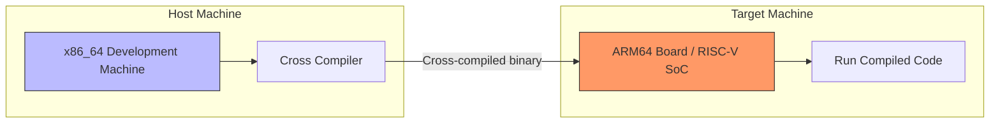
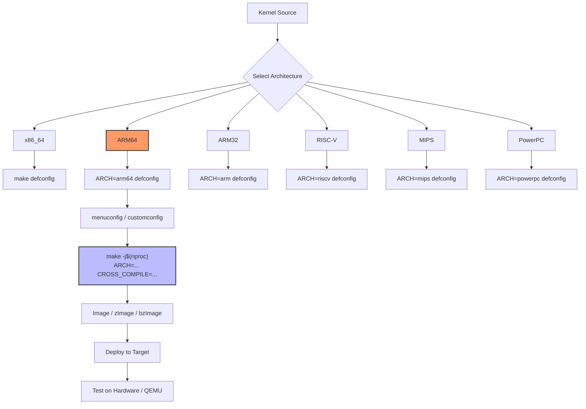

# Cross-Compilation

## Introduction

Cross-compilation is the process of building software on one architecture (the **host**) to run on a different architecture (the **target**). This is fundamental to embedded Linux development, kernel porting, and building images for ARM, RISC-V, MIPS, and other non-x86 platforms.

For kernel development, cross-compilation is essential because:
- Most embedded targets lack the resources to compile their own kernel
- Development machines are typically much faster than the target hardware
- CI/CD systems need to build for multiple architectures
- Kernel developers often work on x86 machines but test on ARM boards

## Cross-Compilation Concepts

### Host vs. Target



```
Terminology
───────────
Host:     The machine doing the compilation
Target:   The machine that will run the compiled code
Toolchain: The set of tools (compiler, linker, assembler) for the target
Triple:   The target identifier (e.g., aarch64-linux-gnu)
Sysroot:  Target libraries and headers for linking
```

### GNU Triple Convention

The GNU triple identifies the target system:

```
Format: ARCHITECTURE-VENDOR-OS-LIBC

Examples:
  x86_64-linux-gnu         — x86_64 Linux with glibc
  aarch64-linux-gnu        — ARM64 Linux with glibc
  arm-linux-gnueabihf      — ARM32 Linux with glibc, hard float
  arm-linux-gnueabi        — ARM32 Linux with glibc, soft float
  riscv64-linux-gnu        — RISC-V 64 Linux with glibc
  mips-linux-gnu           — MIPS32 Linux with glibc
  mipsel-linux-gnu         — MIPS32 little-endian
  powerpc64le-linux-gnu    — PowerPC 64-bit little-endian
  loongarch64-linux-gnu    — LoongArch 64-bit
```

## Toolchain Installation

### Prebuilt Toolchains

```bash
# Debian/Ubuntu — Multi-arch toolchains
$ sudo apt-get install gcc-aarch64-linux-gnu    # ARM64
$ sudo apt-get install gcc-arm-linux-gnueabihf  # ARM32 hard-float
$ sudo apt-get install gcc-riscv64-linux-gnu    # RISC-V 64
$ sudo apt-get install gcc-mips-linux-gnu       # MIPS
$ sudo apt-get install gcc-powerpc64le-linux-gnu # PowerPC 64 LE
$ sudo apt-get install gcc-mipsel-linux-gnu     # MIPS little-endian

# Fedora/RHEL
$ sudo dnf install gcc-aarch64-linux-gnu gcc-arm-linux-gnu-gnu
$ sudo dnf install gcc-riscv64-linux-gnu

# Arch Linux
$ sudo pacman -S aarch64-linux-gnu-gcc riscv64-linux-gnu-gcc

# Verify installation
$ aarch64-linux-gnu-gcc --version
aarch64-linux-gnu-gcc (Ubuntu 13.2.0-4ubuntu3) 13.2.0
```

### Linaro Toolchains

Linaro provides optimized prebuilt toolchains:

```bash
# Download Linaro toolchain (ARM/ARM64)
$ wget https://releases.linaro.org/components/toolchain/binaries/latest-7/aarch64-linux-gnu/gcc-linaro-7.5.0-2019.12-x86_64_aarch64-linux-gnu.tar.xz
$ tar xf gcc-linaro-7.5.0-2019.12-x86_64_aarch64-linux-gnu.tar.xz
$ export CROSS_COMPILE=$(pwd)/gcc-linaro-7.5.0-2019.12-x86_64_aarch64-linux-gnu/bin/aarch64-linux-gnu-

# Newer versions:
$ wget https://releases.linaro.org/components/toolchain/binaries/latest-13/aarch64-linux-gnu/gcc-linaro-13.2.0-2024.02-x86_64_aarch64-linux-gnu.tar.xz
```

### Building a Toolchain from Source with crosstool-ng

```bash
# Install crosstool-ng
$ git clone https://github.com/crosstool-ng/crosstool-ng
$ cd crosstool-ng
$ ./bootstrap && ./configure --prefix=$HOME/ct-ng && make && make install
$ export PATH=$HOME/ct-ng/bin:$PATH

# Create a configuration for ARM64
$ mkdir ~/arm64-toolchain && cd ~/arm64-toolchain
$ ct-ng aarch64-unknown-linux-gnu

# Customize (optional)
$ ct-ng menuconfig
# → Target options → Architecture level → ARMv8-A
# → C library → glibc (or musl)
# → Debug facilities → strace, gdb

# Build the toolchain (takes 30-60 minutes)
$ ct-ng build

# Result in ~/arm64-toolchain/x-tools/aarch64-unknown-linux-gnu/
$ ls ~/arm64-toolchain/x-tools/aarch64-unknown-linux-gnu/bin/
aarch64-unknown-linux-gnu-gcc
aarch64-unknown-linux-gnu-g++
aarch64-unknown-linux-gnu-ld
...
```

### musl Cross-Toolchains

For smaller, static-linked binaries (common in embedded):

```bash
# musl-based toolchains (Alpine Linux uses musl)
$ wget https://musl.cc/aarch64-linux-musl-cross.tgz
$ tar xf aarch64-linux-musl-cross.tgz
$ export PATH=$(pwd)/aarch64-linux-musl-cross/bin:$PATH

$ aarch64-linux-musl-gcc --version
aarch64-linux-musl-gcc (GCC 13.2.0) 13.2.0

# Static binary example
$ aarch64-linux-musl-gcc -static -o hello hello.c
$ file hello
hello: ELF 64-bit LSB executable, ARM aarch64, version 1 (SYSV),
       statically linked
```

## Cross-Compiling the Linux Kernel

### The Key Variables

The kernel build system uses two primary variables for cross-compilation:

```bash
# ARCH — Target architecture
# CROSS_COMPILE — Toolchain prefix
make ARCH=<target> CROSS_COMPILE=<prefix> <target>
```

### ARM64 (AArch64) Cross-Compilation

```bash
# Install toolchain
$ sudo apt-get install gcc-aarch64-linux-gnu

# Get kernel source
$ git clone --depth=1 --branch v6.12 \
    https://git.kernel.org/pub/scm/linux/kernel/git/torvalds/linux.git
$ cd linux

# Configure for ARM64
$ make ARCH=arm64 CROSS_COMPILE=aarch64-linux-gnu- defconfig

# Or use a specific defconfig
$ make ARCH=arm64 CROSS_COMPILE=aarch64-linux-gnu- \
    defconfig O=build/arm64

# Optionally customize
$ make ARCH=arm64 CROSS_COMPILE=aarch64-linux-gnu- menuconfig

# Build
$ make ARCH=arm64 CROSS_COMPILE=aarch64-linux-gnu- -j$(nproc)

# Output files
$ ls build/arm64/arch/arm64/boot/Image
arch/arm64/boot/Image

$ ls build/arm64/arch/arm64/boot/dts/arm64/*.dtb
# Device tree blobs for various boards
```

### ARM32 Cross-Compilation

```bash
# Install toolchain
$ sudo apt-get install gcc-arm-linux-gnueabihf

# Configure for ARM (multiplatform)
$ make ARCH=arm CROSS_COMPILE=arm-linux-gnueabihf- multi_v7_defconfig

# Build (requires dtbs for most boards)
$ make ARCH=arm CROSS_COMPILE=arm-linux-gnueabihf- -j$(nproc) zImage dtbs modules

# Output
$ ls arch/arm/boot/zImage
$ ls arch/arm/boot/dts/*.dtb
```

### RISC-V Cross-Compilation

```bash
# Install toolchain
$ sudo apt-get install gcc-riscv64-linux-gnu

# Configure
$ make ARCH=riscv CROSS_COMPILE=riscv64-linux-gnu- defconfig

# Build
$ make ARCH=riscv CROSS_COMPILE=riscv64-linux-gnu- -j$(nproc)

# Output
$ ls arch/riscv/boot/Image
```

### MIPS Cross-Compilation

```bash
# Install toolchain
$ sudo apt-get install gcc-mips-linux-gnu

# Configure for MIPS (big-endian)
$ make ARCH=mips CROSS_COMPILE=mips-linux-gnu- malta_defconfig

# Build
$ make ARCH=mips CROSS_COMPILE=mips-linux-gnu- -j$(nproc)

# For little-endian
$ sudo apt-get install gcc-mipsel-linux-gnu
$ make ARCH=mips CROSS_COMPILE=mipsel-linux-gnu- malta_defconfig
$ make ARCH=mips CROSS_COMPILE=mipsel-linux-gnu- -j$(nproc)
```

### PowerPC Cross-Compilation

```bash
# Install toolchain
$ sudo apt-get install gcc-powerpc64le-linux-gnu

# Configure for PowerPC 64-bit little-endian
$ make ARCH=powerpc CROSS_COMPILE=powerpc64le-linux-gnu- pseries_defconfig

# Build
$ make ARCH=powerpc CROSS_COMPILE=powerpc64le-linux-gnu- -j$(nproc)
```

### LoongArch Cross-Compilation

```bash
# Install toolchain (may need to build or download)
$ sudo apt-get install gcc-loongarch64-linux-gnu

# Configure
$ make ARCH=loongarch CROSS_COMPILE=loongarch64-linux-gnu- defconfig

# Build
$ make ARCH=loongarch CROSS_COMPILE=loongarch64-linux-gnu- -j$(nproc)
```

## Sysroot

### What is a Sysroot?

A **sysroot** contains the target system's headers and libraries, needed when cross-compiling userspace programs:

```
Sysroot Directory Structure
───────────────────────────
sysroot/
├── usr/
│   ├── include/         # Target headers
│   │   ├── linux/
│   │   ├── asm/
│   │   └── ...
│   └── lib/             # Target libraries
│       ├── libc.so
│       ├── libm.so
│       └── ...
└── lib/                 # Target libraries (alternative location)
    └── ...
```

### Using a Sysroot

```bash
# Create a sysroot from a target system
$ rsync -a --exclude={'/dev/*','/proc/*','/sys/*','/tmp/*'} \
    user@target:/ /path/to/sysroot/

# Or extract from a rootfs tarball
$ mkdir sysroot
$ tar xf rootfs.tar.gz -C sysroot/

# Use with cross-compiler
$ aarch64-linux-gnu-gcc --sysroot=/path/to/sysroot \
    -o hello hello.c

# For the kernel, sysroot is usually not needed
# (kernel builds its own headers and doesn't link against libc)
```

### Using QEMU for Target Execution

```bash
# Install QEMU for target emulation
$ sudo apt-get install qemu-user-static qemu-system-arm

# Run ARM64 binary on x86 host using QEMU user-mode
$ qemu-aarch64-static ./hello

# Or with binfmt_misc (transparent execution)
$ sudo apt-get install binfmt-support qemu-user-static
$ ./hello  # Automatically uses QEMU

# Full system emulation
$ qemu-system-aarch64 \
    -M virt \
    -cpu cortex-a57 \
    -m 1024 \
    -kernel arch/arm64/boot/Image \
    -append "console=ttyAMA0 root=/dev/vda" \
    -drive file=rootfs.ext4,if=virtio,format=raw \
    -nographic
```

## Cross-Compilation Workflow



## Common Architecture Defconfigs

```bash
# ARM64 defconfigs
$ make ARCH=arm64 CROSS_COMPILE=aarch64-linux-gnu- defconfig
$ make ARCH=arm64 CROSS_COMPILE=aarch64-linux-gnu- vendor_defconfig
# List available defconfigs:
$ ls arch/arm64/configs/

# ARM defconfigs
$ make ARCH=arm CROSS_COMPILE=arm-linux-gnueabihf- multi_v7_defconfig
$ make ARCH=arm CROSS_COMPILE=arm-linux-gnueabihf- omap2plus_defconfig
$ make ARCH=arm CROSS_COMPILE=arm-linux-gnueabihf- imx_v6_v7_defconfig
$ ls arch/arm/configs/

# RISC-V defconfigs
$ make ARCH=riscv CROSS_COMPILE=riscv64-linux-gnu- defconfig
$ make ARCH=riscv CROSS_COMPILE=riscv64-linux-gnu- nommu_virt_defconfig
$ ls arch/riscv/configs/

# MIPS defconfigs
$ make ARCH=mips CROSS_COMPILE=mips-linux-gnu- malta_defconfig
$ make ARCH=mips CROSS_COMPILE=mips-linux-gnu- bmips_bcm63xx_defconfig
$ ls arch/mips/configs/
```

## Clang Cross-Compilation

```bash
# Clang can cross-compile using the --target flag
# No separate cross-compiler needed

$ make ARCH=arm64 CC=clang CROSS_COMPILE=aarch64-linux-gnu- \
    LLVM=1 defconfig

$ make ARCH=arm64 CC=clang CROSS_COMPILE=aarch64-linux-gnu- \
    LLVM=1 -j$(nproc)

# Clang with integrated assembler
$ make ARCH=arm64 CC=clang CROSS_COMPILE=aarch64-linux-gnu- \
    LLVM=1 LLVM_IAS=1 -j$(nproc)
```

## Building Userspace with Cross-Toolchains

```bash
# Simple C program
$ cat > hello.c << 'EOF'
#include <stdio.h>
int main() {
    printf("Hello from cross-compiled binary!\n");
    return 0;
}
EOF

# Cross-compile
$ aarch64-linux-gnu-gcc -o hello hello.c

# Check the binary
$ file hello
hello: ELF 64-bit LSB executable, ARM aarch64, version 1 (SYSV),
       dynamically linked, interpreter /lib/ld-linux-aarch64.so.1,
       for GNU/Linux 3.7.0, not stripped

# Run with QEMU
$ qemu-aarch64-static -L /usr/aarch64-linux-gnu/ ./hello
Hello from cross-compiled binary!

# Static cross-compile (no sysroot needed)
$ aarch64-linux-gnu-gcc -static -o hello_static hello.c
$ qemu-aarch64-static ./hello_static
Hello from cross-compiled binary!
```

## Cross-Compiling with Buildroot

Buildroot is a popular embedded Linux build system:

```bash
# Get Buildroot
$ git clone https://git.buildroot.net/buildroot
$ cd buildroot

# Configure for a specific board
$ make qemu_aarch64_virt_defconfig

# Build everything (toolchain + kernel + rootfs)
$ make -j$(nproc)

# Output
$ ls output/images/
Image                    # Kernel image
rootfs.ext4              # Root filesystem
rootfs.cpio.gz           # Initramfs

# Run in QEMU
$ ./output/host/bin/qemu-system-aarch64 \
    -M virt \
    -cpu cortex-a53 \
    -m 512 \
    -kernel output/images/Image \
    -append "root=/dev/vda console=ttyAMA0" \
    -drive file=output/images/rootfs.ext4,if=virtio \
    -nographic
```

## Cross-Compiling Kernel Modules

```bash
# Out-of-tree module cross-compilation
$ make -C /path/to/kernel/build \
    ARCH=arm64 \
    CROSS_COMPILE=aarch64-linux-gnu- \
    M=$(pwd) \
    modules

# Makefile for cross-compilation
cat > Makefile << 'EOF'
ARCH ?= arm64
CROSS_COMPILE ?= aarch64-linux-gnu-
KDIR ?= /path/to/kernel/build

obj-m += mydriver.o

all:
	$(MAKE) ARCH=$(ARCH) CROSS_COMPILE=$(CROSS_COMPILE) \
	    -C $(KDIR) M=$(PWD) modules

clean:
	$(MAKE) ARCH=$(ARCH) CROSS_COMPILE=$(CROSS_COMPILE) \
	    -C $(KDIR) M=$(PWD) clean
EOF
```

## Troubleshooting

```bash
# Error: "aarch64-linux-gnu-gcc: not found"
$ which aarch64-linux-gnu-gcc
$ sudo apt-get install gcc-aarch64-linux-gnu

# Error: "asm/types.h: No such file or directory"
# You're probably building userspace without the kernel headers
$ sudo apt-get install linux-headers-arm64

# Error: "unrecognized option -mfloat-abi=hard"
# Wrong toolchain — need gnueabihf, not gnueabi
$ sudo apt-get install gcc-arm-linux-gnueabihf

# Error: "cannot find -lc" (static linking works, dynamic doesn't)
# Missing sysroot/libraries
$ sudo apt-get install libc6-dev-arm64-cross
```

## References and Further Reading

- Linux kernel cross-compilation: https://www.kernel.org/doc/html/latest/kbuild/
- Linaro toolchains: https://www.linaro.org/downloads/
- crosstool-ng: https://github.com/crosstool-ng/crosstool-ng
- musl cross-compilers: https://musl.cc/
- Buildroot: https://buildroot.org/
- Yocto Project: https://www.yoctoproject.org/
- QEMU documentation: https://www.qemu.org/docs/master/
- "Mastering Embedded Linux Programming" by Chris Simmonds
- "Embedded Linux Systems with the Yocto Project" by Rudolf Streif

## Related Topics

- [Building the Kernel](./kernel-build.md) — the general kernel build process
- [ARM Architecture](../arch/arm.md) — understanding the ARM target
- [RISC-V Architecture](../arch/riscv.md) — understanding the RISC-V target
- [MIPS Architecture](../arch/mips.md) — understanding the MIPS target
- [PowerPC Architecture](../arch/powerpc.md) — understanding the PowerPC target
- [Distribution Building](./distro-building.md) — building complete Linux distributions
