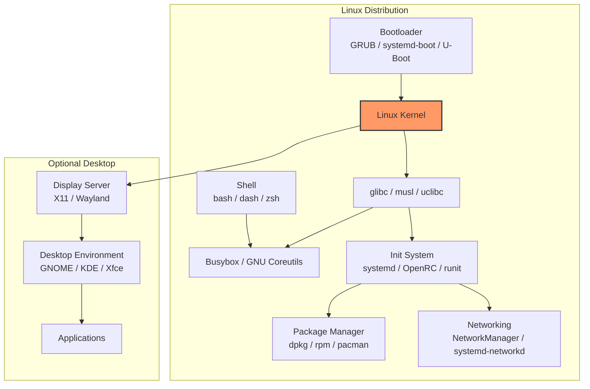
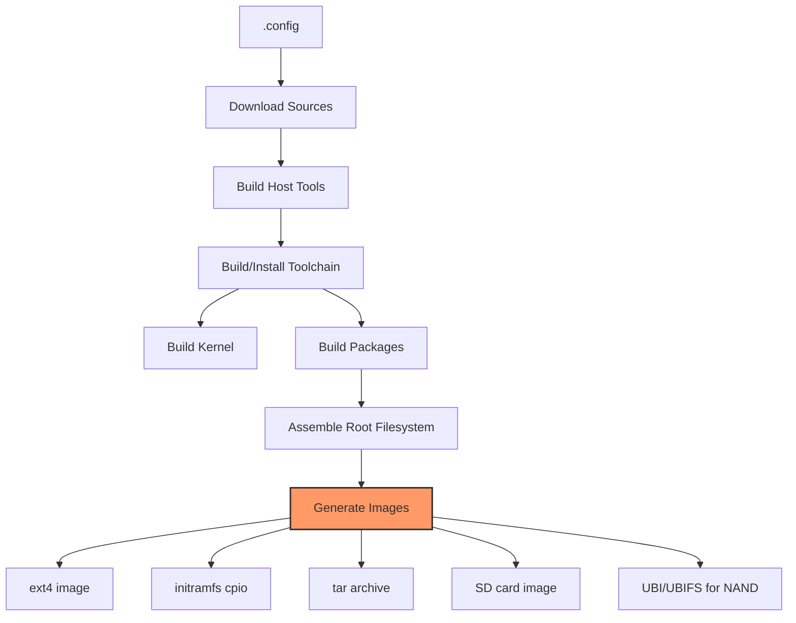

# Distribution Building

## Introduction

A Linux distribution is much more than a kernel—it's a complete operating system comprising the kernel, system libraries, userland utilities, package management, and an installation system. Building a distribution from scratch is one of the most educational and empowering things a Linux enthusiast can do.

This chapter covers the process of building a custom Linux distribution, from the initial bootstrap through package management to creating installable images. Whether you're building a minimal embedded system, a specialized server distro, or a desktop distribution, the fundamental concepts are the same.

## Distribution Components

### Anatomy of a Linux Distribution



### The Build Order

```bash
# A Linux distribution is built in this order:
# 1. Cross-compiler or bootstrap compiler
# 2. C library (glibc, musl)
# 3. Core utilities (coreutils, busybox)
# 4. Package manager
# 5. Kernel
# 6. Init system
# 7. System services
# 8. Additional packages
# 9. Bootloader configuration
# 10. Installer / image creation
```

## Building from Scratch with LFS

### Linux From Scratch (LFS)

**Linux From Scratch** is the canonical guide for building a distribution from source:

```bash
# LFS Build Overview
# Source: https://www.linuxfromscratch.org/

# Prerequisites: A host Linux system with required tools
$ sudo apt-get install build-essential bison gawk texinfo

# The LFS build process (simplified):
# 1. Create a directory layout
$ mkdir -p /mnt/lfs/{sources,tools,boot,etc,bin,lib,sbin,usr,var}

# 2. Build temporary tools (cross-compilation environment)
#    - Binutils (pass 1)
#    - GCC (pass 1)  
#    - Linux kernel headers
#    - glibc
#    - GCC (pass 2) — rebuild with new glibc
#    - Tcl, Expect, DejaGNU (for testing)
#    - Binutils (pass 2)
#    - GCC (pass 3)

# 3. Enter chroot environment
$ sudo chroot /mnt/lfs /tools/bin/env -i \
    HOME=/root TERM=$TERM PS1='\u:\w\$ ' \
    PATH=/bin:/usr/bin:/sbin:/usr/sbin \
    /tools/bin/bash --login

# 4. Build final system in chroot
#    - Install remaining core packages
#    - Configure system
#    - Build kernel
#    - Install bootloader
```

### The LFS Package List

```
Core LFS Packages (Version 12.2)
──────────────────────────────────
Stage 1 (Cross-tools):
  binutils-2.43        — Linker, assembler
  gcc-14.2.0           — Compiler
  linux-6.10.5 headers — Kernel headers
  glibc-2.40           — C library
  m4-1.4.19            — Macro processor
  ncurses-6.5          — Terminal library
  bash-5.2.32          — Shell
  coreutils-9.5        — Basic utilities
  diffutils-3.10       — File comparison
  file-5.45            — File type detection
  findutils-4.10.0     — File search
  gawk-5.3.0           — Text processing
  grep-3.11            — Text search
  gzip-1.13            — Compression
  make-4.4.1           — Build system
  patch-2.7.6          — Patching
  sed-4.9              — Stream editor
  tar-1.35             — Archive tool
  xz-5.6.2             — Compression
  binutils-2.43 pass2  — Rebuilt
  gcc-14.2.0 pass2     — Rebuilt

Stage 2 (In chroot):
  gettext-0.22.5       — Internationalization
  bison-3.8.2          — Parser generator
  perl-5.40.0          — Scripting language
  python-3.12.5        — Scripting language
  texinfo-7.1          — Documentation
  util-linux-2.40.2    — System utilities
  ... (60+ packages total)
```

## Building a Minimal System with BusyBox

### BusyBox: The Swiss Army Knife

BusyBox combines tiny versions of common UNIX utilities into a single small executable:

```bash
# Get BusyBox
$ wget https://busybox.net/downloads/busybox-1.36.1.tar.bz2
$ tar xf busybox-1.36.1.tar.bz2
$ cd busybox-1.36.1

# Configure for minimal build
$ make defconfig
$ make menuconfig
# → Settings → Build Options → Build static binary (no shared libs)
# → Settings → Build Options → Install prefix → ./_install

# Build
$ make -j$(nproc)
$ make install

# Result: a minimal root filesystem
$ ls _install/
bin  linuxrc  sbin  usr

$ ls _install/bin/
ash  cat  chmod  chown  cp  date  dd  df  dmesg  echo  ...
# ~400 applets in one binary!

$ file _install/bin/busybox
_install/bin/busybox: ELF 64-bit LSB executable, x86-64, version 1 (SYSV),
                      statically linked

$ ls -lh _install/bin/busybox
-rwxr-xr-x 1 user user 2.7M Jul 21 10:00 _install/bin/busybox
```

### Building a Minimal Root Filesystem

```bash
# Create a minimal rootfs with BusyBox
$ ROOTFS=/tmp/rootfs
$ mkdir -p $ROOTFS/{bin,sbin,etc,proc,sys,dev,tmp,usr/{bin,sbin},var,root}

# Install BusyBox
$ make -C busybox-1.36.1 CONFIG_PREFIX=$ROOTFS install

# Create essential configuration files
$ cat > $ROOTFS/etc/inittab << 'EOF'
::sysinit:/etc/init.d/rcS
::respawn:-/bin/sh
::ctrlaltdel:/sbin/reboot
::shutdown:/bin/umount -a -r
EOF

$ mkdir -p $ROOTFS/etc/init.d
$ cat > $ROOTFS/etc/init.d/rcS << 'EOF'
#!/bin/sh
mount -t proc proc /proc
mount -t sysfs sysfs /sys
mount -t devtmpfs devtmpfs /dev
echo "Welcome to MiniLinux!"
EOF
$ chmod +x $ROOTFS/etc/init.d/rcS

# Create a simple /etc/passwd
$ cat > $ROOTFS/etc/passwd << 'EOF'
root::0:0:root:/root:/bin/sh
EOF

# Create device nodes
$ sudo mknod $ROOTFS/dev/console c 5 1
$ sudo mknod $ROOTFS/dev/null c 1 3
```

### Creating a Bootable Image

```bash
# Create an initramfs
$ cd $ROOTFS
$ find . | cpio -o -H newc | gzip > /tmp/initramfs.cpio.gz

# Boot with QEMU
$ qemu-system-x86_64 \
    -kernel /path/to/bzImage \
    -initrd /tmp/initramfs.cpio.gz \
    -append "console=ttyS0" \
    -nographic

# Or create a disk image
$ dd if=/dev/zero of=rootfs.ext4 bs=1M count=512
$ mkfs.ext4 rootfs.ext4
$ sudo mount rootfs.ext4 /mnt
$ sudo cp -a $ROOTFS/* /mnt/
$ sudo umount /mnt

$ qemu-system-x86_64 \
    -kernel /path/to/bzImage \
    -append "root=/dev/sda console=ttyS0" \
    -drive file=rootfs.ext4,format=raw \
    -nographic
```

## Building with Buildroot

### Buildroot Overview

Buildroot is a complete embedded Linux build system:

```bash
# Get Buildroot
$ git clone https://git.buildroot.net/buildroot
$ cd buildroot

# List available configurations
$ ls configs/ | head -20
am335x_evm_defconfig
beaglebone_defconfig
qemu_aarch64_virt_defconfig
qemu_arm_vexpress_defconfig
qemu_x86_64_defconfig
raspberrypi4_defconfig
...

# Configure for QEMU x86_64
$ make qemu_x86_64_defconfig

# Customize (optional)
$ make menuconfig
# → Target options → Architecture → x86_64
# → Toolchain → C library → musl (or glibc)
# → System configuration → Root password
# → Filesystem images → ext4, cpio
# → Kernel → Linux kernel → Custom version
# → Target packages → Add/remove packages

# Build everything (30-120 minutes)
$ make -j$(nproc)

# Output
$ ls output/images/
bzImage            — Kernel image
rootfs.ext4        — Root filesystem
rootfs.cpio        — Initramfs
rootfs.tar         — Tarball
```

### Buildroot Architecture



### Adding Custom Packages to Buildroot

```bash
# Create a custom package
$ mkdir -p package/mypackage

# package/mypackage/mypackage.mk
cat > package/mypackage/mypackage.mk << 'EOF'
MYPACKAGE_VERSION = 1.0
MYPACKAGE_SITE = https://example.com/releases
MYPACKAGE_LICENSE = GPL-2.0
MYPACKAGE_LICENSE_FILES = COPYING

define MYPACKAGE_BUILD_CMDS
    $(MAKE) CC="$(TARGET_CC)" -C $(@D)
endef

define MYPACKAGE_INSTALL_TARGET_CMDS
    $(INSTALL) -D -m 0755 $(@D)/mypackage $(TARGET_DIR)/usr/bin/mypackage
endef

$(eval $(generic-package))
EOF

# package/mypackage/Config.in
cat > package/mypackage/Config.in << 'EOF'
config BR2_PACKAGE_MYPACKAGE
	bool "mypackage"
	help
	  My custom package for the distribution.
	  https://example.com/mypackage
EOF

# Add to Buildroot configuration
$ echo 'source "$BR2_EXTERNAL_MYPACKAGE_PATH/package/mypackage/Config.in"' \
    >> package/Config.in

# Enable in menuconfig
$ make menuconfig
# → Target packages → mypackage

# Build
$ make mypackage
$ make
```

## Distribution Package Repositories

### Repository Structure

```
Debian Repository Structure
────────────────────────────
pool/
├── main/
│   ├── a/
│   │   └── apache2/
│   │       ├── apache2_2.4.57-2_amd64.deb
│   │       └── apache2_2.4.57-2.dsc
│   ├── b/
│   │   └── bash/
│   └── ...
├── contrib/
└── non-free/

dists/
├── stable/
│   ├── main/
│   │   ├── binary-amd64/
│   │   │   └── Packages.gz
│   │   └── source/
│   │       └── Sources.gz
│   ├── contrib/
│   └── non-free/
└── testing/
```

### Creating a Simple Repository

```bash
# Create a local APT repository
$ mkdir -p /var/www/html/repo/{pool,dists/stable/main/binary-amd64}

# Copy packages
$ cp *.deb /var/www/html/repo/pool/

# Generate Packages file
$ cd /var/www/html/repo
$ dpkg-scanpackages pool /dev/null > dists/stable/main/binary-amd64/Packages
$ gzip -k dists/stable/main/binary-amd64/Packages

# Generate Release file
$ cat > dists/stable/Release << 'EOF'
Origin: My Distribution
Label: My Distribution
Suite: stable
Codename: stable
Architectures: amd64
Components: main
Description: My custom repository
EOF

# Sign with GPG (optional)
$ gpg --armor --detach-sign --output dists/stable/Release.gpg dists/stable/Release
$ gpg --armor --detach-sign --output dists/stable/InRelease dists/stable/Release

# Add to client systems
$ echo "deb http://myserver/repo stable main" | sudo tee /etc/apt/sources.list.d/myrepo.list
$ sudo apt-get update
```

## Creating Installer Images

### Debian Installer (d-i)

```bash
# Build a Debian installer image
$ sudo apt-get install debian-installer

# Get the installer source
$ git clone https://salsa.debian.org/installer-team/debian-installer
$ cd debian-installer

# Build for amd64
$ make build_netboot_gtk

# Output in dest/
$ ls dest/
mini.iso
netboot/
pxeboot/
```

### Simple Installer with debootstrap

```bash
# Create a Debian/Ubuntu rootfs
$ sudo debootstrap --arch=amd64 bookworm /mnt/target \
    http://deb.debian.org/debian

# Or Ubuntu
$ sudo debootstrap --arch=amd64 noble /mnt/target \
    http://archive.ubuntu.com/ubuntu

# Chroot into the new system
$ sudo chroot /mnt/target

# Inside chroot:
# 1. Install kernel
$ apt-get install linux-image-amd64

# 2. Install bootloader
$ apt-get install grub-pc

# 3. Configure fstab
$ echo "/dev/sda1 / ext4 defaults 0 1" > /etc/fstab

# 4. Install GRUB
$ grub-install /dev/sda
$ update-grub

# 5. Set root password
$ passwd root

# 6. Configure network
$ echo "myhost" > /etc/hostname
```

### Creating a Live Image

```bash
# Using live-build (Debian)
$ sudo apt-get install live-build

# Initialize a new live system config
$ mkdir live-image && cd live-image
$ lb config \
    --architectures amd64 \
    --distribution bookworm \
    --binary-images iso-hybrid \
    --debian-installer live \
    --debian-installer-gui true

# Customize packages
$ cat > config/package-lists/desktop.list.chroot << 'EOF'
task-gnome-desktop
firefox-esr
vim
git
openssh-client
EOF

# Build the live image
$ sudo lb build

# Output
$ ls live-image-amd64.hybrid.iso
live-image-amd64.hybrid.iso

# Test with QEMU
$ qemu-system-x86_64 -cdrom live-image-amd64.hybrid.iso -m 2048 -enable-kvm
```

## Building a Docker/Container-Based Distribution

```bash
# Create a minimal container rootfs
$ mkdir rootfs

# Using debootstrap for a Debian-based container
$ sudo debootstrap --variant=minbase bookworm rootfs \
    http://deb.debian.org/debian

# Clean up
$ sudo chroot rootfs apt-get clean
$ sudo rm -rf rootfs/var/lib/apt/lists/*

# Create a tarball
$ sudo tar -C rootfs -c . | gzip > rootfs.tar.gz

# Import as Docker image
$ docker import rootfs.tar.gz mylinux:latest
$ docker run -it mylinux:latest /bin/bash

# Or use multistage Docker build
cat > Dockerfile << 'EOF'
FROM debian:bookworm-slim AS rootfs
RUN apt-get update && apt-get install -y --no-install-recommends \
    bash coreutils util-linux procps \
    && rm -rf /var/lib/apt/lists/*

FROM scratch
COPY --from=rootfs / /
CMD ["/bin/bash"]
EOF
$ docker build -t mylinux:latest .
```

## Distribution Comparison

```
Major Distributions: Build Systems
──────────────────────────────────
Distribution    Build System    Package Format   Init System
──────────────  ─────────────   ──────────────   ───────────
Debian          dpkg-buildpackage .deb           systemd
Ubuntu          dpkg-buildpackage .deb           systemd
Fedora          rpmbuild          .rpm           systemd
RHEL/CentOS     rpmbuild          .rpm           systemd
openSUSE        osc (OBS)         .rpm           systemd
Arch            makepkg           .pkg.tar.zst   systemd
Gentoo          ebuild/portage    source-based   openrc/systemd
Alpine          abuild            .apk           openrc
Void            xbps-src          .xbps          runit
Buildroot       make              custom         busybox init
Yocto           bitbake           custom         systemd/custom
```

## References and Further Reading

- Linux From Scratch: https://www.linuxfromscratch.org/
- Buildroot: https://buildroot.org/
- Yocto Project: https://www.yoctoproject.org/
- Debian Live Manual: https://live-team.pages.debian.net/live-manual/
- Debian Installer: https://wiki.debian.org/DebianInstaller
- Alpine Linux build system: https://wiki.alpinelinux.org/wiki/Creating_an_Alpine_package
- Arch Linux Build System: https://wiki.archlinux.org/title/Makepkg
- Linux Standard Base: https://refspecs.linuxfoundation.org/lsb.shtml
- "Embedded Linux Systems with the Yocto Project" by Rudolf Streif
- "How to Build a Linux Distribution" — Linux Journal

## Related Topics

- [Building the Kernel](./kernel-build.md) — compiling the kernel component
- [Cross-Compilation](./cross-compilation.md) — building for different architectures
- [Package Building](./package-building.md) — creating individual packages
- [Unix Timeline](../history/unix-timeline.md) — distribution history
- [Key Kernel Subsystems](../history/subsystems.md) — what's inside the kernel
