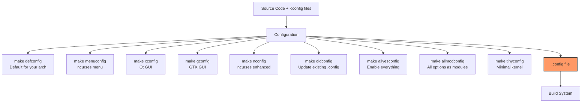
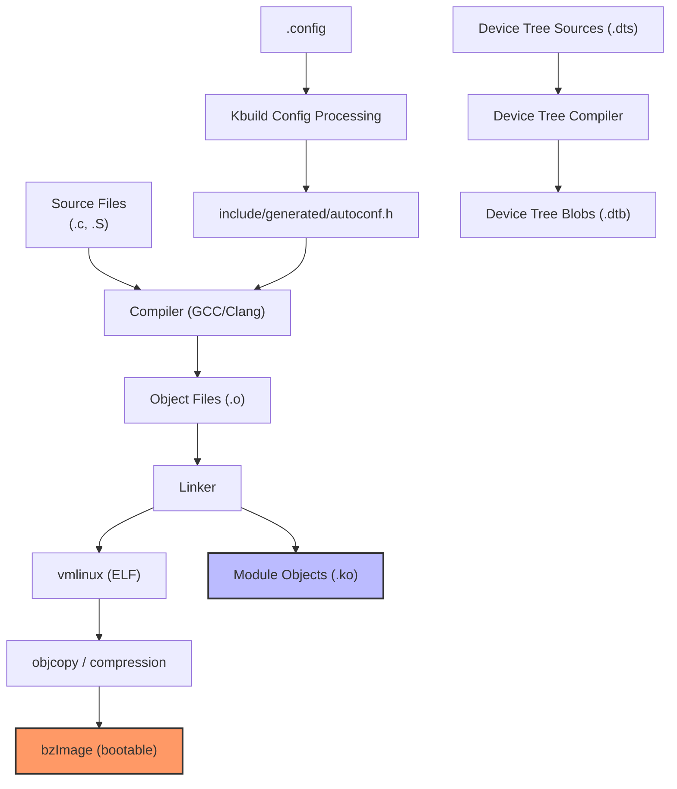
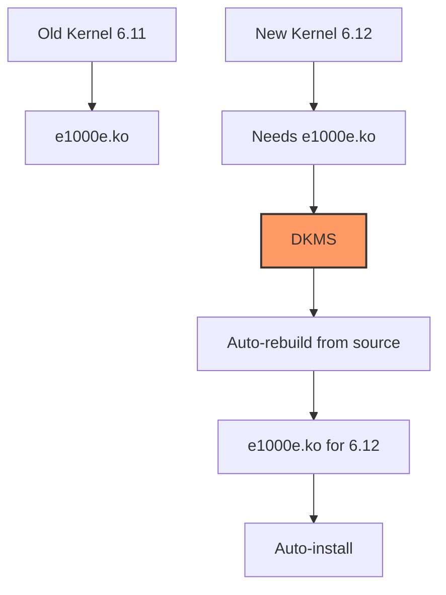

# Building the Linux Kernel

## Introduction

Building the Linux kernel from source is one of the most fundamental skills for a Linux systems developer. Whether you're a kernel developer testing a patch, a system administrator applying a custom configuration, or an embedded systems engineer creating a specialized image, understanding the kernel build process is essential.

The kernel build system (**Kbuild**) is a sophisticated framework built on GNU Make that supports hundreds of architectures, thousands of configuration options, and multiple output formats. This chapter covers the complete process from obtaining source code to booting your custom kernel.

## Prerequisites

### Required Tools

```bash
# Debian/Ubuntu
$ sudo apt-get install build-essential bc bison flex libelf-dev \
    libssl-dev libncurses-dev dwarves

# Fedora/RHEL
$ sudo dnf install gcc make bc bison flex elfutils-libelf-devel \
    openssl-devel ncurses-devel dwarves

# Arch Linux
$ sudo pacman -S base-devel bc libelf openssl ncurses

# Minimum versions required:
# GCC: 5.1+ (for kernel 6.x)
# Clang: 11.0+ (for Clang/LLVM builds)
# Make: 3.82+
# Binutils: 2.25+
# Bison: 2.0+
# Flex: 2.5.35+
```

### Getting the Source

```bash
# Option 1: Tarball from kernel.org
$ wget https://cdn.kernel.org/pub/linux/kernel/v6.x/linux-6.12.tar.xz
$ tar xf linux-6.12.tar.xz
$ cd linux-6.12

# Option 2: Git clone (full history, ~4GB)
$ git clone https://git.kernel.org/pub/scm/linux/kernel/git/torvalds/linux.git
$ cd linux

# Option 3: Git clone (shallow, faster)
$ git clone --depth=1 https://git.kernel.org/pub/scm/linux/kernel/git/torvalds/linux.git

# Option 4: Specific version
$ git clone --branch v6.12 --depth=1 \
    https://git.kernel.org/pub/scm/linux/kernel/git/torvalds/linux.git

# Verify the source
$ head -5 Makefile
VERSION = 6
PATCHLEVEL = 12
SUBLEVEL = 0
EXTRAVERSION =
NAME = Hurr durr I'ma ninja sloth
```

## Configuration

### Understanding Kconfig

The kernel uses **Kconfig** for configuration management. Each `Kconfig` file defines configuration options:

```kconfig
# Example: drivers/net/Kconfig
config NET_VENDOR_INTEL
	bool "Intel devices"
	depends on PCI
	default y
	---help---
	  If you have a network (Ethernet) card belonging to this class,
	  say Y.

config E1000E
	tristate "Intel(R) PRO/1000 PCI-Express Gigabit Ethernet support"
	depends on PCI && NET_VENDOR_INTEL
	select PHYLIB
	---help---
	  This driver supports the PCI-Express Intel PRO/1000 gigabit
	  Ethernet family of adapters.
	  
	  To compile this driver as a module, choose M here: the module
	  will be called e1000e.
```

Configuration option types:

```
Kconfig Types
─────────────
bool     — yes/no (compiled in or not)
tristate — yes/module/no (built-in, module, or excluded)
int      — Integer value
hex      — Hexadecimal value
string   — String value
```

### Configuration Methods



### make menuconfig

The most popular configuration method:

```bash
$ make menuconfig
```

```
┌────────────────── Linux Kernel Configuration ──────────────────┐
│  Arrow keys navigate the menu.  <Enter> selects submenus      │
│  (or empty submenus ----).  Highlighted letters are hotkeys.   │
│  Pressing <Y> selects, <N> excludes, <M> modularizes features.│
│  Press <Esc><Esc> to exit, <?> for Help, </> for Search.      │
│                                                                │
│  Linux Kernel Configuration                                    │
│  ─────────────────────────────                                 │
│  │ General setup  --->                                         │
│  │ [*] 64-bit kernel                                           │
│  │ Preemption Model (Voluntary Kernel Preemption (Server)) --->│
│  │ Processor type and features  --->                            │
│  │ Power management and ACPI options  --->                     │
│  │ Bus options (PCI etc.)  --->                                │
│  │ Binary Emulations  --->                                     │
│  │ Firmware Drivers  --->                                      │
│  │ [*] Enable loadable module support  --->                    │
│  │ [*] Enable the block layer  --->                            │
│  │ Executable file formats  --->                               │
│  │ Memory Management options  --->                             │
│  │ Networking support  --->                                    │
│  │ Device Drivers  --->                                        │
│  │ File systems  --->                                          │
│  │ Security options  --->                                      │
│  │ Cryptographic API  --->                                     │
│  │ Library routines  --->                                      │
│  │ Kernel hacking  --->                                        │
│  │ ─────────────────────────────────────────────────────────── │
│  │        <Select>    < Exit >    < Help >                     │
└────────────────────────────────────────────────────────────────┘
```

### Starting from an Existing Config

```bash
# Use your distro's running kernel config as a starting point
$ cp /boot/config-$(uname -r) .config

# Update it for the new kernel version (answer questions about new options)
$ make oldconfig

# Or non-interactive version (accepts defaults for new options)
$ make olddefconfig

# Show the current configuration
$ make kernelrelease
6.12.0-custom
```

### Custom Configuration Example

```bash
# Enable a specific driver as a module
$ scripts/config --module CONFIG_E1000E

# Disable a feature
$ scripts/config --disable CONFIG_DEBUG_INFO

# Set a string value
$ scripts/config --set-str CONFIG_DEFAULT_HOSTNAME "myhost"

# Enable realtime preemption
$ scripts/config --enable CONFIG_PREEMPT_RT

# Verify the changes
$ grep CONFIG_E1000E .config
CONFIG_E1000E=m
```

## Building the Kernel

### The Build Command

```bash
# Basic build (single job)
$ make

# Parallel build — use number of CPU cores
$ make -j$(nproc)

# Explicit parallel build
$ make -j8

# Build with verbose output (show actual commands)
$ make V=1

# Build with even more verbose output
$ make V=2

# Build only specific targets
$ make bzImage          # Kernel image only
$ make modules          # Modules only
$ make dtbs             # Device tree blobs (ARM)
```

### Build Targets

```bash
# Architecture-specific kernel images
$ make bzImage          # x86 compressed kernel (vmlinuz)
$ make vmlinux          # Uncompressed kernel ELF
$ make zImage           # x86 compressed (older, smaller)
$ make Image            # ARM64 uncompressed
$ make zImage           # ARM compressed
$ make vmlinuz.efi      # EFI-bootable kernel

# Module targets
$ make modules          # Build all modules
$ make modules_install  # Install modules to /lib/modules/

# Other targets
$ make dtbs             # Device tree blobs
$ make headers_install  # Install kernel headers
$ make rpm-pkg          # Build RPM package
$ make deb-pkg          # Build Debian package
$ make bindeb-pkg       # Build binary Debian package
$ make tar-pkg          # Build tarball
$ make perf             # Build perf tool
$ make tools/testing/selftests  # Build kernel self-tests
```

### Understanding the Build Process



### Build Output

```bash
# After a successful build, you'll find:
$ ls arch/x86/boot/bzImage
arch/x86/boot/bzImage

$ ls vmlinux
vmlinux

$ file vmlinux
vmlinux: ELF 64-bit LSB executable, x86-64, version 1 (SYSV),
         statically linked, BuildID[sha1]=..., not stripped

$ file arch/x86/boot/bzImage
arch/x86/boot/bzImage: Linux kernel x86 boot executable bzImage,
                        version 6.12.0-custom, ...
```

### Build Time Estimates

```
Build Time Estimates (parallel: -j$(nproc))
───────────────────────────────────────────
Full kernel build:
  Fast desktop (16 cores, NVMe):  ~5-10 minutes
  Laptop (4 cores, SSD):          ~15-30 minutes
  Server (64 cores, NVMe):        ~2-5 minutes
  Raspberry Pi 4:                 ~60-90 minutes
  Raspberry Pi 3:                 ~3-4 hours

Incremental rebuild (changing one file):
  Any machine:                    ~5-30 seconds

Module-only rebuild:
  Any machine:                    ~1-5 minutes
```

## Installing the Kernel

### Step-by-Step Installation

```bash
# 1. Install modules (requires root)
$ sudo make modules_install
# Installs to /lib/modules/6.12.0-custom/

# 2. Install the kernel
$ sudo make install
# This typically:
#   - Copies vmlinuz to /boot/vmlinuz-6.12.0-custom
#   - Copies System.map to /boot/System.map-6.12.0-custom
#   - Generates initramfs (on some distros)
#   - Updates bootloader configuration

# 3. Verify installation
$ ls /boot/
config-6.12.0-custom
initrd.img-6.12.0-custom
System.map-6.12.0-custom
vmlinuz-6.12.0-custom

# 4. Check module installation
$ ls /lib/modules/6.12.0-custom/
build   modules.builtin      modules.order
kernel  modules.builtin.modinfo  source
```

### Bootloader Configuration

```bash
# GRUB2 (most common)
$ sudo update-grub         # Debian/Ubuntu
$ sudo grub2-mkconfig -o /boot/grub2/grub.cfg  # Fedora/RHEL

# Verify GRUB entry
$ grep menuentry /boot/grub/grub.cfg | head -5

# Set default kernel (optional)
$ sudo grub-set-default 0   # First entry

# Direct EFI boot (without GRUB)
$ sudo cp arch/x86/boot/bzImage /boot/efi/EFI/linux/vmlinuz-6.12.0-custom
$ sudo efibootmgr --create --disk /dev/sda --part 1 \
    --loader '\EFI\linux\vmlinuz-6.12.0-custom' \
    --label 'Linux 6.12.0-custom'
```

### Reboot and Verify

```bash
# Reboot into the new kernel
$ sudo reboot

# After reboot, verify
$ uname -r
6.12.0-custom

$ uname -a
Linux myhost 6.12.0-custom #1 SMP PREEMPT_DYNAMIC Mon Jul 21 10:00:00 CST 2025 x86_64 GNU/Linux

# Check kernel log
$ dmesg | head -20
[    0.000000] Linux version 6.12.0-custom (user@host) (gcc (Ubuntu 13.2.0-1ubuntu1) 13.2.0, GNU ld (GNU Binutils for Ubuntu) 2.42) #1 SMP PREEMPT_DYNAMIC Mon Jul 21 10:00:00 CST 2025
[    0.000000] Command line: BOOT_IMAGE=/boot/vmlinuz-6.12.0-custom root=UUID=...
```

## Kernel Modules

### Building External Modules

```bash
# Build a single out-of-tree module
$ make -C /lib/modules/$(uname -r)/build M=$(pwd) modules

# Example module (hello.c):
cat > hello.c << 'EOF'
#include <linux/init.h>
#include <linux/module.h>
#include <linux/kernel.h>

MODULE_LICENSE("GPL");
MODULE_AUTHOR("Example");
MODULE_DESCRIPTION("Hello World module");

static int __init hello_init(void)
{
    pr_info("Hello, World!\n");
    return 0;
}

static void __exit hello_exit(void)
{
    pr_info("Goodbye, World!\n");
}

module_init(hello_init);
module_exit(hello_exit);
EOF

# Makefile for out-of-tree module:
cat > Makefile << 'EOF'
obj-m += hello.o

all:
	make -C /lib/modules/$(shell uname -r)/build M=$(PWD) modules

clean:
	make -C /lib/modules/$(shell uname -r)/build M=$(PWD) clean
EOF

# Build and test
$ make
$ sudo insmod hello.ko
$ dmesg | tail -1
[ 1234.567890] Hello, World!
$ sudo rmmod hello
$ dmesg | tail -1
[ 1234.678901] Goodbye, World!
```

### Module Utilities

```bash
# List loaded modules
$ lsmod
Module                  Size  Used by
e1000e                303104  0
i2c_i801               32768  0

# Module information
$ modinfo e1000e
filename:       /lib/modules/6.12.0-custom/kernel/drivers/net/ethernet/intel/e1000e/e1000e.ko
version:        6.12.0
license:        GPL v2
description:    Intel(R) PRO/1000 Network Driver
author:         Intel Corporation
...

# Load a module with parameters
$ sudo modprobe e1000e

# Blacklist a module
$ echo "blacklist nouveau" | sudo tee /etc/modprobe.d/blacklist-nouveau.conf

# Show module dependencies
$ modprobe --show-depends e1000e
insmod /lib/modules/.../kernel/drivers/net/phy/libphy.ko
insmod /lib/modules/.../kernel/drivers/net/ethernet/intel/e1000e/e1000e.ko
```

## DKMS — Dynamic Kernel Module Support

### What is DKMS?

DKMS automatically rebuilds kernel modules when you install a new kernel:



### Installing DKMS

```bash
# Install DKMS
$ sudo apt-get install dkms    # Debian/Ubuntu
$ sudo dnf install dkms        # Fedora/RHEL
$ sudo pacman -S dkms          # Arch Linux
```

### Creating a DKMS Module

```bash
# Directory structure for a DKMS module
$ tree /usr/src/hello-1.0/
/usr/src/hello-1.0/
├── Makefile
├── hello.c
└── dkms.conf

# dkms.conf content:
cat > /usr/src/hello-1.0/dkms.conf << 'EOF'
PACKAGE_NAME="hello"
PACKAGE_VERSION="1.0"
BUILT_MODULE_NAME[0]="hello"
DEST_MODULE_LOCATION[0]="/kernel/drivers/misc/"
AUTOINSTALL="yes"
MAKE[0]="make -C /lib/modules/${kernelver}/build M=${dkms_tree}/${PACKAGE_NAME}/${PACKAGE_VERSION}/build modules"
CLEAN="make -C /lib/modules/${kernelver}/build M=${dkms_tree}/${PACKAGE_NAME}/${PACKAGE_VERSION}/build clean"
EOF

# Add module to DKMS
$ sudo dkms add -m hello -v 1.0

# Build for current kernel
$ sudo dkms build -m hello -v 1.0

# Install for current kernel
$ sudo dkms install -m hello -v 1.0

# Check status
$ dkms status
hello/1.0, 6.12.0-custom, x86_64: installed

# Remove
$ sudo dkms remove -m hello -v 1.0 --all
```

### DKMS with NVIDIA Drivers (Real-World Example)

```bash
# Install NVIDIA driver with DKMS
$ sudo apt-get install nvidia-driver-535

# Check DKMS status
$ dkms status
nvidia/535.183.01, 6.12.0-custom, x86_64: installed
nvidia/535.183.01, 6.11.0-generic, x86_64: installed

# When a new kernel is installed, DKMS automatically rebuilds
$ sudo apt-get install linux-image-6.12.0-custom
# DKMS will trigger: build nvidia module for 6.12.0-custom
```

## Faster Builds with ccache

```bash
# Install ccache
$ sudo apt-get install ccache

# Use ccache for kernel builds
$ make CC="ccache gcc" -j$(nproc)

# Or set it globally
$ export CC="ccache gcc"
$ make -j$(nproc)

# ccache statistics
$ ccache -s
cache hit (direct)              1234
cache hit (preprocessed)         567
cache miss                       890
...
```

## Build Tips and Tricks

### Cleaning the Build

```bash
# Clean most generated files (keeps .config)
$ make clean

# Clean everything (including .config)
$ make mrproper

# Like mrproper, but also removes backup files
$ make distclean

# Clean only specific directory
$ make M=drivers/net/ethernet/intel/e1000e clean
```

### Building Specific Files

```bash
# Build a specific module
$ make drivers/net/ethernet/intel/e1000e/e1000e.ko

# Build a specific directory
$ make drivers/net/

# Build with specific debug options
$ make CONFIG_DEBUG_INFO=y -j$(nproc)
```

### Using Clang Instead of GCC

```bash
# Build with LLVM/Clang
$ make LLVM=1 -j$(nproc)

# Or specify clang directly
$ make CC=clang -j$(nproc)

# With additional clang options
$ make LLVM=1 KCFLAGS="-Werror" -j$(nproc)
```

### Cross-Compilation

See [Cross-Compilation](./cross-compilation.md) for building kernels for other architectures.

## Troubleshooting

### Common Build Errors

```bash
# Error: "openssl/bio.h: No such file or directory"
$ sudo apt-get install libssl-dev

# Error: "bc: not found"
$ sudo apt-get install bc

# Error: "BTF: .tmp_vmlinux.btf: pahole is too old"
$ sudo apt-get install dwarves
# Or: $ make CONFIG_DEBUG_INFO_BTF=n

# Error: "scripts/Makefile.build:44: .../Kbuild: No such file"
$ make clean && make mrproper && make defconfig
```

### Verifying the Build

```bash
# Check for build warnings
$ make -j$(nproc) 2>&1 | grep -i warning | head -20

# Verify kernel integrity
$ scripts/verify-sig vmlinux

# Check kernel configuration
$ scripts/diffconfig .config.old .config

# Verify module signatures
$ modinfo --field=signer e1000e
```

## References and Further Reading

- [The Linux Kernel Documentation](https://docs.kernel.org/)
- [LWN.net - Linux and free software news](https://lwn.net/)
- [GNU Project Documentation](https://www.gnu.org/doc/doc.html)
- [GNU Manuals](https://www.gnu.org/manual/manual.html)
- [Free Software Directory](https://directory.fsf.org/wiki/Main_Page)
- [Planet GNU](https://planet.gnu.org/)
- [Free Software Books](https://www.gnu.org/doc/other-free-books.html)

- Linux Kernel Build System documentation: https://www.kernel.org/doc/html/latest/kbuild/
- "The Linux Kernel Module Programming Guide": https://tldp.org/LDP/lkmpg/2.6/html/
- kernel.org: https://www.kernel.org/
- Kbuild documentation: https://www.kernel.org/doc/html/latest/kbuild/kconfig.html
- DKMS documentation: https://github.com/dell/dkms
- ccache: https://ccache.dev/
- "Linux Kernel in a Nutshell" by Greg Kroah-Hartman: http://www.kroah.com/lkn/
- The Linux Kernel documentation: https://www.kernel.org/doc/html/latest/

## Related Topics

- [Cross-Compilation](./cross-compilation.md) — building for other architectures
- [Building Packages](./package-building.md) — creating distributable packages
- [CI/CD for the Kernel](./ci-cd.md) — automated building and testing
- [Notable Kernel Versions](../history/notable-versions.md) — what features each version brings
- [Linux Kernel Development Model](../history/development-model.md) — how patches get into the kernel
