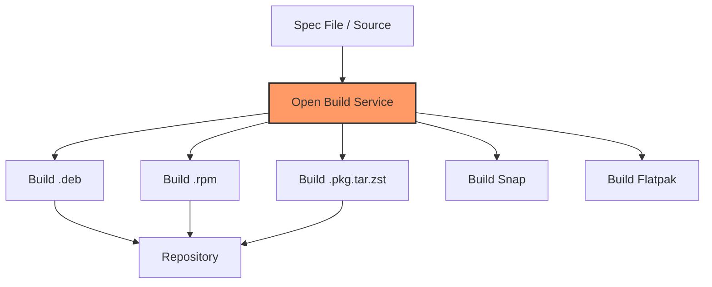

# Building Packages

## Introduction

Package management is the backbone of Linux distribution maintenance. Whether you're contributing to a distribution, maintaining software for multiple systems, or deploying applications at scale, understanding how to build packages is essential.

This chapter covers the major packaging systems: **RPM** (Red Hat, Fedora, SUSE), **DEB** (Debian, Ubuntu), **Pacman** (Arch Linux), and source-based systems. Each has its own conventions, but the fundamental concepts are similar: take source code, apply patches, compile, install into a staging area, and create a distributable archive with metadata.

## RPM Package Building

### The RPM Build Environment

```bash
# Install rpm-build tools
$ sudo dnf install rpm-build rpmdevtools

# Set up the build directory structure
$ rpmdev-setuptree

$ tree ~/rpmbuild/
~/rpmbuild/
├── BUILD/      — Working directory during build
├── RPMS/       — Output RPMs
├── SOURCES/    — Source tarballs and patches
├── SPECS/      — Spec files
└── SRPMS/      — Source RPMs
```

### The Spec File

The **spec file** is the recipe for building an RPM:

```bash
# Example spec file: hello.spec
cat > ~/rpmbuild/SPECS/hello.spec << 'EOF'
Name:           hello
Version:        2.12
Release:        1%{?dist}
Summary:        Hello, GNU hello

License:        GPLv3+
URL:            https://www.gnu.org/software/hello/
Source0:        https://ftp.gnu.org/gnu/hello/hello-%{version}.tar.gz

BuildRequires:  gcc
BuildRequires:  make

%description
The GNU Hello program produces a familiar, friendly greeting.
It serves as an example of GNU coding standards.

%prep
%autosetup

%build
%configure
%make_build

%install
%make_install

%files
%license COPYING
%doc README NEWS
%{_bindir}/hello
%{_mandir}/man1/hello.1*
%{_infodir}/hello.info*

%changelog
* Mon Jul 21 2025 Your Name <you@example.com> - 2.12-1
- Initial package
EOF
```

### Building the RPM

```bash
# Download source
$ wget -P ~/rpmbuild/SOURCES/ \
    https://ftp.gnu.org/gnu/hello/hello-2.12.tar.gz

# Build the RPM
$ rpmbuild -ba ~/rpmbuild/SPECS/hello.spec

# Output
$ ls ~/rpmbuild/RPMS/x86_64/
hello-2.12-1.fc40.x86_64.rpm
hello-debuginfo-2.12-1.fc40.x86_64.rpm
hello-debugsource-2.12-1.fc40.x86_64.rpm

$ ls ~/rpmbuild/SRPMS/
hello-2.12-1.fc40.src.rpm

# Install and test
$ sudo dnf install ~/rpmbuild/RPMS/x86_64/hello-2.12-1.fc40.x86_64.rpm
$ hello
Hello, world!
```

### Spec File Macros

```bash
# Common RPM macros
%{_prefix}        — /usr
%{_bindir}        — /usr/bin
%{_libdir}        — /usr/lib64 (64-bit) or /usr/lib
%{_includedir}    — /usr/include
%{_mandir}        — /usr/share/man
%{_sysconfdir}    — /etc
%{_datadir}       — /usr/share
%{_localstatedir} — /var

# Build system macros
%autosetup        — Unpack and apply patches
%configure        — Run ./configure with standard flags
%make_build       — Parallel make
%make_install     — make install with DESTDIR

# Conditional macros
%{?dist}          — Distribution tag (e.g., .fc40)
%{?rhel}          — RHEL version number
%{?fedora}        — Fedora version number
```

### Kernel Module RPM Example

```bash
# Spec file for a kernel module
cat > ~/rpmbuild/SPECS/kmod-mydriver.spec << 'EOF'
%define kmod_name mydriver

Name:           kmod-%{kmod_name}
Version:        1.0.0
Release:        1%{?dist}
Summary:        My custom kernel module
License:        GPLv2
URL:            https://example.com/mydriver
Source0:        %{kmod_name}-%{version}.tar.gz

BuildRequires:  gcc
BuildRequires:  kernel-devel
BuildRequires:  elfutils-libelf-devel

Requires:       kmod

%description
A custom kernel module for special hardware.

%prep
%autosetup -n %{kmod_name}-%{version}

%build
make KVER=%{kernel_version} KDIR=/usr/src/kernels/%{kernel_version}

%install
make KVER=%{kernel_version} DESTDIR=%{buildroot} install

%files
/lib/modules/%{kernel_version}/extra/%{kmod_name}/%{kmod_name}.ko

%changelog
* Mon Jul 21 2025 Your Name <you@example.com> - 1.0.0-1
- Initial package
EOF
```

## DEB Package Building

### The DEB Build Environment

```bash
# Install build tools
$ sudo apt-get install build-essential devscripts debhelper dh-make

# Create a directory for the package
$ mkdir hello-2.12 && cd hello-2.12

# Download source
$ wget https://ftp.gnu.org/gnu/hello/hello-2.12.tar.gz
$ tar xf hello-2.12.tar.gz

# Initialize Debian packaging
$ cd hello-2.12
$ dh_make --createorig -s -y
```

### The debian/ Directory

```
debian/
├── changelog       — Version history
├── compat          — Debhelper compatibility level
├── control         — Package metadata
├── copyright       — Copyright information
├── rules           — Build rules (Makefile)
├── source/
│   ├── format      — Source format (3.0 quilt)
│   └── patches/    — Patches
└── patches/        — Quilt patches
```

### The control File

```
Source: hello
Section: utils
Priority: optional
Maintainer: Your Name <you@example.com>
Build-Depends: debhelper-compat (= 13), automake, autoconf
Standards-Version: 4.6.2
Homepage: https://www.gnu.org/software/hello/

Package: hello
Architecture: any
Depends: ${shlibs:Depends}, ${misc:Depends}
Description: GNU Hello
 GNU Hello is an example package that serves as a model for
 building Debian packages. It prints a greeting message.
```

### The rules File

```makefile
#!/usr/bin/make -f

%:
	dh $@

override_dh_auto_configure:
	dh_auto_configure -- --prefix=/usr

override_dh_auto_install:
	dh_auto_install -- DESTDIR=$(CURDIR)/debian/hello
```

### Building the DEB

```bash
# Build the package
$ dpkg-buildpackage -us -uc -b

# Output (in parent directory)
$ ls ../*.deb
../hello_2.12-1_amd64.deb
../hello-dbgsym_2.12-1_amd64.deb

# Install and test
$ sudo dpkg -i ../hello_2.12-1_amd64.deb
$ hello
Hello, world!

# Check package info
$ dpkg -I ../hello_2.12-1_amd64.deb
 new Debian package, version 2.0.
 size 28456 bytes: control= 856 bytes.
     771 bytes,    14 lines      control
 Package: hello
 Version: 2.12-1
 Architecture: amd64
 Maintainer: Your Name <you@example.com>
 Installed-Size: 128
 Section: utils
 Priority: optional
 Description: GNU Hello

# List package contents
$ dpkg -c ../hello_2.12-1_amd64.deb
drwxr-xr-x root/root         0 2025-07-21 10:00 ./usr/
drwxr-xr-x root/root         0 2025-07-21 10:00 ./usr/bin/
-rwxr-xr-x root/root     23456 2025-07-21 10:00 ./usr/bin/hello
```

### Using sbuild for Clean Builds

```bash
# Install sbuild
$ sudo apt-get install sbuild

# Create a build chroot
$ sudo sbuild-createchroot --include=apt bookworm \
    /srv/chroot/bookworm-am64-sbuild \
    http://deb.debian.org/debian

# Build in a clean environment
$ sbuild -d bookworm ../hello_2.12-1.dsc
```

## Pacman Package Building (Arch Linux)

### The PKGBUILD

Arch Linux uses **PKGBUILD** files:

```bash
# PKGBUILD for hello
cat > PKGBUILD << 'EOF'
# Maintainer: Your Name <you@example.com>
pkgname=hello
pkgver=2.12
pkgrel=1
pkgdesc="GNU Hello"
arch=('x86_64')
url="https://www.gnu.org/software/hello/"
license=('GPL3')
depends=('glibc')
source=("https://ftp.gnu.org/gnu/hello/hello-${pkgver}.tar.gz")
sha256sums=('SKIP')

build() {
  cd "hello-${pkgver}"
  ./configure --prefix=/usr
  make
}

package() {
  cd "hello-${pkgver}"
  make DESTDIR="${pkgdir}" install
}
EOF

# Build the package
$ makepkg -si

# Output
$ ls *.pkg.tar.zst
hello-2.12-1-x86_64.pkg.tar.zst

# Install
$ sudo pacman -U hello-2.12-1-x86_64.pkg.tar.zst
```

### Kernel Module PKGBUILD

```bash
# PKGBUILD for an out-of-tree kernel module
cat > PKGBUILD << 'EOF'
# Maintainer: Your Name <you@example.com>
pkgname=mydriver-dkms
pkgver=1.0.0
pkgrel=1
pkgdesc="My custom kernel module (DKMS)"
arch=('x86_64')
url="https://example.com/mydriver"
license=('GPL2')
depends=('dkms')
source=("mydriver-${pkgver}.tar.gz"
        "dkms.conf")
sha256sums=('SKIP' 'SKIP')

package() {
  # Install source for DKMS
  install -Dm644 "mydriver-${pkgver}/mydriver.c" \
    "${pkgdir}/usr/src/${pkgname}-${pkgver}/mydriver.c"
  install -Dm644 "mydriver-${pkgver}/Makefile" \
    "${pkgdir}/usr/src/${pkgname}-${pkgver}/Makefile"
  install -Dm644 dkms.conf \
    "${pkgdir}/usr/src/${pkgname}-${pkgver}/dkms.conf"
}
EOF
```

## Spec File Anatomy (Detailed)

### Advanced RPM Spec

```bash
cat > advanced-hello.spec << 'EOF'
Name:           hello
Version:        2.12
Release:        2%{?dist}
Summary:        Hello, GNU hello

License:        GPLv3+
URL:            https://www.gnu.org/software/hello/
Source0:        https://ftp.gnu.org/gnu/hello/hello-%{version}.tar.gz
Patch0:         hello-fix-typo.patch
Patch1:         hello-add-color.patch

BuildRequires:  gcc
BuildRequires:  make
BuildRequires:  gettext-devel

# Subpackage
%package        libs
Summary:        Hello library
Requires:       %{name}%{?_isa} = %{version}-%{release}

%description    libs
Shared library for GNU Hello.

%description
The GNU Hello program produces a familiar, friendly greeting.

%prep
%autosetup -p1

%build
%configure --enable-shared --disable-static
%make_build

%install
%make_install
find %{buildroot} -name '*.la' -delete

# Remove documentation installed by make install
rm -rf %{buildroot}%{_infodir}

%check
make check

%post
/sbin/ldconfig

%postun
/sbin/ldconfig

%files
%license COPYING
%doc README NEWS AUTHORS
%{_bindir}/hello
%{_mandir}/man1/hello.1*

%files libs
%{_libdir}/libhello.so.*

%changelog
* Mon Jul 21 2025 Your Name <you@example.com> - 2.12-2
- Add color support
- Fix typo in output

* Fri Jul 18 2025 Your Name <you@example.com> - 2.12-1
- Initial package
EOF
```

## Cross-Package Building

### Building DEBs on RPM Systems (and Vice Versa)

```bash
# Using alien to convert between formats
$ sudo apt-get install alien

# Convert RPM to DEB
$ alien --to-deb package.rpm
package_1.0-2_amd64.deb

# Convert DEB to RPM
$ alien --to-rpm package.deb
package-1.0-2.x86_64.rpm

# Note: alien is not recommended for production use
# Better to build natively for each target
```

### Using Containers for Cross-Distro Building

```bash
# Build DEB in a Docker container
$ docker run --rm -v $(pwd):/build -w /build \
    ubuntu:24.04 bash -c "
        apt-get update &&
        apt-get install -y build-essential debhelper devscripts &&
        dpkg-buildpackage -us -uc -b
    "

# Build RPM in a Docker container
$ docker run --rm -v $(pwd):/build -w /build \
    fedora:40 bash -c "
        dnf install -y rpm-build rpmdevtools gcc make &&
        rpmbuild -ba --define '_topdir /build/rpmbuild' hello.spec
    "
```

## Automated Package Building

### Using OBS (Open Build Service)



```bash
# OBS Command Line Client
$ sudo apt-get install osc

# Configure
$ osc -A https://api.opensuse.org

# Checkout a project
$ co home:myuser:myproject hello

# Build locally
$ osc build openSUSE_Tumbleweed x86_64 hello.spec
$ osc build Debian_12 x86_64 hello.dsc

# Submit to build servers
$ osc commit
```

## Creating a Repository

### Local APT Repository

```bash
# Using reprepro
$ sudo apt-get install reprepro

# Create repository structure
$ mkdir -p /var/www/html/myrepo/conf

$ cat > /var/www/html/myrepo/conf/distributions << 'EOF'
Origin: My Repository
Label: My Repository
Codename: bookworm
Architectures: amd64
Components: main
Description: My custom package repository
SignWith: yes
EOF

# Add packages
$ reprepro -b /var/www/html/myrepo includedeb bookworm /path/to/*.deb

# Client setup
$ echo "deb http://myserver/myrepo bookworm main" | \
    sudo tee /etc/apt/sources.list.d/myrepo.list
$ wget -qO- http://myserver/myrepo/conf/distributions | \
    sudo apt-key add -
$ sudo apt-get update
```

### Local YUM/DNF Repository

```bash
# Create repository directory
$ mkdir -p /var/www/html/myrepo/x86_64
$ cp *.rpm /var/www/html/myrepo/x86_64/

# Create repository metadata
$ cd /var/www/html/myrepo
$ createrepo .

# Or with createrepo_c (faster)
$ createrepo_c .

# Sign the repository
$ gpg --detach-sign --armor repodata/repomd.xml

# Client setup
$ sudo dnf config-manager --add-repo http://myserver/myrepo/

$ cat > /etc/yum.repos.d/myrepo.repo << 'EOF'
[myrepo]
name=My Custom Repository
baseurl=http://myserver/myrepo/x86_64/
enabled=1
gpgcheck=1
gpgkey=http://myserver/myrepo/RPM-GPG-KEY-myeopo
EOF

$ sudo dnf update
```

## Comparison Table

```
Package Building Tools Comparison
──────────────────────────────────
Format   Build Tool            Source File    Install Tool
──────   ──────────            ──────────     ────────────
RPM      rpmbuild              .spec          dnf / yum / rpm
DEB      dpkg-buildpackage     debian/        apt / dpkg
Pacman   makepkg              PKGBUILD       pacman
APK      abuild               APKBUILD       apk
xbps     xbps-src             template       xbps-install
Portage  ebuild               ebuild         emerge
```

## References and Further Reading

- [The Linux Kernel Documentation](https://docs.kernel.org/)
- [LWN.net - Linux and free software news](https://lwn.net/)
- [GNU Project Documentation](https://www.gnu.org/doc/doc.html)
- [GNU Manuals](https://www.gnu.org/manual/manual.html)
- [Free Software Directory](https://directory.fsf.org/wiki/Main_Page)
- [Planet GNU](https://planet.gnu.org/)
- [Free Software Books](https://www.gnu.org/doc/other-free-books.html)

- RPM Packaging Guide: https://rpm-packaging-guide.github.io/
- Debian Policy Manual: https://www.debian.org/doc/debian-policy/
- Debian New Maintainer's Guide: https://www.debian.org/doc/manuals/maint-guide/
- Arch Linux PKGBUILD: https://wiki.archlinux.org/title/PKGBUILD
- openSUSE Build Service: https://build.opensuse.org/
- Fedora Packaging Guidelines: https://docs.fedoraproject.org/en-US/packaging-guidelines/
- "Maximum RPM" book: http://maximumrpm.com/
- Debian Developer's Reference: https://www.debian.org/doc/manuals/developers-reference/
- FPM (Efficient Package Management): https://fpm.readthedocs.io/
- nfpm: https://github.com/goreleaser/nfpm

## Related Topics

- [Building the Kernel](./kernel-build.md) — kernel package building
- [Distribution Building](./distro-building.md) — complete distribution creation
- [CI/CD for the Kernel](./ci-cd.md) — automated package building
- [Cross-Compilation](./cross-compilation.md) — building for multiple architectures
