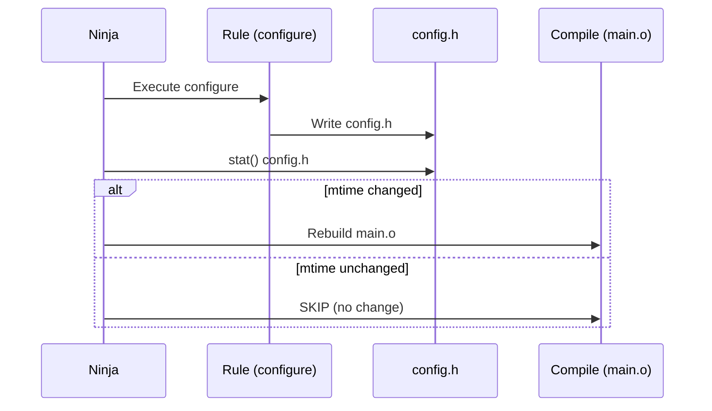

# Ninja

Ninja is a small, focused build system designed for speed. Unlike Make, it is not meant to be
written by hand — instead, it is used as a backend by higher-level build generators like CMake,
Meson, and GN. Ninja's primary design goal is minimizing incremental build time by doing as
little work as possible.

## Introduction

Created by Evan Martin at Google in 2012, Ninja was originally built to replace Make for
Chromium's massive codebase (where incremental builds with Make took several seconds just for
dependency checking). Ninja reduces this overhead to near zero by pre-computing dependencies
and using a minimal, fast parser.

Key characteristics:

- **Speed**: Designed for minimal overhead on no-op builds (sub-second on large projects)
- **Generated, not written**: `build.ninja` files are produced by CMake, Meson, or GN
- **Minimal syntax**: No functions, no conditionals, no wildcards
- **Parallel by default**: Runs commands in parallel, controlled by `-j`
- **Automatic dependencies**: Integrates with GCC/Clang `-MD` dependency files

## Installation

```bash
# Debian/Ubuntu
sudo apt install ninja-build

# Fedora
sudo dnf install ninja-build

# Arch Linux
sudo pacman -S ninja

# From source
git clone https://github.com/ninja-build/ninja.git
cd ninja
cmake -Bbuild -DCMAKE_BUILD_TYPE=Release
cmake --build build
sudo cp build/ninja /usr/local/bin/

# Verify
ninja --version
# 1.12.1
```

## `build.ninja` Syntax

Ninja files have exactly two types of statements: **rules** and **build edges**.

### Rules

A rule defines a command template:

```ninja
rule cc
  command = gcc -MMD -MF $out.d -c $in -o $out $cflags
  depfile = $out.d
  description = CC $out

rule link
  command = gcc $in -o $out $ldflags
  description = LINK $out
```

Rule attributes:

| Attribute      | Purpose                                          |
|----------------|--------------------------------------------------|
| `command`      | The shell command to execute (required)           |
| `description`  | Short status line shown during build              |
| `depfile`      | Path to GCC-style `.d` dependency file            |
| `deps`         | `gcc` or `msvc` for dependency discovery          |
| `generator`    | Set to `1` if this rule regenerates the ninja file|
| `pool`         | Named pool for concurrency control                |
| `restat`       | `1` to re-stat output and skip dependents if unchanged |

### Build Edges

A build edge connects inputs to outputs via a rule:

```ninja
build main.o: cc main.c
  cflags = -Wall -O2

build utils.o: cc utils.c
  cflags = -Wall -O2

build app: link main.o utils.o
  ldflags = -lm
```

### Variables

Variables can be set at file, rule, or build-edge scope:

```ninja
# Global
cflags_global = -Wall -Wextra -O2

rule cc
  command = gcc -MMD -MF $out.d -c $in -o $out $cflags
  depfile = $out.d

build foo.o: cc foo.c
  cflags = $cflags_global -DDEBUG    # Edge-specific override

build bar.o: cc bar.c
  # Uses rule default (no $cflags defined → empty)
```

### Variable References

```ninja
# Simple
$out

# With space (stops at whitespace)
${out}

# Substitution references (like Make's $(patsubst))
objects = main.o utils.o parser.o
# Not natively supported; handled by the generator
```

### Default Target

```ninja
default app    # 'ninja' with no args builds 'app'
# Or multiple:
default app tests
```

### Pools

Limit concurrent jobs for specific rules:

```ninja
pool link_pool
  depth = 1        # Only one link at a time

rule link
  command = gcc $in -o $out
  pool = link_pool
```

The built-in `console` pool (depth 1) provides exclusive terminal access:

```ninja
pool console
  depth = 1

rule configure
  command = ./configure
  pool = console
```

## Complete Example

```ninja
# build.ninja — hand-written example for a small C project

cflags = -Wall -Wextra -O2 -g

rule cc
  command = gcc -MMD -MF $out.d $cflags -c $in -o $out
  depfile = $out.d
  description = CC $out

rule link
  command = gcc $in -o $out -lm
  description = LINK $out

rule run
  command = ./$in
  description = RUN $in

build build/main.o: cc src/main.c
build build/string.o: cc src/string.c
build build/io.o: cc src/io.c

objects = build/main.o build/string.o build/io.o

build build/app: link $objects

build run: run build/app
  generator = 1

default build/app
```

```bash
ninja              # Build default target
ninja -v           # Verbose (show commands)
ninja -j4          # Limit to 4 parallel jobs
ninja -n           # Dry run (show what would be done)
ninja -t clean     # Remove all built files
ninja -t targets   # List all targets
ninja -t graph     # Output Graphviz DOT dependency graph
```

## Ninja vs Make

| Aspect             | Ninja                                       | GNU Make                                   |
|--------------------|----------------------------------------------|--------------------------------------------|
| **Syntax**         | Minimal, fast to parse                       | Complex, Turing-complete                   |
| **Intended use**   | Generated by other tools                     | Written by hand or generated               |
| **Parallelism**    | Parallel by default                          | Sequential by default (`-j` needed)        |
| **Dependencies**   | `depfile` + `deps` for auto-discovery        | Manual or via `-MMD` + include             |
| **Variables**      | Simple substitution                          | Recursive expansion, functions, `$(shell)` |
| **Conditionals**   | None                                         | `ifeq`, `ifdef`, etc.                      |
| **Suffix rules**   | None (explicit edges only)                   | `.c.o:`, pattern rules `%: %.o`            |
| **No-op build**    | ~100ms for large projects                    | Several seconds for large projects         |
| **Debugging**      | `-d stats`, `-t graph`                       | `-d`, `--print-data-base`                  |
| **Philosophy**     | Do one thing fast                            | Swiss-army knife                           |

### No-Op Build Speed Comparison

```bash
# Chromium-scale project (~40,000 build edges)
# Make:  ~5-10 seconds for no-op build
# Ninja: ~0.1-0.3 seconds for no-op build
```

The speed difference comes from Ninja's approach:

1. Pre-parsed binary log format for build state
2. No wildcard expansion or shell invocation for dependency checking
3. Minimal stat() calls via `restat` optimization

## Generator Integration

### CMake → Ninja

```bash
# Configure with Ninja generator
cmake -G Ninja -B build -DCMAKE_BUILD_TYPE=Release

# Build
cmake --build build

# Or directly
cd build && ninja
```

CMake generates `build/build.ninja`. Example generated fragment:

```ninja
rule C_COMPILER__myapp_Debug
  depfile = CMakeFiles/myapp.dir/main.c.o.d
  deps = gcc
  command = /usr/bin/gcc $DEFINES $INCLUDES $FLAGS -MD -MT CMakeFiles/myapp.dir/main.c.o -MF CMakeFiles/myapp.dir/main.c.o.d -o CMakeFiles/myapp.dir/main.c.o -c /home/user/project/main.c
  description = Building C object CMakeFiles/myapp.dir/main.c.o

build CMakeFiles/myapp.dir/main.c.o: C_COMPILER__myapp_Debug /home/user/project/main.c
  DEFINES = -DDEBUG
  INCLUDES = -I/home/user/project/include
  FLAGS = -g -Wall
```

### Meson → Ninja

```bash
meson setup build
ninja -C build
```

Meson generates `build/build.ninja` with its own conventions.

### GN → Ninja (Chromium)

```bash
gn gen out/Default
ninja -C out/Default
```

## Command-Line Tools

```bash
# Build specific target
ninja target_name

# Build multiple targets
ninja target1 target2

# Show dependency graph as DOT
ninja -t graph all | dot -Tpng > graph.png

# List all targets
ninja -t targets all

# Clean built files
ninja -t clean

# Clean and remove ninja state
ninja -t clean -r

# Browse dependency graph (starts HTTP server)
ninja -t browse target_name

# Show why a target would be rebuilt
ninja -t commands target_name

# Query the build log
ninja -t query target_name
```

### Debugging Build Issues

```bash
# Stats about the build
ninja -d stats

# Explain why targets are being rebuilt
ninja -d explain

# Keep ninja's temporary files
ninja -d keeprsp

# Log all executed commands to file
ninja -j1 2>&1 | tee build.log
```

## Pools and Concurrency Control

```ninja
# Limit memory-heavy compilations
pool heavy_compile
  depth = 2

rule cc_heavy
  command = g++ -O3 -flto $in -c -o $out
  pool = heavy_compile

# Always serialize linking (avoid OOM)
pool link_pool
  depth = 1

rule link
  command = g++ $in -o $out
  pool = link_pool
```

## Response Files

For very long command lines (common with large projects), Ninja uses response files:

```ninja
rule link
  command = g++ @$out.rsp -o $out
  rspfile = $out.rsp
  rspfile_content = $in_newline $ldflags
```

This avoids shell argument-length limits (typically 128KB on Linux).

## Build Log and Deps Log

Ninja maintains two binary databases:

- **`.ninja_log`**: Records of previous build outputs (timestamp, command hash)
- **`.ninja_deps`**: Stored dependency information from `depfile`/`deps`

These enable fast no-op builds by avoiding redundant work.

```bash
# Inspect the build log
cat build/.ninja_log

# Format: start_time end_time mtime output target
# 1690000000 1690000001 1690000000 main.o
```

## Writing a Simple Generator

A Python script that generates `build.ninja`:

```python
#!/usr/bin/env python3
"""Simple build.ninja generator."""

import glob
import os

sources = glob.glob("src/*.c")
objects = [s.replace("src/", "build/").replace(".c", ".o") for s in sources]

print("cflags = -Wall -O2 -g\n")
print("rule cc")
print("  command = gcc -MMD -MF $out.d $cflags -c $in -o $out")
print("  depfile = $out.d")
print("  description = CC $out\n")
print("rule link")
print("  command = gcc $in -o $out")
print("  description = LINK $out\n")

for src, obj in zip(sources, objects):
    print(f"build {obj}: cc {src}")

print(f"\nbuild build/app: link {' '.join(objects)}")
print("\ndefault build/app")
```

```bash
python3 gen_ninja.py > build.ninja
ninja
```

## Advanced Features

### Phony Targets

Like Make's `.PHONY`:

```ninja
phony all: build/app build/tests
phony clean:

default all
```

### Implicit Dependencies

```ninja
build main.o: cc main.c | config.h
# config.h is an implicit dependency — rebuild if it changes
# but it's not passed to the command
```

### Order-Only Dependencies

```ninja
build build/main.o: cc src/main.c || build/
# build/ directory must exist before compiling,
# but changes to build/ don't trigger rebuild

build build/:
  command = mkdir -p build
```

### Validation (Ninja 1.10+)

```ninja
build check: phony build/tests
  validation = 1

build build/app: link build/main.o | check
# 'check' runs as a side-effect but doesn't block 'build/app'
```

## Dynamic Dependencies (dyndep)

Ninja 1.10+ supports dynamic dependencies, where build edges can discover additional inputs at build time:

```ninja
# dyndep allows rules to produce .ninja files that declare
# additional implicit/order-only dependencies

rule gen_dd
  command = ./generate_deps.py $in $out $out.dyn
  dyndep = $out.dyn
  restat = 1

build build/intermediate.o: gen_dd source.txt | build/deps.ninja
  dyndep = build/deps.ninja
```

The dyndep file format:

```ninja
# build/deps.ninja (generated at build time)
ninja_dyndep_version = 1

build build/intermediate.o: dyndep
  implicit = build/extra_dep1.h build/extra_dep2.h
```

### Use Cases for dyndep

- **Fortran module dependencies** — module files discovered after compilation
- **Code generators** — output dependencies unknown until generator runs
- **Protocol buffers** — `.proto` imports discovered at build time
- **Rust build scripts** — `build.rs` declares dependencies dynamically

```bash
# Verify dyndep is supported
ninja --version
# Must be >= 1.10

# CMake uses dyndep for Fortran projects
cmake -G Ninja -DCMAKE_Fortran_COMPILER=gfortran ..
```

## Restat Optimization

The `restat = 1` attribute enables a powerful optimization: if a rule's output doesn't change after execution, Ninja skips rebuilding downstream dependents:

```ninja
rule configure
  command = ./configure.sh $out
  restat = 1           # If output unchanged, skip dependents
  generator = 1

rule compile
  command = gcc -c $in -o $out

build config.h: configure config.sh
build main.o: compile main.c
  # Won't rebuild main.o if config.h content unchanged!
```

### How Restat Works



Benefits:
- Avoids unnecessary rebuilds when generator output is identical
- Critical for CMake configure step (regenerates `build.ninja`)
- Reduces build times in CI where configure runs every time

## Advanced Pool Strategies

### Memory-Aware Pool Configuration

```ninja
# Heavy compilation (e.g., template-heavy C++)
pool heavy_pool
  depth = 2

# Light compilation (simple C files)
pool light_pool
  depth = 8

rule cc_heavy
  command = g++ -O3 -flto $in -c -o $out
  pool = heavy_pool

rule cc_light
  command = gcc -O0 $in -c -o $out
  pool = light_pool

# Linking is always memory-intensive
pool link_pool
  depth = 1

rule link
  command = g++ $in -o $out
  pool = link_pool

# Console pool for interactive commands
pool console
  depth = 1

rule test
  command = ./run_tests.sh
  pool = console
```

### Combining Pools with Response Files

```ninja
rule link
  command = g++ @$out.rsp -o $out
  rspfile = $out.rsp
  rspfile_content = $in_newline $ldflags
  pool = link_pool
  description = LINK $out

# Response files handle command-line length limits (>128KB)
# Especially important for large projects with many object files
```

## CI/CD Integration

### GitHub Actions with Ninja

```yaml
# .github/workflows/build.yml
name: Build
on: [push, pull_request]
jobs:
  build:
    runs-on: ubuntu-latest
    steps:
      - uses: actions/checkout@v4
      - name: Install dependencies
        run: sudo apt-get install -y ninja-build cmake build-essential
      - name: Configure
        run: cmake -G Ninja -B build -DCMAKE_BUILD_TYPE=Release
      - name: Build
        run: ninja -C build -j$(nproc)
      - name: Test
        run: ninja -C build test
```

### CCache + Ninja

```bash
# CCache caches compilation results for faster rebuilds
apt install ccache

# Configure with CCache
cmake -G Ninja -B build \
    -DCMAKE_C_COMPILER_LAUNCHER=ccache \
    -DCMAKE_CXX_COMPILER_LAUNCHER=ccache

# Build with cache
ninja -C build

# First build: compiles everything
# Subsequent builds: ccache hits (near-instant)

# CCache stats
ccache -s
# Cacheable calls:   1234 / 1234 (100%)
# Hits:               987 / 1234 (80%)
# Direct:             800
# Preprocessed:       187
```

### Ninja in Docker Builds

```dockerfile
FROM ubuntu:22.04
RUN apt-get update && apt-get install -y ninja-build cmake g++
COPY . /src
WORKDIR /src
RUN cmake -G Ninja -B build && ninja -C build
```

## Performance Profiling Builds

### Measuring Build Time

```bash
# Time the build
time ninja -j$(nproc)

# Ninja's built-in timing (build log)
cat .ninja_log | sort -k2 -n | tail -20
# Format: start_time end_time mtime target
# Shows which targets took longest

# Parse ninja_log for analysis
awk -F'\t' '{print ($2-$1)/1000 "s " $5}' .ninja_log | sort -rn | head -20
# 12.345s src/libheavy.cpp.o
# 8.234s src/app.cpp.o
# 5.678s tests/test_main.cpp.o
```

### Identifying Bottlenecks

```bash
# Show what would be rebuilt (dry run)
ninja -n -j1 2>&1 | head -50

# Show the critical path
ninja -t graph all | dot -Tpng > dep_graph.png

# Show commands that would run
ninja -t commands all | head -50

# Stats about build graph
ninja -d stats
# metric             count
# edges visited      4567
# edges examined     12345
# nodes total        2345
# paths searched     5678
# path hash hits     234
```

### Build Graph Visualization

```bash
# Generate dependency graph
cmake --build build --target graphviz  # CMake-specific

# Or from Ninja directly
ninja -t graph all | dot -Tsvg > build_graph.svg

# Show why a target rebuilds
ninja -t commands target.o

# List all targets with descriptions
ninja -t targets all
ninja -t targets rule cc  # Filter by rule
```

## Ninja Debugging Reference

### Debug Flags

```bash
ninja -d stats        # Build graph statistics
ninja -d explain      # Explain why targets rebuild
ninja -d keeprsp      # Keep response files for inspection
ninja -d list         # List all debug options

# Combine with verbose output
ninja -d explain -v 2>&1 | tee build_debug.log
```

### Common Build Issues

```bash
# Problem: "no such file or directory" for generated headers
# Solution: Add order-only dependency
# build main.o: cc main.c || build/generated.h

# Problem: Build loops ("still dirty after 100 tries")
# Solution: Check for circular dependencies or missing outputs
ninja -t targets all | grep <problematic_target>

# Problem: Builds too slow
# Solution: Check parallelism and pools
ninja -j$(nproc)  # Use all cores
ninja -t graph | dot -Tpng > graph.png  # Visualize dependencies

# Problem: "multiple rules generate the same output"
# Solution: Remove duplicate build edges
ninja -t targets all | sort | uniq -d  # Find duplicates
```

## Writing Ninja Generators

### Python Generator Pattern

```python
#!/usr/bin/env python3
"""Advanced build.ninja generator with dependency tracking."""

import glob
import os
import hashlib

# Configuration
CXX = "g++"
CFLAGS = "-Wall -Wextra -O2 -g"
LDFLAGS = "-lm -lpthread"

# Source discovery
sources = sorted(glob.glob("src/**/*.cpp", recursive=True))
objects = []

with open("build.ninja", "w") as f:
    # Rules
    f.write(f"""
rule cc
  command = {CXX} -MMD -MF $out.d ${{cflags}} -c $in -o $out
  depfile = $out.d
  description = CC $out

rule link
  command = {CXX} @$out.rsp -o $out ${{ldflags}}
  rspfile = $out.rsp
  rspfile_content = $in_newline
  description = LINK $out

rule test
  command = ./$in
  pool = console
  description = TEST $in
""")

    # Build edges
    for src in sources:
        obj = src.replace("src/", "build/").replace(".cpp", ".o")
        objects.append(obj)
        f.write(f"build {obj}: cc {src}\n")

    f.write(f"\nbuild build/app: link {' '.join(objects)}\n")
    f.write("build test: phony build/app\n")
    f.write("default build/app\n")

print(f"Generated build.ninja with {len(objects)} targets")
```

### CMake Custom Generator for Ninja

```cmake
# CMakeLists.txt — generates build.ninja
cmake_minimum_required(VERSION 3.20)
project(MyApp LANGUAGES CXX)

set(CMAKE_CXX_STANDARD 20)

# Main library
add_library(mylib src/lib.cpp src/utils.cpp)
target_include_directories(mylib PUBLIC include)

# Main executable
add_executable(app src/main.cpp)
target_link_libraries(app mylib)

# Custom command with Ninja-specific features
add_custom_command(
  OUTPUT ${CMAKE_BINARY_DIR}/generated.h
  COMMAND ${CMAKE_SOURCE_DIR}/scripts/gen_header.py ${CMAKE_BINARY_DIR}/generated.h
  DEPENDS ${CMAKE_SOURCE_DIR}/scripts/gen_header.py
  COMMENT "Generating header"
)

# Tests
enable_testing()
add_executable(tests test/test_main.cpp)
target_link_libraries(tests mylib)
add_test(NAME unit_tests COMMAND tests)
```

## Ninja File Format Specification

### Valid Characters

```ninja
# Identifiers: [a-zA-Z0-9_.-]+
# Variables: $
# Comments: # (must be at start of line or after a rule/build keyword)
# Paths: forward slashes (even on Windows)

# Escaping:
# $: literal dollar
# $: newline continuation (line continues after whitespace)
# ${var}: variable reference (braces for disambiguation)
```

### Edge Scoping Rules

```ninja
# Variables can be set at three scopes:

# 1. Global scope
cflags = -O2

# 2. Rule scope (inside rule block)
rule cc
  command = gcc $cflags -c $in -o $out
  # $cflags refers to global variable

# 3. Build edge scope (overrides rule defaults)
build debug.o: cc debug.c
  cflags = -O0 -g  # Overrides global $cflags for this edge only

# Variable lookup order:
# 1. Edge-specific
# 2. Rule defaults
# 3. Global
```

## References

- [Ninja Manual](https://ninja-build.org/manual.html) — official documentation
- [Ninja GitHub](https://github.com/ninja-build/ninja) — source code
- [CMake Ninja Generator](https://cmake.org/cmake/help/latest/generator/Ninja.html) — CMake docs
- [Meson Build System](https://mesonbuild.com/) — uses Ninja as backend
- [GN Build System](https://gn.googlesource.com/gn/) — Chromium's generator for Ninja
- [How Ninja differs from Make](https://ninja-build.org/manual.html#_comparison_to_make) — design rationale
- [Ninja dyndep specification](https://ninja-build.org/manual.html#_dynamic_dependencies) — dynamic dependency docs

## Related Topics

- [CMake](./cmake.md) — primary generator for Ninja
- [Meson](./meson.md) — alternative generator
- [GNU Make](./make.md) — the classic build system
- [Build Systems Overview](./overview.md) — comparison of build systems
