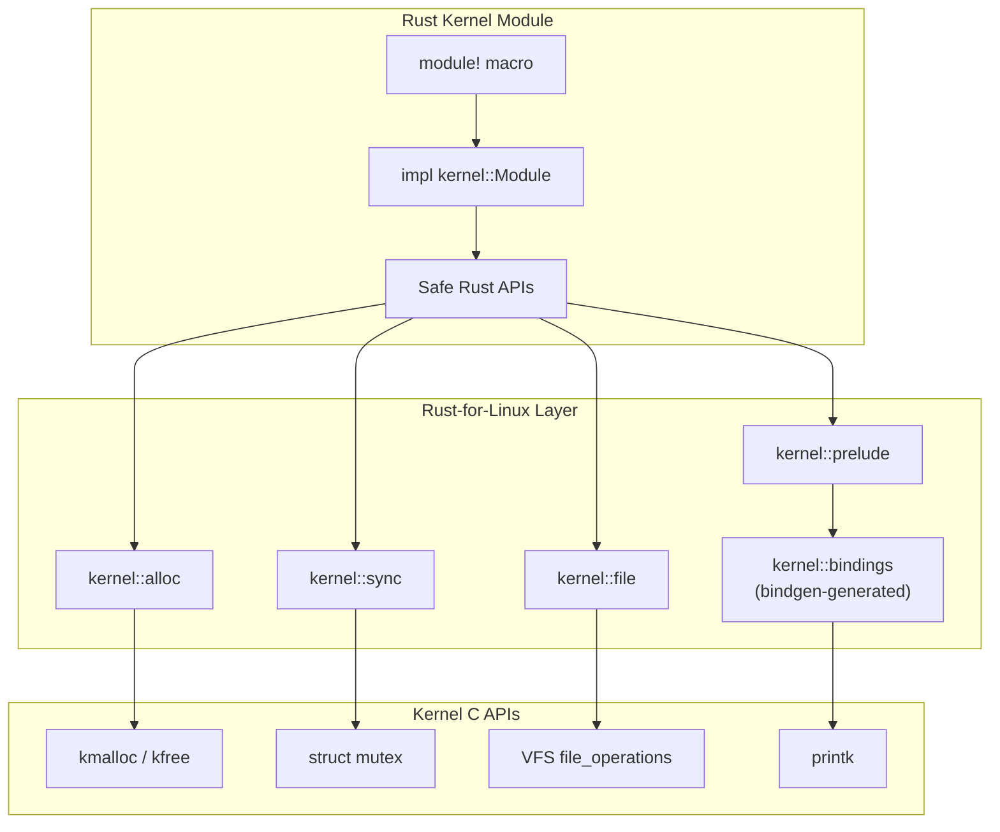
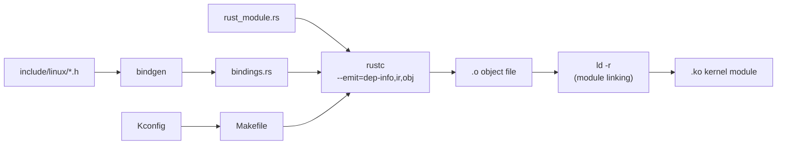

# Rust for Linux

The Rust for Linux project enables writing Linux kernel modules in Rust, bringing memory safety
guarantees to kernel code. Merged into Linux 6.1 (December 2022) as an experimental feature,
it represents the first addition of a second language to the Linux kernel in its 30+ year history.

## Introduction

The Linux kernel is predominantly written in C, a language without built-in memory safety.
Buffer overflows, use-after-free, and data races account for roughly 70% of all kernel security
vulnerabilities. Rust's ownership model, borrow checker, and type system eliminate entire
classes of these bugs at compile time.

Goals of Rust for Linux:

- **Memory safety without garbage collection** — zero-cost abstractions
- **Concurrency safety** — the type system prevents data races
- **Incremental adoption** — Rust modules coexist with C code
- **No performance overhead** — same or better performance as C
- **Existing kernel APIs** — Rust bindings to kernel data structures

## Kbuild Integration

Rust is integrated into the kernel's Kbuild system, the same build infrastructure used for C code.

### Configuration

```
# In kernel .config or menuconfig
CONFIG_RUST=y                  # Enable Rust support
CONFIG_RUST_IS_AVAILABLE=y     # Auto-detected if toolchain is present
CONFIG_SAMPLES_RUST=y          # Build Rust samples
```

### Build Requirements

```bash
# Minimum versions
# rustc >= 1.78.0 (check Documentation/rust/ for current requirement)
# bindgen-cli >= 0.69.0

# Install Rust toolchain
curl --proto '=https' --tlsv1.2 -sSf https://sh.rustup.rs | sh
rustup default 1.78.0
rustup component add rust-src llvm-tools rustfmt clippy

# Install bindgen-cli
cargo install bindgen-cli --version 0.69.0

# Verify
make LLVM=1 rustavailable
```

### Kbuild Variables

```makefile
# In a Kconfig file
config MY_RUST_MODULE
    tristate "My Rust kernel module"
    depends on RUST
    help
      A sample Rust kernel module.

# In the Makefile
obj-$(CONFIG_MY_RUST_MODULE) += my_rust_module.o
```

## A Complete Rust Kernel Module

```rust
// samples/rust/rust_minimal.rs

//! A minimal Rust kernel module.

use kernel::prelude::*;

module! {
    type: RustMinimal,
    name: "rust_minimal",
    author: "Rust for Linux Contributors",
    description: "A minimal Rust kernel module",
    license: "GPL",
}

struct RustMinimal {
    message: String,
}

impl kernel::Module for RustMinimal {
    fn init(_name: &'static CStr, _module: &'static ThisModule) -> Result<Self> {
        pr_info!("Rust minimal module loaded!\n");

        Ok(RustMinimal {
            message: String::try_from("Hello from Rust!")?,
        })
    }
}

impl Drop for RustMinimal {
    fn drop(&mut self) {
        pr_info!("Rust minimal module unloaded: {}\n", self.message);
    }
}
```

Building and loading:

```bash
# Build the module
make M=samples/rust

# Load it
sudo insmod samples/rust/rust_minimal.ko

# Check output
dmesg | tail
# [12345.678] Rust minimal module loaded!

# Remove it
sudo rmmod rust_minimal
# [12345.679] Rust minimal module unloaded: Hello from Rust!
```

## Module Macro

The `module!` macro is the entry point for every Rust kernel module:

```rust
module! {
    type: MyModule,           // The struct implementing kernel::Module
    name: "my_module",        // Module name (what appears in lsmod)
    author: "Author Name",
    description: "Short description",
    license: "GPL",           // Must be GPL-compatible
    alias: "my_alias",        // Optional module aliases
    params: {
        debug: bool {
            default: false,
            permissions: 0o644,
            description: "Enable debug output",
        },
        count: i32 {
            default: 10,
            permissions: 0o644,
            description: "Number of iterations",
        },
    },
}
```

Parameters are exposed in `/sys/module/my_module/parameters/`.

## Safety Abstractions

Rust for Linux provides safe wrappers around kernel C APIs. The key abstractions include:

### Memory Allocation

```rust
use kernel::alloc::{flags::GFP_KERNEL, KBox, KVec};

// Heap-allocated object (like kmalloc)
let boxed = KBox::new(42u32, GFP_KERNEL)?;

// Vector (like kmalloc_array + dynamic resizing)
let mut vec = KVec::new(GFP_KERNEL);
vec.push(1, GFP_KERNEL)?;
vec.push(2, GFP_KERNEL)?;

// Fallible allocation (returns Result, never panics)
let data = KBox::new_zeroed(1024, GFP_KERNEL)?;
```

### File Operations

```rust
use kernel::file::{self, File, Operations};
use kernel::prelude::*;

struct MyFileOps;

impl file::Operations for MyFileOps {
    type OpenData = ();
    type Data = ();

    fn open(_ctx: &file::OpenData<Self::OpenData>, _file: &File) -> Result<Self::Data> {
        Ok(())
    }

    fn read(
        _data: (),
        _file: &File,
        writer: &mut impl IoBufferWriter,
        _offset: u64,
    ) -> Result<usize> {
        let msg = b"Hello from Rust!\n";
        writer.write_slice(msg)?;
        Ok(msg.len())
    }
}
```

### Mutex and Synchronization

```rust
use kernel::sync::{Mutex, SpinLock, CondVar};

struct SharedState {
    data: Vec<u32>,
}

// Mutex (sleepable locks, like struct mutex in C)
let state = Mutex::new(SharedState { data: Vec::new() });
let mut guard = state.lock();
guard.data.push(42);

// SpinLock (non-sleepable, like spinlock_t in C)
let counter = SpinLock::new(0u64);
*counter.lock() += 1;
```

### Kernel Thread

```rust
use kernel::task::Task;

let thread = Task::spawn("my_thread", || {
    pr_info!("Kernel thread running\n");
    // Thread body
})?;
```

### Workqueues

```rust
use kernel::workqueue;

workqueue::queue_work(|| {
    pr_info!("Deferred work executed\n");
})?;
```

## C Interop with `bindgen`

Rust for Linux uses `bindgen` to generate Rust FFI bindings from kernel C headers:

```bash
# Auto-generated bindings
# include/generated/rust/bindings.rs contains:
#   - All kernel structs, enums, functions
#   - Generated from include/linux/*.h
```

Using C functions from Rust:

```rust
use kernel::bindings;

unsafe {
    // Direct call to C function
    bindings::printk(
        bindings::KERN_INFO as *const i8,
        "Message from Rust\n\0".as_ptr() as *const i8,
    );
}
```

### Writing Safe Wrappers

```rust
/// Safe wrapper around a C function
fn safe_printk(msg: &str) {
    // SAFETY: We ensure the format string is valid and null-terminated
    let cstr = CString::try_from(msg).unwrap_or_default();
    unsafe {
        bindings::printk(
            bindings::KERN_INFO as *const i8,
            cstr.as_ptr(),
        );
    }
}
```

## Error Handling

Rust for Linux uses its own `Result` type and error codes:

```rust
use kernel::error::{code, Error, Result};

fn do_something() -> Result<i32> {
    if condition {
        return Err(code::EINVAL);  // Return -EINVAL
    }

    if other_condition {
        return Err(code::ENOMEM);  // Return -ENOMEM
    }

    Ok(42)
}

// From raw errno
let err = Error::from_errno(-2);  // -ENOENT
```

Common error codes:

| Rust Constant    | C Equivalent | Meaning                   |
|------------------|--------------|---------------------------|
| `code::EPERM`   | `-EPERM`     | Operation not permitted   |
| `code::ENOENT`  | `-ENOENT`    | No such file or directory |
| `code::ENOMEM`  | `-ENOMEM`    | Out of memory             |
| `code::EINVAL`  | `-EINVAL`    | Invalid argument          |
| `code::EAGAIN`  | `-EAGAIN`    | Try again                 |

## Device Driver Example

A simple misc device (character device) in Rust:

```rust
use kernel::prelude::*;
use kernel::{file, miscdev};

module! {
    type: MyMiscDevice,
    name: "my_misc",
    author: "Author",
    description: "A misc device in Rust",
    license: "GPL",
}

struct MyMiscDevice {
    _dev: Pin<Box<miscdev::Registration<MyMiscDevice>>>,
}

struct MyFileOps;

impl file::Operations for MyFileOps {
    type OpenData = ();
    type Data = ();

    fn open(_ctx: &file::OpenData<Self::OpenData>, _file: &File) -> Result<Self::Data> {
        Ok(())
    }

    fn read(
        _data: (),
        _file: &File,
        writer: &mut impl IoBufferWriter,
        _offset: u64,
    ) -> Result<usize> {
        let msg = b"Hello from Rust misc device!\n";
        writer.write_slice(msg)?;
        Ok(msg.len())
    }

    fn write(
        _data: (),
        _file: &File,
        reader: &mut impl IoBufferReader,
        _offset: u64,
    ) -> Result<usize> {
        let len = reader.len();
        pr_info!("Received {} bytes from userspace\n", len);
        Ok(len)
    }
}

impl kernel::Module for MyMiscDevice {
    fn init(_name: &'static CStr, _module: &'static ThisModule) -> Result<Self> {
        let dev = miscdev::Registration::new_register::<MyMiscDevice>(
            fmt!("my_misc\0"),
        )?;

        Ok(MyMiscDevice {
            _dev: Pin::from(Box::try_new(dev)?),
        })
    }
}
```

Testing:

```bash
sudo insmod my_misc.ko
cat /dev/my_misc
# Output: Hello from Rust misc device!
echo "test" > /dev/my_misc
# dmesg: Received 5 bytes from userspace
```

## Architecture Diagram



## Current Status (as of Linux 6.x)

### What Works

- ✅ Loadable kernel modules
- ✅ Module parameters
- ✅ Memory allocation (KBox, KVec)
- ✅ Mutex, SpinLock, CondVar, RCU
- ✅ File operations (misc devices, character devices)
- ✅ Network drivers (basic)
- ✅ Platform drivers
- ✅ USB drivers (basic)
- ✅ Block I/O (experimental)
- ✅ Workqueues, timers
- ✅ Error handling
- ✅ Print macros (pr_info!, pr_err!, etc.)

### In Progress

- 🚧 Binder driver (Android IPC) — first major Rust driver
- 🚧 NVMe driver — performance comparison with C
- 🚧 Apple AGX GPU driver (Asahi Linux)
- 🚧 PHY driver framework

### Not Yet Available

- ❌ Full filesystem implementation
- ❌ Scheduler modifications
- ❌ Architecture-specific code (arm, riscv bindings)
- ❌ Complete VFS abstraction
- ❌ Memory management subsystem bindings

## Build System Flow



## The `unsafe` Boundary

Rust for Linux carefully manages the boundary between safe Rust and unsafe kernel C:

```rust
// This is SAFE — the Rust wrapper ensures correctness
fn safe_api() -> Result<()> {
    let mut vec = KVec::new(GFP_KERNEL);
    vec.push(1, GFP_KERNEL)?;
    Ok(())
}

// This is UNSAFE — calling C directly
unsafe fn raw_api() {
    let ptr = bindings::kmalloc(1024, bindings::GFP_KERNEL);
    if !ptr.is_null() {
        // Use the memory
        bindings::kfree(ptr);
    }
}
```

The goal is to minimize `unsafe` blocks. Each `unsafe` block requires a `// SAFETY:` comment
explaining why the invariants are upheld.

## Community and Governance

- **Maintainer**: Miguel Ojeda
- **Co-maintainer**: Alice Ryhl, Andreas Hindborg
- **Mailing list**: rust-for-linux@vger.kernel.org
- **Repository**: https://github.com/Rust-for-Linux/linux
- **Zulip chat**: https://rust-for-linux.zulipchat.com/

## References

- [The Linux Kernel Documentation](https://docs.kernel.org/)
- [GNU Project Documentation](https://www.gnu.org/doc/doc.html)
- [GNU Manuals](https://www.gnu.org/manual/manual.html)
- [Free Software Directory](https://directory.fsf.org/wiki/Main_Page)
- [Planet GNU](https://planet.gnu.org/)
- [Free Software Books](https://www.gnu.org/doc/other-free-books.html)

- [Rust for Linux Documentation](https://www.kernel.org/doc/html/latest/rust/) — official kernel docs
- [Rust for Linux GitHub](https://github.com/Rust-for-Linux/linux) — development tree
- [LWN: Rust in the Linux kernel](https://lwn.net/Articles/829858/) — initial announcement
- [LWN: The first Rust kernel module](https://lwn.net/Articles/909317/) — Binder progress
- [Rust API Guidelines](https://rust-lang.github.io/api-guidelines/) — general Rust best practices
- [LKML: Rust patches](https://lore.kernel.org/rust-for-linux/) — patch series

## Related Topics

- [GCC](./gcc.md) — the C compiler used for the rest of the kernel
- [Kbuild](../kernel/kbuild.md) — kernel build system
- [Kernel Modules](../kernel/modules.md) — loadable module infrastructure
- [Container Security](../containers/security.md) — safety in systems software

## Rust Ownership Model in Kernel Context

Rust's ownership system is the key reason it's being adopted for the kernel. Here's how it maps to kernel concepts:

### Ownership and Kernel Objects

```rust
// In C, you manually manage reference counts:
//   kref_init(&obj->kref);
//   kref_get(&obj->kref);
//   kref_put(&obj->kref, my_release);

// In Rust, ownership is automatic:
let obj = KBox::new(MyObject::new()?, GFP_KERNEL)?;
// obj is dropped when it goes out of scope — no manual kfree needed
```

### Borrowing for Kernel Data Access

```rust
fn process_data(data: &MyData) {
    // Immutable borrow — can read, cannot modify
    println!("value: {}", data.value);
}

fn modify_data(data: &mut MyData) {
    // Mutable borrow — exclusive access
    data.value += 1;
}

// The compiler ensures:
// 1. No two mutable references exist simultaneously
// 2. No mutable reference exists while immutable ones do
// 3. References don't outlive the data they point to
```

### Lifetimes in Kernel Code

```rust
// Lifetimes prevent use-after-free
fn get_buffer<'a>(data: &'a MyData) -> &'a [u8] {
    &data.buffer
    // The returned slice can't outlive 'data'
}

// In C, this would be a dangling pointer bug:
// char *get_buffer(struct my_data *data) {
//     return data->buffer;  // caller must know lifetime!
// }
```

## Kernel Thread Safety with Rust

### `Send` and `Sync` Traits

```rust
// Send: can be transferred between threads
// Sync: can be shared between threads (via &T)

// Most kernel types are Send + Sync
// The compiler prevents sending non-Send types across threads

// Example: KVec<u32> is Send but not Sync
// (you need a lock to share it)

// Mutex<T> is Send + Sync (if T is Send)
let shared = Mutex::new(Vec::new());
// Can be shared between threads safely
```

### SpinLock Example

```rust
use kernel::sync::SpinLock;

struct DeviceState {
    rx_count: u64,
    tx_count: u64,
}

let state = SpinLock::new(DeviceState { rx_count: 0, tx_count: 0 });

// In interrupt context (cannot sleep)
let mut guard = state.lock();
// guard derefs to DeviceState
guard.rx_count += 1;
// lock is automatically released when guard is dropped
```

### Mutex Example

```rust
use kernel::sync::Mutex;

struct Config {
    debug_level: u32,
    max_connections: u32,
}

let config = Mutex::new(Config { debug_level: 0, max_connections: 100 });

// In process context (can sleep)
let mut cfg = config.lock();
if cfg.debug_level > 0 {
    pr_info!("debug enabled\n");
}
cfg.max_connections = 200;
```

## Workqueue and Timer Abstractions

### Workqueues

```rust
use kernel::workqueue;

// Queue work to be executed later in process context
workqueue::queue_work(|| {
    pr_info!("Deferred work executed\n");
})?;

// With custom workqueue
let wq = workqueue::create_queue("my_wq")?;
wq.queue_work(|| {
    pr_info!("Work on custom queue\n");
})?;
```

### Timers

```rust
use kernel::timer::Timer;

let timer = Timer::new(|| {
    pr_info!("Timer fired!\n");
});

// Schedule for 1 second from now
timer.modify(jiffies::from_secs(1))?;
```

## Real-World Rust Kernel Modules

### NVMe Driver (Experimental)

The Rust NVMe driver is a proof-of-concept showing Rust can handle high-performance I/O:

```rust
// Simplified NVMe queue pair
struct QueuePair {
    submission: KBox<[NvmeCommand; 256]>,
    completion: KBox<[NvmeCompletion; 256]>,
    sq_tail: u32,
    cq_head: u32,
}

impl QueuePair {
    fn submit(&mut self, cmd: NvmeCommand) {
        self.submission[self.sq_tail as usize] = cmd;
        self.sq_tail = (self.sq_tail + 1) % 256;
        // Ring doorbell
        unsafe {
            bindings::writel(self.sq_tail, self.doorbell);
        }
    }
}
```

### Binder Driver (Android)

The Android Binder IPC driver is being rewritten in Rust:

- First major Rust driver in production use
- Shows Rust can handle complex IPC patterns
- Catches real bugs that existed in the C version

### Apple AGX GPU Driver (Asahi Linux)

The Asahi Linux project's GPU driver is written in Rust:

- Complex hardware programming
- Safety-critical (GPU can DMA anywhere)
- Rust prevents DMA buffer misuse at compile time

## Testing Rust Kernel Code

### Unit Tests

```rust
#[cfg(test)]
mod tests {
    use super::*;

    #[test]
    fn test_buffer_alloc() {
        let buf = KVec::new(GFP_KERNEL);
        assert_eq!(buf.len(), 0);
    }
}
```

### Integration Tests

```bash
# Run kernel tests with Rust modules
cd /usr/src/linux
make KUNIT=1 M=samples/rust

# Or with kselftest
make TARGETS=rust kselftest
```

### Static Analysis

```bash
# Clippy lints for kernel code
cargo clippy -- -D warnings

# Format check
cargo fmt --check

# These are run automatically in CI for Rust for Linux patches
```

## Common Pitfalls and Solutions

### String Handling

```rust
// Kernel strings are C strings (null-terminated)
let msg = CStr::from_bytes_with_nul(b"hello\n")?;
pr_info!("{}", msg);

// Converting from Rust strings
let s = String::try_from("hello")?;
// String is a kernel heap-allocated string (like kstrdup)
```

### Error Code Conversion

```rust
// Kernel uses negative error codes
fn fallible() -> Result<i32> {
    if bad_condition {
        return Err(code::EINVAL);
    }
    Ok(42)
}

// Map from C errno
let err = Error::from_errno(-ENOMEM);
```

### Unsafe Code Guidelines

```rust
// Every unsafe block needs a SAFETY comment
unsafe {
    // SAFETY: We hold the device lock, so no concurrent access
    bindings::writel(value, self.mmio_base + REG_OFFSET);
}

// Common unsafe patterns:
// 1. Calling C functions (always unsafe)
// 2. Raw pointer dereference
// 3. Accessing mutable statics
// 4. Implementing unsafe traits
```
