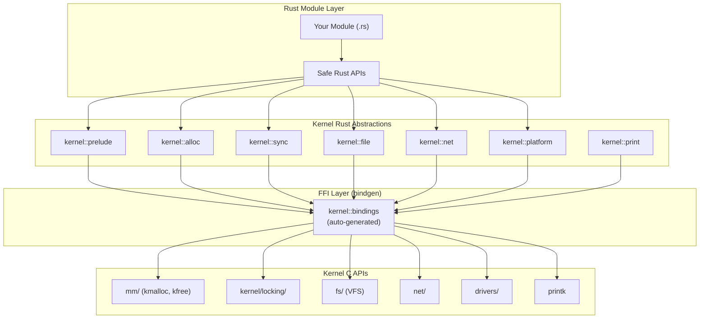

# Rust in the Linux Kernel: Programming Guide

## Introduction

Rust is the second programming language accepted into the Linux kernel, merged as an experimental feature in Linux 6.1 (December 2022). This guide covers practical Rust kernel programming: writing modules, device drivers, and subsystem code using the kernel's Rust abstractions. It complements the [Rust for Linux](./rust-for-linux.md) overview with hands-on programming patterns and deeper technical detail.

The primary motivation is **memory safety**: ~70% of kernel CVEs are memory safety issues (buffer overflows, use-after-free, data races). Rust's ownership system eliminates these classes of bugs at compile time, without runtime overhead.

> **Minimum toolchain:** rustc 1.78.0+, bindgen-cli 0.69.0+  
> **Maintainer:** Miguel Ojeda, Alice Ryhl  
> **Source:** `rust/`, `samples/rust/`, `drivers/rust/`

---

## Prerequisites and Setup

### Toolchain Installation

```bash
# Install Rust (specific version required by kernel)
curl --proto '=https' --tlsv1.2 -sSf https://sh.rustup.rs | sh
rustup default 1.78.0
rustup component add rust-src llvm-tools rustfmt clippy

# Install bindgen (generates Rust FFI bindings from C headers)
cargo install bindgen-cli --version 0.69.0

# Verify
rustc --version
bindgen --version

# Kernel config
# CONFIG_RUST=y
# CONFIG_RUST_IS_AVAILABLE=y
```

### Building Rust Kernel Modules

```bash
# Check Rust availability
make LLVM=1 rustavailable

# Build Rust samples
make LLVM=1 -j$(nproc) M=samples/rust

# Build a specific module
make LLVM=1 -j$(nproc) M=rust/my_driver

# Load and test
sudo insmod my_driver.ko
dmesg | tail -5
sudo rmmod my_driver
```

---

## Module Structure

### Anatomy of a Rust Kernel Module

```rust
// SPDX-License-Identifier: GPL-2.0

//! My kernel module — brief description.
//!
//! Longer description of what this module does.

use kernel::prelude::*;

module! {
    type: MyModule,
    name: "my_module",
    author: "Your Name <you@example.com>",
    description: "A Rust kernel module",
    license: "GPL",
    params: {
        debug: bool {
            default = false,
            permissions = 0o644,
            description = "Enable debug logging",
        },
    },
}

struct MyModule {
    /// Module state — dropped when module is unloaded.
    info: String,
}

impl kernel::Module for MyModule {
    fn init(_name: &'static CStr, _module: &'static ThisModule) -> Result<Self> {
        pr_info!("my_module: initializing\n");

        Ok(MyModule {
            info: String::try_from("initialized")?,
        })
    }
}

impl Drop for MyModule {
    fn drop(&mut self) {
        pr_info!("my_module: cleaning up: {}\n", self.info);
    }
}
```

### Module Macro Reference

```rust
module! {
    type: MyModule,             // Struct implementing kernel::Module
    name: "module_name",        // Appears in lsmod / modinfo
    author: "Name <email>",
    description: "What it does",
    license: "GPL",             // Must be GPL-compatible for symbol export
    alias: "alternate_name",    // Module aliases for autoloading
    params: {
        name: type {
            default = value,    // Default value
            permissions = 0o644,// sysfs permissions
            description = "Param description",
        },
    },
}
```

---

## Memory Allocation

### Fallible Allocation

Kernel allocations can fail (unlike userspace). All kernel Rust allocation is fallible:

```rust
use kernel::alloc::{flags::GFP_KERNEL, KBox, KVec};

// Heap-allocated box (like kmalloc)
let boxed: KBox<u32> = KBox::new(42u32, GFP_KERNEL)?;

// Zero-initialized allocation (like kzalloc)
let zeroed: KBox<[u8]> = KBox::new_zeroed(1024, GFP_KERNEL)?;

// Dynamically-sized vector
let mut vec: KVec<u32> = KVec::new(GFP_KERNEL);
vec.push(1, GFP_KERNEL)?;
vec.push(2, GFP_KERNEL)?;
vec.push(3, GFP_KERNEL)?;

// From slice
let from_slice: KBox<[u8]> = KBox::from_slice_copy(&[1, 2, 3], GFP_KERNEL)?;

// GFP flags
use kernel::alloc::flags::*;
// GFP_KERNEL — normal kernel allocation (may sleep)
// GFP_ATOMIC — interrupt context (never sleeps)
// GFP_USER   — user allocation
// GFP_DMA    — DMA-able memory
```

### GFP Flag Semantics

| Flag | Context | May Sleep | Use Case |
|------|---------|-----------|----------|
| `GFP_KERNEL` | Process context | Yes | General allocation |
| `GFP_ATOMIC` | Interrupt/softirq | No | Interrupt handlers |
| `GFP_NOWAIT` | Any | No | Best-effort, don't wait |
| `GFP_USER` | Process context | Yes | User pages |
| `GFP_DMA` | Any | Depends | DMA-capable memory |
| `GFP_HIGHUSER` | Process | Yes | High memory user pages |

### Memory Safety Pattern

```rust
use kernel::prelude::*;
use kernel::alloc::{KBox, KVec, flags::GFP_KERNEL};

/// Safe wrapper around a buffer management pattern.
struct BufferManager {
    buffers: KVec<KBox<[u8]>>,
}

impl BufferManager {
    fn new() -> Result<Self> {
        Ok(BufferManager {
            buffers: KVec::new(GFP_KERNEL),
        })
    }

    fn allocate_buffer(&mut self, size: usize) -> Result<usize> {
        let buf = KBox::new_zeroed(size, GFP_KERNEL)?;
        let idx = self.buffers.len();
        self.buffers.push(buf, GFP_KERNEL)?;
        Ok(idx)
    }

    fn get_buffer(&self, idx: usize) -> Option<&[u8]> {
        self.buffers.get(idx).map(|b| b.as_ref())
    }
}

// All memory is automatically freed when BufferManager is dropped
// No manual kfree() needed — Rust's Drop trait handles it
```

---

## Synchronization Primitives

### Mutex

```rust
use kernel::sync::{Mutex, Guard};

struct SharedData {
    counter: u64,
    items: KVec<String>,
}

// Mutex protects shared data — the data is inside the lock
let data = Mutex::new(SharedData {
    counter: 0,
    items: KVec::new(GFP_KERNEL),
});

// Locking returns a Guard that auto-unlocks on drop
{
    let mut guard: Guard<'_, SharedData> = data.lock();
    guard.counter += 1;
    guard.items.push(String::try_from("item")?, GFP_KERNEL)?;
    // guard is dropped here, lock is released
}

// The compiler prevents accessing SharedData without holding the lock:
// let val = data.counter;  // ERROR: cannot access without lock
```

### SpinLock

```rust
use kernel::sync::SpinLock;

// SpinLock: non-sleepable, use in interrupt context
let irq_data = SpinLock::new(0u64);

// Must use spin_lock_irqsave in interrupt context
let flags = kernel::sync::IrqFlags::new();
{
    let _guard = irq_data.lock_irqsave(&flags);
    // Safe to modify, interrupt-safe
}
```

### RCU (Read-Copy-Update)

```rust
use kernel::sync::Rcu;

// RCU: lockless read, safe concurrent access
let shared = Rcu::new(42u32);

// Read (no locking, very fast)
let val = shared.read();
println!("{}", *val);  // val is an RcuReadGuard

// Update (allocates new copy, publishes atomically)
shared.store(100u32);

// RCU is ideal for read-heavy workloads:
// - Routing tables
// - Module configuration
// - Task lists
```

### Completion

```rust
use kernel::sync::Completion;

let done = Completion::new();

// Thread 1: wait for completion
done.wait();
pr_info!("Work completed!\n");

// Thread 2: signal completion
done.complete();
```

---

## File Operations

### Character Device

```rust
use kernel::file::{self, File, Operations};
use kernel::prelude::*;
use kernel::{chrdev, module};

struct MyCharDev {
    _reg: chrdev::Registration,
}

struct MyFileOps;

impl file::Operations for MyFileOps {
    type OpenData = ();
    type Data = Mutex<Vec<u8>>;

    fn open(_ctx: &file::OpenData<Self::OpenData>, _file: &File) -> Result<Self::Data> {
        Ok(Mutex::new(Vec::new()))
    }

    fn read(
        data: &Mutex<Vec<u8>>,
        _file: &File,
        writer: &mut impl IoBufferWriter,
        offset: u64,
    ) -> Result<usize> {
        let buf = data.lock();
        let start = offset as usize;
        if start >= buf.len() {
            return Ok(0);
        }
        let remaining = &buf[start..];
        writer.write_slice(remaining)?;
        Ok(remaining.len())
    }

    fn write(
        data: &Mutex<Vec<u8>>,
        _file: &File,
        reader: &mut impl IoBufferReader,
        _offset: u64,
    ) -> Result<usize> {
        let mut buf = data.lock();
        let len = reader.len();
        buf.clear();
        let mut tmp = KVec::new(GFP_KERNEL);
        // Read all data from user
        while let Some(byte) = reader.read_byte() {
            tmp.push(byte, GFP_KERNEL)?;
        }
        *buf = tmp;
        Ok(len)
    }
}

impl kernel::Module for MyCharDev {
    fn init(_name: &'static CStr, _module: &'static ThisModule) -> Result<Self> {
        let mut reg = chrdev::Registration::new_register::<MyFileOps>(
            fmt!("my_char\0"),
        )?;
        reg.register()?;

        Ok(MyCharDev { _reg: reg })
    }
}
```

### Misc Device

```rust
use kernel::miscdev;
use kernel::prelude::*;
use kernel::sync::Mutex;

struct MyMiscDevice {
    _dev: Pin<Box<miscdev::Registration<MyMiscDevice>>>,
}

struct MiscOps;

impl file::Operations for MiscOps {
    type OpenData = ();
    type Data = ();

    fn open(_ctx: &file::OpenData<()>, _file: &File) -> Result<()> {
        Ok(())
    }

    fn read(
        _: (),
        _file: &File,
        writer: &mut impl IoBufferWriter,
        _offset: u64,
    ) -> Result<usize> {
        let msg = b"Hello from Rust!\n";
        writer.write_slice(msg)?;
        Ok(msg.len())
    }
}

impl kernel::Module for MyMiscDevice {
    fn init(_name: &'static CStr, _module: &'static ThisModule) -> Result<Self> {
        let dev = miscdev::Registration::new_register::<MiscOps>(
            fmt!("rust_misc\0"),
        )?;

        Ok(MyMiscDevice {
            _dev: Pin::from(Box::try_new(dev)?),
        })
    }
}
```

---

## Platform Drivers

### Platform Device Registration

```rust
use kernel::prelude::*;
use kernel::{platform, of, module};

module! {
    type: MyPlatformDriver,
    name: "my_platform",
    author: "Rust Kernel Dev",
    description: "A Rust platform driver",
    license: "GPL",
}

struct MyPlatformDriver {
    _pdev: platform::Registration,
}

struct MyPlatformData {
    base_addr: usize,
    irq: u32,
}

impl platform::Driver for MyPlatformDriver {
    type Data = MyPlatformData;

    // Device Tree compatible strings
    const OF_ID_TABLE: Option<of::IdTable<Self::Data>> = Some(&[
        of::DeviceId::new("vendor,my-device"),
    ]);

    fn probe(
        pdev: &platform::Device<Self::Data>,
        _info: Option<&Self::Data>,
    ) -> Result<Self::Data> {
        pr_info!("my_platform: probe called\n");

        // Get resources
        let res = pdev.resource(platform::ResourceType::Mem, 0)?;
        let base_addr = res.start()?;
        let irq = pdev.irq(0)?;

        Ok(MyPlatformData { base_addr, irq })
    }

    fn remove(_data: &Self::Data) {
        pr_info!("my_platform: remove called\n");
    }
}

impl kernel::Module for MyPlatformDriver {
    fn init(_name: &'static CStr, _module: &'static ThisModule) -> Result<Self> {
        let pdev = platform::Registration::new_register::<MyPlatformDriver>()?;

        Ok(MyPlatformDriver { _pdev: pdev })
    }
}
```

### Device Tree Binding Example

```dts
/* arch/arm64/boot/dts/vendor/my-board.dts */
my_device@10000000 {
    compatible = "vendor,my-device";
    reg = <0x10000000 0x1000>;
    interrupts = <GIC_SPI 42 IRQ_TYPE_LEVEL_HIGH>;
    clocks = <&clk CLK_MY_DEVICE>;
    status = "okay";
};
```

---

## Network Drivers (Conceptual)

```rust
use kernel::net;
use kernel::prelude::*;

// Rust network driver skeleton (simplified)
struct MyNetDevice {
    netdev: net::Registration,
    iobase: usize,
}

struct MyNetOps;

impl net::Operations for MyNetOps {
    type Data = Mutex<MyNetDevice>;

    fn open(dev: &net::Device) -> Result {
        pr_info!("my_net: interface up\n");
        // Configure hardware, enable interrupts
        Ok(())
    }

    fn stop(dev: &net::Device) -> Result {
        pr_info!("my_net: interface down\n");
        // Disable hardware, free resources
        Ok(())
    }

    fn xmit(dev: &net::Device, skb: &net::SkBuff) -> Result {
        // Transmit packet
        // DMA the skb data to hardware
        Ok(())
    }
}
```

---

## Error Handling

### Kernel Result Type

```rust
use kernel::error::{code, Error, Result};

fn validate_input(value: u32) -> Result<u32> {
    if value == 0 {
        return Err(code::EINVAL);     // -EINVAL
    }
    if value > 1000 {
        return Err(code::ERANGE);     // -ERANGE
    }
    Ok(value * 2)
}

fn allocate_resource() -> Result<KBox<[u8]>> {
    let buf = KBox::new_zeroed(4096, GFP_KERNEL)
        .ok_or(code::ENOMEM)?;       // Convert Option to Result
    Ok(buf)
}

// Error propagation with ? operator
fn complex_operation() -> Result<u32> {
    let val = validate_input(42)?;    // Propagates EINVAL
    let _buf = allocate_resource()?;  // Propagates ENOMEM
    Ok(val)
}
```

### Common Error Codes

| Rust | Value | C Equivalent | When to Use |
|------|-------|--------------|-------------|
| `code::EPERM` | -1 | `-EPERM` | Permission denied |
| `code::ENOENT` | -2 | `-ENOENT` | Not found |
| `code::EIO` | -5 | `-EIO` | Hardware I/O error |
| `code::ENOMEM` | -12 | `-ENOMEM` | Allocation failure |
| `code::EACCES` | -13 | `-EACCES` | Access denied |
| `code::EBUSY` | -16 | `-EBUSY` | Resource busy |
| `code::EINVAL` | -22 | `-EINVAL` | Invalid argument |
| `code::ENOSPC` | -28 | `-ENOSPC` | No space left |
| `code::EOPNOTSUPP` | -95 | `-EOPNOTSUPP` | Operation not supported |

---

## C Interop

### Using bindgen-Generated Bindings

```rust
use kernel::bindings;

// Direct C function call (unsafe)
unsafe {
    bindings::printk(
        bindings::KERN_INFO as *const i8,
        "Rust says hello\0".as_ptr() as *const i8,
    );
}

// Accessing C struct fields
unsafe {
    let task = bindings::current;
    let pid = (*task).pid;
    pr_info!("Current PID: {}\n", pid);
}
```

### Writing Safe Wrappers

```rust
/// Safe wrapper around C's task_struct access
fn current_pid() -> i32 {
    // SAFETY: `current` is always valid in process context.
    // The pid field is read-only after task creation.
    unsafe { (*bindings::current).pid }
}

/// Safe wrapper around a C subsystem call
fn register_interrupt(irq: u32, handler: extern "C" fn(i32, *mut core::ffi::c_void)) -> Result {
    // SAFETY: We validate the irq number and handler pointer.
    let ret = unsafe {
        bindings::request_irq(
            irq as i32,
            Some(handler),
            bindings::IRQF_SHARED as u64,
            "my_driver\0".as_ptr() as *const i8,
            core::ptr::null_mut(),
        )
    };
    if ret != 0 {
        return Err(Error::from_errno(ret));
    }
    Ok(())
}
```

---

## Unsafe Code Guidelines

### When `unsafe` is Required

```rust
// 1. Calling C FFI functions
unsafe { bindings::kmalloc(size, flags) }

// 2. Dereferencing raw pointers
unsafe { *raw_ptr }

// 3. Accessing mutable statics
unsafe { COUNTER += 1; }

// 4. Implementing unsafe traits
unsafe impl Send for MyType {}
unsafe impl Sync for MyType {}
```

### SAFETY Comment Convention

Every `unsafe` block must have a `// SAFETY:` comment:

```rust
/// Read a register value from MMIO.
fn read_reg(base: *mut u32, offset: usize) -> u32 {
    // SAFETY: `base` is a valid MMIO region mapped during probe().
    // The offset is within the device's register space (checked by caller).
    // MMIO reads are safe for volatile memory and have no side effects
    // beyond reading the register.
    unsafe { core::ptr::read_volatile(base.add(offset)) }
}
```

### Minimizing Unsafe Surface Area

```rust
// BAD: Large unsafe block
unsafe {
    let ptr = bindings::kmalloc(1024, bindings::GFP_KERNEL);
    if !ptr.is_null() {
        core::ptr::write_bytes(ptr, 0, 1024);
        let slice = core::slice::from_raw_parts_mut(ptr as *mut u8, 1024);
        // ... use slice ...
        bindings::kfree(ptr);
    }
}

// GOOD: Encapsulate unsafe in a safe abstraction
struct RawBuffer {
    ptr: *mut u8,
    size: usize,
}

impl RawBuffer {
    fn new(size: usize) -> Option<Self> {
        // SAFETY: size is validated, GFP_KERNEL may sleep but we're in process context
        let ptr = unsafe { bindings::kmalloc(size, bindings::GFP_KERNEL) };
        if ptr.is_null() {
            return None;
        }
        // SAFETY: ptr is non-null and valid for `size` bytes
        unsafe { core::ptr::write_bytes(ptr, 0, size); }
        Some(RawBuffer { ptr: ptr as *mut u8, size })
    }

    fn as_slice(&self) -> &[u8] {
        // SAFETY: ptr is valid for `size` bytes, and we hold exclusive ownership
        unsafe { core::slice::from_raw_parts(self.ptr, self.size) }
    }
}

impl Drop for RawBuffer {
    fn drop(&mut self) {
        // SAFETY: ptr was allocated with kmalloc
        unsafe { bindings::kfree(self.ptr as *mut core::ffi::c_void); }
    }
}
```

---

## Testing and Debugging

### KUnit Integration

```rust
// tests/my_driver_test.rs
use kernel::prelude::*;
use kernel::kunit::*;

#[kunit_test]
fn test_validation() {
    assert_eq!(validate_input(0), Err(code::EINVAL));
    assert_eq!(validate_input(42), Ok(84));
    assert_eq!(validate_input(2000), Err(code::ERANGE));
}
```

### Debug Printing

```rust
use kernel::prelude::*;

// Print macros (like C's printk)
pr_info!("Informational message\n");
pr_warn!("Warning message\n");
pr_err!("Error message\n");
pr_debug!("Debug message\n");       // Requires dynamic_debug or CONFIG_DEBUG

// Conditional debug
if cfg!(debug_assertions) {
    pr_debug!("Debug-only message\n");
}

// Format specifiers
pr_info!("Value: %d, String: %s, Hex: 0x%x\n", val, name, addr);
```

### Panic Handling

```rust
// Kernel panics are fatal. Rust panics in the kernel trigger BUG().
// Use Result + ? instead of unwrap/expect.

// NEVER do this in kernel code:
// let val = some_option.unwrap();  // Panics on None

// ALWAYS do this:
let val = some_option.ok_or(code::EINVAL)?;
```

---

## Architecture: Rust Bindings Layer



---

## Current State of Rust in the Kernel

### What's Available (Linux 6.x)

| Abstraction | Status | Location |
|-------------|--------|----------|
| Module framework | ✅ Stable | `rust/kernel/module.rs` |
| Memory allocation (KBox, KVec) | ✅ Stable | `rust/kernel/alloc/` |
| Mutex, SpinLock, CondVar | ✅ Stable | `rust/kernel/sync/` |
| RCU | ✅ Stable | `rust/kernel/sync/rcu.rs` |
| File operations | ✅ Stable | `rust/kernel/file.rs` |
| Misc device | ✅ Stable | `rust/kernel/miscdev.rs` |
| Platform driver | ✅ Available | `rust/kernel/platform.rs` |
| Device Tree / OF | ✅ Available | `rust/kernel/of.rs` |
| Workqueues | ✅ Available | `rust/kernel/workqueue.rs` |
| Timers | ✅ Available | `rust/kernel/time.rs` |
| Print macros | ✅ Stable | `rust/kernel/print.rs` |
| Error handling | ✅ Stable | `rust/kernel/error.rs` |
| Network (basic) | 🚧 In progress | `rust/kernel/net/` |
| Block I/O | 🚧 In progress | `rust/kernel/block/` |
| USB | 🚧 In progress | |
| Binder (Android) | 🚧 In progress | `drivers/android/binder.c` |
| Apple AGX GPU | 🚧 In progress | Asahi Linux |
| NVMe driver | 🚧 In progress | Performance comparison with C |

### In-Tree Rust Code

```bash
# List in-tree Rust files
$ find rust/ -name "*.rs" | head -20
rust/kernel/lib.rs
rust/kernel/prelude.rs
rust/kernel/alloc.rs
rust/kernel/sync/mutex.rs
rust/kernel/sync/spinlock.rs
rust/kernel/file.rs
rust/kernel/error.rs
rust/kernel/print.rs
rust/kernel/str.rs
rust/kernel/sync/lock.rs
# ...

# Rust samples
$ ls samples/rust/
rust_minimal.rs
rust_miscdev.rs
rust_platform.rs
rust_print.rs
```

---

## Build System Integration

### Kconfig Entry

```
config MY_RUST_DRIVER
    tristate "My Rust driver"
    depends on RUST
    depends on PCI
    default m
    help
      A sample PCI driver written in Rust.
      
      To compile as a module, choose M here.
```

### Makefile Entry

```makefile
# In drivers/my_driver/Makefile
obj-$(CONFIG_MY_RUST_DRIVER) += my_rust_driver.o

# For multi-file modules
my_rust_driver-y := main.o device.o utils.o
```

### Cross-Compilation

```bash
# Build for ARM64
make LLVM=1 ARCH=arm64 CROSS_COMPILE=aarch64-linux-gnu- M=samples/rust

# Build for RISC-V
make LLVM=1 ARCH=riscv CROSS_COMPILE=riscv64-linux-gnu- M=samples/rust
```

---

## Best Practices

1. **Use `Result` everywhere** — never panic in kernel code
2. **Minimize `unsafe`** — wrap all C calls in safe abstractions
3. **Document safety** — every `unsafe` block needs a `// SAFETY:` comment
4. **Prefer kernel types** — use `KBox` instead of `Box`, `KVec` instead of `Vec`
5. **GFP flags matter** — choose the right allocation flags for your context
6. **Test with KUnit** — write unit tests for pure logic
7. **Lock ordering** — follow the kernel's lock ordering rules
8. **Avoid allocations in hot paths** — pre-allocate where possible
9. **Use RAII** — Rust's `Drop` trait replaces C's cleanup-on-error patterns
10. **Follow kernel style** — even in Rust, follow kernel coding conventions

---

## References

- **Rust for Linux docs** — `Documentation/rust/`
- **Rust API in kernel** — `rust/kernel/`
- **Samples** — `samples/rust/`
- **Rust for Linux GitHub** — [github.com/Rust-for-Linux/linux](https://github.com/Rust-for-Linux/linux)
- **LWN: Rust in the kernel** — [lwn.net/Articles/829858/](https://lwn.net/Articles/829858/)
- **LWN: Rust kernel API** — [lwn.net/Articles/890935/](https://lwn.net/Articles/890935/)
- **Rust Book** — [doc.rust-lang.org/book/](https://doc.rust-lang.org/book/)
- **bindgen** — [rust-lang.github.io/rust-bindgen/](https://rust-lang.github.io/rust-bindgen/)

## Related Topics

- [Rust for Linux](./rust-for-linux.md) — Overview and status
- [GCC](./gcc.md) — The C compiler for the rest of the kernel
- [Clang/LLVM](./clang-llvm.md) — Alternative toolchain (required for Rust)
- [Kernel Modules](../kernel/modules.md) — Loadable module infrastructure
- [Kernel Build System](../kernel/build-system.md) — Kbuild internals
