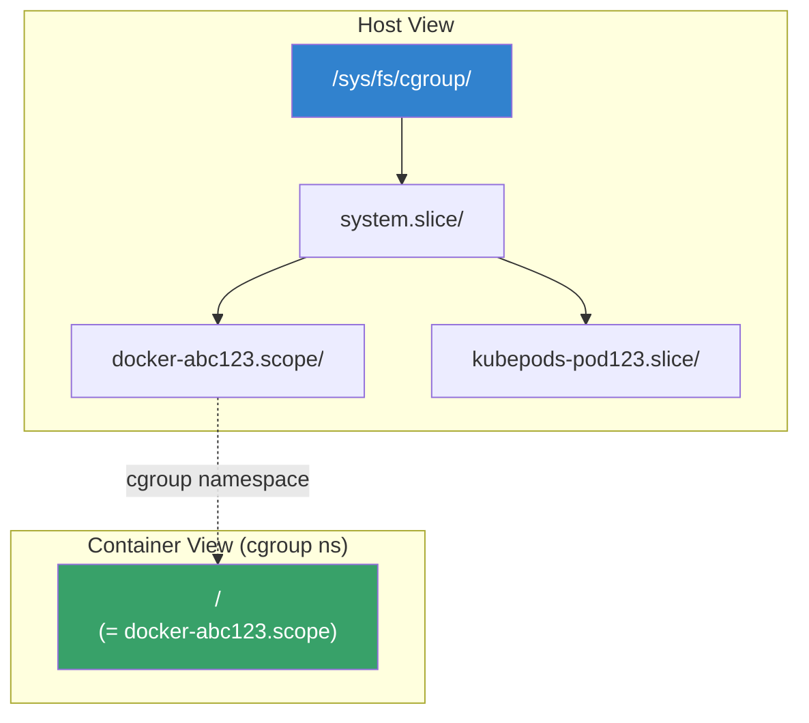
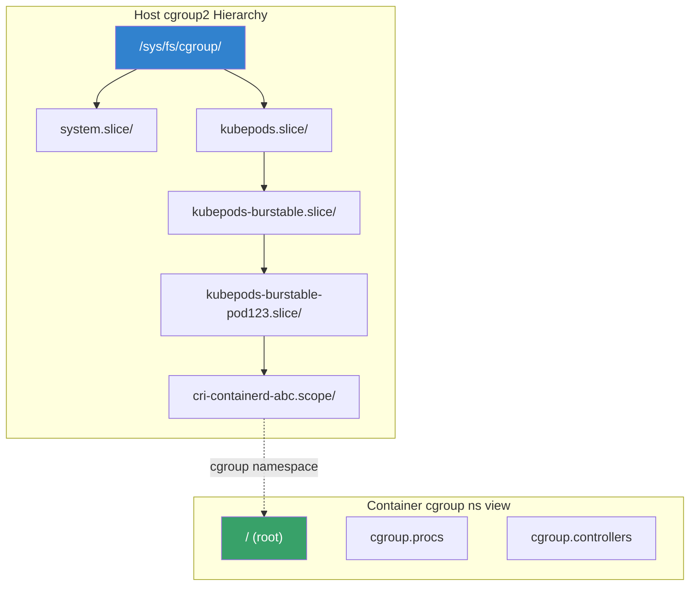
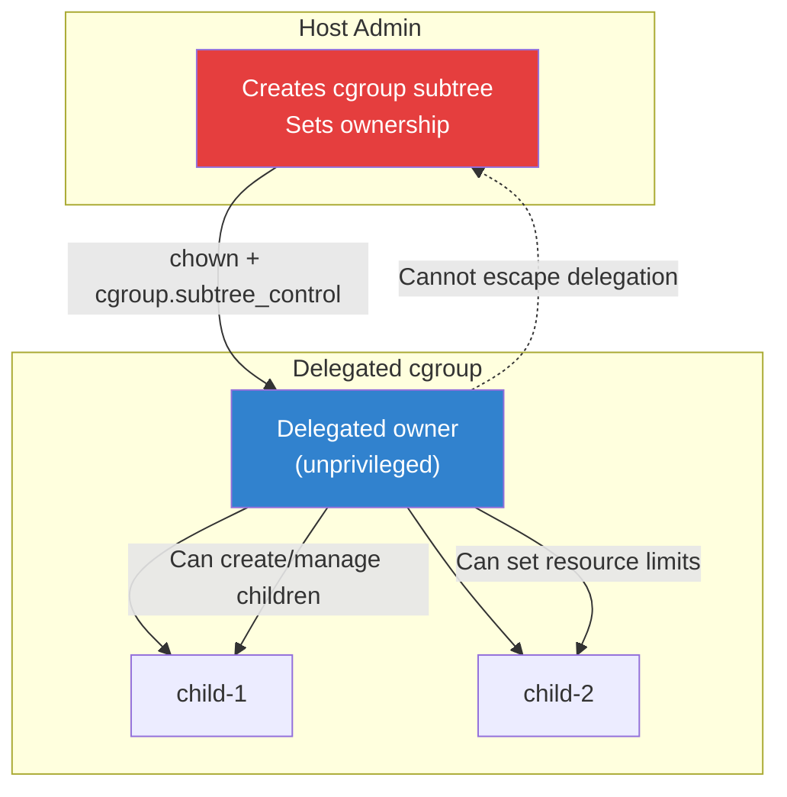
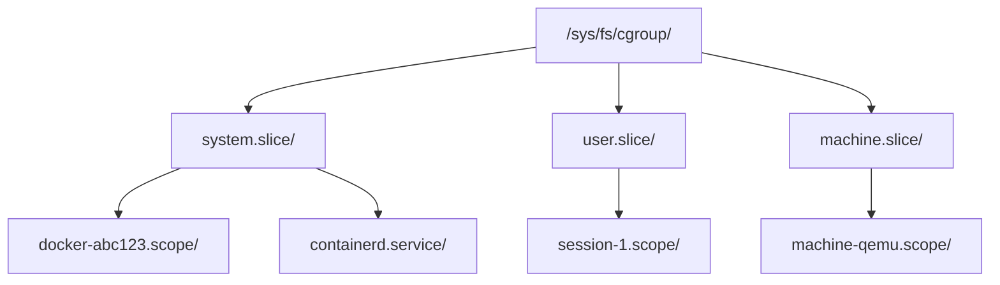
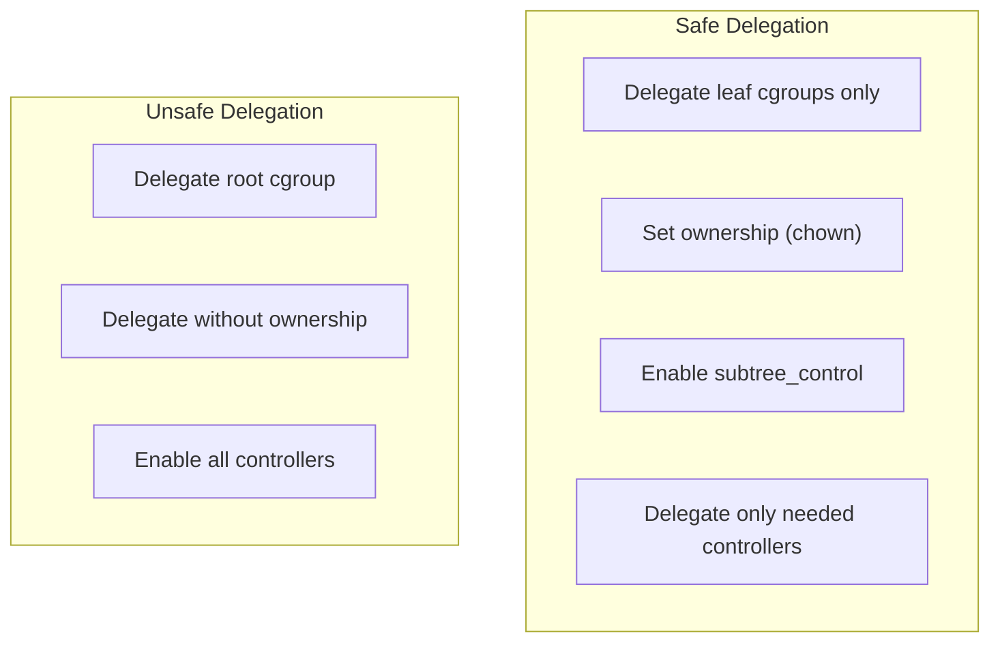
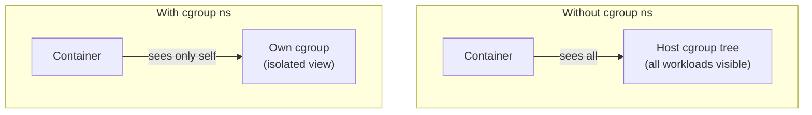

# Cgroup Namespace: Isolation and Delegation

## Introduction

A cgroup namespace virtualizes the cgroup hierarchy, providing a process with its own view of the cgroup filesystem. Introduced in Linux 4.6 (2016), cgroup namespaces allow a container to see its own cgroup as the root (`/`), hiding the full host cgroup hierarchy. This is essential for:

- **Container isolation** — containers see `/` instead of the full host path
- **Delegation** — unprivileged processes can manage their own cgroup subtree
- **Security** — prevents containers from learning about other workloads
- **Kubernetes integration** — kubelet uses cgroup namespaces for pod isolation

## How Cgroup Namespaces Work

Without a cgroup namespace, a process in a container sees its full host cgroup path:

```
# Without cgroup namespace:
/proc/self/cgroup → 0::/system.slice/docker-abc123.scope

# With cgroup namespace:
/proc/self/cgroup → 0::/
```



## Creating Cgroup Namespaces

### Using clone()

```c
#define _GNU_SOURCE
#include <sched.h>
#include <stdio.h>
#include <stdlib.h>
#include <unistd.h>
#include <sys/wait.h>
#include <sys/mount.h>

#define STACK_SIZE (1024 * 1024)

static char child_stack[STACK_SIZE];

static int child_func(void *arg)
{
    /* In new cgroup namespace */
    char buf[256];
    FILE *f = fopen("/proc/self/cgroup", "r");
    if (f) {
        fgets(buf, sizeof(buf), f);
        printf("Child cgroup: %s", buf);
        fclose(f);
    }

    /* The process sees its cgroup as root */
    execlp("bash", "bash", NULL);
    return 0;
}

int main(void)
{
    /* Unshare cgroup namespace */
    pid_t pid = clone(child_func,
                      child_stack + STACK_SIZE,
                      CLONE_NEWCGROUP | CLONE_NEWPID | SIGCHLD,
                      NULL);

    if (pid < 0) {
        perror("clone");
        return 1;
    }

    waitpid(pid, NULL, 0);
    return 0;
}
```

### Using unshare

```bash
# Create new cgroup namespace
sudo unshare --cgroup bash

# Inside the namespace:
cat /proc/self/cgroup
# 0::/   (shows / instead of full path)

# Verify the namespace
ls -la /proc/self/ns/cgroup
# lrwxrwxrwx ... cgroup -> 'cgroup:[402653XXXX]'

# Compare with host
# Host:    0::/system.slice/container-XYZ.scope
# Inside:  0::/
```

### Using nsenter

```bash
# Enter existing cgroup namespace of a container
sudo nsenter --cgroup --target <pid> bash

# Inside, you see the container's cgroup view
cat /proc/self/cgroup
```

## Cgroup Namespaces in Containers

### Docker and cgroup Namespaces

```bash
# Docker uses cgroup namespaces by default (since Docker 20.10)
docker run --rm ubuntu cat /proc/self/cgroup
# Output: 0::/

# Disable cgroup namespace (host cgroup view)
docker run --rm --cgroupns=host ubuntu cat /proc/self/cgroup
# Output: 0::/system.slice/docker-<id>.scope

# Check Docker cgroup namespace mode
docker info --format '{{.CgroupDriver}}'
```

### containerd and Cgroup Namespaces

```toml
# /etc/containerd/config.toml
[plugins."io.containerd.grpc.v1.cri".containerd]
  default_runtime_name = "runc"

[plugins."io.containerd.grpc.v1.cri".containerd.runtimes.runc]
  runtime_type = "io.containerd.runc.v2"
  [plugins."io.containerd.grpc.v1.cri".containerd.runtimes.runc.options]
    SystemdCgroup = true
```

### Kubernetes and Cgroup Namespaces

```yaml
# Pod spec with cgroup namespace (default in K8s 1.25+)
apiVersion: v1
kind: Pod
metadata:
  name: cgroup-ns-demo
spec:
  containers:
  - name: app
    image: ubuntu
    command: ["sleep", "infinity"]
    securityContext:
      # Cgroup namespace is enabled by default
      # No explicit configuration needed
```

## Cgroup v2 and Namespaces

### Cgroup v2 Hierarchy



### Cgroup v2 Delegation

```bash
# On the host, delegate a cgroup subtree to a container
# This allows the container to manage its own cgroup children

# Create a delegated cgroup
sudo mkdir /sys/fs/cgroup/my-delegation

# Set ownership (for unprivileged delegation)
sudo chown -R 1000:1000 /sys/fs/cgroup/my-delegation

# Enable controllers for delegation
echo "+cpu +memory +io" | sudo tee /sys/fs/cgroup/cgroup.subtree_control

# Create child cgroups inside the delegated group
# (works from unprivileged process after cgroup namespace)
mkdir /sys/fs/cgroup/my-delegation/workload
echo $$ > /sys/fs/cgroup/my-delegation/workload/cgroup.procs

# Set resource limits (inside namespace)
echo "100M" > /sys/fs/cgroup/my-delegation/workload/memory.max
echo "50000 100000" > /sys/fs/cgroup/my-delegation/workload/cpu.max
```

### Delegation Security Model



## Practical Examples

### Example 1: Isolated Container with Cgroup Namespace

```c
#define _GNU_SOURCE
#include <sched.h>
#include <stdio.h>
#include <stdlib.h>
#include <unistd.h>
#include <sys/wait.h>
#include <sys/mount.h>
#include <sys/syscall.h>

static int container_func(void *arg)
{
    /* Mount proc for new PID namespace */
    mount("proc", "/proc", "proc", 0, NULL);

    /* Verify cgroup isolation */
    printf("=== Container cgroup view ===\n");
    system("cat /proc/self/cgroup");
    printf("\n=== Container cgroup tree ===\n");
    system("ls /sys/fs/cgroup/");

    /* Set resource limits */
    FILE *f;
    f = fopen("/sys/fs/cgroup/memory.max", "w");
    if (f) { fprintf(f, "104857600"); fclose(f); } /* 100MB */

    f = fopen("/sys/fs/cgroup/cpu.max", "w");
    if (f) { fprintf(f, "50000 100000"); fclose(f); } /* 50% CPU */

    execlp("bash", "bash", NULL);
    return 0;
}

int main(void)
{
    char stack[1024 * 1024];
    pid_t pid = clone(container_func,
                      stack + sizeof(stack),
                      CLONE_NEWCGROUP | CLONE_NEWPID |
                      CLONE_NEWNS | CLONE_NEWUTS | SIGCHLD,
                      NULL);
    waitpid(pid, NULL, 0);
    return 0;
}
```

### Example 2: Monitoring Container Resources from Host

```bash
#!/bin/bash
# monitor-container.sh — Show container resource usage

CONTAINER_CGROUP="$1"
if [ -z "$CONTAINER_CGROUP" ]; then
    echo "Usage: $0 <cgroup-path>"
    exit 1
fi

CGROUP_PATH="/sys/fs/cgroup/$CONTAINER_CGROUP"

echo "=== Container: $CONTAINER_CGROUP ==="

if [ -f "$CGROUP_PATH/memory.current" ]; then
    echo "Memory: $(cat $CGROUP_PATH/memory.current) bytes"
    echo "Memory max: $(cat $CGROUP_PATH/memory.max)"
fi

if [ -f "$CGROUP_PATH/cpu.stat" ]; then
    echo "CPU usage:"
    cat "$CGROUP_PATH/cpu.stat"
fi

if [ -f "$CGROUP_PATH/pids.current" ]; then
    echo "PIDs: $(cat $CGROUP_PATH/pids.current)"
fi

echo "Processes in cgroup:"
cat "$CGROUP_PATH/cgroup.procs" | head -10
```

### Example 3: cgroup v2 Pressure Stall Information

```bash
# Check PSI (Pressure Stall Information) for a container
cat /sys/fs/cgroup/<container>/memory.pressure
# some avg10=0.00 avg60=0.00 avg300=0.00 total=0
# full avg10=0.00 avg60=0.00 avg300=0.00 total=0

cat /sys/fs/cgroup/<container>/cpu.pressure
# some avg10=2.50 avg60=1.20 avg300=0.80 total=123456

cat /sys/fs/cgroup/<container>/io.pressure
# some avg10=0.00 avg60=0.00 avg300=0.00 total=0
```

## Cgroup Namespace vs Other Isolation Mechanisms

| Mechanism | What It Isolates | Container Use |
|-----------|-----------------|---------------|
| `CLONE_NEWCGROUP` | cgroup hierarchy view | Hide host cgroup tree |
| `CLONE_NEWPID` | Process IDs | PID 1 = container init |
| `CLONE_NEWNS` | Mount points | Separate filesystem view |
| `CLONE_NEWNET` | Network stack | Container networking |
| `CLONE_NEWUTS` | Hostname | Container hostname |
| `CLONE_NEWIPC` | IPC resources | Shared memory isolation |
| `CLONE_NEWUSER` | User/group IDs | UID mapping |

## Troubleshooting

### Common Issues

| Symptom | Cause | Solution |
|---------|-------|----------|
| Container sees host cgroup path | cgroup namespace not created | Add `--cgroupns=private` to container runtime |
| "Permission denied" on cgroup writes | Missing delegation | Set `cgroup.subtree_control` on parent |
| Cgroup controllers missing in namespace | Not delegated | Enable controllers in parent cgroup |
| `/proc/self/cgroup` shows old path | Stale namespace | Create new cgroup namespace |
| Cannot create child cgroups | Not cgroup2 or no delegation | Switch to cgroup v2 and delegate |

### Debugging

```bash
# Check if cgroup namespace is enabled
ls -la /proc/<pid>/ns/cgroup

# Compare cgroup views
# Host:
cat /proc/<container-pid>/cgroup
# Shows full path: 0::/system.slice/docker-XYZ.scope

# Inside container (cgroup namespace):
cat /proc/self/cgroup
# Shows: 0::/

# Check cgroup version
stat -fc %T /sys/fs/cgroup/
# cgroup2fs = cgroup v2
# tmpfs = cgroup v1

# List cgroup namespaces
lsns -t cgroup

# Check cgroup delegation
cat /sys/fs/cgroup/<parent>/cgroup.subtree_control
```

### Kernel Configuration

```bash
# Enable cgroup namespace support
CONFIG_CGROUPS=y
CONFIG_CGROUP_NS=y  # (usually enabled with namespaces)
CONFIG_CGROUP_V2=y

# Check if enabled
zgrep CONFIG_CGROUP_NS /proc/config.gz
```

## Cgroup v1 vs v2 Namespaces

### Key Differences

Cgroup namespaces work differently with cgroup v1 and v2:

| Feature | cgroup v1 | cgroup v2 |
|---------|-----------|-----------|
| Namespace support | Yes (Linux 4.6+) | Yes (Linux 4.6+) |
| Hierarchy | Multiple hierarchies | Single hierarchy |
| Delegation | Complex (per-controller) | Simple (subtree_control) |
| Container view | Hides path per controller | Hides unified path |
| Resource control | Per-controller limits | Unified controllers |

### Migration from v1 to v2

```bash
# Check current cgroup version
$ stat -fc %T /sys/fs/cgroup/
cgroup2fs  # cgroup v2
# tmpfs    # cgroup v1

# Check which version a container uses
$ docker inspect --format '{{.HostConfig.CgroupnsMode}}' <container>
private   # cgroup namespace enabled
host      # no cgroup namespace

# Kubernetes cgroup driver (must match runtime)
# /var/lib/kubelet/config.yaml
cgroupDriver: systemd  # or cgroupfs
```

## systemd Cgroup Integration

systemd manages the cgroup hierarchy on most modern Linux distributions.
Understanding how systemd interacts with cgroup namespaces is critical
for container operators.

### systemd Slice Hierarchy



```bash
# View systemd cgroup tree
systemd-cgls

# View cgroup resource usage
systemd-cgtop

# Check which slice a container is in
docker inspect --format '{{.HostConfig.CgroupParent}}' <container>
# Usually: /system.slice or custom slice
```

### Delegating Cgroups to Container Runtimes

systemd can delegate cgroup subtrees to container runtimes:

```ini
# /etc/systemd/system/containerd.service.d/delegate.conf
[Service]
Delegate=cpu cpuset io memory pids
```

```bash
# Reload systemd configuration
systemctl daemon-reload
systemctl restart containerd

# Verify delegation
cat /sys/fs/cgroup/system.slice/containerd.service/cgroup.subtree_control
# cpu cpuset io memory pids
```

### systemd-nspawn with Cgroup Namespaces

systemd-nspawn uses cgroup namespaces by default:

```bash
# Launch container with cgroup namespace
systemd-nspawn -D /srv/mycontainer --boot

# Inside container:
cat /proc/self/cgroup
# 0::/

# Verify cgroup namespace
ls -la /proc/self/ns/cgroup
# cgroup -> 'cgroup:[402653XXXX]'
```

### Kubernetes and systemd Cgroup Driver

Kubernetes uses either `systemd` or `cgroupfs` as the cgroup driver:

```yaml
# /var/lib/kubelet/config.yaml
cgroupDriver: systemd

# Container runtime must match
# containerd config:
[plugins."io.containerd.grpc.v1.cri".containerd.runtimes.runc.options]
  SystemdCgroup = true
```

```bash
# Check kubelet cgroup driver
journalctl -u kubelet | grep cgroup-driver

# Migrate from cgroupfs to systemd
# 1. Drain node
kubectl drain <node> --ignore-daemonsets
# 2. Stop kubelet and container runtime
# 3. Reconfigure both to use systemd
# 4. Restart services
# 5. Uncordon node
kubectl uncordon <node>
```

## Cgroup v2 Delegation Patterns

### Pattern 1: Flat Delegation

```bash
# Create a flat delegation for a container runtime
sudo mkdir /sys/fs/cgroup/containers
sudo chown container-user:container-user /sys/fs/cgroup/containers

# Enable controllers for delegation
echo "+cpu +memory +io +pids" | sudo tee /sys/fs/cgroup/cgroup.subtree_control

# Container runtime creates children
mkdir /sys/fs/cgroup/containers/container-1
echo $$ > /sys/fs/cgroup/containers/container-1/cgroup.procs
echo "512M" > /sys/fs/cgroup/containers/container-1/memory.max
```

### Pattern 2: Hierarchical Delegation

```bash
# Nested delegation for multi-tenant environments
sudo mkdir /sys/fs/cgroup/tenant-a
sudo mkdir /sys/fs/cgroup/tenant-a/app-1
sudo mkdir /sys/fs/cgroup/tenant-a/app-2

# Tenant admin manages their subtree
sudo chown -R tenant-admin:tenant-admin /sys/fs/cgroup/tenant-a

# Enable intermediate controllers
echo "+cpu +memory" | sudo tee /sys/fs/cgroup/tenant-a/cgroup.subtree_control

# App owner manages their cgroup
sudo chown app-user:app-user /sys/fs/cgroup/tenant-a/app-1
```

### Delegation Safety Rules



**Rules for safe delegation:**
1. Never delegate the root cgroup
2. Always set ownership before enabling `subtree_control`
3. Only delegate controllers the tenant needs
4. Use `nsdelegate` mount option to enforce namespace boundaries
5. Monitor delegated cgroups for abuse

## Container Runtime Cgroup Namespace Modes

| Runtime | Default Mode | Options | Notes |
|---------|-------------|---------|-------|
| Docker 20.10+ | `private` | `private`, `host` | cgroup ns enabled by default |
| Podman 3.0+ | `private` | `private`, `host`, `container:<id>` | Full cgroup ns support |
| containerd | `private` | Config via CRI | Kubernetes default |
| CRI-O | `private` | Config via CRI | Kubernetes default |
| LXC 4.0+ | `private` | `private`, `host` | Full support |

```bash
# Docker: check cgroup namespace mode
docker inspect --format '{{.HostConfig.CgroupnsMode}}' <container>

# Podman: specify cgroup namespace
podman run --cgroupns=private ubuntu cat /proc/self/cgroup
podman run --cgroupns=host ubuntu cat /proc/self/cgroup
```

## Advanced Debugging

### Inspecting Cgroup Namespace Identity

```bash
# Get cgroup namespace inode number
grep cgroup /proc/<pid>/ns/cgroup
# or
readlink /proc/<pid>/ns/cgroup
# cgroup:[4026531835]

# Compare two processes' cgroup namespaces
NS1=$(readlink /proc/<pid1>/ns/cgroup | cut -d: -f2)
NS2=$(readlink /proc/<pid2>/ns/cgroup | cut -d: -f2)
if [ "$NS1" = "$NS2" ]; then
    echo "Same cgroup namespace"
else
    echo "Different cgroup namespaces"
fi

# List all cgroup namespaces on the system
lsns -t cgroup
# NS TYPE  NPROCS PID USER COMMAND
# 4026531835 cgroup 150 1 root /sbin/init
# 4026532456 cgroup 5 1234 root container-init
```

### Tracing Cgroup Operations

```bash
# Trace cgroup operations with ftrace
echo 1 > /sys/kernel/debug/tracing/events/cgroup/cgroup_mkdir/enable
echo 1 > /sys/kernel/debug/tracing/events/cgroup/cgroup_rmdir/enable
echo 1 > /sys/kernel/debug/tracing/events/cgroup/cgroup_attach_task/enable

cat /sys/kernel/debug/tracing/trace_pipe
# <...>-1234 [001] .... 12345.678: cgroup_mkdir: root=/ cgroup=container-1
# <...>-1234 [001] .... 12345.679: cgroup_attach_task: root=/ cgroup=container-1 pid=5678

# Disable tracing
echo 0 > /sys/kernel/debug/tracing/events/cgroup/enable
```

### Monitoring Cgroup Resource Usage

```bash
#!/bin/bash
# cgroup-ns-monitor.sh — Monitor container cgroup resources

CONTAINER_PID=$1
if [ -z "$CONTAINER_PID" ]; then
    echo "Usage: $0 <container-pid>"
    exit 1
fi

# Get cgroup path from container's perspective
CGROUP_PATH=$(cat /proc/$CONTAINER_PID/cgroup | cut -d: -f3)

# Full host path
HOST_CGROUP="/sys/fs/cgroup${CGROUP_PATH}"

if [ ! -d "$HOST_CGROUP" ]; then
    echo "Error: cgroup path not found: $HOST_CGROUP"
    exit 1
fi

echo "=== Container $CONTAINER_PID ==="
echo "Cgroup: $CGROUP_PATH"
echo ""

# Memory usage
echo "Memory:"
echo "  Current: $(cat $HOST_CGROUP/memory.current 2>/dev/null || echo 'N/A') bytes"
echo "  Max: $(cat $HOST_CGROUP/memory.max 2>/dev/null || echo 'N/A') bytes"
echo "  Events:"
cat $HOST_CGROUP/memory.events 2>/dev/null | sed 's/^/    /'

echo ""
echo "CPU:"
cat $HOST_CGROUP/cpu.stat 2>/dev/null | sed 's/^/    /'

echo ""
echo "Processes: " $(wc -l < $HOST_CGROUP/cgroup.procs 2>/dev/null || echo '0')
```

## Performance Implications

### Cgroup Namespace Overhead

The cgroup namespace itself has minimal overhead:
- **Creation**: One additional kernel data structure per namespace
- **/proc translation**: Trivial path rewriting
- **No runtime cost**: No per-syscall overhead

```bash
# Measure cgroup namespace creation time
# Create 1000 cgroup namespaces
for i in $(seq 1 1000); do
    unshare --cgroup true
done
# Typically < 1ms per namespace
```

### Cgroup v2 Controller Overhead

The real overhead comes from resource controllers, not the namespace:

```bash
# Memory controller overhead
# Per-page accounting adds ~1-3% overhead

# CPU controller overhead
# CFS bandwidth control adds <1% overhead

# IO controller overhead
# BFQ/cfq adds measurable I/O latency
```

## Security Implications

### Information Leak Prevention

Without cgroup namespaces, a container can enumerate all cgroups on the host:

```bash
# Without cgroup namespace -- information leak
$ docker run --rm --cgroupns=host ubuntu cat /proc/self/cgroup
0::/system.slice/docker-abc123.scope

# Container can see other cgroups:
$ ls /sys/fs/cgroup/
# system.slice/  user.slice/  docker-xyz.scope/  kubepods/...
# Reveals: other containers, system services, user sessions
```

With cgroup namespaces, the container only sees its own subtree:

```bash
# With cgroup namespace (default)
$ docker run --rm ubuntu cat /proc/self/cgroup
0::/

$ docker run --rm ubuntu ls /sys/fs/cgroup/
# Only shows files in the container's own cgroup
# cgroup.procs  cgroup.controllers  cgroup.subtree_control  ...
```

### Capability Requirements

Creating a cgroup namespace requires `CAP_SYS_ADMIN` in the current
user namespace.  Unprivileged users can create cgroup namespaces only if
cgroup delegation is properly configured:

```bash
# Check if user can create cgroup namespace
$ unshare --cgroup echo "OK"
# Fails without privilege

# With proper delegation (rootless containers)
$ podman run --rm ubuntu cat /proc/self/cgroup
0::/  # Works with user namespace + cgroup delegation
```

### Attack Surface Reduction

Cgroup namespaces reduce the attack surface by:

1. **Hiding host topology**: Containers cannot discover other workloads
2. **Preventing cgroup escapes**: Delegation boundaries are enforced
3. **Limiting information**: No visibility into resource limits of others
4. **Supporting rootless**: Enables unprivileged cgroup management



## Further Reading

- [cgroup_namespaces(7) man page](https://man7.org/linux/man-pages/man7/cgroup_namespaces.7.html)
- [cgroups(7) man page](https://man7.org/linux/man-pages/man7/cgroups.7.html)
- [Linux kernel cgroup documentation](https://www.kernel.org/doc/html/latest/admin-guide/cgroup-v2.html)
- [LWN: Cgroup namespaces](https://lwn.net/Articles/671779/)
- [Kubernetes cgroup management](https://kubernetes.io/docs/concepts/architecture/cgroups/)
- [Container runtime cgroup isolation](https://kubernetes.io/docs/setup/production-environment/container-runtimes/)

## See Also

- [cgroups v2](./cgroups-v2.md) — cgroup v2 resource management
- [Docker Internals](./docker-internals.md) — container implementation details
- [Namespaces](../networking/namespaces.md) — Linux namespace overview
- [Podman](./podman.md) — rootless containers with cgroup namespaces
- [Rootless Containers](./rootless.md) — unprivileged container operation
