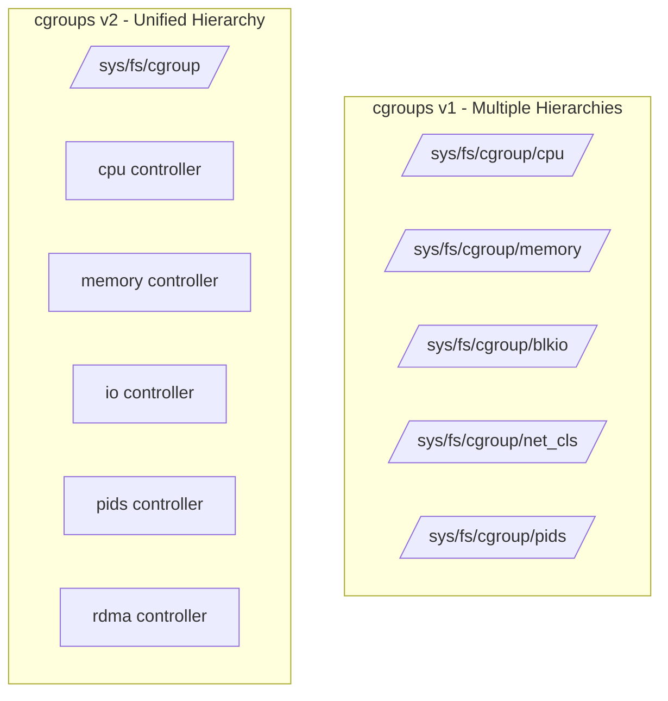
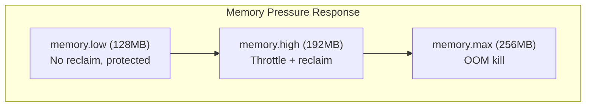
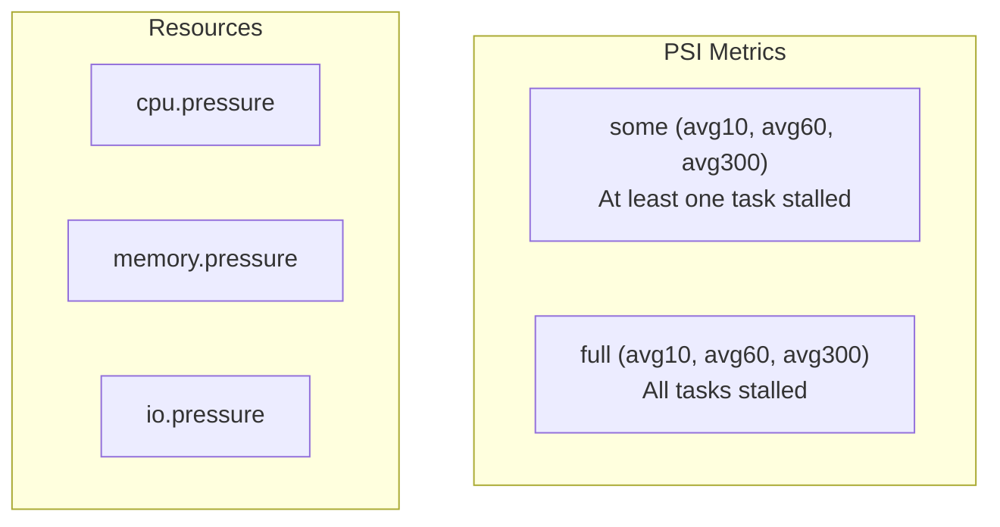

# cgroups v2

## Introduction

Control groups (cgroups) are a Linux kernel feature for organizing processes into hierarchical groups and applying resource limits, accounting, and control. cgroups v2 (also called "unified hierarchy") is the second, improved version of the cgroups API, addressing many design issues in cgroups v1.

cgroups v2 is the foundation of container resource management — every container runtime (Docker, Podman, containerd, CRI-O) uses cgroups to enforce CPU, memory, I/O, and other resource limits. Understanding cgroups v2 is essential for container performance tuning, debugging resource issues, and building container orchestration systems.

## cgroups v1 vs v2



| Aspect | cgroups v1 | cgroups v2 |
|--------|-----------|-----------|
| Hierarchy | Multiple (per-controller) | Single unified |
| Processes | In multiple groups simultaneously | Only leaf nodes |
| Thread control | Limited | Full threaded mode |
| Delegation | Complex, unsafe | Simple, safe |
| Memory accounting | Separate hierarchies | Unified |
| PSI | ❌ | ✅ (Pressure Stall Information) |
| BPF integration | Limited | ✅ (bpf-based controllers) |

```bash
# Check which cgroup version is in use
stat -fc %T /sys/fs/cgroup/
# cgroup2fs  (v2)
# tmpfs      (v1)

# Or:
mount | grep cgroup
# cgroup2 on /sys/fs/cgroup type cgroup2 (rw,nosuid,nodev,noexec,relatime,nsdelegate,memory_recursiveprot)
```

## Unified Hierarchy

In cgroups v2, all controllers exist in a single hierarchy rooted at `/sys/fs/cgroup/`:

```bash
# cgroups v2 hierarchy
ls /sys/fs/cgroup/
# cgroup.controllers      # Available controllers
# cgroup.subtree_control  # Enabled controllers for children
# cgroup.procs            # Processes in this cgroup
# cgroup.threads          # Threads in this cgroup
# cgroup.type             # domain or threaded
# system.slice/           # systemd managed
# user.slice/
# init.scope/

# Available controllers
cat /sys/fs/cgroup/cgroup.controllers
# cpuset cpu io memory hugetlb pids rdma misc

# Enabled for children
cat /sys/fs/cgroup/cgroup.subtree_control
# cpuset cpu io memory pids

# Enable a controller for children
echo "+memory +io" > /sys/fs/cgroup/cgroup.subtree_control
```

### Cgroup Directory Structure

```bash
# Each cgroup directory contains control files
mkdir /sys/fs/cgroup/my-group

ls /sys/fs/cgroup/my-group/
# cgroup.controllers      # What controllers are available
# cgroup.events           # populated: 0/1, frozen: 0/1
# cgroup.freeze           # Freeze/thaw the group
# cgroup.kill             # Kill all processes (write 1)
# cgroup.max.depth        # Max nesting depth
# cgroup.max.descendants  # Max number of child cgroups
# cgroup.procs            # Member processes (PIDs)
# cgroup.stat             # nr_descendants, nr_dying_descendants
# cgroup.subtree_control  # Controllers enabled for children
# cgroup.threads          # Member threads (TIDs)
# cgroup.type             # domain / domain threaded / threaded

# cpu.max
# cpu.max.burst
# cpu.stat
# cpu.weight
# cpu.weight.nice
# cpu.pressure
# cpu.uclamp.min
# cpu.uclamp.max

# memory.current
# memory.min
# memory.low
# memory.high
# memory.max
# memory.swap.current
# memory.swap.max
# memory.pressure
# memory.stat
# memory.events

# io.max
# io.latency
# io.cost.qos
# io.cost.model
# io.stat
# io.pressure
# io.weight
```

## CPU Controller

The CPU controller manages CPU bandwidth and scheduling:

```mermaid
graph TB
    subgraph /sys/fs/cgroup/
        ROOT_CPU[cpu.max: "max 100000"]
        ROOT_WEIGHT[cpu.weight: 100]
    end
    subgraph my-app/
        APP_CPU[cpu.max: "50000 100000"<br/>50% of one CPU]
        APP_WEIGHT[cpu.weight: 200]
        APP_STAT[cpu.stat]
    end
    subgraph my-worker/
        WORK_CPU[cpu.max: "200000 100000"<br/>2 CPUs]
        WORK_WEIGHT[cpu.weight: 100]
    end
    ROOT_CPU --> APP_CPU
    ROOT_CPU --> WORK_CPU
```

### cpu.max — Bandwidth Limiting

```bash
# cpu.max format: "$MAX $PERIOD"
# $MAX: max microseconds per period (or "max" for unlimited)
# $PERIOD: period length in microseconds (default 100000 = 100ms)

# Limit to 50% of one CPU
echo "50000 100000" > /sys/fs/cgroup/my-app/cpu.max

# Limit to 2 full CPUs
echo "200000 100000" > /sys/fs/cgroup/my-worker/cpu.max

# Unlimited (default)
echo "max 100000" > /sys/fs/cgroup/my-app/cpu.max

# Read current setting
cat /sys/fs/cgroup/my-app/cpu.max
# 50000 100000

# Check CPU throttling statistics
cat /sys/fs/cgroup/my-app/cpu.stat
# usage_usec 12345678
# user_usec 10000000
# system_usec 2345678
# nr_periods 1000
# nr_throttled 50
# throttled_usec 1234567
# nr_bursts 0
# burst_usec 0
```

### cpu.weight — Proportional Share

```bash
# cpu.weight: 1-10000 (default 100)
# Relative share of CPU time when under contention

# Container with double priority
echo "200" > /sys/fs/cgroup/my-app/cpu.weight

# Container with half priority
echo "50" > /sys/fs/cgroup/my-worker/cpu.weight

# Under contention:
# my-app gets 200/(200+50) = 80% of CPU
# my-worker gets 50/(200+50) = 20% of CPU

# With no contention, both can use 100% CPU
```

### CPU Throttling Example

```bash
# Create a CPU-limited cgroup
mkdir /sys/fs/cgroup/stress-test

# Limit to 10% of one CPU
echo "10000 100000" > /sys/fs/cgroup/stress-test/cpu.max

# Run a CPU-heavy process
stress-ng --cpu 4 &
echo $! > /sys/fs/cgroup/stress-test/cgroup.procs

# Monitor throttling
watch -n1 cat /sys/fs/cgroup/stress-test/cpu.stat
# nr_throttled increases rapidly
# The process only gets 10ms of CPU per 100ms period
```

### cpu.uclamp — Utilization Clamping

```bash
# cpu.uclamp.min: minimum utilization percentage (0-100)
# cpu.uclamp.max: maximum utilization percentage (0-100)

# Ensure a container gets at least 25% CPU capacity
echo "25.00" > /sys/fs/cgroup/my-app/cpu.uclamp.min

# Cap reported utilization at 75% (prevents frequency boost)
echo "75.00" > /sys/fs/cgroup/my-app/cpu.uclamp.max
```

## Memory Controller

The memory controller tracks and limits memory usage:

### Memory Limits

```bash
# Create memory-limited cgroup
mkdir /sys/fs/cgroup/mem-test

# Set memory limit to 256MB
echo "268435456" > /sys/fs/cgroup/mem-test/memory.max

# Set memory high (soft limit — triggers reclaim)
echo "201326592" > /sys/fs/cgroup/mem-test/memory.high

# Set memory min (guaranteed minimum)
echo "67108864" > /sys/fs/cgroup/mem-test/memory.min  # 64MB guaranteed

# Set swap limit
echo "134217728" > /sys/fs/cgroup/mem-test/memory.swap.max  # 128MB swap

# Disable swap entirely
echo "0" > /sys/fs/cgroup/mem-test/memory.swap.max

# Read current usage
cat /sys/fs/cgroup/mem-test/memory.current
# 134217728  (128MB)
```

### Memory Thresholds



| Threshold | Behavior | Analogy |
|-----------|----------|---------|
| `memory.min` | Guaranteed memory, never reclaimed | Reservation |
| `memory.low` | Best-effort protection | Soft guarantee |
| `memory.high` | Throttle processes, trigger reclaim | Soft limit |
| `memory.max` | Hard limit, OOM kill if exceeded | Hard limit |
| `memory.swap.max` | Maximum swap usage | Swap limit |

### Memory Statistics

```bash
cat /sys/fs/cgroup/mem-test/memory.stat
# anon 134217728          # Anonymous memory (heap, stack)
# file 0                  # Page cache
# kernel 4194304          # Kernel memory (slab, stack)
# kernel_stack 262144     # Kernel stack
# pagetables 1048576      # Page table overhead
# sec_pagetables 0        # Secondary page tables
# percpu 0                # Per-CPU allocations
# sock 0                  # Network socket buffers
# vmalloc 0               # vmalloc allocations
# shmem 0                 # Shared memory (tmpfs, shm)
# zswap 0                 # Compressed swap
# zswapped 0
# file_mapped 0           # Memory-mapped files
# file_dirty 0            # Dirty pages
# file_writeback 0        # Pages being written to disk
# swapcached 0            # Swap cache
# anon_thp 0              # Transparent huge pages
# file_thp 0              # File-backed huge pages
# shmem_thp 0             # Shared memory huge pages
# inactive_anon 0         # LRU: inactive anonymous
# active_anon 134217728   # LRU: active anonymous
# inactive_file 0         # LRU: inactive file cache
# active_file 0           # LRU: active file cache
# unevictable 0           # Cannot be reclaimed
# slab_reclaimable 0      # Reclaimable slab
# slab_unreclaimable 0    # Unreclaimable slab
# pgfault 1234            # Page faults
# pgmajfault 0            # Major page faults (disk I/O)
# workingset_refault_anon 0
# workingset_refault_file 0
# workingset_activate_anon 0
# workingset_activate_file 0
# workingset_restore_anon 0
# workingset_restore_file 0
# workingset_nodereclaim 0
# pgscan 0                # Pages scanned by reclaim
# pgsteal 0               # Pages reclaimed
# pgscan_kswapd 0         # Background reclaim scans
# pgscan_direct 0         # Direct reclaim scans
# pgsteal_kswapd 0
# pgsteal_direct 0
# pgactivate 0
# pgdeactivate 0
# pglazyfree 0
# pglazyfreed 0
# thp_fault_alloc 0
# thp_collapse_alloc 0
```

### Memory Events

```bash
# Memory pressure events
cat /sys/fs/cgroup/mem-test/memory.events
# low 5           # Times memory.low was breached
# high 12         # Times memory.high was breached
# max 2           # Times memory.max was breached (OOM)
# oom 1           # Times OOM killer was invoked
# oom_group_kill 0 # Times entire group was killed
# oom_group_oom 0

# Event counts (persists even when empty)
cat /sys/fs/cgroup/mem-test/memory.events.local
```

## I/O Controller

The I/O controller manages block I/O bandwidth:

```bash
# io.max format: "$MAJOR:$MINOR rbps=$RBPS wbps=$WBPS riops=$RIOPS wiops=$WIOPS"

# Limit read to 10MB/s, write to 5MB/s
echo "8:0 rbps=10485760 wbps=5242880" > /sys/fs/cgroup/my-app/io.max

# Limit IOPS
echo "8:0 riops=1000 wiops=500" > /sys/fs/cgroup/my-app/io.max

# Combine bandwidth and IOPS limits
echo "8:0 rbps=10485760 wbps=5242880 riops=1000 wiops=500" > /sys/fs/cgroup/my-app/io.max

# Read current settings
cat /sys/fs/cgroup/my-app/io.max
# 8:0 rbps=10485760 wbps=5242880 riops=1000 wiops=500

# I/O statistics
cat /sys/fs/cgroup/my-app/io.stat
# 8:0 rbytes=1073741824 wbytes=536870912 rios=10000 wios=5000 dbytes=0 dios=0

# I/O cost QoS (proportional I/O when multiple cgroups compete)
echo "8:0 enable=1" > /sys/fs/cgroup/my-app/io.cost.qos
```

### io.latency

```bash
# io.latency: target latency guarantee
# Format: "$MAJOR:$MINOR target=$TARGET_US"
# If I/O latency exceeds target, throttle other cgroups

echo "8:0 target=5000" > /sys/fs/cgroup/important-app/io.latency
# Guarantee < 5ms I/O latency for important-app
```

## PIDs Controller

```bash
# Limit number of processes in a cgroup
mkdir /sys/fs/cgroup/limited

echo "100" > /sys/fs/cgroup/limited/pids.max

# Add a process
sh -c 'echo $$ > /sys/fs/cgroup/limited/cgroup.procs; sleep infinity' &

# Fork bomb protection
echo "50" > /sys/fs/cgroup/limited/pids.max
# Fork bomb is contained within 50 processes

# Check current count
cat /sys/fs/cgroup/limited/pids.current
# 3

# Events
cat /sys/fs/cgroup/limited/pids.events
# max 0  # Times pids.max was hit
```

## Pressure Stall Information (PSI)

PSI measures resource pressure — how much time tasks are stalled waiting for resources:



```bash
# CPU pressure
cat /sys/fs/cgroup/my-app/cpu.pressure
# some avg10=2.50 avg60=1.20 avg300=0.80 total=12345678
# full avg10=0.00 avg60=0.00 avg300=0.00 total=0

# Memory pressure
cat /sys/fs/cgroup/my-app/memory.pressure
# some avg10=15.00 avg60=8.50 avg300=5.20 total=98765432
# full avg10=5.00 avg60=2.10 avg300=1.00 total=45678901

# I/O pressure
cat /sys/fs/cgroup/my-app/io.pressure
# some avg10=0.50 avg60=0.20 avg300=0.10 total=1234567
# full avg10=0.00 avg60=0.00 avg300=0.00 total=0

# Interpretation:
# "some avg10=2.50" → 2.5% of the time, at least one task was stalled
# "full avg10=5.00" → 5% of the time, ALL tasks were stalled (memory)
# "full avg10=0.00" → Tasks never all stalled (CPU — expected)

# PSI triggers (poll for pressure events)
echo "some 50000 1000000" > /sys/fs/cgroup/my-app/memory.pressure
# Trigger event when some memory pressure exceeds 50ms in 1s window
```

### PSI in Container Orchestration

```bash
# Kubernetes can use PSI for scheduling decisions (alpha feature)
# Docker/Podman can monitor PSI for resource management

# Monitor PSI for all cgroups
cat /proc/pressure/cpu
cat /proc/pressure/memory
cat /proc/pressure/io

# System-wide PSI
cat /proc/pressure/cpu
# some avg10=1.20 avg60=0.80 avg300=0.50 total=567890123
# full avg10=0.00 avg60=0.00 avg300=0.00 total=0
```

## Delegation

Delegation allows unprivileged users to manage their own cgroup subtree:

```bash
# Delegate a cgroup subtree to a user
# 1. Create the subtree
mkdir /sys/fs/cgroup/user-workloads

# 2. Set ownership
chown user:user /sys/fs/cgroup/user-workloads

# 3. Enable subtree_control for desired controllers
echo "+cpu +memory +io +pids" > /sys/fs/cgroup/cgroup.subtree_control

# 4. Set delegation marker
echo "1" > /sys/fs/cgroup/user-workloads/cgroup.delegate

# Now 'user' can:
# - Create child cgroups
# - Move their own processes into children
# - Set resource limits on children
# - Read resource statistics

# As 'user':
mkdir /sys/fs/cgroup/user-workloads/my-job
echo "100000 100000" > /sys/fs/cgroup/user-workloads/my-job/cpu.max
echo $$ > /sys/fs/cgroup/user-workloads/my-job/cgroup.procs
```

### Delegation in Container Runtimes

```bash
# Rootless containers delegate cgroups to unprivileged users
# Docker rootless mode:
# 1. dockerd creates cgroup under user's slice
# 2. Uses systemd user instance for cgroup management

# Podman rootless:
# 1. Uses cgroupfs or systemd for cgroup management
# 2. Delegates to user namespace root

# systemd delegation:
# /etc/systemd/system/user@.service.d/delegate.conf
# [Service]
# Delegate=cpu memory io pids
```

## Threaded Cgroups

cgroups v2 supports threaded mode for per-thread resource control:

```bash
# Check cgroup type
cat /sys/fs/cgroup/my-app/cgroup.type
# domain  (default — process-level)

# Enable threaded mode
echo "threaded" > /sys/fs/cgroup/my-app/cgroup.type

# Create thread sub-cgroups
mkdir /sys/fs/cgroup/my-app/thread-1
mkdir /sys/fs/cgroup/my-app/thread-2

# Set per-thread CPU limits
echo "25000 100000" > /sys/fs/cgroup/my-app/thread-1/cpu.max
echo "75000 100000" > /sys/fs/cgroup/my-app/thread-2/cpu.max

# Thread cgroups can only contain threads, not processes
# Only certain controllers work in threaded mode (cpu, cpuset)
```

## Container Integration

### Docker cgroups v2

```bash
# Docker with cgroups v2
docker info | grep "Cgroup Driver"
# Cgroup Driver: systemd
# Cgroup Version: 2

# Container cgroup location
docker run --name test --memory 256m --cpus 1.5 alpine sleep infinity

# Find container cgroup
docker inspect test --format '{{.State.Pid}}'
# 12345

cat /proc/12345/cgroup
# 0::/system.slice/docker-<container-id>.scope

# Check memory limits
cat /sys/fs/cgroup/system.slice/docker-<container-id>.scope/memory.max
# 268435456  (256MB)

# Check CPU limits
cat /sys/fs/cgroup/system.slice/docker-<container-id>.scope/cpu.max
# 150000 100000  (1.5 CPUs)
```

### Kubernetes cgroups v2

```bash
# kubelet with cgroups v2
# Uses systemd cgroup driver by default
# cgroup root: /sys/fs/cgroup/kubepods/

# Pod cgroup structure
ls /sys/fs/cgroup/kubepods/burstable/pod<uid>/
# <container-id>/  # One cgroup per container
# cgroup.controllers
# cgroup.procs
# cpu.max
# memory.max
```

## Practical Examples

### Resource-Limited Container

```bash
#!/bin/bash
# Create a fully resource-limited container using cgroups v2

CGROUP="/sys/fs/cgroup/my-container"
mkdir -p "$CGROUP"

# Enable controllers
echo "+cpu +memory +io +pids" > /sys/fs/cgroup/cgroup.subtree_control

# CPU: 50% of one core
echo "50000 100000" > "$CGROUP/cpu.max"
echo "100" > "$CGROUP/cpu.weight"

# Memory: 256MB limit, 128MB high watermark
echo "268435456" > "$CGROUP/memory.max"
echo "201326592" > "$CGROUP/memory.high"
echo "67108864" > "$CGROUP/memory.min"  # 64MB guaranteed

# I/O: 10MB/s read, 5MB/s write
echo "8:0 rbps=10485760 wbps=5242880" > "$CGROUP/io.max"

# PIDs: max 50 processes
echo "50" > "$CGROUP/pids.max"

# Freeze support
echo "0" > "$CGROUP/cgroup.freeze"  # Not frozen

# Run process in cgroup
echo $$ > "$CGROUP/cgroup.procs"

# Monitor
watch -n1 "
  echo '=== CPU ===' && cat $CGROUP/cpu.stat &&
  echo '=== Memory ===' && echo current: \$(cat $CGROUP/memory.current) &&
  echo '=== PSI ===' && cat $CGROUP/memory.pressure
"
```

## References

1. cgroups v2 Documentation. [https://www.kernel.org/doc/html/latest/admin-guide/cgroup-v2.html](https://www.kernel.org/doc/html/latest/admin-guide/cgroup-v2.html)
2. `cgroups(7)` — Linux man page. [https://man7.org/linux/man-pages/man7/cgroups.7.html](https://man7.org/linux/man-pages/man7/cgroups.7.html)
3. PSI Documentation. [https://www.kernel.org/doc/html/latest/accounting/psi.html](https://www.kernel.org/doc/html/latest/accounting/psi.html)
4. Tejun Heo. "cgroup: Towards Unified Hierarchy." LPC 2014.

## Further Reading

- [The Linux Kernel Documentation](https://docs.kernel.org/)
- [LWN.net - Linux and free software news](https://lwn.net/)
- [GNU Project Documentation](https://www.gnu.org/doc/doc.html)
- [GNU Manuals](https://www.gnu.org/manual/manual.html)
- [Free Software Directory](https://directory.fsf.org/wiki/Main_Page)
- [Planet GNU](https://planet.gnu.org/)
- [Free Software Books](https://www.gnu.org/doc/other-free-books.html)

- [cgroups v2 Kernel Documentation](https://www.kernel.org/doc/html/latest/admin-guide/cgroup-v2.html)
- [PSI — Pressure Stall Information](https://facebookmicrosites.github.io/psi/docs/overview)
- [systemd Resource Control](https://www.freedesktop.org/software/systemd/man/systemd.resource-control.html)
- [Docker cgroups v2](https://docs.docker.com/config/containers/resource_constraints/)
- [Kubernetes Node Resource Management](https://kubernetes.io/docs/concepts/architecture/nodes/)

## Related Topics

- [Container Primitives](./primitives.md) — namespaces and other kernel features
- [Container Overview](./overview.md) — container concepts
- [Docker Internals](./docker-internals.md) — how Docker uses cgroups
- [Kubernetes and Linux](./kubernetes.md) — cgroups in orchestration
