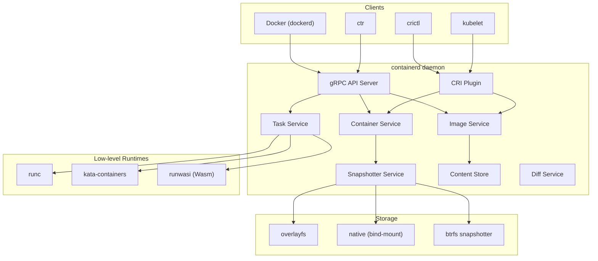
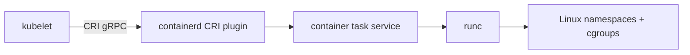
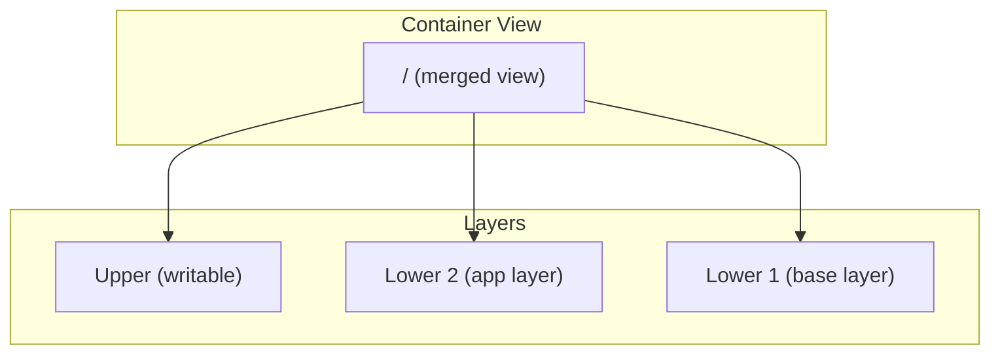

# containerd

containerd is an industry-standard container runtime that serves as the core runtime for
Docker, Kubernetes, and many other container platforms. It manages the complete container
lifecycle: image transfer and storage, container execution and supervision, low-level storage,
and network attachments.

## Introduction

Originally extracted from Docker in 2016, containerd was donated to the Cloud Native Computing
Foundation (CNCF) and graduated as a top-level project in 2019. It provides a clean, stable
API for container management while delegating the actual container execution to lower-level
runtimes like `runc`.

containerd is:

- The default container runtime for Docker (since Docker 1.11)
- A CRI-compliant runtime for Kubernetes (via the CRI plugin)
- Used by Google GKE, AWS EKS, Azure AKS, and most managed Kubernetes services
- Written in Go, with a gRPC API

## Architecture

containerd follows a layered, daemon-based architecture:



### Key Components

| Component          | Purpose                                              |
|--------------------|------------------------------------------------------|
| **Content Store**  | Content-addressable blob storage (images, layers)    |
| **Snapshotter**    | Manages filesystem snapshots for containers          |
| **Image Service**  | Pull, push, and manage container images              |
| **Container Service** | Container metadata and configuration              |
| **Task Service**   | Container execution (create, start, stop, delete)    |
| **CRI Plugin**     | Kubernetes Container Runtime Interface               |
| **Diff Service**   | Computes filesystem diffs for layer creation         |
| **Events Service** | Publishes container lifecycle events                 |

## Installation

```bash
# Ubuntu/Debian
sudo apt install containerd.io

# Or from official repository
curl -fsSL https://download.docker.com/linux/ubuntu/gpg | sudo gpg --dearmor -o /etc/apt/keyrings/docker.gpg
echo "deb [arch=$(dpkg --print-architecture) signed-by=/etc/apt/keyrings/docker.gpg] https://download.docker.com/linux/ubuntu $(lsb_release -cs) stable" | sudo tee /etc/apt/sources.list.d/docker.list
sudo apt update
sudo apt install containerd.io

# Fedora/RHEL
sudo dnf install containerd.io

# Generate default config
sudo mkdir -p /etc/containerd
containerd config default | sudo tee /etc/containerd/config.toml

# Start
sudo systemctl enable --now containerd
sudo systemctl status containerd
```

## Configuration

The main configuration file is `/etc/containerd/config.toml`:

```toml
version = 2

[plugins]
  [plugins."io.containerd.grpc.v1.cri"]
    # Sandbox image for Kubernetes pods
    sandbox_image = "registry.k8s.io/pause:3.9"

    [plugins."io.containerd.grpc.v1.cri".containerd]
      # Default runtime
      default_runtime_name = "runc"

      [plugins."io.containerd.grpc.v1.cri".containerd.runtimes]
        [plugins."io.containerd.grpc.v1.cri".containerd.runtimes.runc]
          runtime_type = "io.containerd.runc.v2"

          [plugins."io.containerd.grpc.v1.cri".containerd.runtimes.runc.options]
            # Enable systemd cgroup driver for Kubernetes
            SystemdCgroup = true

    [plugins."io.containerd.grpc.v1.cri".registry]
      [plugins."io.containerd.grpc.v1.cri".registry.mirrors]
        [plugins."io.containerd.grpc.v1.cri".registry.mirrors."docker.io"]
          endpoints = ["https://mirror.gcr.io"]

  # Snapshotter configuration
  [plugins."io.containerd.snapshotter.v1.overlayfs"]
    root_path = ""

  # Content store
  [plugins."io.containerd.content.v1.content"]
    path = "/var/lib/containerd/io.containerd.content.v1.content"
```

Restart after changes:

```bash
sudo systemctl restart containerd
```

## CRI Plugin (Kubernetes Integration)

The CRI (Container Runtime Interface) plugin allows kubelet to use containerd directly,
bypassing the older dockershim:



### Verifying CRI

```bash
# Install crictl
VERSION="v1.28.0"
wget https://github.com/kubernetes-sigs/cri-tools/releases/download/$VERSION/crictl-$VERSION-linux-amd64.tar.gz
sudo tar -xzf crictl-$VERSION-linux-amd64.tar.gz -C /usr/local/bin

# Configure crictl
cat <<EOF | sudo tee /etc/crictl.yaml
runtime-endpoint: unix:///run/containerd/containerd.sock
timeout: 10
debug: false
EOF

# Test connection
crictl info
crictl pods
crictl images
```

### Pulling and Running a Container via CRI

```bash
# Pull an image
crictl pull nginx:latest

# List images
crictl images
# IMAGE              TAG          IMAGE ID            SIZE
# docker.io/library/nginx  latest  abc123def456  142MB

# Create a pod sandbox
cat <<EOF > pod.json
{
  "metadata": {
    "name": "nginx-pod",
    "namespace": "default"
  }
}
EOF
POD_ID=$(crictl runp pod.json)
echo "Pod ID: $POD_ID"

# Create a container
cat <<EOF > container.json
{
  "metadata": {
    "name": "nginx-container"
  },
  "image": {
    "image": "nginx:latest"
  },
  "log_path": "nginx.log"
}
EOF
CONTAINER_ID=$(crictl create $POD_ID container.json pod.json)

# Start the container
crictl start $CONTAINER_ID

# Check status
crictl ps
# CONTAINER ID   IMAGE         STATE   NAME
# abc123def456   nginx:latest  Running nginx-container

# View logs
crictl logs $CONTAINER_ID

# Stop and remove
crictl stop $CONTAINER_ID
crictl rm $CONTAINER_ID
crictl stopp $POD_ID
crictl rmp $POD_ID
```

## Snapshotter

The snapshotter manages container filesystem layers. It provides the abstraction for
creating, mounting, and merging filesystem snapshots.

### overlayfs Snapshotter (Default)



```bash
# Check current snapshotter
containerd snapshots --snapshotter overlayfs info <key>

# List snapshots
ctr snapshots --snapshotter overlayfs ls
```

### Other Snapshotters

| Snapshotter | Use Case                                    |
|-------------|---------------------------------------------|
| `overlayfs` | Default; most common, requires root         |
| `native`    | Simple bind-mount copy; works everywhere    |
| `btrfs`     | Uses Btrfs COW; fast on Btrfs filesystems   |
| `zfs`       | Uses ZFS clones; for ZFS-based systems      |
| `devmapper` | Device-mapper thin provisioning; rootless   |
| `fuse-overlayfs` | FUSE-based overlay; for rootless     |
| `stargz`    | Lazy-pulling remote images                  |
| `nydus`     | RAFS format; on-demand loading              |

## Content Store

The content store is a content-addressable storage system where all blobs (image layers,
configurations, manifests) are stored by their digest:

```bash
# List content blobs
ctr content ls

# Inspect a blob
ctr content get sha256:abc123...

# Content is stored in:
# /var/lib/containerd/io.containerd.content.v1.content/blobs/sha256/
```

Structure:

```
/var/lib/containerd/
├── io.containerd.content.v1.content/
│   └── blobs/
│       └── sha256/
│           ├── abc123...   (layer tarball)
│           ├── def456...   (config JSON)
│           └── 789abc...   (manifest JSON)
├── io.containerd.snapshotter.v1.overlayfs/
│   └── snapshots/
├── io.containerd.metadata.v1.bolt/
│   └── meta.db
└── io.containerd.differ.v1.walking/
```

## The `ctr` Tool

`ctr` is the official containerd CLI for debugging and administration. It communicates
directly with the containerd daemon's gRPC API.

### Image Management

```bash
# Pull an image
ctr images pull docker.io/library/alpine:latest

# List images
ctr images ls

# Remove an image
ctr images rm docker.io/library/alpine:latest

# Import from tarball
ctr images import myimage.tar

# Export to tarball
ctr images export myimage.tar docker.io/library/alpine:latest

# Convert (e.g., for different platforms)
ctr images convert --platform linux/arm64 docker.io/library/alpine:latest \
    docker.io/library/alpine:arm64
```

### Container Management

```bash
# Create and run a container
ctr run -t docker.io/library/alpine:latest mycontainer sh

# List running containers
ctr containers ls

# Delete a container (must be stopped first)
ctr containers rm mycontainer

# Run in background
ctr run -d docker.io/library/alpine:latest mycontainer sleep 3600
```

### Task Management

```bash
# List running tasks
ctr tasks ls

# Pause/unpause
ctr tasks pause mycontainer
ctr tasks resume mycontainer

# Kill a task
ctr tasks kill mycontainer

# Exec into a container
ctr tasks exec --exec-id shell1 -t mycontainer sh
```

### Namespaces

containerd uses namespaces to isolate resources:

```bash
# List namespaces
ctr namespaces ls

# Create a namespace
ctr namespaces create myproject

# Use a specific namespace
ctr -n myproject images ls
ctr -n myproject containers ls

# Default namespaces
# - default: ctr and direct API clients
# - moby: Docker
# - k8s.io: Kubernetes (via CRI)
```

### Debugging

```bash
# Show containerd version and info
ctr version
containerd --version

# Check health
ctr --address /run/containerd/containerd.sock namespaces ls

# View events
ctr events

# Inspect a container's config
ctr containers info mycontainer

# View content
ctr content ls
```

## containerd vs CRI-O

Both implement the Kubernetes CRI:

| Aspect              | containerd                              | CRI-O                                    |
|---------------------|-----------------------------------------|------------------------------------------|
| **Origin**          | Docker (extracted 2016)                 | Red Hat (2017)                           |
| **Scope**           | Full container runtime                  | Kubernetes-only CRI implementation       |
| **Docker compat**   | Yes (Docker's backend)                  | No                                       |
| **Image management**| Full (pull, push, convert, etc.)        | CRI subset only                          |
| **Plugin system**   | Yes (snapshotter, content, etc.)        | No                                       |
| **Used by**         | Docker, GKE, AKS, most distros         | OpenShift, Fedora, RHEL                  |
| **Debug tool**      | `ctr` (complex)                         | `crictl` (simpler)                       |

## Monitoring and Metrics

containerd exposes Prometheus metrics:

```bash
# Enable metrics in config.toml
[metrics]
  address = "0.0.0.0:1338"
  grpc_histogram = true
```

Available metrics:

```
containerd_task_start_total
containerd_task_delete_total
containerd_task_pause_total
containerd_task_oom_total
containerd_image_pull_total
containerd_snapshot_prepare_total
```

## References

- [containerd Documentation](https://containerd.io/docs/) — official docs
- [containerd GitHub](https://github.com/containerd/containerd) — source code
- [CRI Plugin Config](https://github.com/containerd/containerd/blob/main/docs/cri/config.md) — CRI configuration
- [CNCF containerd](https://www.cncf.io/projects/containerd/) — project page
- [LWN: containerd 2.0](https://lwn.net/Articles/containerd-2.0/) — latest major release
- [Kubernetes CRI](https://kubernetes.io/docs/concepts/architecture/cri/) — CRI documentation

## Related Topics

- [OCI Standards](./oci.md) — the standards containerd implements
- [Podman](./podman.md) — alternative container runtime
- [Container Security](./security.md) — security features and configuration
- [Rootless Containers](./rootless.md) — running containerd without root
