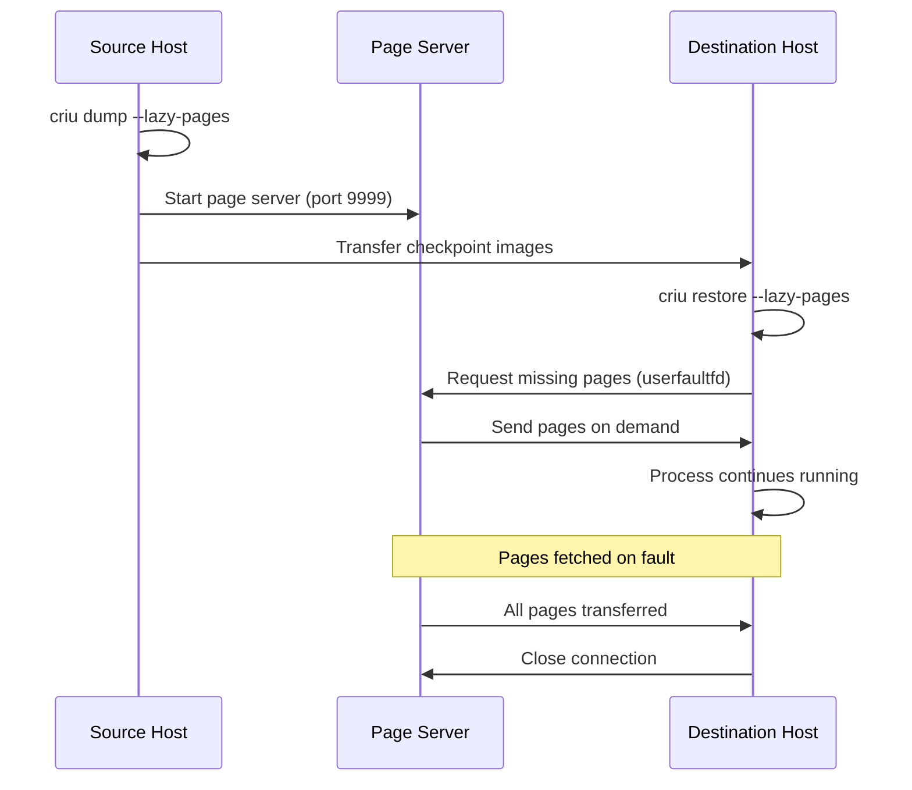

# CRIU — Checkpoint/Restore in Userspace

**CRIU** (pronounced "kree-oo") is a Linux tool that freezes a running
application (or container) and saves its complete state to disk, then restores
it from that saved state on the same or a different machine. It captures
processes, memory, file descriptors, network connections, and kernel state.

> **Website:** https://criu.org  
> **Kernel requirement:** Various features; Linux 3.11+ for basic functionality  
> **Used by:** Podman, Docker (experimental), LXC/LXD, OpenVZ, live migration tools

---

## What CRIU Saves

```
┌─────────────────────────────────────────────────────┐
│                 Process State                        │
│                                                     │
│  ┌───────────┐  ┌───────────┐  ┌───────────┐       │
│  │ Registers │  │ Memory    │  │ File       │       │
│  │ (CPU ctx) │  │ (pages,   │  │ Descriptors│       │
│  │           │  │  mapping) │  │ (fds,      │       │
│  └───────────┘  └───────────┘  │  sockets)  │       │
│                                └───────────┘       │
│  ┌───────────┐  ┌───────────┐  ┌───────────┐       │
│  │ Pipes/    │  │ Network   │  │ Timers/   │       │
│  │ FIFOs     │  │ (TCP,     │  │ Signals/  │       │
│  │           │  │  unix sk) │  │ Semaphores│       │
│  └───────────┘  └───────────┘  └───────────┘       │
│                                                     │
│  ┌───────────┐  ┌───────────┐  ┌───────────┐       │
│  │ IPC       │  │ TTY/      │  │ Namespaces│       │
│  │ (shm,     │  │ Terminals │  │ (pid, net,│       │
│  │  msgq)    │  │           │  │  mnt, uts)│       │
│  └───────────┘  └───────────┘  └───────────┘       │
└─────────────────────────────────────────────────────┘
```

---

## Basic Usage

### Installation

```bash
# Debian/Ubuntu
apt install criu

# Fedora/RHEL
dnf install criu

# From source
git clone https://github.com/checkpoint-restore/criu.git
cd criu
make
sudo make install
```

### Checkpoint a Process

```bash
# Basic checkpoint of a process tree
sudo criu dump -t <PID> -D /tmp/checkpoint/

# Checkpoint and keep running (pre-dump for faster final dump)
sudo criu pre-dump -t <PID> -D /tmp/pre-dump/

# Checkpoint a process group
sudo criu dump -t <PID> --shell-job -D /tmp/checkpoint/
```

### Restore a Process

```bash
# Restore from checkpoint
sudo criu restore -D /tmp/checkpoint/

# Restore and keep running in background
sudo criu restore -D /tmp/checkpoint/ --restore-detached
```

### Example: Full Checkpoint/Restore Cycle

```bash
# 1. Start a long-running process
python3 -c "
import time
i = 0
while True:
    print(f'Count: {i}', flush=True)
    i += 1
    time.sleep(1)
" &
PID=$!

# 2. Let it run for a while
sleep 10

# 3. Checkpoint it
sudo criu dump -t $PID -D /tmp/checkpoint/ --shell-job

# 4. Process is now frozen (killed)
# 5. Restore it
sudo criu restore -D /tmp/checkpoint/ --shell-job

# Output resumes from where it left off
```

---

## Container Checkpoint/Restore

CRIU's primary use case is container live migration.

### Podman Integration

```bash
# Checkpoint a container
podman container checkpoint <container_name>

# Restore a container
podman container restore <container_name>

# Checkpoint to a specific directory
podman container checkpoint --export=/tmp/cpt.tar.gz <container_name>

# Restore from archive
podman container restore --import=/tmp/cpt.tar.gz <container_name>

# Live migration: checkpoint on host A, restore on host B
# Host A:
podman container checkpoint --export=cpt.tar.gz my-container
# Transfer cpt.tar.gz to Host B
# Host B:
podman container restore --import=cpt.tar.gz my-container
```

### Docker Integration

```bash
# Docker experimental feature
docker checkpoint create <container> <checkpoint_name>
docker checkpoint ls <container>
docker start --checkpoint=<checkpoint_name> <container>
```

### LXC Integration

```bash
lxc-checkpoint -n my-container -D /tmp/checkpoint/ -s
lxc-checkpoint -n my-container -D /tmp/checkpoint/ -r
```

---

## Process Migration

CRIU enables **live migration** of processes between machines:

```
┌──────────────────────┐                    ┌──────────────────────┐
│     Source Host       │                    │   Destination Host    │
│                      │                    │                      │
│  ┌────────────────┐  │   Transfer State   │                      │
│  │ Running Process │  │ ════════════════►  │  ┌────────────────┐  │
│  └───────┬────────┘  │                    │  │ Restored Process │  │
│          │           │                    │  └────────────────┘  │
│  ┌───────▼────────┐  │                    │                      │
│  │ CRIU Checkpoint│  │                    │  ┌────────────────┐  │
│  │ (dump state)   │  │                    │  │ CRIU Restore   │  │
│  └────────────────┘  │                    │  │ (resume state) │  │
└──────────────────────┘                    └──────────────────────┘
```

### Migration Steps

```bash
# Source host: checkpoint and export
sudo criu dump -t <PID> -D /tmp/cpt/ --shell-job --images-dir /tmp/cpt/

# Transfer checkpoint images to destination
rsync -avz /tmp/cpt/ dest-host:/tmp/cpt/

# Destination host: restore
sudo criu restore -D /tmp/cpt/ --shell-job
```

### TCP Connection Migration

CRIU can checkpoint and restore established TCP connections:

```bash
# Enable TCP connection checkpoint
sudo criu dump -t <PID> -D /tmp/cpt/ --tcp-established

# Restore (requires network namespace or IP migration)
sudo criu restore -D /tmp/cpt/ --tcp-established
```

**Requirements for TCP migration:**
- The IP address must be reachable from the destination (or use network namespaces).
- TCP sequence numbers are saved and restored.
- The `--tcp-established` flag is required.

---

## Lazy Migration

**Lazy migration** (post-copy) is a technique where the process is restored
immediately but memory pages are transferred on-demand:

```
Phase 1: Quick checkpoint (dump registers, FDs, metadata)
Phase 2: Restore on destination (start process immediately)
Phase 3: Memory pages transferred lazily (on page fault)

┌──────────────────────────────────────────────────────┐
│                Lazy Migration Timeline                │
│                                                      │
│  Source: ──[checkpoint]──[page server]──────────────  │
│  Dest:   ───────────────[restore]──[lazy pages]────  │
│                                                      │
│  Downtime = checkpoint + restore (fast!)             │
│  Memory transfer happens in background               │
└──────────────────────────────────────────────────────┘
```

### Using Lazy Migration

```bash
# Source: start page server
sudo criu page-server -t <PID> --port 9999 -D /tmp/cpt/ &

# Source: checkpoint with lazy pages
sudo criu dump -t <PID> -D /tmp/cpt/ --lazy-pages

# Destination: restore with lazy pages from source
sudo criu restore -D /tmp/cpt/ --lazy-pages --page-server --address <source_ip> --port 9999
```

### Userfaultfd Integration

Lazy migration uses the kernel's **userfaultfd** mechanism:

```
1. CRIU restores the process with all memory mappings
2. Pages are mapped but not populated (PROT_NONE or userfaultfd-wired)
3. When the process accesses a missing page:
   a. Page fault → userfaultfd notification
   b. CRIU fetches the page from the source
   c. Page is populated, process continues
```

Kernel requirement: `CONFIG_USERFAULTFD=y`

---

## Pre-Dump for Faster Final Dump

For large-memory processes, the final dump can take a long time. **Pre-dump**
reduces downtime:

```bash
# Pre-dump: dump memory pages but keep process running
sudo criu pre-dump -t <PID> -D /tmp/pre-dump-1/

# Wait, let more pages become dirty
sleep 5

# Second pre-dump
sudo criu pre-dump -t <PID> -D /tmp/pre-dump-2/ --pre-dump-dir /tmp/pre-dump-1/

# Final dump: only dirty pages since last pre-dump
sudo criu dump -t <PID> -D /tmp/final/ --pre-dump-dir /tmp/pre-dump-2/
```

### Pre-Dump Strategy

```
Time ──────────────────────────────────────────────►

Memory snapshot:  ┌─────────┐
                  │ pre-dump │ (full memory copy)
                  │    1     │
                  └─────────┘
                       ┌─────────┐
                       │ pre-dump │ (only dirty pages)
                       │    2     │
                       └─────────┘
                            ┌─────────┐
                            │  final   │ (very few dirty pages)
                            │  dump   │ (minimal downtime!)
                            └─────────┘

Downtime: ░░░░░░░░░░░░░░░░░░░░░░░░░░░░░░░░███
          (pre-dumps happen while          (only final dump
           process is still running)        stops the process)
```

---

## CRIU Image Format

Checkpoint data is stored as a set of image files:

```
/tmp/checkpoint/
├── core-1234.img         # CPU registers, signal handlers
├── core-1235.img         # Additional threads
├── mm-1234.img           # Memory mappings metadata
├── pages-1.img           # Memory page data
├── pages-2.img           # More pages
├── fdinfo-2.img          # File descriptor table
├── fs-1234.img           # FS info (cwd, root)
├── ids-1234.img          # UID/GID
├── pstree.img            # Process tree
├── tcp-stream-1234.img   # TCP connection state
├── unixsk.img            # Unix socket state
├── pipes.img             # Pipe state
├── fifo.img              # FIFO state
├── inotify.img           # Inotify watches
├── signalfd.img          # Signal FD state
└── stats-dump            # Timing statistics
```

### Image Inspection

```bash
# List images
crit list /tmp/checkpoint/

# Decode a specific image
crit decode -i /tmp/checkpoint/core-1234.img -o /dev/stdout

# Show image info
crit info /tmp/checkpoint/
```

**crit** (CRIU Image Tool) is the companion utility for inspecting images.

---

## Network Namespace Migration

CRIU can checkpoint/restore network namespaces:

```bash
# Checkpoint a network namespace
sudo criu dump -t <PID> -D /tmp/cpt/ --net-namespace

# Restore in a new network namespace
sudo criu restore -D /tmp/cpt/ --net-namespace --veth-pair "eth0:peer0"
```

### Veth Pair for Migration

```
┌──────────────┐     ┌──────────────┐
│  Net NS 1    │     │  Net NS 2    │
│  (original)  │     │  (restored)  │
│              │     │              │
│  eth0 ◄──────┼─veth┼──► eth0      │
│              │     │              │
└──────────────┘     └──────────────┘
```

---

## CRIU and cgroups

CRIU can restore processes into cgroups:

```bash
# Checkpoint with cgroup info
sudo criu dump -t <PID> -D /tmp/cpt/ --cgroup-props

# Restore with cgroup management
sudo criu restore -D /tmp/cpt/ --manage-cgroups
```

### cgroup v2 Considerations

```
# CRIU restores cgroup membership
# The target cgroups must exist on the destination

# Example cgroup restore:
# /sys/fs/cgroup/my-container/  ← must exist on destination
```

---

## Security and Capabilities

CRIU requires specific capabilities:

```bash
# Minimum capabilities needed:
# CAP_SYS_ADMIN (for namespace operations)
# CAP_NET_ADMIN (for network namespace checkpoint)
# CAP_SYS_PTRACE (for reading process memory)

# Run as root, or with capabilities:
sudo setcap cap_sys_admin,cap_net_admin,cap_sys_ptrace+ep /usr/sbin/criu
```

### SELinux / AppArmor

```bash
# SELinux: CRIU needs specific policies
# Check for denials:
ausearch -m avc -ts recent | grep criu

# AppArmor: may need unconfined or custom profile
aa-complain /etc/apparmor.d/usr.sbin.criu
```

---

## Troubleshooting

### Common Errors

```bash
# "Can't open /proc/<PID>"
# → Need root or CAP_SYS_PTRACE

# "TCP connection can't be dumped"
# → Use --tcp-established flag

# "Can't dump file locks"
# → File locks require kernel support

# "Shell job requires --shell-job"
# → Use --shell-job for foreground process groups

# Verbose output for debugging:
sudo criu dump -t <PID> -D /tmp/cpt/ -v4 --log-file dump.log
```

### Pre-Check

```bash
# Check kernel features CRIU needs:
sudo criu check

# Detailed check:
sudo criu check --all

# Example output:
# Looks good.
# or
# Error: Ptrace doesn't support PTRACE_SEIZE
```

### Statistics

```bash
# Show dump/restore timing
crit stats /tmp/checkpoint/

# Example output:
# Freezing time:     1234 ms
# Memory dump time:  5678 ms
# Total dump time:   7890 ms
```

---

## Kernel Requirements

| Feature | Config | Notes |
|---------|--------|-------|
| Process checkpoint | Standard | Basic support since 3.11 |
| TCP checkpoint | `CONFIG_CHECKPOINT_RESTORE` | TCP connection state save/restore |
| User namespaces | `CONFIG_USER_NS` | Unprivileged restore |
| Userfaultfd | `CONFIG_USERFAULTFD` | Lazy migration |
| PTRACE_SEIZE | Kernel 3.4+ | Non-stop ptrace |
| Timerfd | Standard | Timer FD checkpoint |
| Signalfd | Standard | Signal FD checkpoint |
| Inotify | Standard | Inotify watch checkpoint |

```
# Recommended kernel config for full CRIU support:
CONFIG_CHECKPOINT_RESTORE=y
CONFIG_NAMESPACES=y
CONFIG_NET_NS=y
CONFIG_PID_NS=y
CONFIG_IPC_NS=y
CONFIG_UTS_NS=y
CONFIG_USER_NS=y
CONFIG_CGROUPS=y
CONFIG_USERFAULTFD=y
CONFIG_FHANDLE=y
CONFIG_EVENTFD=y
CONFIG_EPOLL=y
CONFIG_INOTIFY_USER=y
CONFIG_SIGNALFD=y
CONFIG_TIMERFD=y
CONFIG_PROC_PAGE_MONITOR=y
```

---

## Action Scripts

CRIU supports **action scripts** — hooks that run at specific points during
dump and restore. These are useful for setup/teardown tasks like configuring
network interfaces, mounting filesystems, or notifying external services.

```bash
# Run a script before dump and after restore
sudo criu dump -t <PID> -D /tmp/cpt/ --action-script /usr/local/bin/criu-hook.sh

# Example action script
#!/bin/bash
# /usr/local/bin/criu-hook.sh
# Called with arguments: <action> <dump|restore>

ACTION=$1
STAGE=$2

case "$ACTION" in
    pre-dump)
        echo "[$(date)] Pre-dump starting" >> /var/log/criu.log
        ;;
    post-dump)
        echo "[$(date)] Dump complete" >> /var/log/criu.log
        ;;
    pre-restore)
        echo "[$(date)] Restore starting" >> /var/log/criu.log
        # Set up network bridge
        ip link add veth-criu type veth peer name veth-criu-peer
        ip link set veth-criu up
        ;;
    post-restore)
        echo "[$(date)] Restore complete" >> /var/log/criu.log
        # Notify monitoring system
        curl -X POST http://monitor.internal/api/restore-complete
        ;;
esac
exit 0
```

Available hooks: `pre-dump`, `post-dump`, `pre-restore`, `post-restore`,
`pre-resume`, `post-resume`.

---

## External UNIX Sockets

When an application uses datagram UNIX sockets connected to an external
server (not part of the checkpoint), CRIU can handle this with the
`--ext-unix-sk` option. During dump, the socket is disconnected; during
restore, it is reconnected to the server by path.

```bash
# Checkpoint with external UNIX socket handling
sudo criu dump -t <PID> -D /tmp/cpt/ --ext-unix-sk

# Restore — socket reconnects to the server path
sudo criu restore -D /tmp/cpt/ --ext-unix-sk
```

This is essential for applications that communicate with system daemons
(like `systemd-journald` or `dbus`) via UNIX datagram sockets.

---

## File Lock Checkpoint/Restore

POSIX and BSD file locks can be checkpointed and restored:

```bash
# Enable file lock checkpoint
sudo criu dump -t <PID> -D /tmp/cpt/ --file-locks

# Restore with file locks
sudo criu restore -D /tmp/cpt/ --file-locks
```

**Limitations:**
- OFD (Open File Description) locks are supported since Linux 4.4.
- F_SETLK leases require kernel support.
- Network file locks (NFS, CIFS) cannot be checkpointed.

---

## Page Server Architecture

The page server is a CRIU component that serves memory pages during
lazy migration. It runs on the source host and responds to page
requests from the restoring host:



### Page Server Options

```bash
# Start page server with specific options
sudo criu page-server -D /tmp/cpt/ \
    --port 9999 \
    --address 0.0.0.0 \
    --verbose 4 \
    --log-file /var/log/criu-page-server.log

# Limit page server to specific network
sudo criu page-server -D /tmp/cpt/ \
    --port 9999 \
    --address 10.0.0.1
```

---

## CRIU with systemd

Systemd can manage CRIU-based checkpoint/restore for services:

```ini
# /etc/systemd/system/myapp.service
[Unit]
Description=My Checkpointable App
After=network.target

[Service]
Type=simple
ExecStart=/usr/bin/myapp
# Enable CRIU checkpointing
CheckpointRestore=yes
# Where to store checkpoints
CheckpointDirectory=/var/lib/checkpoints/myapp

[Install]
WantedBy=multi-user.target
```

```bash
# Checkpoint a systemd service
systemctl checkpoint myapp.service

# Restore from checkpoint
systemctl start myapp.service --checkpoint=<checkpoint-id>

# List checkpoints
systemctl list-checkpoints myapp.service
```

**Note:** systemd checkpoint support requires systemd 248+ and CRIU 3.16+.

---

## CRIU with User Namespaces

CRIU can checkpoint and restore processes inside user namespaces,
enabling unprivileged checkpoint/restore:

```bash
# Checkpoint inside user namespace
sudo criu dump -t <PID> -D /tmp/cpt/ --userns-path /proc/<pid>/ns/user

# Restore into a new user namespace
sudo criu restore -D /tmp/cpt/ --userns-path /proc/self/ns/user

# Unprivileged checkpoint (requires user namespace)
unshare --user --map-root-user -- bash -c "criu dump -t $$ -D /tmp/cpt/"
```

### Requirements for Unprivileged C/R

- User namespace support: `CONFIG_USER_NS=y`
- CRIU 3.12+ for user namespace support
- All resources must be accessible from the user namespace
- Network namespace must use user-space networking (slirp4netns)

---

## Memory Footprint Optimization

For large-memory processes, CRIU offers several optimization techniques:

### Memory Deduplication

```bash
# Use KSM (Kernel Same-page Merging) for restored processes
echo 1 > /sys/kernel/mm/ksm/run

# Check KSM stats
cat /sys/kernel/mm/ksm/pages_shared
cat /sys/kernel/mm/ksm/pages_sharing
```

### Image Compression

```bash
# Compress checkpoint images with zstd
sudo criu dump -t <PID> -D /tmp/cpt/ --compress zstd

# Compress with lz4 (faster, less compression)
sudo criu dump -t <PID> -D /tmp/cpt/ --compress lz4

# Decompress on restore (automatic)
sudo criu restore -D /tmp/cpt/
```

### Image Deduplication Across Checkpoints

```bash
# Pre-dump shares pages with previous pre-dump
# Only dirty pages are stored in subsequent dumps

# Use parent images for incremental checkpoints
sudo criu dump -t <PID> -D /tmp/cpt-2/ --parent-path /tmp/cpt-1/
```

---

## Troubleshooting (Extended)

### Permission Issues

```bash
# Error: "Can't dump pid 1234: Operation not permitted"
# Solution: Ensure CAP_SYS_ADMIN, CAP_NET_ADMIN, CAP_SYS_PTRACE
sudo setcap cap_sys_admin,cap_net_admin,cap_sys_ptrace+ep /usr/sbin/criu

# Error: "No permission to dump task"
# Solution: ptrace access check
# /proc/sys/kernel/yama/ptrace_scope must allow it
echo 0 > /proc/sys/kernel/yama/ptrace_scope
```

### Filesystem Issues

```bash
# Error: "Can't open dir /tmp/cpt: No such file or directory"
# Solution: Create checkpoint directory
mkdir -p /tmp/cpt

# Error: "Can't mount devtmpfs"
# Solution: Ensure /dev is accessible in the container
# Check: ls -la /proc/<pid>/root/dev/

# Error: "Filesystem mountpoints changed"
# Solution: Use --ext-mount-map for external mounts
sudo criu dump -t <PID> -D /tmp/cpt/ \
    --ext-mount-map /mnt/data:/mnt/data
```

### Network Issues

```bash
# Error: "Can't dump TCP connection"
# Solution: Use --tcp-established
sudo criu dump -t <PID> -D /tmp/cpt/ --tcp-established

# Error: "TCP connection in TIME_WAIT state"
# Solution: Wait for connection to close or use --skip-in-flight
sudo criu dump -t <PID> -D /tmp/cpt/ --skip-in-flight

# Verify network state after restore
ss -tlnp | grep <port>
```

### SELinux / AppArmor Issues

```bash
# Error: "Can't change apparmor profile"
# Solution: Use unconfined profile or custom CRIU profile
# /etc/apparmor.d/criu
#include <tunables/global>
/usr/sbin/criu {
  #include <abstractions/base>
  capability sys_admin,
  capability net_admin,
  capability sys_ptrace,
  /proc/*/ns/* r,
  /sys/fs/cgroup/** rw,
}

# Reload AppArmor
apparmor_parser -r /etc/apparmor.d/criu
```

---

## Relation to Other Tools

- **CRIU** is the core checkpoint/restore engine.
- **Podman** uses CRIU for container checkpoint/restore.
- **LXC/LXD** integrates CRIU for live migration.
- **Docker** has experimental CRIU support.
- **MTCP** provides TCP-level migration for specific applications.
- **[Namespaces](/containers/namespaces)** provide the isolation CRIU operates within.
- **[cgroups](/containers/cgroups)** manage resource limits during restore.

---

## Further Reading

- [CRIU official site](https://criu.org)
- [CRIU GitHub](https://github.com/checkpoint-restore/criu)
- [Kernel docs: Checkpoint/Restore](https://www.kernel.org/doc/html/latest/admin-guide/checkpoint.html)
- [LWN: CRIU — checkpointing and restoring processes (2012)](https://lwn.net/Articles/495227/)
- [CRIU: Container live migration](https://criu.org/Live_migration)
- [Podman checkpoint documentation](https://docs.podman.io/en/latest/markdown/podman-container-checkpoint.1.html)
- [Userfaultfd documentation](https://www.kernel.org/doc/html/latest/admin-guide/mm/userfaultfd.html)
- See also: [Namespaces](/containers/namespaces), [cgroups](/containers/cgroups), [Userfaultfd](/kernel/mm/userfaultfd)
