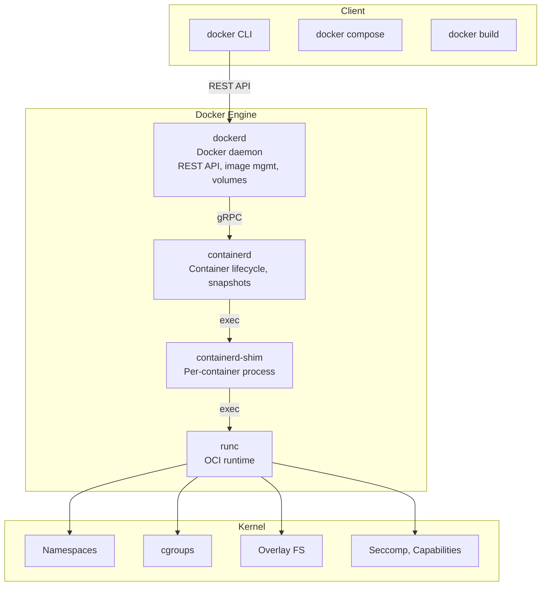
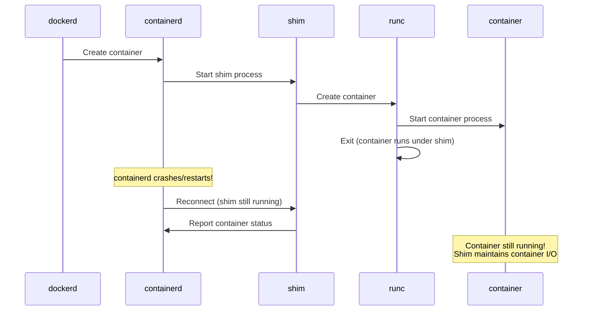
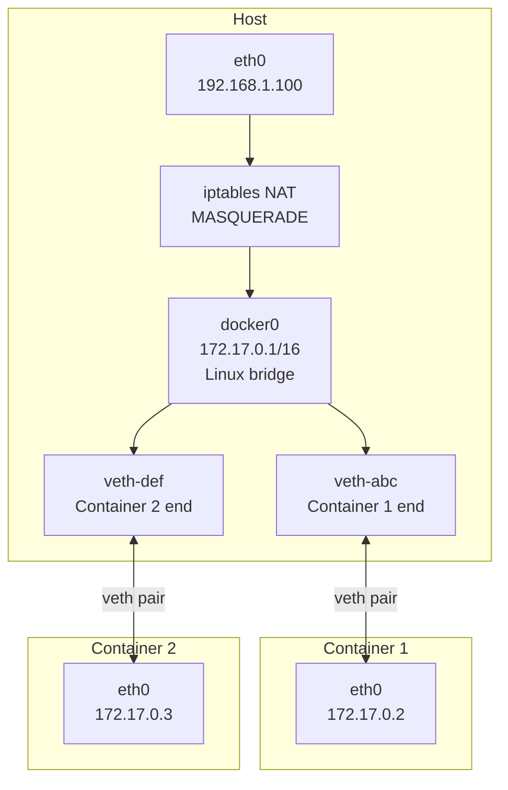

# Docker Internals

## Introduction

Docker popularized containers but is often misunderstood as being synonymous with containers. In reality, Docker is a platform built on top of Linux kernel primitives (namespaces, cgroups, union filesystems) and a layered architecture of components that have evolved significantly since Docker's initial release in 2013.

This chapter dissects Docker's internal architecture: the container runtime stack, image format, storage drivers, networking implementation, and the standards (OCI) that enable interoperability.

## Docker Architecture



### Component Roles

| Component | PID | Lifetime | Role |
|-----------|-----|----------|------|
| dockerd | 1 (systemd) | Daemon | API, images, networks, volumes |
| containerd | 1 (systemd) | Daemon | Container lifecycle, snapshots, content |
| containerd-shim | Per container | Container lifetime | Keeps container alive if containerd restarts |
| runc | Per create | Transient | Creates and starts container, then exits |

### Why containerd-shim?



The shim ensures containers survive daemon restarts (live-restore).

## Container Lifecycle

### Creating a Container

```bash
# What happens when you run: docker run -d nginx

# 1. CLI sends REST API POST /containers/create
#    Body: {"Image": "nginx", "Cmd": ["nginx", "-g", "daemon off;"], ...}

# 2. dockerd pulls image if not present
#    - Check local image store
#    - Pull from registry if missing
#    - Store layers in content-addressable store

# 3. dockerd calls containerd to create container
#    containerd pulls image from local store
#    Creates snapshot (writable layer)
#    Prepares OCI bundle

# 4. containerd spawns containerd-shim
#    shim sets up stdio pipes
#    shim calls runc create

# 5. runc creates the container:
#    - Reads config.json (OCI runtime spec)
#    - Creates namespaces (pid, net, mount, uts, ipc)
#    - Sets up cgroups
#    - Mounts rootfs (overlay)
#    - Sets up seccomp filter
#    - Drops capabilities
#    - Sets up AppArmor/SELinux labels
#    - Creates container process (paused)
```

### OCI Bundle

```json
// config.json (OCI Runtime Specification)
{
    "ociVersion": "1.0.2",
    "process": {
        "terminal": false,
        "user": { "uid": 0, "gid": 0 },
        "args": ["nginx", "-g", "daemon off;"],
        "env": ["PATH=/usr/local/sbin:/usr/local/bin:/usr/sbin:/usr/bin:/sbin:/bin"],
        "cwd": "/",
        "capabilities": {
            "bounding": ["CAP_NET_BIND_SERVICE", "CAP_CHOWN", "CAP_SETUID"],
            "effective": ["CAP_NET_BIND_SERVICE", "CAP_CHOWN", "CAP_SETUID"],
            "inheritable": ["CAP_NET_BIND_SERVICE"],
            "permitted": ["CAP_NET_BIND_SERVICE", "CAP_CHOWN", "CAP_SETUID"],
            "ambient": ["CAP_NET_BIND_SERVICE"]
        },
        "seccomp": {
            "defaultAction": "SCMP_ACT_ERRNO",
            "syscalls": [{"names": ["accept4","read","write"], "action": "SCMP_ACT_ALLOW"}]
        },
        "apparmorProfile": "docker-default",
        "noNewPrivileges": true
    },
    "root": {
        "path": "rootfs",
        "readonly": false
    },
    "linux": {
        "namespaces": [
            {"type": "pid"},
            {"type": "network"},
            {"type": "ipc"},
            {"type": "uts"},
            {"type": "mount"},
            {"type": "cgroup"}
        ],
        "resources": {
            "memory": { "limit": 536870912 },
            "cpu": { "quota": 100000, "period": 100000 }
        },
        "maskedPaths": ["/proc/kcore", "/proc/sysrq-trigger"],
        "readonlyPaths": ["/proc/asound", "/proc/bus"]
    }
}
```

## Image Layers

Docker images are composed of read-only layers stacked on top of each other:

```mermaid
graph TB
    subgraph Image Layers (read-only)
        L1[Layer 1: Ubuntu base<br/>77.8MB - apt-get install]
        L2[Layer 2: Install deps<br/>12.3MB - apt-get install libssl]
        L3[Layer 3: Copy app<br/>2.1MB - COPY . /app]
        L4[Layer 4: Set config<br/>0.1KB - ENV, CMD]
    end
    subgraph Container (read-write)
        RW[Writable Layer<br/>Container changes]
    end
    RW --> L4 --> L3 --> L2 --> L1
```

### Content-Addressable Storage

Each layer is identified by a SHA256 digest of its content:

```bash
# Inspect image layers
docker inspect nginx --format '{{.RootFS.Layers}}'
# sha256:e4d0e95fdb2f... (layer 1)
# sha256:ab6cc02b34bc... (layer 2)
# sha256:4757a108af0a... (layer 3)

# Image storage location
ls /var/lib/docker/overlay2/
# Each layer is a directory with diff/ and link files

# Image manifest
docker manifest inspect nginx:latest
# {
#   "schemaVersion": 2,
#   "mediaType": "application/vnd.docker.distribution.manifest.v2+json",
#   "config": {"digest": "sha256:abc123..."},
#   "layers": [
#     {"digest": "sha256:e4d0e95...", "size": 28948291},
#     {"digest": "sha256:ab6cc02b...", "size": 12345678}
#   ]
# }
```

### Layer Sharing

```bash
# Two images sharing the same base layer only store it once
docker images --tree  # (if using buildx with --metadata-file)

# Example:
# nginx:latest  ──┐
#                  ├── ubuntu:22.04 (shared base)
# myapp:latest  ──┘

# Multi-stage builds reduce layers
# FROM golang:1.21 AS builder
# ... build ...
# FROM alpine:3.19
# COPY --from=builder /app/server /usr/local/bin/
# Final image: only alpine layer + binary layer
```

## Overlay2 Storage Driver

Overlay2 is the default storage driver for Docker on Linux:

```mermaid
graph TB
    subgraph Container View
        MOUNT[merged/<br/>Container sees unified filesystem]
    end
    subgraph Overlay2
        UPPER[upper/<br/>Container writes go here]
        WORK[work/<br/>Internal use only]
        LOWER[lower/<br/>Image layers (read-only)]
    end
    MOUNT -->|overlay mount| UPPER
    MOUNT -->|overlay mount| LOWER
    UPPER --> WORK
```

### How Overlay2 Works

```bash
# Docker's overlay2 storage
ls /var/lib/docker/overlay2/
# abc123.../  (image layer)
#   diff/     (layer contents)
#   link      (short name for this layer)
# def456.../  (container layer)
#   diff/     (container-specific changes)
#   link
#   merged/   (mount point - what container sees)
#   work/     (overlay internal)

# The overlay mount:
mount -t overlay overlay \
  -o lowerdir=/lower2:/lower1,upperdir=/upper,workdir=/work \
  /merged

# Copy-on-write behavior:
# Read: file found in lower layer → served from there
# Write: file copied to upper layer → modified in upper
# Delete: "whiteout" file created in upper layer
```

### Whiteout Files

```bash
# When a container deletes a file from a lower layer:
# overlay2 creates a "whiteout" file in the upper layer

# Character device whiteout (0,0 major/minor)
ls -la /var/lib/docker/overlay2/abc/merged/etc/deleted-file
# c--------- 1 root root 0, 0 ...

# Opaque directory whiteout (trusted.overlay.opaque xattr)
getfattr -n trusted.overlay.opaque /var/lib/docker/overlay2/abc/merged/etc/dir
# "y" (yes, opaque - hide lower dir contents)
```

## Docker Networking

### Bridge Network (Default)



```bash
# Docker creates a linux bridge
ip link show docker0
# docker0: <BROADCAST,MULTICAST,UP,LOWER_UP> mtu 1500 ...

# Each container gets a veth pair
ip link show type veth
# veth123@if4: <BROADCAST,MULTICAST,UP> ... master docker0
# veth456@if6: <BROADCAST,MULTICAST,UP> ... master docker0

# iptables rules for NAT
iptables -t nat -L -n
# Chain POSTROUTING
# MASQUERADE  all  --  172.17.0.0/16  anywhere

# Port publishing (-p 8080:80)
iptables -t nat -L -n
# DNAT  tcp  --  anywhere  anywhere  tcp dpt:8080 to:172.17.0.2:80

# Docker iptables chain
iptables -L DOCKER -n
# ACCEPT  tcp  --  !172.17.0.0/16  172.17.0.2  tcp dpt:80
```

### Network Drivers

```bash
# List networks
docker network ls
# NETWORK ID     NAME      DRIVER    SCOPE
# abc123...      bridge    bridge    local
# def456...      host      host      local
# ghi789...      none      null      local

# Create custom bridge
docker network create --driver bridge \
  --subnet 10.0.2.0/24 \
  --ip-range 10.0.2.128/25 \
  --gateway 10.0.2.1 \
  my-net

# Docker creates a new bridge and iptables rules
ip link show br-$(docker network inspect my-net --format '{{.Id}}' | head -c12)

# Container on custom network
docker run --network my-net --name web nginx
```

### DNS Resolution

```bash
# Docker runs an embedded DNS server (127.0.0.11)
docker run --rm alpine cat /etc/resolv.conf
# nameserver 127.0.0.11
# options ndots:0

# Docker DNS resolves container names within a network
docker network create testnet
docker run -d --network testnet --name db postgres
docker run --rm --network testnet alpine nslookup db
# Name:      db
# Address:   10.0.3.2

# Default bridge network does NOT resolve names
docker run --rm alpine nslookup other_container
# (fails - use custom networks)
```

## Docker Storage

### Volumes vs Bind Mounts vs tmpfs

```bash
# Named volumes (managed by Docker)
docker volume create mydata
docker volume inspect mydata
# {
#     "Mountpoint": "/var/lib/docker/volumes/mydata/_data",
#     "Driver": "local",
#     "Scope": "local"
# }

# Bind mounts (host path)
docker run -v /host/path:/container/path:ro nginx

# tmpfs (in-memory)
docker run --tmpfs /app/cache:rw,noexec,nosuid,size=100m nginx

# Volume drivers for distributed storage
docker volume create --driver local \
  --opt type=nfs \
  --opt o=addr=192.168.1.100,rw \
  --opt device=:/exports/data \
  nfs-data
```

## Docker Build System

### BuildKit

```bash
# BuildKit is Docker's modern build engine
# Enabled by default in Docker 23.0+

# BuildKit features:
# - Parallel build stages
# - Build cache import/export
# - Secret mounts (--mount=type=secret)
# - SSH agent forwarding (--mount=type=ssh)
# - Multi-platform builds

# Build with BuildKit
DOCKER_BUILDKIT=1 docker build -t myapp .

# Multi-platform build
docker buildx build --platform linux/amd64,linux/arm64 -t myapp .
```

### Build Cache

```bash
# Build cache is layer-based
# Each instruction in Dockerfile creates a layer
# If the instruction and context haven't changed, cached layer is used

docker build -t myapp .
# Step 1/5 : FROM alpine:3.19
#  ---> Using cache  (abc123)
# Step 2/5 : RUN apk add --no-cache curl
#  ---> Using cache  (def456)
# Step 3/5 : COPY . /app
#  ---> New layer    (ghi789)  # Context changed!

# Cache invalidation:
# COPY/ADD: invalidated if file content changes
# RUN: NOT invalidated (use --no-cache to force)
# ARG: invalidated if value changes
```

## Docker Security

```bash
# Security features applied to containers:
# 1. Namespaces (pid, net, mount, uts, ipc, cgroup)
# 2. Seccomp profile (default blocks ~44 of 300+ syscalls)
# 3. Capabilities (drops ~14 of ~37 capabilities)
# 4. AppArmor profile (docker-default)
# 5. Read-only rootfs (--read-only)
# 6. No new privileges (--security-opt no-new-privileges)
# 7. User namespace remapping (--userns-remap)

# Run with all security features
docker run \
  --security-opt seccomp=profile.json \
  --security-opt apparmor=docker-default \
  --cap-drop ALL \
  --cap-add NET_BIND_SERVICE \
  --read-only \
  --tmpfs /tmp \
  --security-opt no-new-privileges \
  --user 1000:1000 \
  nginx

# Docker Content Trust (image signing)
export DOCKER_CONTENT_TRUST=1
docker pull nginx  # Only pulls signed images
```

## Docker Context / Info

```bash
# Docker system information
docker system info
# Server:
#  Containers: 5
#   Running: 3
#   Paused: 0
#   Stopped: 2
#  Images: 12
# Storage Driver: overlay2
#  Backing Filesystem: ext4
# Logging Driver: json-file
# Cgroup Driver: systemd
# Cgroup Version: 2
# Kernel Version: 6.1.0
# Operating System: Ubuntu 22.04
# Architecture: x86_64

# Disk usage
docker system df
# TYPE        ACTIVE   SIZE     RECLAIMABLE
# Images      3        1.2GB    800MB (66%)
# Containers  3        50MB     30MB (60%)
# Local Volumes 2      500MB    200MB (40%)
# Build Cache 5        2GB      2GB (100%)

# Cleanup
docker system prune -a --volumes  # Remove everything unused
```

## Alternatives to Docker

| Tool | Architecture | Rootless | Notes |
|------|-------------|----------|-------|
| **Podman** | Daemonless | ✅ | Docker CLI compatible |
| **containerd** | Daemon | ✅ | K8s CRI standard |
| **CRI-O** | Daemon | ✅ | K8s-specific runtime |
| **LXC/LXD** | Daemon | ✅ | System containers |
| **runc** | Standalone | ✅ | Low-level runtime only |

```bash
# Podman is a drop-in Docker replacement
alias docker=podman
podman run --rm alpine echo "Hello from Podman"
# No daemon needed!
# Rootless by default
```

## References

1. Docker Architecture Documentation. [https://docs.docker.com/get-started/overview/](https://docs.docker.com/get-started/overview/)
2. OCI Runtime Specification. [https://github.com/opencontainers/runtime-spec](https://github.com/opencontainers/runtime-spec)
3. OCI Image Specification. [https://github.com/opencontainers/image-spec](https://github.com/opencontainers/image-spec)
4. containerd Documentation. [https://containerd.io/docs/](https://containerd.io/docs/)

## Further Reading

- [The Linux Kernel Documentation](https://docs.kernel.org/)
- [LWN.net - Linux and free software news](https://lwn.net/)
- [GNU Project Documentation](https://www.gnu.org/doc/doc.html)
- [GNU Manuals](https://www.gnu.org/manual/manual.html)
- [Free Software Directory](https://directory.fsf.org/wiki/Main_Page)
- [Planet GNU](https://planet.gnu.org/)
- [Free Software Books](https://www.gnu.org/doc/other-free-books.html)

- [Docker Documentation](https://docs.docker.com/)
- [containerd GitHub](https://github.com/containerd/containerd)
- [runc — OCI Runtime](https://github.com/opencontainers/runc)
- [BuildKit Documentation](https://github.com/moby/buildkit)
- [Docker Networking Deep Dive](https://docs.docker.com/network/)
- [Podman Documentation](https://podman.io/docs)

## Related Topics

- [Container Overview](./overview.md) — container concepts
- [Container Primitives](./primitives.md) — kernel features used by Docker
- [cgroups v2](./cgroups-v2.md) — resource management
- [Kubernetes and Linux](./kubernetes.md) — container orchestration
