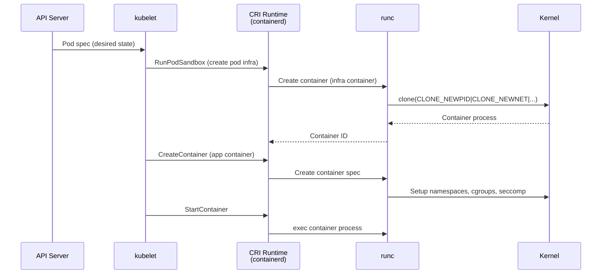
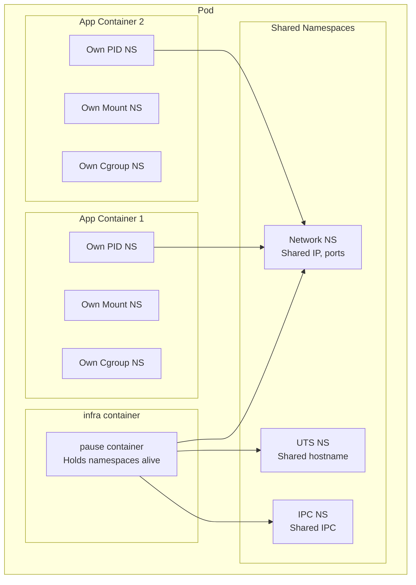
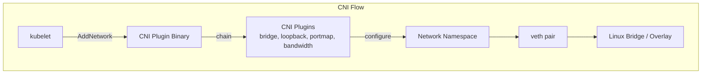
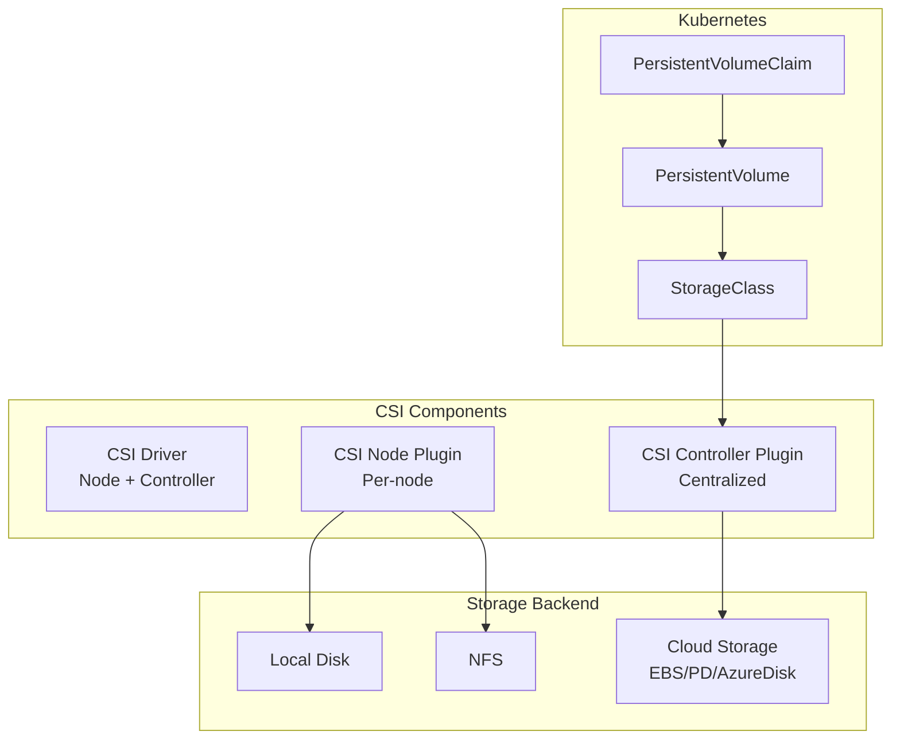

# Kubernetes and Linux

## Introduction

Kubernetes (K8s) is the dominant container orchestration platform, automating deployment, scaling, and management of containerized applications. While Kubernetes abstracts away much of the underlying infrastructure, it relies heavily on Linux kernel features — namespaces, cgroups, seccomp, AppArmor, and networking primitives — to create and manage containers.

This chapter explores how Kubernetes interacts with the Linux kernel, covering the container runtime interface (CRI), container networking (CNI), storage (CSI), and security mechanisms.

## Kubernetes Architecture and Linux

```mermaid
graph TB
    subgraph Control Plane
        API[API Server]
        ETCD[etcd]
        SCHED[Scheduler]
        CM[Controller Manager]
    end
    subgraph Node (Linux Host)
        KUBELET[kubelet]
        KUBE_PROXY[kube-proxy]
        CRI_PLUGIN[CRI Plugin<br/>containerd / CRI-O]
        CONTAINER[Container<br/>Namespaces + cgroups]
        
        subgraph CNI Plugin
            CNI[CNI Plugin<br/>calico/flannel/cilium]
        end
        subgraph CSI Plugin
            CSI[CSI Plugin<br/>aws-ebs/csi-driver]
        end
    end

    API --> KUBELET
    KUBELET --> CRI_PLUGIN
    CRI_PLUGIN --> CONTAINER
    KUBELET --> CNI
    KUBELET --> CSI
    KUBE_PROXY -->|iptables/IPVS| CONTAINER
```

### kubelet and the Linux Kernel

The kubelet is the node agent that communicates with the container runtime and the kernel:

```bash
# kubelet responsibilities:
# 1. Watch API server for PodSpec changes
# 2. Call CRI to create/start/stop containers
# 3. Set up pod cgroups
# 4. Configure pod networking via CNI
# 5. Mount volumes via CSI
# 6. Apply security contexts (seccomp, AppArmor)
# 7. Report node/pod status back to API server
```

## CRI (Container Runtime Interface)

CRI is the gRPC interface between kubelet and the container runtime:



### CRI Implementations

| Runtime | CRI Support | Notes |
|---------|-------------|-------|
| containerd | ✅ (native) | Most common, Docker's runtime |
| CRI-O | ✅ (native) | Kubernetes-specific runtime |
| Docker | Via cri-dockerd | Legacy, dockershim removed in 1.24 |
| gVisor | ✅ (runsc) | Application kernel for sandboxing |
| Kata Containers | ✅ | VM-based containers |

```bash
# Check container runtime on a node
kubectl get nodes -o wide
# NAME    STATUS   ROLES    VERSION   INTERNAL-IP   OS-IMAGE         CONTAINER-RUNTIME
# node1   Ready    <none>   v1.28.0   10.0.1.10     Ubuntu 22.04     containerd://1.7.2

# Check runtime endpoint
crictl info | jq '.config.containerd'
# {"snapshotter": "overlayfs", ...}

# crictl — CRI CLI tool
crictl pods          # List pod sandboxes
crictl ps            # List containers
crictl images        # List images
crictl logs <id>     # View container logs
crictl exec -it <id> sh  # Exec into container
```

## Pod Namespaces

A Kubernetes Pod shares namespaces among its containers:



### The Pause Container

```bash
# The pause container holds namespaces open for the pod
# Even if all app containers crash, namespaces remain

# pause container image
# Very small (~250KB), just sleeps forever
# Architecture-specific: registry.k8s.io/pause:3.9

# Why pause?
# 1. PID 1 in the shared namespaces
# 2. Reaps zombie processes
# 3. Holds network namespace for CNI setup
# 4. Allows container restart without losing namespace

# Verify pause container
crictl ps | grep pause
# abc123  registry.k8s.io/pause:3.9  Running  pause  0  ...
```

### Pod Namespace Sharing

```yaml
# ShareProcessNamespace: containers see each other's processes
apiVersion: v1
kind: Pod
metadata:
  name: shared-pid
spec:
  shareProcessNamespace: true
  containers:
  - name: app
    image: myapp
  - name: sidecar
    image: busybox
    command: ["sleep", "infinity"]
# Now sidecar can see app processes via /proc
```

## CNI (Container Network Interface)

CNI is the standard for configuring network namespaces in Kubernetes:



### CNI Plugins

```bash
# CNI plugin binaries location
ls /opt/cni/bin/
# bandwidth  bridge  dhcp  firewall  flannel  host-device
# host-local  ipvlan  loopback  macvlan  portmap  ptp
# sbr  static  tuning  vlan  vrf

# CNI configuration
cat /etc/cni/net.d/10-calico.conflist
# {
#   "cniVersion": "1.0.0",
#   "name": "k8s-pod-network",
#   "plugins": [
#     {
#       "type": "calico",
#       "log_level": "info",
#       "datastore_type": "kubernetes",
#       "nodename": "node1",
#       "ipam": {
#         "type": "calico-ipam"
#       }
#     },
#     {
#       "type": "portmap",
#       "snat": true,
#       "capabilities": {"portMappings": true}
#     },
#     {
#       "type": "bandwidth",
#       "capabilities": {"bandwidth": true}
#     }
#   ]
# }
```

### CNI Operation

```json
// CNI ADD request (kubelet → CNI plugin)
{
    "cniVersion": "1.0.0",
    "containerID": "abc123",
    "sandboxID": "netns-456",
    "netns": "/var/run/netns/abc123",
    "ifName": "eth0",
    "args": "K8S_POD_NAME=myapp;K8S_POD_NAMESPACE=default",
    "path": ["/opt/cni/bin"],
    "runtimeConfig": {
        "portMappings": [{"hostPort": 8080, "containerPort": 80, "protocol": "tcp"}]
    }
}

// CNI ADD response
{
    "cniVersion": "1.0.0",
    "interfaces": [
        {"name": "eth0", "mac": "0a:58:ac:11:00:02", "sandbox": "/var/run/netns/abc123"}
    ],
    "ips": [
        {"address": "10.244.1.5/24", "gateway": "10.244.1.1", "interface": 0}
    ]
}
```

### Popular CNI Plugins

| Plugin | Technology | Features |
|--------|-----------|----------|
| **Calico** | BGP / eBPF | Network policy, encryption, high performance |
| **Flannel** | VXLAN/host-gw | Simple overlay network |
| **Cilium** | eBPF | Advanced networking, observability, security |
| **Weave Net** | VXLAN | Mesh networking, encryption |
| **Canal** | Flannel + Calico | Combines Flannel networking + Calico policy |

```bash
# Cilium uses eBPF for advanced networking
# Instead of iptables, Cilium programs the kernel directly
cilium status
# KubeProxyReplacement:   Strict   (eBPF-based)
# Datapath Mode:          vxlan
# BPF Routing:            Enabled

# Check eBPF programs
bpftool prog list | grep cilium
```

## CSI (Container Storage Interface)

CSI standardizes storage provisioning in Kubernetes:



```yaml
# StorageClass using CSI driver
apiVersion: storage.k8s.io/v1
kind: StorageClass
metadata:
  name: fast-ssd
provisioner: ebs.csi.aws.com
parameters:
  type: gp3
  iops: "3000"
  throughput: "125"
reclaimPolicy: Delete
volumeBindingMode: WaitForFirstConsumer

---
# PersistentVolumeClaim
apiVersion: v1
kind: PersistentVolumeClaim
metadata:
  name: app-data
spec:
  accessModes: [ReadWriteOnce]
  storageClassName: fast-ssd
  resources:
    requests:
      storage: 100Gi
```

### CSI Node Operations

```bash
# CSI node plugin performs:
# 1. NodeStageVolume — mount device to global staging path
# 2. NodePublishVolume — bind mount to pod volume path

# Typical mount flow:
# /dev/xvdf → /var/lib/kubelet/plugins/kubernetes.io/csi/.../globalmount (staging)
# /var/lib/kubelet/plugins/.../globalmount → /var/lib/kubelet/pods/<uid>/volumes/... (publish)

# Check volume mounts in a pod
kubectl exec mypod -- mount | grep volumes
```

## Kubernetes Security

### SecurityContext

```yaml
apiVersion: v1
kind: Pod
metadata:
  name: secure-pod
spec:
  securityContext:
    runAsNonRoot: true
    runAsUser: 1000
    runAsGroup: 3000
    fsGroup: 2000
    seccompProfile:
      type: RuntimeDefault
    supplementalGroups: [4000]
  containers:
  - name: app
    image: myapp
    securityContext:
      allowPrivilegeEscalation: false
      readOnlyRootFilesystem: true
      capabilities:
        drop: ["ALL"]
        add: ["NET_BIND_SERVICE"]
      seccompProfile:
        type: Localhost
        localhostProfile: profiles/my-seccomp.json
      appArmorProfile:
        type: Localhost
        localhostProfile: profiles/my-apparmor
```

### Seccomp in Kubernetes

```mermaid
graph LR
    subgraph Pod Spec
        SECCTX[securityContext.seccompProfile]
    end
    subgraph kubelet
        KL[kubelet]
        SM[seccomp manager]
    end
    subgraph Container Runtime
        CR[containerd]
        RUNC[runc]
    end
    subgraph Kernel
        SECCOMP[seccomp BPF filter]
    end

    SECCTX --> KL
    KL --> SM
    SM -->|load profile| CR
    CR -->|set seccomp| RUNC
    RUNC -->|prctl(PR_SET_SECCOMP)| SECCOMP
```

```json
// Custom seccomp profile for a specific workload
{
    "defaultAction": "SCMP_ACT_ERRNO",
    "defaultErrnoRet": 1,
    "architectures": ["SCMP_ARCH_X86_64"],
    "syscalls": [
        {
            "names": ["read", "write", "close", "fstat", "mmap", "mprotect",
                      "munmap", "brk", "rt_sigaction", "rt_sigprocmask",
                      "ioctl", "access", "pipe", "select", "sched_yield",
                      "mremap", "msync", "clone", "execve", "exit",
                      "wait4", "kill", "uname", "fcntl", "flock",
                      "fsync", "fdatasync", "ftruncate", "getdents",
                      "getcwd", "chdir", "rename", "mkdir", "link",
                      "unlink", "readlink", "chmod", "chown", "arch_prctl",
                      "gettimeofday", "getuid", "getgid", "geteuid",
                      "getegid", "getppid", "getpgrp", "set_tid_address",
                      "futex", "epoll_wait", "epoll_ctl", "clock_gettime",
                      "exit_group", "openat", "newfstatat", "set_robust_list",
                      "getrandom", "rseq", "epoll_create1"],
            "action": "SCMP_ACT_ALLOW"
        }
    ]
}
```

```bash
# Apply seccomp profile
kubectl apply -f secure-pod.yaml

# Check seccomp status in running container
kubectl exec secure-pod -- cat /proc/1/status | grep Seccomp
# Seccomp:    2
# Seccomp_filters:    1

# Audit seccomp violations
# Use falco or auditd
ausearch -m SECCOMP -ts recent
```

### AppArmor in Kubernetes

```bash
# AppArmor profile
# /etc/apparmor.d/k8s-myapp
profile k8s-myapp flags=(attach_disconnected) {
    #include <abstractions/base>
    file,
    network inet stream,
    network inet dgram,
    deny /proc/sys/** w,
    deny /sys/** w,
}

# Load the profile
apparmor_parser -r /etc/apparmor.d/k8s-myapp

# Apply via pod annotation (legacy) or securityContext (1.30+)
# Annotation:
# container.apparmor.security.beta.kubernetes.io/app: localhost/k8s-myapp
```

### Network Policies

```yaml
# Kubernetes Network Policy (implemented by CNI plugin)
apiVersion: networking.k8s.io/v1
kind: NetworkPolicy
metadata:
  name: allow-web-only
  namespace: production
spec:
  podSelector:
    matchLabels:
      app: backend
  policyTypes: [Ingress, Egress]
  ingress:
  - from:
    - namespaceSelector:
        matchLabels:
          name: frontend
    ports:
    - protocol: TCP
      port: 8080
  egress:
  - to:
    - namespaceSelector:
        matchLabels:
          name: database
    ports:
    - protocol: TCP
      port: 5432
```

```bash
# Network policies are enforced by the CNI plugin
# Calico: uses iptables or eBPF
# Cilium: uses eBPF (native)
# Flannel: does NOT support network policies (needs Calico)

# Verify network policy enforcement
kubectl get networkpolicies -A
```

## Pod Cgroups

Kubernetes creates cgroups for each pod:

```bash
# Pod cgroup structure (cgroups v2)
# /sys/fs/cgroup/kubepods/
#   ├── besteffort/
#   │   ├── pod<uid>/
#   │   │   ├── container1/
#   │   │   └── container2/
#   │   └── pod<uid2>/...
#   ├── burstable/
#   │   ├── pod<uid>/...
#   └── guaranteed/
#       ├── pod<uid>/...

# Check pod cgroup
kubectl exec mypod -- cat /proc/self/cgroup
# 0::/kubepods/burstable/pod<uid>/<container-id>

# Resource limits set via cgroup
# cpu.shares = requests.cpu * 1024 / allocatable.cpu
# memory.max = limits.memory
# cpu.max = limits.cpu * 100000 (quota/period)
```

```yaml
# Pod with resource limits
apiVersion: v1
kind: Pod
metadata:
  name: resource-demo
spec:
  containers:
  - name: app
    image: nginx
    resources:
      requests:
        cpu: "250m"      # 0.25 CPU
        memory: "128Mi"
      limits:
        cpu: "500m"      # 0.5 CPU
        memory: "256Mi"
```

## kube-proxy and Linux Networking

```bash
# kube-proxy modes:
# 1. iptables (default) — iptables rules for service routing
# 2. ipvs — IPVS load balancing (higher performance)
# 3. nftables — nftables rules (Linux 5.13+)
# 4. eBPF — Cilium/kube-proxy replacement

# iptables mode
iptables -t nat -L KUBE-SERVICES -n
# KUBE-SVC-XXX  tcp  --  anywhere  10.96.0.10  tcp dpt:53
# KUBE-SEP-XXX  all  --  anywhere  anywhere    /* default/kubernetes:https */

# IPVS mode
ipvsadm -Ln
# TCP  10.96.0.1:443 rr
#   -> 10.0.1.10:6443          Masq    1
# TCP  10.96.0.10:53 rr
#   -> 10.244.0.5:53           Masq    1
#   -> 10.244.1.3:53           Masq    1
```

## Debugging Kubernetes on Linux

```bash
# Check node resource usage
kubectl top nodes
kubectl describe node node1 | grep -A 10 "Allocated resources"

# Debug pod networking
kubectl debug -it mypod --image=busybox --target=app
# Shares PID namespace with target container

# Check CNI logs
journalctl -u kubelet | grep -i cni

# Check container runtime logs
journalctl -u containerd

# Inspect container namespaces
crictl inspect <container-id> | jq '.info.runtimeSpec.linux.namespaces'

# Inspect container cgroup
crictl inspect <container-id> | jq '.info.runtimeSpec.linux.resources'

# Trace syscall issues (seccomp violations)
kubectl exec mypod -- strace -f -p 1
# or use bpftrace on the node
bpftrace -e 'tracepoint:seccomp:seccomp_filter { printf("%s: %d\n", comm, args->syscall); }'
```

## References

1. Kubernetes Documentation. [https://kubernetes.io/docs/](https://kubernetes.io/docs/)
2. CNI Specification. [https://github.com/containernetworking/cni/blob/main/SPEC.md](https://github.com/containernetworking/cni/blob/main/SPEC.md)
3. CRI Specification. [https://github.com/kubernetes/cri-api](https://github.com/kubernetes/cri-api)
4. CSI Specification. [https://github.com/container-storage-interface/spec](https://github.com/container-storage-interface/spec)

## Further Reading

- [The Linux Kernel Documentation](https://docs.kernel.org/)
- [LWN.net - Linux and free software news](https://lwn.net/)
- [GNU Project Documentation](https://www.gnu.org/doc/doc.html)
- [GNU Manuals](https://www.gnu.org/manual/manual.html)
- [Free Software Directory](https://directory.fsf.org/wiki/Main_Page)
- [Planet GNU](https://planet.gnu.org/)
- [Free Software Books](https://www.gnu.org/doc/other-free-books.html)

- [Kubernetes Documentation](https://kubernetes.io/docs/)
- [CNI Specification](https://github.com/containernetworking/cni/blob/main/SPEC.md)
- [containerd CRI Plugin](https://github.com/containerd/containerd/tree/main/pkg/cri)
- [Cilium eBPF-based Networking](https://docs.cilium.io/)
- [Kubernetes Security Best Practices](https://kubernetes.io/docs/concepts/security/)

## Related Topics

- [Container Overview](./overview.md) — container fundamentals
- [Docker Internals](./docker-internals.md) — container runtime stack
- [Container Primitives](./primitives.md) — namespaces, cgroups, seccomp
- [cgroups v2](./cgroups-v2.md) — resource management
