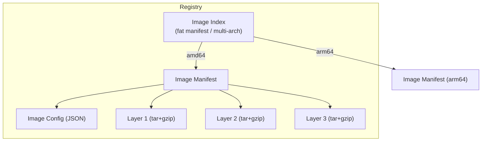
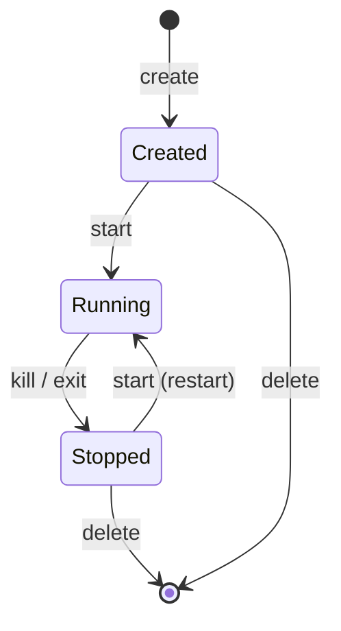
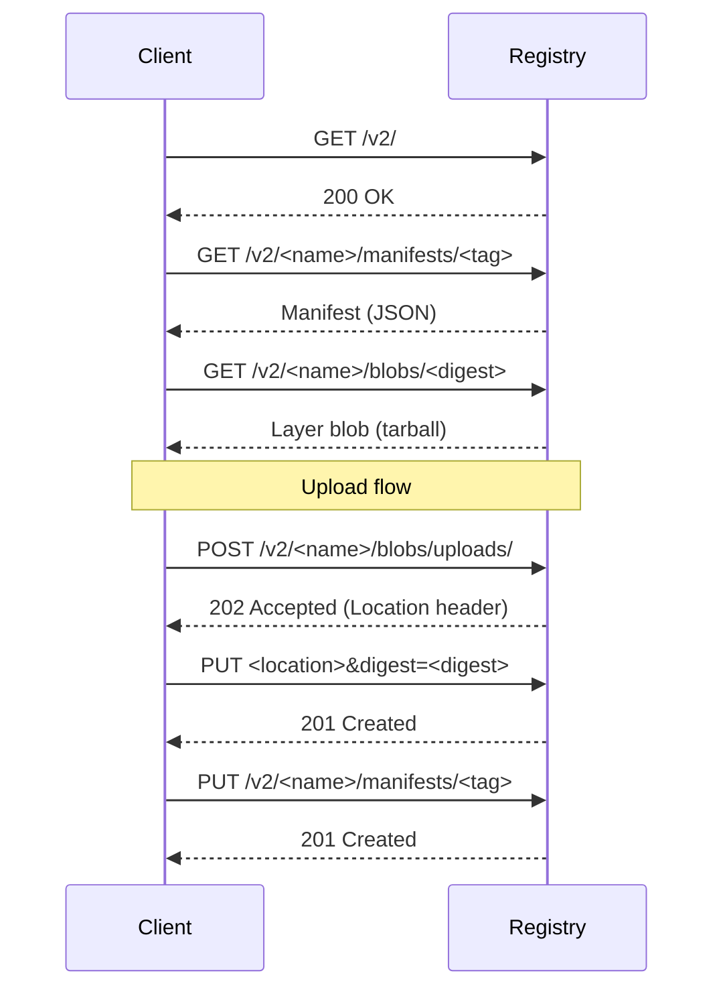

# OCI Standards

The Open Container Initiative (OCI) defines open standards for container formats and runtimes.
Founded in 2015 by Docker, CoreOS, Google, Microsoft, and others under the Linux Foundation,
the OCI ensures interoperability across container ecosystems.

## Introduction

Before OCI, Docker's container format and runtime were proprietary de facto standards. The OCI
was created to prevent vendor lock-in and ensure that a container image built by any tool could
run on any compliant runtime. The three core specifications are:

1. **Image Specification** — how container images are built and stored
2. **Runtime Specification** — how containers are executed
3. **Distribution Specification** — how container images are distributed via registries

## Image Specification

The OCI Image Spec defines the format of container images, consisting of manifests, configs,
and layers.

### Image Structure



### Manifest

The manifest describes which layers and config make up an image:

```json
{
  "schemaVersion": 2,
  "mediaType": "application/vnd.oci.image.manifest.v1+json",
  "config": {
    "mediaType": "application/vnd.oci.image.config.v1+json",
    "digest": "sha256:abc123...",
    "size": 7023
  },
  "layers": [
    {
      "mediaType": "application/vnd.oci.image.layer.v1.tar+gzip",
      "digest": "sha256:layer1...",
      "size": 32654
    },
    {
      "mediaType": "application/vnd.oci.image.layer.v1.tar+gzip",
      "digest": "sha256:layer2...",
      "size": 16724
    }
  ],
  "annotations": {
    "org.opencontainers.image.created": "2024-01-15T10:30:00Z",
    "org.opencontainers.image.title": "My Application"
  }
}
```

### Image Configuration

The config JSON defines execution parameters:

```json
{
  "created": "2024-01-15T10:30:00Z",
  "architecture": "amd64",
  "os": "linux",
  "config": {
    "Env": [
      "PATH=/usr/local/sbin:/usr/local/bin:/usr/sbin:/usr/bin:/sbin:/bin"
    ],
    "Entrypoint": ["/app/server"],
    "Cmd": ["--config", "/etc/app/config.yaml"],
    "ExposedPorts": {
      "8080/tcp": {}
    },
    "Labels": {
      "maintainer": "team@example.com"
    },
    "WorkingDir": "/app",
    "User": "1000:1000",
    "StopSignal": "SIGTERM"
  },
  "rootfs": {
    "type": "layers",
    "diff_ids": [
      "sha256:layer1diff...",
      "sha256:layer2diff..."
    ]
  },
  "history": [
    {
      "created": "2024-01-15T10:25:00Z",
      "created_by": "RUN apk add --no-cache ca-certificates"
    },
    {
      "created": "2024-01-15T10:28:00Z",
      "created_by": "COPY app /app/server"
    }
  ]
}
```

### Image Index (Multi-Architecture)

An image index references multiple platform-specific manifests:

```json
{
  "schemaVersion": 2,
  "mediaType": "application/vnd.oci.image.index.v1+json",
  "manifests": [
    {
      "mediaType": "application/vnd.oci.image.manifest.v1+json",
      "digest": "sha256:amd64manifest...",
      "size": 1234,
      "platform": {
        "architecture": "amd64",
        "os": "linux"
      }
    },
    {
      "mediaType": "application/vnd.oci.image.manifest.v1+json",
      "digest": "sha256:arm64manifest...",
      "size": 1234,
      "platform": {
        "architecture": "arm64",
        "os": "linux"
      }
    }
  ]
}
```

### Media Types

| Media Type                                          | Description                    |
|-----------------------------------------------------|--------------------------------|
| `application/vnd.oci.image.index.v1+json`           | Image index (multi-arch)       |
| `application/vnd.oci.image.manifest.v1+json`        | Image manifest                 |
| `application/vnd.oci.image.config.v1+json`          | Image configuration            |
| `application/vnd.oci.image.layer.v1.tar`            | Uncompressed layer             |
| `application/vnd.oci.image.layer.v1.tar+gzip`       | Gzip-compressed layer          |
| `application/vnd.oci.image.layer.v1.tar+zstd`       | Zstd-compressed layer          |
| `application/vnd.oci.image.layer.nondistributable.v1.tar+gzip` | Non-distributable layer |
| `application/vnd.oci.artifact.manifest.v1+json`     | Artifact manifest (OCI 1.1)    |

## Runtime Specification

The OCI Runtime Spec defines how a container is executed. It specifies:

1. **Filesystem bundle** — rootfs + `config.json`
2. **Container lifecycle** — create, start, kill, delete
3. **Platform configuration** — Linux namespaces, cgroups, capabilities

### Container Lifecycle



### config.json

The `config.json` in a container bundle specifies all container parameters:

```json
{
  "ociVersion": "1.0.2",
  "process": {
    "terminal": true,
    "user": {
      "uid": 1000,
      "gid": 1000
    },
    "args": ["/bin/sh"],
    "env": [
      "PATH=/usr/local/sbin:/usr/local/bin:/usr/sbin:/usr/bin:/sbin:/bin",
      "HOME=/home/user"
    ],
    "cwd": "/home/user",
    "capabilities": {
      "bounding": ["CAP_NET_BIND_SERVICE"],
      "effective": ["CAP_NET_BIND_SERVICE"],
      "inheritable": ["CAP_NET_BIND_SERVICE"],
      "permitted": ["CAP_NET_BIND_SERVICE"]
    },
    "rlimits": [
      {
        "type": "RLIMIT_NOFILE",
        "hard": 1024,
        "soft": 1024
      }
    ],
    "noNewPrivileges": true,
    "seccomp": {
      "defaultAction": "SCMP_ACT_ERRNO",
      "architectures": ["SCMP_ARCH_X86_64"],
      "syscalls": [
        {
          "names": ["read", "write", "exit", "exit_group"],
          "action": "SCMP_ACT_ALLOW"
        }
      ]
    },
    "apparmor": "container-default"
  },
  "root": {
    "path": "rootfs",
    "readonly": true
  },
  "hostname": "mycontainer",
  "linux": {
    "namespaces": [
      { "type": "pid" },
      { "type": "network" },
      { "type": "ipc" },
      { "type": "uts" },
      { "type": "mount" },
      { "type": "cgroup" }
    ],
    "resources": {
      "memory": {
        "limit": 536870912
      },
      "cpu": {
        "shares": 1024,
        "quota": 200000,
        "period": 100000
      }
    },
    "maskedPaths": [
      "/proc/kcore",
      "/proc/sysrq-trigger"
    ],
    "readonlyPaths": [
      "/proc/sys",
      "/proc/irq"
    ]
  }
}
```

### Using runc Directly

```bash
# Create a bundle
mkdir -p /tmp/mycontainer/rootfs

# Export an image to rootfs
docker export $(docker create alpine) | tar -xf - -C /tmp/mycontainer/rootfs

# Generate a default config
cd /tmp/mycontainer
runc spec

# This creates config.json with default settings
# Edit it to customize

# Create the container
sudo runc create mycontainer

# Start it
sudo runc start mycontainer

# Or run in one step
sudo runc run mycontainer

# List running containers
sudo runc list

# Get container state
sudo runc state mycontainer

# Kill
sudo runc kill mycontainer KILL

# Delete
sudo runc delete mycontainer
```

### runc Features

```bash
# Check runc version and features
runc --version

# runc supports:
# - Linux namespaces (pid, net, mnt, uts, ipc, cgroup, user)
# - Seccomp filtering
# - AppArmor profiles
# - SELinux labels
# - Capability bounding sets
# - Read-only rootfs
# - Resource limits (cgroups v1 and v2)
# - User namespaces
# - Checkpoint/restore (CRIU)
```

## Distribution Specification

The OCI Distribution Spec defines how container images are stored and retrieved from
registries via HTTP APIs.

### Registry API



### Key Endpoints

| Method | Endpoint                                 | Purpose                    |
|--------|------------------------------------------|----------------------------|
| `GET`  | `/v2/`                                   | Version check / auth       |
| `GET`  | `/v2/<name>/manifests/<reference>`       | Fetch manifest             |
| `PUT`  | `/v2/<name>/manifests/<reference>`       | Push manifest              |
| `GET`  | `/v2/<name>/blobs/<digest>`              | Pull blob                  |
| `POST` | `/v2/<name>/blobs/uploads/`              | Initiate blob upload       |
| `PATCH`| `/v2/<name>/blobs/uploads/<uuid>`        | Upload blob chunk          |
| `PUT`  | `/v2/<name>/blobs/uploads/<uuid>`        | Complete blob upload       |
| `HEAD` | `/v2/<name>/blobs/<digest>`              | Check blob existence       |
| `GET`  | `/v2/<name>/tags/list`                   | List tags                  |
| `GET`  | `/v2/<name>/referrers/<digest>`          | List referrers (OCI 1.1)  |

### Interacting with a Registry

```bash
# Check registry API version
curl -s https://registry-1.docker.io/v2/
# {}

# Get auth token for Docker Hub
TOKEN=$(curl -s "https://auth.docker.io/token?service=registry.docker.io&scope=repository:library/alpine:pull" | jq -r .token)

# Fetch manifest
curl -s -H "Authorization: Bearer $TOKEN" \
  -H "Accept: application/vnd.oci.image.manifest.v1+json" \
  https://registry-1.docker.io/v2/library/alpine/manifests/latest | jq .

# Check blob existence
DIGEST="sha256:..."
curl -sI -H "Authorization: Bearer $TOKEN" \
  https://registry-1.docker.io/v2/library/alpine/blobs/$DIGEST
```

## OCI Artifacts (OCI 1.1+)

OCI 1.1 introduced the ability to store arbitrary artifacts in container registries, not
just container images:

- Helm charts
- Sigstore signatures and attestations
- SBOM (Software Bill of Materials)
- WASM modules
- ML models

```json
{
  "mediaType": "application/vnd.oci.artifact.manifest.v1+json",
  "artifactType": "application/vnd.example.custom.v1",
  "blobs": [
    {
      "mediaType": "application/octet-stream",
      "digest": "sha256:...",
      "size": 1234
    }
  ],
  "subject": {
    "mediaType": "application/vnd.oci.image.manifest.v1+json",
    "digest": "sha256:image-manifest...",
    "size": 5678
  }
}
```

## Content Addressability

All OCI content is addressed by its SHA-256 digest. This provides:

- **Deduplication** — identical layers stored once
- **Integrity** — any corruption is detected
- **Immutability** — content cannot change without changing its address
- **Caching** — efficient layer sharing across images

```bash
# Compute digest of a file
sha256sum layer.tar
# abc123...  layer.tar

# Docker content trust verifies digests
docker trust inspect --pretty myregistry/myimage:latest
```

## Tools That Implement OCI

| Tool           | OCI Image | OCI Runtime | OCI Distribution |
|----------------|-----------|-------------|------------------|
| Docker         | ✅        | ✅ (runc)   | ✅               |
| containerd     | ✅        | ✅ (runc)   | ✅               |
| Podman         | ✅        | ✅ (crun)   | ✅               |
| Buildah        | ✅        | N/A         | ✅               |
| Skopeo         | ✅        | N/A         | ✅               |
| Kubernetes     | ✅        | ✅ (via CRI) | ✅              |
| nerdctl        | ✅        | ✅           | ✅               |
| crane          | ✅        | N/A         | ✅               |

### Skopeo — OCI Image Tool

```bash
# Inspect remote image without pulling
skopeo inspect docker://docker.io/library/alpine:latest

# Copy between registries
skopeo copy docker://docker.io/library/alpine:latest \
    docker://myregistry.local/alpine:latest

# Convert Docker format to OCI format
skopeo copy docker://docker.io/library/alpine:latest \
    oci:/tmp/alpine-oci:latest

# List tags
skopeo list-tags docker://docker.io/library/alpine
```

### crane — Registry Interaction

```bash
# List tags
crane ls docker.io/library/alpine

# Pull image manifest
crane manifest docker.io/library/alpine:latest

# Copy images
crane copy docker.io/library/alpine:latest myregistry.local/alpine:latest

# Digest of an image
crane digest docker.io/library/alpine:latest
```

## Building OCI Images

### Buildah (Rootless)

```bash
# Create a container from scratch
ctr=$(buildah from scratch)

# Add content
buildah copy $ctr ./app /app/server
buildah config --entrypoint '/app/server' $ctr
buildah config --port 8080 $ctr

# Commit as OCI image
buildah commit --format oci $ctr myregistry.local/myapp:latest

# Push to registry
buildah push myregistry.local/myapp:latest
```

### Docker Build with OCI Output

```bash
# Build and export as OCI tarball
docker buildx build --output type=oci,dest=myimage.tar -t myapp:latest .

# Build and push as OCI
docker buildx build --output type=registry -t myregistry.local/myapp:latest .
```

## References

- [OCI Image Specification](https://github.com/opencontainers/image-spec) — image format
- [OCI Runtime Specification](https://github.com/opencontainers/runtime-spec) — runtime behavior
- [OCI Distribution Specification](https://github.com/opencontainers/distribution-spec) — registry API
- [runc](https://github.com/opencontainers/runc) — reference runtime implementation
- [OCI Media Types](https://github.com/opencontainers/image-spec/blob/main/media-types.md)
- [LWN: OCI and the container ecosystem](https://lwn.net/Articles/oci-containers/) — overview
- [man7.org: namespaces(7)](https://man7.org/linux/man-pages/man7/namespaces.7.html) — Linux namespaces

## Related Topics

- [containerd](./containerd.md) — implements OCI specs for container management
- [Podman](./podman.md) — OCI-compliant container engine
- [Container Security](./security.md) — securing OCI containers
- [Rootless Containers](./rootless.md) — running OCI containers without root
