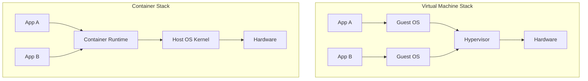
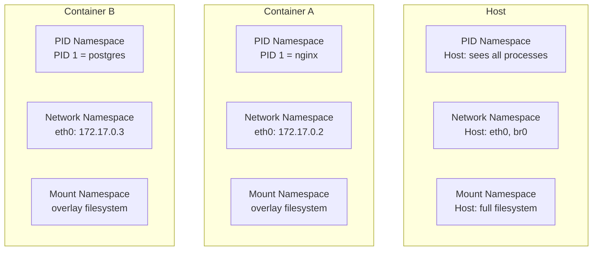
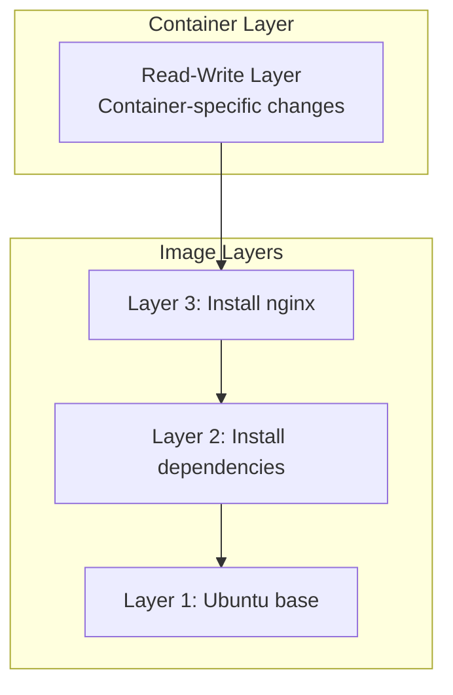
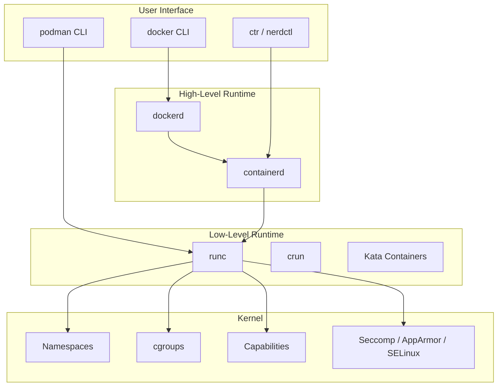
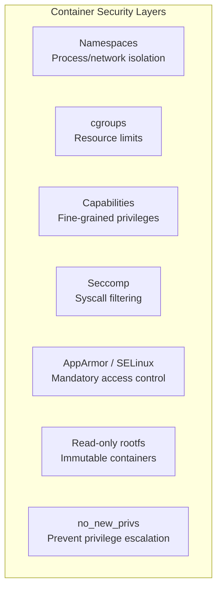
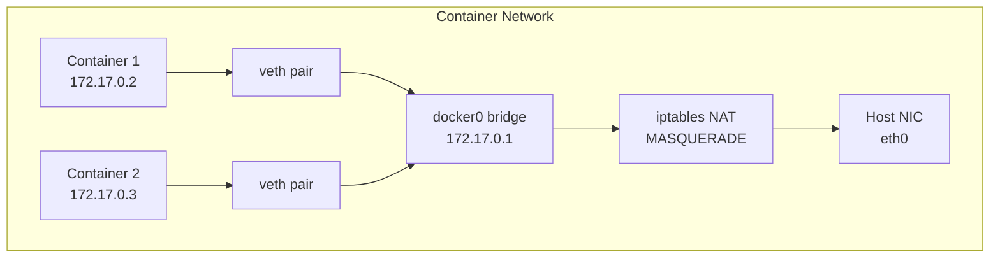
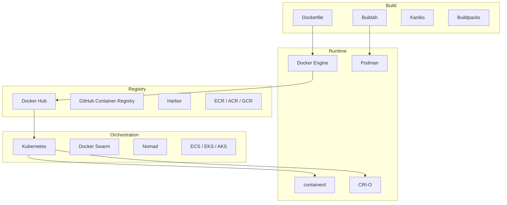

# Container Overview

## Introduction

Containers are a lightweight operating system virtualization method that packages an application with its dependencies into a single, portable unit. Unlike virtual machines, which virtualize hardware and run a full operating system kernel, containers share the host kernel and isolate processes using kernel features like namespaces, cgroups, and union filesystems.

Containers have fundamentally changed how software is built, shipped, and run. They enable consistent environments from development to production, rapid deployment, efficient resource utilization, and microservice architectures.

## Containers vs Virtual Machines

Understanding the distinction between containers and VMs is crucial:



| Aspect | Virtual Machine | Container |
|--------|----------------|-----------|
| Isolation level | Hardware-level | OS-level |
| Kernel | Each VM has its own kernel | Shares host kernel |
| Boot time | Seconds to minutes | Milliseconds |
| Memory overhead | Hundreds of MB per VM | MB per container |
| Image size | GB (full OS) | MB (app + deps) |
| Density | 10s per host | 100s-1000s per host |
| Security boundary | Strong (hardware isolation) | Weaker (kernel shared) |
| OS support | Any OS | Same kernel family |
| Use case | Different OS, strong isolation | Same OS, many instances |

### Performance Comparison

```bash
# VM startup time
time virsh start myvm
# real    0m8.234s

# Container startup time
time docker run --rm alpine echo "hello"
# real    0m0.847s

# Memory overhead
# VM with minimal Linux: ~256MB
# Container with Alpine: ~5MB
```

## Core Container Technologies

### Namespaces

Namespaces provide isolation of system resources. Each container gets its own view of the system:



**Namespace types:**

| Namespace | Flag | Isolates |
|-----------|------|----------|
| PID | `CLONE_NEWPID` | Process IDs |
| Network | `CLONE_NEWNET` | Network stack |
| Mount | `CLONE_NEWNS` | Mount points |
| UTS | `CLONE_NEWUTS` | Hostname |
| IPC | `CLONE_NEWIPC` | IPC resources |
| User | `CLONE_NEWUSER` | User/group IDs |
| Cgroup | `CLONE_NEWCGROUP` | Cgroup root |
| Time | `CLONE_NEWTIME` | System clocks |

See [Container Primitives](./primitives.md) for deep details on each namespace.

### Control Groups (cgroups)

cgroups limit and account for resource usage:

```bash
# Create a cgroup
mkdir /sys/fs/cgroup/my-container

# Limit memory to 512MB
echo 536870912 > /sys/fs/cgroup/my-container/memory.max

# Limit CPU to 50% of one core
echo 50000 100000 > /sys/fs/cgroup/my-container/cpu.max

# Limit I/O to 10MB/s read
echo "8:0 rbps=10485760" > /sys/fs/cgroup/my-container/io.max

# Run a process in the container's cgroup
echo $$ > /sys/fs/cgroup/my-container/cgroup.procs
```

See [cgroups v2](./cgroups-v2.md) for comprehensive coverage.

### Union Filesystems

Union filesystems (also called union mounts) layer multiple directories into a single unified view. This is the foundation of container images:



**Common union filesystem implementations:**

| Filesystem | Kernel Support | Notes |
|-----------|---------------|-------|
| overlay2 | Linux 3.18+ | Default for Docker, most common |
| fuse-overlayfs | FUSE | Rootless containers |
| devicemapper | Linux 3.x | Deprecated, thin provisioning |
| btrfs | Linux 3.x | Copy-on-write filesystem |
| zfs | Linux 3.x+ (module) | Advanced features |

```bash
# overlay2 example
# Lower layers (image, read-only)
# Upper layer (container, read-write)
# Merged view (what the container sees)

mount -t overlay overlay \
  -o lowerdir=/lower1:/lower2,upperdir=/upper,workdir=/work \
  /merged

# Docker uses this automatically:
docker inspect --format '{{.GraphDriver.Data}}' mycontainer
# map[MergedDir:/var/lib/docker/overlay2/abc123/merged
#     UpperDir:/var/lib/docker/overlay2/abc123/diff
#     WorkDir:/var/lib/docker/overlay2/abc123/work
#     LowerDir:/var/lib/docker/overlay2/base/diff]
```

## Container Runtime Stack



### OCI (Open Container Initiative)

The OCI defines container standards:

| Specification | Purpose |
|--------------|---------|
| **Runtime Spec** | How to run a container (runc interface) |
| **Image Spec** | How container images are structured |
| **Distribution Spec** | How images are distributed (registry API) |

```bash
# OCI image structure
# An image is a manifest + layers + config
# Each layer is a tarball of filesystem changes

# Inspect OCI image
skopeo inspect docker://docker.io/library/alpine:latest
# {
#     "Name": "docker.io/library/alpine",
#     "Digest": "sha256:...",
#     "RepoTags": ["3.18", "3.19", "latest", ...],
#     "Architecture": "amd64",
#     "Os": "linux",
#     "Layers": ["sha256:..."]
# }
```

## Container Security Model



### Security Comparison: VM vs Container

```bash
# VM: Full kernel isolation
# Even a kernel exploit in the guest doesn't affect the host
# Hardware-enforced memory isolation via EPT/NPT

# Container: Shared kernel
# A kernel exploit can escape the container
# Mitigations:
#   - Seccomp profiles (block dangerous syscalls)
#   - AppArmor/SELinux policies
#   - User namespaces (map container root to unprivileged host user)
#   - Read-only rootfs
#   - Drop capabilities
#   - No new privileges

# Docker default security profile
docker run --rm alpine cat /proc/1/status | grep -i seccomp
# Seccomp:    2  (filtered)
```

## Container Networking



**Common network modes:**

| Mode | Description | Use Case |
|------|-------------|----------|
| **bridge** | Private network with NAT | Default, most containers |
| **host** | Container uses host network | High-performance networking |
| **none** | No networking | Isolated containers |
| **macvlan** | Direct L2 on host NIC | Legacy apps needing real IP |
| **overlay** | Multi-host networking | Docker Swarm, K8s |
| **ipvlan** | L3 networking | Advanced routing |

```bash
# Docker bridge networking
docker network ls
docker network inspect bridge
# "IPAM": {"Config": [{"Subnet": "172.17.0.0/16", "Gateway": "172.17.0.1"}]}

# Create custom network
docker network create --driver bridge \
  --subnet 10.0.1.0/24 \
  --gateway 10.0.1.1 \
  my-network

# Run container in specific network
docker run --network my-network --ip 10.0.1.10 nginx
```

See [Docker Internals](./docker-internals.md) for detailed networking implementation.

## Container Storage

```bash
# Docker storage drivers
docker info | grep "Storage Driver"
# Storage Driver: overlay2

# Volume types:
# 1. Named volumes (managed by Docker)
docker volume create mydata
docker run -v mydata:/app/data nginx

# 2. Bind mounts (host directory)
docker run -v /host/path:/container/path nginx

# 3. tmpfs (in-memory)
docker run --tmpfs /app/cache nginx

# Volume drivers for distributed storage
# - local, nfs, cifs
# - cloud: aws-ebs, gce-pd, azure-disk
```

## Container Ecosystem



## Practical Examples

### Running a Container

```bash
# Basic container run
docker run -d --name web \
  -p 8080:80 \
  -v ./html:/usr/share/nginx/html:ro \
  --memory 256m \
  --cpus 1.5 \
  --restart unless-stopped \
  nginx:alpine

# Container lifecycle
docker ps                         # List running containers
docker ps -a                      # List all containers
docker logs web                   # View logs
docker exec -it web sh            # Shell into container
docker stats web                  # Resource usage
docker inspect web                # Full metadata
docker stop web && docker rm web  # Stop and remove
```

### Building Images

```dockerfile
# Multi-stage Dockerfile
FROM golang:1.21 AS builder
WORKDIR /app
COPY go.mod go.sum ./
RUN go mod download
COPY . .
RUN CGO_ENABLED=0 go build -o server .

FROM alpine:3.19
RUN apk --no-cache add ca-certificates
COPY --from=builder /app/server /usr/local/bin/
EXPOSE 8080
USER nobody:nobody
ENTRYPOINT ["server"]
```

```bash
# Build and run
docker build -t myserver:latest .
docker run -d -p 8080:8080 myserver:latest
```

## References

1. Merkel, D. (2014). "Docker: Lightweight Linux Containers for Consistent Development and Deployment." *Linux Journal*, 2014(239).
2. Soltesz, S., et al. (2007). "Container-based Operating System Virtualization: A Scalable, High-performance Alternative to Hypervisors." *EuroSys '07*.
3. OCI Runtime Specification. [https://github.com/opencontainers/runtime-spec](https://github.com/opencontainers/runtime-spec)
4. Linux Kernel Documentation: Namespaces. [https://man7.org/linux/man-pages/man7/namespaces.7.html](https://man7.org/linux/man-pages/man7/namespaces.7.html)

## Further Reading

- [Docker Documentation](https://docs.docker.com/)
- [Podman Documentation](https://podman.io/docs)
- [OCI Specifications](https://opencontainers.org/)
- [containerd Documentation](https://containerd.io/docs/)
- [Kubernetes Documentation](https://kubernetes.io/docs/)
- [Linux Containers (LXC)](https://linuxcontainers.org/)

## Related Topics

- [Container Primitives](./primitives.md) — namespaces, cgroups, seccomp in detail
- [Docker Internals](./docker-internals.md) — containerd, runc, image layers
- [Kubernetes and Linux](./kubernetes.md) — container orchestration
- [cgroups v2](./cgroups-v2.md) — resource management
- [Virtualization Overview](../virtualization/overview.md) — VM-based alternatives
