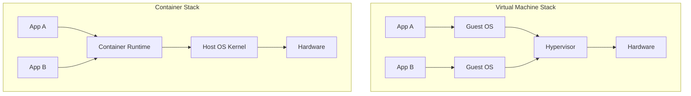
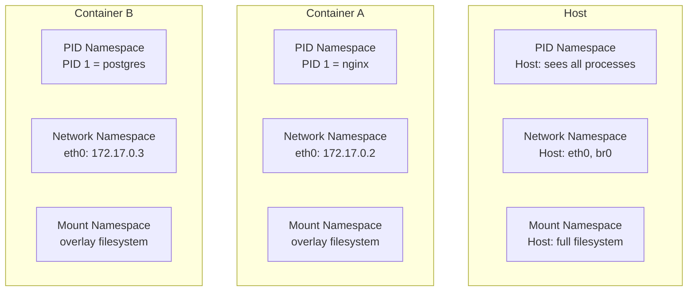
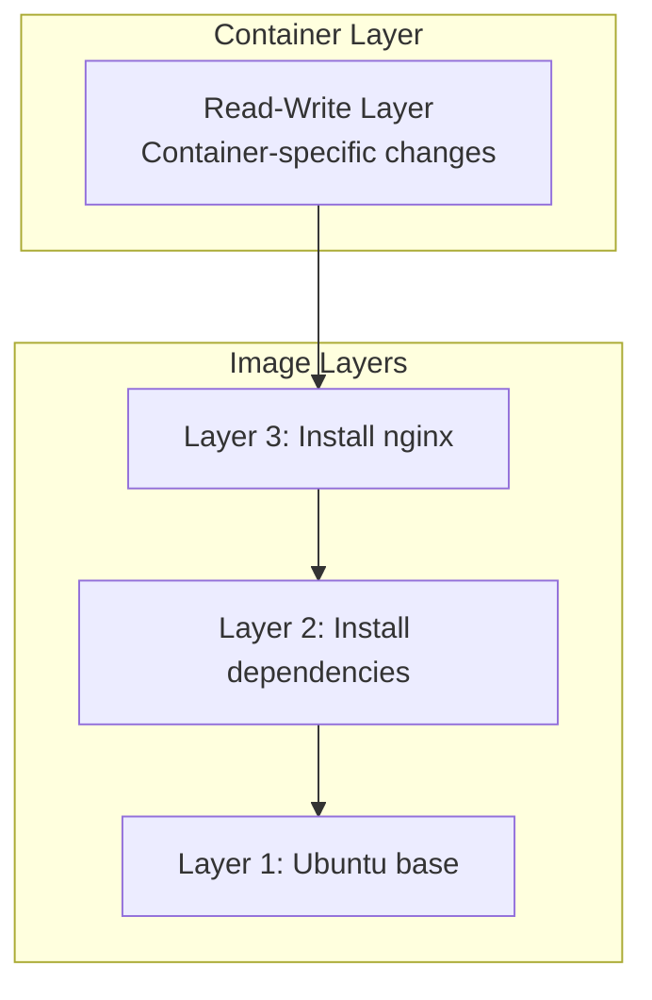
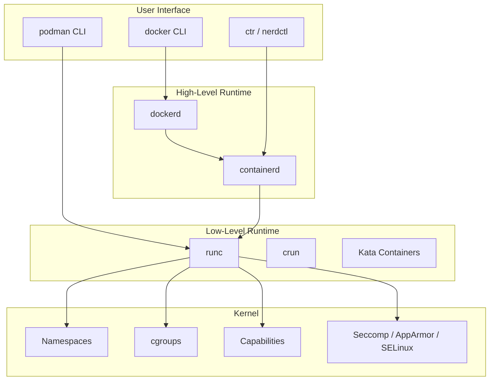
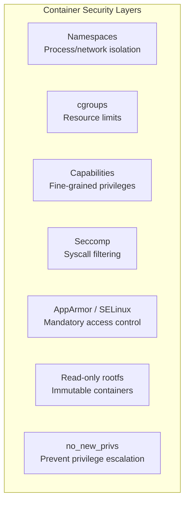
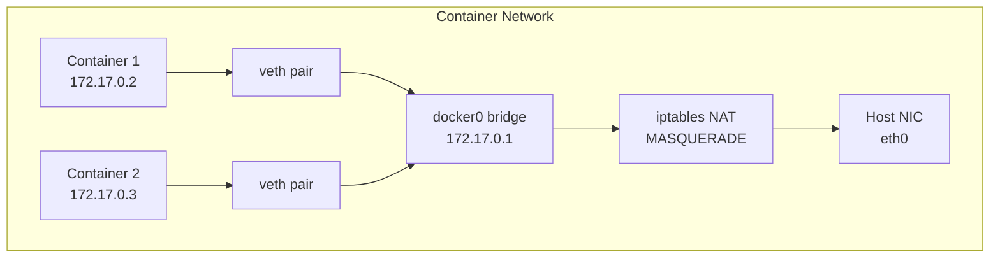
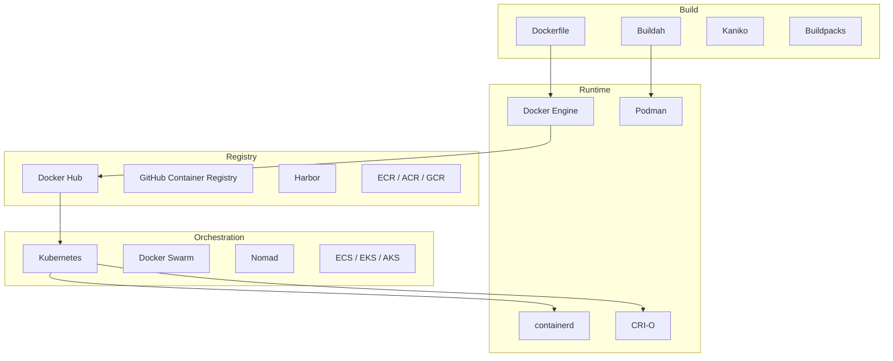

# Container Overview

## Introduction

Containers are a lightweight operating system virtualization method that packages an application with its dependencies into a single, portable unit. Unlike virtual machines, which virtualize hardware and run a full operating system kernel, containers share the host kernel and isolate processes using kernel features like namespaces, cgroups, and union filesystems.

Containers have fundamentally changed how software is built, shipped, and run. They enable consistent environments from development to production, rapid deployment, efficient resource utilization, and microservice architectures.

## Containers vs Virtual Machines

Understanding the distinction between containers and VMs is crucial:



| Aspect | Virtual Machine | Container |
|--------|----------------|-----------|
| Isolation level | Hardware-level | OS-level |
| Kernel | Each VM has its own kernel | Shares host kernel |
| Boot time | Seconds to minutes | Milliseconds |
| Memory overhead | Hundreds of MB per VM | MB per container |
| Image size | GB (full OS) | MB (app + deps) |
| Density | 10s per host | 100s-1000s per host |
| Security boundary | Strong (hardware isolation) | Weaker (kernel shared) |
| OS support | Any OS | Same kernel family |
| Use case | Different OS, strong isolation | Same OS, many instances |

### Performance Comparison

```bash
# VM startup time
time virsh start myvm
# real    0m8.234s

# Container startup time
time docker run --rm alpine echo "hello"
# real    0m0.847s

# Memory overhead
# VM with minimal Linux: ~256MB
# Container with Alpine: ~5MB
```

## Core Container Technologies

### Namespaces

Namespaces provide isolation of system resources. Each container gets its own view of the system:



**Namespace types:**

| Namespace | Flag | Isolates |
|-----------|------|----------|
| PID | `CLONE_NEWPID` | Process IDs |
| Network | `CLONE_NEWNET` | Network stack |
| Mount | `CLONE_NEWNS` | Mount points |
| UTS | `CLONE_NEWUTS` | Hostname |
| IPC | `CLONE_NEWIPC` | IPC resources |
| User | `CLONE_NEWUSER` | User/group IDs |
| Cgroup | `CLONE_NEWCGROUP` | Cgroup root |
| Time | `CLONE_NEWTIME` | System clocks |

See [Container Primitives](./primitives.md) for deep details on each namespace.

### Control Groups (cgroups)

cgroups limit and account for resource usage:

```bash
# Create a cgroup
mkdir /sys/fs/cgroup/my-container

# Limit memory to 512MB
echo 536870912 > /sys/fs/cgroup/my-container/memory.max

# Limit CPU to 50% of one core
echo 50000 100000 > /sys/fs/cgroup/my-container/cpu.max

# Limit I/O to 10MB/s read
echo "8:0 rbps=10485760" > /sys/fs/cgroup/my-container/io.max

# Run a process in the container's cgroup
echo $$ > /sys/fs/cgroup/my-container/cgroup.procs
```

See [cgroups v2](./cgroups-v2.md) for comprehensive coverage.

### Union Filesystems

Union filesystems (also called union mounts) layer multiple directories into a single unified view. This is the foundation of container images:



**Common union filesystem implementations:**

| Filesystem | Kernel Support | Notes |
|-----------|---------------|-------|
| overlay2 | Linux 3.18+ | Default for Docker, most common |
| fuse-overlayfs | FUSE | Rootless containers |
| devicemapper | Linux 3.x | Deprecated, thin provisioning |
| btrfs | Linux 3.x | Copy-on-write filesystem |
| zfs | Linux 3.x+ (module) | Advanced features |

```bash
# overlay2 example
# Lower layers (image, read-only)
# Upper layer (container, read-write)
# Merged view (what the container sees)

mount -t overlay overlay \
  -o lowerdir=/lower1:/lower2,upperdir=/upper,workdir=/work \
  /merged

# Docker uses this automatically:
docker inspect --format '{{.GraphDriver.Data}}' mycontainer
# map[MergedDir:/var/lib/docker/overlay2/abc123/merged
#     UpperDir:/var/lib/docker/overlay2/abc123/diff
#     WorkDir:/var/lib/docker/overlay2/abc123/work
#     LowerDir:/var/lib/docker/overlay2/base/diff]
```

## Container Runtime Stack



### OCI (Open Container Initiative)

The OCI defines container standards:

| Specification | Purpose |
|--------------|---------|
| **Runtime Spec** | How to run a container (runc interface) |
| **Image Spec** | How container images are structured |
| **Distribution Spec** | How images are distributed (registry API) |

```bash
# OCI image structure
# An image is a manifest + layers + config
# Each layer is a tarball of filesystem changes

# Inspect OCI image
skopeo inspect docker://docker.io/library/alpine:latest
# {
#     "Name": "docker.io/library/alpine",
#     "Digest": "sha256:...",
#     "RepoTags": ["3.18", "3.19", "latest", ...],
#     "Architecture": "amd64",
#     "Os": "linux",
#     "Layers": ["sha256:..."]
# }
```

### Runtime Comparison

| Runtime | Language | Use Case | Performance |
|---------|----------|----------|-------------|
| runc | Go | Default OCI runtime | Standard |
| crun | C | Lightweight, rootless | Faster startup |
| gVisor | Go | Sandboxed (user-space kernel) | Moderate overhead |
| Kata Containers | Go/Rust | VM-based isolation | VM overhead |
| Firecracker | Rust | MicroVMs for serverless | Fast VM startup |

```bash
# Check current runtime
docker info | grep -i runtime
# Runtimes: runc

# Use crun (Podman default)
podman --runtime crun run alpine echo "fast"

# View container runtime details
podman info | grep -A5 runtime
# OCIRuntime:
#   Name: crun
#   Package: crun-1.12-1.fc39.x86_64
#   Path: /usr/bin/crun
#   Version: 1.12
```

## Container Security Model



### Security Comparison: VM vs Container

```bash
# VM: Full kernel isolation
# Even a kernel exploit in the guest doesn't affect the host
# Hardware-enforced memory isolation via EPT/NPT

# Container: Shared kernel
# A kernel exploit can escape the container
# Mitigations:
#   - Seccomp profiles (block dangerous syscalls)
#   - AppArmor/SELinux policies
#   - User namespaces (map container root to unprivileged host user)
#   - Read-only rootfs
#   - Drop capabilities
#   - No new privileges

# Docker default security profile
docker run --rm alpine cat /proc/1/status | grep -i seccomp
# Seccomp:    2  (filtered)
```

### Security Best Practices

```bash
# 1. Drop all capabilities, add only what's needed
docker run --cap-drop=ALL --cap-add=NET_BIND_SERVICE nginx

# 2. Read-only rootfs
docker run --read-only --tmpfs /tmp nginx

# 3. No new privileges
docker run --security-opt=no-new-privileges nginx

# 4. Non-root user
docker run --user 1000:1000 nginx

# 5. Custom seccomp profile
docker run --security-opt seccomp=/etc/seccomp/nginx.json nginx

# 6. AppArmor profile
docker run --security-opt apparmor=nginx-profile nginx

# 7. Resource limits
docker run --memory=512m --cpus=1.5 --pids-limit=100 nginx

# 8. Scan images for vulnerabilities
trivy image nginx:latest
grype nginx:latest
```

## Container Networking



**Common network modes:**

| Mode | Description | Use Case |
|------|-------------|----------|
| **bridge** | Private network with NAT | Default, most containers |
| **host** | Container uses host network | High-performance networking |
| **none** | No networking | Isolated containers |
| **macvlan** | Direct L2 on host NIC | Legacy apps needing real IP |
| **overlay** | Multi-host networking | Docker Swarm, K8s |
| **ipvlan** | L3 networking | Advanced routing |

```bash
# Docker bridge networking
docker network ls
docker network inspect bridge
# "IPAM": {"Config": [{"Subnet": "172.17.0.0/16", "Gateway": "172.17.0.1"}]}

# Create custom network
docker network create --driver bridge \
  --subnet 10.0.1.0/24 \
  --gateway 10.0.1.1 \
  my-network

# Run container in specific network
docker run --network my-network --ip 10.0.1.10 nginx

# Container DNS resolution
docker run --name=myapp nginx
docker run --link myapp alpine ping myapp  # Legacy linking
# Modern: use custom networks (DNS-based discovery)

# Network debugging from inside container
docker run --rm alpine sh -c "ip addr show && ip route && ping -c1 8.8.8.8"
```

### CNI (Container Network Interface)

```bash
# CNI is the standard for container networking (Kubernetes)
# Plugins: bridge, flannel, calico, cilium, weave

# List CNI plugins
ls /opt/cni/bin/
# bandwidth  bridge  calico  calico-ipam  dhcp  flannel  host-device
# host-local  ipvlan  loopback  macvlan  portmap  ptp  tuning  vlan

# CNI configuration
cat /etc/cni/net.d/10-flannel.conflist
{
    "name": "cbr0",
    "cniVersion": "0.3.1",
    "plugins": [
        {
            "type": "flannel",
            "delegate": {
                "hairpinMode": true,
                "isDefaultGateway": true
            }
        },
        {
            "type": "portmap",
            "capabilities": {"portMappings": true}
        }
    ]
}
```

See [Docker Internals](./docker-internals.md) for detailed networking implementation.

## Container Storage

```bash
# Docker storage drivers
docker info | grep "Storage Driver"
# Storage Driver: overlay2

# Volume types:
# 1. Named volumes (managed by Docker)
docker volume create mydata
docker run -v mydata:/app/data nginx

# 2. Bind mounts (host directory)
docker run -v /host/path:/container/path nginx

# 3. tmpfs (in-memory)
docker run --tmpfs /app/cache nginx

# Volume drivers for distributed storage
# - local, nfs, cifs
# - cloud: aws-ebs, gce-pd, azure-disk
```

### Storage Best Practices

```bash
# 1. Use named volumes for persistent data
docker volume create pgdata
docker run -v pgdata:/var/lib/postgresql/data postgres

# 2. Use bind mounts for development
docker run -v $(pwd)/src:/app/src:ro nginx

# 3. Use tmpfs for sensitive data
docker run --tmpfs /run/secrets:ro,noexec,size=1m nginx

# 4. Clean up unused volumes
docker volume prune

# 5. Check volume usage
docker system df -v
```

## Container Image Best Practices

### Multi-Stage Builds

```dockerfile
# Multi-stage Dockerfile
FROM golang:1.21 AS builder
WORKDIR /app
COPY go.mod go.sum ./
RUN go mod download
COPY . .
RUN CGO_ENABLED=0 go build -o server .

FROM alpine:3.19
RUN apk --no-cache add ca-certificates
COPY --from=builder /app/server /usr/local/bin/
EXPOSE 8080
USER nobody:nobody
ENTRYPOINT ["server"]
```

```bash
# Build and run
docker build -t myserver:latest .
docker run -d -p 8080:8080 myserver:latest
```

### Image Security Scanning

```bash
# Scan with Trivy
trivy image nginx:latest
# nginx:latest (debian 12.4)
# Total: 42 (UNKNOWN: 0, LOW: 20, MEDIUM: 15, HIGH: 7, CRITICAL: 0)

# Scan with Grype
grype nginx:latest

# Scan with Docker Scout
docker scout cves nginx:latest

# Use minimal base images
FROM alpine:3.19    # ~5MB
FROM scratch        # ~0MB (static binaries only)
FROM distroless     # ~20MB (no shell, no package manager)
```

## Container Orchestration



### Kubernetes Pod Example

```yaml
# pod.yaml
apiVersion: v1
kind: Pod
metadata:
  name: webapp
  labels:
    app: webapp
spec:
  containers:
    - name: nginx
      image: nginx:1.25-alpine
      ports:
        - containerPort: 80
      resources:
        requests:
          memory: "64Mi"
          cpu: "250m"
        limits:
          memory: "128Mi"
          cpu: "500m"
      livenessProbe:
        httpGet:
          path: /healthz
          port: 80
        initialDelaySeconds: 5
        periodSeconds: 10
      readinessProbe:
        httpGet:
          path: /ready
          port: 80
        initialDelaySeconds: 3
        periodSeconds: 5
```

## Container Monitoring

```bash
# Container resource usage
docker stats --no-stream
# CONTAINER ID  NAME   CPU %  MEM USAGE / LIMIT  MEM %  NET I/O  BLOCK I/O  PIDS
# abc123        web    0.50%  50MiB / 512MiB     9.77%  1kB / 2kB  0B / 0B  5

# Container logs
docker logs --tail 100 -f web

# Container inspect
docker inspect web | jq '.[0].State'

# Container filesystem changes
docker diff web

# Export container filesystem
docker export web > web.tar

# Container resource limits (cgroup v2)
cat /sys/fs/cgroup/system.slice/docker-abc123.scope/memory.max
cat /sys/fs/cgroup/system.slice/docker-abc123.scope/cpu.max
```

## Practical Examples

### Running a Container

```bash
# Basic container run
docker run -d --name web \
  -p 8080:80 \
  -v ./html:/usr/share/nginx/html:ro \
  --memory 256m \
  --cpus 1.5 \
  --restart unless-stopped \
  nginx:alpine

# Container lifecycle
docker ps                         # List running containers
docker ps -a                      # List all containers
docker logs web                   # View logs
docker exec -it web sh            # Shell into container
docker stats web                  # Resource usage
docker inspect web                # Full metadata
docker stop web && docker rm web  # Stop and remove
```

### Podman (Rootless Alternative)

```bash
# Podman is Docker-compatible but rootless by default
podman run -d --name web -p 8080:80 nginx:alpine

# No daemon required
podman ps
podman logs web
podman exec -it web sh

# Generate systemd service
podman generate systemd --new --name web > /etc/systemd/system/web.service
systemctl enable --now web.service

# Quadlet (native systemd integration)
# See podman-quadlet.md
```

### Container Debugging

```bash
# Debug a crashing container
docker run --rm -it --entrypoint sh nginx

# Check container processes
docker top web

# Network debugging
docker exec web cat /etc/resolv.conf
docker exec web ip addr show
docker exec web ping -c1 8.8.8.8

# Filesystem debugging
docker exec web df -h
docker exec web ls -la /app/

# Strace a container process
docker run --cap-add=SYS_PTRACE --rm -it alpine strace -p 1

# nsenter (enter container namespaces from host)
PID=$(docker inspect --format '{{.State.Pid}}' web)
nsenter -t $PID -m -n -p -- /bin/sh
```

## References

1. Merkel, D. (2014). "Docker: Lightweight Linux Containers for Consistent Development and Deployment." *Linux Journal*, 2014(239).
2. Soltesz, S., et al. (2007). "Container-based Operating System Virtualization: A Scalable, High-performance Alternative to Hypervisors." *EuroSys '07*.
3. OCI Runtime Specification. [https://github.com/opencontainers/runtime-spec](https://github.com/opencontainers/runtime-spec)
4. Linux Kernel Documentation: Namespaces. [https://man7.org/linux/man-pages/man7/namespaces.7.html](https://man7.org/linux/man-pages/man7/namespaces.7.html)

## Further Reading

- [The Linux Kernel Documentation](https://docs.kernel.org/)
- [LWN.net - Linux and free software news](https://lwn.net/)
- [GNU Project Documentation](https://www.gnu.org/doc/doc.html)
- [GNU Manuals](https://www.gnu.org/manual/manual.html)
- [Free Software Directory](https://directory.fsf.org/wiki/Main_Page)
- [Planet GNU](https://planet.gnu.org/)
- [Free Software Books](https://www.gnu.org/doc/other-free-books.html)

- [Docker Documentation](https://docs.docker.com/)
- [Podman Documentation](https://podman.io/docs)
- [OCI Specifications](https://opencontainers.org/)
- [containerd Documentation](https://containerd.io/docs/)
- [Kubernetes Documentation](https://kubernetes.io/docs/)
- [Linux Containers (LXC)](https://linuxcontainers.org/)

## Related Topics

- [Container Primitives](./primitives.md) — namespaces, cgroups, seccomp in detail
- [Docker Internals](./docker-internals.md) — containerd, runc, image layers
- [Kubernetes and Linux](./kubernetes.md) — container orchestration
- [cgroups v2](./cgroups-v2.md) — resource management
- [Virtualization Overview](../virtualization/overview.md) — VM-based alternatives
