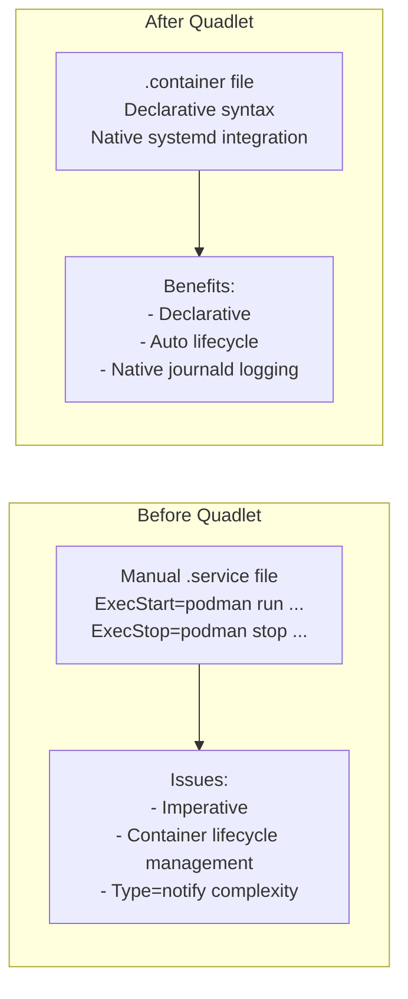
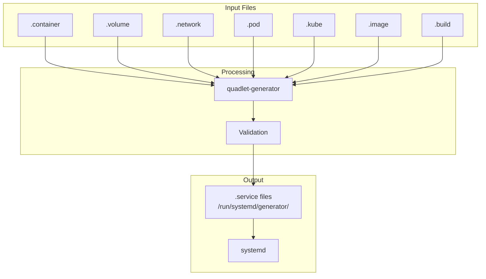

# Quadlet — Systemd Integration for Containers

Quadlet is a systemd generator that translates declarative container
definitions into native systemd units.  Introduced in Podman 4.4 (January
2023), Quadlet lets you define containers, pods, volumes, and networks in
simple `.container`, `.volume`, `.network`, and `.pod` files that systemd
treats as first-class services.

---

## 1. Motivation

Before Quadlet, running containers as systemd services required:

1. Writing a `.service` file with `ExecStart=podman run ...`
2. Managing container lifecycle manually (`podman stop`, `podman rm`)
3. Handling restart policies, logging, and dependencies by hand
4. Dealing with `Type=forking` vs `Type=notify` quirks

Quadlet eliminates this by generating correct systemd units from a
declarative, container-native syntax.

### Before vs After Quadlet



---

## 2. How Quadlet Works

```
~/.config/containers/systemd/   (user units)
/etc/containers/systemd/        (system units)
         │
         ▼
   quadlet-generator              (systemd generator)
         │
         ▼
   /run/systemd/generator/        (generated .service files)
         │
         ▼
   systemd starts the container   (via podman run)
```

The `quadlet-generator` binary runs early in the boot process (like other
systemd generators) and translates `.container` files into `.service` files.

### Quadlet Processing Flow



### Generator Internals

```bash
# Quadlet generator location
which quadlet-generator
# /usr/libexec/podman/quadlet-generator

# Manually run generator (for debugging)
/usr/libexec/podman/quadlet-generator --user
# Generates .service files in ~/.config/systemd/user/

# View generated service files
ls /run/systemd/generator/
# web.service  db.service  mypod.service

# Check generator status
systemctl status quadlet-generator
```

---

## 3. File Types

| Extension | Purpose | Example |
|---|---|---|
| `.container` | Define a container | `web.container` |
| `.volume` | Define a volume | `data.volume` |
| `.network` | Define a network | `mynet.network` |
| `.pod` | Define a pod | `mypod.pod` |
| `.kube` | Deploy from a Kubernetes YAML | `app.kube` |
| `.image` | Pull/manage an image | `redis.image` |
| `.build` | Build from a Containerfile | `app.build` |

---

## 4. `.container` Files

### 4.1 Basic Example

```ini
# /etc/containers/systemd/web.container
[Container]
Image=docker.io/library/nginx:latest
PublishPort=8080:80
Volume=html.volume:/usr/share/nginx/html:ro
Network=mynet.network

[Service]
Restart=always
RestartSec=5

[Install]
WantedBy=multi-user.target
```

### 4.2 Common Options

#### `[Container]` Section

| Option | Equivalent CLI | Example |
|---|---|---|
| `Image=` | `podman run IMAGE` | `docker.io/library/nginx:latest` |
| `Pod=` | `--pod` | `mypod.pod` |
| `Network=` | `--network` | `mynet.network` |
| `PublishPort=` | `-p` | `8080:80` |
| `Volume=` | `-v` | `data.volume:/data` |
| `Environment=` | `-e` | `FOO=bar` |
| `Exec=` | command after image | `/usr/bin/nginx -g "daemon off;"` |
| `AutoUpdate=` | `--label io.containers.autoupdate` | `registry` |
| `HealthCmd=` | `--health-cmd` | `curl -f http://localhost/` |
| `PodmanArgs=` | extra flags | `--cap-add NET_ADMIN` |
| `User=` | `--user` | `1000:1000` |
| `HostName=` | `--hostname` | `web01` |
| `AddCapability=` | `--cap-add` | `NET_BIND_SERVICE` |
| `DropCapability=` | `--cap-drop` | `ALL` |
| `ReadOnly=` | `--read-only` | `true` |
| `Tmpfs=` | `--tmpfs` | `/tmp:size=100m` |
| `Label=` | `--label` | `app=web` |
| `LogDriver=` | `--log-driver` | `journald` |
| `SeccompProfile=` | `--seccomp-profile` | `/etc/seccomp.json` |
| `SecurityLabelType=` | `--security-opt label=type:` | `spc_t` |
| `SecurityLabelDisable=` | `--security-opt label=disable` | `true` |

#### `[Service]` Section

Standard systemd `[Service]` options:

| Option | Meaning |
|---|---|
| `Restart=` | `always`, `on-failure`, `no` |
| `RestartSec=` | Seconds between restarts |
| `TimeoutStartSec=` | Startup timeout |
| `EnvironmentFile=` | Read env vars from file |
| `SyslogIdentifier=` | Journal log prefix |

#### `[Unit]` Section

| Option | Meaning |
|---|---|
| `Description=` | Human-readable description |
| `After=` | Start after these units |
| `Requires=` | Hard dependency |
| `Wants=` | Soft dependency |

#### `[Install]` Section

| Option | Meaning |
|---|---|
| `WantedBy=` | Which target pulls this in |
| `DefaultInstance=` | For template units |

### 4.3 Security-Hardened Container

```ini
# /etc/containers/systemd/secure-web.container
[Container]
Image=docker.io/library/nginx:latest
PublishPort=8080:80
ReadOnly=true
Tmpfs=/tmp:size=100m
Tmpfs=/var/cache/nginx:size=10m
Tmpfs=/var/run:size=1m
DropCapability=ALL
AddCapability=NET_BIND_SERVICE
NoNewPrivileges=true
User=1000:1000
SecurityLabelType=spc_t
SeccompProfile=/etc/containers/seccomp/nginx.json
Network=mynet.network
Volume=html.volume:/usr/share/nginx/html:ro

[Service]
Restart=always
RestartSec=5
TimeoutStartSec=30

[Unit]
Description=Secure Nginx Web Server
After=network-online.target
Requires=mynet.network

[Install]
WantedBy=multi-user.target
```

---

## 5. `.volume` Files

```ini
# /etc/containers/systemd/data.volume
[Volume]
Label=app=data
User=1000
Group=1000
Device=tmpfs
Type=tmpfs
Options=nodev,nosuid

[Install]
WantedBy=multi-user.target
```

| Option | Equivalent | Example |
|---|---|---|
| `Label=` | `--label` | `app=data` |
| `Device=` | volume driver | `tmpfs`, local |
| `Type=` | filesystem type | `ext4`, `tmpfs` |
| `Options=` | mount options | `nodev,nosuid` |
| `User=` | UID owner | `1000` |
| `Group=` | GID owner | `1000` |
| `Copy=` | copy-on-create | `true` |

### Persistent Volume Example

```ini
# /etc/containers/systemd/pgdata.volume
[Volume]
Label=app=postgres
Device=local
Type=ext4
Options=nodev,nosuid,noexec

[Install]
WantedBy=multi-user.target
```

### tmpfs Volume Example

```ini
# /etc/containers/systemd/cache.volume
[Volume]
Label=app=cache
Device=tmpfs
Type=tmpfs
Options=size=256m,mode=1777

[Install]
WantedBy=multi-user.target
```

---

## 6. `.network` Files

```ini
# /etc/containers/systemd/mynet.network
[Network]
Subnet=10.89.0.0/24
Gateway=10.89.0.1
IPRange=10.89.0.128/25
IPv6=true
Label=app=mynet

[Install]
WantedBy=multi-user.target
```

| Option | Equivalent | Example |
|---|---|---|
| `Subnet=` | `--subnet` | `10.89.0.0/24` |
| `Gateway=` | `--gateway` | `10.89.0.1` |
| `IPRange=` | `--ip-range` | `10.89.0.128/25` |
| `IPv6=` | `--ipv6` | `true` |
| `Driver=` | `--driver` | `bridge`, `macvlan` |
| `Options=` | `--opt` | `mtu=9000` |
| `Internal=` | `--internal` | `true` |
| `DNS=` | `--dns` | `8.8.8.8` |

### Multi-Network Setup

```ini
# Frontend network
# /etc/containers/systemd/frontend.network
[Network]
Subnet=10.89.0.0/24
Gateway=10.89.0.1
Label=zone=frontend

# Backend network
# /etc/containers/systemd/backend.network
[Network]
Subnet=10.89.1.0/24
Gateway=10.89.1.1
Internal=true
Label=zone=backend
```

---

## 7. `.pod` Files

```ini
# /etc/containers/systemd/mypod.pod
[Pod]
PodName=mypod
Network=mynet.network
PublishPort=8080:80
PublishPort=8443:443

[Install]
WantedBy=multi-user.target
```

Then reference the pod from container files:

```ini
# web.container
[Container]
Pod=mypod.pod
Image=nginx:latest

# api.container
[Container]
Pod=mypod.pod
Image=myapi:latest
```

### Pod with Shared Volumes

```ini
# /etc/containers/systemd/app.pod
[Pod]
PodName=app
Network=mynet.network
PublishPort=8080:80

# web.container
[Container]
Pod=app.pod
Image=nginx:latest
Volume=html.volume:/usr/share/nginx/html:ro

# api.container
[Container]
Pod=app.pod
Image=myapi:latest
Volume=api-data.volume:/data
Environment=DATABASE_URL=postgres://db:5432/app
```

---

## 8. `.kube` Files

Deploy from a Kubernetes YAML:

```ini
# /etc/containers/systemd/app.kube
[Kube]
Yaml=/etc/containers/kubernetes/app.yaml
Network=mynet.network
AutoUpdate=registry

[Install]
WantedBy=multi-user.target
```

This uses `podman kube play` under the hood.  The YAML can define multiple
pods, services, and volumes.

### Kubernetes YAML for Quadlet

```yaml
# /etc/containers/kubernetes/app.yaml
apiVersion: v1
kind: Pod
metadata:
  name: webapp
spec:
  containers:
    - name: nginx
      image: nginx:1.25-alpine
      ports:
        - containerPort: 80
      volumeMounts:
        - name: html
          mountPath: /usr/share/nginx/html
          readOnly: true
    - name: api
      image: myapi:latest
      ports:
        - containerPort: 8080
      env:
        - name: DATABASE_URL
          value: postgres://db:5432/app
  volumes:
    - name: html
      persistentVolumeClaim:
        claimName: html-pvc
```

---

## 9. `.image` Files

Pre-pull images and manage them as systemd units:

```ini
# /etc/containers/systemd/redis.image
[Image]
Image=docker.io/library/redis:7-alpine
AllTags=false
AuthFile=/etc/containers/auth.json

[Install]
WantedBy=multi-user.target
```

The image is pulled when the unit is started, and can be referenced by
other `.container` files.

### Image Pre-pulling

```bash
# Start image pull
systemctl start redis.image

# Check status
systemctl status redis.image

# View pull progress
journalctl -u redis.image -f

# Reference from container
# /etc/containers/systemd/cache.container
[Container]
Image=redis.image:7-alpine
PublishPort=6379:6379
```

---

## 10. `.build` Files

Build container images from a Containerfile:

```ini
# /etc/containers/systemd/app.build
[Build]
File=Containerfile
Tag=myapp:latest
SetWorkingDirectory=/opt/myapp
Volume=build-cache.volume:/root/.cache:rw

[Install]
WantedBy=multi-user.target
```

### Build with Multi-Stage

```ini
# /etc/containers/systemd/frontend.build
[Build]
File=Containerfile
Tag=frontend:latest
SetWorkingDirectory=/opt/frontend
Pull=never
Network=mynet.network

[Install]
WantedBy=multi-user.target
```

---

## 11. Template Units

Quadlet supports systemd templates:

```ini
# /etc/containers/systemd/web@.container
[Container]
Image=nginx:latest
PublishPort=%i80:80
Environment=INSTANCE=%i

[Service]
Restart=always

[Install]
DefaultInstance=8080
WantedBy=multi-user.target
```

Then:

```bash
systemctl start web@8080.container
systemctl start web@9090.container
```

### Template with Multiple Parameters

```ini
# /etc/containers/systemd/app@.container
[Container]
Image=myapp:latest
PublishPort=%i:%i
Environment=PORT=%i
Environment=INSTANCE=%i

[Service]
Restart=on-failure
RestartSec=5

[Install]
DefaultInstance=8080
WantedBy=multi-user.target
```

---

## 12. Auto-Update

Quadlet integrates with Podman's auto-update feature:

```ini
[Container]
Image=docker.io/library/nginx:latest
AutoUpdate=registry
```

This sets the `io.containers.autoupdate=registry` label.  The
`podman-auto-update.service` (a systemd timer) periodically checks for
new images and restarts containers if updates are found.

### Auto-Update Configuration

```bash
# Enable auto-update timer
systemctl enable --now podman-auto-update.timer

# Check for updates manually
podman auto-update --dry-run

# Apply updates
podman auto-update

# View update logs
journalctl -u podman-auto-update.service

# Configure update schedule
# /etc/systemd/system/podman-auto-update.timer.d/schedule.conf
# [Timer]
# OnCalendar=*-*-* 02:00:00
# RandomizedDelaySec=3600
```

### Auto-Update with Rollback

```ini
# /etc/containers/systemd/web.container
[Container]
Image=docker.io/library/nginx:latest
AutoUpdate=registry
HealthCmd=curl -f http://localhost/ || exit 1
HealthInterval=30s
HealthRetries=3

[Service]
Restart=always
RestartSec=5
TimeoutStartSec=60
```

---

## 13. Practical Examples

### 13.1 Web Application Stack

```ini
# db.container
[Container]
Image=postgres:16
Volume=db-data.volume:/var/lib/postgresql/data
Environment=POSTGRES_PASSWORD_FILE=/run/secrets/db-pass
Secret=db-pass,type=mount,target=/run/secrets/db-pass
Network=app.network
HealthCmd=pg_isready -U postgres
HealthInterval=30s

[Service]
Restart=always

# web.container
[Container]
Image=registry.example.com/myapp:latest
PublishPort=443:8443
Volume=certs.volume:/etc/certs:ro
Network=app.network
Requires=db.container
After=db.container
Environment=DATABASE_URL=postgres://postgres@db:5432/app

[Service]
Restart=always
```

### 13.2 Rootless Container

```ini
# ~/.config/containers/systemd/myapp.container
[Container]
Image=myapp:latest
PublishPort=8080:8000
UserNS=auto
ReadOnly=true
Tmpfs=/tmp:size=256m

[Service]
Restart=on-failure

[Install]
WantedBy=default.target
```

### 13.3 Redis Cache

```ini
# /etc/containers/systemd/redis.container
[Container]
Image=docker.io/library/redis:7-alpine
PublishPort=6379:6379
Volume=redis-data.volume:/data
ReadOnly=true
Tmpfs=/tmp:size=10m
DropCapability=ALL
AddCapability=SETUID
AddCapability=SETGID
User=999:999
HealthCmd=redis-cli ping
HealthInterval=10s

[Service]
Restart=always
RestartSec=3

[Unit]
Description=Redis Cache
After=network-online.target

[Install]
WantedBy=multi-user.target
```

### 13.4 Monitoring Stack

```ini
# prometheus.container
[Container]
Image=docker.io/prom/prometheus:latest
PublishPort=9090:9090
Volume=prometheus-data.volume:/prometheus
Volume=/etc/prometheus/prometheus.yml:/etc/prometheus/prometheus.yml:ro
Network=monitoring.network
ReadOnly=true

# grafana.container
[Container]
Image=docker.io/grafana/grafana:latest
PublishPort=3000:3000
Volume=grafana-data.volume:/var/lib/grafana
Network=monitoring.network
Environment=GF_SECURITY_ADMIN_PASSWORD=secret

# alertmanager.container
[Container]
Image=docker.io/prom/alertmanager:latest
PublishPort=9093:9093
Volume=/etc/alertmanager:/etc/alertmanager:ro
Network=monitoring.network
ReadOnly=true
```

---

## 14. Managing Quadlet Units

```bash
# Reload after editing .container files
systemctl daemon-reload

# Enable and start
systemctl enable --now web.container

# Check status
systemctl status web.container

# View logs
journalctl -u web.container

# List all container units
systemctl list-units --type=service | grep container

# Restart
systemctl restart web.container

# Stop and remove
systemctl stop web.container

# View generated service file
cat /run/systemd/generator/web.service

# Debug generator
/usr/libexec/podman/quadlet-generator --user --verbose
```

### Systemd Integration

```bash
# View container service dependencies
systemctl list-dependencies web.container

# Check service health
systemctl is-active web.container
systemctl is-enabled web.container

# View resource usage
systemctl status web.container
# Shows: Memory, CPU, Tasks

# Container-specific systemd commands
podman systemd inspect web.container
podman systemd list
```

---

## 15. Comparison with Other Approaches

| Approach | Pros | Cons |
|---|---|---|
| **Quadlet** | Native systemd, declarative, auto-update | Podman only |
| **podman generate systemd** | Works for existing containers | Imperative, deprecated in favor of Quadlet |
| **Docker systemd** | Familiar | No native generator, manual service files |
| **Kubernetes** | Portable, scalable | Heavy for single-node |
| **docker-compose** | Multi-container | Not systemd-native |
| **Nomad** | Multi-runtime | Additional infrastructure |

### Migration from podman generate systemd

```bash
# Old approach (deprecated)
podman run -d --name web nginx
podman generate systemd web > /etc/systemd/system/web.service

# New approach (Quadlet)
cat > /etc/containers/systemd/web.container << EOF
[Container]
Image=nginx:latest
PublishPort=8080:80

[Service]
Restart=always

[Install]
WantedBy=multi-user.target
EOF

systemctl daemon-reload
systemctl enable --now web.container
```

---

## 16. Troubleshooting

### Common Issues

```bash
# Issue: "Unit not found" after creating .container file
# Fix: Reload systemd
systemctl daemon-reload

# Issue: Container fails to start
# Fix: Check logs and generator output
journalctl -u web.container
/usr/libexec/podman/quadlet-generator --user --verbose

# Issue: Network not found
# Fix: Ensure .network file exists and is in correct directory
ls /etc/containers/systemd/*.network
systemctl daemon-reload

# Issue: Volume mount fails
# Fix: Check volume exists
podman volume ls
# Or create volume via .volume file

# Issue: Port conflict
# Fix: Check for port usage
ss -tlnp | grep 8080

# Issue: Permission denied (rootless)
# Fix: Check subuid/subgid ranges
grep $(whoami) /etc/subuid /etc/subgid
```

### Debugging Generated Services

```bash
# View the generated service file
cat /run/systemd/generator/web.service

# Compare with expected podman command
podman run --rm --name web -p 8080:80 nginx:latest

# Test container manually first
podman run --rm -it nginx:latest sh

# Check generator for errors
/usr/libexec/podman/quadlet-generator --user 2>&1 | grep -i error
```

---

## 17. Further Reading

* **Quadlet documentation: `man quadlet`**
* **Podman Quadlet guide: https://docs.podman.io/en/latest/markdown/podman-systemd.unit.5.html**
* **LWN: [Quadlet](https://lwn.net/Articles/919게시/)**
* **Red Hat blog: "Podman Quadlet: Running Containers as Systemd Services"**
* **Source: https://github.com/containers/quadlet**
* **systemd generators: `man systemd.generator`**

---

## Cross-References

* [Podman](./podman.md) — container runtime
* [Systemd](../systemd/index.md) — init system and service manager
* [cgroups](../kernel/cgroups.md) — resource isolation
* [Namespaces](./namespaces.md) — kernel namespace isolation
* [Rootless Containers](./rootless.md) — running without root
* [OCI Images](./oci-images.md) — image format
