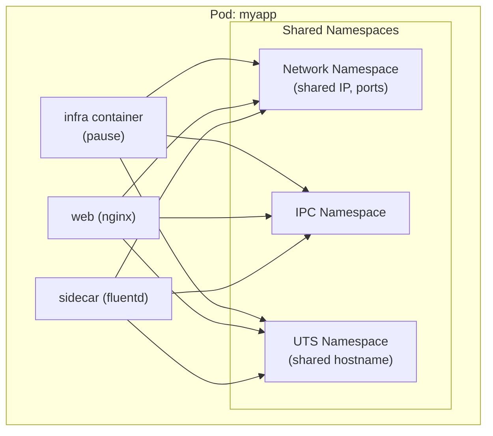

# Podman

Podman (Pod Manager) is a daemonless, rootless container engine for developing, managing,
and running OCI containers. It provides a Docker-compatible CLI while eliminating the
daemon attack surface and enabling unprivileged container execution.

## Introduction

Developed by Red Hat, Podman was created to address fundamental security concerns with
Docker's client-server architecture. Key differentiators:

- **Daemonless** — no background daemon; each `podman` command is standalone
- **Rootless** — containers run as regular users by default
- **Pod-native** — Kubernetes-style pods are a first-class concept
- **Systemd integration** — generate and run containers as systemd services
- **Drop-in replacement** — `alias docker=podman` works for most commands
- **OCI-compliant** — uses the same image format, registries, and runtimes

## Installation

```bash
# Ubuntu 22.04+
sudo apt install podman

# Fedora (installed by default since F31)
sudo dnf install podman

# RHEL/CentOS Stream
sudo dnf install podman

# Debian (backports)
sudo apt -t bookworm-backports install podman

# Arch Linux
sudo pacman -S podman

# Verify
podman --version
podman info
```

## Basic Usage

### Running Containers

```bash
# Run interactively
podman run -it --rm alpine sh

# Run in background
podman run -d --name web -p 8080:80 nginx:latest

# Check running containers
podman ps

# View logs
podman logs web

# Exec into running container
podman exec -it web sh

# Stop and remove
podman stop web
podman rm web

# Remove all stopped containers
podman rm -a
```

### Image Management

```bash
# Pull images
podman pull docker.io/library/alpine:latest

# List images
podman images

# Build from Containerfile/Dockerfile
podman build -t myapp:latest .

# Tag an image
podman tag myapp:latest myregistry.local/myapp:v1.0

# Push to registry
podman push myregistry.local/myapp:v1.0

# Remove images
podman rmi myapp:latest

# Prune unused images
podman image prune -a
```

### Search and Inspect

```bash
# Search registries
podman search httpd

# Inspect image metadata
podman inspect alpine:latest

# Show image history
podman history alpine:latest
```

## Rootless Mode

Podman's rootless mode is its defining feature. It uses user namespaces, slirp4netns,
and fuse-overlayfs to run containers without any root privileges.

```bash
# Rootless is the default — just run as a normal user
podman run -it alpine sh

# Check your user namespace mapping
cat /proc/self/uid_map
#          0       1000          1
#          1     100000      65536

# Verify no root processes
podman top <container> -o pid,user,comm
```

See [Rootless Containers](./rootless.md) for detailed implementation.

## Pods

Podman implements Kubernetes-style pods — groups of containers that share namespaces:

```bash
# Create a pod
podman pod create --name myapp -p 8080:80 -p 8443:443

# Run containers in the pod
podman run -d --pod myapp --name web nginx:latest
podman run -d --pod myapp --name sidecar my-fluentd:latest

# List pods
podman pod ls

# POD ID        NAME    STATUS   CREATED       INFRA ID      # OF CONTAINERS
# abc123        myapp   Running  2 minutes ago def456        3

# Inspect pod (shows shared namespaces)
podman pod inspect myapp

# Stop entire pod
podman pod stop myapp

# Remove pod and all containers
podman pod rm -f myapp
```

### Pod Architecture



### Generate Kubernetes YAML

```bash
# Generate Kubernetes pod spec from running pod
podman generate kube myapp > myapp-pod.yaml

# The generated YAML:
# apiVersion: v1
# kind: Pod
# metadata:
#   name: myapp
# spec:
#   containers:
#   - name: web
#     image: nginx:latest
#     ports:
#     - containerPort: 80
#   - name: sidecar
#     image: my-fluentd:latest

# Play a Kubernetes YAML (create pod from spec)
podman play kube myapp-pod.yaml

# Stop and remove pods from YAML
podman play kube --down myapp-pod.yaml
```

## Quadlet (systemd Integration)

Quadlet is Podman's systemd-native container management system. It lets you define
containers as systemd unit files:

### Container Unit

```ini
# /etc/containers/systemd/web.container
[Unit]
Description=Web Server Container
After=network-online.target

[Container]
Image=docker.io/library/nginx:latest
PublishPort=8080:80
Volume=web-content.volume:/usr/share/nginx/html:ro
Environment=NGINX_HOST=example.com
HealthCmd=/usr/bin/curl -f http://localhost/ || exit 1
HealthInterval=30s
AutoUpdate=registry

[Service]
Restart=always
RestartSec=5

[Install]
WantedBy=multi-user.target
```

```bash
# Reload systemd to pick up Quadlet units
systemctl daemon-reload

# Start the container service
systemctl start web

# Check status
systemctl status web

# View logs
journalctl -u web

# Enable on boot
systemctl enable web
```

### Pod Unit

```ini
# /etc/containers/systemd/mypod.kube
[Unit]
Description=My Application Pod

[Kube]
Yaml=/etc/containers/systemd/mypod.yaml
AutoUpdate=registry

[Install]
WantedBy=multi-user.target
```

### Volume Unit

```ini
# /etc/containers/systemd/web-content.volume
[Unit]
Description=Web Content Volume

[Volume]
VolumeName=web-content
Label=app=web
```

### Network Unit

```ini
# /etc/containers/systemd/app-network.network
[Unit]
Description=Application Network

[Network]
Subnet=10.89.0.0/24
Gateway=10.89.0.1
DNS=10.89.0.1
Label=app=mynetwork
```

### Quadlet Unit Types

| Extension      | Purpose                      |
|----------------|------------------------------|
| `.container`   | Single container             |
| `.kube`        | Kubernetes YAML pod          |
| `.volume`      | Named volume                 |
| `.network`     | Podman network               |
| `.image`       | Pre-pull an image            |
| `.build`       | Build from Containerfile     |

## Containerfile (Dockerfile Equivalent)

Podman uses `Containerfile` by default (also accepts `Dockerfile`):

```dockerfile
# Containerfile
FROM docker.io/library/alpine:3.19

LABEL maintainer="team@example.com"
LABEL org.opencontainers.image.source="https://github.com/example/app"

RUN apk add --no-cache ca-certificates tzdata

COPY --chown=1000:1000 app /usr/local/bin/app
COPY config.yaml /etc/app/config.yaml

USER 1000:1000
WORKDIR /app

EXPOSE 8080

HEALTHCHECK --interval=30s --timeout=3s \
    CMD /usr/local/bin/app --healthcheck || exit 1

ENTRYPOINT ["/usr/local/bin/app"]
CMD ["--config", "/etc/app/config.yaml"]
```

```bash
# Build
podman build -t myapp:latest .

# Build with build args
podman build --build-arg VERSION=1.2.3 -t myapp:1.2.3 .

# Multi-stage build
podman build -f Containerfile.multi -t myapp:slim .
```

## Networking

```bash
# List networks
podman network ls

# Create a network
podman network create --subnet 10.89.1.0/24 mynetwork

# Run container in network
podman run -d --network mynetwork --name app myapp:latest

# Inspect network
podman network inspect mynetwork

# Container DNS resolution (containers can resolve each other by name)
podman run --network mynetwork alpine nslookup app

# Port mapping
podman run -d -p 8080:80 -p 9090:9090 nginx

# Rootless port mapping (requires slirp4netns or pasta)
podman run -d -p 127.0.0.1:8080:80 nginx
```

## Volumes and Storage

```bash
# Create a named volume
podman volume create mydata

# List volumes
podman volume ls

# Use volume
podman run -v mydata:/data alpine sh -c "echo hello > /data/test.txt"

# Bind mount
podman run -v /home/user/html:/usr/share/nginx/html:ro nginx

# Inspect volume
podman volume inspect mydata

# Remove volume
podman volume rm mydata

# Prune unused volumes
podman volume prune
```

## Security Features

```bash
# Run with read-only rootfs
podman run --read-only --tmpfs /tmp alpine sh

# Drop all capabilities, add only what's needed
podman run --cap-drop=ALL --cap-add=NET_BIND_SERVICE myapp

# Use a specific seccomp profile
podman run --security-opt seccomp=custom.json myapp

# Use AppArmor profile
podman run --security-opt apparmor=my-profile myapp

# No new privileges
podman run --security-opt no-new-privileges:true myapp

# User namespace mapping (rootless by default)
podman run --userns=auto myapp

# Run as non-root user inside container
podman run --user 1000:1000 myapp
```

## Podman vs Docker

| Aspect                | Podman                                 | Docker                                  |
|-----------------------|----------------------------------------|-----------------------------------------|
| **Architecture**      | Daemonless (fork/exec)                 | Client-server (dockerd daemon)          |
| **Rootless**          | Default                                | Available since Docker 20.10            |
| **Pods**              | Native                                 | Not supported                           |
| **systemd**           | Quadlet integration                    | systemd unit wrappers                   |
| **Kubernetes**        | `podman generate kube` / `play kube`   | `docker compose` (different model)      |
| **Compose**           | `podman-compose` or `docker-compose`   | `docker compose` built-in               |
| **Build**             | Uses Buildah                           | Built-in                                |
| **Docker socket**     | `podman.socket` (compatible)           | `/var/run/docker.sock`                  |
| **cgroup management** | Per-container (cgroupfs or systemd)    | Daemon-managed                          |
| **OCI compliance**    | Full                                   | Full                                    |
| **Default runtime**   | crun                                   | runc                                    |
| **Package size**      | Smaller (no daemon)                    | Larger                                  |

### Docker Compatibility

```bash
# Enable Podman Docker API socket
systemctl --user enable --now podman.socket

# Point Docker CLI at Podman
export DOCKER_HOST=unix:///run/user/$(id -u)/podman/podman.sock

# Or create the Docker socket path
sudo ln -s /run/podman/podman.sock /var/run/docker.sock

# Most docker-compose files work unchanged
podman-compose up -d
```

## Registries Configuration

```bash
# /etc/containers/registries.conf
[registries.search]
registries = ['docker.io', 'quay.io', 'ghcr.io']

[registries.insecure]
registries = []

[registries.block]
registries = []

# Per-registry mirrors
[[registry]]
location = "docker.io"
mirror = [
  { location = "mirror.gcr.io" },
  { location = "registry.example.com/dockerhub" }
]
```

## Auto-Update

Podman can automatically update container images:

```bash
# Label container for auto-update
podman run -d --label "io.containers.autoupdate=registry" myapp:latest

# Enable the auto-update timer
systemctl enable --now podman-auto-update.timer

# Check for updates manually
podman auto-update --dry-run

# Apply updates
podman auto-update
```

## References

- [Podman Documentation](https://podman.io/docs/) — official docs
- [Podman GitHub](https://github.com/containers/podman) — source code
- [Quadlet Documentation](https://docs.podman.io/en/latest/markdown/podman-systemd.unit.5.html) — systemd integration
- [Podman Rootless](https://github.com/containers/podman/blob/main/docs/tutorials/rootless_tutorial.md) — rootless guide
- [LWN: Podman and daemonless containers](https://lwn.net/Articles/761021/) — design rationale
- [Red Hat: Podman vs Docker](https://www.redhat.com/sysadmin/podman-docker-comparison) — comparison

## Related Topics

- [Rootless Containers](./rootless.md) — the technology behind Podman's rootless mode
- [OCI Standards](./oci.md) — standards Podman implements
- [containerd](./containerd.md) — alternative container runtime
- [Container Security](./security.md) — security best practices
