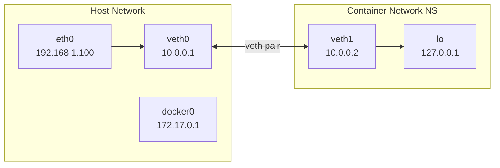
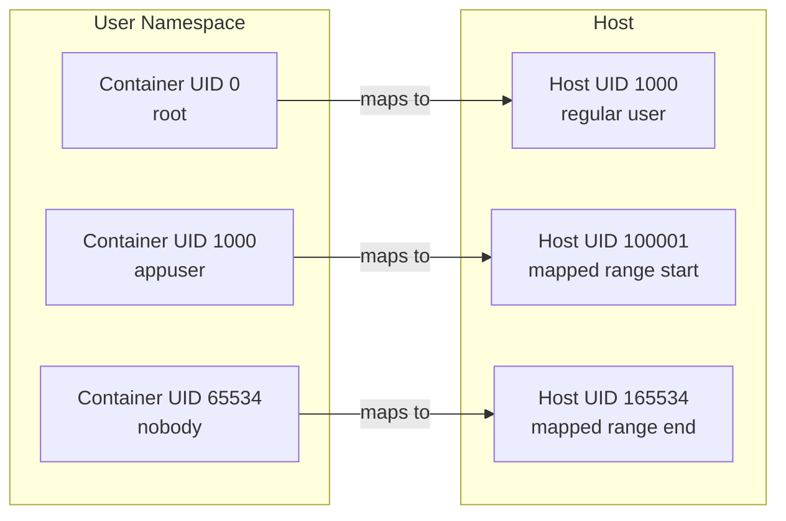

# Container Primitives

## Introduction

Containers are not a single kernel feature — they are a composition of several Linux kernel primitives that, together, provide process isolation, resource control, and filesystem abstraction. Understanding these primitives is essential for anyone working with containers, whether using Docker, Podman, Kubernetes, or building container runtimes from scratch.

This chapter examines each primitive in detail: the system calls, kernel interfaces, and practical usage that form the foundation of container technology.

## Linux Namespaces

Namespaces partition kernel resources such that one set of processes sees one set of resources, while another set of processes sees a different set. There are currently 8 namespace types in Linux.

### Namespace Overview

```mermaid
graph TB
    subgraph Host View
        H_PID[All PIDs visible]
        H_NET[eth0, docker0, br0]
        H_MNT[/ = host rootfs]
        H_UTS[hostname = server1]
        H_IPC[All shared memory, semaphores]
        H_USER[root = UID 0]
        H_CGRP[cgroup root = /]
        H_TIME[system clock]
    end
    subgraph Container View
        C_PID[Only container PIDs<br/>PID 1 = entrypoint]
        C_NET[veth, eth0: 172.17.0.2]
        C_MNT[/ = container rootfs]
        C_UTS[hostname = mycontainer]
        C_IPC[Isolated IPC]
        C_USER[root = UID 100000]
        C_CGRP[cgroup root = /container]
        C_TIME[Same system clock]
    end
```

### PID Namespace

The PID namespace isolates the process ID number space. Processes in different PID namespaces can have the same PID. The first process in a new PID namespace gets PID 1 (init).

```c
/* Create a new PID namespace */
#define _GNU_SOURCE
#include <sched.h>
#include <stdio.h>
#include <unistd.h>
#include <sys/wait.h>

static int child_func(void *arg) {
    printf("Child PID (in new namespace): %d\n", getpid());
    printf("Child PPID: %d\n", getppid());  /* PID 0 in parent NS maps to PPID */
    
    /* This is PID 1 in the new namespace — acts as init */
    /* If PID 1 exits, all other processes in the namespace are killed */
    
    /* Mount /proc for the new namespace */
    mount("proc", "/proc", "proc", 0, NULL);
    
    execlp("ps", "ps", "aux", NULL);
    return 0;
}

int main() {
    const int STACK_SIZE = 1024 * 1024;
    char *stack = malloc(STACK_SIZE);
    
    printf("Parent PID: %d\n", getpid());
    
    /* CLONE_NEWPID creates a new PID namespace */
    pid_t pid = clone(child_func, stack + STACK_SIZE,
                      CLONE_NEWPID | SIGCHLD, NULL);
    
    waitpid(pid, NULL, 0);
    free(stack);
    return 0;
}
```

```bash
# Demonstrate PID namespaces
unshare --fork --pid --mount-proc bash
ps aux
# PID 1 is bash (not the host init)
# Only processes in this namespace are visible

# Check which namespaces a process is in
ls -la /proc/self/ns/
# lrwxrwxrwx 1 root root 0 ... cgroup -> 'cgroup:[4026531835]'
# lrwxrwxrwx 1 root root 0 ... ipc -> 'ipc:[4026531839]'
# lrwxrwxrwx 1 root root 0 ... mnt -> 'mnt:[4026531840]'
# lrwxrwxrwx 1 root root 0 ... net -> 'net:[4026531969]'
# lrwxrwxrwx 1 root root 0 ... pid -> 'pid:[4026531836]'
# lrwxrwxrwx 1 root root 0 ... uts -> 'uts:[4026531838]'
# lrwxrwxrwx 1 root root 0 ... user -> 'user:[4026531837]'
# lrwxrwxrwx 1 root root 0 ... time -> 'time:[4026531834]'

# Enter an existing namespace
nsenter --target <pid> --pid --net --mount bash
```

**PID namespace nesting:**

```bash
# Create nested PID namespaces
unshare --fork --pid --mount-proc bash
# Now in namespace 1
unshare --fork --pid --mount-proc bash
# Now in namespace 2 (child of namespace 1)

# PID mapping:
# Host: PID 1000 = first unshare
# NS1:  PID 1 = first unshare, PID 2 = second unshare
# NS2:  PID 1 = second unshare
```

### Network Namespace

The network namespace provides an isolated network stack with its own interfaces, routing tables, firewall rules, and ports.

```bash
# Create a network namespace
ip netns add myns

# List network namespaces
ip netns list

# The new namespace has only a loopback interface
ip netns exec myns ip link
# 1: lo: <LOOPBACK> mtu 65536 qdisc noop state DOWN

# Bring up loopback
ip netns exec myns ip link set lo up

# Create a veth pair (virtual ethernet)
ip link add veth0 type veth peer name veth1

# Move one end into the namespace
ip link set veth1 netns myns

# Configure addresses
ip addr add 10.0.0.1/24 dev veth0
ip link set veth0 up

ip netns exec myns ip addr add 10.0.0.2/24 dev veth1
ip netns exec myns ip link set veth1 up

# Test connectivity
ip netns exec myns ping 10.0.0.1

# Set up NAT for internet access
ip netns exec myns ip route add default via 10.0.0.1
iptables -t nat -A POSTROUTING -s 10.0.0.0/24 -j MASQUERADE
sysctl -w net.ipv4.ip_forward=1

# Now the namespace has internet access
ip netns exec myns curl -s https://example.com
```



### Mount Namespace

The mount namespace isolates the list of mount points seen by a group of processes.

```bash
# Create a mount namespace
unshare --mount bash

# Mounts in this namespace don't affect the host
mount -t tmpfs tmpfs /mnt
echo "hello" > /mnt/test.txt
ls /mnt
# test.txt

# On host: /mnt is still empty
exit
ls /mnt
# (empty)

# Mount propagation modes:
# private  — mount events don't propagate
# shared  — mount events propagate both ways
# slave   — mount events propagate from parent, not to parent
# unbindable — can't be bind mounted

# Check mount propagation
findmnt -o TARGET,PROPAGATION /
# TARGET  PROPAGATION
# /       shared
```

**Container mount namespace setup:**

```bash
# Typical container setup:
# 1. Create new mount namespace
# 2. Pivot root to container filesystem
# 3. Mount /proc, /sys, /dev (minimal)
# 4. Set mount propagation to private

unshare --mount bash
mount --make-rprivate /
mount -t overlay overlay \
  -o lowerdir=/var/lib/container/layers/base,upperdir=/var/lib/container/upper,workdir=/var/lib/container/work \
  /var/lib/container/merged
pivot_root /var/lib/container/merged /var/lib/container/merged/.pivot_root
umount /.pivot_root
mount -t proc proc /proc
mount -t sysfs sys /sys -o ro,nosuid,nodev,noexec
mount -t tmpfs tmpfs /dev -o mode=755
```

### UTS Namespace

The UTS (UNIX Time-Sharing) namespace isolates the hostname and NIS domain name.

```bash
# Create UTS namespace
unshare --uts bash

# Change hostname (only affects this namespace)
hostname my-container
hostname
# my-container

# Host still has original hostname
exit
hostname
# server1
```

### IPC Namespace

The IPC namespace isolates System V IPC objects and POSIX message queues.

```bash
# Create IPC namespace
unshare --ipc bash

# Create shared memory segment
ipcmk -M 1024
# Shared memory id: 0

ipcs -m
# Shows only IPC objects in this namespace

# Host doesn't see this segment
exit
ipcs -m
# Original host IPC objects only
```

### User Namespace

The user namespace isolates user and group ID mappings. This is crucial for rootless containers — running containers without root privileges.

```bash
# Create user namespace (unprivileged)
unshare --user --map-root-user bash

# Inside: appears as root (UID 0)
id
# uid=0(root) gid=0(root) groups=0(root)

# But on host, this is an unprivileged user
# Host UID mapping:
cat /proc/self/uid_map
#          0       1000          1

# Map container UID 0 to host UID 1000
# Map container UID 1-65535 to host UID 100001-165534
echo "0 1000 1" > /proc/self/uid_map
echo "0 1000 1" > /proc/self/gid_map
```



```bash
# Rootless containers use user namespaces
# Docker rootless mode:
dockerd-rootless-setuptool.sh install
docker context use rootless

# Podman rootless (default):
podman run --rm alpine id
# uid=0(root) gid=0(root) — but actually unprivileged on host
```

### Cgroup Namespace

The cgroup namespace virtualizes the cgroup hierarchy, making a container think its cgroup root is at `/`.

```bash
# Without cgroup namespace:
cat /proc/self/cgroup
# 0::/system.slice/docker-abc123.service

# With cgroup namespace (CLONE_NEWCGROUP):
cat /proc/self/cgroup
# 0::/  (appears as root)
```

### Time Namespace

The time namespace (Linux 5.6+) allows different processes to see different system clock values. Useful for adjusting monotonic clocks in containers after restore/migration.

```bash
# Create time namespace
unshare --time bash

# Set offset for CLOCK_MONOTONIC and CLOCK_BOOTTIME
# (configured via /proc/self/timens_offsets)
echo "monotonic 1000000000" > /proc/self/timens_offsets
# This adds 1000 seconds to CLOCK_MONOTONIC for processes in this NS
```

## System Calls for Namespaces

| System Call | Purpose |
|-------------|---------|
| `clone()` | Create new process in new namespace(s) |
| `unshare()` | Move current process to new namespace |
| `setns()` | Join an existing namespace |
| `pivot_root()` | Change root filesystem |
| `mount()` | Mount filesystems (within mount NS) |

```c
/* clone() with multiple namespaces */
pid_t pid = clone(child_func, stack + STACK_SIZE,
    CLONE_NEWPID | CLONE_NEWNET | CLONE_NEWNS | CLONE_NEWUTS | SIGCHLD,
    NULL);

/* unshare() — move current process to new namespaces */
unshare(CLONE_NEWNET | CLONE_NEWNS);

/* setns() — join existing namespace */
int fd = open("/proc/12345/ns/net", O_RDONLY);
setns(fd, CLONE_NEWNET);
```

## Linux Capabilities

Capabilities split the all-powerful root privilege into fine-grained units:

```bash
# List all capabilities
capsh --print
# Current: =ep
# Bounding set = cap_chown,cap_dac_override,cap_fowner,...

# Drop capabilities in a container
# Docker:
docker run --cap-drop=ALL --cap-add=NET_BIND_SERVICE nginx

# Common capabilities:
# CAP_NET_BIND_SERVICE — bind to ports < 1024
# CAP_NET_RAW — use raw sockets (ping)
# CAP_SYS_ADMIN — mount, namespace operations, etc.
# CAP_SYS_PTRACE — trace processes
# CAP_DAC_OVERRIDE — bypass file permission checks
# CAP_CHOWN — change file ownership
# CAP_SETUID/CAP_SETGID — change UID/GID

# Check capabilities of a running process
getpcaps $(pidof nginx)
# = cap_net_bind_service+ep
```

## Seccomp (Secure Computing Mode)

Seccomp filters system calls that a process can make:

```json
// Seccomp BPF filter example (Docker default profile)
{
    "defaultAction": "SCMP_ACT_ERRNO",
    "defaultErrnoRet": 1,
    "architectures": ["SCMP_ARCH_X86_64"],
    "syscalls": [
        {
            "names": ["accept", "bind", "listen", "socket"],
            "action": "SCMP_ACT_ALLOW"
        },
        {
            "names": ["read", "write", "open", "close", "stat"],
            "action": "SCMP_ACT_ALLOW"
        },
        {
            "names": ["mount", "umount2", "pivot_root"],
            "action": "SCMP_ACT_ERRNO",
            "errnoRet": 1
        }
    ]
}
```

```bash
# Run container with custom seccomp profile
docker run --security-opt seccomp=profile.json nginx

# Run with no seccomp (dangerous!)
docker run --security-opt seccomp=unconfined nginx

# Inspect default Docker seccomp profile
docker info --format '{{.SecurityOptions}}'
# [name=seccomp,profile=default]

# Check seccomp status of a process
grep Seccomp /proc/self/status
# Seccomp:    2  (SECCOMP_MODE_FILTER)
# Seccomp_filters:    1
```

### Seccomp Notify

```c
/* seccomp notification forwarding (Linux 5.0+) */
/* Allows a supervisor process to handle syscalls on behalf of container */
struct seccomp_notif {
    __u64 id;
    __u32 pid;
    __u32 flags;
    struct seccomp_data data;
};

/* Flow:
 * 1. Container makes a syscall
 * 2. seccomp filter returns SECCOMP_RET_USER_NOTIF
 * 3. Supervisor receives notification via /proc/pid/seccomp_notify
 * 4. Supervisor inspects, potentially performs the syscall
 * 5. Supervisor returns result to container
 */
```

## AppArmor and SELinux

### AppArmor

```bash
# AppArmor profile for a container profile my-container {
    #include <abstractions/base>
    
    # Allow reading most of the filesystem
    / r,
    /** r,
    
    # Allow writing to specific directories
    /app/data/** rw,
    
    # Deny access to sensitive files
    deny /etc/shadow rw,
    deny /proc/kcore r,
    
    # Network access
    network inet stream,
    network inet dgram,
    
    # Deny raw sockets
    deny network raw,
    
    # Deny mount
    deny mount,
    
    # Deny ptrace
    deny ptrace,
}

# Load the profile
apparmor_parser -r /etc/apparmor.d/my-container

# Run container with AppArmor
docker run --security-opt apparmor=my-container nginx
```

### SELinux

```bash
# SELinux container labels
# Docker uses :container_t for container processes
# :svirt_sandbox_file_t for container files

# Run with specific SELinux label
docker run --security-opt label=type:my_container_t nginx

# Run with SELinux disabled for container
docker run --security-opt label=disable nginx

# Check SELinux context
docker exec nginx cat /proc/self/attr/current
# system_u:system_r:container_t:s0:c123,c456
```

## Combining Primitives: Manual Container Creation

```bash
#!/bin/bash
# Create a minimal container using Linux primitives

set -e

ROOTFS="/tmp/container-rootfs"
mkdir -p "$ROOTFS"

# 1. Prepare rootfs (from Alpine)
curl -o /tmp/alpine.tar.gz https://dl-cdn.alpinelinux.org/alpine/v3.19/releases/x86_64/alpine-minirootfs-3.19.0-x86_64.tar.gz
tar -xzf /tmp/alpine.tar.gz -C "$ROOTFS"

# 2. Create container with namespaces
unshare --pid --net --mount --uts --ipc --fork bash -c "
    # 3. Mount proc
    mount -t proc proc $ROOTFS/proc
    
    # 4. Set hostname
    hostname my-container
    
    # 5. Set up loopback
    ip link set lo up
    
    # 6. Pivot root
    cd $ROOTFS
    mkdir -p .old_root
    pivot_root $ROOTFS $ROOTFS/.old_root
    
    # 7. Unmount old root
    umount -l /.old_root
    rmdir /.old_root
    
    # 8. Set resource limits via cgroup
    # (done from parent process before unshare)
    
    # 9. Drop capabilities
    # (using capsh or prctl)
    
    # 10. Execute init
    exec /bin/sh
"
```

```bash
# From another terminal, set up cgroup limits
mkdir -p /sys/fs/cgroup/my-container
echo "52428800" > /sys/fs/cgroup/my-container/memory.max    # 50MB
echo "50000 100000" > /sys/fs/cgroup/my-container/cpu.max   # 50% CPU
echo $(pidof sh) > /sys/fs/cgroup/my-container/cgroup.procs
```

## Comparison with Other OSes

| Feature | Linux | FreeBSD | Windows |
|---------|-------|---------|---------|
| Namespaces | ✅ (8 types) | Jails | ✅ (limited) |
| cgroups | ✅ | RCTL | Job Objects |
| Union FS | overlay, aufs | ZFS | WCIFS |
| Rootless | ✅ | ✅ | Limited |
| OCI compatible | ✅ | ✅ | ✅ (LCOW) |

## References

1. `namespaces(7)` — Linux man page. [https://man7.org/linux/man-pages/man7/namespaces.7.html](https://man7.org/linux/man-pages/man7/namespaces.7.html)
2. `cgroups(7)` — Linux man page. [https://man7.org/linux/man-pages/man7/cgroups.7.html](https://man7.org/linux/man-pages/man7/cgroups.7.html)
3. `seccomp(2)` — Linux man page. [https://man7.org/linux/man-pages/man2/seccomp.2.html](https://man7.org/linux/man-pages/man2/seccomp.2.html)
4. Kerrisk, M. "Namespaces in Operation." LWN.net. [https://lwn.net/Articles/531114/](https://lwn.net/Articles/531114/)

## Further Reading

- [The Linux Kernel Documentation](https://docs.kernel.org/)
- [GNU Project Documentation](https://www.gnu.org/doc/doc.html)
- [GNU Manuals](https://www.gnu.org/manual/manual.html)
- [Free Software Directory](https://directory.fsf.org/wiki/Main_Page)
- [Planet GNU](https://planet.gnu.org/)
- [Free Software Books](https://www.gnu.org/doc/other-free-books.html)

- [Linux Namespaces man page](https://man7.org/linux/man-pages/man7/namespaces.7.html)
- [cgroups v2 Documentation](https://www.kernel.org/doc/html/latest/admin-guide/cgroup-v2.html)
- [seccomp BPF Documentation](https://www.kernel.org/doc/html/latest/userspace-api/seccomp_filter.html)
- [Capabilities man page](https://man7.org/linux/man-pages/man7/capabilities.7.html)
- [Rootless Containers](https://rootlesscontaine.rs/)

## Related Topics

- [Container Overview](./overview.md) — container concepts and ecosystem
- [Docker Internals](./docker-internals.md) — how Docker uses these primitives
- [cgroups v2](./cgroups-v2.md) — detailed cgroup resource management
- [Kubernetes and Linux](./kubernetes.md) — how Kubernetes uses these primitives
- [Virtualization Overview](../virtualization/overview.md) — comparison with VMs
