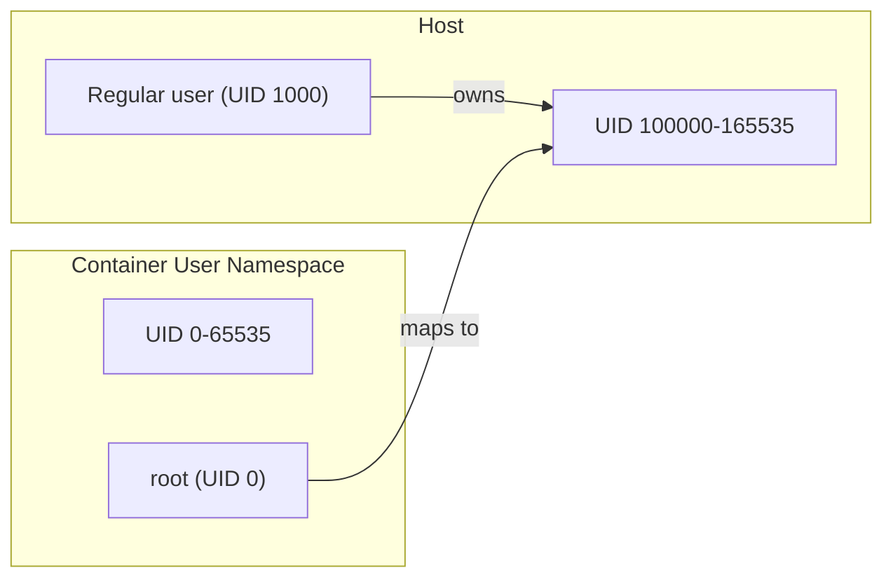
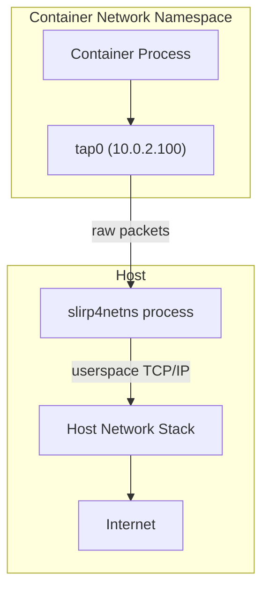
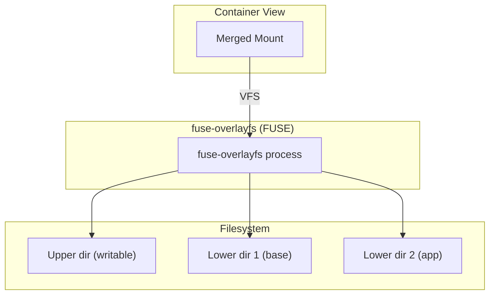
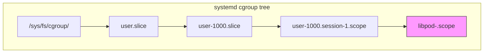
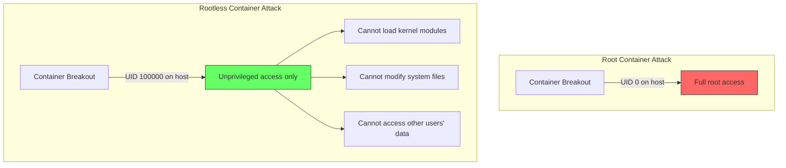

# Rootless Containers

Rootless containers run entirely in user space without requiring root privileges. They leverage
Linux user namespaces, unprivileged networking, and FUSE-based filesystem overlays to provide
container isolation that is secure by default and usable by any regular user.

## Introduction

Traditional container runtimes (Docker, early containerd) require a root-privileged daemon.
If the daemon is compromised, the attacker gains root on the host. Rootless containers eliminate
this attack surface:

- **No root daemon** — the container runtime runs as the invoking user
- **User namespace isolation** — container root (UID 0) maps to an unprivileged host UID
- **Reduced attack surface** — kernel vulnerabilities in the container path don't grant host root
- **Multi-tenant safety** — multiple users can run containers without coordination
- **Compliance** — meets security requirements for running containers without root

## User Namespaces

User namespaces are the foundation of rootless containers. They allow a process to have
UID 0 inside the namespace while mapped to an unprivileged UID outside.

### How UID Mapping Works



### Configuration

```bash
# Check if user namespaces are enabled
cat /proc/sys/user/max_user_namespaces
# 28672 (enabled if > 0)

# Enable if needed
sudo sysctl -w user.max_user_namespaces=28672

# /etc/subuid — subordinate UID ranges for user namespace mapping
# Format: username:start_uid:count
cat /etc/subuid
# jdoe:100000:65536

# /etc/subgid — subordinate GID ranges
cat /etc/subgid
# jdoe:100000:65536
```

### Manual User Namespace Example

```bash
# Create a user namespace with UID mapping
unshare --user --map-auto --uid-map 0:100000:65536 --gid-map 0:100000:65536 bash

# Inside the namespace
id
# uid=0(root) gid=0(root) groups=0(root)

# On the host, this process appears as UID 100000
ps -o pid,user,comm -p $$
#   PID USER     COMMAND
# 12345 100000   bash
```

### `/etc/subuid` and `/etc/subgid`

These files define the subordinate UID/GID ranges allocated to each user:

```bash
# Add subordinate ranges for a user
sudo usermod --add-subuids 100000-165535 --add-subgids 100000-165535 jdoe

# Or edit directly
echo "jdoe:100000:65536" | sudo tee -a /etc/subuid
echo "jdoe:100000:65536" | sudo tee -a /etc/subgid

# Verify
grep jdoe /etc/subuid /etc/subgid
# /etc/subuid:jdoe:100000:65536
# /etc/subgid:jdoe:100000:65536
```

## slirp4netns

slirp4netns provides unprivileged networking for rootless containers. It creates a TAP
device in the user namespace and translates network traffic using a user-mode TCP/IP stack
(libslirp, derived from QEMU's network code).

### How It Works



### Usage

```bash
# Create network namespace
ip netns add rootless

# Launch slirp4netns
slirp4netns --configure --mtu=65520 --disable-host-loopback \
    $(cat /proc/self/ns/net | cut -d: -f3 | tr -d '[]') tap0 &

# Verify connectivity
nsenter --net=/var/run/netns/rootless ping -c1 10.0.2.2
```

### slirp4netns vs pasta

pasta (Pack A Subtle Tap Abstraction) is a newer, faster alternative:

| Aspect          | slirp4netns                          | pasta                                |
|-----------------|--------------------------------------|--------------------------------------|
| **Performance** | Moderate (userspace TCP/IP)          | Fast (pass-through, no translation)  |
| **Latency**     | Higher                               | Lower                                |
| **Port forward**| Via command-line flags               | Automatic for bound ports            |
| **Default in**  | Podman < 4.3                         | Podman >= 4.3 (Fedora 39+)          |
| **Library**     | libslirp                             | passt                                |

```bash
# Using pasta (default in modern Podman)
podman run --network pasta alpine ping -c1 8.8.8.8

# Using slirp4netns explicitly
podman run --network slirp4netns alpine ping -c1 8.8.8.8
```

## fuse-overlayfs

In rootless mode, the kernel's overlayfs requires root privileges (or kernel 5.11+ with
user namespace overlay mounts). fuse-overlayfs provides a FUSE-based implementation that
works without root on any kernel version.

### How It Works



### Installation and Usage

```bash
# Install
sudo apt install fuse-overlayfs   # Debian/Ubuntu
sudo dnf install fuse-overlayfs   # Fedora

# Verify
fuse-overlayfs --version

# Podman uses it automatically in rootless mode
podman info | grep -A5 graphDriver
# graphDriverName: overlay
# graphOptions:
#   overlay.mount_program:
#     /usr/bin/fuse-overlayfs

# Manual usage
mkdir lower upper work merged
fuse-overlayfs -o lowerdir=lower,upperdir=upper,workdir=work merged
```

### Kernel 5.11+ Native Overlay

Linux 5.11 added support for overlayfs in user namespaces without FUSE:

```bash
# Check kernel version
uname -r
# 6.1.0

# Podman automatically uses native overlay on 5.11+
podman info | grep graphDriverName
# graphDriverName: overlay
# (no mount_program = using native overlayfs)
```

## cgroup Delegation

For rootless containers to manage their own resources, cgroups must be delegated to the
unprivileged user.

### cgroup v2

```bash
# Check cgroup version
stat -fc %T /sys/fs/cgroup
# cgroup2fs (v2)

# Enable cgroup delegation via systemd
sudo mkdir -p /etc/systemd/system/user@.service.d
cat <<EOF | sudo tee /etc/systemd/system/user@.service.d/delegate.conf
[Service]
Delegate=cpu cpuset io memory pids
EOF

sudo systemctl daemon-reload

# Or per-user (via systemd-run)
systemd-run --user --scope \
    -p "Delegate=yes" \
    podman run -it alpine sh

# Verify cgroup delegation
cat /sys/fs/cgroup/user.slice/user-$(id -u).slice/cgroup.controllers
# cpu cpuset io memory pids
```

### cgroup v1

```bash
# cgroup v1 is more limited for rootless
# Memory and CPU delegation requires manual setup

# /etc/cgconfig.conf
# jdoe {
#   memory {
#     jdoe {
#       memory.limit_in_bytes = 2G;
#     }
#   }
#   cpu {
#     jdoe {
#       cpu.shares = 1024;
#     }
#   }
# }
```

### cgroup Delegation Architecture



## Putting It All Together

### Podman Rootless Workflow

```bash
# 1. Verify setup
podman info --format '{{.Host.Security.Rootless}}'
# true

# 2. Run a container (rootless by default)
podman run -d --name web -p 8080:80 nginx

# 3. Check the user namespace mapping
podman top web -o pid,user,huser
#   PID USER   HUSER
#     1 root   100000
#    23 nginx  100001

# 4. Networking works via slirp4netns or pasta
curl http://localhost:8080
# Welcome to nginx!

# 5. Filesystem uses fuse-overlayfs or native overlay
podman exec web touch /tmp/test
podman diff web
# C /tmp
# A /tmp/test
```

### Buildah Rootless

```bash
# Build images without root
buildah from alpine
buildah run alpine-working-container apk add --no-cache curl
buildah commit alpine-working-container myimage:latest
```

### containerd Rootless

```bash
# Install rootless containerd
containerd-rootless-setuptool.sh install

# Verify
containerd-rootless.sh --version

# Use with nerdctl
nerdctl run -d --name web -p 8080:80 nginx
```

## Limitations

### Known Limitations

| Limitation                          | Status                                   |
|-------------------------------------|------------------------------------------|
| AppArmor not supported              | Use SELinux or seccomp instead           |
| ping (ICMP)                         | Requires `ping_group_range` sysctl       |
| Privileged ports (< 1024)           | Requires `net.ipv4.ip_unprivileged_port_start=0` |
| cgroup v1 delegation                | Limited; cgroup v2 strongly recommended  |
| Cross-namespace mounts              | Kernel 5.11+ needed for overlay          |
| `/dev/fuse` access                  | Required for fuse-overlayfs              |
| Checkpoint/restore (CRIU)           | Limited in rootless mode                 |

### Workarounds

```bash
# Allow unprivileged ping
echo "net.ipv4.ping_group_range = 0 200000" | sudo tee -a /etc/sysctl.d/99-rootless.conf
sudo sysctl -p /etc/sysctl.d/99-rootless.conf

# Allow privileged ports
echo "net.ipv4.ip_unprivileged_port_start = 0" | sudo tee -a /etc/sysctl.d/99-rootless.conf
sudo sysctl -p /etc/sysctl.d/99-rootless.conf

# Enable /dev/fuse
sudo chmod 666 /dev/fuse
# Or add user to the fuse group
sudo usermod -aG fuse $USER
```

## Security Implications

Rootless containers provide defense-in-depth:



Even if an attacker escapes a rootless container, they are still an unprivileged user on
the host with no ability to:

- Load kernel modules
- Modify `/etc`, `/boot`, or other system directories
- Access other users' files or containers
- Mount filesystems
- Change network configuration

## References

- [Podman Rootless Tutorial](https://github.com/containers/podman/blob/main/docs/tutorials/rootless_tutorial.md)
- [User Namespaces man page](https://man7.org/linux/man-pages/man7/user_namespaces.7.html)
- [slirp4netns](https://github.com/rootless-containers/slirp4netns) — rootless networking
- [pasta](https://passt.top/passt/) — fast rootless networking
- [fuse-overlayfs](https://github.com/containers/fuse-overlayfs) — FUSE overlay
- [LWN: Rootless containers](https://lwn.net/Articles/761021/) — design overview
- [Rootless Containers](https://rootlesscontaine.rs/) — comprehensive resource

## Related Topics

- [Podman](./podman.md) — rootless-first container engine
- [Container Security](./security.md) — security features and best practices
- [OCI Standards](./oci.md) — container standards
- [cgroups](../resource-management/cgroups.md) — resource management
