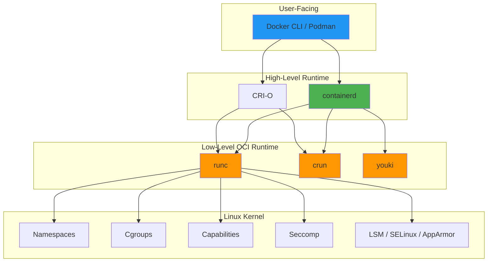
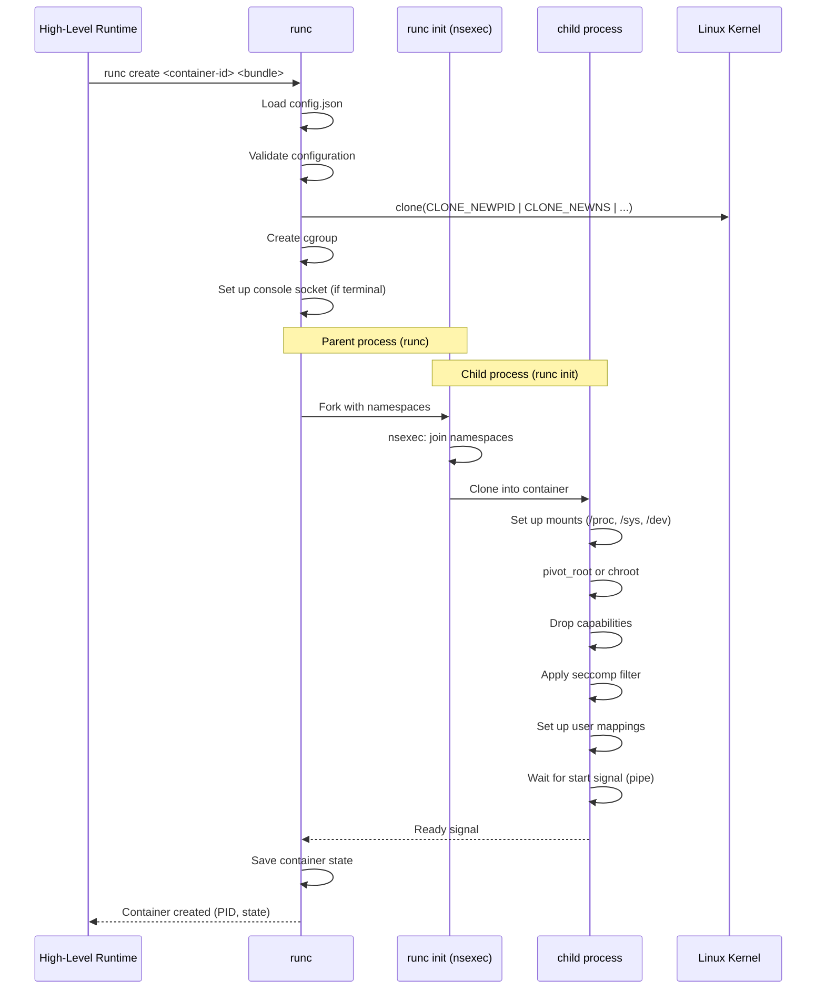
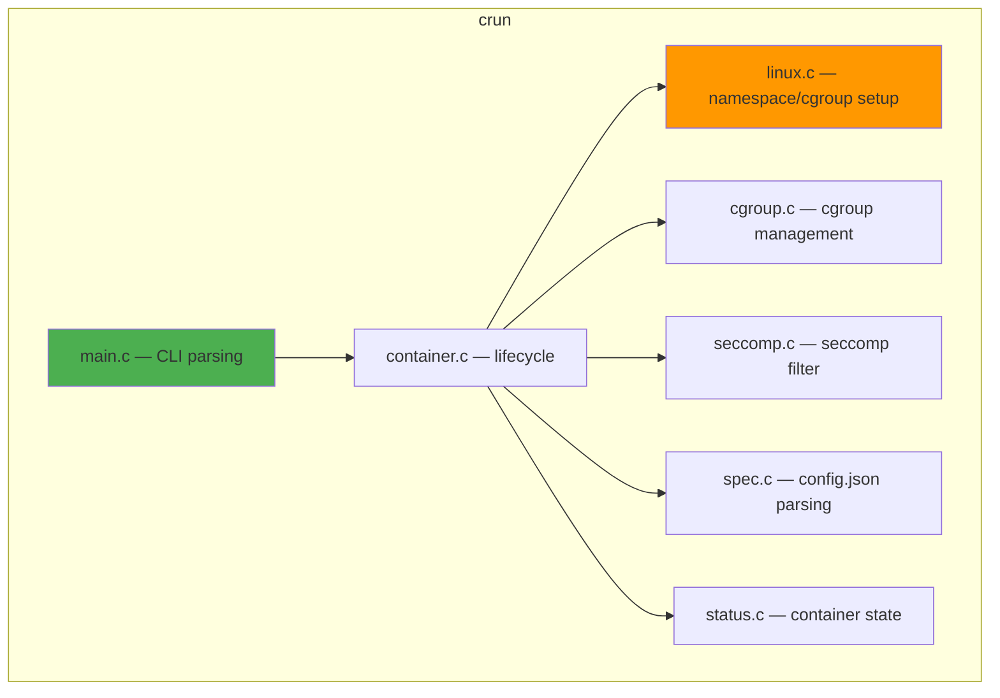
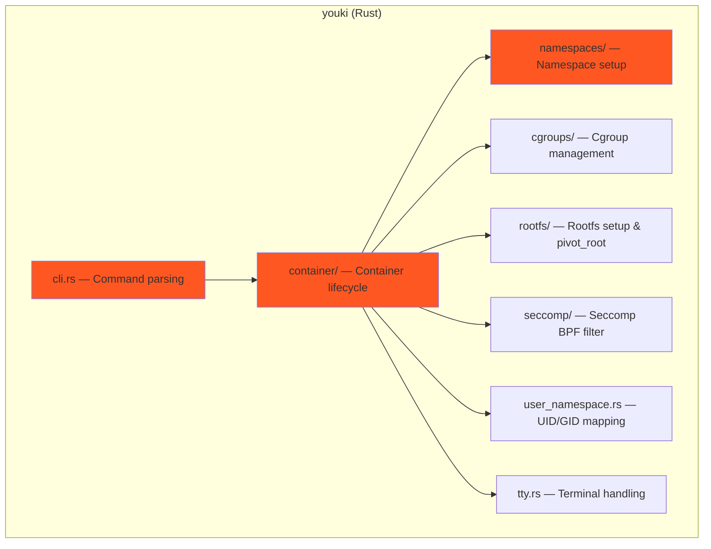
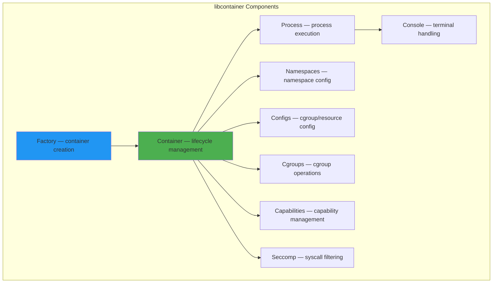
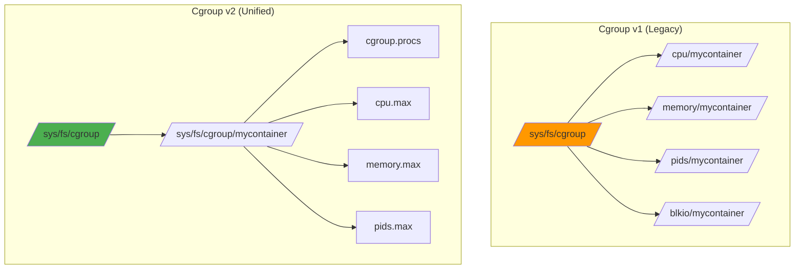
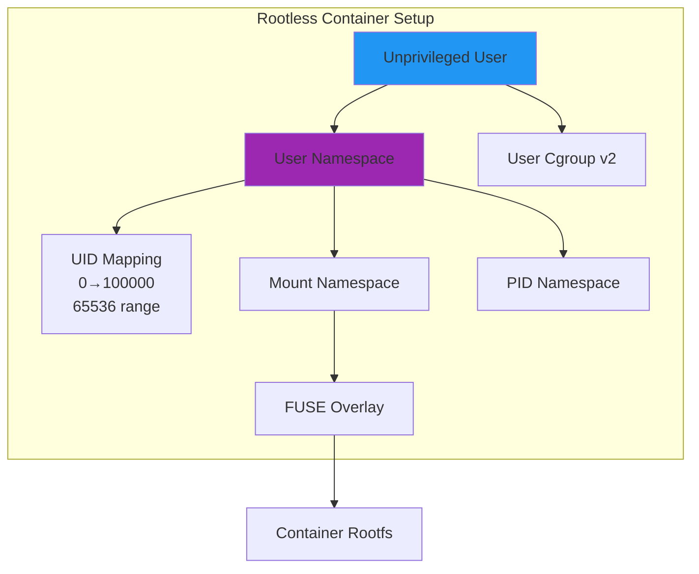

# Container Runtime Internals

## Introduction

A container runtime is the software responsible for creating, running, and managing containers. While users interact with high-level tools like Docker and Podman, the actual container lifecycle is handled by a **low-level OCI runtime** that configures namespaces, cgroups, seccomp filters, and executes the container process. Understanding runtime internals is essential for debugging container failures, optimizing performance, and building secure container platforms.

The container ecosystem is layered: high-level runtimes (containerd, CRI-O) manage images, networking, and storage, while low-level runtimes (runc, crun, youki) handle the actual kernel-level container creation.

## Container Runtime Architecture

### The Full Stack



### OCI Runtime Specification

The [Open Container Initiative (OCI)](./oci.md) defines two specifications:

1. **Runtime Specification** — How to run a container
2. **Image Specification** — How to package container images

The runtime spec defines the contract between high-level and low-level runtimes:

```mermaid
flowchart LR
    subgraph "OCI Runtime Spec"
        BUNDLE[Container Bundle<br>(config.json + rootfs)]
        CREATE[create]
        START[start]
        KILL[kill]
        DELETE[delete]
        STATE[state]
    end

    BUNDLE --> CREATE
    CREATE --> START
    START --> KILL
    KILL --> DELETE
    CREATE --> STATE
    START --> STATE

    style BUNDLE fill:#9C27B0
```

## The OCI Runtime Interface

### Container Lifecycle

```
                    ┌──────────┐
                    │  bundle  │
                    │ (config  │
                    │  .json + │
                    │ rootfs)  │
                    └────┬─────┘
                         │
                    ┌────▼─────┐
                    │  create  │ ── Sets up namespaces, cgroups,
                    └────┬─────┘    mounts, but doesn't start process
                         │         (container in "created" state)
                    ┌────▼─────┐
                    │  start   │ ── Executes the user process
                    └────┬─────┘    (container in "running" state)
                         │
                    ┌────▼─────┐
                    │ running  │ ── Container is executing
                    └────┬─────┘
                         │
              ┌──────────┼──────────┐
              │          │          │
         ┌────▼────┐ ┌──▼───┐ ┌───▼────┐
         │  kill   │ │exec  │ │ pause  │
         └────┬────┘ └──┬───┘ └───┬────┘
              │          │         │
              │          │    ┌────▼─────┐
              │          │    │ paused   │
              │          │    └──────────┘
         ┌────▼────┐
         │ exited  │
         └────┬────┘
              │
         ┌────▼─────┐
         │  delete  │ ── Cleanup: remove cgroups, etc.
         └──────────┘
```

### config.json Structure

The `config.json` is the heart of an OCI container bundle:

```json
{
    "ociVersion": "1.0.2",
    "process": {
        "terminal": true,
        "user": {
            "uid": 1000,
            "gid": 1000
        },
        "args": ["/bin/bash"],
        "env": [
            "PATH=/usr/local/sbin:/usr/local/bin:/usr/sbin:/usr/bin:/sbin:/bin",
            "HOME=/home/appuser"
        ],
        "cwd": "/home/appuser",
        "capabilities": {
            "bounding": ["CAP_NET_BIND_SERVICE"],
            "effective": ["CAP_NET_BIND_SERVICE"],
            "inheritable": ["CAP_NET_BIND_SERVICE"],
            "permitted": ["CAP_NET_BIND_SERVICE"],
            "ambient": ["CAP_NET_BIND_SERVICE"]
        },
        "rlimits": [
            { "type": "RLIMIT_NOFILE", "hard": 65536, "soft": 65536 }
        ],
        "noNewPrivileges": true,
        "seccomp": {
            "defaultAction": "SCMP_ACT_ERRNO",
            "architectures": ["SCMP_ARCH_X86_64"],
            "syscalls": [
                {
                    "names": ["read", "write", "open", "close", "stat"],
                    "action": "SCMP_ACT_ALLOW"
                }
            ]
        }
    },
    "root": {
        "path": "rootfs",
        "readonly": true
    },
    "hostname": "mycontainer",
    "mounts": [
        {
            "destination": "/proc",
            "type": "proc",
            "source": "proc"
        },
        {
            "destination": "/dev",
            "type": "tmpfs",
            "source": "tmpfs",
            "options": ["nosuid", "strictatime", "mode=755", "size=65536k"]
        },
        {
            "destination": "/sys",
            "type": "sysfs",
            "source": "sysfs",
            "options": ["nosuid", "noexec", "nodev", "ro"]
        }
    ],
    "linux": {
        "namespaces": [
            { "type": "pid" },
            { "type": "network" },
            { "type": "ipc" },
            { "type": "uts" },
            { "type": "mount" },
            { "type": "cgroup" },
            { "type": "user" }
        ],
        "uidMappings": [
            { "hostID": 100000, "containerID": 0, "size": 65536 }
        ],
        "gidMappings": [
            { "hostID": 100000, "containerID": 0, "size": 65536 }
        ],
        "resources": {
            "memory": { "limit": 536870912 },
            "cpu": { "shares": 1024, "quota": 200000, "period": 100000 },
            "pids": { "limit": 100 }
        },
        "cgroupsPath": "/mycontainer",
        "maskedPaths": [
            "/proc/kcore",
            "/proc/sysrq-trigger",
            "/proc/latency_stats"
        ],
        "readonlyPaths": [
            "/proc/asound",
            "/proc/bus",
            "/proc/fs",
            "/proc/irq",
            "/proc/sys",
            "/proc/timer_list"
        ]
    }
}
```

## runc: The Reference Implementation

runc is the reference OCI runtime, written in Go. It was extracted from Docker's `libcontainer` and is the most widely used low-level runtime.

### runc Internals: create Flow



### runc's libcontainer

The core of runc is `libcontainer`, which handles all kernel interactions:

```go
// Simplified libcontainer container creation (from runc/libcontainer)
// File: libcontainer/container_linux.go

func (c *linuxContainer) start(process *Process) error {
    // 1. Create parent pipes for communication
    parentPipe, childPipe, err := newPipe()

    // 2. Build the init process configuration
    initCfg := c.newInitConfig(process)

    // 3. Fork the init process with namespace flags
    cmd := c.commandTemplate(initCfg, childPipe)
    cmd.SysProcAttr = &syscall.SysProcAttr{
        Cloneflags: uintptr(c.config.Namespaces.CloneFlags()),
        UidMappings: c.config.UidMappings,
        GidMappings: c.config.GidMappings,
    }

    // 4. Start the init process
    err = cmd.Start()

    // 5. Apply cgroup configuration
    err = c.cgroupManager.Apply(cmd.Process.Pid)

    // 6. Set up network (if configured)
    // 7. Send config to init process via pipe
    err = c.initProcess.sendConfig(initCfg)

    // 8. Wait for init to signal readiness
    err = c.waitForStart()

    return err
}
```

### runc's Namespace Setup

```go
// Simplified namespace creation (from runc/libcontainer/nsenter/nsexec.c)
/*
 * The nsexec C code runs before Go's runtime starts.
 * It handles the namespace dance:
 *
 * 1. Parent (runc) clones child with initial namespaces
 * 2. Child joins existing namespaces if specified
 * 3. Child sets up UID/GID mappings via /proc/pid/uid_map
 * 4. Child signals readiness via pipe
 * 5. Parent sends config, child continues initialization
 */

// From nsexec.c (simplified):
static void nsexec(void)
{
    // Read clone flags from parent
    // clone() with namespace flags
    // In child:
    //   - Join additional namespaces from config
    //   - Write uid_map/gid_map
    //   - Signal parent
    //   - Wait for parent config
    //   - exec() the container process
}
```

## crun: The C Implementation

crun is an OCI runtime written in C, focused on performance and low memory usage. It's the default runtime for Podman on many distributions.

### crun Architecture



### crun vs runc Performance

| Aspect | runc (Go) | crun (C) |
|--------|-----------|----------|
| **Binary size** | ~30 MB | ~1 MB |
| **Memory usage** | ~15-20 MB | ~1-2 MB |
| **Startup time** | ~100ms | ~10-30ms |
| **Dependencies** | Go runtime | libc (or musl) |
| **Default distro** | Docker default | Podman/Fedora default |

### crun's Cgroup v2 Setup

```c
// Simplified from crun/src/libcrun/cgroup.c
static int
libcrun_cgroup_enter (struct libcrun_cgroup_args *args, libcrun_error_t *err)
{
    // 1. Create cgroup directory
    ret = mkdir (cgroup_path, 0755);

    // 2. Write PID to cgroup.procs
    //    echo <pid> > /sys/fs/cgroup/<path>/cgroup.procs
    ret = write_file (cgroup_procs_path, pid_str, strlen (pid_str), err);

    // 3. Set memory limit
    if (resources->memory && resources->memory->limit) {
        // echo 536870912 > /sys/fs/cgroup/<path>/memory.max
        ret = write_file (memory_max_path, limit_str, strlen (limit_str), err);
    }

    // 4. Set CPU limits
    if (resources->cpu) {
        // echo "200000 100000" > /sys/fs/cgroup/<path>/cpu.max
        ret = write_file (cpu_max_path, cpu_str, strlen (cpu_str), err);
    }

    // 5. Set pids limit
    if (resources->pids && resources->pids->limit) {
        ret = write_file (pids_max_path, pids_str, strlen (pids_str), err);
    }

    return 0;
}
```

## youki: The Rust Implementation

youki is an OCI runtime written in Rust, offering memory safety guarantees alongside C-level performance.

### youki Architecture



### youki's Create Flow

```rust
// Simplified from youki/src/libcontainer/container/
pub fn create_container(id: &str, bundle: &str) -> Result<Container> {
    // 1. Parse OCI config.json
    let spec = Spec::load(bundle)?;

    // 2. Validate spec
    spec.validate()?;

    // 3. Create container state
    let container = Container::new(id, ContainerStatus::Creating);

    // 4. Set up cgroups
    let cmanager = CgroupManager::new(&spec.linux.cgroups_path)?;
    cmanager.apply(&spec.linux.resources)?;

    // 5. Fork init process
    //    Uses clone3() syscall for clean namespace setup
    let init_pid = fork_init_process(&spec)?;

    // 6. Apply cgroup to init process
    cmanager.add_task(init_pid)?;

    // 7. Save container state
    container.set_pid(init_pid);
    container.set_status(ContainerStatus::Created);
    container.save()?;

    Ok(container)
}
```

### youki's Rootfs Setup

```rust
// Simplified from youki/src/libcontainer/rootfs/
pub fn prepare_rootfs(spec: &Spec, rootfs: &Path) -> Result<()> {
    // 1. Mount rootfs as MS_SLAVE (prevent mount propagation)
    mount(None, rootfs, None, MsFlags::MS_SLAVE, None)?;

    // 2. Mount /proc, /sys, /dev
    mount_proc(rootfs)?;
    mount_sys(rootfs)?;
    mount_dev(rootfs)?;

    // 3. Process mount entries from config.json
    for mount in &spec.mounts {
        let dest = rootfs.join(&mount.destination.trim_start_matches('/'));
        // Create mount point directory
        fs::create_dir_all(&dest)?;
        // Mount with options
        mount(
            Some(mount.source.as_deref().unwrap_or("")),
            &dest,
            Some(mount.mount_type.as_deref()),
            parse_mount_flags(&mount.options),
            None,
        )?;
    }

    // 4. pivot_root to container rootfs
    //    pivot_root(new_root, put_old)
    //    This makes the container's rootfs the new /
    pivot_root(rootfs, &rootfs.join(".pivot_root"))?;

    // 5. chdir to new /
    chdir("/")?;

    // 6. Unmount old root
    umount2("/.pivot_root", MntFlags::MNT_DETACH)?;
    rmdir("/.pivot_root")?;

    Ok(())
}
```

## libcontainer: The Shared Foundation

**libcontainer** was Docker's original container library, extracted into runc. It defines the core container creation logic shared across implementations.

### libcontainer Core Components



### Container Creation (libcontainer)

```go
// Using libcontainer programmatically
package main

import (
    "github.com/opencontainers/runc/libcontainer"
    "github.com/opencontainers/runc/libcontainer/configs"
)

func main() {
    // 1. Create a container factory
    factory, _ := libcontainer.New("/var/lib/containers",
        libcontainer.Cgroupfs,
        libcontainer.InitArgs(os.Args[0], "init"),
    )

    // 2. Define container configuration
    config := &configs.Config{
        Rootfs: "/path/to/rootfs",
        Namespaces: configs.Namespaces{
            {Type: configs.NEWNS},
            {Type: configs.NEWPID},
            {Type: configs.NEWNET},
            {Type: configs.NEWIPC},
            {Type: configs.NEWUTS},
        },
        Cgroups: &configs.Cgroup{
            Path: "/mycontainer",
            Resources: &configs.Resources{
                Memory: 536870912,  // 512MB
                CpuShares: 1024,
            },
        },
        Capabilities: &configs.Capabilities{
            Bounding: []string{"CAP_NET_BIND_SERVICE"},
            Effective: []string{"CAP_NET_BIND_SERVICE"},
        },
        Seccomp: &configs.Seccomp{
            DefaultAction: configs.Errno,
        },
    }

    // 3. Create the container
    container, _ := factory.Create("mycontainer", config)

    // 4. Create a process to run
    process := &libcontainer.Process{
        Args:   []string{"/bin/bash"},
        Env:    []string{"PATH=/usr/bin"},
        User:   "1000:1000",
        Stdin:  os.Stdin,
        Stdout: os.Stdout,
        Stderr: os.Stderr,
    }

    // 5. Start the process in the container
    container.Run(process)

    // 6. Wait for exit
    process.Wait()
}
```

## The create Internals: Step by Step

### Step 1: Validate and Prepare

```bash
# What happens when you run:
docker run -it --memory=512m --cpus=1.5 ubuntu bash

# 1. Docker CLI sends request to dockerd
# 2. dockerd calls containerd
# 3. containerd pulls image (if needed), creates bundle
# 4. containerd calls: runc create <id> <bundle-path>

# The bundle contains:
# /var/run/containerd/io.containerd.runtime.v2.task/default/<id>/
# ├── config.json    ← OCI config (generated from Docker params)
# └── rootfs/        ← Mounted overlay filesystem
```

### Step 2: Clone with Namespaces

```c
// The kernel syscall that creates the container process
// From runc/libcontainer/nsenter/nsexec.c (conceptual)

#define CLONE_FLAGS (CLONE_NEWPID | CLONE_NEWNS | CLONE_NEWIPC | \
                     CLONE_NEWUTS | CLONE_NEWNET | CLONE_NEWCGROUP | \
                     CLONE_NEWUSER)

pid_t child = clone(container_init_fn, stack + stack_size,
                    CLONE_FLAGS | SIGCHLD, &config);
```

### Step 3: Set Up Cgroups

```bash
# runc creates the cgroup hierarchy:
mkdir -p /sys/fs/cgroup/mycontainer

# Writes resource limits:
echo 536870912 > /sys/fs/cgroup/mycontainer/memory.max
echo "200000 100000" > /sys/fs/cgroup/mycontainer/cpu.max
echo 100 > /sys/fs/cgroup/mycontainer/pids.max

# Places container process in cgroup:
echo <pid> > /sys/fs/cgroup/mycontainer/cgroup.procs
```

### Step 4: Mount Filesystems

```c
// Inside the container init process (simplified):
// 1. Mount rootfs
mount(NULL, "/", NULL, MS_SLAVE | MS_REC, NULL);

// 2. Mount essential filesystems
mount("proc", "/rootfs/proc", "proc", MS_NODEV|MS_NOEXEC|MS_NOSUID, NULL);
mount("sysfs", "/rootfs/sys", "sysfs", MS_NODEV|MS_NOEXEC|MS_NOSUID|MS_RDONLY, NULL);
mount("tmpfs", "/rootfs/dev", "tmpfs", MS_NOSUID|MS_STRICTATIME, "mode=755,size=65536k");

// 3. Create device nodes
mknod("/rootfs/dev/null", S_IFCHR|0666, makedev(1, 3));
mknod("/rootfs/dev/zero", S_IFCHR|0666, makedev(1, 5));
mknod("/rootfs/dev/urandom", S_IFCHR|0666, makedev(1, 9));

// 4. Process config.json mounts
for (mount in config.mounts) {
    mount(mount.source, mount.destination, mount.type, mount.flags, mount.data);
}
```

### Step 5: pivot_root

```c
// pivot_root is the key syscall that isolates the container's filesystem
// From runc/libcontainer/rootfs_linux.go (conceptual)

// 1. Create put_old directory
mkdir("rootfs/.pivot_root", 0700);

// 2. pivot_root: swap root filesystem
pivot_root("rootfs", "rootfs/.pivot_root");

// 3. Change to new root
chdir("/");

// 4. Unmount old root
umount2("/.pivot_root", MNT_DETACH);
rmdir("/.pivot_root");

// Now the container sees only its rootfs as /
```

### Step 6: Drop Capabilities and Apply Seccomp

```c
// Drop privileges
// 1. Set UID/GID
setgroups(0, NULL);
setgid(gid);
setuid(uid);

// 2. Drop capabilities
cap_t caps = cap_init();
// Keep only permitted capabilities
cap_set_flag(caps, CAP_PERMITTED, 1, allowed_caps, CAP_SET);
cap_set_flag(caps, CAP_EFFECTIVE, 1, allowed_caps, CAP_SET);
cap_set_proc(caps);

// 3. Apply seccomp filter (BPF program)
//    This is compiled from the OCI config's seccomp section
seccomp_attr_set(ctx, SCMP_FLTATR_CTL_TSYNC, 1);
seccomp_load(ctx);
```

### Step 7: exec the User Process

```c
// Final step: exec the container's entrypoint
// After all setup, the init process exec's the user's command

// Close all FDs except stdio
close_fds_except({0, 1, 2});

// Apply no_new_privileges
prctl(PR_SET_NO_NEW_PRIVS, 1, 0, 0, 0);

// exec the user process
execve("/bin/bash", args, envp);
// This replaces the init process image with the container process
```

## Cgroup Management in Runtimes

### Cgroup v1 vs v2 Runtime Handling



### Runtime Cgroup Configuration

```json
// OCI config.json resources section (Cgroup v2)
{
    "linux": {
        "resources": {
            "memory": {
                "limit": 536870912,
                "reservation": 268435456,
                "swap": 1073741824
            },
            "cpu": {
                "shares": 1024,
                "quota": 200000,
                "period": 100000,
                "cpus": "0-1"
            },
            "pids": {
                "limit": 100
            },
            "blockIO": {
                "weight": 100,
                "weightDevice": [
                    { "major": 8, "minor": 0, "weight": 50 }
                ]
            }
        },
        "cgroupsPath": "/system.slice/containerd.service/mycontainer"
    }
}
```

## Container Security Internals

### Seccomp BPF in Runtimes

```c
// How runtimes generate seccomp BPF from OCI config
// The OCI config specifies syscalls and actions:

// OCI seccomp config:
// {
//   "defaultAction": "SCMP_ACT_ERRNO",
//   "syscalls": [
//     { "names": ["read", "write"], "action": "SCMP_ACT_ALLOW" },
//     { "names": ["clone"], "action": "SCMP_ACT_ALLOW",
//       "args": [
//         { "index": 0, "value": 2114060288, "op": "SCMP_CMP_MASKED_EQ", "valueTwo": 0 }
//       ]
//     }
//   ]
// }

// runc converts this to a BPF program using libseccomp:
// seccomp_init(SCMP_ACT_ERRNO)
// seccomp_rule_add(ctx, SCMP_ACT_ALLOW, SCMP_SYS(read), 0)
// seccomp_rule_add(ctx, SCMP_ACT_ALLOW, SCMP_SYS(write), 0)
// seccomp_rule_add(ctx, SCMP_ACT_ALLOW, SCMP_SYS(clone), 1,
//     SCMP_A0(SCMP_CMP_MASKED_EQ, 2114060288, 0))
// seccomp_export_bpf(ctx, fd)  // Write BPF bytecode
```

### Rootless Container Internals



```bash
# Rootless container creation flow
# 1. Create user namespace (unprivileged)
unshare --user --map-root-user

# 2. Write UID/GID mappings
echo "0 100000 65536" > /proc/self/uid_map
echo "0 100000 65536" > /proc/self/gid_map

# 3. Use FUSE-overlayfs for writable layers
fuse-overlayfs -o lowerdir=base,upperdir=upper,workdir=work merged/

# 4. Use slirp4netns for networking (no root required)
slirp4netns --configure --mtu=65520 $(cat /proc/self/ns/net) tap0

# 5. Create remaining namespaces
unshare --pid --mount --ipc --uts
```

## Comparing Runtime Implementations

### Feature Matrix

| Feature | runc | crun | youki |
|---------|------|------|-------|
| **Language** | Go | C | Rust |
| **Cgroup v1** | ✅ | ✅ | ✅ |
| **Cgroup v2** | ✅ | ✅ | ✅ |
| **Rootless** | ✅ | ✅ | ✅ |
| **Seccomp** | ✅ | ✅ | ✅ |
| **SELinux** | ✅ | ✅ | ✅ |
| **AppArmor** | ✅ | ✅ | ✅ |
| **Checkpoint/Restore** | ✅ | ✅ | Partial |
| **VM Isolation** | ❌ | ❌ | ❌ (use Kata) |
| **Binary size** | ~30MB | ~1MB | ~5MB |
| **Memory (idle)** | ~15MB | ~1MB | ~2MB |
| **Startup time** | ~100ms | ~15ms | ~25ms |
| **Default on** | Docker | Fedora/Podman | Experimental |

### When to Use Which

- **runc**: Maximum compatibility, most tested, Docker default
- **crun**: Performance-critical, minimal footprint, Podman default
- **youki**: Memory safety guarantees, Rust ecosystem integration
- **Kata/gVisor**: VM-level isolation or syscall interception (not OCI-compatible with runc)

## Runtime Selection and Configuration

### Switching Runtimes

```bash
# Docker: configure alternative runtime
# /etc/docker/daemon.json
{
    "default-runtime": "crun",
    "runtimes": {
        "crun": {
            "path": "/usr/bin/crun"
        },
        "youki": {
            "path": "/usr/local/bin/youki"
        }
    }
}

# Use specific runtime for a container
docker run --runtime=crun ubuntu bash

# Podman: specify runtime in containers.conf
# /etc/containers/containers.conf
[engine.runtimes]
crun = ["/usr/bin/crun"]
youki = ["/usr/local/bin/youki"]

# Set default runtime
podman --runtime=youki run ubuntu bash
```

### containerd Runtime Configuration

```toml
# /etc/containerd/config.toml
[plugins."io.containerd.grpc.v1.cri".containerd]
  default_runtime_name = "runc"

  [plugins."io.containerd.grpc.v1.cri".containerd.runtimes.runc]
    runtime_type = "io.containerd.runc.v2"
    [plugins."io.containerd.grpc.v1.cri".containerd.runtimes.runc.options]
      BinaryName = "/usr/bin/runc"

  [plugins."io.containerd.grpc.v1.cri".containerd.runtimes.crun]
    runtime_type = "io.containerd.runc.v2"
    [plugins."io.containerd.grpc.v1.cri".containerd.runtimes.crun.options]
      BinaryName = "/usr/bin/crun"
```

## Debugging Container Runtime Issues

### Common Debug Techniques

```bash
# 1. Increase runtime verbosity
runc --debug create <id> <bundle> 2>&1 | tee runc-debug.log

# 2. Inspect container state
runc state <container-id>

# 3. Check cgroup status
cat /sys/fs/cgroup/<path>/cgroup.procs
cat /sys/fs/cgroup/<path>/memory.current

# 4. Inspect namespaces
ls -la /proc/<pid>/ns/
readlink /proc/<pid>/ns/pid
readlink /proc/<pid>/ns/net

# 5. Trace runtime syscalls
strace -f -e trace=clone,mount,pivot_root runc create <id> <bundle>

# 6. Check seccomp denials
grep SECCOMP /var/log/audit/audit.log
dmesg | grep -i seccomp

# 7. Inspect container config
runc spec  # Generate default config.json
cat /run/containerd/runc/<namespace>/<id>/state.json
```

## Kernel Source References

| File | Description |
|------|-------------|
| `kernel/cgroup/cgroup.c` | Cgroup core implementation |
| `kernel/nsproxy.c` | Namespace proxy management |
| `kernel/pid_namespace.c` | PID namespace implementation |
| `kernel/user_namespace.c` | User namespace implementation |
| `kernel/sys.c` | `sethostname()`, `setdomainname()` |
| `fs/namespace.c` | Mount namespace, `pivot_root()` |
| `security/seccomp.c` | Seccomp BPF filter implementation |

## Further Reading

- [OCI Runtime Specification](https://github.com/opencontainers/runtime-spec)
- [runc Source Code](https://github.com/opencontainers/runc)
- [crun Source Code](https://github.com/containers/crun)
- [youki Source Code](https://github.com/youki-dev/youki)
- [containerd Architecture](https://github.com/containerd/containerd)
- [libcontainer Package](https://github.com/opencontainers/runc/tree/main/libcontainer)
- Kernel source: `kernel/cgroup/`, `kernel/nsproxy.c`
