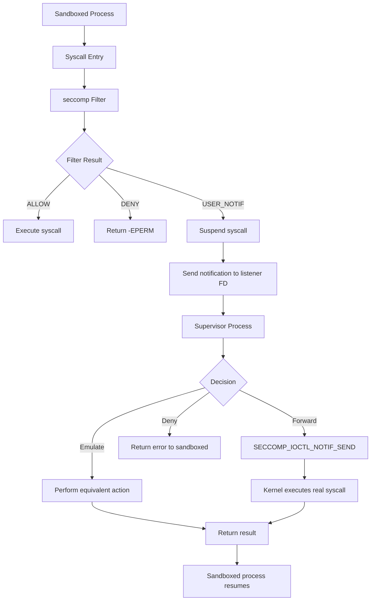
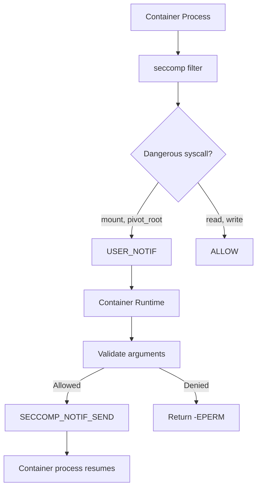
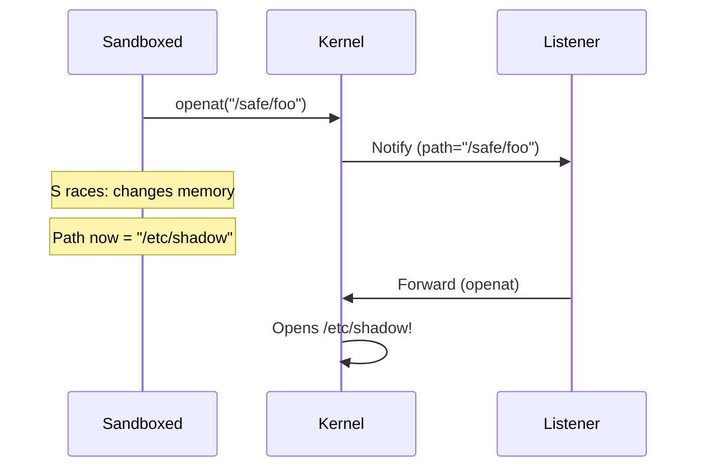

# Seccomp Notify: SECCOMP_RET_USER_NOTIF

## Introduction

Seccomp (Secure Computing Mode) notify, introduced in Linux 5.0, allows a **supervisor
process** to handle system calls made by a sandboxed process. When a seccomp filter
returns `SECCOMP_RET_USER_NOTIF`, the system call is suspended, and a notification is
sent to a listener process via a file descriptor. The supervisor can inspect the call,
optionally emulate it, and return a result. This enables sophisticated sandboxing where
system call policy decisions are delegated to a user-space process.

## Architecture Overview



## System Call Flow

### Sandboxed Process (Client)

The sandboxed process installs a seccomp filter that returns `SECCOMP_RET_USER_NOTIF`
for certain system calls:

```c
#include <linux/seccomp.h>
#include <linux/filter.h>
#include <linux/audit.h>
#include <sys/prctl.h>

/* Install seccomp filter that sends notifications for openat */
int install_seccomp_filter(void)
{
    struct sock_filter filter[] = {
        /* Load syscall number */
        BPF_STMT(BPF_LD | BPF_W | BPF_ABS,
                 offsetof(struct seccomp_data, nr)),

        /* If openat, notify supervisor */
        BPF_JUMP(BPF_JMP | BPF_JEQ | BPF_K, __NR_openat, 0, 1),
        BPF_STMT(BPF_RET | BPF_K, SECCOMP_RET_USER_NOTIF),

        /* If open, notify supervisor */
        BPF_JUMP(BPF_JMP | BPF_JEQ | BPF_K, __NR_open, 0, 1),
        BPF_STMT(BPF_RET | BPF_K, SECCOMP_RET_USER_NOTIF),

        /* Otherwise, allow */
        BPF_STMT(BPF_RET | BPF_K, SECCOMP_RET_ALLOW),
    };

    struct sock_fprog prog = {
        .len = sizeof(filter) / sizeof(filter[0]),
        .filter = filter,
    };

    /* Enable seccomp with the filter */
    prctl(PR_SET_NO_NEW_PRIVS, 1, 0, 0, 0);
    return prctl(PR_SET_SECCOMP, SECCOMP_MODE_FILTER, &prog, 0, 0);
}
```

### Supervisor Process (Listener)

The supervisor receives and handles notifications:

```c
#include <linux/seccomp.h>
#include <sys/ioctl.h>

int setup_supervisor(pid_t child_pid)
{
    int listener;

    /* Get the notification FD from the seccomp filter */
    /* (The FD is obtained via prctl(PR_GET_SECCOMP_LISTENER) or */
    /*  inherited/received from the process that installed the filter) */
    struct seccomp_notif_req *req;
    struct seccomp_notif_resp *resp;

    /* Allocate notification structures */
    req = malloc(sizeof(*req));
    resp = malloc(sizeof(*resp));

    while (1) {
        /* Receive a notification (blocks until a syscall is intercepted) */
        if (ioctl(listener, SECCOMP_IOCTL_NOTIF_RECV, req) < 0) {
            perror("SECCOMP_IOCTL_NOTIF_RECV");
            break;
        }

        printf("Notification: pid=%d, syscall=%lld, args=[%llx, %llx, %llx]\n",
               req->pid, req->data.nr,
               req->data.args[0], req->data.args[1], req->data.args[2]);

        /* Handle the syscall */
        resp->id = req->id;

        if (req->data.nr == __NR_openat) {
            /* Emulate: perform the open on behalf of the sandboxed process */
            int fd = openat(req->data.args[0],
                            (const char *)req->data.args[1],
                            req->data.args[2], req->data.args[3]);
            resp->error = 0;
            resp->val = fd;
        } else {
            /* Deny */
            resp->error = -EPERM;
            resp->val = 0;
        }

        /* Send the response back */
        if (ioctl(listener, SECCOMP_IOCTL_NOTIF_SEND, resp) < 0) {
            perror("SECCOMP_IOCTL_NOTIF_SEND");
        }
    }

    free(req);
    free(resp);
    return 0;
}
```

## Kernel Implementation

### Notification Structures

```c
/* include/uapi/linux/seccomp.h */

struct seccomp_data {
    int nr;                     /* System call number */
    __u32 arch;                 /* AUDIT_ARCH_* */
    __u64 instruction_pointer;  /* EIP/RIP */
    __u64 args[6];              /* System call arguments */
};

struct seccomp_notif {
    __u64 id;                   /* Unique notification ID */
    __u32 pid;                  /* PID of the target process */
    __u32 flags;                /* SECCOMP_NOTIF_FLAG_* */
    struct seccomp_data data;   /* System call data */
};

struct seccomp_notif_resp {
    __u64 id;                   /* Must match notification ID */
    __s64 val;                  /* Return value */
    __s32 error;                /* Error code (0 for success) */
    __u32 flags;                /* SECCOMP_NOTIF_FLAG_* */
};
```

### Filter Result Handling

```c
/* kernel/seccomp.c - simplified */
static int seccomp_do_user_notification(int this_syscall,
                                         struct seccomp_data *sd,
                                         struct seccomp_filter *match)
{
    struct seccomp_notif *notification;

    /* Allocate notification */
    notification = kzalloc(sizeof(*notification), GFP_KERNEL);
    notification->id = atomic64_inc_return(&match->notif_id);
    notification->pid = current->pid;
    memcpy(&notification->data, sd, sizeof(*sd));

    /* Add to pending notifications list */
    list_add_tail(&notification->list, &match->notif->pending);

    /* Wake up the listener */
    wake_up(&match->notif->wqh);

    /* Wait for response */
    wait_event(match->notif->response_wait,
               notification->state == SECCOMP_NOTIF_REPLIED);

    /* Return the response to the syscall dispatcher */
    if (notification->resp.error)
        return notification->resp.error;
    return notification->resp.val;
}
```

## ioctl Operations

| ioctl | Description |
|-------|-------------|
| `SECCOMP_IOCTL_NOTIF_RECV` | Receive a pending notification |
| `SECCOMP_IOCTL_NOTIF_SEND` | Send a response to a notification |
| `SECCOMP_IOCTL_NOTIF_ID_VALID` | Check if a notification ID is still valid |
| `SECCOMP_IOCTL_NOTIF_ADDFD` | Add a file descriptor to the target process |

### Adding File Descriptors (SECCOMP_IOCTL_NOTIF_ADDFD)

Instead of performing the syscall on behalf of the target, the supervisor can
inject file descriptors directly:

```c
/* Supervisor: open a file and inject the FD into the sandboxed process */
int inject_fd(int listener, int local_fd, int target_fd)
{
    struct seccomp_notif_addfd addfd = {
        .id = req->id,                    /* Match the notification */
        .srcfd = local_fd,                /* FD in supervisor */
        .newfd = target_fd,               /* Target FD number (0 = auto) */
        .flags = SECCOMP_ADDFD_FLAG_SEND, /* Also send response */
    };

    return ioctl(listener, SECCOMP_IOCTL_NOTIF_ADDFD, &addfd);
}
```

### Validating Notification IDs

```c
/* Check if the target process is still alive */
int is_notification_valid(int listener, __u64 id)
{
    struct seccomp_notif_id_valid valid = { .id = id };
    return ioctl(listener, SECCOMP_IOCTL_NOTIF_ID_VALID, &valid) == 0;
}
```

## Use Cases

### Container Runtime Proxy

Container runtimes use seccomp notify to proxy system calls:



### Filesystem Sandboxing

```c
/* Supervisor: intercept openat and restrict paths */
void handle_openat(int listener, struct seccomp_notif_req *req)
{
    const char *pathname = read_string_from_target(req->pid,
                                                    req->data.args[1]);

    /* Validate path */
    if (strncmp(pathname, "/etc/", 5) == 0) {
        /* Deny access to /etc */
        deny_notification(listener, req, -EACCES);
    } else if (strncmp(pathname, "/safe/", 6) == 0) {
        /* Allow and proxy the syscall */
        forward_notification(listener, req);
    } else {
        deny_notification(listener, req, -EPERM);
    }
}
```

### Syscall Auditing

```c
/* Supervisor: log all file opens */
void audit_openat(struct seccomp_notif_req *req)
{
    struct seccomp_data *data = &req->data;
    char *path = read_string_from_target(req->pid, data->args[1]);

    log_audit("PID=%d opened '%s' flags=%lld mode=%lld",
              req->pid, path, data->args[2], data->args[3]);

    free(path);
}
```

## Security Considerations

### TOCTOU (Time-of-Check-to-Time-of-Use) Races



**Mitigation**: Use `SECCOMP_IOCTL_NOTIF_ADDFD` to inject FDs rather than
forwarding syscalls, or use `/proc/pid/mem` to read arguments atomically:

```c
/* Atomic read of target's memory via /proc/pid/mem */
char *read_target_string(pid_t pid, unsigned long addr)
{
    char path[64], buf[PATH_MAX];
    int fd;
    ssize_t nread;

    snprintf(path, sizeof(path), "/proc/%d/mem", pid);
    fd = open(path, O_RDONLY);
    if (fd < 0) return NULL;

    nread = pread(fd, buf, sizeof(buf) - 1, addr);
    close(fd);

    if (nread <= 0) return NULL;
    buf[nread] = '\0';
    return strdup(buf);
}
```

### Process Exit Races

```c
/* Always validate notification ID before responding */
int safe_respond(int listener, struct seccomp_notif_req *req,
                 struct seccomp_notif_resp *resp)
{
    struct seccomp_notif_id_valid valid = { .id = req->id };

    /* Verify the target hasn't exited */
    if (ioctl(listener, SECCOMP_IOCTL_NOTIF_ID_VALID, &valid) < 0) {
        /* Target exited, notification is stale */
        return -1;
    }

    return ioctl(listener, SECCOMP_IOCTL_NOTIF_SEND, resp);
}
```

### Supervisor Privilege Model

```c
/* The supervisor typically runs with elevated privileges */
/* It should be isolated and minimal */

/* Drop capabilities after setup */
cap_drop_bound(CAP_SYS_ADMIN);
cap_clear bounding_set;

/* Apply seccomp to the supervisor too (defense in depth) */
apply_supervisor_seccomp_filter();
```

## Complete Example: Minimal Proxy Sandbox

```c
#define _GNU_SOURCE
#include <linux/seccomp.h>
#include <linux/filter.h>
#include <linux/audit.h>
#include <sys/ioctl.h>
#include <sys/prctl.h>
#include <sys/wait.h>
#include <stdio.h>
#include <stdlib.h>
#include <unistd.h>
#include <errno.h>

static int listener_fd;

/* Supervisor loop */
void supervisor_loop(void)
{
    struct seccomp_notif *req;
    struct seccomp_notif_resp *resp;

    req = malloc(sizeof(*req));
    resp = malloc(sizeof(*resp));

    while (1) {
        if (ioctl(listener_fd, SECCOMP_IOCTL_NOTIF_RECV, req) < 0)
            break;

        printf("[SUPERVISOR] pid=%d syscall=%lld\n",
               req->pid, req->data.nr);

        resp->id = req->id;

        switch (req->data.nr) {
        case __NR_write:
            /* Allow writes */
            resp->error = 0;
            resp->val = req->data.args[2]; /* Return count */
            break;
        case __NR_exit:
        case __NR_exit_group:
            /* Allow exits */
            resp->error = 0;
            resp->val = 0;
            break;
        default:
            /* Deny everything else */
            resp->error = -EPERM;
            resp->val = 0;
            break;
        }

        if (ioctl(listener_fd, SECCOMP_IOCTL_NOTIF_SEND, resp) < 0)
            break;
    }

    free(req);
    free(resp);
}

int main(void)
{
    pid_t child;

    /* Create notification socketpair */
    int fds[2];
    socketpair(AF_UNIX, SOCK_STREAM, 0, fds);
    listener_fd = fds[0];

    child = fork();
    if (child == 0) {
        /* Child: sandboxed process */
        close(fds[0]);

        /* Install seccomp filter */
        struct sock_filter filter[] = {
            BPF_STMT(BPF_LD | BPF_W | BPF_ABS,
                     offsetof(struct seccomp_data, nr)),
            BPF_JUMP(BPF_JMP | BPF_JEQ | BPF_K, __NR_write, 0, 1),
            BPF_STMT(BPF_RET | BPF_K, SECCOMP_RET_USER_NOTIF),
            BPF_JUMP(BPF_JMP | BPF_JEQ | BPF_K, __NR_exit, 0, 1),
            BPF_STMT(BPF_RET | BPF_K, SECCOMP_RET_USER_NOTIF),
            BPF_JUMP(BPF_JMP | BPF_JEQ | BPF_K, __NR_exit_group, 0, 1),
            BPF_STMT(BPF_RET | BPF_K, SECCOMP_RET_USER_NOTIF),
            BPF_STMT(BPF_RET | BPF_K, SECCOMP_RET_ALLOW),
        };
        struct sock_fprog prog = {
            .len = sizeof(filter) / sizeof(filter[0]),
            .filter = filter,
        };

        prctl(PR_SET_NO_NEW_PRIVS, 1, 0, 0, 0);
        prctl(PR_SET_SECCOMP, SECCOMP_MODE_FILTER, &prog, 0, 0);

        /* Try syscalls */
        write(STDOUT_FILENO, "Hello from sandbox!\n", 20);
        /* This would be blocked: open("/etc/passwd", O_RDONLY); */
        return 0;
    }

    /* Parent: supervisor */
    close(fds[1]);
    supervisor_loop();
    waitpid(child, NULL, 0);

    return 0;
}
```

## Tools and Libraries

### Go: seccomp-notify-bpf

```go
package main

import (
    "github.com/seccomp/libseccomp-golang"
)

func main() {
    // Create filter with USER_NOTIF
    filter := seccomp.NewFilter(seccomp.ActAllow)
    filter.AddRule(seccomp.ScmpSyscall(openatNr), seccomp.ActNotify)
    filter.Load()
}
```

### OCI Runtime Integration

```json
{
    "linux": {
        "seccomp": {
            "defaultAction": "SCMP_ACT_ALLOW",
            "architectures": ["SCMP_ARCH_X86_64"],
            "syscalls": [
                {
                    "names": ["mount", "umount2"],
                    "action": "SCMP_ACT_NOTIFY"
                }
            ]
        }
    }
}
```

## Kernel Configuration

```
CONFIG_SECCOMP=y
CONFIG_SECCOMP_FILTER=y
CONFIG_SECCOMP_USER_NOTIFICATION=y
```

## Cross-References

- [seccomp](../security/seccomp.md) - seccomp fundamentals and BPF filters
- [BPF (Berkeley Packet Filter)](../debugging/ebpf.md) - BPF for filtering
- [Capabilities](../security/capabilities.md) - Fine-grained privileges
- [Namespaces](../kernel/processes/namespaces.md) - Resource isolation
- [Docker Internals](../containers/docker-internals.md) - Container security
- [Container Security](../containers/security.md) - Container hardening
- [Landlock](../security/landlock.md) - Complementary filesystem sandboxing

## Further Reading

- [seccomp user notification (LWN.net)](https://lwn.net/Articles/756233/)
- [seccomp notify documentation](https://www.kernel.org/doc/html/latest/userspace-api/seccomp_filter.html)
- [SECCOMP_RET_USER_NOTIF patches](https://lore.kernel.org/lkml/?q=SECCOMP_RET_USER_NOTIF)
- [Tycho Andersen's seccomp notify talk](https://www.youtube.com/watch?v=iU7JqH9i3sI)
- [OCI runtime spec: seccomp](https://github.com/opencontainers/runtime-spec/blob/main/config-linux.md#seccomp)
- [libseccomp](https://github.com/seccomp/libseccomp)
- [seccomp notify proxy example](https://github.com/containers/conmon)
