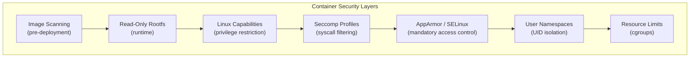

# Container Security

Container security encompasses the practices, tools, and Linux kernel features used to isolate
containers, limit their capabilities, and prevent breakout attacks. This page covers the
defense-in-depth approach: seccomp profiles, AppArmor, Linux capabilities, read-only
filesystems, and image scanning.

## Introduction

Containers share the host kernel, making security fundamentally different from virtual machines.
A container breakout gives the attacker access to the host kernel — the same kernel running
all other containers. Defense-in-depth means layering multiple security mechanisms so that
a single vulnerability doesn't compromise the entire system.

Security layers:



## Seccomp Profiles

Seccomp (Secure Computing Mode) restricts the system calls a container can make. Since
containers share the host kernel, limiting syscalls dramatically reduces the attack surface.

### Default Docker/Podman Profile

The default profile blocks approximately 44 of ~330 syscalls on x86-64:

```json
{
  "defaultAction": "SCMP_ACT_ERRNO",
  "defaultErrnoRet": 1,
  "archMap": [
    { "architecture": "SCMP_ARCH_X86_64", "subArchitectures": ["SCMP_ARCH_X86"] }
  ],
  "syscalls": [
    {
      "names": [
        "accept", "accept4", "access", "arch_prctl", "bind", "brk",
        "chdir", "chmod", "chown", "clock_getres", "clock_gettime",
        "close", "connect", "dup", "dup2", "dup3", "epoll_create",
        "epoll_create1", "epoll_ctl", "epoll_wait", "execve", "exit",
        "exit_group", "fcntl", "fstat", "futex", "getcwd", "getdents64",
        "getpid", "getppid", "getsockname", "getsockopt", "getuid",
        "ioctl", "listen", "lseek", "madvise", "mmap", "mprotect",
        "munmap", "nanosleep", "newfstatat", "open", "openat", "pipe",
        "pipe2", "poll", "prctl", "pread64", "pwrite64", "read",
        "readlink", "recvfrom", "recvmsg", "rename", "rt_sigaction",
        "rt_sigprocmask", "rt_sigreturn", "sendmsg", "sendto", "set_robust_list",
        "set_tid_address", "setsockopt", "shutdown", "sigaltstack",
        "socket", "stat", "statfs", "sysinfo", "tgkill", "umask",
        "uname", "unlink", "wait4", "write", "writev"
      ],
      "action": "SCMP_ACT_ALLOW"
    }
  ]
}
```

### Custom Seccomp Profile

```json
{
  "defaultAction": "SCMP_ACT_ERRNO",
  "defaultErrnoRet": 1,
  "comment": "Strict profile for a web server",
  "syscalls": [
    {
      "names": [
        "read", "write", "open", "close", "fstat", "lseek",
        "mmap", "mprotect", "munmap", "brk", "rt_sigaction",
        "rt_sigprocmask", "ioctl", "access", "pipe", "select",
        "sched_yield", "dup", "dup2", "clone", "fork", "execve",
        "exit", "wait4", "kill", "getpid", "getuid", "getgid",
        "geteuid", "getegid", "fcntl", "flock", "fsync",
        "epoll_create", "epoll_ctl", "epoll_wait",
        "socket", "connect", "accept", "sendto", "recvfrom",
        "bind", "listen", "getsockname", "getpeername",
        "setsockopt", "getsockopt", "clone", "uname",
        "readlink", "gettimeofday", "getpid", "sysinfo"
      ],
      "action": "SCMP_ACT_ALLOW"
    },
    {
      "names": ["ptrace", "kexec_load", "init_module", "finit_module", "delete_module"],
      "action": "SCMP_ACT_KILL",
      "comment": "Block dangerous kernel operations"
    }
  ]
}
```

### Applying Seccomp Profiles

```bash
# Docker
docker run --security-opt seccomp=custom.json nginx

# Podman
podman run --security-opt seccomp=custom.json nginx

# Kubernetes
apiVersion: v1
kind: Pod
metadata:
  name: secured-pod
spec:
  securityContext:
    seccompProfile:
      type: Localhost
      localhostProfile: profiles/custom.json
  containers:
  - name: app
    image: myapp:latest
```

### Generating Seccomp Profiles with strace

```bash
# Trace syscalls used by a container
strace -f -c -p $(pgrep -x nginx) 2>&1 | head -30

# Or use OCI seccomp tools
docker run --rm \
    --security-opt seccomp=unconfined \
    -v /etc/seccomp:/output \
    oci-seccomp-bpf-hook \
    myapp:latest

# Output: /etc/seccomp/myapp.json
```

## AppArmor

AppArmor is a Linux Security Module (LSM) that restricts programs' capabilities with
per-program profiles. It limits file access, network access, and capability use.

### Default AppArmor Profile

```bash
# Check current AppArmor status
sudo aa-status

# Docker default profile: docker-default
# Podman: unconfined by default (SELinux preferred)
```

### Custom AppArmor Profile

```bash
# /etc/apparmor.d/containers/myapp
#include <tunables/global>

profile myapp flags=(attach_disconnected) {
  #include <abstractions/base>

  # Deny all file writes by default
  deny /** w,

  # Allow read access to specific paths
  /app/** r,
  /etc/ssl/certs/** r,
  /etc/resolv.conf r,
  /etc/hosts r,

  # Allow write only to specific paths
  /tmp/** rw,
  /var/log/myapp/** rw,

  # Network access
  network inet stream,
  network inet dgram,

  # Deny raw sockets
  deny network raw,
  deny network packet,

  # Deny mount operations
  deny mount,

  # Deny ptrace
  deny ptrace,

  # Allow specific capabilities
  capability net_bind_service,
  deny capability sys_admin,
  deny capability sys_module,
  deny capability sys_rawio,
}
```

### Loading and Applying

```bash
# Load the profile
sudo apparmor_parser -r /etc/apparmor.d/containers/myapp

# Docker
docker run --security-opt apparmor=myapp myapp:latest

# Verify
docker inspect --format '{{.AppArmorProfile}}' <container>
```

### AppArmor vs SELinux

| Aspect              | AppArmor                           | SELinux                              |
|---------------------|------------------------------------|--------------------------------------|
| **Default on**      | Ubuntu, Debian, SUSE               | RHEL, Fedora, CentOS, Android        |
| **Model**           | Path-based                         | Label-based                          |
| **Complexity**      | Simpler profiles                   | More complex, more powerful          |
| **Container default**| docker-default                    | container_t (Podman default)         |
| **Profile format**  | Custom DSL                         | Policy modules (M4 macros)           |

## Linux Capabilities

Capabilities break root's monolithic privilege into ~40 distinct units. Containers should
drop all capabilities and add back only what's needed.

### Common Capabilities

| Capability              | Purpose                                   | Risk    |
|-------------------------|-------------------------------------------|---------|
| `CAP_NET_BIND_SERVICE`  | Bind to ports < 1024                      | Low     |
| `CAP_NET_RAW`           | Use raw sockets, packet injection         | Medium  |
| `CAP_SYS_ADMIN`         | Broad admin operations (mount, etc.)      | **High** |
| `CAP_SYS_PTRACE`        | Trace/debug processes                     | **High** |
| `CAP_SYS_MODULE`        | Load kernel modules                       | **Critical** |
| `CAP_SYS_RAWIO`         | Direct I/O port access                    | **Critical** |
| `CAP_DAC_OVERRIDE`      | Bypass file permission checks             | Medium  |
| `CAP_FOWNER`            | Bypass ownership checks                   | Medium  |
| `CAP_SETUID`            | Change UID                                | Medium  |
| `CAP_CHOWN`             | Change file ownership                     | Low     |
| `CAP_KILL`              | Send signals to any process               | Medium  |
| `CAP_MKNOD`             | Create device files                       | Medium  |

### Dropping and Adding Capabilities

```bash
# Drop all, add only what's needed
docker run --cap-drop=ALL --cap-add=NET_BIND_SERVICE nginx

# Podman
podman run --cap-drop=ALL --cap-add=NET_BIND_SERVICE nginx

# Kubernetes
apiVersion: v1
kind: Pod
spec:
  containers:
  - name: app
    securityContext:
      capabilities:
        drop:
          - ALL
        add:
          - NET_BIND_SERVICE
      allowPrivilegeEscalation: false
```

### Default Capabilities

Docker/Podman grant these by default (should be dropped when not needed):

```
CAP_CHOWN
CAP_DAC_OVERRIDE
CAP_FSETID
CAP_FOWNER
CAP_MKNOD
CAP_NET_RAW
CAP_SETGID
CAP_SETUID
CAP_SETFCAP
CAP_SETPCAP
CAP_NET_BIND_SERVICE
CAP_SYS_CHROOT
CAP_KILL
CAP_AUDIT_WRITE
```

### Checking Container Capabilities

```bash
# Show capabilities of a running container
docker inspect --format '{{.HostConfig.CapAdd}}' <container>
docker inspect --format '{{.HostConfig.CapDrop}}' <container>

# Inside the container
cat /proc/1/status | grep Cap
# CapEff: 00000000a80425fb
# CapPrm: 00000000a80425fb

# Decode capabilities
capsh --decode=00000000a80425fb
# 0x00000000a80425fb=cap_chown,cap_dac_override,cap_fowner,cap_fsetid,
# cap_kill,cap_setgid,cap_setuid,cap_setpcap,cap_net_bind_service,
# cap_net_raw,cap_sys_chroot,cap_mknod,cap_audit_write,cap_setfcap
```

## Read-Only Root Filesystem

A read-only rootfs prevents attackers from modifying binaries, installing tools, or
establishing persistence inside the container.

```bash
# Docker / Podman
docker run --read-only --tmpfs /tmp:rw,noexec,nosuid \
    --tmpfs /var/run:rw,noexec,nosuid \
    nginx

# With specific writable volumes
docker run --read-only \
    --tmpfs /tmp:rw,size=100m \
    -v app-data:/var/lib/app:rw \
    myapp:latest

# Kubernetes
apiVersion: v1
kind: Pod
spec:
  containers:
  - name: app
    securityContext:
      readOnlyRootFilesystem: true
    volumeMounts:
    - name: tmp
      mountPath: /tmp
    - name: app-data
      mountPath: /var/lib/app
  volumes:
  - name: tmp
    emptyDir:
      medium: Memory
      sizeLimit: 100Mi
  - name: app-data
    persistentVolumeClaim:
      claimName: app-data-pvc
```

### No New Privileges

Prevents setuid binaries from gaining elevated privileges:

```bash
# Docker / Podman
docker run --security-opt no-new-privileges:true myapp

# Kubernetes
spec:
  containers:
  - name: app
    securityContext:
      allowPrivilegeEscalation: false
```

## Image Scanning

Scanning container images for known vulnerabilities (CVEs) is a critical pre-deployment
security measure.

### Trivy

```bash
# Install Trivy
sudo apt install trivy   # or
curl -sfL https://raw.githubusercontent.com/aquasecurity/trivy/main/contrib/install.sh | sh -s -- -b /usr/local/bin

# Scan an image
trivy image nginx:latest
# nginx:latest (debian 12.4)
# ===========================
# Total: 142 (UNKNOWN: 0, LOW: 85, MEDIUM: 42, HIGH: 13, CRITICAL: 2)
#
# ┌──────────────┬────────────────┬──────────┬─────────────────┐
# │   Library    │ Vulnerability  │ Severity │  Fixed Version  │
# ├──────────────┼────────────────┼──────────┼─────────────────┤
# │ libssl3      │ CVE-2024-0727  │ MEDIUM   │ 3.0.13-1~deb12u │
# └──────────────┴────────────────┴──────────┴─────────────────┘

# Scan with severity filter
trivy image --severity HIGH,CRITICAL nginx:latest

# Scan and output JSON
trivy image --format json --output results.json nginx:latest

# Scan in CI (fail on critical)
trivy image --exit-code 1 --severity CRITICAL myapp:latest

# Scan filesystem / Containerfile
trivy fs .
trivy config .
```

### Grype

```bash
# Install
curl -sSfL https://raw.githubusercontent.com/anchore/grype/main/install.sh | sh -s -- -b /usr/local/bin

# Scan image
grype nginx:latest

# Output in table format
grype nginx:latest -o table

# JSON output
grype nginx:latest -o json > results.json
```

### Docker Scout

```bash
# Built into Docker Desktop / Docker CLI
docker scout cves nginx:latest
docker scout recommendations nginx:latest
```

### Snyk

```bash
# Install
npm install -g snyk

# Authenticate
snyk auth

# Scan image
snyk container test nginx:latest
```

### SBOM (Software Bill of Materials)

```bash
# Generate SBOM with Syft
syft nginx:latest -o spdx-json > sbom.spdx.json

# Scan SBOM with Grype
grype sbom:sbom.spdx.json

# Generate SBOM with Docker
docker sbom nginx:latest
```

## Comprehensive Security Example

A production-hardened container configuration:

```yaml
# Kubernetes Pod with full security hardening
apiVersion: v1
kind: Pod
metadata:
  name: hardened-app
  labels:
    app: hardened
spec:
  automountServiceAccountToken: false
  securityContext:
    runAsNonRoot: true
    runAsUser: 65534        # nobody
    runAsGroup: 65534
    fsGroup: 65534
    seccompProfile:
      type: Localhost
      localhostProfile: profiles/strict.json
  containers:
  - name: app
    image: myregistry.io/app@sha256:abc123  # Pin by digest
    securityContext:
      allowPrivilegeEscalation: false
      readOnlyRootFilesystem: true
      capabilities:
        drop:
          - ALL
        add:
          - NET_BIND_SERVICE
      seLinuxOptions:
        type: spc_t
    resources:
      limits:
        memory: "256Mi"
        cpu: "500m"
      requests:
        memory: "128Mi"
        cpu: "250m"
    volumeMounts:
    - name: tmp
      mountPath: /tmp
    - name: app-data
      mountPath: /var/lib/app
    livenessProbe:
      httpGet:
        path: /healthz
        port: 8080
      initialDelaySeconds: 5
      periodSeconds: 10
    readinessProbe:
      httpGet:
        path: /ready
        port: 8080
  volumes:
  - name: tmp
    emptyDir:
      medium: Memory
      sizeLimit: 50Mi
  - name: app-data
    persistentVolumeClaim:
      claimName: app-data
```

## Security Checklist

| Category              | Check                                         | Status |
|-----------------------|-----------------------------------------------|--------|
| **Image**             | Scan for CVEs before deployment               | ☐      |
| **Image**             | Use minimal base images (distroless, alpine)  | ☐      |
| **Image**             | Pin by digest, not tag                        | ☐      |
| **Runtime**           | Run as non-root user                          | ☐      |
| **Runtime**           | Read-only rootfs                              | ☐      |
| **Runtime**           | Drop all capabilities                         | ☐      |
| **Runtime**           | Custom seccomp profile                        | ☐      |
| **Runtime**           | AppArmor/SELinux enforced                     | ☐      |
| **Runtime**           | No privilege escalation                       | ☐      |
| **Runtime**           | Resource limits set (CPU, memory)             | ☐      |
| **Network**           | Network policies applied                      | ☐      |
| **Secrets**           | No secrets in environment variables           | ☐      |
| **Secrets**           | Use Kubernetes secrets or vault               | ☐      |
| **Supply chain**      | SBOM generated and signed                     | ☐      |

## References

- [Docker Security Best Practices](https://docs.docker.com/engine/security/) — Docker docs
- [Kubernetes Security](https://kubernetes.io/docs/concepts/security/) — K8s security overview
- [Seccomp man page](https://man7.org/linux/man-pages/man2/seccomp.2.html) — kernel seccomp
- [AppArmor Wiki](https://gitlab.com/apparmor/apparmor/-/wikis/) — AppArmor documentation
- [Trivy](https://aquasecurity.github.io/trivy/) — vulnerability scanner
- [NIST SP 800-190](https://csrc.nist.gov/publications/detail/sp/800-190/final) — container security guide
- [LWN: Container security](https://lwn.net/Articles/container-security/) — kernel perspective
- [man7.org: capabilities(7)](https://man7.org/linux/man-pages/man7/capabilities.7.html) — Linux capabilities

## Related Topics

- [Rootless Containers](./rootless.md) — running without root privileges
- [OCI Standards](./oci.md) — container image and runtime specs
- [Podman](./podman.md) — security-focused container engine
- [containerd](./containerd.md) — container runtime daemon
- [Debugging with eBPF](../debugging/overview.md) — observability for security
