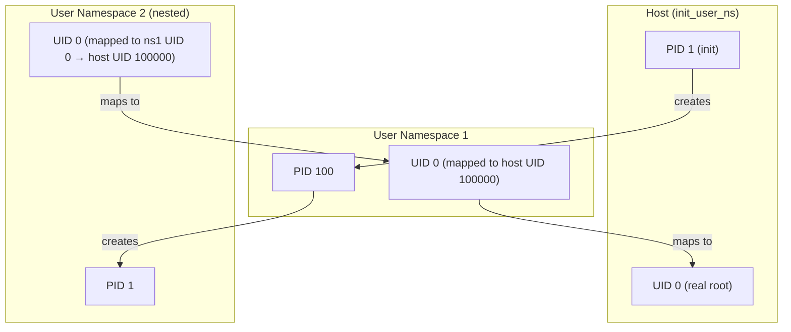
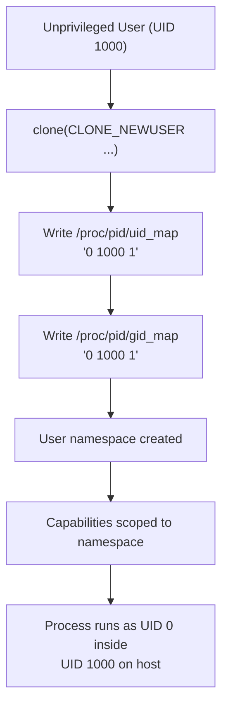
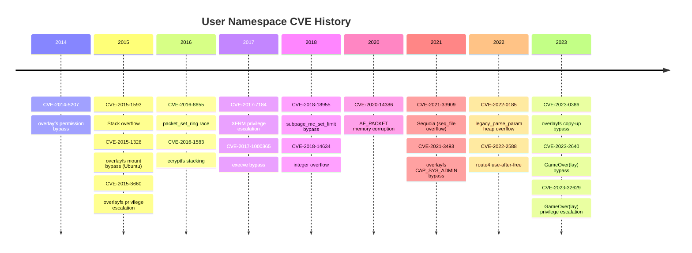
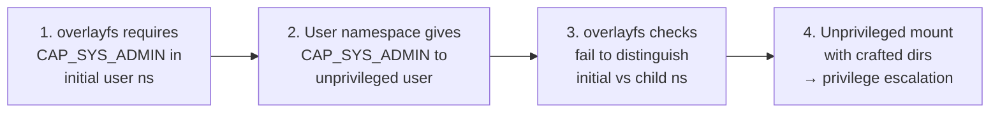
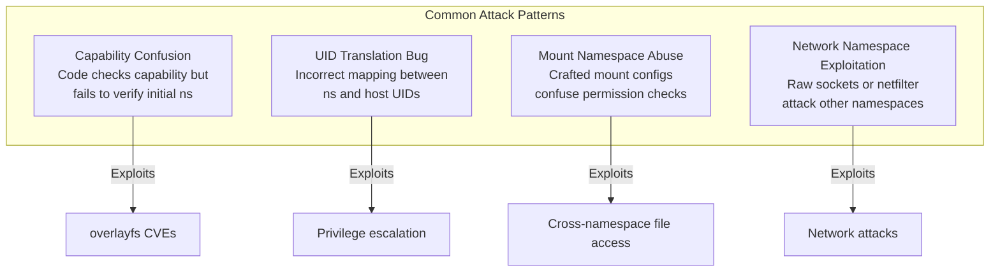
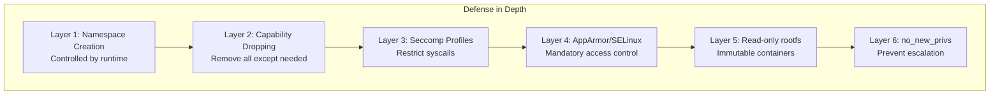

# User Namespace Security

## Overview

User namespaces (`CLONE_NEWUSER`) are one of the most security-sensitive
features in the Linux kernel. They allow unprivileged users to create isolated
UID/GID mappings, enabling containers to run without root privileges on the
host. However, the history of user namespaces is marked by a long series of
CVEs that exposed kernel attack surfaces through namespace operations, making
them a subject of ongoing debate between container functionality and system
security.

This page examines the security implications of user namespaces, their CVE
history, the unprivileged namespace model, and the attack surface they expose.

## User Namespace Basics

### What User Namespaces Provide

A user namespace creates an isolated view of UID/GID mappings:

```c
clone(CLONE_NEWUSER | CLONE_NEWNS | CLONE_NEWPID, ...);
```

Inside the namespace:

- A process can have UID 0 (root) while being an unprivileged user on the host
- Capabilities are scoped to the namespace — "root" inside the namespace has
  capabilities only within that namespace
- File ownership is mapped through UID/GID translation tables

### UID/GID Mapping

```bash
# Map host UID 1000 to namespace UID 0
echo "0 1000 1" > /proc/<pid>/uid_map

# Map host GID 1000 to namespace GID 0
echo "0 1000 1" > /proc/<pid>/gid_map
```

The mapping format is: `<ns_id> <host_id> <range>`

### User Namespace Nesting



### Capability Scoping

Capabilities granted in a user namespace apply only within that namespace
and its descendants:

| Capability              | Effect in User Namespace                        |
|-------------------------|------------------------------------------------|
| `CAP_SYS_ADMIN`         | Mount operations, namespace creation (limited)  |
| `CAP_NET_ADMIN`         | Network namespace configuration                 |
| `CAP_NET_RAW`           | Raw sockets within the network namespace        |
| `CAP_SYS_PTRACE`        | Trace processes in the PID namespace            |
| `CAP_DAC_OVERRIDE`      | Bypass file permission checks (within ns)       |
| `CAP_CHOWN`             | Change file ownership (within ns)               |
| `CAP_SETUID`/`CAP_SETGID` | Change UID/GID (within ns)                   |
| `CAP_MKNOD`             | Create device nodes (within ns)                 |
| `CAP_SYS_CHROOT`        | Use chroot() (within ns)                       |

Critically, capabilities in a user namespace do **not** grant access to host
resources outside the namespace.

### Capability Verification

```bash
# Check capabilities inside a user namespace
unshare --user --map-auto bash
cat /proc/self/status | grep Cap
# CapInh: 0000000000000000
# CapPrm: 0000003fffffffff
# CapEff: 0000003fffffffff
# CapBnd: 0000003fffffffff
# CapAmb: 0000000000000000

# Decode capabilities
capsh --decode=0000003fffffffff
# 0x0000000000000000=...

# Try to do something privileged outside the namespace
# This will fail - capabilities don't cross namespace boundaries
mount /dev/sda1 /mnt  # Permission denied
```

## Unprivileged User Namespaces

### The Design Goal

Unprivileged user namespaces were designed to enable rootless containers —
containers that don't require any host-level privileges. This was motivated by:

1. **Security**: removing the need for privileged container runtimes
2. **Usability**: allowing non-root users to use containers
3. **Isolation**: providing a privilege boundary between container and host

### How They Work

When `kernel.unprivileged_userns_clone=1` (the default on most distributions):

```bash
# As an unprivileged user:
unshare --user --map-auto --mount --pid --fork /bin/bash
# Now running as UID 0 inside the new user namespace
id
# uid=0(root) gid=0(root) groups=0(root)
```

The process is UID 0 inside the namespace but remains the original UID on the
host. The kernel translates UIDs at namespace boundaries.

### Sysctl Controls

```bash
# Enable/disable unprivileged user namespaces
sysctl kernel.unprivileged_userns_clone
# 1 = enabled (default on most distros)
# 0 = disabled (Debian default for some time)

# Limit the number of user namespaces
sysctl user.max_user_namespaces
# Default: 31726 (or similar)

# Limit nesting depth
sysctl user.max_user_namespaces
# Controls total count, not depth directly
```

### Namespace Creation Flow



## CVE History

User namespaces have been one of the most prolific sources of kernel CVEs.
The pattern is consistent: a kernel subsystem assumes it's running with real
root privileges, but user namespaces allow unprivileged users to reach those
code paths.

### CVE Timeline



### Notable CVEs by Category

#### Namespace Creation and Management

| CVE | Year | Description | Severity |
|-----|------|-------------|----------|
| CVE-2015-1593 | 2015 | Stack overflow in `create_new_namespaces()` | High |
| CVE-2016-8655 | 2016 | Race condition in `packet_set_ring()` via namespace | High |
| CVE-2017-7184 | 2017 | `xfrm_replay_verify_len()` out-of-bounds via namespace | High |
| CVE-2022-2588 | 2022 | `route4` classifier use-after-free via namespace | High |

#### Capability and Privilege Escalation

| CVE | Year | Description | Severity |
|-----|------|-------------|----------|
| CVE-2014-5207 | 2014 | `overlayfs` permission bypass via user namespace | High |
| CVE-2015-1328 | 2015 | `overlayfs` mount permission check bypass (Ubuntu) | Critical |
| CVE-2017-1000365 | 2017 | `execve()` argument size limits bypass via namespace | Medium |
| CVE-2018-18955 | 2018 | `subpage_mc_set_limit()` privilege check bypass | High |

#### Networking Subsystem

| CVE | Year | Description | Severity |
|-----|------|-------------|----------|
| CVE-2017-7184 | 2017 | XFRM framework privilege escalation via namespace | High |
| CVE-2018-14634 | 2018 | Integer overflow in `create_elf_tables()` via namespace | High |
| CVE-2020-14386 | 2020 | `AF_PACKET` memory corruption via namespace | High |
| CVE-2021-33909 | 2021 | `seq_file` size_t overflow via namespace (Sequoia) | High |
| CVE-2022-0185 | 2022 | `legacy_parse_param()` heap overflow via namespace | High |

#### Filesystem Subsystem

| CVE | Year | Description | Severity |
|-----|------|-------------|----------|
| CVE-2015-8660 | 2015 | `overlayfs` privilege escalation via namespace | High |
| CVE-2016-1583 | 2016 | `ecryptfs` stacking vulnerability via namespace | High |
| CVE-2021-3493 | 2021 | `overlayfs` `CAP_SYS_ADMIN` check bypass (Ubuntu) | High |
| CVE-2023-0386 | 2023 | `overlayfs` copy-up file capability bypass | High |
| CVE-2023-2640 | 2023 | `overlayfs` permission bypass (GameOver(lay)) | High |
| CVE-2023-32629 | 2023 | `overlayfs` local privilege escalation (GameOver(lay)) | High |

### The overlayfs Pattern

`overlayfs` has been the single most common vector for user namespace CVEs.
The pattern is:



1. `overlayfs` requires `CAP_SYS_ADMIN` in the **initial** (host) user namespace
   for mounting
2. However, within a user namespace, `CAP_SYS_ADMIN` is available to the
   unprivileged user
3. Various checks in `overlayfs` failed to correctly distinguish between
   capabilities in the initial namespace vs. a child user namespace
4. This allowed unprivileged users to mount `overlayfs` with crafted lower/upper
   directories, leading to privilege escalation

### Statistics

As of 2024, approximately **40–50 CVEs** have been directly attributed to user
namespace interactions. Many security-hardened distributions and security
researchers have recommended disabling unprivileged user namespaces by default.

## Attack Surface Analysis

### Capabilities Gained

An unprivileged user with access to user namespaces can reach kernel code paths
that would otherwise require root:

```c
/* These operations require capabilities in the initial namespace,
   but are available to any user via user namespaces: */

/* Mount filesystems (with CAP_SYS_ADMIN in user namespace) */
mount("overlay", "/tmp/merged", "overlay", 0, ...);

/* Create network namespaces and configure networking */
clone(CLONE_NEWUSER | CLONE_NEWNET, ...);

/* Use packet sockets (with CAP_NET_RAW in user namespace) */
socket(AF_PACKET, SOCK_RAW, htons(ETH_P_ALL));

/* Mount FUSE filesystems */
mount("fuse", "/tmp/fuse", "fuse", 0, ...);

/* Create device nodes in certain filesystems */
mknod("/tmp/dev/null", S_IFCHR | 0666, makedev(1, 3));
```

### Kernel Subsystems Exposed

User namespaces expose the following kernel subsystems to unprivileged code:

| Subsystem      | Exposure                          | Risk Level |
|----------------|-----------------------------------|------------|
| `overlayfs`    | Mount, copy-up, permission checks | High       |
| `netfilter`    | iptables/nftables rules in netns  | Medium     |
| `AF_PACKET`    | Raw socket access in netns        | Medium     |
| `XFRM`         | IPsec configuration in netns      | High       |
| `FUSE`         | Userspace filesystem mounting     | Medium     |
| `cgroup`       | cgroup operations in cgroupns     | Medium     |
| `sysfs/procfs` | Scoped views of kernel interfaces | Low        |
| `keyring`      | Key management in userns          | Low        |
| `io_uring`     | Async I/O operations              | Medium     |
| `bpf`          | BPF program loading               | Medium     |

### Attack Patterns



1. **Capability confusion**: code checks for a capability but fails to verify
   it's in the initial namespace
2. **UID translation bugs**: incorrect mapping between namespace and host UIDs
   leading to privilege escalation
3. **Mount namespace abuse**: creating mount configurations that confuse
   permission checks or expose host files
4. **Network namespace exploitation**: using raw sockets or netfilter to attack
   other namespaces or the host network

## Mitigations

### Kernel-Level Mitigations

#### sysctl Controls

```bash
# Disable unprivileged user namespaces entirely
echo 0 > /proc/sys/kernel/unprivileged_userns_clone

# Limit namespace nesting depth
echo 1 > /proc/sys/user/max_user_namespaces

# Restrict namespace counts per user
echo 100 > /proc/sys/user/max_user_namespaces
```

#### Kernel Configuration

```bash
# Build without user namespace support (extreme measure)
# CONFIG_USER_NS is not set

# Or restrict to privileged use only
# Requires patching (not mainline)
```

#### Namespace Restrictions (Debian)

Debian historically disabled unprivileged user namespaces by default
(`kernel.unprivileged_userns_clone=0`) due to the CVE history. This was
re-enabled in Debian 12 (Bookworm) after sufficient hardening.

#### Kernel Lockdown Mode

```bash
# Kernel lockdown restricts even root capabilities
cat /sys/kernel/security/lockdown
# [none] integrity confidentiality

# Enable lockdown (requires secure boot on some systems)
echo integrity > /sys/kernel/security/lockdown

# Lockdown restricts:
# - Loading unsigned kernel modules
# - kexec
# - hibernation
# - /dev/mem, /dev/kmem access
# - Some BPF operations
```

#### Seccomp Filtering

Container runtimes can use seccomp to restrict namespace operations:

```json
{
    "syscalls": [
        {
            "names": ["unshare", "clone", "clone3"],
            "action": "SCMP_ACT_ALLOW",
            "args": [
                {
                    "index": 0,
                    "value": 1073741824,
                    "op": "SCMP_CMP_MASKED_EQ",
                    "valueTwo": 0
                }
            ],
            "comment": "Allow CLONE_NEWUSER only"
        }
    ]
}
```

This can be tightened to block user namespace creation entirely or restrict
which namespaces can be created.

### Seccomp Profile for Namespace Restriction

```json
{
    "defaultAction": "SCMP_ACT_ERRNO",
    "defaultErrnoRet": 1,
    "architectures": ["SCMP_ARCH_X86_64"],
    "syscalls": [
        {
            "names": ["clone"],
            "action": "SCMP_ACT_ALLOW",
            "args": [
                {
                    "index": 0,
                    "value": 2114060288,
                    "op": "SCMP_CMP_MASKED_EQ",
                    "valueTwo": 0
                }
            ],
            "comment": "Allow clone with CLONE_NEWUSER|CLONE_NEWPID|CLONE_NEWNS only"
        },
        {
            "names": ["unshare"],
            "action": "SCMP_ACT_ALLOW",
            "args": [
                {
                    "index": 0,
                    "value": 1073741824,
                    "op": "SCMP_CMP_MASKED_EQ",
                    "valueTwo": 0
                }
            ],
            "comment": "Allow unshare with CLONE_NEWUSER only"
        }
    ]
}
```

### Distribution-Level Mitigations

| Distribution | Default Setting | Notes |
|--------------|-----------------|-------|
| Debian 11    | Disabled        | `unprivileged_userns_clone=0` |
| Debian 12    | Enabled         | Re-enabled with kernel hardening |
| Ubuntu       | Enabled         | With AppArmor namespace restrictions |
| Fedora       | Enabled         | With SELinux policy |
| RHEL 9       | Enabled         | With SELinux and seccomp defaults |
| Arch         | Enabled         | Upstream default |
| Alpine       | Enabled         | Minimal distro, upstream default |

### AppArmor Namespace Restrictions

```bash
# AppArmor can restrict namespace creation
# /etc/apparmor.d/usr.bin.container
/usr/bin/container {
    # Allow user namespace creation
    userns,

    # Deny specific namespace combinations
    deny mount,
    deny umount,

    # Allow network namespace
    network,
}
```

### SELinux Container Policy

```bash
# SELinux restricts container operations
# Check current SELinux container context
ps -eZ | grep container
# system_u:system_r:container_t:s0:c123,c456  1234  nginx

# SELinux types for containers
# container_t - general container process
# container_file_t - container files
# container_var_lib_t - container storage
# svirt_sandbox_file_t - sandbox files

# View SELinux denials for containers
ausearch -m avc -ts recent | grep container
```

### Application-Level Mitigations

Container runtimes implement multiple layers of defense:



1. **Namespace creation**: controlled by the runtime, not arbitrary
2. **Capability dropping**: remove all capabilities except those needed
3. **Seccomp profiles**: restrict system calls available inside the container
4. **AppArmor/SELinux**: mandatory access control on container operations
5. **Read-only rootfs**: prevent filesystem-based attacks
6. **PID isolation**: prevent signal injection across namespaces

### Runtime Security Defaults

```bash
# Docker default seccomp profile
# Blocks ~44 of ~300+ syscalls
# Includes: mount, kexec_load, open_by_handle_at, etc.

# View Docker's default seccomp profile
wget https://raw.githubusercontent.com/moby/moby/master/profiles/seccomp/default.json

# Podman rootless security
podman run --rm alpine cat /proc/1/status | grep -i seccomp
# Seccomp: 2 (filtered)

# crun security defaults
crun --help | grep -i seccomp
# --seccomp-profile=FILE
```

## Best Practices

### For System Administrators

```bash
# 1. Keep kernels updated: user namespace CVEs are patched promptly
apt update && apt upgrade linux-image-$(uname -r)

# 2. Consider disabling if unused
echo "kernel.unprivileged_userns_clone = 0" >> /etc/sysctl.d/99-security.conf
sysctl -p /etc/sysctl.d/99-security.conf

# 3. Monitor namespace usage
# Track namespace creation for anomaly detection
auditctl -a always,exit -F arch=b64 -S clone -S unshare -k namespace

# 4. Use security modules
# Enable AppArmor or SELinux with container profiles
aa-enforce /etc/apparmor.d/usr.bin.container

# 5. Restrict capabilities
docker run --cap-drop=ALL --cap-add=NET_BIND_SERVICE nginx

# 6. Enable kernel lockdown
echo integrity > /sys/kernel/security/lockdown
```

### For Container Runtime Developers

```c
/* 1. Always check initial namespace */
if (current_user_ns() != &init_user_ns) {
    /* This is in a child user namespace */
    return -EPERM;
}

/* 2. Validate UID mappings */
struct uid_gid_map *map = &ns->uid_gid_map;
/* Verify mapping doesn't grant unintended host-level access */

/* 3. Layer defenses */
/* Don't rely on a single security mechanism */

/* 4. Minimize kernel attack surface */
/* Use seccomp to block unnecessary syscalls */

/* 5. Audit namespace-capable code paths */
/* Any kernel code that checks capabilities needs to
   verify the namespace context */
```

### For Security Researchers

1. **Focus on capability confusion**: the most common vulnerability pattern
2. **Check cross-namespace file access**: UID translation at namespace
   boundaries is a rich source of bugs
3. **Audit mount operations**: `mount()` in user namespaces has complex
   security implications
4. **Test namespace nesting**: deeply nested namespaces amplify bugs
5. **Examine io_uring**: newer subsystem with namespace interactions

### Audit Script

```bash
#!/bin/bash
# Audit user namespace security configuration

echo "=== User Namespace Configuration ==="
echo "unprivileged_userns_clone: $(sysctl -n kernel.unprivileged_userns_clone 2>/dev/null || echo 'N/A')"
echo "max_user_namespaces: $(sysctl -n user.max_user_namespaces)"
echo "max_mnt_namespaces: $(sysctl -n user.max_mnt_namespaces 2>/dev/null || echo 'N/A')"
echo "max_pid_namespaces: $(sysctl -n user.max_pid_namespaces 2>/dev/null || echo 'N/A')"

echo ""
echo "=== Security Modules ==="
echo "SELinux: $(getenforce 2>/dev/null || echo 'not installed')"
echo "AppArmor: $(aa-status --enabled 2>/dev/null && echo 'enabled' || echo 'disabled')"
echo "Seccomp: $(grep Seccomp /proc/self/status)"
echo "Lockdown: $(cat /sys/kernel/security/lockdown 2>/dev/null || echo 'N/A')"

echo ""
echo "=== Container Runtime Security ==="
if command -v docker &>/dev/null; then
    echo "Docker: $(docker version --format '{{.Server.Version}}')"
    echo "Docker seccomp: $(docker info --format '{{.SecurityOptions}}' | grep -o seccomp)"
fi
if command -v podman &>/dev/null; then
    echo "Podman: $(podman --version)"
    echo "Podman rootless: $(podman info --format '{{.Host.Security.Rootless}}')"
fi

echo ""
echo "=== Active User Namespaces ==="
ls /proc/*/ns/user 2>/dev/null | wc -l
echo "user namespace instances"
```

## Alternative Approaches

### Rootless Containers Without User Namespaces

Some projects explore alternatives:

- **`fakeroot`**: LD_PRELOAD-based UID simulation (limited, no kernel access)
- **`bubblewrap`**: uses user namespaces but with restrictive seccomp filtering
- **`proot`**: ptrace-based emulation of root (slow, no namespace support)

None fully replace the functionality of user namespaces for container isolation.

### Comparison

| Approach | Kernel Access | Performance | Security | Use Case |
|----------|--------------|-------------|----------|----------|
| User namespaces | Full | Native | CVE history | Containers |
| fakeroot | None | Fast | Limited | Package building |
| bubblewrap | Limited | Native | Good | Sandboxing |
| proot | None | Slow (ptrace) | Limited | Compatibility |
| gVisor | User-space kernel | Moderate | Strong | Sandboxed containers |
| Kata | VM isolation | VM overhead | Strong | Multi-tenant |

### Unprivileged BPF Restrictions

Since BPF programs can be loaded in user namespaces, the kernel restricts
unprivileged BPF:

```bash
# Disable unprivileged BPF entirely
echo 1 > /proc/sys/kernel/unprivileged_bpf_disabled

# Check BPF restrictions
cat /proc/sys/kernel/unprivileged_bpf_disabled
# 0 = allowed (default)
# 1 = disabled (permanently, cannot be re-enabled without reboot)

# Modern kernels (5.15+) restrict unprivileged BPF further:
# - No BPF_MAP_TYPE_HASH_OF_MAPS for unprivileged
# - No BPF_PROG_TYPE_TRACING for unprivileged
# - Limited BPF helper functions
```

## See Also

- [Kernel Lockdown](../security/lockdown.md) — kernel-level capability
  restrictions
- [AF_PACKET](../kernel/networking/af-packet.md) — raw socket access in
  network namespaces
- [vmpressure](../kernel/memory/vmpressure.md) — per-cgroup memory pressure
  monitoring
- [Ring Buffer](../debugging/ring-buffer.md) — kernel data structures
  exposed through namespaces

## Further Reading

- **Kernel source**: `kernel/user_namespace.c`, `include/linux/user_namespace.h`
- **Documentation**: `Documentation/admin-guide/namespaces/resource-control.rst`
- **LWN article**: ["User namespaces and missing security checks"](https://lwn.net/Articles/544399/) —
  analysis of the overlayfs CVE pattern
- **LWN article**: ["The long road to rootless containers"](https://lwn.net/Articles/789004/) —
  history of user namespace security
- **CVE database**: search "user namespace" at https://cve.mitre.org/
- **Aleksa Sarai's talk**: "Rootless Containers" — comprehensive overview of
  the security model
- **Jann Horn's research**: multiple user namespace CVEs and exploitation
  techniques — Google Project Zero reports
- **Debian wiki**: "KernelHardening" — Debian's position on user namespaces
- **man page**: `user_namespaces(7)`
