# BCC (BPF Compiler Collection) Tools

## Introduction

The BPF Compiler Collection (BCC) is a toolkit for creating efficient kernel tracing
and manipulation programs built on eBPF (extended Berkeley Packet Filter). BCC provides
a framework that makes eBPF programming accessible by allowing tools to be written in
a combination of C (for the kernel-side BPF programs) and Python or Lua (for the
user-space control logic). It includes dozens of ready-made performance analysis,
networking, and debugging tools that work across a wide range of kernel versions.

BCC was created by Brenden Blanco at PLUMgrid and later maintained under the iovisor
project. It has become one of the most widely used eBPF toolkits, with tools covering
observability for scheduling, file systems, networking, storage, and more. Many of
these tools were inspired by or directly replace older DTraceToolkit scripts.

## Architecture

```
┌───────────────────────────────────────────────────────────┐
│                     BCC Architecture                       │
│                                                           │
│  ┌─────────────────────────────────────────────────────┐  │
│  │              User-Space Tools (Python/Lua)          │  │
│  │  ┌──────────┐  ┌──────────┐  ┌──────────────────┐  │  │
│  │  │execsnoop│  │biosnoop  │  │  tcplife          │  │  │
│  │  └────┬─────┘  └────┬─────┘  └────┬──────────────┘  │  │
│  └───────┼──────────────┼─────────────┼─────────────────┘  │
│          │              │             │                     │
│  ┌───────▼──────────────▼─────────────▼─────────────────┐  │
│  │                   BCC Framework                       │  │
│  │  ┌──────────────────────────────────────────────┐    │  │
│  │  │  C BPF Program (B template language)         │    │  │
│  │  │  - Compiled to BPF bytecode by LLVM/Clang    │    │  │
│  │  │  - Uses BPF maps for data sharing            │    │  │
│  │  │  - Attached to kprobes/tracepoints/uprobes   │    │  │
│  │  └──────────────────────────────────────────────┘    │  │
│  └──────────────────────────┬───────────────────────────┘  │
│                             │                               │
│  ┌──────────────────────────▼───────────────────────────┐  │
│  │                 BPF In-Kernel                         │  │
│  │  ┌──────────┐  ┌──────────────┐  ┌────────────────┐ │  │
│  │  │ kprobes  │  │  tracepoints │  │    uprobes     │ │  │
│  │  │ kretprobes│ │  raw_tp      │  │  perf_events   │ │  │
│  │  └──────────┘  └──────────────┘  └────────────────┘ │  │
│  └──────────────────────────────────────────────────────┘  │
└───────────────────────────────────────────────────────────┘
```

## Installation

### Debian / Ubuntu

```bash
sudo apt-get install bpfcc-tools linux-headers-$(uname -r)

# Tools are installed as <tool>.bpfcc (e.g., execsnoop.bpfcc)
# Or install the older naming:
sudo apt-get install bcc-tools
# Tools available at /usr/share/bcc/tools/
```

### Fedora / RHEL

```bash
sudo dnf install bcc-tools bcc-devel
# Tools at /usr/share/bcc/tools/
```

### From Source

```bash
# Install dependencies
sudo apt-get install -y bison build-essential cmake flex git \
    libelf-dev libllvm-14-dev llvm-14-dev libclang-14-dev \
    python3 zlib1g-dev

git clone https://github.com/iovisor/bcc.git
mkdir bcc/build; cd bcc/build
cmake ..
make -j$(nproc)
sudo make install
```

### Verification

```bash
# Check tools are available
ls /usr/share/bcc/tools/

# Quick test
sudo /usr/share/bcc/tools/execsnoop
# (Ctrl+C to stop)
```

## Process and Scheduling Tools

### execsnoop — Trace New Process Execution

`execsnoop` traces every `exec()` syscall system-wide, showing new processes as
they are created. This is invaluable for discovering short-lived processes that
may not appear in `top` or `ps` output.

```bash
# Trace all new processes
sudo /usr/share/bcc/tools/execsnoop

# Output columns:
# PCOMM    PID    PPID   RET ARGS
# bash     12345  1234   0   /bin/bash
# ls       12346  12345  0   /bin/l

# Trace a specific process name
sudo /usr/share/bcc/tools/execsnoop -n bash

# Include timestamp
sudo /usr/share/bcc/tools/execsnoop -t

# Trace with arguments (up to 240 chars)
sudo /usr/share/bcc/tools/execsnoop -x

# Filter by UID
sudo /usr/share/bcc/tools/execsnoop -u 1000
```

**Use cases:**
- Discovering cron jobs or systemd timer executions
- Finding unexpected processes spawned by scripts
- Security auditing of new process creation

### exitsnoop — Trace Process Exits

```bash
# Trace all process exits with exit codes and runtime
sudo /usr/share/bcc/tools/exitsnoop

# Output:
# PCOMM    PID    PPID   EXIT_CODE  DURATION_MS
# sleep    12346  12345  0          5000
```

### runqlat — Run Queue Latency

`runqlat` measures the time processes spend waiting in the CPU run queue (i.e., waiting
for CPU time after becoming runnable). High run queue latency indicates CPU saturation.

```bash
# Show run queue latency histogram
sudo /usr/share/bcc/tools/runqlat

# Output (histogram in microseconds):
#      usecs          : count    distribution
#         0 -> 1      : 0       |                          |
#         2 -> 3      : 1       |*                         |
#         4 -> 7      : 3       |***                       |
#         8 -> 15     : 7       |*******                   |
#        16 -> 31     : 12      |************              |
#        32 -> 63     : 89      |*************************|
#        64 -> 127    : 34      |**********                |

# Per-process (task) breakdown
sudo /usr/share/bcc/tools/runqlat --pidns

# Millisecond output
sudo /usr/share/bcc/tools/runqlat -m
```

### runqlen — Run Queue Length

```bash
# Measure CPU run queue length
sudo /usr/share/bcc/tools/runqlen

# Per-CPU breakdown
sudo /usr/share/bcc/tools/runqlen -C
```

### cpudist — On-CPU Time Distribution

```bash
# How long tasks stay on-CPU between context switches
sudo /usr/share/bcc/tools/cpudist

# Per-PID breakdown
sudo /usr/share/bcc/tools/cpudist -p 1234
```

## Disk and File System Tools

### biosnoop — Trace Block I/O

`biosnoop` traces individual block I/O requests with latency, showing the process
responsible for each I/O operation.

```bash
# Trace all block I/O
sudo /usr/share/bcc/tools/biosnoop

# Output:
# TIME(s)  COMM    PID   DISK  T  SECTOR     BYTES   LAT(ms)
# 0.000    dd      1234  sda   W  12345678   4096    0.12
# 0.001    dd      1234  sda   W  12345680   4096    0.08

# Trace a specific disk
sudo /usr/share/bcc/tools/biosnoop -d sda

# Trace a specific process
sudo /usr/share/bcc/tools/biosnoop -p 1234
```

### biolatency — Block I/O Latency Histogram

```bash
# Show block I/O latency distribution
sudo /usr/share/bcc/tools/biolatency

# Output:
#      usecs          : count    distribution
#         0 -> 1      : 0       |                          |
#         2 -> 3      : 0       |                          |
#         4 -> 7      : 0       |                          |
#         8 -> 15     : 0       |                          |
#        16 -> 31     : 3       |***                       |
#        32 -> 63     : 17      |*************************|
#        64 -> 127    : 9       |************              |
#       128 -> 255    : 2       |**                        |

# Per-disk breakdown
sudo /usr/share/bcc/tools/biolatency -D

# Millisecond buckets
sudo /usr/share/bcc/tools/biolatency -m
```

### biotop — Block I/O Top

```bash
# Real-time block I/O top (like iotop)
sudo /usr/share/bcc/tools/biotop

# Top-like display showing processes with most I/O
```

### ext4slower / xfs_slower / btrfs_slower — Slow Filesystem Operations

```bash
# Trace ext4 operations slower than 10ms (default threshold)
sudo /usr/share/bcc/tools/ext4slower

# Trace with custom threshold (1ms)
sudo /usr/share/bcc/tools/ext4slower 1

# For XFS
sudo /usr/share/bcc/tools/xfs_slower

# For Btrfs
sudo /usr/share/bcc/tools/btrfs_slower
```

### filetop — File I/O Top

```bash
# Show files with most I/O by count and bytes
sudo /usr/share/bcc/tools/filetop

# Include read/write breakdown
sudo /usr/share/bcc/tools/filetop -C
```

### opensnoop — Trace File Opens

```bash
# Trace all open() syscalls
sudo /usr/share/bcc/tools/opensnoop

# Trace a specific process
sudo /usr/share/bcc/tools/opensnoop -p 1234

# Filter by filename pattern
sudo /usr/share/bcc/tools/opensnoop -n nginx

# Show failures only
sudo /usr/share/bcc/tools/opensnoop -x
```

## Networking Tools

### tcplife — Trace TCP Session Lifetimes

`tcplife` traces the opening and closing of TCP sessions, showing duration, bytes
transferred, and the process responsible.

```bash
# Trace all TCP sessions
sudo /usr/share/bcc/tools/tcplife

# Output:
# PID    COMM    LADDR          LPORT  RADDR          RPORT  TX_KB  RX_KB  MS
# 1234   nginx   10.0.0.1       80     10.0.0.2       54321  12     1      523
# 5678   curl    10.0.0.1       43210  93.184.216.34  443    0      8      234

# Filter by PID
sudo /usr/share/bcc/tools/tcplife -p 1234

# IPv4 only
sudo /usr/share/bcc/tools/tcplife -4

# IPv6 only
sudo /usr/share/bcc/tools/tcplife -6
```

### tcpconnect — Trace Outgoing TCP Connections

```bash
# Trace outgoing TCP connect() calls
sudo /usr/share/bcc/tools/tcpconnect

# Output:
# PID    COMM     IP  SADDR          DADDR          DPORT
# 1234   curl     4   10.0.0.1       93.184.216.34  443

# Trace a specific process
sudo /usr/share/bcc/tools/tcpconnect -p 1234
```

### tcpaccept — Trace Incoming TCP Connections

```bash
# Trace accepted TCP connections (server side)
sudo /usr/share/bcc/tools/tcpaccept
```

### tcpretrans — Trace TCP Retransmissions

```bash
# Trace TCP retransmits
sudo /usr/share/bcc/tools/tcpretrans

# Output shows retransmitted packets with addresses and ports
```

### tcpdrop — Trace Dropped TCP Packets

```bash
# Trace TCP packets dropped by the kernel
sudo /usr/share/bcc/tools/tcpdrop
```

### tcptop — TCP Traffic Top

```bash
# Real-time TCP throughput per connection
sudo /usr/share/bcc/tools/tcptop

# Per-CPU view
sudo /usr/share/bcc/tools/tcptop -C
```

## Memory Tools

### memleak — Detect Memory Leaks

```bash
# Trace allocations and detect leaks for a process
sudo /usr/share/bcc/tools/memleak -p 1234

# Trace system-wide allocations
sudo /usr/share/bcc/tools/memleak

# Show allocation stacks (up to 10 bytes overhead)
sudo /usr/share/bcc/tools/memleak -p 1234 --top 10

# Sample every 5 seconds
sudo /usr/share/bcc/tools/memleak -p 1234 5
```

### cachestat — Page Cache Hit/Miss Statistics

```bash
# Show page cache hit/miss ratio
sudo /usr/share/bcc/tools/cachestat 1

# Output every 1 second:
# HITS   MISSES  DIRTIES  HITRATIO  BUFFERS_MB  CACHED_MB
# 1234   56      12       95.65%    128         2048
```

### cachetop — Per-Process Cache Statistics

```bash
# Show per-process page cache usage
sudo /usr/share/bcc/tools/cachetop
```

## Tracing and Profiling Tools

### profile — CPU Profiling

```bash
# Profile CPU at 49 Hz, show stacks
sudo /usr/share/bcc/tools/profile -F 49

# Profile a specific process
sudo /usr/share/bcc/tools/profile -F 99 -p 1234

# Output folded stacks for flame graph generation
sudo /usr/share/bcc/tools/profile -F 99 -af 30 | \
    flamegraph.pl > cpu-flame.svg
```

### funccount — Count Function Calls

```bash
# Count calls to a kernel function
sudo /usr/share/bcc/tools/funccount 'vfs_*'

# Count with interval
sudo /usr/share/bcc/tools/funccount -i 1 'tcp_*'
```

### funclatency — Function Latency Distribution

```bash
# Measure latency of vfs_read()
sudo /usr/share/bcc/tools/funclatency vfs_read

# Measure in milliseconds
sudo /usr/share/bcc/tools/funclatency -m vfs_read
```

### trace — Trace Arbitrary Events

```bash
# Trace a specific kernel function with arguments
sudo /usr/share/bcc/tools/trace 'do_sys_open "%s", arg2'

# Trace with filter
sudo /usr/share/bcc/tools/trace 'do_nanosleep "sleep for %d ns", arg1' \
    'arg1 > 1000000000'

# Trace a user-space function
sudo /usr/share/bcc/tools/trace 'c:malloc "size=%d", arg1'
```

### argdist — Argument Distribution

```bash
# Show distribution of vfs_read() return values
sudo /usr/share/bcc/tools/argdist -H 'r::vfs_read() retval'

# Count by process name
sudo /usr/share/bcc/tools/argdist -C 'p::do_sys_open(char *filename):char*:filename'
```

## BCC Tool Categories Summary

```mermaid
flowchart TB
    subgraph Process["Process & Scheduling"]
        E[execsnoop]
        EX[exitsnoop]
        RQ[runqlat]
        RQL[runqlen]
        CD[cpudist]
    end
    
    subgraph Disk["Disk & Filesystem"]
        BS[biosnoop]
        BL[biolatency]
        BT[biotop]
        FS[ext4slower]
        FT[filetop]
        OS[opensnoop]
    end
    
    subgraph Net["Networking"]
        TL[tcplife]
        TC[tcpconnect]
        TA[tcpaccept]
        TR[tcpretrans]
        TT[tcptop]
    end
    
    subgraph Mem["Memory"]
        ML[memleak]
        CS[cachestat]
        CT[cachetop]
    end
    
    subgraph Prof["Tracing & Profiling"]
        PR[profile]
        FC[funccount]
        FL[funclatency]
        TR2[trace]
        AD[argdist]
    end
    
    E -.-> |"kprobe: sys_execve"| Kernel
    BS -.-> |"tracepoint: block_rq_issue"| Kernel
    TL -.-> |"kprobe: tcp_close"| Kernel
    ML -.-> |"uprobe: malloc/free"| Kernel
    PR -.-> |"perf_event: cpu-clock"| Kernel
    
    Kernel[Linux Kernel eBPF Hooks]
```



## Writing Custom BCC Tools

### Basic Structure

A BCC tool consists of two parts: a C program (BPF kernel code) and a Python
user-space program.

```python
#!/usr/bin/env python3
"""hello_bcc.py - Simple BCC tool that traces exec() calls."""

from bcc import BPF

# BPF C program (compiled to BPF bytecode by LLVM)
bpf_text = """
#include <uapi/linux/ptrace.h>
#include <linux/sched.h>

// BPF perf output event
struct event_t {
    u32 pid;
    u32 uid;
    char comm[TASK_COMM_LEN];
    char filename[256];
};

BPF_PERF_OUTPUT(events);

TRACEPOINT_PROBE(syscalls, sys_enter_execve) {
    struct event_t evt = {};
    evt.pid = bpf_get_current_pid_tgid() >> 32;
    evt.uid = bpf_get_current_uid_gid();
    bpf_get_current_comm(&evt.comm, sizeof(evt.comm));
    bpf_probe_read_user_str(&evt.filename, sizeof(evt.filename),
                             args->filename);
    events.perf_submit(args, &evt, sizeof(evt));
    return 0;
}
"""

# Load BPF program
b = BPF(text=bpf_text)

# Process events
def print_event(cpu, data, size):
    event = b["events"].event(data)
    print(f"PID: {event.pid}  UID: {event.uid}  "
          f"COMM: {event.comm.decode()}  FILE: {event.filename.decode()}")

# Register callback
b["events"].open_perf_buffer(print_event)

print("Tracing exec() calls... Ctrl-C to end.")
while True:
    try:
        b.perf_buffer_poll()
    except KeyboardInterrupt:
        exit()
```

### Key BCC Features

#### BPF Maps

```python
# In BPF C code:
BPF_HASH(counts, u32, u32);           // Hash map
BPF_ARRAY(arr, u32, 256);             // Array map
BPF_HISTOGRAM(hist);                   // Histogram map
BPF_PERF_OUTPUT(events);              // Perf event output
BPF_STACK_TRACE(stack_traces, 1024);  // Stack trace storage

# In Python:
b["counts"][key] = value              # Update map
val = b["counts"][key]                # Read map
b["counts"].items()                   # Iterate
b["hist"].print_log2_hist()           # Print histogram
```

#### kprobes and kretprobes

```python
# Attach to kernel function entry
b.attach_kprobe(event="vfs_read", fn_name="do_entry")

# Attach to kernel function return
b.attach_kretprobe(event="vfs_read", fn_name="do_return")
```

#### uprobes and uretprobes

```python
# Attach to user-space function
b.attach_uprobe(name="c", sym="malloc", fn_name="probe_malloc")
b.attach_uretprobe(name="c", sym="malloc", fn_name="probe_malloc_return")
```

## BCC vs. libbpf vs. bpftrace

| Feature | BCC | libbpf | bpftrace |
|---------|-----|--------|----------|
| **Language** | C + Python/Lua | C (or C++) | DSL (awk-like) |
| **Compilation** | Runtime (LLVM) | Build-time (clang) | Runtime (LLVM) |
| **Overhead** | Higher (JIT at load) | Lower (pre-compiled) | Higher (JIT at load) |
| **Portability** | Good (kernel headers) | Excellent (CO-RE) | Good |
| **Deployment** | Requires BCC + LLVM | Single binary | Requires bpftrace |
| **Best For** | Custom tools, prototyping | Production tools | Quick one-liners |
| **Distribution** | `bcc-tools` package | `bpftool` + libbpf | `bpftrace` package |
| **Learning Curve** | Medium (Python) | High (C) | Low (DSL) |

## Performance Considerations

### Overhead

BCC tools compile BPF programs at load time using LLVM/Clang, which can cause:
- **Load time**: 1-10 seconds for complex tools (first-time compilation)
- **Runtime overhead**: Generally < 1-2% for most tools
- **Memory**: BPF programs consume kernel memory (typically 1-5 MB)

### Best Practices

1. **Use tracepoints over kprobes** when possible — tracepoints have a stable ABI
   and lower overhead.
2. **Filter early in BPF code** — push filtering logic into the BPF program rather
   than post-processing in Python.
3. **Use perf event output** for high-frequency events — `BPF_PERF_OUTPUT` is more
   efficient than `bpf_trace_printk()`.
4. **Clean up** — BPF programs are automatically unloaded when the Python process
   exits, but explicit cleanup is good practice.

### Debugging BCC Tools

```bash
# Enable BPF verbose output
sudo /usr/share/bcc/tools/execsnoop --ebpf

# Show generated BPF program
sudo /usr/share/bcc/tools/execsnoop -v

# Check BPF verifier logs
sudo cat /sys/kernel/debug/tracing/trace_pipe

# BPF program statistics
sudo bpftool prog list
sudo bpftool prog show id <PROG_ID>
```

## Common BCC Tools Reference Table

| Tool | Tracepoint/Probe | Description |
|------|-----------------|-------------|
| `execsnoop` | `sys_enter_execve` | Trace new processes |
| `opensnoop` | `sys_enter_openat` | Trace file opens |
| `biosnoop` | `block_rq_issue` | Trace block I/O |
| `biolatency` | `block_rq_issue/complete` | Block I/O latency histogram |
| `tcplife` | `tcp_set_state` | TCP session lifetimes |
| `tcpconnect` | `tcp_v4_connect` | Outgoing TCP connections |
| `tcpaccept` | `inet_csk_accept` | Incoming TCP connections |
| `tcpretrans` | `tcp_retransmit_skb` | TCP retransmissions |
| `runqlat` | `sched_wakeup/sched_switch` | Run queue latency |
| `cachestat` | `add_to_page_cache_lru` | Page cache statistics |
| `memleak` | `kmalloc/kfree` | Memory leak detection |
| `profile` | `perf_event` (sampling) | CPU profiling |
| `funccount` | `kprobe` | Function call counting |
| `funclatency` | `kprobe/kretprobe` | Function latency |
| `trace` | Arbitrary | Generic event tracing |
| `ext4slower` | `ext4_*` | Slow ext4 operations |
| `filetop` | `vfs_read/vfs_write` | File I/O by file |
| `cachetop` | `vfs_read/vfs_write` | Per-process cache stats |

## References

- BCC GitHub repository: https://github.com/iovisor/bcc
- BCC tools documentation: https://github.com/iovisor/bcc/tree/master/tools
- Brendan Gregg, "BPF Performance Tools" (Addison-Wesley, 2019)
- Brendan Gregg, "7 tools for analyzing performance in Linux with bcc/BPF,"
  https://opensource.com/article/17/11/bccbpf-performance
- Brendan Gregg, "BPF Performance Tools: Performance Wins with BPF,"
  https://www.brendangregg.com/Slides/Scale2021_BPF_performance_getting_started_2021/
- Alexei Starovoitov, "eBPF and BCC," https://iovisor.github.io/bcc/
- iovisor BPF documentation: https://docs.cilium.io/en/latest/bpf/
