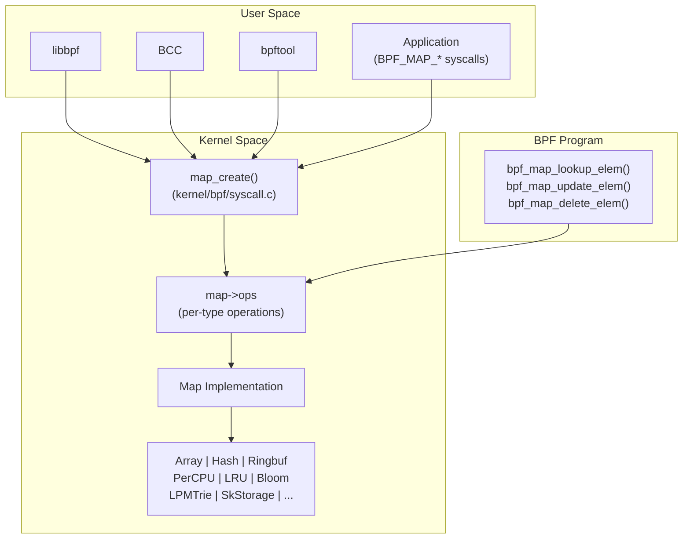
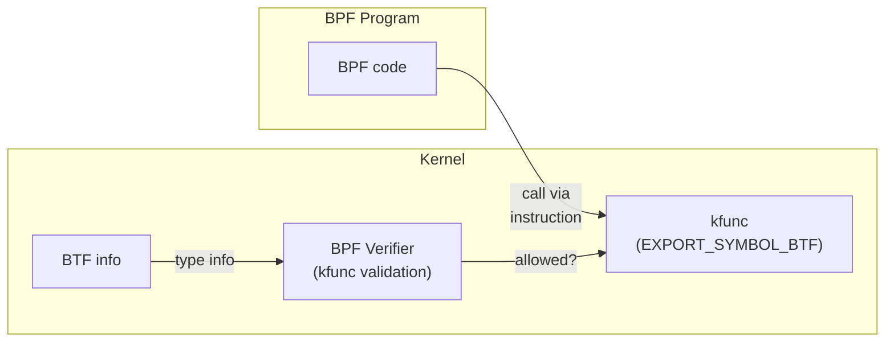
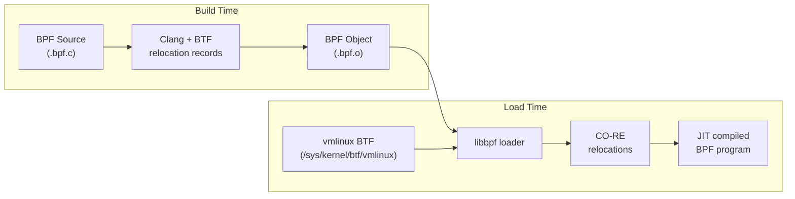

# BPF Maps and Helpers Deep Dive

## Introduction

BPF maps are the primary data structures and communication mechanism in eBPF programs.
They serve as key-value stores accessible from BPF programs, userspace, and even other
BPF programs. BPF helpers are kernel-provided functions that BPF programs can call to
interact with the kernel, manipulate maps, and perform complex operations.

This page provides a comprehensive reference of map types, helper functions, kfuncs
(kernel functions), and CO-RE (Compile Once – Run Everywhere) relocations — the
building blocks that make eBPF programs powerful and portable.

## Map Architecture



## Map Types Reference

### Hash Maps

Hash maps are the most commonly used map type. They provide O(1) average-case
lookup, insert, and delete operations.

```c
// Basic hash map definition
struct {
    __uint(type, BPF_MAP_TYPE_HASH);
    __uint(max_entries, 10240);
    __type(key, __u32);       // PID
    __type(value, __u64);     // timestamp
    __uint(pinning, LIBBPF_PIN_BY_NAME);
} start SEC(".maps");

// Usage in BPF program
SEC("kprobe/do_nanosleep")
int trace_nanosleep(struct pt_regs *ctx) {
    __u32 pid = bpf_get_current_pid_tgid() >> 32;
    __u64 ts = bpf_ktime_get_ns();
    bpf_map_update_elem(&start, &pid, &ts, BPF_ANY);
    return 0;
}
```

**Hash map variants:**

| Type | Description | Use Case |
|------|-------------|----------|
| `BPF_MAP_TYPE_HASH` | Standard hash map | General key-value storage |
| `BPF_MAP_TYPE_PERCPU_HASH` | Per-CPU hash map | High-throughput, no contention |
| `BPF_MAP_TYPE_LRU_HASH` | LRU-evicting hash map | Bounded memory, auto-eviction |
| `BPF_MAP_TYPE_LRU_PERCPU_HASH` | Per-CPU LRU hash | Bounded + per-CPU |
| `BPF_MAP_TYPE_HASH_OF_MAPS` | Map-in-map (hash) | Nested maps for hierarchical data |

### Array Maps

Arrays provide O(1) indexed access. The key is always a `__u32` index.

```c
// Histogram array for latency distribution
struct {
    __uint(type, BPF_MAP_TYPE_ARRAY);
    __uint(max_entries, 64);  // 64 buckets
    __type(key, __u32);
    __type(value, __u64);     // count
} latency_hist SEC(".maps");

// Per-CPU array — no lock contention
struct {
    __uint(type, BPF_MAP_TYPE_PERCPU_ARRAY);
    __uint(max_entries, 256);
    __type(key, __u32);
    __type(value, struct cpu_stats);
} percpu_stats SEC(".maps");
```

| Type | Description | Use Case |
|------|-------------|----------|
| `BPF_MAP_TYPE_ARRAY` | Fixed-size array | Counters, histograms, config |
| `BPF_MAP_TYPE_PERCPU_ARRAY` | Per-CPU array | High-perf counters, stats |
| `BPF_MAP_TYPE_ARRAY_OF_MAPS` | Map-in-map (array) | Program arrays for tail calls |

### Ring Buffer

The ring buffer is the preferred mechanism for streaming events from BPF to userspace.
It replaces the older `PERF_EVENT_ARRAY` with better performance and usability.

```c
struct event {
    __u32 pid;
    __u32 tid;
    char comm[16];
    char filename[256];
};

struct {
    __uint(type, BPF_MAP_TYPE_RINGBUF);
    __uint(max_entries, 256 * 1024);  // 256 KB
} events SEC(".maps");

SEC("tracepoint/syscalls/sys_enter_openat")
int trace_open(struct trace_event_raw_sys_enter *ctx) {
    struct event *e;
    
    // Reserve space in the ring buffer
    e = bpf_ringbuf_reserve(&events, sizeof(*e), 0);
    if (!e)
        return 0;
    
    e->pid = bpf_get_current_pid_tgid() >> 32;
    e->tid = bpf_get_current_pid_tgid();
    bpf_get_current_comm(&e->comm, sizeof(e->comm));
    
    // Read filename from syscall args
    const char *filename = (const char *)ctx->args[1];
    bpf_probe_read_user_str(&e->filename, sizeof(e->filename), filename);
    
    // Submit to userspace
    bpf_ringbuf_submit(e, 0);
    return 0;
}
```

**Ring buffer advantages over perf buffer:**
- Multi-producer, single-consumer (MPSC) without per-CPU overhead
- Variable-size records (no wasted space)
- Built-in reservation/commit API
- Automatic memory management
- Better performance under high event rates

### Specialized Map Types

#### LPM Trie (Longest Prefix Match)

Used for IP address matching and routing decisions:

```c
struct {
    __uint(type, BPF_MAP_TYPE_LPM_TRIE);
    __uint(max_entries, 10000);
    __type(key, struct bpf_lpm_trie_key);  // prefix + data
    __type(value, struct route_info);
    __uint(map_flags, BPF_F_NO_PREALLOC);
} route_table SEC(".maps");

struct lpm_key {
    struct bpf_lpm_trie_key prefix;
    __u32 addr;
};
```

#### Bloom Filter

Probabilistic set membership testing:

```c
struct {
    __uint(type, BPF_MAP_TYPE_BLOOM_FILTER);
    __uint(max_entries, 100000);
    __type(key, __u32);   // ignored, but required by libbpf
    __type(value, __u32);
    __uint(map_flags, BPF_F_NO_PREALLOC);
} bloom SEC(".maps");

// Check membership
SEC("xdp")
int xdp_filter(struct xdp_md *ctx) {
    __u32 ip = /* extract IP */;
    if (bpf_map_peek_elem(&bloom, &ip) == 0)
        return XDP_PASS;  // possibly in set
    return XDP_DROP;      // definitely not in set
}
```

#### Socket-Local Storage

Per-socket storage attached to socket objects:

```c
struct sock_storage {
    __u64 first_seen;
    __u64 bytes_sent;
    __u32 flags;
};

struct {
    __uint(type, BPF_MAP_TYPE_SK_STORAGE);
    __uint(max_entries, 0);  // max_entries must be 0
    __type(value, struct sock_storage);
    __uint(map_flags, BPF_F_NO_PREALLOC);
} socket_storage SEC(".maps");
```

#### Task Storage

Per-task (per-process/thread) storage:

```c
struct task_info {
    __u64 start_time;
    __u32 syscall_count;
};

struct {
    __uint(type, BPF_MAP_TYPE_TASK_STORAGE);
    __uint(max_entries, 0);
    __type(value, struct task_info);
    __uint(map_flags, BPF_F_NO_PREALLOC);
} task_store SEC(".maps");

// Usage
struct task_struct *task = (struct task_struct *)bpf_get_current_task();
struct task_info *info = bpf_task_storage_get(&task_store, task, 0, BPF_LOCAL_STORAGE_GET_F_CREATE);
```

#### CPUMAP and Devmap

Used with XDP for multi-queue and program chaining:

```c
// Redirect packets to specific CPU for processing
struct {
    __uint(type, BPF_MAP_TYPE_CPUMAP);
    __uint(max_entries, 64);
    __type(key, __u32);
    __type(value, struct bpf_cpumap_val);
} cpu_map SEC(".maps");

// Redirect to another XDP program
struct {
    __uint(type, BPF_MAP_TYPE_DEVMAP);
    __uint(max_entries, 64);
    __type(key, __u32);
    __type(value, struct bpf_devmap_val);
} dev_map SEC(".maps");
```

### Complete Map Type Reference

| Map Type | Key | Value | Concurrency | Use Case |
|----------|-----|-------|-------------|----------|
| `HASH` | Any | Any | RCU | General lookup |
| `ARRAY` | u32 | Any | Lock-free reads | Counters, config |
| `PERCPU_HASH` | Any | Per-CPU | Per-CPU | High-perf counters |
| `PERCPU_ARRAY` | u32 | Per-CPU | Per-CPU | Per-CPU stats |
| `LRU_HASH` | Any | Any | RCU | Auto-evicting cache |
| `LPM_TRIE` | Prefix | Any | RCU | IP matching |
| `STACK_TRACE` | u32 | Stack | Lock-free | Stack traces |
| `RINGBUF` | N/A | Any | MPSC | Event streaming |
| `BLOOM_FILTER` | N/A | value | Lock-free | Membership test |
| `SK_STORAGE` | N/A | Any | Per-socket | Socket state |
| `TASK_STORAGE` | N/A | Any | Per-task | Task state |
| `CGROUP_STORAGE` | N/A | Any | Per-cgroup | Cgroup stats |
| `HASH_OF_MAPS` | Any | Map FD | RCU | Nested maps |
| `ARRAY_OF_MAPS` | u32 | Map FD | RCU | Program arrays |

## BPF Helper Functions

### Map Operations

```c
// Lookup — returns pointer to value or NULL
void *bpf_map_lookup_elem(struct bpf_map *map, const void *key);

// Update — insert or update entry
long bpf_map_update_elem(struct bpf_map *map, const void *key,
                         const void *value, __u64 flags);
// Flags: BPF_ANY, BPF_NOEXIST, BPF_EXIST

// Delete — remove entry
long bpf_map_delete_elem(struct bpf_map *map, const void *key);

// Iterate — for_each_map_elem (callback-based)
long bpf_for_each_map_elem(struct bpf_map *map,
                           void *callback_fn, void *callback_ctx, __u64 flags);

// Lookup and delete atomically
void *bpf_map_lookup_and_delete_elem(struct bpf_map *map, const void *key);

// Peek/pop for queue/stack maps
long bpf_map_peek_elem(struct bpf_map *map, void *value);
long bpf_map_pop_elem(struct bpf_map *map, void *value);
long bpf_map_push_elem(struct bpf_map *map, const void *value, __u64 flags);
```

### Ring Buffer Operations

```c
// Reserve space in ring buffer (returns pointer or NULL)
void *bpf_ringbuf_reserve(struct bpf_map *map, __u64 size, __u64 flags);

// Submit reserved space (data becomes visible to consumer)
void bpf_ringbuf_submit(void *data, __u64 flags);

// Discard reserved space (cancel)
void bpf_ringbuf_discard(void *data, __u64 flags);

// Output data without reservation (copies)
long bpf_ringbuf_output(struct bpf_map *map, const void *data,
                        __u64 size, __u64 flags);

// Query ring buffer state
long bpf_ringbuf_query(struct bpf_map *map, __u64 flags);
// flags: BPF_RB_AVAIL_DATA, BPF_RB_RING_SIZE, BPF_RB_CONS_POS, BPF_RB_PROD_POS

// Drain callback
long bpf_ringbuf_drain(struct bpf_map *map, void *callback_fn,
                       void *callback_ctx, __u64 flags);
```

### Context and Task Information

```c
// Current process context
__u64 bpf_get_current_pid_tgid(void);   // tgid<<32 | pid
__u64 bpf_get_current_uid_gid(void);    // gid<<32 | uid
long bpf_get_current_comm(void *buf, __u32 size);
__u64 bpf_get_current_cgroup_id(void);
long bpf_get_current_task(void);         // struct task_struct *
__u64 bpf_get_current_task_btf(void);

// Task helpers (require BTF)
long bpf_task_pt_regs(struct task_struct *task);
long bpf_task_stack_depth(struct task_struct *task, __u32 depth);
long bpf_task_storage_get(struct bpf_map *map, struct task_struct *task,
                          void *value, __u64 flags);
long bpf_task_storage_delete(struct bpf_map *map, struct task_struct *task);

// Socket context
struct bpf_sock *bpf_sk_lookup_tcp(void *ctx, ...);
struct bpf_sock *bpf_sk_lookup_udp(void *ctx, ...);
```

### Time Helpers

```c
__u64 bpf_ktime_get_ns(void);        // monotonic clock (nanoseconds)
__u64 bpf_ktime_get_boot_ns(void);   // boot clock (includes suspend)
long bpf_ktime_get_coarse_ns(void);  // coarse-grained (lower overhead)
__u64 bpf_jiffies64(void);           // jiffies (kernel internal)
```

### Probe Read Helpers

```c
// Read from kernel memory (safe — no crash on bad pointer)
long bpf_probe_read(void *dst, __u32 size, const void *src);

// Read string from kernel memory
long bpf_probe_read_str(void *dst, __u32 size, const void *unsafe_ptr);

// Read from user memory
long bpf_probe_read_user(void *dst, __u32 size, const void *unsafe_ptr);
long bpf_probe_read_user_str(void *dst, __u32 size, const void *unsafe_ptr);

// Write to user memory (only from specific program types)
long bpf_probe_write_user(void *dst, const void *src, __u32 size);

// Kernel string helpers (readable from BTF)
long bpf_strncmp(const char *s1, __u32 s1_size, const char *s2);
```

### Networking Helpers

```c
// Packet data access
void *bpf_skb_load_bytes(const void *skb, __u32 offset, void *to, __u32 len);
void *bpf_xdp_load_bytes(struct xdp_md *xdp, __u32 offset, void *buf, __u32 len);

// Packet manipulation
long bpf_skb_store_bytes(struct sk_buff *skb, __u32 offset,
                         const void *from, __u32 len, __u64 flags);
long bpf_skb_adjust_room(struct sk_buff *skb, __s32 len_diff,
                         __u32 mode, __u64 flags);

// Checksum recalculation
long bpf_l3_csum_replace(struct sk_buff *skb, __u32 offset,
                         __u64 from, __u64 to, __u64 size);
long bpf_l4_csum_replace(struct sk_buff *skb, __u32 offset,
                         __u64 from, __u64 to, __u64 flags);

// Tunnel encapsulation/decapsulation
long bpf_skb_set_tunnel_key(struct sk_buff *skb, ...);
long bpf_skb_get_tunnel_key(struct sk_buff *skb, ...);

// VLAN manipulation
long bpf_skb_vlan_push(struct sk_buff *skb, __be16 vlan_proto, __u16 vlan_tci);
long bpf_skb_vlan_pop(struct sk_buff *skb);

// Redirect
long bpf_redirect(__u32 ifindex, __u64 flags);
long bpf_redirect_map(struct bpf_map *map, __u32 key, __u64 flags);

// Tail calls
long bpf_tail_call(void *ctx, struct bpf_map *prog_array_map, __u32 index);

// Socket operations
long bpf_sk_fullsock(struct sock *sk);
long bpf_sk_release(struct sock *sk);
long bpf_msg_redirect_hash(struct sk_msg *msg, ...);
long bpf_sock_map_update(struct sk_msg *msg, ...);
```

### Printing and Debugging

```c
// BPF trace printk (appears in trace_pipe / trace output)
long bpf_trace_printk(const char *fmt, __u32 fmt_size, ...);

// BTF-aware format string
long bpf_snprintf(char *str, __u32 str_size, const char *fmt,
                  const __u64 *data, __u32 data_len);

// seq_printf (for BPF iterator programs)
long bpf_seq_printf(struct seq_file *m, const char *fmt,
                    __u32 fmt_size, const void *data, __u32 data_len);

// Tracepoint helper
long bpf_trace_vprintk(const char *fmt, __u32 fmt_size,
                       const void *data, __u32 data_len);
```

### Helper Function Table Summary

| Category | Helpers | Notes |
|----------|---------|-------|
| Map ops | `lookup`, `update`, `delete`, `for_each`, `push/pop/peek` | Core data operations |
| Ring buffer | `reserve`, `submit`, `discard`, `output`, `query`, `drain` | Event streaming |
| Context | `get_current_pid_tgid`, `get_current_comm`, `get_current_task_btf` | Process info |
| Time | `ktime_get_ns`, `ktime_get_boot_ns`, `ktime_get_coarse_ns` | Timestamps |
| Probe read | `probe_read`, `probe_read_user`, `probe_read_str`, `probe_write_user` | Memory access |
| Network | `skb_load_bytes`, `redirect`, `tail_call`, `l3/l4_csum_replace` | Packet handling |
| Print | `trace_printk`, `snprintf`, `seq_printf`, `trace_vprintk` | Debug output |

## kfuncs (Kernel Functions)

### What Are kfuncs?

kfuncs are kernel functions exported for use by BPF programs. Unlike helpers (which
are part of the stable BPF ABI), kfuncs are tied to specific kernel versions and
provide access to kernel internals without committing to a stable interface.

kfuncs are the modern way to extend BPF capabilities and are preferred over adding
new helpers for new functionality.



### Registering kfuncs

Kernel developers register kfuncs using `BTF_KFUNCS_START` / `BTF_KFUNCS_END` macros:

```c
// In kernel source
BTF_KFUNCS_START(bpf_task_kfunc_ids)
BTF_ID_FLAGS(func, bpf_task_acquire, KF_ACQUIRE)
BTF_ID_FLAGS(func, bpf_task_release, KF_RELEASE)
BTF_ID_FLAGS(func, bpf_task_from_pid, KF_ACQUIRE)
BTF_KFUNCS_END(bpf_task_kfunc_ids)
```

### Common kfunc Categories

#### Task and Process kfuncs

```c
// Acquire/release references to task_struct
struct task_struct *bpf_task_acquire(struct task_struct *p);
void bpf_task_release(struct task_struct *p);
struct task_struct *bpf_task_from_pid(__u32 pid);

// Task iteration
struct task_struct *bpf_task_get_next(struct task_struct *task);

// Current task (BTF-aware)
struct task_struct *bpf_get_current_task_btf(void);
```

#### Cgroup kfuncs

```c
// Cgroup manipulation
struct cgroup *bpf_cgroup_acquire(struct cgroup *cgrp);
void bpf_cgroup_release(struct cgroup *cgrp);
struct cgroup *bpf_cgroup_from_id(__u64 cgid);

// Cgroup hierarchy walking
struct cgroup *bpf_cgroup_parent(struct cgroup *cgrp);
```

#### Socket and Networking kfuncs

```c
// Socket manipulation
struct sock *bpf_skc_lookup_tcp(void *ctx, ...);
void bpf_sk_release(struct sock *sk);
struct sock *bpf_sk_fullsock(struct sock *sk);

// TCP-specific
void bpf_tcp_sock(struct sock *sk);
__u32 bpf_tcp_gen_syncookie(struct sock *sk, ...);

// XDP and TC
struct bpf_dynptr *bpf_dynptr_from_xdp(struct xdp_md *xdp, __u64 flags);
```

#### Crypto and Hashing kfuncs

```c
// Crypto operations
struct bpf_crypto_ctx *bpf_crypto_ctx_create(...);
long bpf_crypto_encrypt(struct bpf_crypto_ctx *ctx, ...);
long bpf_crypto_decrypt(struct bpf_crypto_ctx *ctx, ...);

// Hashing
long bpf_hash_init(struct bpf_hash_ctx *ctx, ...);
long bpf_hash_update(struct bpf_hash_ctx *ctx, ...);
long bpf_hash_final(struct bpf_hash_ctx *ctx, ...);
```

#### Iterator kfuncs

```c
// BPF iterator support
struct bpf_iter_meta *bpf_iter_meta_create(...);
long bpf_iter_destroy(struct bpf_iter_meta *meta);

// Map iteration via kfuncs
struct bpf_map *bpf_map__get_next(struct bpf_map *map);
```

### kfunc Flags

| Flag | Meaning | Description |
|------|---------|-------------|
| `KF_ACQUIRE` | Returns owned reference | Caller must release |
| `KF_RELEASE` | Consumes reference | Releases acquired reference |
| `KF_RCU` | RCU-protected access | Must hold RCU read lock |
| `KF_SLEEPABLE` | May sleep | Requires sleepable BPF prog |
| `KF_DESTRUCTIVE` | Destructive action | Restricted to privileged progs |
| `KF_FASTCALL` | Fast call path | Optimized invocation |

### Using kfuncs in BPF Programs

```c
// Include vmlinux.h for BTF definitions
#include "vmlinux.h"

// Declare kfunc (libbpf resolves via BTF)
extern struct task_struct *bpf_task_acquire(struct task_struct *p) __ksym;
extern void bpf_task_release(struct task_struct *p) __ksym;
extern struct task_struct *bpf_task_from_pid(__u32 pid) __ksym;

SEC("fentry/do_exit")
int BPF_PROG(trace_exit, struct task_struct *task) {
    struct task_struct *parent;
    
    // Acquire reference to parent
    parent = bpf_task_acquire(task->real_parent);
    if (!parent)
        return 0;
    
    // Use parent...
    __u32 ppid = parent->tgid;
    
    // Release when done
    bpf_task_release(parent);
    return 0;
}
```

## CO-RE (Compile Once – Run Everywhere)

### The Problem CO-RE Solves

BPF programs access kernel data structures, but struct layouts vary between kernel
versions (fields added, removed, reordered, renamed). CO-RE uses BTF (BPF Type
Format) information to adjust field accesses at load time, making programs portable.



### CO-RE Relocation Types

#### Direct Field Access

```c
// In BPF source
struct task_struct *task = (struct task_struct *)bpf_get_current_task();
__u32 pid = task->tgid;  // CO-RE relocates this offset

// What libbpf generates at load time:
// 1. Find struct task_struct in vmlinux BTF
// 2. Find field 'tgid' offset
// 3. Patch the BPF instruction with the correct offset
```

#### Field Existence Check

```c
// Check if field exists (graceful handling of kernel changes)
struct task_struct *task = (struct task_struct *)bpf_get_current_task();

if (bpf_core_field_exists(task->some_new_field)) {
    // Use the field
    __u64 val = BPF_CORE_READ(task, some_new_field);
} else {
    // Fallback for older kernels
}
```

#### Field Size Check

```c
// Check field size (e.g., changed from 32-bit to 64-bit)
if (bpf_core_field_size(task->pid_namespace) == 8) {
    // 64-bit version
} else {
    // 32-bit version
}
```

#### Type Relocation

```c
// Check if a type exists
if (bpf_core_type_exists(struct bpf_iter_meta)) {
    // Iterator support available
}

// Check type size
int sz = bpf_core_type_size(struct tcp_sock);

// Check enum value
int val = bpf_core_enum_value(TCP_ESTABLISHED);
```

### CO-RE Access Macros

```c
#include <bpf/bpf_helpers.h>
#include <bpf/bpf_core_read.h>

struct task_struct *task = (struct task_struct *)bpf_get_current_task();

// BPF_CORE_READ — safe field reading with relocation
__u32 ppid = BPF_CORE_READ(task, real_parent, tgid);

// BPF_CORE_READ_INNER — for nested access
__u32 ns_pid = BPF_CORE_READ_INNER(task, thread_pid, numbers[0].nr);

// bpf_core_read — low-level read with relocation
struct task_struct *parent;
bpf_core_read(&parent, sizeof(parent), &task->real_parent);

// bpf_core_read_str — string read with relocation
char comm[16];
bpf_core_read_str(comm, sizeof(comm), task->comm);
```

### CO-RE Relocation Records

The compiler emits relocation records that libbpf processes at load time:

```bash
# View relocation records in a BPF object
bpftool btf dump file my_program.bpf.o format raw | grep relo

# Or with llvm-readelf
llvm-readelf -r my_program.bpf.o
# Relocation section '.reltp_btf/tcp_connect':
#   Offset           Type                    Sym. Name
#   0000000000000048 R_BPF_64_64            task_struct:1384:0
```

### CO-RE Patterns

#### Version-Specific Code

```c
// Use struct flavor for different kernel versions
struct task_struct___old {
    int __padding;
    volatile long state;
    // old layout
} __attribute__((preserve_access_index));

struct task_struct___new {
    unsigned int __state;  // renamed in 5.14+
    // new layout
} __attribute__((preserve_access_index));

SEC("fentry/do_exit")
int BPF_PROG(trace_exit, void *ctx) {
    struct task_struct *task = (struct task_struct *)bpf_get_current_task();
    
    if (bpf_core_field_exists(((struct task_struct___new *)0)->__state)) {
        // Kernel 5.14+ (unsigned int __state)
        __u32 state = BPF_CORE_READ((struct task_struct___new *)task, __state);
    } else {
        // Older kernel (volatile long state)
        long state = BPF_CORE_READ((struct task_struct___old *)task, state);
    }
    return 0;
}
```

#### Enum Value Relocation

```c
// Enum values can change between kernels
enum bpf_core_relo_kind {
    BPF_CORE_FIELD_BYTE_OFFSET = 1,
    BPF_CORE_FIELD_BYTE_SIZE = 2,
    // ...
};

// Use bpf_core_enum_value for portable enum access
int kind = bpf_core_enum_value(enum bpf_core_relo_kind, BPF_CORE_FIELD_BYTE_OFFSET);
```

#### Struct Size Relocation

```c
// Handle struct size changes gracefully
struct net_device___v1 {
    char name[16];
    // v1 layout
} __attribute__((preserve_access_index));

struct net_device___v2 {
    char name[16];
    // additional fields
    struct net_device_stats stats;
} __attribute__((preserve_access_index));
```

## BPF CO-RE and BTF Requirements

```bash
# Check if kernel has BTF
ls -la /sys/kernel/btf/vmlinux
# -r--r--r-- 1 root root 3854261 Jul 22 10:00 /sys/kernel/btf/vmlinux

# Check BTF availability
bpftool feature probe kernel | grep btf
# btf: yes
# btf_basic: yes
# btf_func: yes
# btf_decl_tag: yes
# btf_type_tag: yes

# Generate vmlinux.h from BTF
bpftool btf dump file /sys/kernel/btf/vmlinux format c > vmlinux.h

# Or with CO-RE support
bpftool btf dump file /sys/kernel/btf/vmlinux format c --skip_encoding_btf_decl_tag > vmlinux.h
```

## Practical Examples

### Example: Process Lifecycle Tracker with CO-RE

```c
// process-tracker.bpf.c
#include "vmlinux.h"
#include <bpf/bpf_helpers.h>
#include <bpf/bpf_core_read.h>

struct event {
    __u32 pid;
    __u32 ppid;
    __u64 timestamp;
    char comm[16];
    char parent_comm[16];
    __u8 type;  // 0=fork, 1=exit
};

struct {
    __uint(type, BPF_MAP_TYPE_RINGBUF);
    __uint(max_entries, 256 * 1024);
} events SEC(".maps");

SEC("tp_btf/sched_process_fork")
int handle_fork(struct trace_event_raw_sched_process_fork *ctx) {
    struct event *e;
    struct task_struct *parent, *child;
    
    e = bpf_ringbuf_reserve(&events, sizeof(*e), 0);
    if (!e)
        return 0;
    
    parent = (struct task_struct *)ctx->parent;
    child = (struct task_struct *)ctx->child;
    
    e->pid = BPF_CORE_READ(child, tgid);
    e->ppid = BPF_CORE_READ(parent, tgid);
    e->timestamp = bpf_ktime_get_ns();
    e->type = 0;  // fork
    
    BPF_CORE_READ_STR_INTO(&e->comm, child, comm);
    BPF_CORE_READ_STR_INTO(&e->parent_comm, parent, comm);
    
    bpf_ringbuf_submit(e, 0);
    return 0;
}

SEC("tp_btf/sched_process_exit")
int handle_exit(struct trace_event_raw_sched_process_template *ctx) {
    struct event *e;
    struct task_struct *task;
    
    e = bpf_ringbuf_reserve(&events, sizeof(*e), 0);
    if (!e)
        return 0;
    
    task = (struct task_struct *)ctx->pid;
    
    e->pid = BPF_CORE_READ(task, tgid);
    e->ppid = BPF_CORE_READ(task, real_parent, tgid);
    e->timestamp = bpf_ktime_get_ns();
    e->type = 1;  // exit
    
    BPF_CORE_READ_STR_INTO(&e->comm, task, comm);
    BPF_CORE_READ_STR_INTO(&e->parent_comm, task, real_parent, comm);
    
    bpf_ringbuf_submit(e, 0);
    return 0;
}

char LICENSE[] SEC("license") = "GPL";
```

### Example: Latency Histogram with Per-CPU Arrays

```c
// latency-hist.bpf.c
#include "vmlinux.h"
#include <bpf/bpf_helpers.h>

#define MAX_SLOTS 64

struct {
    __uint(type, BPF_MAP_TYPE_PERCPU_ARRAY);
    __uint(max_entries, MAX_SLOTS);
    __type(key, __u32);
    __type(value, __u64);
} latency_hist SEC(".maps");

struct {
    __uint(type, BPF_MAP_TYPE_HASH);
    __uint(max_entries, 10240);
    __type(key, __u32);       // PID
    __type(value, __u64);     // start timestamp
} start_ts SEC(".maps");

static __always_inline __u32 log2l(__u64 v) {
    __u32 r = 0;
    for (int i = 32; i > 0; i >>= 1) {
        if (v >= (1ULL << i)) {
            v >>= i;
            r += i;
        }
    }
    return r;
}

SEC("kprobe/blk_account_io_start")
int trace_start(struct pt_regs *ctx) {
    __u32 pid = bpf_get_current_pid_tgid() >> 32;
    __u64 ts = bpf_ktime_get_ns();
    bpf_map_update_elem(&start_ts, &pid, &ts, BPF_ANY);
    return 0;
}

SEC("kprobe/blk_account_io_done")
int trace_done(struct pt_regs *ctx) {
    __u32 pid = bpf_get_current_pid_tgid() >> 32;
    __u64 *tsp = bpf_map_lookup_elem(&start_ts, &pid);
    if (!tsp)
        return 0;
    
    __u64 delta = bpf_ktime_get_ns() - *tsp;
    bpf_map_delete_elem(&start_ts, &pid);
    
    // Convert to microseconds and compute log2
    __u32 slot = log2l(delta / 1000);
    if (slot >= MAX_SLOTS)
        slot = MAX_SLOTS - 1;
    
    __u64 *count = bpf_map_lookup_elem(&latency_hist, &slot);
    if (count)
        __sync_fetch_and_add(count, 1);
    
    return 0;
}

char LICENSE[] SEC("license") = "GPL";
```

## Map Performance Characteristics

| Map Type | Lookup | Insert | Delete | Memory | Contention |
|----------|--------|--------|--------|--------|------------|
| `HASH` | O(1) avg | O(1) avg | O(1) avg | Dynamic | RCU read, spin write |
| `ARRAY` | O(1) | O(1) | N/A | Fixed | Lock-free |
| `PERCPU_HASH` | O(1) avg | O(1) avg | O(1) avg | Dynamic×CPUs | None (per-CPU) |
| `PERCPU_ARRAY` | O(1) | O(1) | N/A | Fixed×CPUs | None (per-CPU) |
| `LRU_HASH` | O(1) avg | O(1) avg | O(1) avg | Bounded | RCU read, spin write |
| `LPM_TRIE` | O(prefix) | O(prefix) | O(prefix) | Dynamic | RCU read, spin write |
| `RINGBUF` | O(1) append | O(1) reserve | N/A | Fixed | Lock-free MPSC |
| `BLOOM_FILTER` | O(1) | O(1) | N/A | Fixed | Lock-free |

## bpftool Map Inspection

```bash
# List all maps
bpftool map list

# Show map details
bpftool map show id 123
# 123: hash  name start  flags 0x0
#     key 4B  value 8B  max_entries 10240  memlock 983040B

# Dump all entries
bpftool map dump id 123

# Get specific entry
bpftool map lookup id 123 key 0x01 0x00 0x00 0x00

# Update entry
bpftool map update id 123 key 0x01 0x00 0x00 0x00 value 0x00 0x00 0x00 0x00

# Show pinned maps
bpftool map list pinned /sys/fs/bpf/

# Freeze map (make read-only)
bpftool map freeze id 123

# Show map memory usage
bpftool map show id 123 | grep memlock
```

## Summary

| Feature | Description | Key Use |
|---------|-------------|---------|
| Hash Maps | Key-value with O(1) lookup | PID tracking, caching |
| Arrays | Fixed indexed storage | Histograms, counters, config |
| Ring Buffer | MPSC event streaming | Event output to userspace |
| BPF Helpers | Kernel-provided functions | Map ops, time, probe read |
| kfuncs | BTF-exported kernel functions | Task, cgroup, socket manipulation |
| CO-RE | BTF-based relocations | Portable BPF programs |
| Specialized Maps | LPM, Bloom, SkStorage, TaskStorage | Domain-specific data structures |

BPF maps and helpers form the data plane of eBPF programs. Understanding map types
for choosing the right data structure, helpers for kernel interaction, kfuncs for
extended capabilities, and CO-RE for portability is essential for writing effective
BPF programs.
