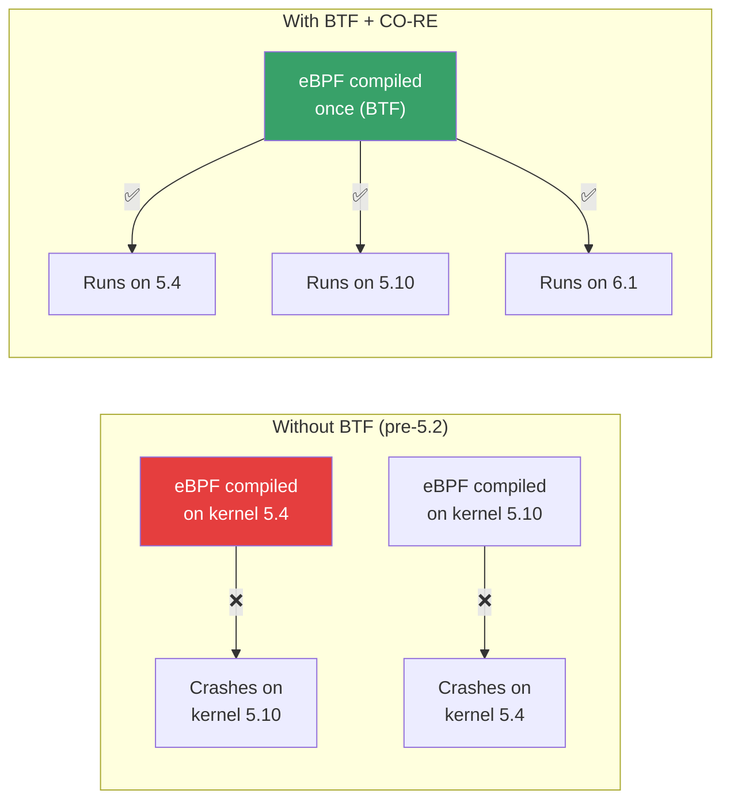
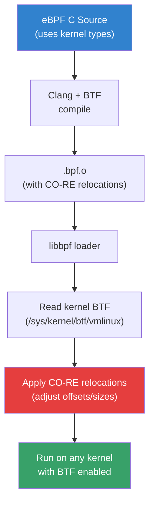

# BPF Type Format (BTF)

## Introduction

BPF Type Format (BTF) is a compact, kernel-embedded metadata format that describes C data structures, functions, and types used by eBPF programs. Introduced in Linux 5.2 (2019), BTF is the foundation of **CO-RE** (Compile Once — Run Everywhere), which allows eBPF programs to run across different kernel versions without recompilation.

Key properties:
- **Compact encoding** — minimal overhead for type information
- **Kernel-embedded** — `/sys/kernel/btf/vmlinux` contains all kernel type info
- **CO-RE support** — enables portable eBPF programs
- **Lightweight** — typically 1-3 MB for full kernel type info
- **Self-describing** — BTF describes its own format

## Why BTF Matters

Before BTF, eBPF programs had to be compiled against specific kernel headers, making them version-dependent:



## BTF Data Format

### BTF Kinds

BTF encodes type information as a sequence of type records:

| Kind | ID | Description |
|------|----|-------------|
| `BTF_KIND_UNKN` | 0 | Unknown/void |
| `BTF_KIND_INT` | 1 | Integer types |
| `BTF_KIND_PTR` | 2 | Pointer types |
| `BTF_KIND_ARRAY` | 3 | Array types |
| `BTF_KIND_STRUCT` | 4 | Structures |
| `BTF_KIND_UNION` | 5 | Unions |
| `BTF_KIND_ENUM` | 6 | Enumerations |
| `BTF_KIND_FWD` | 7 | Forward declarations |
| `BTF_KIND_TYPEDEF` | 8 | Type aliases |
| `BTF_KIND_VOLATILE` | 9 | Volatile qualifier |
| `BTF_KIND_CONST` | 10 | Const qualifier |
| `BTF_KIND_RESTRICT` | 11 | Restrict qualifier |
| `BTF_KIND_FUNC` | 12 | Functions |
| `BTF_KIND_FUNC_PROTO` | 13 | Function prototypes |
| `BTF_KIND_VAR` | 14 | Variables |
| `BTF_KIND_DATASEC` | 15 | Data sections |
| `BTF_KIND_FLOAT` | 16 | Floating point |
| `BTF_KIND_DECL_TAG` | 17 | Declaration tags |
| `BTF_KIND_TYPE_TAG` | 18 | Type tags |

### BTF Header Structure

```
struct btf_header {
    __u16   magic;          /* 0xeB9F (reversed "BPF") */
    __u8    version;        /* BTF version (1) */
    __u8    flags;          /* BTF flags */
    __u32   hdr_len;        /* Header length */
    /* All following are offsets from end of header */
    __u32   type_off;       /* Type section offset */
    __u32   type_len;       /* Type section length */
    __u32   str_off;        /* String section offset */
    __u32   str_len;        /* String section length */
};
```

### Example: BTF Type Encoding

```c
// Original C code:
struct task_struct {
    int pid;
    char comm[16];
    struct list_head tasks;
};

// BTF encoding:
// Type 1: BTF_KIND_INT "int" size=4 encoding=SIGNED
// Type 2: BTF_KIND_ARRAY type=1 nelems=16  → char[16]
// Type 3: BTF_KIND_STRUCT "list_head" size=16 vlen=2
// Type 4: BTF_KIND_STRUCT "task_struct" size=... vlen=3
//   member: "pid"    type=1 offset=0
//   member: "comm"   type=2 offset=32
//   member: "tasks"  type=3 offset=...
```

## Accessing BTF Information

### Kernel BTF

```bash
# Check if kernel has BTF
ls -la /sys/kernel/btf/vmlinux

# Dump kernel BTF as text
bpftool btf dump file /sys/kernel/btf/vmlinux format c > vmlinux.h

# List all types matching a pattern
bpftool btf dump file /sys/kernel/btf/vmlinux | grep "struct task_struct"

# Show type info for a specific struct
bpftool btf dump file /sys/kernel/btf/vmlinux format c | \
    sed -n '/^struct task_struct {/,/^};/p'

# Get BTF size
ls -lh /sys/kernel/btf/vmlinux
```

### BTF for Modules

```bash
# Module BTFs are in /sys/kernel/btf/<module>
ls /sys/kernel/btf/ | head -20

# Dump module BTF
bpftool btf dump file /sys/kernel/btf/nf_conntrack format c

# List all BTF objects
bpftool btf list
```

### Generating vmlinux.h

```bash
# Generate minimal vmlinux.h from kernel BTF
bpftool btf dump file /sys/kernel/btf/vmlinux format c > vmlinux.h

# Check size (typically 1-3 MB)
wc -l vmlinux.h

# Generate for specific types only
bpftool btf dump file /sys/kernel/btf/vmlinux format c | \
    grep -A 50 'struct task_struct {' > task_struct.h
```

## CO-RE: Compile Once — Run Everywhere

### How CO-RE Works



### CO-RE Relocation Types

| Relocation | Description |
|------------|-------------|
| `FIELD_BYTE_OFFSET` | Field offset in struct (handles layout changes) |
| `FIELD_BYTE_SIZE` | Field size (handles type changes) |
| `FIELD_EXISTS` | Check if field exists in target kernel |
| `FIELD_SIGNED` | Whether field is signed |
| `FIELD_LSHIFT_U64` | Left shift for bitfield extraction |
| `FIELD_RSHIFT_U64` | Right shift for bitfield extraction |
| `TYPE_ID_LOCAL` | Local type ID |
| `TYPE_ID_TARGET` | Target kernel type ID |
| `TYPE_EXISTS` | Check if type exists in target kernel |
| `TYPE_SIZE` | Size of type in target kernel |

### CO-RE Example

```c
// my_ebpf.c — Portable eBPF program using CO-RE
#include "vmlinux.h"
#include <bpf/bpf_helpers.h>
#include <bpf/bpf_core_read.h>

// Use CO-RE to read task_struct fields
SEC("tracepoint/sched/sched_process_exec")
int handle_exec(struct trace_event_raw_sched_process_exec *ctx)
{
    struct task_struct *task = (void *)bpf_get_current_task();

    // CO-RE: reads field offset from kernel BTF at load time
    int pid = BPF_CORE_READ(task, pid);

    // CO-RE: check if field exists (handles kernel version differences)
    if (bpf_core_field_exists(task->real_parent)) {
        struct task_struct *parent = BPF_CORE_READ(task, real_parent);
        int ppid = BPF_CORE_READ(parent, pid);
        bpf_printk("exec: pid=%d ppid=%d\n", pid, ppid);
    }

    return 0;
}

char LICENSE[] SEC("license") = "GPL";
```

### Compiling with CO-RE

```bash
# Compile eBPF program with BTF and CO-RE
clang -g -O2 -target bpf \
    -D__TARGET_ARCH_x86 \
    -I/usr/include/bpf \
    -c my_ebpf.c -o my_ebpf.bpf.o

# Verify BTF is embedded
bpftool btf dump file my_ebpf.bpf.o

# Load and attach
sudo bpftool prog load my_ebpf.bpf.o /sys/fs/bpf/my_prog
```

### CO-RE Helper Macros

```c
#include <bpf/bpf_core_read.h>

// Read a field (handles relocation)
BPF_CORE_READ(task, comm);

// Read nested fields
BPF_CORE_READ(task, mm, start_code);

// Read into a local variable (safer for complex types)
struct mm_struct *mm;
bpf_core_read(&mm, sizeof(mm), &task->mm);

// Check if a field exists in the running kernel
if (bpf_core_field_exists(task->signal)) { ... }

// Get the size of a type in the running kernel
int task_size = bpf_core_type_size(struct task_struct);

// Check if a type exists
if (bpf_core_type_exists(struct cgroup_subsys_state)) { ... }

// Read enum value (handles value changes between kernel versions)
int state = BPF_CORE_READ(task, __state);
```

## BTF for Map Definitions

BTF enables **typed BPF maps** with automatic key/value type information:

```c
// Typed BPF map with BTF
struct {
    __uint(type, BPF_MAP_TYPE_HASH);
    __uint(max_entries, 1024);
    __type(key, __u32);        // BTF-infers key type
    __type(value, struct event); // BTF-infers value type
} events SEC(".maps");

// The map automatically has BTF information
// bpftool can dump the map's key/value types
```

```bash
# View map with BTF type info
sudo bpftool map dump id 123

# Output shows typed fields, not just raw bytes
# key: 42
# value: { pid: 1234, comm: "bash", duration_ns: 123456 }
```

## BTF Generation

### From Kernel Config

```bash
# Ensure kernel is compiled with BTF
# CONFIG_DEBUG_INFO_BTF=y

# Rebuild kernel BTF (if missing)
sudo pahole --btf_encode_force -j /usr/lib/debug/boot/vmlinux-$(uname -r)
```

### From Custom Code

```bash
# Generate BTF from C source
clang -g -O2 -target bpf -c my_prog.c -o my_prog.bpf.o
# BTF is automatically embedded by clang with -g

# Extract BTF from compiled object
bpftool btf dump file my_prog.bpf.o

# Generate standalone BTF file
bpftool btf dump file my_prog.bpf.o > my_prog.btf
```

### BTF from Scratch (for userspace)

```c
// Generate BTF programmatically using libbpf
#include <bpf/btf.h>

struct btf *btf = btf__new_empty();
int id;

// Add a struct type
id = btf__add_struct(btf, "my_struct", 16);
btf__add_field(btf, "x", btf__add_int(btf, "int", 4, 0), 0);
btf__add_field(btf, "y", btf__add_int(btf, "int", 4, 0), 32);

// Use BTF for map creation
union bpf_attr attr = {
    .map_type = BPF_MAP_TYPE_HASH,
    .key_size = 4,
    .value_size = 16,
    .max_entries = 1024,
    .btf_fd = btf__fd(btf),
    .btf_key_type_id = btf__add_int(btf, "int", 4, 0),
    .btf_value_type_id = id,
};
int map_fd = bpf(BPF_MAP_CREATE, &attr, sizeof(attr));
```

## bpftool BTF Commands

```bash
# List all BTF objects
bpftool btf list

# Show BTF details
bpftool btf show id 1

# Dump BTF as C header
bpftool btf dump file /sys/kernel/btf/vmlinux format c > vmlinux.h

# Dump BTF as raw
bpftool btf dump file /sys/kernel/btf/vmlinux format raw

# Search for specific type
bpftool btf dump file /sys/kernel/btf/vmlinux | grep -A 10 "struct cred {"

# Pin BTF to bpffs
bpftool btf pin id 1 /sys/fs/btf/my_btf

# Compare BTF between kernel versions
bpftool btf dump file /sys/kernel/btf/vmlinux format c | \
    diff - old_vmlinux.h
```

## BTF and BPF CO-RE in Practice

### Monitoring with libbpf-bootstrap

```bash
# Clone libbpf-bootstrap for examples
git clone https://github.com/libbpf/libbpf-bootstrap
cd libbpf-bootstrap/examples/c

# Build minimal example with CO-RE
make minimal

# Run
sudo ./minimal
```

### CO-RE Example: File Opens Tracer

```c
// file_open.bpf.c
#include "vmlinux.h"
#include <bpf/bpf_helpers.h>
#include <bpf/bpf_tracing.h>
#include <bpf/bpf_core_read.h>

SEC("fentry/do_sys_openat2")
int BPF_PROG(trace_open, int dfd, const char *filename)
{
    char buf[256];
    bpf_probe_read_user_str(buf, sizeof(buf), filename);
    bpf_printk("open: %s\n", buf);
    return 0;
}

char LICENSE[] SEC("license") = "GPL";
```

```bash
# Compile with CO-RE
clang -g -O2 -target bpf -D__TARGET_ARCH_x86 \
    -c file_open.bpf.o -o file_open.bpf.o

# Load and run
sudo bpftool prog load file_open.bpf.o /sys/fs/bpf/file_open

# Read output
sudo cat /sys/kernel/debug/tracing/trace_pipe
```

## BTF for Kernel Debugging

### Examining Kernel Structures

```bash
# Get struct layout (offsets, sizes)
bpftool btf dump file /sys/kernel/btf/vmlinux format c | \
    awk '/^struct task_struct \{/,/^\};/' | head -100

# Check specific field offset
# Useful for debugging eBPF programs that read kernel data
bpftool btf dump file /sys/kernel/btf/vmlinux format c | \
    grep -A 2 "struct task_struct" | grep "pid"

# Get all function prototypes
bpftool btf dump file /sys/kernel/btf/vmlinux | \
    grep "FUNC " | head -20
```

### BTF and pahole

```bash
# pahole shows struct layouts from BTF/DWARF
pahole -C task_struct /sys/kernel/btf/vmlinux

# Show holes/padding in structs
pahole --holes 1 -C task_struct /sys/kernel/btf/vmlinux

# Show all structures sorted by size
pahole --sizes /sys/kernel/btf/vmlinux | sort -k2 -rn | head -20
```

## BTF Overhead and Optimization

### BTF Size

| Component | Typical Size |
|-----------|-------------|
| Kernel vmlinux BTF | 1-3 MB |
| Module BTF (each) | 10-100 KB |
| eBPF program BTF | 1-10 KB |
| BTF for maps | 0.1-1 KB |

### Kernel Configuration

```bash
# Enable BTF in kernel
CONFIG_DEBUG_INFO_BTF=y          # Generate BTF for vmlinux
CONFIG_DEBUG_INFO_BTF_MODULES=y  # Generate BTF for modules

# BTF is generated during kernel build using pahole
# Requires pahole >= 1.16

# Check if running kernel has BTF
[ -f /sys/kernel/btf/vmlinux ] && echo "BTF available" || echo "No BTF"
```

## Troubleshooting

| Symptom | Cause | Solution |
|---------|-------|----------|
| "CO-RE relocations failed" | Missing kernel BTF | Enable `CONFIG_DEBUG_INFO_BTF` |
| "vmlinux.h: no such file" | Not generated | Run `bpftool btf dump file /sys/kernel/btf/vmlinux format c > vmlinux.h` |
| "Field not found" | Struct layout mismatch | Use `BPF_CORE_READ` instead of direct access |
| "BTF ID not found" | Module BTF not loaded | Check `/sys/kernel/btf/<module>` |
| Large vmlinux.h | Includes all types | Keep only needed types |
| "Type not compatible" | CO-RE type mismatch | Use `bpf_core_type_exists()` check |

## Further Reading

- [BPF CO-RE Reference Guide](https://nakryiko.com/posts/bpf-core-reference-guide/)
- [BTF Specification](https://www.kernel.org/doc/html/latest/bpf/btf.html)
- [libbpf CO-RE tutorial](https://nakryiko.com/posts/libbpf-ultimate-guide/)
- [bpftool documentation](https://man7.org/linux/man-pages/man8/bpftool-btf.8.html)
- [LWN: BPF Type Format](https://lwn.net/Articles/781430/)
- [Andrii Nakryiko: BTF and CO-RE](https://nakryiko.com/posts/bpf-portability-and-co-re.html)

## See Also

- [eBPF](./ebpf.md) — eBPF programming model
- [ftrace](./ftrace.md) — kernel function tracing
- [perf](./perf.md) — performance analysis tools
- [Kernel Debugging](./kernel-debugging.md) — debugging techniques
