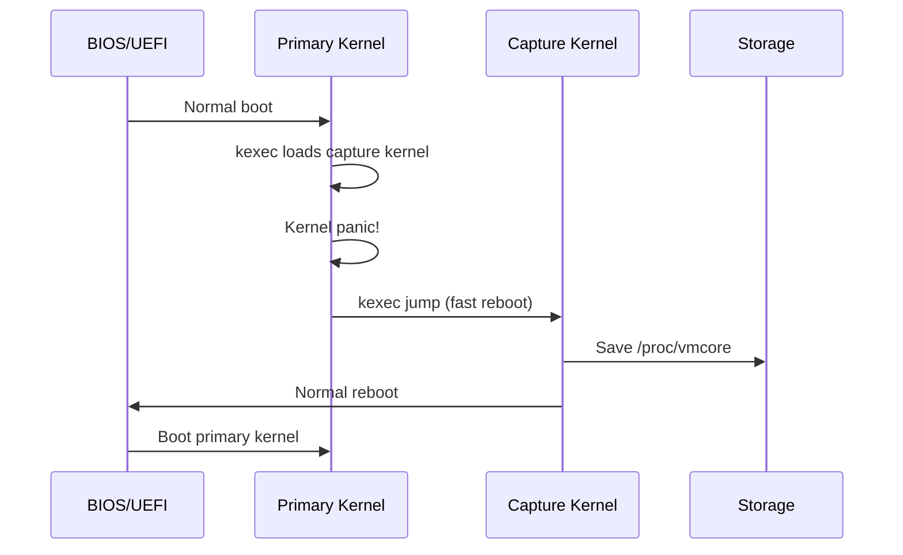
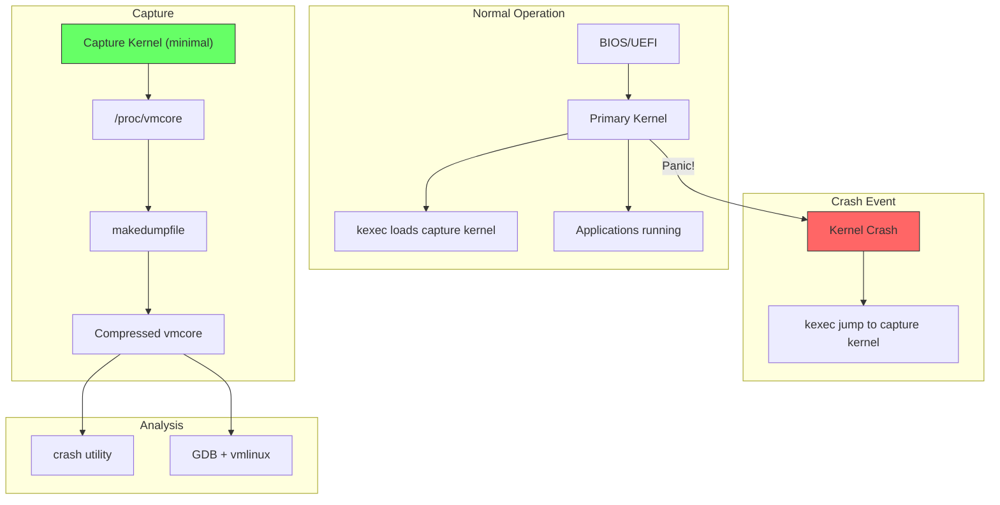

# Crash Dumps

When the Linux kernel panics, a crash dump captures the complete memory state at the moment
of failure. This post-mortem data can be analyzed offline with the `crash` utility to
diagnose kernel bugs, driver issues, and system hangs.

## Introduction

A kernel crash (oops or panic) means the kernel has encountered a fatal error — a null pointer
dereference, a corrupted data structure, or an assertion failure. Unlike userspace crashes
that produce core dumps, kernel crashes can take down the entire system. The kdump mechanism
uses a second kernel (capture kernel) to save the memory image of the crashed kernel before
rebooting.

Components:

- **kdump** — kernel crash dump infrastructure
- **kexec** — fast-boot a second kernel without going through BIOS/UEFI
- **makedumpfile** — compress and filter the crash dump
- **crash** — analyze the captured vmcore (memory image)

## kdump Configuration

### Kernel Configuration

The following kernel config options are required:

```
CONFIG_KEXEC=y                  # kexec system call
CONFIG_KEXEC_FILE=y             # kexec via file descriptors
CONFIG_CRASH_DUMP=y             # Kernel crash dump support
CONFIG_DEBUG_INFO=y             # Debug symbols (for crash analysis)
CONFIG_PROC_VMCORE=y            # /proc/vmcore interface
CONFIG_MEMORY_HOTPLUG=y         # For reservation flexibility
```

### Installation

```bash
# Debian/Ubuntu
sudo apt install kdump-tools crash makedumpfile

# Fedora/RHEL
sudo dnf install kexec-tools crash makedumpfile kernel-debuginfo

# Arch Linux
sudo pacman -S kexec-tools crash
```

### Boot Loader Configuration

Add `crashkernel` parameter to reserve memory for the capture kernel:

```bash
# /etc/default/grub
GRUB_CMDLINE_LINUX_DEFAULT="quiet splash crashkernel=256M"

# Regenerate GRUB config
sudo update-grub

# Or for RHEL/Fedora
sudo grub2-mkconfig -o /boot/grub2/grub.cfg
```

### crashkernel Reservation Sizes

| System RAM   | Recommended `crashkernel` |
|--------------|---------------------------|
| < 4 GB       | 128M                      |
| 4–16 GB      | 256M                      |
| 16–64 GB     | 512M                      |
| 64–128 GB    | 1G                        |
| > 128 GB     | 1G–2G                     |

### kdump Configuration File

```bash
# /etc/default/kdump-tools (Debian/Ubuntu)
USE_KDUMP=1
KDUMP_SYSCTL="kernel.panic_on_oops=1"

# Where to save dumps
KDUMP_COREDIR="/var/crash"

# Compression
KDUMP_COMPRESS="makedumpfile -l -d 31 -z"

# /etc/kdump.conf (RHEL/Fedora)
path /var/crash
core_collector makedumpfile -l --message-level 1 -d 31
ssh user@backup-server
sshkey /root/.ssh/kdump_key
```

### Enabling and Testing kdump

```bash
# Enable kdump service
sudo systemctl enable kdump
sudo systemctl start kdump

# Check status
sudo systemctl status kdump
sudo kdump-config show
# USE_KDUMP:         1
# KDUMP_SYSCTL:      kernel.panic_on_oops=1
# KDUMP_COREDIR:     /var/crash
# crashkernel addr:  0x2e000000
# /var/crash/linux:  link target: /var/crash/202401151030

# Test with a manual crash (DANGEROUS — do on test systems only!)
echo 1 | sudo tee /proc/sys/kernel/sysrq
echo c | sudo tee /proc/sysrq-trigger
# System will crash, kdump will capture vmcore, then reboot
```

## kexec — Fast Kernel Loading

kexec loads a new kernel into memory and boots it without going through the firmware (BIOS/UEFI).
For kdump, it pre-loads the capture kernel so it's ready to boot instantly on crash.

```bash
# Load capture kernel manually (usually handled by kdump service)
sudo kexec -p /boot/vmlinuz-$(uname -r) \
    --initrd=/boot/initrd.img-$(uname -r) \
    --append="root=/dev/sda1 irqpoll maxcpus=1 reset_devices"

# Check loaded capture kernel
sudo kexec -s
```

### kexec Boot Flow



## makedumpfile

makedumpfile compresses and filters crash dumps, removing unnecessary pages (zero pages,
cache pages, free pages) to reduce dump size.

### Compression Levels

| Dump Level (`-d`) | Description                                 |
|-------------------|---------------------------------------------|
| 0                 | No filtering (full dump)                    |
| 1                 | Exclude zero pages                          |
| 2                 | Exclude zero and cache pages                |
| 4                 | Exclude cache, user process data            |
| 8                 | Exclude free pages                          |
| 31                | All of the above (maximum compression)      |

### Usage

```bash
# Create compressed dump from vmcore
sudo makedumpfile -l -d 31 /proc/vmcore /var/crash/vmcore-compressed

# Analyze dump level (what would be excluded)
sudo makedumpfile -d 31 --dump-dmesg /proc/vmcore /dev/null

# Extract kernel log from dump
sudo makedumpfile --dump-dmesg /proc/vmcore /var/crash/dmesg.txt

# Statistics
sudo makedumpfile -d 31 --mem-usage /proc/vmcore
# Total pages:    1048576
# Excluded pages:  786432 (75%)
# Original size:   4096 MB
# Reduced size:    1024 MB
```

## The crash Utility

The `crash` utility is the primary tool for analyzing kernel crash dumps. It's an interactive
debugger that understands kernel data structures.

### Starting crash

```bash
# With a vmcore
sudo crash /usr/lib/debug/boot/vmlinux-$(uname -r) /var/crash/vmcore

# With compressed dump
sudo crash /usr/lib/debug/boot/vmlinux-$(uname -r) /var/crash/vmcore-compressed

# On live system (for debugging)
sudo crash /usr/lib/debug/boot/vmlinux-$(uname -r) /proc/kcore
```

### Essential crash Commands

#### System Information

```
crash> sys
      KERNEL: /usr/lib/debug/boot/vmlinux-6.1.0-amd64
    DUMPFILE: /var/crash/vmcore
        CPUS: 8
        DATE: Mon Jan 15 10:30:00 2024
      UPTIME: 10 days, 2:15:33
LOAD AVERAGE: 2.34, 1.89, 1.56
       TASKS: 512
    NODENAME: production-server
     RELEASE: 6.1.0-amd64
     VERSION: #1 SMP Debian 6.1.67-1 (2023-12-12)
     MACHINE: x86_64
      MEMORY: 32 GB
```

#### Process Information

```
crash> ps
   PID    PPID  CPU   TASK        ST  %MEM     VSZ    RSS  COMM
      0      0   0  ffffffff82a14a00  RU   0.0       0      0  [swapper/0]
      1      0   0  ffff9a7c0b8a8000  IN   0.1   16864   9216  systemd
      2      0   0  ffff9a7c0b8a8a80  IN   0.0       0      0  [kthreadd]
    123      1   2  ffff9a7c0c456000  IN   0.5  234560  81920  nginx
  > 456    123   3  ffff9a7c0d789000  RU   1.2  456780 184320  worker

crash> ps | grep RU
# Shows only running tasks at time of crash
```

#### Backtrace

```
crash> bt
PID: 456    TASK: ffff9a7c0d789000  CPU: 3   COMMAND: "worker"
 #0 [ffff9a7c0d789ac8] machine_kexec at ffffffff8105a2a0
 #1 [ffff9a7c0d789b28] __crash_kexec at ffffffff81128f9a
 #2 [ffff9a7c0d789bf0] panic at ffffffff816a1e5e
 #3 [ffff9a7c0d789c70] oops_end at ffffffff8102a2d2
 #4 [ffff9a7c0d789c90] no_context at ffffffff81068a8a
 #5 [ffff9a7c0d789cf0] exc_page_fault at ffffffff81a23c50
 #6 [ffff9a7c0d789d50] asm_exc_page_fault at ffffffff81c00b46
    [exception RIP: process_data+123]
    RIP: ffffffffc0a200ab  RSP: ffff9a7c0d789e00  RFLAGS: 00010246
    RAX: 0000000000000000  RBX: ffff9a7c0e123400  RCX: 0000000000000001
    RDX: 0000000000000000  RSI: ffff9a7c0f567800  RDI: 0000000000000000
    RBP: ffff9a7c0d789e20   R8: 0000000000000000   R9: 0000000000000010
   R10: ffff9a7c0e345600  R11: 0000000000000001  R12: ffff9a7c0d789e50
   R13: ffffffffc0a20100  R14: 0000000000000000  R15: 0000000000000000
    ORIG_RAX: ffffffffffffffff  CS: 0010  SS: 0018
 #7 [ffff9a7c0d789e50] handle_request at ffffffffc0a20200
 #8 [ffff9a7c0d789ea0] worker_thread at ffffffffc0a20300
```

#### Memory Analysis

```
crash> kmem -s
# Shows kernel slab cache usage (like /proc/slabinfo)

crash> kmem -i
# Shows memory usage summary
#                 PAGES        TOTAL      PERCENTAGE
#   TOTAL MEM:  8388608      32.0 GB         100%
#       FREE:    524288       2.0 GB           6%
#       USED:   7864320      30.0 GB          94%

crash> rd ffff9a7c0e123400 64
# Read 64 words from a memory address

crash> struct task_struct ffff9a7c0d789000
# Display a kernel structure
```

#### Log Buffer

```
crash> log | tail -50
# Shows kernel log (dmesg) from the crash
# Look for BUG, panic, or oops messages

crash> log | grep -i "bug\|panic\|oops\|error"
```

#### Files and Open Files

```
crash> files 456
# Show open files for PID 456

crash> net
# Show network connections
```

### Interactive crash Session Example

```bash
$ sudo crash /usr/lib/debug/boot/vmlinux-6.1.0 /var/crash/vmcore

crash> sys | grep -i panic
  PANIC: "BUG: unable to handle kernel NULL pointer dereference at 0000000000000018"

crash> bt -l
# Backtrace with source file and line numbers
# #5 [ffff...cf0] exc_page_fault at ffffffff81a23c50
#     /usr/src/linux/arch/x86/mm/fault.c: 823

crash> dis process_data
# Disassemble the function where the crash occurred
# 0xffffffffc0a200a0 <process_data>:  push   %rbp
# 0xffffffffc0a200a1 <process_data+1>:  mov    %rsp,%rbp
# ...
# 0xffffffffc0a200ab <process_data+123>:  mov    0x18(%rax),%rbx  <-- CRASH HERE

crash> struct request.data ffff9a7c0f567800
# Check the data structure that caused the NULL dereference
# data = 0x0
```

## Ramoops / pstore (from kernel docs)

The following details are drawn from the official [Ramoops oops/panic logger](https://docs.kernel.org/admin-guide/ramoops.html) kernel documentation.

### How Ramoops Works

Ramoops is an oops/panic logger that writes logs to RAM before the system crashes. It works by logging oopses and panics in a **circular buffer** in a predefined memory area. Ramoops needs a system with **persistent RAM** so that the content survives after a restart.

### Memory Area Configuration

Ramoops uses a predefined memory area with three key parameters:

- **`mem_address`** — Start of the memory area
- **`mem_size`** — Size (rounded down to power of two)
- **`mem_type`** — Memory mapping type:
  - `0` (default): `pgprot_writecombine` — recommended for most platforms
  - `1`: `pgprot_noncached` — only works on some platforms (causes strongly ordered memory on ARM, breaking atomic operations)
  - `2`: Normal memory with full cache — better performance

The memory area is divided into `record_size` chunks (also rounded to power of two), and each kmsg dump writes one `record_size` chunk.

### Controlling Dump Types

The `max_reason` parameter limits which kinds of kmsg dumps are stored:

| Value | Constant | Meaning |
|-------|----------|--------|
| 0 | `KMSG_DUMP_UNDEF` | Controlled by `printk.always_kmsg_dump` boot param |
| 1 | `KMSG_DUMP_PANIC` | Store only panics |
| 2 | `KMSG_DUMP_OOPS` | Store oopses and panics |

### Software ECC Protection

Ramoops supports **software ECC protection** of persistent memory regions. This is useful when a hardware reset (e.g., watchdog trigger) brings the machine back — RAM may be somewhat corrupt but usually restorable.

### Setting Parameters

**Method 1: Module parameters**
```bash
# Reserve 128MB boundary with ECC
mem=128M ramoops.mem_address=0x8000000 ramoops.ecc=1
```

**Method 2: Device Tree**
```dts
reserved-memory {
    #address-cells = <2>;
    #size-cells = <2>;
    ranges;
    ramoops@8f000000 {
        compatible = "ramoops";
        reg = <0 0x8f000000 0 0x100000>;
        record-size = <0x4000>;
        console-size = <0x4000>;
    };
};
```

**Method 3: Platform device** — Set `ramoops_platform_data` and register a platform device.

**Method 4: `reserve_mem` command line**
```bash
reserve_mem=2M:4096:oops ramoops.mem_name=oops
```

### Reading Dump Data

Dump data is read from the **pstore filesystem**:

```bash
# Mount pstore
mount -t pstore pstore /sys/fs/pstore/

# Dump files are named dmesg-ramoops-N
ls /sys/fs/pstore/
# dmesg-ramoops-0  dmesg-ramoops-1

# Delete a stored record by unlinking the file
rm /sys/fs/pstore/dmesg-ramoops-0
```

### Persistent Function Tracing

Ramoops supports persistent function tracing for debugging hardware/software hangs. The function call chain is stored in `ftrace-ramoops`:

```bash
# Enable persistent ftrace
echo 1 > /sys/kernel/debug/pstore/record_ftrace

# After crash and reboot:
mount -t pstore pstore /mnt/
tail /mnt/ftrace-ramoops
# 0 ffffffff8101ea64 ffffffff8101bcda native_apic_mem_read <- disconnect_bsp_APIC+0x6a/0xc0
# 0 ffffffff81020084 ffffffff8101a4b5 hpet_disable <- native_machine_shutdown+0x75/0x90
```

### pstore Block Backend

The `pstore_blk` backend allows ramoops to use block devices instead of persistent RAM:

```bash
# Use a block device for pstore
# Kernel config: CONFIG_PSTORE_BLK=y
# Boot param: pstore_blk.backend=block_device_name
```

### Dump Format

The data dump begins with a header (`====` followed by a timestamp and newline), followed by the actual kmsg data.

## Generating Dumps Without kdump

### Panic on NMI

```bash
# Enable SysRq for manual crash trigger
echo 1 > /proc/sys/kernel/sysrq

# Trigger crash via SysRq
echo c > /proc/sysrq-trigger
```

### netdump / diskdump (Legacy)

Older systems may use netdump (send dump over network) or diskdump (write to dedicated partition).

### makedumpfile as Core Collector

```bash
# /etc/kdump.conf
core_collector makedumpfile -l --message-level 1 -d 31

# Level 31 excludes:
# - zero pages
# - cache pages
# - user process pages
# - free pages
# Resulting in 70-90% size reduction
```

## Analyzing with GDB (Alternative)

GDB can also analyze vmcore, though crash is more convenient for kernel debugging:

```bash
# Load vmcore in GDB
gdb /usr/lib/debug/boot/vmlinux-6.1.0 /var/crash/vmcore

(gdb) info threads
(gdb) thread 1
(gdb) bt
(gdb) print (struct task_struct *)0xffff9a7c0d789000
(gdb) list *0xffffffffc0a200ab
```

## Automated Crash Analysis

### kerneloops

```bash
# Install
sudo apt install kerneloops

# Automatically collects and reports kernel oops
# Configured via /etc/kerneloops.conf
```

### ABRT (Fedora/RHEL)

```bash
# Automatic Bug Reporting Tool
sudo dnf install abrt

# View crash reports
abrt-cli list

# Report a crash
abrt-cli report <crash-id>
```

## Debug Symbols

Proper crash analysis requires debug symbols:

```bash
# Debian/Ubuntu
sudo apt install linux-image-$(uname -r)-dbg

# Fedora/RHEL
sudo dnf install kernel-debuginfo-$(uname -r)

# Or build with debug info
# CONFIG_DEBUG_INFO=y in kernel config
# CONFIG_DEBUG_INFO_DWARF_TOOLCHAIN_DEFAULT=y
```

## Architecture Diagram



## References

- [kdump Documentation](https://www.kernel.org/doc/html/latest/admin-guide/kdump/kdump.html) — kernel docs
- [crash utility](https://github.com/crash-utility/crash) — GitHub repository
- [makedumpfile](https://github.com/makedumpfile/makedumpfile) — dump compression tool
- [kexec man page](https://man7.org/linux/man-pages/man8/kexec.8.html)
- [Ramoops oops/panic logger — docs.kernel.org](https://docs.kernel.org/admin-guide/ramoops.html) — Official ramoops/pstore documentation
- [pstore block oops/panic logger — docs.kernel.org](https://docs.kernel.org/admin-guide/pstore-blk.html)
- [Red Hat: Kernel crash dump guide](https://access.redhat.com/documentation/en-us/red_hat_enterprise_linux/9/html/managing_monitoring_and_updating_the_kernel/configuring-kdump_managing-monitoring-and-updating-the-kernel)
- [LWN: Kernel crash dumps](https://lwn.net/Articles/kdump/) — overview
- [man7.org: core(5)](https://man7.org/linux/man-pages/man5/core.5.html) — core dump format

## Related Topics

- [Debugging Overview](./overview.md) — tool selection guide
- [GDB](./overview.md#gdb) — interactive debugging
- [Sanitizers](./sanitizers.md) — compile-time bug detection
- [Kernel Modules](../kernel/modules.md) — common source of kernel crashes
