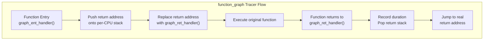
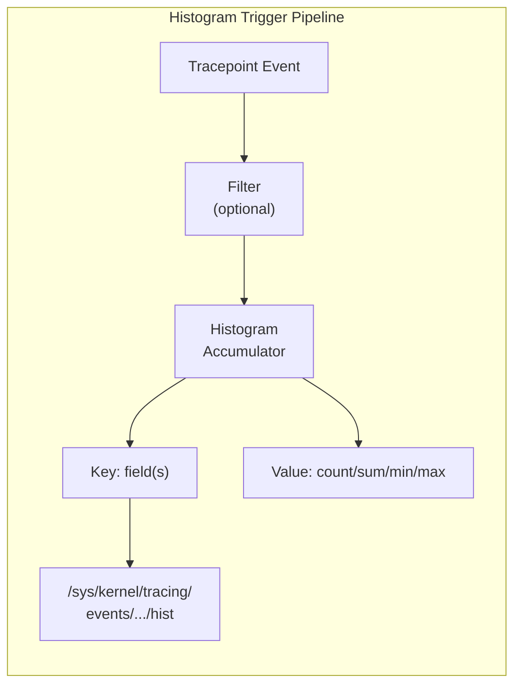
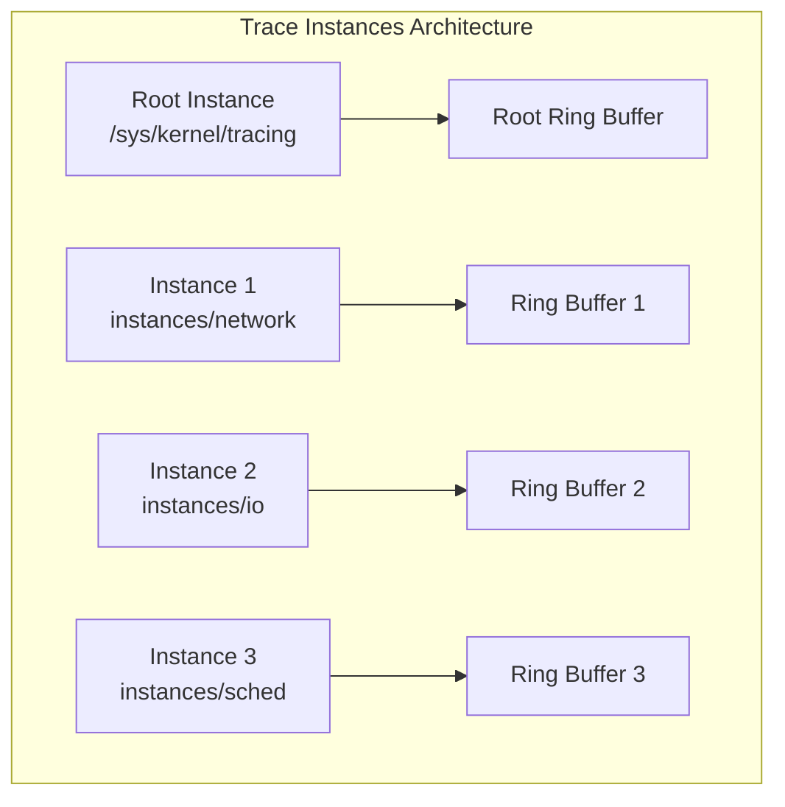

# ftrace Advanced Usage

## Introduction

The basic ftrace page covers function tracing, tracepoints, and the `trace-cmd` frontend.
This page dives into advanced ftrace capabilities: the `function_graph` tracer for
visualizing call stacks with timing, histogram triggers for in-kernel aggregation,
synthetic events for correlating multiple tracepoints, and trace instance isolation for
concurrent tracing sessions.

These features are all implemented within the kernel's tracing infrastructure and
require no external tools — though `trace-cmd` and `perf` can leverage them as well.

## Prerequisites

```bash
# Ensure tracefs is mounted
sudo mount -t tracefs tracefs /sys/kernel/tracing
cd /sys/kernel/tracing

# Check available tracers
cat available_tracers
# nop function function_graph wakeup wakeup_rt preemptirqsoff irqsoff preemptoff

# Check available events
cat available_events | head -20
```

## The function_graph Tracer

### How It Works

Unlike the `function` tracer (which logs a flat list of function calls), `function_graph`
instruments both function entry **and** return, building a nested call tree with
duration timing. It works by:

1. Replacing function prologues with a call to a graph entry handler
2. Using a per-CPU return stack to track function returns
3. Measuring time between entry and exit of each function



### Basic Usage

```bash
# Enable function_graph tracer
echo function_graph > current_tracer

# Set the function to trace (optional — traces everything by default)
echo __do_fault > set_graph_function

# Read the trace
cat trace_pipe
```

**Sample output:**

```
 0)               |  __do_fault() {
 0)               |    filemap_fault() {
 0)   0.583 us    |      find_get_page();
 0)               |      page_cache_sync_readahead() {
 0)   0.208 us    |        count_vm_event();
 0)   0.167 us    |        page_cache_ra_order();
 0)   1.542 us    |      }
 0)   0.125 us    |      lock_page();
 0)   0.083 us    |      wait_on_page_bit();
 0)   5.291 us    |    }
 0)   6.542 us    |  }
```

Key fields:
- `0)` — CPU number
- `|` — nesting depth indicator
- `{` — function entry
- `}` — function return
- `0.583 us` — time spent in the function (or sub-tree)
- Lines without time are leaf functions (time included in parent)

### Display Options

```bash
# Show absolute timestamps
echo 1 > options/funcgraph-absolute

# Hide duration of functions (show only structure)
echo 0 > options/funcgraph-duration

# Show process names
echo 1 > options/funcgraph-proc

# Show CPU number
echo 1 > options/funcgraph-cpu

# Overhead display style: 'abs' for absolute, 'percent' for percentage
echo abs > trace_options/funcgraph-overhead

# Set time threshold — only show functions slower than N nanoseconds
echo 10000 > tracing_thresh   # 10 microseconds

# Limit call depth
echo 5 > max_graph_depth
```

### Tracing Multiple Functions

```bash
# Trace several functions
echo __do_fault > set_graph_function
echo handle_mm_fault >> set_graph_function
echo __handle_mm_fault >> set_graph_function

# Verify
cat set_graph_function
# __do_fault
# handle_mm_fault
# __handle_mm_fault

# Use trace-cmd for convenience
trace-cmd record -p function_graph -g __do_fault -g handle_mm_fault sleep 1
trace-cmd report
```

### Per-Function Tracing with Filters

```bash
# Trace all functions matching a pattern (ftrace filter syntax)
echo 'schedule*' > set_ftrace_filter
echo function > current_tracer

# For function_graph, use set_graph_function with wildcards
# (wildcards are supported since kernel 5.10)
echo 'btrfs_*' > set_graph_function

# Combine with notrace to exclude specific functions
echo 'btrfs_end_bio' > set_ftrace_notrace
```

### trace-cmd Integration

```bash
# Record function_graph with filters
trace-cmd record -p function_graph \
    -g ext4_file_write_iter \
    --max-graph-depth 8 \
    dd if=/dev/zero of=/tmp/testfile bs=4k count=100

# Interactive report with filtering
trace-cmd report --cpu 0 | head -50

# Graph a specific function and its children
trace-cmd report -F 'ext4_file_write_iter' | less
```

## Histogram Triggers

### Overview

Histogram triggers are one of ftrace's most powerful features. They allow you to
aggregate data **in-kernel** — counting events, computing distributions, and
tracking min/max/avg — without copying every event to userspace. This dramatically
reduces overhead for high-frequency events.



### Basic Histogram Syntax

The histogram trigger syntax (written to `trigger` files):

```
hist:key=<field1>,<field2>:val=<op>(<field>):sort=<field>[:<dir>]
```

Where:
- `key` — fields to group by (becomes the histogram buckets)
- `val` — optional value aggregation (`count()`, `sum()`, `min()`, `max()`, `avg()`)
- `sort` — sort order (`key`, `val`, `count`, etc.)
- `dir` — ascending (`asc`) or descending (`desc`)

### Example 1: Counting Syscalls by PID

```bash
cd /sys/kernel/tracing

# Create a histogram on sys_enter that counts by common_pid
echo 'hist:key=common_pid:val=hitcount:sort=hitcount.desc' \
    > events/raw_syscalls/sys_enter/trigger

# Generate some activity
ls / > /dev/null
dd if=/dev/zero of=/dev/null bs=1 count=1000 2>/dev/null

# Read the histogram
cat events/raw_syscalls/sys_enter/hist
```

**Sample output:**

```
# event information
# event: raw_syscalls:sys_enter
# trigger: hist:key=common_pid:val=hitcount:sort=hitcount.desc

{ common_pid:      2147 } hitcount:       1205
{ common_pid:         1 } hitcount:        423
{ common_pid:       891 } hitcount:        105
{ common_pid:      2148 } hitcount:         42

Totals:
    Hits: 1775
    Entries: 4
    Dropped: 0
```

### Example 2: Latency Distribution with Buckets

```bash
# Distribution of I/O request durations
# Use 'lat' field from block_rq_complete event
echo 'hist:key=lat:sort=lat:vals=hitcount' \
    > events/block/block_rq_complete/trigger

# Read after generating I/O
cat events/block/block_rq_complete/hist
```

### Example 3: Sum and Average Aggregation

```bash
# Track total bytes written per process
echo 'hist:key=common_pid:val=total(count):sort=total.desc' \
    > events/syscalls/sys_exit_write/trigger

# Track min/max/avg latency for block I/O
echo 'hist:key=dev:val=hitcount,min(lat),max(lat),avg(lat):sort=avg.desc' \
    > events/block/block_rq_complete/trigger
```

### Example 4: Composite Keys

```bash
# Count events by both PID and syscall number
echo 'hist:key=common_pid,id:val=hitcount:sort=hitcount.desc' \
    > events/raw_syscalls/sys_enter/trigger
```

### Example 5: String Keys

```bash
# Histogram with string keys (comm field = process name)
echo 'hist:key=comm:val=hitcount:sort=hitcount.desc' \
    > events/sched/sched_switch/trigger
```

### Onmatch Actions — Triggering on Histogram Match

Histogram triggers can fire actions when a key matches. This enables sophisticated
event correlation:

```bash
# When a block request completes, snapshot the trace buffer
# if the latency exceeds 10ms
echo 'hist:key=dev,lat:lat.ge(10000000):onmatch(block_rq_complete).save_backtrace()' \
    > events/block/block_rq_complete/trigger

# Trigger a stack trace when a specific PID is seen
echo 'hist:key=common_pid:common_pid==1000:onmatch(raw_syscalls/sys_enter).save_backtrace()' \
    > events/raw_syscalls/sys_enter/trigger
```

### Onmax Actions — Tracking Peak Values

```bash
# Track the maximum block I/O latency and save context when a new max is hit
echo 'hist:key=dev:val=max(lat):onmax(lat).save_backtrace()' \
    > events/block/block_rq_complete/trigger
```

### Synthetic Events

Synthetic events combine data from multiple tracepoints into a new event. This is
the bridge between histograms and event correlation.

#### Creating a Synthetic Event

```bash
# Step 1: Define the synthetic event
# This creates a new event that combines sched_wakeup and sched_switch
echo 'wakeup_latency u64 pid; u64 delta_ns; char comm[16]' \
    > synthetic_events

# Step 2: Add histogram on sched_wakeup that records the wakeup time
echo 'hist:key=pid:ts0=common_timestamp.usecs:onmatch(sched/sched_switch).wakeup_latency($ts0,common_timestamp.usecs-$ts0,comm)' \
    > events/sched/sched_wakeup/trigger

# Step 3: Add matching histogram on sched_switch
echo 'hist:key=next_pid:val=hitcount:onmatch(sched/sched_wakeup).wakeup_latency()' \
    > events/sched/sched_switch/trigger

# Step 4: Enable the synthetic event
echo 1 > events/synthetic/wakeup_latency/enable

# Read events
cat events/synthetic/wakeup_latency/trace_pipe
```

**Sample output:**

```
  <idle>-0     [000]  1234.567890: wakeup_latency: pid=2147 delta_ns=15234 comm=bash
  <idle>-0     [000]  1234.567900: wakeup_latency: pid=891  delta_ns=8921  comm=sshd
```

#### Synthetic Event with Multiple Sources

```bash
# Track the time between block request issue and completion
echo 'io_latency u64 dev; u64 sector; u64 delta_ns' > synthetic_events

echo 'hist:key=dev,sector:ts0=common_timestamp.usecs:onmatch(block/block_rq_complete).io_latency(dev,sector,common_timestamp.usecs-$ts0)' \
    > events/block/block_rq_issue/trigger

echo 1 > events/synthetic/io_latency/enable
```

### Inter-event Timestamps

Histogram triggers support `common_timestamp.usecs` and `common_timestamp.nsecs`
for measuring time deltas between events. This is the foundation for latency analysis.

```bash
# Measure scheduling latency: time from sched_wakeup to sched_switch
echo 'hist:key=next_pid:val=hitcount:ts0=common_timestamp.usecs' \
    > events/sched/sched_wakeup/trigger
```

### Filtering Histograms

You can filter which events contribute to the histogram:

```bash
# Only count syscalls from PID 1000
echo 'hist:key=common_pid:common_pid==1000:val=hitcount:sort=hitcount.desc' \
    > events/raw_syscalls/sys_enter/trigger

# Filter by syscall number (e.g., only open/read/write)
echo 'hist:key=id:id==0||id==1||id==2:val=hitcount' \
    > events/raw_syscalls/sys_enter/trigger

# Filter by string field
echo 'hist:key=comm:comm=="sshd":val=hitcount' \
    > events/sched/sched_switch/trigger
```

### Removing Histograms

```bash
# Remove a specific histogram trigger
echo '!hist:key=common_pid:val=hitcount' \
    > events/raw_syscalls/sys_enter/trigger

# Remove all triggers from an event
echo '!hist:key=dev:val=max(lat)' > events/block/block_rq_complete/trigger

# Remove synthetic event
echo '!wakeup_latency' > synthetic_events
```

## Trace Instance Isolation

### Why Instances?

By default, all tracers share a single global trace buffer. This creates problems:
- Multiple tracers overwrite each other's data
- Cannot run different tracers on different CPUs simultaneously
- No per-workload isolation

Trace instances solve this by creating independent tracing sessions, each with its
own ring buffer, set of events, and tracer configuration.



### Creating and Managing Instances

```bash
cd /sys/kernel/tracing

# Create an instance
mkdir instances/network

# Each instance has its own tracefs tree
ls instances/network/
# buffer_size_kb  events  per_cpu  set_event  trace  trace_pipe  ...

# Configure instance independently
echo 4096 > instances/network/buffer_size_kb
echo 1 > events/instances/network/net/enable
echo function_graph > instances/network/current_tracer

# Read from instance
cat instances/network/trace_pipe

# Remove instance
rmdir instances/network  # must be empty or disabled first
```

### Per-Instance Configuration

Each instance maintains independent state for:
- `current_tracer` — which tracer to use
- `set_event` — which events are enabled
- `buffer_size_kb` — ring buffer size
- `tracing_on` — enable/disable tracing
- `set_ftrace_filter` — function filters
- `trace_options` — output format options

```bash
# Example: separate instances for different subsystems

# Network tracing instance
mkdir -p instances/net
echo 8192 > instances/net/buffer_size_kb
echo 1 > instances/net/events/napi/napi_poll/enable
echo 1 > instances/net/events/net/net_dev_xmit/enable
echo 1 > instances/net/events/net/netif_receive_skb/enable

# I/O tracing instance
mkdir -p instances/io
echo 8192 > instances/io/buffer_size_kb
echo function_graph > instances/io/current_tracer
echo ext4_file_write_iter > instances/io/set_graph_function
echo ext4_file_read_iter >> instances/io/set_graph_function

# Scheduler tracing instance
mkdir -p instances/sched
echo 4096 > instances/sched/buffer_size_kb
echo 1 > instances/sched/events/sched/sched_switch/enable
echo 1 > instances/sched/events/sched/sched_wakeup/enable
echo 1 > instances/sched/events/sched/sched_migrate_task/enable

# Start all instances simultaneously
echo 1 > instances/net/tracing_on
echo 1 > instances/io/tracing_on
echo 1 > instances/sched/tracing_on

# Collect data in parallel
cat instances/net/trace > /tmp/net.trace &
cat instances/io/trace > /tmp/io.trace &
cat instances/sched/trace > /tmp/sched.trace &
```

### Per-CPU Instances

You can create per-CPU instances to isolate tracing on specific CPUs:

```bash
# Pin instance 1 to CPUs 0-3
echo 0-3 > instances/io/cpumask

# Pin instance 2 to CPUs 4-7
echo 4-7 > instances/net/cpumask
```

### trace-cmd with Instances

```bash
# trace-cmd supports instances directly
trace-cmd record -B network -e net -e napi sleep 5
trace-cmd report -B network

# Instance for function graph
trace-cmd record -B io -p function_graph -g ext4_file_write_iter sleep 5
trace-cmd report -B io
```

## Event Probes (Dynamic Tracepoints)

### kprobe Events

You can create dynamic kprobe-based tracepoints through ftrace:

```bash
cd /sys/kernel/tracing

# Create a kprobe event on a kernel function
echo 'p:myprobe do_sys_open filename=+0(%si):string' > kprobe_events

# Create a kretprobe for return value
echo 'r:myretprobe do_sys_open ret=$retval' >> kprobe_events

# Enable the events
echo 1 > events/kprobes/myprobe/enable
echo 1 > events/kprobes/myretprobe/enable

# Read the trace
cat trace_pipe
```

**Sample output:**

```
 cat-1234  [000]  1234.567890: myprobe: (do_sys_open+0x0/0x200) filename="/etc/passwd"
 cat-1234  [000]  1234.567900: myretprobe: (do_sys_open+0x0/0x200 <- do_sys_open) ret=3
```

### kprobe Event Arguments

```bash
# Register argument with different types
# +offset(%reg) for register-relative access
# $retval for return value (kretprobe only)
# +0(%stack) for stack access

echo 'p:myprobe do_sys_open \
    dfd=%di:long \
    filename=+0(%si):string \
    flags=%dx:long' > kprobe_events

# Available types: u8, u16, u32, u64, s8, s16, s32, s64,
#                  x8, x16, x32, x64, string, symbol, bshift
```

### uprobe Events

```bash
# Trace a userspace function
echo 'p:myuprobe /usr/lib/libc.so.6:0x12345' > uprobe_events

# With argument extraction
echo 'p:myuprobe /usr/lib/libc.so.6:write fd=%di:u64 buf=%si:x64 count=%dx:u64' \
    > uprobe_events

# Enable
echo 1 > events/uprobes/myuprobe/enable
```

## Advanced Filtering

### Filter Predicates

ftrace supports complex filter expressions on event fields:

```bash
# Simple comparisons
echo 'common_pid == 1000' > events/sched/sched_switch/filter

# Logical operators
echo 'common_pid == 1000 && prev_prio < 100' > events/sched/sched_switch/filter

# String matching
echo 'prev_comm ~ "kworker*"' > events/sched/sched_switch/filter

# OR conditions
echo 'next_pid == 1 || next_pid == 2 || next_pid == 1000' \
    > events/sched/sched_switch/filter

# Negation
echo 'common_pid != 0' > events/sched/sched_switch/filter

# Clear filter
echo 0 > events/sched/sched_switch/filter
```

### Filter with Bitmask Operations

```bash
# Check specific bits (useful for flags)
echo 'flags & 0x01' > events/raw_syscalls/sys_enter/filter

# Check that specific bits are NOT set
echo '!(flags & 0x02)' > events/raw_syscalls/sys_enter/filter
```

## Per-CPU Tracing and cpu_id Filtering

```bash
# View per-CPU buffer status
cat per_cpu/cpu0/trace_pipe
cat per_cpu/cpu3/trace_pipe

# Filter events to specific CPU using event filter
echo 'common_cpu == 2' > events/sched/sched_switch/filter

# Set buffer size per-CPU (affects all CPUs equally)
echo 8192 > buffer_size_kb

# Read per-CPU buffer stats
cat per_cpu/cpu0/stats
# entries: 0
# overruns: 0
# commit overrun: 0
# bytes: 0
# oldest event ts: 0
# now ts: 0
# dropped events: 0
# read events: 0
```

## Snapshot Buffers

The snapshot mechanism freezes a copy of the current trace buffer for later analysis
while tracing continues:

```bash
# Allocate snapshot buffer (same size as main buffer)
echo 1 > snapshot

# Take a snapshot (copies current buffer to snapshot)
echo 1 > snapshot

# Read the snapshot
cat snapshot

# Clear the snapshot
echo 0 > snapshot

# Use with triggers — snapshot on specific condition
echo 'hist:key=lat:lat.ge(1000000):onmax(lat).snapshot()' \
    > events/block/block_rq_complete/trigger
```

## trace-cmd Advanced Features

### trace-cmd stream (Live Tracing)

```bash
# Stream events live (no buffering)
trace-cmd stream -e sched -e block -e net

# Stream with function_graph
trace-cmd stream -p function_graph -g schedule
```

### trace-cmd listen (Remote Tracing)

```bash
# On the target machine (port 12345)
trace-cmd listen -p 12345 -D /tmp/traces/

# On the control machine
trace-cmd record -N target-host:12345 -e sched sleep 10
```

### trace-cmd split and merge

```bash
# Split a large trace file
trace-cmd split -i trace.dat -o /tmp/split-

# Merge multiple trace files (e.g., from instances)
trace-cmd merge trace1.dat trace2.dat trace3.dat > merged.dat
```

## KernelShark Visualization

```bash
# Install
sudo apt install kernelshark  # or build from source

# Open a trace file
kernelshark trace.dat

# Or live view
trace-cmd record -e sched -e block sleep 5
kernelshark trace.dat
```

KernelShark provides:
- Timeline view of events across CPUs
- Event filtering and highlighting
- Function graph visualization
- Plugin architecture for custom views

## Performance Considerations

| Feature | Overhead | Best For |
|---------|----------|----------|
| `function_graph` | High (instrumented returns) | Call tree visualization |
| `function` | Medium (entry only) | Call frequency analysis |
| Histogram triggers | Low (in-kernel aggregation) | High-frequency event counting |
| Synthetic events | Low-Medium | Cross-event correlation |
| Trace instances | Per-instance cost | Isolated concurrent tracing |
| kprobe events | Medium-High | Dynamic tracing of specific functions |

### Reducing Overhead

```bash
# Use per-CPU buffers to reduce contention
echo 16384 > buffer_size_kb

# Use tracers_thresh to filter low-interest events
echo 10000 > tracing_thresh   # 10us threshold

# Limit function_graph depth
echo 3 > max_graph_depth

# Use set_ftrace_notrace to exclude noisy functions
echo '__sanitizer_*' > set_ftrace_notrace

# Disable tracing when not in use
echo 0 > tracing_on
```

## Integration with Other Tools

### ftrace + perf

```bash
# Use perf to read ftrace tracepoints
perf record -e 'sched:sched_switch' -e 'block:block_rq_complete' sleep 5
perf script

# perf can also trigger ftrace snapshots
perf record -e 'block:block_rq_complete' --call-graph dwarf sleep 5
```

### ftrace + BPF

```bash
# BPF programs can attach to ftrace tracepoints
# via the perf_event or raw_tracepoint program types

# Example: trace-cmd record with BPF filtering
# (BPF filter runs in kernel, reducing overhead)
trace-cmd record -e sched --bpf my_filter.o sleep 5
```

## Common Recipes

### Recipe: Identify Long-Sleeping Tasks

```bash
# Create synthetic event for sleep duration
echo 'sleep_time u64 pid; u64 duration_ns; char comm[16]' > synthetic_events

# Histogram on sched_switch for tasks going to sleep
echo 'hist:key=prev_pid:ts0=common_timestamp.usecs:onmatch(sched/sched_switch).sleep_time(prev_pid,common_timestamp.usecs*1000-$ts0,prev_comm)' \
    > events/sched/sched_switch/trigger

echo 1 > events/synthetic/sleep_time/enable
echo 'hist:key=pid:val=max(duration_ns):sort=max.desc' \
    > events/synthetic/sleep_time/trigger

sleep 10
cat events/synthetic/sleep_time/hist
```

### Recipe: Trace Wakeup Chain

```bash
# Track scheduler wakeup latency per-CPU
echo 'hist:key=cpu:val=avg(hitcount),max(hitcount):sort=max.desc' \
    > events/sched/sched_wakeup/trigger

# With latency buckets
echo 'hist:key=cpu,lat:sort=lat' > events/sched/sched_wakeup/trigger
```

### Recipe: Block I/O Latency Heatmap

```bash
# Create histogram of I/O latency by device and latency bucket
echo 'hist:key=dev,lat:val=hitcount:sort=lat' \
    > events/block/block_rq_complete/trigger

# Add filter for only slow I/O
echo 'lat > 1000000' > events/block/block_rq_complete/filter

cat events/block/block_rq_complete/hist
```

## Summary

| Feature | Description | Key File |
|---------|-------------|----------|
| `function_graph` | Nested call tree with timing | `current_tracer`, `set_graph_function` |
| Histogram triggers | In-kernel event aggregation | `events/*/trigger` |
| Synthetic events | Cross-event correlation | `synthetic_events` |
| Trace instances | Isolated tracing sessions | `instances/` |
| kprobe events | Dynamic function tracing | `kprobe_events` |
| uprobe events | Userspace function tracing | `uprobe_events` |
| Snapshot buffers | Frozen trace buffer copy | `snapshot` |
| Event filters | In-kernel event filtering | `events/*/filter` |

These advanced ftrace features form the foundation for sophisticated kernel tracing.
Combined with `trace-cmd` for convenience and `KernelShark` for visualization, they
provide a complete tracing toolkit without any external dependencies beyond the
kernel itself.
