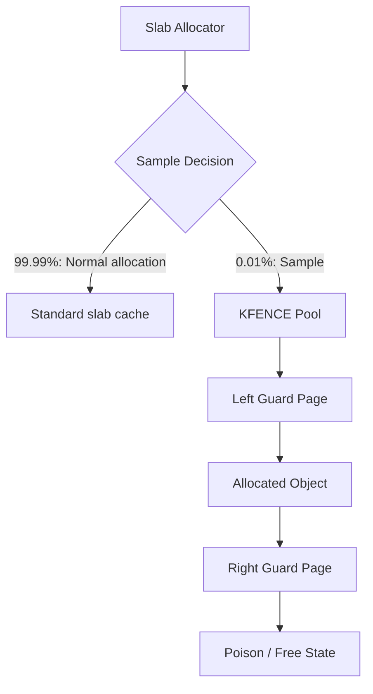
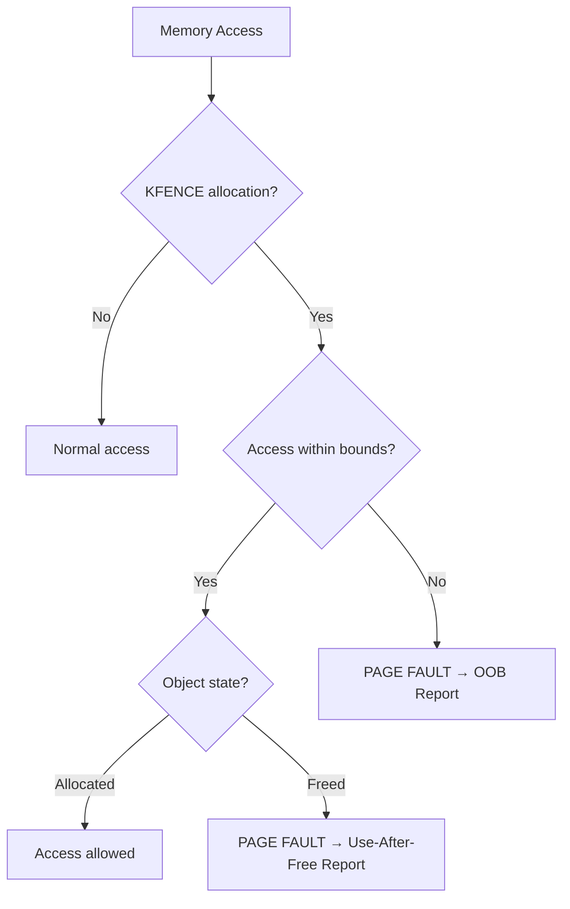
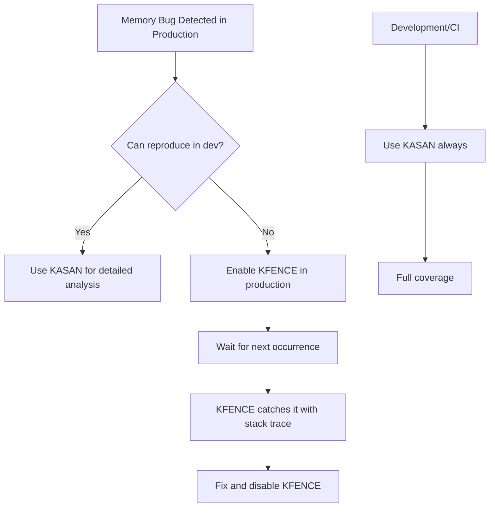
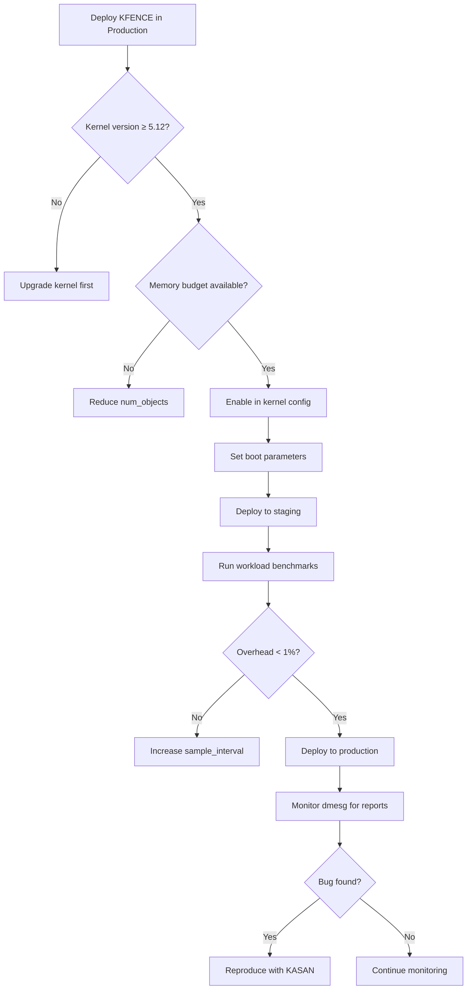
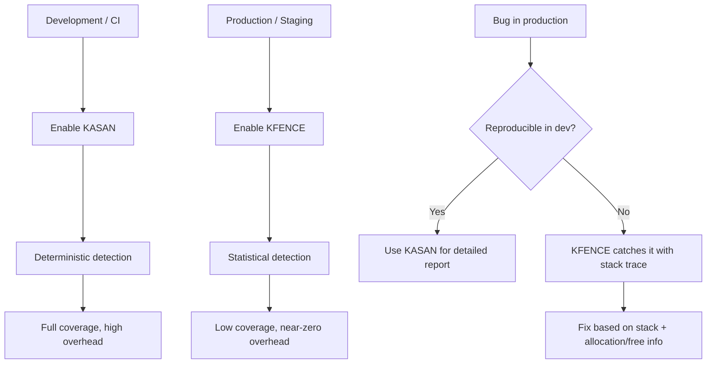

# KFENCE: Low-Overhead Sampling Memory Error Detector

## Introduction

KFENCE (Kernel Electric-Fence) is a low-overhead sampling-based memory error detector
for the Linux kernel. Introduced in Linux 5.12, KFENCE detects heap memory errors
such as out-of-bounds accesses, use-after-free, and invalid-free operations at runtime.
Unlike KASAN (Kernel Address Sanitizer), which incurs significant performance overhead
(2-3x), KFENCE uses a sampling approach that adds less than 1% overhead, making it
suitable for production systems. KFENCE works by placing guard pages around sampled
slab allocations, causing immediate page faults on invalid access.

## Design Overview



### How KFENCE Works

KFENCE maintains a small pool of memory pages set aside for sampled allocations:

```
Memory Layout:
┌──────────────┐
│ Guard Page   │  ← Unmapped (PAGE_NONE)
│ (no access)  │     Any access = immediate page fault
├──────────────┤
│ Object       │  ← The actual allocation
│ (4K page)    │     Valid only while allocated
├──────────────┤
│ Guard Page   │  ← Unmapped (PAGE_NONE)
│ (no access)  │     Any access = immediate page fault
└──────────────┘
```

When an allocation is sampled by KFENCE:
1. It's placed between two **guard pages** (unmapped pages)
2. Adjacent objects in the slab cache are **not** affected
3. Any out-of-bounds access hits the guard page → page fault → error report

## Error Detection Capabilities



### Detected Error Types

| Error Type | Detection Mechanism | Example |
|-----------|-------------------|---------|
| Heap out-of-bounds read | Guard page fault | Reading past allocation end |
| Heap out-of-bounds write | Guard page fault | Writing past allocation end |
| Use-after-free | Guard page + poison check | Accessing freed memory |
| Double-free | Free-list state check | Calling kfree() twice |
| Invalid-free | Address validation | kfree() on non-KFENCE address |

## KFENCE Pool

```c
/* mm/kfence/core.c - pool initialization */
#define KFENCE_POOL_SIZE (CONFIG_KFENCE_NUM_OBJECTS * 2 * PAGE_SIZE)

static struct kfence_metadata kfence_metadata[CONFIG_KFENCE_NUM_OBJECTS];
static char *kfence_pool;

static int __init kfence_init_pool(void)
{
    /* Allocate the KFENCE pool (typically 1-2 MB) */
    kfence_pool = memblock_alloc(KFENCE_POOL_SIZE, PAGE_SIZE);

    /* Map guard pages as PAGE_NONE (no access) */
    /* Map object pages as normal */
    for (i = 0; i < CONFIG_KFENCE_NUM_OBJECTS; i++) {
        unsigned long addr = (unsigned long)kfence_pool +
                              i * 2 * PAGE_SIZE;

        /* Left guard page */
        set_memory_np(addr, 1);

        /* Object page: initially also PAGE_NONE (freed state) */
        set_memory_np(addr + PAGE_SIZE, 1);

        /* Right guard page */
        set_memory_np(addr + 2 * PAGE_SIZE, 1);
    }

    return 0;
}
```

### Metadata Tracking

```c
struct kfence_metadata {
    struct list_head list;          /* Free list linkage */
    struct kmem_cache *cache;       /* Source slab cache */
    unsigned long obj_addr;         /* Object address */
    unsigned long allocated_by;     /* Allocation stack trace */
    unsigned long freed_by;         /* Free stack trace */
    bool is_redzone;                /* In redzone (freed) state */
    /* ... */
};
```

## Sampling Mechanism

KFENCE allocates objects from its pool at a configurable sampling rate:

```c
/* mm/kfence/core.c - allocation sampling */
static struct kfence_metadata *kfence_alloc_from_pool(void)
{
    struct kfence_metadata *meta;

    /* Check if sampling interval has elapsed */
    if (!time_after(jiffies, kfence_sample_interval))
        return NULL;

    /* Pick the next free object from the pool */
    if (list_empty(&kfence_freelist))
        return NULL;

    meta = list_first_entry(&kfence_freelist,
                             struct kfence_metadata, list);
    list_del(&meta->list);

    /* Map the object page */
    set_memory_rw(meta->obj_addr, 1);

    /* Poison the memory (detect use-after-free) */
    memset((void *)meta->obj_addr, KFENCE_KMALLOC_REDZONE, PAGE_SIZE);

    return meta;
}
```

### Integration with SLAB/SLUB

```c
/* mm/kfence/hooks.c - hook into slab allocator */
void *__kfence_kmalloc(struct kmem_cache *s, size_t size, gfp_t flags)
{
    struct kfence_metadata *meta;
    unsigned long addr;

    /* Should we sample this allocation? */
    if (!kfence_sample_interval || !kfence_is_enabled())
        return NULL;

    /* Get a KFENCE object from the pool */
    meta = kfence_alloc_from_pool();
    if (!meta)
        return NULL;

    addr = meta->obj_addr;

    /* Track metadata */
    meta->cache = s;
    meta->allocated_by = _RET_IP_;

    /* Align the object within the KFENCE page */
    return (void *)(addr + kfence_guarded_slab_offset(s, size));
}

/* Hook into kfree() */
void __kfence_kfree(void *addr)
{
    struct kfence_metadata *meta = kfence_metadata_of(addr);

    if (!meta) return;

    /* Record the free stack trace */
    meta->freed_by = _RET_IP_;

    /* Poison the freed memory */
    memset(addr, KFENCE_KMALLOC_REDZONE, meta->cache->object_size);

    /* Unmap the object page (now a guard page) */
    set_memory_np(meta->obj_addr, 1);

    /* Return to free list */
    kfence_return_to_pool(meta);
}
```

## Page Fault Handler

When a guard page is accessed, KFENCE's page fault handler detects the error:

```c
/* mm/kfence/core.c - fault handler */
static vm_fault_t kfence_handle_page_fault(unsigned long addr,
                                            struct pt_regs *regs)
{
    struct kfence_metadata *meta;
    bool is_write;
    int report_type;

    meta = kfence_metadata_for_addr(addr);
    if (!meta)
        return VM_FAULT_SIGBUS;  /* Not a KFENCE page */

    /* is_write is provided by the architecture-specific fault handler */
    /* (passed as parameter, not derived from regs->ip) */

    if (meta->is_redzone) {
        if (meta->freed_by)
            report_type = KFENCE_ERROR_UAF;
        else
            report_type = KFENCE_ERROR_OOB;
    } else {
        report_type = KFENCE_ERROR_OOB;
    }

    /* Generate a detailed report */
    kfence_report_error(addr, is_write, report_type, meta, regs);

    return VM_FAULT_SIGBUS;
}
```

## Error Reports

KFENCE produces detailed reports in the kernel log:

```
==================================================================
BUG: KFENCE: out-of-bounds read in kfence_test+0x42/0x100

Out-of-bounds read at 0xffffffff82c0a001 (4B):
 kfence_test+0x42/0x100
 do_one_initcall+0x5b/0x300
 kernel_init_freeable+0x1a0/0x1f0

Allocated by task 1:
 kfence_alloc+0x50/0x80
 __kmalloc+0x120/0x300
 kfence_test_init+0x20/0x40
 do_one_initcall+0x5b/0x300

Freed by task 0:
 kfence_free+0x30/0x60
 kfree+0x100/0x200
 kfence_test_init+0x80/0x40

CPU: 0 PID: 1 Comm: swapper/0 Not tainted
Hardware: QEMU Standard PC
==================================================================
```

## Sysfs Interface

```
/sys/kernel/debug/kfence/
├── stats           # Allocation/error statistics
```

### Runtime Control

```bash
# Check KFENCE status
cat /proc/cmdline | grep kfence

# View KFENCE statistics
cat /sys/kernel/debug/kfence/stats

# Enable/disable at runtime (Linux 5.15+)
echo 1 > /sys/module/kfence/parameters/sample_interval
```

## Configuration

### Kernel Build Options

```
CONFIG_KFENCE=y
CONFIG_KFENCE_NUM_OBJECTS=100       # Number of objects in pool (default: 100)
CONFIG_KFENCE_STRESS_TEST_FAULTS=0  # For testing only
```

### Boot Parameters

```
kfence.sample_interval=100   # Sample every 100ms (default)
kfence.num_objects=100       # Number of objects (default)
kfence.enable=1              # Enable/disable (default: 1)
```

### Typical Production Settings

```bash
# Boot with KFENCE enabled (low overhead)
# In GRUB or kernel cmdline:
kfence.sample_interval=100

# For catching more bugs (slightly higher overhead):
kfence.sample_interval=10
kfence.num_objects=200
```

## Comparison with KASAN

| Feature | KFENCE | KASAN |
|---------|--------|-------|
| Overhead | < 1% | 2-3x |
| Detection rate | Statistical | Deterministic |
| Memory overhead | ~1-2 MB fixed | ~1/4 of RAM |
| Production use | ✓ | ✗ (too slow) |
| Stack errors | ✗ | ✓ (KASAN stack) |
| Global variables | ✗ | ✓ |
| Out-of-bounds | ✓ | ✓ |
| Use-after-free | ✓ | ✓ |
| Double-free | ✓ | ✓ |
| Uninitialized memory | ✗ | ✓ (KMSAN) |

### When to Use Each



## Advanced: Custom Redzone Patterns

KFENCE uses specific byte patterns to detect different error conditions:

```c
/* Poison values */
#define KFENCE_KMALLOC_REDZONE  0xAA  /* Allocated redzone */
#define KFENCE_FREE_REDZONE     0xBB  /* Freed memory pattern */
#define KFENCE_PADDING_REDZONE  0xCC  /* Padding bytes */

/* When object is freed:
 * Bytes 0x00..0x0F: Free header
 * Bytes 0x10..0x1F: KFENCE_FREE_REDZONE (0xBB)
 * ... all filled with 0xBB
 */
```

## Debugging with KFENCE

### Reproducing KFENCE Bugs

Since KFENCE is sampling-based, bugs may take time to appear. Strategies:

```bash
# 1. Decrease sampling interval (catch more bugs)
kfence.sample_interval=1

# 2. Increase pool size (more concurrent samples)
kfence.num_objects=500

# 3. Combine with KASAN for development
# (KASAN for deterministic, KFENCE for production)
```

### KFENCE + ktest

```bash
#!/bin/bash
# Run workload repeatedly with KFENCE enabled
for i in $(seq 1 1000); do
    ./my_test_program
    dmesg | grep -q "BUG: KFENCE" && {
        echo "KFENCE bug found on iteration $i!"
        dmesg | tail -50
        break
    }
done
```

## Performance Impact

Measured on typical server workloads:

| Workload | KFENCE Overhead | Notes |
|----------|----------------|-------|
| Kernel compilation | < 0.5% | Build system benchmark |
| Redis | < 0.3% | Throughput benchmark |
| PostgreSQL | < 0.5% | pgbench |
| Nginx | < 0.2% | HTTP request throughput |
| MySQL | < 0.5% | sysbench |

## KFENCE Test Suite (KUnit)

KFENCE includes a comprehensive KUnit test suite that validates all error detection capabilities. These tests can run in a QEMU virtual machine or on real hardware:

```bash
# Run KFENCE KUnit tests
# Requires a kernel built with CONFIG_KUNIT=y and CONFIG_KFENCE_KUNIT_TEST=y

# In-tree testing (kernel 5.15+)
./tools/testing/kunit/kunit.py run kfence

# Or boot a test kernel and run:
# The tests are registered as a KUnit module
modprobe kfence_test

# View test results in dmesg
# Expected output for each test case:
#     ok 1 - test_out_of_bounds_read
#     ok 2 - test_out_of_bounds_write
#     ok 3 - test_use_after_free_read
#     ok 4 - test_double_free
#     ok 5 - test_invalid_addr_free
#     ok 6 - test_shrink_memcache
```

### Test Cases Covered

| Test Case | Error Type | Expected Detection |
|-----------|-----------|--------------------|
| `test_out_of_bounds_read` | OOB read | Guard page fault → report |
| `test_out_of_bounds_write` | OOB write | Guard page fault → report |
| `test_use_after_free_read` | UAF read | Freed page fault → report |
| `test_use_after_free_write` | UAF write | Freed page fault → report |
| `test_double_free` | Double free | Free-list state check |
| `test_invalid_addr_free` | Invalid free | Address validation |
| `test_shrink_memcache` | Cache shrink | Metadata consistency |
| `test_memcache_types` | Various caches | Per-cache allocation |

### Writing Custom KFENCE Tests

You can write KFENCE tests for your own kernel modules using the KUnit framework:

```c
#include <kunit/test.h>
#include <linux/slab.h>
#include <linux/kfence.h>

static void test_my_module_oob(struct kunit *test)
{
    char *buf;
    int i;

    /* Allocate a buffer that might land in KFENCE pool */
    buf = kmalloc(32, GFP_KERNEL);
    KUNIT_ASSERT_NOT_NULL(test, buf);

    /* Write within bounds */
    for (i = 0; i < 32; i++)
        buf[i] = 'A';

    /* Note: intentionally writing past end would trigger KFENCE,
     * but we DON'T do that in tests — KFENCE's own tests cover this.
     * This test verifies normal operation doesn't false-positive. */

    kfree(buf);
}

static struct kunit_case my_kfence_cases[] = {
    KUNIT_CASE(test_my_module_oob),
    {},
};

static struct kunit_suite my_kfence_suite = {
    .name = "my_module_kfence",
    .test_cases = my_kfence_cases,
};
kunit_test_suite(my_kfence_suite);
```

## Production Deployment Guide

### Deployment Checklist



### Recommended Production Settings

```bash
# Conservative (minimal overhead, catches major bugs)
kfence.sample_interval=100
kfence.num_objects=100
# Memory cost: ~100 * 2 * 4KB = ~800KB

# Balanced (good coverage, still low overhead)
kfence.sample_interval=50
kfence.num_objects=200
# Memory cost: ~200 * 2 * 4KB = ~1.6MB

# Aggressive (more bugs caught, slightly higher overhead)
kfence.sample_interval=10
kfence.num_objects=500
# Memory cost: ~500 * 2 * 4KB = ~4MB
```

### Monitoring KFENCE in Production

```bash
#!/bin/bash
# /usr/local/bin/kfence-monitor.sh
# Monitor dmesg for KFENCE reports and alert

KFENCE_LOG="/var/log/kfence-reports.log"
ALERT_EMAIL="security-team@example.com"

# Watch for KFENCE reports
dmesg -w | while IFS= read -r line; do
    if echo "$line" | grep -q "BUG: KFENCE"; then
        echo "$(date -Iseconds) $line" >> "$KFENCE_LOG"
        
        # Capture the full report (next 20 lines)
        dmesg | grep -A 20 "BUG: KFENCE" >> "$KFENCE_LOG"
        
        # Send alert
        echo "KFENCE bug detected on $(hostname): $line" | \
            mail -s "KFENCE Alert: $(hostname)" "$ALERT_EMAIL"
        
        # Log to syslog for centralized collection
        logger -p kern.err "KFENCE: $line"
    fi
done
```

```bash
# systemd service for the monitor
# /etc/systemd/system/kfence-monitor.service
[Unit]
Description=KFENCE Bug Monitor
After=systemd-journald.service

[Service]
Type=simple
ExecStart=/usr/local/bin/kfence-monitor.sh
Restart=always
RestartSec=5

[Install]
WantedBy=multi-user.target
```

### Integrating with Existing Monitoring

```bash
# Prometheus: export KFENCE stats via node_exporter textfile collector
#!/bin/bash
# /var/lib/node_exporter/kfence.prom

STATS_FILE="/sys/kernel/debug/kfence/stats"
if [ -f "$STATS_FILE" ]; then
    total=$(awk '/^total:/ {print $2}' "$STATS_FILE")
    errors=$(awk '/^buggy:/ {print $2}' "$STATS_FILE")
    cat <<EOF
# HELP kfence_allocations_total Total KFENCE allocations
# TYPE kfence_allocations_total counter
kfence_allocations_total $total
# HELP kfence_errors_total Total KFENCE errors detected
# TYPE kfence_errors_total counter
kfence_errors_total $errors
EOF
fi
```

## Interaction with Other Kernel Debugging Tools

### KFENCE + KASAN



### KFENCE + kmemleak

KMEMLEAK detects memory leaks. KFENCE can complement it:

```bash
# Both enabled simultaneously
# KFENCE: catches memory corruption
# kmemleak: catches memory leaks

# Check kmemleak reports
echo scan > /sys/kernel/debug/kmemleak
cat /sys/kernel/debug/kmemleak
```

### KFENCE + lockdep

Lockdep detects lock ordering violations. Both can run together:

```bash
# Boot with both enabled
# kfence.sample_interval=100 lockdep=1

# Lockdep overhead is higher (~5%), but for debugging
# lock ordering issues, it's invaluable.
# KFENCE adds negligible overhead on top.
```

## Advanced: Understanding Error Reports

### Anatomy of a KFENCE Report

```
==================================================================
BUG: KFENCE: out-of-bounds read in my_driver_read+0x42/0x100

Out-of-bounds read at 0xffffffff82c0a001 (1B):     ← What and where
 my_driver_read+0x42/0x100                          ← Faulting function + offset
 vfs_read+0x9b/0x1b0                                ← Call chain
 ksys_read+0x67/0xe0                                ← ...
 do_syscall_64+0x5c/0x90                            ← Syscall entry
 entry_SYSCALL_64_after_hwframe+0x44/0xae

Allocated by task 1234:                             ← Who allocated it
 kmalloc_trace+0x30/0x80
 my_driver_open+0x20/0x60                           ← Allocation site
 do_sys_open+0x2e7/0x3b0
 do_syscall_64+0x5c/0x90

Freed by task 1234:                                 ← Who freed it
 kfree+0x68/0x120
 my_driver_close+0x40/0x80                          ← Free site
 __fput+0x8c/0x250
 task_work_run+0x78/0xa0

CPU: 2 PID: 5678 Comm: my_app Not tainted 6.1.0+    ← Context info
==================================================================
```

### Interpreting the Report

| Field | Meaning | Action |
|-------|---------|--------|
| **BUG: KFENCE: ...** | Error type | OOB, UAF, or double-free |
| **Out-of-bounds read/write** | Access direction | Read = info leak risk; Write = corruption |
| **at 0x...** | Faulting address | Guard page or freed page |
| **Allocated by** | Allocation stack trace | Where the object was created |
| **Freed by** | Free stack trace | Where the object was destroyed |
| **task PID: TID** | Process context | Which process triggered it |
| **Not tainted** | Kernel taint status | Clean kernel or vendor-tainted |

### Example: Fixing a Real Bug from KFENCE

Suppose KFENCE reports:
```
BUG: KFENCE: out-of-bounds write in net_rx_action+0x123/0x200

Out-of-bounds write at 0xffff...001 (4B):
 net_rx_action+0x123/0x200
 __do_softirq+0xd0/0x2c0

Allocated by task 42:
 kmalloc_trace+0x30/0x80
 netdev_alloc_skb+0x40/0x80
 net_driver_rx+0x100/0x200
```

**Diagnosis**: The network driver allocates an skb with `kmalloc`, but `net_rx_action` writes past the allocated buffer. The fix would be to increase the allocation size or fix the offset calculation in the driver.

## Automated Bug Reproduction

Since KFENCE is sampling-based, bugs are probabilistic. Strategies to increase catch rate:

### 1. Decrease Sampling Interval

```bash
# Catch more bugs (higher overhead)
kfence.sample_interval=1
kfence.num_objects=1000
```

### 2. Stress Test with KFENCE

```bash
#!/bin/bash
# Run workload in a loop with KFENCE enabled
WORKLOAD="./my_stress_test"
MAX_ITERATIONS=10000

for i in $(seq 1 $MAX_ITERATIONS); do
    $WORKLOAD 2>&1 > /dev/null
    
    # Check for KFENCE reports
    if dmesg | tail -50 | grep -q "BUG: KFENCE"; then
        echo "KFENCE bug found on iteration $i"
        dmesg | tail -50
        exit 0
    fi
done

echo "No KFENCE bug found in $MAX_ITERATIONS iterations"
```

### 3. Combine with Fuzzing

```bash
# syzkaller with KFENCE
# In syzkaller config:
# {
#   "kernel_cmdline": "kfence.sample_interval=1 kfence.num_objects=500"
# }
```

## Cross-References

- [Slab Allocator](../kernel/memory/slab-allocator.md) - How kernel heap allocation works
- [Page Allocator](../kernel/memory/page-allocator.md) - Underlying page management
- [Sanitizers](sanitizers.md) - KASAN, KMSAN, KCSAN
- [Valgrind](valgrind.md) - Userspace memory error detection
- [Kernel Debugging](kernel-debugging.md) - General kernel debugging techniques
- [ftrace](ftrace.md) - Function tracing for debugging
- [OOM Killer](../kernel/memory/oom-killer.md) - Out-of-memory handling

## Further Reading

- [KFENCE documentation](https://www.kernel.org/doc/html/latest/dev-tools/kfence.html)
- [KFENCE: Low-overhead sampling-based memory safety (LWN.net)](https://lwn.net/Articles/831367/)
- [KFENCE design document (Google)](https://docs.google.com/document/d/1KEx2TQGLZIz5YPp3dCJc9DFHiJlbmXjnxxwLxsSvUjE/)
- [KFENCE patches (lore.kernel.org)](https://lore.kernel.org/linux-mm/?q=kfence)
- [Alexander Potapenko's KFENCE talk](https://www.youtube.com/watch?v=Qn6kFjPwQXQ)
- [KASAN documentation](https://www.kernel.org/doc/html/latest/dev-tools/kasan.html)
- [Google's KernelSanitizer page](https://github.com/google/sanitizers)
- [KUnit testing framework](https://www.kernel.org/doc/html/latest/dev-tools/kunit/index.html)
