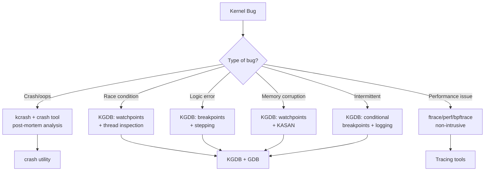

# KGDB — Kernel Debugger

**KGDB** is a source-level kernel debugger that runs over a serial connection
(or other transport) between a **target** machine (running the kernel under test)
and a **host** machine running GDB. It allows setting breakpoints, single-stepping
through kernel code, inspecting variables, and examining memory/registers — all
from the familiar GDB interface.

> **Architecture:** Split design — `kgdb` (core) + `kgdboc` (I/O channel)  
> **Companion:** `kdb` (in-kernel console debugger, can coexist with KGDB)  
> **Config:** `CONFIG_KGDB`, `CONFIG_KGDB_SERIAL_CONSOLE`

---

## Architecture Overview

```
┌──────────────────────────┐         ┌──────────────────────────┐
│     TARGET (debuggee)    │         │      HOST (debugger)     │
│                          │         │                          │
│  ┌──────────────────┐    │  Serial │  ┌──────────────────┐    │
│  │  Linux Kernel     │    │  Link   │  │  GDB             │    │
│  │  ┌──────────┐    │    │  ────   │  │  (vmlinux with   │    │
│  │  │ kgdb core│    │◄───┼─────────┼──│   debug symbols) │    │
│  │  └────┬─────┘    │    │         │  └──────────────────┘    │
│  │       │           │    │         │                          │
│  │  ┌────▼─────┐    │    │         │  kgdb connects via       │
│  │  │ kgdboc   │    │    │         │  serial / network / USB  │
│  │  │ (I/O)    │    │    │         │                          │
│  │  └──────────┘    │    │         │                          │
│  │                   │    │         │                          │
│  │  ┌──────────┐    │    │         │                          │
│  │  │  kdb     │    │    │         │                          │
│  │  │(optional)│    │    │         │                          │
│  │  └──────────┘    │    │         │                          │
│  └──────────────────┘    │         │                          │
└──────────────────────────┘         └──────────────────────────┘
```

---

## Kernel Configuration

```
# Required
CONFIG_KGDB=y                    # Core kgdb support
CONFIG_KGDB_SERIAL_CONSOLE=y     # Serial console transport (kgdboc)

# Recommended
CONFIG_KGDB_KDB=y                # Enable kdb (in-kernel debugger)
CONFIG_FRAME_POINTER=y           # Better stack traces
CONFIG_DEBUG_INFO=y              # DWARF debug symbols
CONFIG_DEBUG_INFO_DWARF_TOOLCHAIN_DEFAULT=y
CONFIG_RANDOMIZE_BASE=n          # Disable KASLR for easier debugging (optional)

# Optional
CONFIG_KGDB_TESTS=m              # kgdb test module
CONFIG_KGDB_LOW_LEVEL_TRAP=y     # Better low-level trap handling
CONFIG_STRICT_KERNEL_RWX=y       # Keep memory protections even with kgdb
```

### Building a Debug Kernel

```bash
# Enable kgdb options
scripts/config --enable CONFIG_KGDB
scripts/config --enable CONFIG_KGDB_SERIAL_CONSOLE
scripts/config --enable CONFIG_KGDB_KDB
scripts/config --enable CONFIG_DEBUG_INFO
scripts/config --enable CONFIG_FRAME_POINTER

# Build
make -j$(nproc)

# Copy vmlinux with debug symbols to host for GDB
cp vmlinux /path/to/host/debug-symbols/
```

---

## KGDB Over Serial Console (kgdboc)

The most common transport is serial (RS-232 or USB-serial).

### Target Kernel Boot Parameters

```
# In GRUB / boot loader:
console=ttyS0,115200 kgdboc=ttyS0,115200 kgdbcon

# For USB-serial adapter:
console=ttyUSB0,115200 kgdboc=ttyUSB0,115200

# Multiple serial ports (kgdb uses second port):
console=ttyS0,115200 kgdboc=ttyS1,115200
```

| Parameter | Purpose |
|-----------|---------|
| `console=ttyS0,115200` | Linux console on serial port |
| `kgdboc=ttyS0,115200` | kgdb I/O channel on serial port |
| `kgdbcon` | Route kernel printk to kgdb console (optional) |

### Enabling kgdboc at Runtime

```bash
# If not set at boot, enable via sysfs:
echo ttyS0,115200 > /sys/module/kgdboc/parameters/kgdboc

# Disable:
echo "" > /sys/module/kgdboc/parameters/kgdboc
```

---

## Entering the Debugger

### Method 1: SysRq Magic Key

```bash
# On target (or via serial console):
# Press SysRq + g (Alt+SysRq+g or echo g > /proc/sysrq-trigger)

echo g > /proc/sysrq-trigger

# Target halts and waits for GDB connection:
# KGDB: Waiting for connection from remote debugger...
```

### Method 2: Kernel Panic / BUG

When a kernel panic occurs, kgdb can intercept it:

```
CONFIG_KGDB_LOW_LEVEL_TRAP=y   # Handle breakpoints in low-level code
CONFIG_DEBUG_KERNEL=y           # Required for BUG() to enter debugger
```

### Method 3: Breakpoint Hit

If a breakpoint was previously set, execution halts when it is hit.

### Method 4: Module Parameter

```bash
# Trigger from a kernel module
#include <linux/kgdb.h>

kgdb_breakpoint();  /* Forces entry into kgdb */
```

---

## Host-Side GDB Session

### Starting GDB

```bash
# Load vmlinux with debug symbols
gdb ./vmlinux

# Or with GDB scripts
gdb -ix /usr/share/gdb/auto-load/vmlinux-gdb.py ./vmlinux
```

### Connecting to Target

```gdb
(gdb) target remote /dev/ttyUSB0
# or
(gdb) target remote /dev/ttyS0

# For QEMU:
(gdb) target remote :1234

# For network (kgdboe - less common):
(gdb) target remote udp:192.168.1.100:6443
```

### Common GDB Commands for Kernel Debugging

```gdb
# Continue execution
(gdb) continue

# Set breakpoint on a function
(gdb) break do_sys_open
(gdb) break vfs_read

# Break on a source line
(gdb) break fs/open.c:1100

# Break on a condition
(gdb) break do_sys_open if flags & O_CREAT

# Single step (source line)
(gdb) step
(gdb) next

# Step one instruction
(gdb) stepi
(gdb) nexti

# Backtrace
(gdb) bt
(gdb) bt full    # with local variables

# Print variables
(gdb) print current->comm
(gdb) print /x current->pid
(gdb) print *file

# Examine memory
(gdb) x/20x $rsp
(gdb) x/s current->comm
(gdb) x/10i $rip

# List source code
(gdb) list
(gdb) list do_sys_open

# Info commands
(gdb) info threads
(gdb) info registers
(gdb) info breakpoints
(gdb) info locals
(gdb) info args

# Switch CPUs
(gdb) thread 2     # Switch to CPU 2

# Display all CPUs
(gdb) info threads

# Module awareness
(gdb) add-symbol-file drivers/my_module.ko 0xffffffffa0000000
(gdb) lx-symbols    # Auto-load module symbols (with GDB scripts)
```

### GDB Python Extensions for Linux

The kernel provides GDB helper scripts:

```gdb
# Load kernel GDB extensions
(gdb) add-auto-load-safe-path /path/to/linux/scripts/gdb/

# Available helper commands (with extensions loaded):
(gdb) lx-dmesg              # Print kernel log
(gdb) lx-lsmod              # List loaded modules
(gdb) lx-ps                 # List processes
(gdb) lx-cmdline            # Show kernel command line
(gdb) lx-cpus               # Show CPU status
(gdb) lx-version            # Show kernel version
(gdb) lx-symbols            # Auto-load module symbols
(gdb) lx-cgroup             # Show cgroup info
(gdb) lx-cpus               # List CPUs
(gdb) lx-dmesg              # Read dmesg
(gdb) lx-lsmod              # List modules
(gdb) lx-modprobe            # Load module symbols
(gdb) lx-ps                 # Process listing
(gdb) lx-symbols            # Load all module symbols
```

---

## KDB — In-Kernel Debugger

KDB is a simpler, console-based debugger that runs entirely on the target
(no remote GDB). It coexists with kgdb.

### Activating KDB

```bash
# Boot parameter (KDB first, then switch to KGDB with kgdb):
# kgdboc=ttyS0,115200

# Switch between KGDB and KDB:
echo g > /proc/sysrq-trigger     # enters KGDB (remote GDB)
# In GDB:
(gdb) maintenance kdb on          # switch to KDB mode
(gdb) maintenance kdb off         # switch back to KGDB
```

### KDB Commands

```
kdb> bt                 # Backtrace current task
kdb> bt <pid>           # Backtrace specific task
kdb> bdo_sys_open       # Set breakpoint
kdb> bc 1               # Clear breakpoint 1
kdb> bl                 # List breakpoints
kdb> go                 # Continue execution
kdb> ss                 # Single step
kdb> sr                 # Step to next return
kdb> md 0xffffffff81000000  # Memory display
kdb> mm 0xaddr 0xvalue  # Memory modify
kdb> rd                 # Display registers
kdb> cpu 2              # Switch to CPU 2
kdb> ps                 # Process list
kdb> pid <pid>          # Switch to process context
kdb> dmesg              # Show kernel log
kdb> lsmod              # List modules
kdb> help               # Show all commands
kdb> reboot             # Reboot the system
kdb> go                 # Resume normal execution
```

### KDB Environment

```
kdb> set PROMPT my-kdb>
kdb> set BTAPROMPT 5    # Limit backtrace depth
```

---

## Breakpoints

### Types of Breakpoints

| Type | How | GDB Command |
|------|-----|-------------|
| Function | Break at function entry | `break function_name` |
| Source line | Break at specific line | `break file.c:123` |
| Address | Break at address | `break *0xffffffff81001234` |
| Conditional | Break when expression is true | `break func if x > 5` |
| Hardware | Use CPU debug registers (limited) | `hbreak function_name` |
| Watchpoint | Break on memory write | `watch *addr` |

### Watchpoints

```gdb
# Stop when a variable is written
(gdb) watch current->pid

# Stop when a variable is read
(gdb) rwatch current->comm

# Stop on read or write
(gdb) awatch global_var

# Hardware watchpoints (limited to 4 on x86)
(gdb) hbreak do_sys_open
```

### Breakpoint Management

```gdb
(gdb) info breakpoints
# Num     Type           Disp Enb Address            What
# 1       breakpoint     keep y   0xffffffff81234567 in do_sys_open at fs/open.c:1100

(gdb) disable 1
(gdb) enable 1
(gdb) delete 1

# Conditional breakpoint
(gdb) break do_sys_open if (flags & O_CREAT) != 0
```

---

## Stepping and Tracing

```gdb
# Source-level stepping
(gdb) step          # Step into function calls
(gdb) next          # Step over function calls
(gdb) finish        # Run until current function returns
(gdb) continue      # Continue until next breakpoint

# Instruction-level stepping
(gdb) stepi         # Step one instruction
(gdb) nexti         # Step over one instruction
(gdb) stepi 5       # Step 5 instructions

# Return from current function
(gdb) return
(gdb) return 0      # Return with specific value
```

---

## Advanced Usage

### QEMU + KGDB

The most common development setup:

```bash
# Start QEMU with kgdb support
qemu-system-x86_64 \
    -kernel arch/x86/boot/bzImage \
    -append "console=ttyS0 kgdboc=ttyS0,115200 kgdbcon nokaslr" \
    -serial mon:stdio \
    -s -S \
    -m 2G

# -s: shorthand for -gdb tcp::1234
# -S: start paused (wait for GDB)

# In another terminal:
gdb ./vmlinux
(gdb) target remote :1234
(gdb) continue
```

### KGDB + VirtualBox

```bash
# Enable serial port in VirtualBox settings:
# Port 1: COM1, Port Mode: Host Pipe, Path: /tmp/vbox-serial
# Create the pipe first: socat UNIX-LISTEN:/tmp/vbox-serial -

# Target kernel boot:
console=ttyS0,115200 kgdboc=ttyS0,115200

# Host GDB:
(gdb) target remote /tmp/vbox-serial
```

### KGDB Over Network (kgdboe)

Less common, but possible with UDP:

```bash
# Target boot parameter:
kgdboe=@local_ip/,@remote_ip/

# Host:
(gdb) target remote udp:remote_ip:6443
```

### Module Debugging

```gdb
# After module loads, add its symbols:
(gdb) add-symbol-file /path/to/module.ko 0xffffffffa0000000 \
      -s .data 0xffffffffa0001000 \
      -s .bss 0xffffffffa0002000

# Or use lx-symbols (auto-loads all modules)
(gdb) lx-symbols

# Break in module code
(gdb) break my_module_function
```

---

## kgdb Test Module

The kernel includes a test module for validating kgdb:

```bash
# Load the test module
modprobe kgdbts

# The test runs automatically, exercising:
# - Basic breakpoint and continue
# - Single stepping
# - Hardware breakpoints
# - NMI handling

# Check results in dmesg
dmesg | grep kgdbts
```

---

## Common Pitfalls

### KASLR and Address Resolution

```bash
# If KASLR is enabled, addresses change on every boot.
# Solutions:
# 1. Disable KASLR: nokaslr boot parameter
# 2. Use /proc/kallsyms to find runtime addresses
# 3. Use lx-symbols helper to adjust
```

### Serial Port Conflicts

```
# Problem: kgdboc and console share the same serial port
# Solution: Use separate ports, or accept that console messages
# and GDB commands interleave on the same port
```

### Timeout / Connection Issues

```bash
# Increase GDB timeout
(gdb) set remotetimeout 30

# Check serial settings match
stty -F /dev/ttyUSB0 speed 115200
```

### Optimized-Out Variables

```gdb
# Variables may be optimized out
(gdb) print my_var
# <optimized out>

# Fix: compile with -O0 or mark volatile
# Or examine from assembly:
(gdb) info registers rax
```

---

## Relation to Other Debugging Tools

| Tool | Use Case |
|------|----------|
| **KGDB** | Source-level debugging, breakpoints, stepping |
| **kdb** | Quick console debugging without remote GDB |
| **ftrace** | Function tracing without stopping the kernel |
| **perf** | Performance profiling and sampling |
| **crash** | Post-mortem analysis of kernel crash dumps |
| **kprobes** | Dynamic instrumentation without recompilation |
| **eBPF/bpftrace** | Dynamic tracing with safety guarantees |

---

## Further Reading

- [Kernel docs: KGDB](https://www.kernel.org/doc/html/latest/dev-tools/kgdb.html)
- [Kernel docs: GDB Kernel Debugging](https://www.kernel.org/doc/html/latest/dev-tools/gdb-kernel-debugging.html)
- [KGDB/KDB wiki](https://kgdb.wiki.kernel.org/)
- [LWN: KGDB revival (2010)](https://lwn.net/Articles/394398/)
- [QEMU GDB stub documentation](https://www.qemu.org/docs/master/system/gdb.html)
- [GDB documentation](https://sourceware.org/gdb/documentation/)

## Debugging Real Kernel Bugs with KGDB

### Case Study: Null Pointer Dereference

When the kernel hits a null pointer dereference, it triggers an oops. With KGDB,
you can catch this at the exact point of failure:

```gdb
# The kernel stops at the oops point
# GDB shows:
# Program received signal SIGSEGV, Segmentation fault.
# 0xffffffff81234567 in my_function (ptr=0x0) at drivers/my.c:42

(gdb) list
37      struct data *ptr = get_data(handle);
38      if (!ptr)
39          return -EINVAL;
40  
41      /* BUG: forgot to check sub-structure */
42      int value = ptr->child->value;  /* ptr->child is NULL! */
43      return value;

(gdb) print ptr
$1 = (struct data *) 0xffff888012345678

(gdb) print ptr->child
$2 = (struct child_data *) 0x0

(gdb) bt
#0  my_function (ptr=0x...) at drivers/my.c:42
#1  0xffffffff81234890 in caller_func at drivers/my.c:100
#2  0xffffffff81234abc in top_func at drivers/my.c:150
```

### Case Study: Race Condition

```gdb
# Set a watchpoint on a shared variable
(gdb) watch shared_counter

# When the watchpoint fires:
# Hardware watchpoint 1: shared_counter
# Old value = 42
# New value = 43

(gdb) info threads
# Shows which CPU/task modified the variable

(gdb) bt
# Shows the call stack of the modifier

(gdb) thread 2
# Switch to another CPU to check its state
(gdb) bt
(gdb) info locals
```

### Case Study: Memory Corruption

```gdb
# Set a watchpoint on a memory region that gets corrupted
(gdb) watch *(int *)0xffff888012345678

# Or use hardware watchpoints for specific addresses
(gdb) hbreak *0xffffffff81234567

# When corruption occurs, examine surrounding memory
(gdb) x/64x 0xffff888012345640
# Look for patterns: 0xdeadbeef, 0x6b6b6b6b (SLAB_POISON), etc.

# Check slab allocator state
(gdb) lx-slabinfo
# (with GDB scripts loaded)
```

## KGDB vs Other Debugging Approaches



### When NOT to Use KGDB

- **Production systems**: KGDB halts the kernel, freezing all CPUs. Use tracing
  tools (ftrace, bpftrace) instead.
- **Timing-sensitive bugs**: The debugger alters timing, potentially hiding the bug.
- **Simple crashes**: Use `crash` utility with a kernel dump — faster and doesn't
  require a live connection.
- **Network debugging**: If the bug is in the network stack, the KGDB connection
  itself may be affected.

## KGDB with KASAN and KCSAN

### KGDB + KASAN (Kernel Address Sanitizer)

KASAN detects memory corruption at runtime. When it finds a bug, it prints a
report and optionally enters KGDB:

```bash
# Enable KASAN in kernel config
CONFIG_KASAN=y
CONFIG_KASAN_INLINE=y  # Faster but larger kernel
# or
CONFIG_KASAN_OUTLINE=y  # Smaller but slower

# Boot with KASAN
# Add to kernel command line: kasan=on

# When KASAN detects an error, it calls BUG()
# If KGDB is configured, it enters the debugger
```

```gdb
# In GDB, KASAN reports show:
# BUG: KASAN: use-after-free in my_function+0x42/0x100
# Read of size 8 at addr ffff888012345678 by task myapp/1234

(gdb) list my_function
(gdb) print *(struct data *)0xffff888012345678
# Shows the freed object's contents
```

### KGDB + KCSAN (Kernel Concurrency Sanitizer)

KCSAN detects data races. When it finds one:

```bash
# Enable KCSAN
CONFIG_KCSAN=y
CONFIG_KCSAN_REPORT_ONCE_IN_MS=5000

# KCSAN will report:
# BUG: KCSAN: data-race in func_a / func_b
# write to 0xffff888012345678 of 8 bytes by task 1234 on cpu 0
# read to 0xffff888012345678 of 8 bytes by task 1235 on cpu 1
```

## Remote KGDB Setup Examples

### KGDB over USB-Serial (Physical Hardware)

```bash
# Host side: connect USB-serial adapter
ls /dev/ttyUSB0
stty -F /dev/ttyUSB0 115200

# Target kernel boot parameters:
console=ttyS0,115200 kgdboc=ttyS0,115200 nokaslr

# Or for USB-serial on target:
console=ttyUSB0,115200 kgdboc=ttyUSB0,115200

# Host GDB:
gdb ./vmlinux
(gdb) target remote /dev/ttyUSB0
(gdb) set remotetimeout 30
```

### KGDB over QEMU (Development)

```bash
# Most common development setup
# Terminal 1: QEMU
qemu-system-x86_64 \
    -kernel arch/x86/boot/bzImage \
    -append "console=ttyS0 kgdboc=ttyS0,115200 nokaslr" \
    -serial mon:stdio \
    -s -S \
    -m 2G \
    -smp 4

# Terminal 2: GDB
gdb ./vmlinux
(gdb) target remote :1234
(gdb) hbreak start_kernel
(gdb) continue
# Kernel starts, hits breakpoint at start_kernel
```

### KGDB over QEMU with Networking

```bash
# QEMU with network + serial
qemu-system-x86_64 \
    -kernel arch/x86/boot/bzImage \
    -append "console=ttyS0 kgdboc=ttyS0,115200 nokaslr" \
    -serial tcp::4444,server,nowait \
    -netdev user,id=net0,hostfwd=tcp::2222-:22 \
    -device virtio-net-pci,netdev=net0 \
    -m 2G

# Host GDB:
(gdb) target remote localhost:4444
```

## Kernel Module Debugging with KGDB

### Loading Module Symbols

```gdb
# Method 1: Manual symbol loading
(gdb) add-symbol-file /path/to/module.ko 0xffffffffa0000000 \
      -s .text 0xffffffffa0000000 \
      -s .data 0xffffffffa0002000 \
      -s .bss 0xffffffffa0003000

# Method 2: Use lx-symbols (requires GDB scripts)
(gdb) lx-symbols
# Automatically loads symbols for all loaded modules

# Method 3: Load symbols for specific module
(gdb) lx-symbols my_module
```

### Finding Module Load Address

```bash
# On target (before entering KGDB):
cat /sys/module/my_module/sections/.text
# 0xffffffffa0000000

# Or in GDB:
(gdb) p (void *)0xffffffffa0000000
(gdb) lx-lsmod
# Shows all loaded modules with their addresses
```

### Module Debugging Workflow

```gdb
# 1. Load module symbols
(gdb) lx-symbols

# 2. Set breakpoint in module function
(gdb) break my_module_function

# 3. Trigger the code path
(gdb) continue

# 4. When breakpoint hits, inspect
(gdb) bt
(gdb) info locals
(gdb) print *my_struct

# 5. Step through code
(gdb) next
(gdb) step

# 6. Check for common issues
(gdb) print sizeof(struct my_data)
(gdb) x/16x my_pointer  # Check memory contents
```

## GDB Scripting for Kernel Debugging

### Custom GDB Commands

```python
# Save as kgdb_helpers.py
import gdb

class KernelLogCommand(gdb.Command):
    """Print recent kernel log messages"""
    def __init__(self):
        super().__init__("klog", gdb.COMMAND_USER)
    
    def invoke(self, arg, from_tty):
        # Access kernel log buffer
        log_buf = gdb.parse_and_eval("log_buf")
        log_first_idx = gdb.parse_and_eval("log_first_idx")
        log_next_idx = gdb.parse_and_eval("log_next_idx")
        gdb.write(f"Log buffer: {log_buf}\n")
        gdb.write(f"First: {log_first_idx}, Next: {log_next_idx}\n")

KernelLogCommand()
```

```gdb
# Load the script
(gdb) source kgdb_helpers.py
(gdb) klog
```

### GDB Command Files

```gdb
# Save as kgdb_init.gdb
# Auto-run when connecting to kernel

set pagination off
set confirm off

# Load kernel GDB scripts
add-auto-load-safe-path /path/to/linux/scripts/gdb/

# Set up useful defaults
set print pretty on
set print array on

# Define helper macros
define dump_task
    set $task = (struct task_struct *)$arg0
    printf "Task: %s (pid=%d, state=%d)\n", $task->comm, $task->pid, $task->__state
    printf "  CPU: %d\n", $task->cpu
    printf "  Start time: %llu\n", $task->start_time
end

define dump_stack_trace
    set $task = (struct task_struct *)$arg0
    set $sp = $task->thread.sp
    # Walk the stack
    info registers rsp
end
```

```gdb
# Use the command file
gdb -ix kgdb_init.gdb ./vmlinux
(gdb) target remote :1234
```

## Troubleshooting KGDB

### Connection Issues

```bash
# Problem: GDB can't connect to target
# Solution 1: Check serial connection
stty -F /dev/ttyUSB0 115200 raw -echo
cat /dev/ttyUSB0  # Should show kernel output

# Problem: Timeout connecting
# Solution: Increase timeout in GDB
(gdb) set remotetimeout 60

# Problem: Garbled output
# Solution: Ensure baud rates match
# Target: kgdboc=ttyS0,115200
# Host: stty -F /dev/ttyUSB0 115200
```

### Breakpoint Issues

```gdb
# Problem: Breakpoint not hitting
# Solution: Check if KASLR is changing addresses
# Boot with: nokaslr
# Or use GDB's lx-symbols to adjust

# Problem: "Cannot access memory at address"
# Solution: The address may be in vmalloc space
(gdb) set vmalloc-offset 0xffff888000000000

# Problem: Hardware breakpoint limit (4 on x86)
# Solution: Use software breakpoints when possible
(gdb) break function_name  # Software breakpoint
(gdb) hbreak function_name  # Hardware breakpoint (limited)
```

### Performance Impact

```bash
# KGDB freezes ALL CPUs when a breakpoint hits
# This includes:
# - Network interrupts → network timeouts
# - Disk I/O → filesystem corruption risk (if writing)
# - Timers → watchdog timeouts

# Mitigation:
# 1. Use KGDB only for short debugging sessions
# 2. Don't debug on systems with active I/O
# 3. Use NMI watchdog timeout increase:
echo 30 > /proc/sys/kernel/hung_task_timeout_secs
```

## Further Reading
- See also: [kprobes](/debugging/kprobes), [ftrace](/debugging/ftrace), [crash](/debugging/crash), [perf](/performance/perf)
