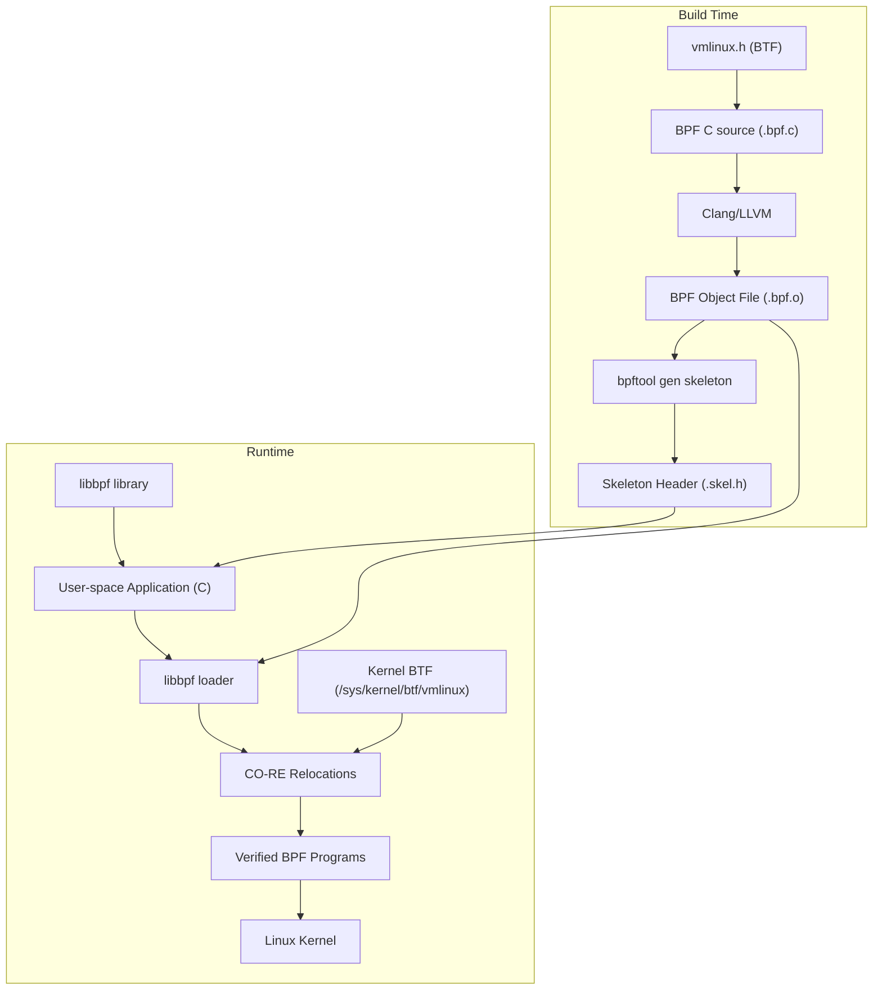
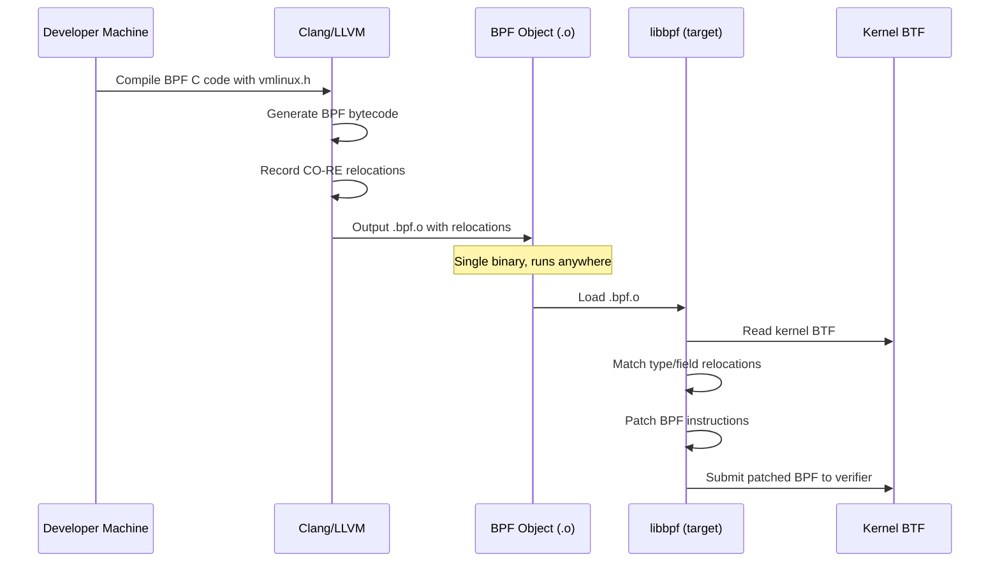

# libbpf Library and BPF CO-RE

## Introduction

libbpf is the official C library for building BPF (Berkeley Packet Filter) applications.
Maintained in the Linux kernel source tree under `tools/lib/bpf/`, it provides a
complete toolkit for loading, verifying, and attaching BPF programs to kernel hooks.
Unlike BCC, which compiles BPF programs at runtime using LLVM/Clang, libbpf works with
pre-compiled BPF object files, resulting in faster load times, lower dependencies, and
better portability through the CO-RE (Compile Once – Run Everywhere) mechanism.

BPF CO-RE is the solution to the fundamental portability problem in BPF development:
BPF programs access kernel internal data structures that change between kernel versions
(fields move, types change, structs are renamed). CO-RE uses BPF Type Format (BTF)
information embedded in the kernel and compiler-generated relocations to automatically
adjust field accesses at load time, enabling a single compiled BPF binary to run
correctly across different kernel versions.

## Architecture



## The Portability Problem

Before CO-RE, BPF developers faced a fundamental challenge: kernel data structures
are not stable. Between kernel versions, the following changes routinely occur:

1. **Field reordering**: Struct members change position
2. **Field addition/removal**: New fields appear, old ones disappear
3. **Type changes**: A field's type changes (e.g., `int` → `unsigned long`)
4. **Struct renaming**: Types are renamed or moved to different headers
5. **Configuration-dependent fields**: Fields exist only with certain `CONFIG_*` options

### Before CO-RE: The BCC Approach

BCC solved portability by compiling BPF C code at runtime using the running kernel's
headers. This works but has significant drawbacks:

```c
// BCC approach: compile against running kernel headers
#include <linux/sched.h>  // Kernel headers needed at runtime

int trace_exec(struct pt_regs *ctx, const char __user *filename) {
    struct task_struct *task = (struct task_struct *)bpf_get_current_task();
    // task->comm works because compiled against THIS kernel's headers
    char comm[TASK_COMM_LEN];
    bpf_probe_read_kernel(&comm, sizeof(comm), &task->comm);
    return 0;
}
```

**Problems:**
- Requires kernel headers installed on every target machine
- LLVM/Clang must be available at runtime (large dependency)
- Compilation adds 1-10 seconds of startup latency
- Different kernel configs may produce incompatible headers

### After CO-RE: The libbpf Approach

```c
// CO-RE approach: compile once, run anywhere
#include "vmlinux.h"     // Generated from BTF, no kernel headers needed
#include <bpf/bpf_helpers.h>

int trace_exec(struct trace_event_raw_sys_enter *ctx) {
    struct task_struct *task = (struct task_struct *)bpf_get_current_task();
    // BPF_CORE_READ automatically handles field relocation
    char comm[TASK_COMM_LEN];
    BPF_CORE_READ(task, comm, comm);
    return 0;
}
```

**Benefits:**
- Single binary runs on any kernel version with BTF enabled
- No runtime compilation — fast startup
- No kernel headers or LLVM required on target machines
- Works across different kernel configurations

## BTF (BPF Type Format)

BTF is the foundation of CO-RE. It is a compact debug format that describes the
types, structures, and layouts used in the kernel.

### Kernel BTF

Modern kernels (5.2+) with `CONFIG_DEBUG_INFO_BTF=y` embed BTF information in
`/sys/kernel/btf/vmlinux`. This describes every type, struct, and field in the
running kernel.

```bash
# Check if kernel BTF is available
ls -la /sys/kernel/btf/vmlinux

# Dump kernel BTF information
bpftool btf dump file /sys/kernel/btf/vmlinux format c | head -50

# Search for specific types
bpftool btf dump file /sys/kernel/btf/vmlinux | grep "struct task_struct"
```

### Generating vmlinux.h

`vmlinux.h` is a header file generated from kernel BTF. It contains all kernel type
definitions needed by BPF programs, replacing the need for kernel headers.

```bash
# Generate vmlinux.h from running kernel
bpftool btf dump file /sys/kernel/btf/vmlinux format c > vmlinux.h

# Generate only specific types (smaller file)
bpftool btf dump file /sys/kernel/btf/vmlinux format c \
    --filter struct task_struct,struct mm_struct > vmlinux.h
```

**Characteristics of vmlinux.h:**
- Contains all kernel types (structs, enums, typedefs)
- Can be very large (5-15 MB for a full dump)
- Stable across kernel versions for CO-RE (types change, but CO-RE handles it)
- Only needed at compile time, not at runtime

## CO-RE Mechanics

### How CO-RE Works



### Relocation Types

The compiler generates three types of CO-RE relocations:

1. **Field access relocations**: Adjust field offsets when struct layouts change
   ```c
   BPF_CORE_READ(task, pid);  // Compiler emits: load from task + offset of pid
   ```

2. **Type existence relocations**: Check if a type exists in the target kernel
   ```c
   if (bpf_core_type_exists(struct some_struct)) {
       // Use struct only if it exists in this kernel
   }
   ```

3. **Enum value relocations**: Adjust enum values that may differ between kernels
   ```c
   int state = BPF_CORE_READ(task, __state);
   // Enum value is adjusted to match target kernel
   ```

### The Matching Algorithm

For field relocations, libbpf uses a multi-step matching strategy:

1. **Name match**: Find a field with the same name
2. **Type match**: Verify the type is compatible
3. **Offset match**: If name matches but offset differs, generate a relocation
4. **Fallback**: If exact match fails, try ancestor types (embedded structs)

```
Source kernel struct task_struct:
  +0: state        (int)
  +4: stack        (void *)
  +8: usage        (int)
  +12: flags       (unsigned int)
  +16: pid         (int)     ← BPF reads this field

Target kernel struct task_struct (field moved):
  +0: __state      (int)     ← renamed from 'state'
  +8: stack        (void *)
  +16: flags       (unsigned int)
  +24: pid         (int)     ← offset changed, CO-RE patches it
  +32: usage       (int)

CO-RE relocation: find 'pid' in target → found at +24 → patch instruction
```

## CO-RE API Reference

### BPF_CORE_READ Family

```c
#include <bpf/bpf_helpers.h>
#include <bpf/bpf_core_read.h>

// Simple field read (handles relocation automatically)
int pid = BPF_CORE_READ(task, pid);

// Nested field read
unsigned long rss = BPF_CORE_READ(task, mm, rss_stat.count[MM_FILEPAGES]);

// Read into user-provided variable
int pid;
BPF_CORE_READ_INTO(&pid, task, pid);

// Chain read (returns error on failure)
int err = bpf_core_read(&pid, sizeof(pid), &task->pid);

// Probe read (safe, returns -EFAULT on bad address)
int err = bpf_probe_read_kernel(&pid, sizeof(pid), &task->pid);
```

### Type and Field Existence Checks

```c
// Check if a type exists in the target kernel
if (bpf_core_type_exists(struct trace_event_raw_sys_enter)) {
    // Type exists, safe to use
}

// Check if a field exists
if (bpf_core_field_exists(task->signal)) {
    // Field exists in this kernel version
}

// Check field size
if (bpf_core_field_size(task->pid) == sizeof(int)) {
    // pid field is an int
}

// Check enum value
if (bpf_core_enum_value_exists(enum bpf_map_type, BPF_MAP_TYPE_RINGBUF)) {
    // Ring buffer map type is supported
}
```

### Flavors (Field Access Variants)

When a field may have different names across kernel versions, use "flavors":

```c
// Try 'signal' first, fall back to 'sighand' if needed
struct signal_struct *sig = BPF_CORE_READ(task, signal);
if (!sig) {
    // Try alternative access pattern
}

// Explicit flavor: access with different name
int state = BPF_CORE_READ(task,
    __state);           // Try __state (newer kernels)
if (state < 0) {
    state = BPF_CORE_READ(task,
        state);         // Fall back to state (older kernels)
}
```

## Skeleton Files

The BPF skeleton is a generated C header that provides a high-level, type-safe
API for managing a BPF application from user space.

### Generating a Skeleton

```bash
# Step 1: Compile BPF source to object file
clang -g -O2 -target bpf -D__TARGET_ARCH_x86 \
    -I./vmlinux.h -c my_bpf.c -o my_bpf.o

# Step 2: Generate skeleton header
bpftool gen skeleton my_bpf.o > my_bpf.skel.h
```

### Using a Skeleton

```c
// my_app.c - User-space application
#include "my_bpf.skel.h"

int main() {
    struct my_bpf *skel;
    int err;

    // Open: parse BPF object, discover maps/programs/globals
    skel = my_bpf__open();
    if (!skel) {
        fprintf(stderr, "Failed to open BPF skeleton\n");
        return 1;
    }

    // Optional: customize BPF program before load
    skel->rodata->target_pid = getpid();

    // Load: verify and load BPF programs into kernel
    err = my_bpf__load(skel);
    if (err) {
        fprintf(stderr, "Failed to load BPF skeleton\n");
        goto cleanup;
    }

    // Attach: attach BPF programs to kernel hooks
    err = my_bpf__attach(skel);
    if (err) {
        fprintf(stderr, "Failed to attach BPF programs\n");
        goto cleanup;
    }

    printf("BPF program loaded and attached. Running...\n");

    // Access maps and global variables directly
    while (1) {
        sleep(1);
        printf("Counter: %d\n", skel->bss->my_counter);
    }

cleanup:
    my_bpf__destroy(skel);
    return -err;
}
```

### Skeleton Structure

The generated skeleton provides:

```c
struct my_bpf {
    struct {
        // Read-only data (set before load)
        struct my_bpf__rodata {
            int target_pid;
            const char filter_name[16];
        } *rodata;

        // BSS (read/write, accessible from both sides)
        struct my_bpf__bss {
            int my_counter;
            struct event last_event;
        } *bss;

        // Data section
        struct my_bpf__data {
            // ...
        } *data;

        // Maps
        struct bpf_map *events;
        struct bpf_map *counts;

        // Programs
        struct bpf_program *handle_exec;
        struct bpf_program *handle_exit;
    };

    // Links (for attachment management)
    struct {
        struct bpf_link *handle_exec;
        struct bpf_link *handle_exit;
    } links;
};
```

## Complete Example: Process Tracer

### BPF Program (process.bpf.c)

```c
// SPDX-License-Identifier: GPL-2.0
#include "vmlinux.h"
#include <bpf/bpf_helpers.h>
#include <bpf/bpf_core_read.h>
#include <bpf/bpf_tracing.h>

#define TASK_COMM_LEN 16
#define MAX_FILENAME_LEN 256

char LICENSE[] SEC("license") = "GPL";

struct event {
    u32 pid;
    u32 ppid;
    u32 uid;
    u64 timestamp_ns;
    char comm[TASK_COMM_LEN];
    char filename[MAX_FILENAME_LEN];
};

struct {
    __uint(type, BPF_MAP_TYPE_RINGBUF);
    __uint(max_entries, 256 * 1024);
} events SEC(".maps");

SEC("tracepoint/syscalls/sys_enter_execve")
int handle_exec(struct trace_event_raw_sys_enter *ctx)
{
    struct event *e;
    struct task_struct *task;

    e = bpf_ringbuf_reserve(&events, sizeof(*e), 0);
    if (!e)
        return 0;

    task = (struct task_struct *)bpf_get_current_task();

    e->timestamp_ns = bpf_ktime_get_ns();
    e->pid = BPF_CORE_READ(task, pid);
    e->ppid = BPF_CORE_READ(task, real_parent, pid);
    e->uid = bpf_get_current_uid_gid();
    bpf_get_current_comm(&e->comm, sizeof(e->comm));

    bpf_probe_read_user_str(&e->filename, sizeof(e->filename),
                             (void *)ctx->args[0]);

    bpf_ringbuf_submit(e, 0);
    return 0;
}
```

### User-Space Application (process.c)

```c
#include <stdio.h>
#include <stdlib.h>
#include <string.h>
#include <unistd.h>
#include <signal.h>
#include <time.h>
#include <bpf/libbpf.h>
#include "process.skel.h"

static volatile sig_atomic_t exiting = 0;

struct event {
    unsigned int pid;
    unsigned int ppid;
    unsigned int uid;
    unsigned long long timestamp_ns;
    char comm[16];
    char filename[256];
};

static void sig_handler(int sig) {
    exiting = 1;
}

static int handle_event(void *ctx, void *data, size_t data_sz) {
    const struct event *e = data;
    struct tm *tm;
    char ts[32];
    time_t t;

    t = e->timestamp_ns / 1000000000;
    tm = localtime(&t);
    strftime(ts, sizeof(ts), "%H:%M:%S", tm);

    printf("%-8s %-7d %-7d %-7d %-16s %s\n",
           ts, e->pid, e->ppid, e->uid, e->comm, e->filename);
    return 0;
}

int main(int argc, char **argv) {
    struct process_bpf *skel;
    struct ring_buffer *rb = NULL;
    int err;

    signal(SIGINT, sig_handler);
    signal(SIGTERM, sig_handler);

    // Open and load BPF program
    skel = process_bpf__open_and_load();
    if (!skel) {
        fprintf(stderr, "Failed to open/load BPF skeleton\n");
        return 1;
    }

    // Attach
    err = process_bpf__attach(skel);
    if (err) {
        fprintf(stderr, "Failed to attach BPF programs\n");
        goto cleanup;
    }

    // Set up ring buffer
    rb = ring_buffer__new(bpf_map__fd(skel->maps.events),
                          handle_event, NULL, NULL);
    if (!rb) {
        fprintf(stderr, "Failed to create ring buffer\n");
        err = -1;
        goto cleanup;
    }

    printf("%-8s %-7s %-7s %-7s %-16s %s\n",
           "TIME", "PID", "PPID", "UID", "COMM", "FILENAME");

    while (!exiting) {
        err = ring_buffer__poll(rb, 100);
        if (err < 0) {
            fprintf(stderr, "Error polling ring buffer: %d\n", err);
            break;
        }
    }

cleanup:
    ring_buffer__free(rb);
    process_bpf__destroy(skel);
    return err != 0;
}
```

### Build System (Makefile)

```makefile
CLANG ?= clang
BPFTOOL ?= bpftool
ARCH := $(shell uname -m | sed 's/x86_64/x86/')

.PHONY: all clean

all: process

# Generate vmlinux.h
vmlinux.h:
	$(BPFTOOL) btf dump file /sys/kernel/btf/vmlinux format c > $@

# Compile BPF program
process.bpf.o: process.bpf.c vmlinux.h
	$(CLANG) -g -O2 -target bpf -D__TARGET_ARCH_$(ARCH) \
		-I. -c $< -o $@

# Generate skeleton
process.skel.h: process.bpf.o
	$(BPFTOOL) gen skeleton $< > $@

# Compile user-space application
process: process.c process.skel.h
	$(CC) -g -Wall -o $@ $< -lbpf -lelf -lz

clean:
	rm -f process process.bpf.o process.skel.h vmlinux.h
```

## libbpf APIs

### Map Operations

```c
// Create a map (usually defined in BPF source, accessed via skeleton)
int map_fd = bpf_map__fd(skel->maps.my_map);

// Lookup
struct event e;
bpf_map_lookup_elem(map_fd, &key, &e);

// Update
bpf_map_update_elem(map_fd, &key, &e, BPF_ANY);

// Delete
bpf_map_delete_elem(map_fd, &key);

// Iterate
int key, next_key;
key = 0;
while (bpf_map_get_next_key(map_fd, &key, &next_key) == 0) {
    bpf_map_lookup_elem(map_fd, &next_key, &value);
    // process value
    key = next_key;
}

// Ring buffer (preferred for high-throughput events)
struct ring_buffer *rb = ring_buffer__new(map_fd, handle_event, NULL, NULL);
ring_buffer__poll(rb, timeout_ms);
ring_buffer__free(rb);
```

### Program Attachment

```c
// Attach to tracepoint
struct bpf_link *link = bpf_program__attach_tracepoint(
    skel->programs.my_prog, "syscalls", "sys_enter_execve");

// Attach to kprobe
struct bpf_link *link = bpf_program__attach_kprobe(
    skel->programs.my_prog, false /* not retprobe */, "vfs_read");

// Attach to kretprobe
struct bpf_link *link = bpf_program__attach_kprobe(
    skel->programs.my_prog, true /* retprobe */, "vfs_read");

// Attach to uprobe
struct bpf_link *link = bpf_program__attach_uprobe(
    skel->programs.my_prog, false, -1 /* all PIDs */,
    "/usr/lib/libc.so.6", 0x12345 /* offset */);

// Attach to perf event (software counter)
struct bpf_link *link = bpf_program__attach_perf_event(
    skel->programs.my_prog, perf_fd);
```

### Global Variables and Constants

```c
// BPF side (process.bpf.c):
const volatile int target_pid = 0;  // Set by user-space before load
int my_counter = 0;                  // Read/written from both sides

// User space (before load):
skel->rodata->target_pid = 1234;

// User space (read after BPF runs):
printf("Counter: %d\n", skel->bss->my_counter);
```

## libbpf-bootstrap

The libbpf-bootstrap project provides templates for starting new libbpf-based
BPF applications:

```bash
# Clone the bootstrap template
git clone https://github.com/libbpf/libbpf-bootstrap.git
cd libbpf-bootstrap

# List available examples
ls examples/c/

# Build and run the minimal example
cd examples/c
make minimal
sudo ./minimal

# Build and run the bootstrap example (process tracer)
make bootstrap
sudo ./bootstrap
```

### Example Output

```
TIME     PID     PPID    COMM      FILENAME
12:34:56 12345   1234    bash      /usr/bin/ls
12:34:56 12346   12345   ls        /etc/ld.so.preload
12:34:56 12346   12345   ls        /lib/x86_64-linux-gnu/libc.so.6
```

## Debugging libbpf Applications

### Verbose Logging

```c
// Enable libbpf debug logging
libbpf_set_print(libbpf_print_fn);

static int libbpf_print_fn(enum libbpf_print_level level,
                            const char *format, va_list args) {
    return vfprintf(stderr, format, args);
}
```

### BPF Verifier Logs

```bash
# Enable verbose BPF verifier output
sudo cat /sys/kernel/debug/tracing/trace_pipe

# Use bpftool to inspect loaded programs
sudo bpftool prog list
sudo bpftool prog show id <PROG_ID>
sudo bpftool prog dump xlated id <PROG_ID>
```

### Common Issues and Solutions

| Issue | Cause | Solution |
|-------|-------|----------|
| "CO-RE relocation failed" | Missing BTF in kernel | Enable `CONFIG_DEBUG_INFO_BTF=y` |
| "Field not found" | Struct layout changed | Use `bpf_core_field_exists()` |
| "Verifier rejected" | Unsafe memory access | Use `BPF_CORE_READ()` helpers |
| "Permission denied" | Insufficient privileges | Run as root or with `CAP_BPF` |
| "Map not found" | Map name mismatch | Check `.maps` section name |

## BCC vs. libbpf Comparison

| Aspect | BCC | libbpf |
|--------|-----|--------|
| **Compilation** | Runtime (LLVM) | Build-time (Clang) |
| **Dependencies** | BCC, LLVM, Clang, kernel headers | libbpf, libelf, zlib |
| **Binary size** | N/A (interpreted) | Small (single binary) |
| **Startup time** | 1-10 seconds | < 100 ms |
| **Portability** | Requires matching headers | CO-RE across versions |
| **Kernel headers** | Required at runtime | Not needed (uses BTF) |
| **Language** | Python, Lua | C or C++ |
| **API stability** | May change | Stable (kernel tree) |
| **Production use** | Prototyping, one-offs | Production tools |
| **Learning curve** | Lower (Python) | Higher (C) |

## Key Differences from BCC

1. **No runtime compilation**: BPF programs are pre-compiled. No LLVM/Clang needed
   on target machines.
2. **vmlinux.h instead of kernel headers**: Generated from BTF, contains all types.
3. **CO-RE relocations**: The compiler records what needs patching; libbpf does it
   at load time using the target kernel's BTF.
4. **Skeleton pattern**: Auto-generated code simplifies the user-space↔BPF interface.
5. **Ring buffer**: `BPF_MAP_TYPE_RINGBUF` replaces `BPF_PERF_OUTPUT` for
   high-throughput event streaming.

## References

- libbpf kernel documentation: https://docs.kernel.org/bpf/libbpf/libbpf_overview.html
- Andrii Nakryiko, "BPF CO-RE (Compile Once – Run Everywhere),"
  https://nakryiko.com/posts/bpf-portability-and-co-re/
- Andrii Nakryiko, "BPF CO-RE Reference Guide,"
  https://nakryiko.com/posts/bpf-core-reference-guide/
- libbpf-bootstrap: https://github.com/libbpf/libbpf-bootstrap
- libbpf GitHub: https://github.com/libbpf/libbpf
- bpftool documentation: https://manpages.ubuntu.com/manpages/noble/man8/bpftool.8.html
- BPF Type Format (BTF): https://www.kernel.org/doc/html/latest/bpf/btf.html
- Brendan Gregg, "BPF Performance Tools" (Addison-Wesley, 2019)
- eBPF CO-RE documentation: https://docs.ebpf.io/concepts/core/
